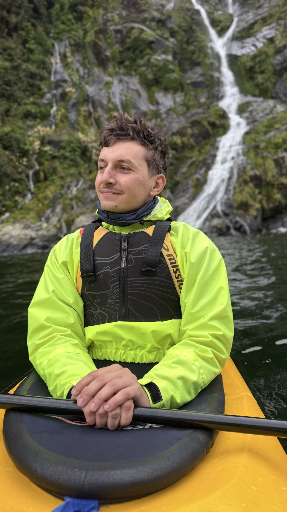
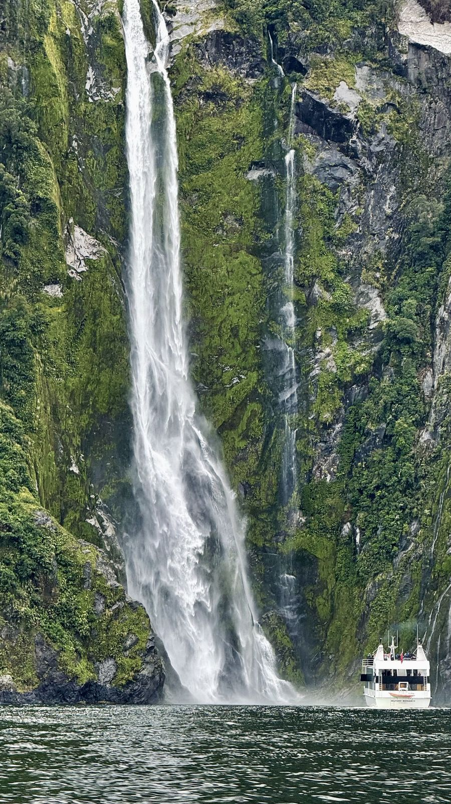
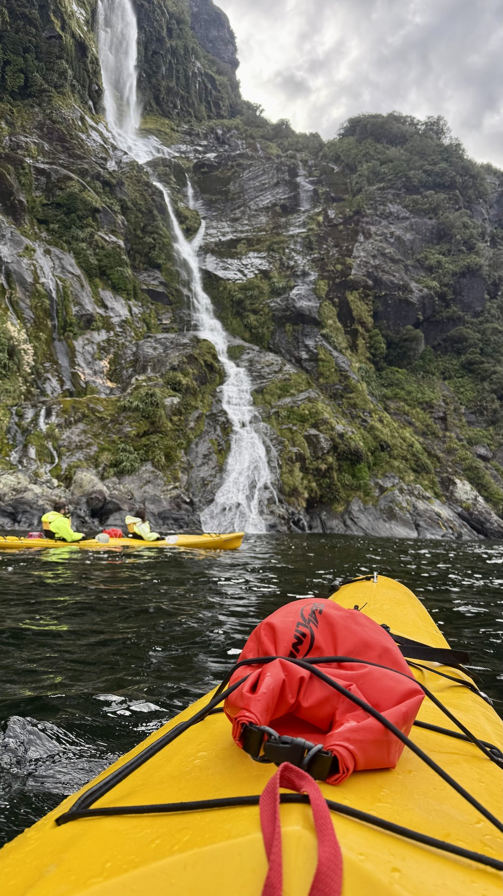

Я сел в каяк, и через десять минут перестал понимать, где я. Стены фьорда уходят вертикально вверх на километр с лишним и втыкаются в облако. Задница в десяти сантиметрах от чёрной воды. Тишина — такая, что слышно, как с вёсла капает. И где-то справа гудит водопад, которого ещё не видно. Большой круизный катер прошёл мимо в полукилометре — я слышал его двигатель раньше, чем увидел корпус, и долго после, как он скрылся. **90% людей видят Милфорд-Саунд с палубы за два часа. Я три дня заходил в него с уровня воды — и это другая планета.**

Дальше — без воды: каяк или круиз, когда сюда ехать (и почему дождь это плюс), как добраться, сколько стоит и что не делать. Всё проверено лично в марте 2026.

> **Если коротко:** Милфорд-Саунд — фьорд на юго-западе Южного острова. Круиз ~**100–120 NZD** (2 ч, ты зритель), каяк-тур ~**230–260 NZD** (4–5 ч, ты внутри). Дождь — не враг, а **главное шоу**: каждая стена покрывается сотней водопадов. Ехать база — **Те-Анау (2 ч)**, не однодневкой из Квинстауна (4+ ч в один конец). Виза россиянам **от 441 NZD + IVL 100**, NZeTA не подходит. Мошка namu — репеллент с DEET обязателен.

> **Когда лучше ехать в Новую Зеландию:** [таблица сезонов](/seasons/) — для Фьордленда это, как ни странно, дождливые месяцы.

> По некоторым ссылкам в гайде можно сразу забронировать или оформить — цена для вас та же, а блог получает небольшую комиссию. Это держит его бесплатным. Такие ссылки помечены .

---

## Почему дождь в Милфорд-Саунд — это плюс, а не минус

Главное, что нужно понять про это место, противоречит здравому смыслу. Милфорд-Саунд — одно из самых дождливых мест на планете: **больше 200 дождливых дней в году, 6–8 метров осадков**. Турист видит прогноз «дождь всю неделю» и отменяет поездку. Это ошибка.

В Милфорде постоянных водопадов всего два — Стирлинг и Леди-Боуэн. Всё остальное — **временные водопады, которые включает дождь**. После хорошего ливня каждая отвесная стена сверху донизу покрывается сотней струй: вода не успевает впитываться в почти отсутствующую почву на голом камне и просто сливается вниз. Это и есть та картинка, ради которой сюда едут.

Солнечный Милфорд красивый, но **пустой**: пара водопадов, синее небо, и всё. Дождливый Милфорд — это стены, которые текут целиком, низкие облака, цепляющиеся за пики, и ощущение, что ты внутри живого организма. Я был там в морось и в нормальный ливень — ливень в разы сильнее.

Практический вывод: **не отменяй поездку из-за дождя в прогнозе. Наоборот, подгадывай под него.** Единственное, что реально убивает Милфорд — не дождь, а сильный ветер (отменяют каяк-туры) и снег зимой (закрывают дорогу из-за лавин).

---

## Каяк или круиз — что выбрать

Это первый вопрос, который нужно решить, и от него зависит весь день. Коротко: если можешь только одно — каяк. Если с детьми, по времени впритык или физически тяжело — круиз.

| | Круиз | Морской каяк |
|---|---|---|
| Цена | ~100⁠–⁠120 NZD | ~230⁠–⁠260 NZD |
| Длительность | 1.5⁠–⁠2 ч | 4⁠–⁠5 ч (из них ~2.5 ч на воде) |
| Что ты | зритель на палубе | внутри фьорда, на уровне воды |
| Подходит | всем, детям, при нехватке времени | кто хочет тишину и не боится грести |
| Подготовка | ноль | базовая, новичков берут |

**Круиз.** Большие катера (Southern Discoveries, RealNZ) и маленькие (Mitre Peak Cruises — меньше людей, ближе подходят к стенам). Маршрут одинаковый: выход к Тасманову морю и обратно, с заходом носом под Стирлинг-Фоллс, чтобы палубу окатило. Два часа, кофе, аудиогид. Нормальный вариант, если Милфорд — одна из точек плотного маршрута.

**Каяк.** Гид, сухая куртка поверх своей одежды, инструктаж 15 минут, дальше 2.5 часа гребёшь сам. Берут новичков — фьорд закрытый, волны почти нет, кроме редких дней. Операторы — Roscos Milford Kayaks и Go Orange. Разница с круизом не в цене, а в том, что с каяка ты **слышишь** фьорд, подходишь вплотную к стене под водопад и можешь просто перестать грести и сидеть в полной тишине. Втрое дороже и в разы сильнее.

Гибрид для тех, кто не уверен: комбо каяк + круиз — час на каяке плюс круиз, около 200 NZD. Компромисс, но если выбирать осознанно — бери чистый каяк-тур на полдня.

---

## Когда ехать — сезон, мошка, толпы

**Сезон каяков — примерно октябрь–апрель.** Зимой (июнь–август) каяк-туры почти не ходят, дорога периодически закрыта по лавинной опасности, но сам фьорд зимой суровый и пустой — на круизе реально.

* **Осень (март–апрель)** — мой выбор. Меньше людей, заметно меньше мошки, драматичный свет: низкая облачность, которая и делает кадр. Я ездил в марте — идеально.
* **Лето (декабрь–февраль)** — пик. Свет лучше, но толпы автобусов в полдень и **мошка в режиме атаки**.
* **Весна (октябрь–ноябрь)** — талая вода, водопады мощные, людей меньше летнего пика.

**Про мошку — это важно, многие недооценивают.** Главный местный вредитель не комар, а песчаная мошка **namu** (sandfly). На берегу Милфорда в безветрие она сжирает за минуты. Репеллент с **DEET** — обязателен, мажься до того, как вышел из машины, а не после первого укуса. На воде в каяке её сдувает, проблема только на стоянках и берегу.

**Лайфхак по времени суток.** Дневные круизы 11:00–14:00 — это автобусы из Квинстауна, толпа и очередь на причале. Бери **первый утренний или последний дневной слот** — те же стены, но почти пустой фьорд. Каяк-туры в этом смысле всегда выигрывают: групп мало, на воде ты часто один в кадре.

---

## Как добраться до Милфорд-Саунд в 2026?

Милфорд — тупик. Туда ведёт одна дорога (State Highway 94, Milford Road), и сама дорога — половина впечатления.

**Откуда стартовать:**

* **Те-Анау — правильная база.** 2 часа до фьорда. Ночуешь здесь или прямо в Milford Sound Lodge у фьорда — берёшь ранний слот без дневных толп. Так я и делал.
* **Квинстаун — популярно, но тяжело.** 4+ часа в один конец. Однодневный тур из Квинстауна = 12–13 часов, из них 8 в автобусе, фьорд — галопом в полдень в толпе. Если иначе никак — бери тур с перелётом обратно (автобус туда + круиз + самолёт обратно), не автобус туда-обратно.

**Сама Milford Road** — не перегон, а аттракцион. Закладывай на неё лишние 2–3 часа и остановки:

* **Mirror Lakes** — зеркальные озёра с отражением гор, 5 минут от парковки.
* **Eglinton Valley** — широкая ледниковая долина, открыточный кадр.
* **Monkey Creek** — ручей с питьевой ледниковой водой, набери флягу.
* **Homer Tunnel** — однополосный тоннель, пробитый в скале, светофор, ждёшь до 15 минут. За ним дорога серпантином падает к фьорду.
* **The Chasm** — короткая тропа к промытым водой каменным котлам, 20 минут.
* **Key Summit** — если есть полдня и силы, боковая тропа с Routeburn Track, альпийские виды.

**Машина или автобус.** Машина — свобода по остановкам и времени. Но: на Milford Road **нет заправок и связи**, последняя АЗС в Те-Анау — заливайся под полный бак там. Аренда 40–70 USD/день (Jucy, Apex; по данным операторов на май 2026, проверяй на сайтах) — <a href="https://economybookings.tpk.mx/xlSFNA6p?erid=2VtzqxYvA5V" class="aff-cta" rel="sponsored">Сравнить прокат авто в Новой Зеландии</a>: агрегатор показывает локальных и международных прокатчиков с ценой под твои даты, бронь без предоплаты — удобно поймать машину на отрезок Квинстаун — Те-Анау. Если без машины — автобус из Те-Анау, дешевле тура из Квинстауна.

---

## Что увидеть в самом фьорде

**Митре-Пик** — пирамида 1692 м, поднимается прямо из воды. Классический кадр Милфорда — это он. **Стирлинг-Фоллс** — 155 м, постоянный, под него заходят катера. **Леди-Боуэн-Фоллс** — 162 м, второй постоянный, виден от причала. Остальные сотни — дождевые, появляются и исчезают за часы.

Живность: новозеландские котики на Seal Rock почти гарантированно, дельфины-афалины и пингвины Фьордленда — как повезёт. Есть подводная обсерватория Milford Discovery Centre — единственное место, где видно эффект всплытия глубоководных видов на малой глубине: из-за слоя пресной тёмной воды сверху кораллы и чёрный коралл растут на нетипично малой глубине.

Если есть 3–4 дня и хочется не точку, а маршрут — **Milford Track**, один из Great Walks, 53 км за 4 дня с хижинами. Бронь за месяцы, сезон октябрь–апрель. Альтернатива потише — **Даутфул-Саунд**: дольше и дороже добираться (через озеро Манапоури + перевал), зато в разы меньше людей и ощущение полной изоляции.

---

## Нужна ли виза в Новую Зеландию россиянам в 2026?

Новая Зеландия — не лояльная страна для российского паспорта. **NZeTA россиянам не подходит**, нужна полноценная гостевая виза. Через посредников не дешевле, через знакомых не быстрее — только официальный путь.

* Тип: **Visitor Visa**, онлайн через [immigration.govt.nz](https://www.immigration.govt.nz/new-zealand-visas/options/visit).
* Стоимость: **Visitor Visa — от 441 NZD** ([immigration.govt.nz](https://www.immigration.govt.nz/visas/visitor-visa/), точная сумма зависит от страны подачи) + **International Visitor Levy 100 NZD** + сервисный сбор визового центра (изменён с 1 января 2026). Точную сумму под свой случай — в калькуляторе на immigration.govt.nz.
* Срок пребывания: до **9 месяцев** за въезд.
* Документы: загранпаспорт, фото, билеты, бронь жилья, выписка со счёта (~1000 NZD на каждый месяц поездки), маршрут.
* Рассмотрение: **1–4 недели**, в пик до 8. Подавать минимум за **2 месяца**.

 С 2024 для россиян обязательна **биометрия**. Визовые центры VFS — Стамбул, Дубай, Бангкок, Алматы, Ереван. Закладывай перелёт + 1–2 дня в бюджет и график. Из Москвы по опыту проще через Стамбул.

> **Подробно про эту визу и охоту за южным сиянием:** [Южное сияние в Новой Зеландии 2026](/blog/aurora-new-zealand-2026/) — там же детальный разбор маршрута по Южному острову и биометрии. Про биометрию в Шенгене — [EES 2026](/blog/ees-shengen-2026/).

---

## Как добраться из России

Прямых рейсов нет и не будет. Минимум одна пересадка, обычно две.

Цены ниже — диапазоны по Aviasales на май 2026, туда-обратно, эконом; реальную проверяй под свои даты.

* **Через Дубай** (Emirates): Москва → Дубай → Окленд, ~24 ч в воздухе, **1700–2400 USD** туда-обратно. Самый частый.
* **Через Доху** (Qatar): чуть дольше, сервис лучше, **1800–2500 USD**.
* **Через Гонконг** (Cathay): иногда дешевле, **1600–2200 USD**.

Сравнить стыковки и цены — <a href="https://aviasales.tpk.mx/JCSPlC17?erid=2Vtzqxkn4LF&u=https%3A%2F%2Fwww.aviasales.ru%2F%3Forigin_iata%3DMOW%26destination_iata%3DAKL" class="aff-cta" rel="sponsored">Найти билет Москва — Окленд</a>: на дальнем маршруте с двумя пересадками агрегатор сравнивает все авиакомпании и стыковки сразу — видно, где разница в цене и где короче пересадка, cookie 30 дней, так что можно забронировать позже.

**Для Фьордленда лети сразу на юг.** Не Окленд, а внутренним рейсом дальше: **Окленд → Квинстаун (ZQN)**, 120–250 USD, 2 ч (Air NZ / Jetstar, по Aviasales на май 2026). Из Квинстауна до Те-Анау 2 часа на машине, дальше Milford Road. Не теряй день на акклиматизацию на Северном острове.

---

## Сколько стоит поездка в Милфорд-Саунд?

Это расчёт именно на связку Квинстаун → Те-Анау → Милфорд на 2 ночи / 1 человека, без перелёта из РФ (он в [бюджете aurora-гайда](/blog/aurora-new-zealand-2026/)).

| Статья | Эконом | Комфорт |
|---|---|---|
| Каяк-тур Милфорд | 240 USD | 240 USD |
| Аренда машины 3 дня + бензин | 180 USD | 320 USD |
| Жильё Те-Анау (2 ночи) | 110 USD | 360 USD |
| Еда 3 дня | 90 USD | 220 USD |
| Запас (мошка, мелочи) | 30 USD | 60 USD |
| **Итого на человека** | **~650 USD** | **~1200 USD** |

Где экономить без потери впечатления: хостел YHA в Те-Анау вместо лоджа (<a href="https://ostrovok.tpk.mx/xtyTcUcY?erid=2VtzqvE1cv3" class="aff-cta" rel="sponsored">Забронировать жильё в Те-Анау</a> — Ostrovok принимает Visa/MC/МИР, в Те-Анау лучше бронировать заранее: посёлок маленький, в пик всё разбирают), готовка на общей кухне мотеля, машину делить на 3–4 человек. На чём не экономить: каяк-тур и репеллент с DEET.

> **Считаешь весь бюджет поездки:** [калькулятор](/calculator/) — перелёт, отель и питание по 70+ направлениям с курсом ЦБ РФ.

---

## Чтобы не испортить поездку

Несколько вещей, которые реально портят Милфорд, если не подготовиться.

**Однодневка из Квинстауна на автобусе.** 8 часов в дороге ради 2 часов в полдень в толпе. Если едешь — ночуй в Те-Анау или бери fly-вариант обратно.

**Отмена из-за прогноза дождя.** Дождь — это и есть Милфорд. Отменяй только при штормовом ветре (снимут каяк) или снеге зимой (закроют дорогу).

**Бронь в последний момент летом.** Каяк-мест мало, в декабре–феврале разбирают за недели. Бронируй заранее, осенью можно позже.

**Поехал без репеллента.** namu сожрёт на причале до старта. DEET — до выхода из машины.

**Не заправился в Те-Анау.** На Milford Road нет ни АЗС, ни связи. Пустой бак тут — реальная проблема.

**Ждал тишины на дневном круизе.** Полдень — это автобусы. Хочешь тишину — каяк или ранний/поздний слот.

---

## FAQ

**Каяк в Милфорд-Саунд безопасен для новичка?**
Да. Фьорд закрытый, волны почти нет, гид рядом, инструктаж перед стартом. Физуха нужна базовая — 2.5 часа грести с перерывами. Туры отменяют только при сильном ветре, как раз ради безопасности.

**Сколько дней закладывать на Милфорд?**
Минимум одну ночь в Те-Анау + полный день на фьорд и дорогу. Оптимально 2 ночи — есть запас по погоде и время на остановки по Milford Road. Однодневкой из Квинстауна можно, но это на выживание.

**Милфорд или Даутфул-Саунд?**
Милфорд — драматичнее, выше стены, больше водопадов, но людно. Даутфул — тише и изолированнее, но дольше и дороже добираться. Первый раз — Милфорд. Даутфул — когда уже был и хочешь без толп.

**Можно без тура, самому?**
До фьорда — да, на своей машине. На воду — только с туром (каяк или круиз): частных лодок на фьорде нет, плюс погода и логистика. Сам фьорд с берега почти не виден — нужен выход на воду.

**Мошка реально проблема?**
На берегу и парковке в безветрие — да, серьёзная. На воде сдувает. Решается репеллентом с DEET, нанесённым заранее. Без него летом будет мучение.

**Лучшее время суток для круиза?**
Первый утренний или последний дневной слот. Полдень — пик автобусных туров, толпа и очередь. Свет в Милфорде чаще ровный из-за облачности, так что время суток влияет больше на людей, чем на кадр.

**Стоит ли ехать в дождь?**
Да, дождь усиливает Милфорд: сотни временных водопадов вместо двух постоянных. Отменять стоит при штормовом ветре или зимнем снеге, не при дожде.

**Что такое Milford Track?**
Пеший маршрут 53 км за 4 дня с хижинами, один из Great Walks Новой Зеландии. Бронь за месяцы, сезон октябрь–апрель. Это не про однодневный визит, а отдельная экспедиция к фьорду пешком.

---

## Что делать дальше

* [Южное сияние в Новой Зеландии 2026](/blog/aurora-new-zealand-2026/) — второй гайд по НЗ: маршрут Южного острова, виза и биометрия детально
* [Таблица сезонов](/seasons/) — оптимальные месяцы для НЗ и 70+ направлений
* [Калькулятор бюджета](/calculator/) — перелёт, проживание и курс ЦБ РФ
* [Гайд по Японии 2026](/blog/japan-guide-2026/) — частый компаньон для НЗ через Сингапур
* [EES биометрия в Шенгене](/blog/ees-shengen-2026/) — если летишь через Европу
* [Подпишись на @traveltriberu](https://t.me/traveltriberu) — разборы стран без воды

---

*Актуально на: 17 мая 2026. Стоимость визы и International Visitor Levy — по официальному сайту Immigration New Zealand. Цены на каяк-туры и круизы — операторы Roscos Milford Kayaks, Go Orange, Southern Discoveries, RealNZ на момент поездки. Цены на перелёты — Aviasales и официальные сайты авиакомпаний. Курсы валют ЦБ РФ.*
