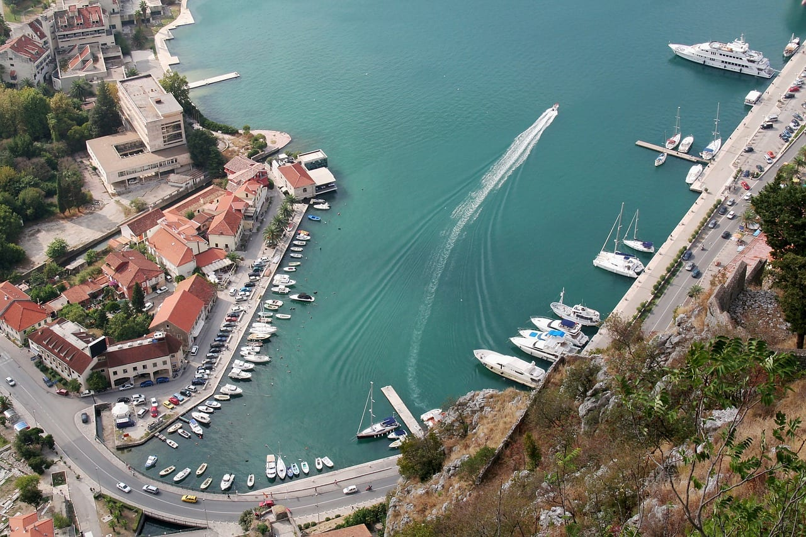
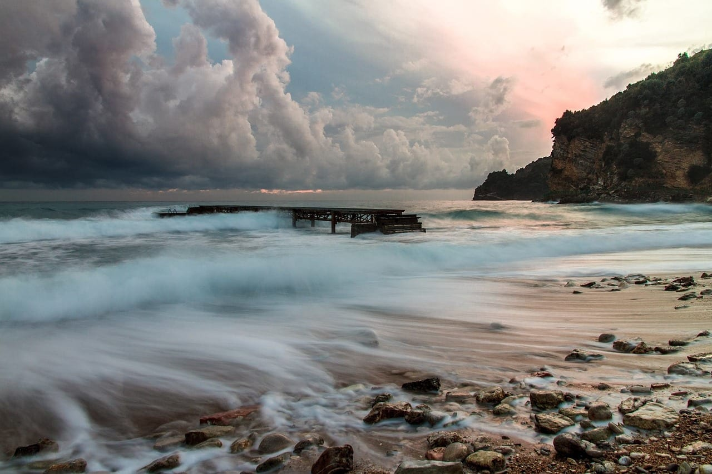
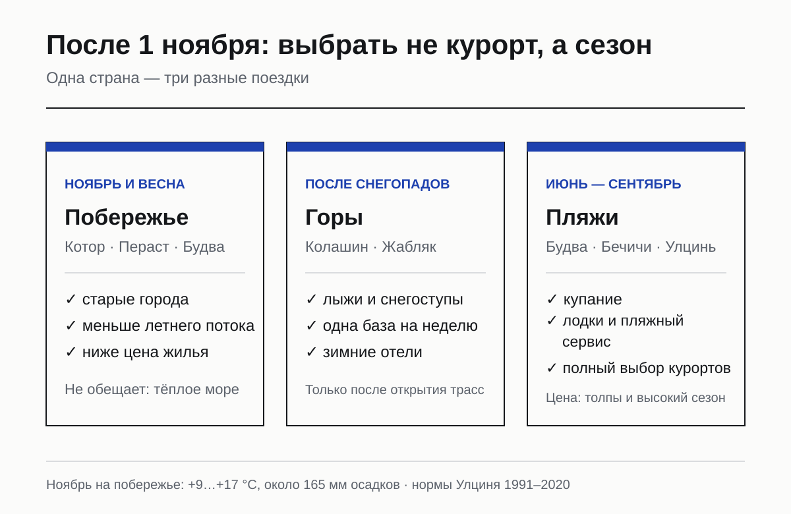
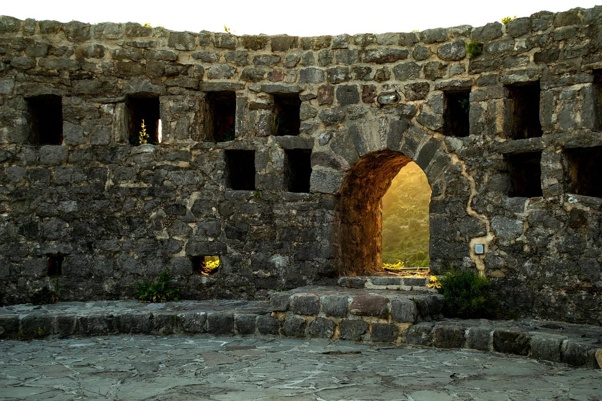
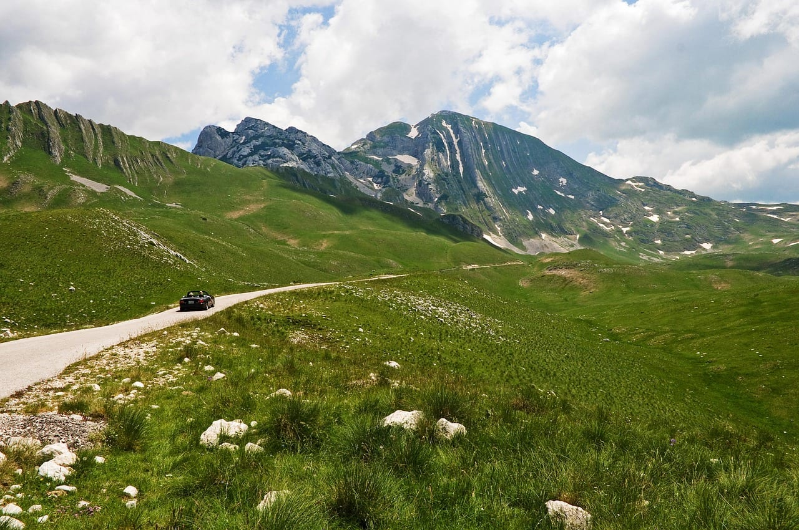
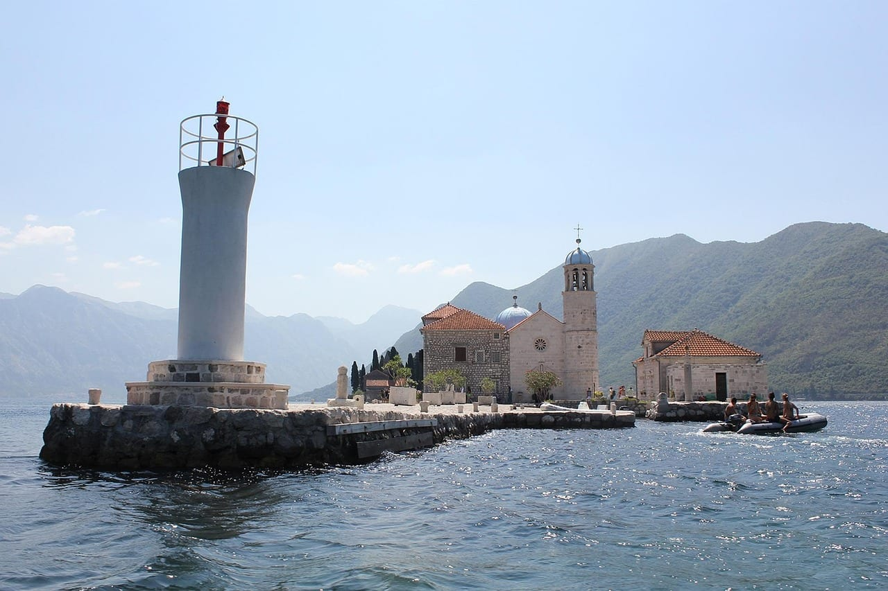
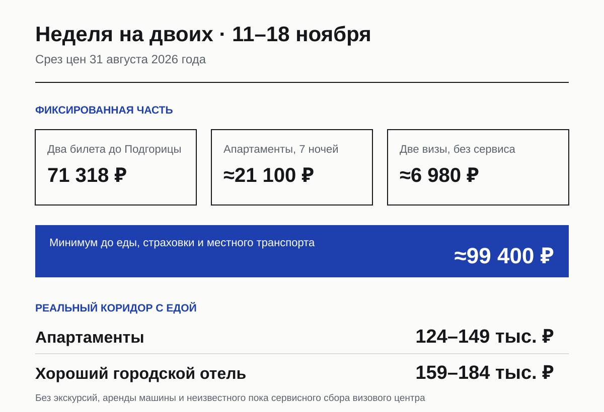
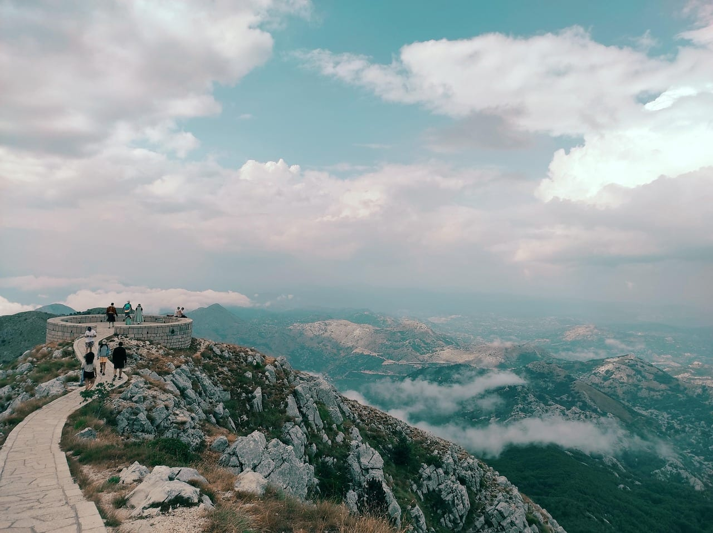
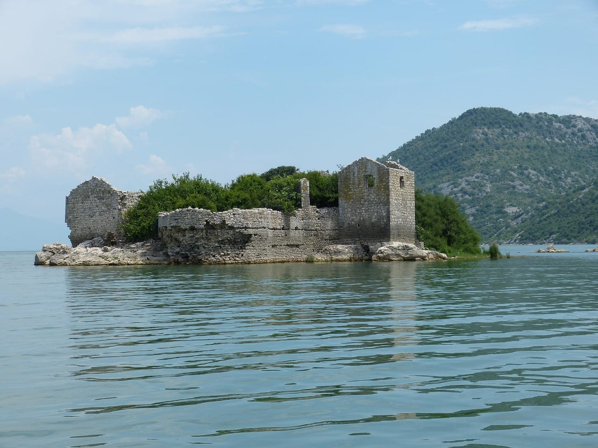

import AffiliateNote from '../../components/post/AffiliateNote.astro';
import { aviasalesRoute, cherehapaCountry, ostrovokCity } from '../../data/affiliate.js';

export const flights = aviasalesRoute('MOW', 'TGD', 'montenegro_after_november_2026_flights', 10);
export const stay = ostrovokCity('montenegro', 'budva', 'montenegro_after_november_2026_stay');
export const insurance = cherehapaCountry('montenegro', 'montenegro_after_november_2026_insurance');

Первое ноября меняет не саму Черногорию, а цену входа в неё. Море, венецианские города и горы остаются на месте, но к билетам и жилью добавляется виза. Одновременно заканчивается привычный пляжный сценарий: в ноябре побережье не выбирают ради гарантированного купания.

Поэтому вопрос «стоит ли ехать после 1 ноября» надо разделить на два. Для Котора без круизных толп, прогулок по Боко-Которской бухте и зимних гор — да. Для недели у тёплого моря — нет. Ниже именно отпускной разбор: куда поселиться, чего ждать от сезона, как лететь и сколько денег заложить. Документы, адреса визовых центров и исключения подробно разобраны [на отдельной странице про визу в Черногорию](/blog/montenegro-visa-2026/).

> **Если коротко:** с **1 ноября 2026 года** россиянину нужна виза C, если нет действующей шенгенской визы или другого подтверждённого основания для освобождения. Ноябрь на южном побережье — примерно **+9…+17 °C** и около **165 мм осадков за десять дождливых дней**; это городская поездка, а не пляжная. В срезе на 31 августа билет Москва—Подгорица на 11–18 ноября стоил **от 35 659 ₽ туда-обратно** на человека с двумя пересадками в каждую сторону. Семь ночей в Будве на двоих — **от 230 $ + 14 € сборов**, то есть около 21 100 ₽. Фиксированный минимум на двоих — примерно **99 400 ₽** до еды, страховки, сервисного сбора визового центра и местного транспорта. <a href={flights} class="aff-cta" rel="sponsored">Посмотреть перелёты Москва — Подгорица на ноябрь</a> — поиск открывается на конкретном маршруте, цены всё равно надо переснять под свои даты.

<AffiliateNote />

## Что меняется 1 ноября

Правительство Черногории приняло новое визовое правило 23 июля 2026 года, дата начала — **1 ноября**. До 31 октября россияне въезжают по загранпаспорту на срок до 30 дней; после — по визе категории C.

Есть исключения. Обе официальные версии страницы виз совпадают в четырёх надёжных основаниях: действующая шенгенская виза, виза США, Великобритании или Ирландии, а также вид на жительство в ЕС. Они дают до 30 дней без отдельной черногорской визы. Более широкий список на английской странице расходится с черногорской версией, поэтому визу Канады, Японии, Австралии и другие основания из расширенного списка лучше подтвердить в центре подачи до покупки невозвратного билета.

Отпускной вывод простой: **визу считают частью сроков и бюджета, но не превращают весь гайд в инструкцию по анкете**. Консульский сбор — 35 € со взрослого, решение по закону может занять до 30 дней, а центр предупреждает минимум о двух-трёх неделях. Полный список документов, девять адресов подачи и спорные освобождения собраны [в визовом разборе](/blog/montenegro-visa-2026/).

## Что с сезоном после 1 ноября

Побережье и север страны после ноября живут в разных сезонах. В один день у моря может быть дождь и +15 °C, а в горах — первый снег. Собирать их в обещание «и море, и лыжи» нельзя: начало работы трасс зависит от фактического снежного покрова.

| Период | Что реально работает как цель поездки | На что не рассчитывать |
|---|---|---|
| ноябрь | Котор, Пераст, Будва, Бар, Скадарское озеро по погоде | стабильное купание и полный набор летних лодочных рейсов |
| декабрь — февраль | городская поездка на побережье; Колашин и Жабляк после открытия трасс | гарантированный снег к конкретной дате без проверки курорта |
| март — апрель | старые города, автопоездка, низкие маршруты | тёплое море и безопасные высокогорные тропы без зимнего снаряжения |
| июнь — сентябрь | пляжи Будвы, Бечичей, Бара и Улциня | тишина и свободные дороги в августовский пик |

Для южного побережья в проекте используются климатические нормы Улциня 1991–2020 годов: в ноябре ночью около **+9 °C**, днём около **+17 °C**, осадков **165 мм**, дождливых дней около десяти. В декабре — примерно +5…+13 °C и те же 165 мм осадков. Это не мороз, но и не продолжение сентября.

Официальный туристический портал относит к зимним центрам Колашин 1450/1600 и Савин-Кук у Жабляка. У объединённой зоны Колашина заявлено около **45 км трасс**, у Савина-Кука — **4,6 км**. Эти цифры описывают инфраструктуру, а не обещают открытие 1 декабря: дату старта надо смотреть у самого центра за несколько дней до поездки.

## Какой курорт выбрать после 1 ноября

**Котор и Пераст — для первой короткой поездки.** Здесь смысл не в пляже, а в старых городах и самой бухте. Ноябрь убирает часть летнего потока, но вместе с ним сокращается выбор лодочных прогулок и режим работы сезонных мест. База в Которе удобнее, Пераст оставляют на день.

**Будва и Бечичи — если важен выбор жилья.** В срезе Островка на 11–18 ноября было 244 доступных варианта: 57 отелей и 132 квартиры и апартамента. Старый город остаётся, но пляжная инфраструктура перестаёт быть причиной выбирать курорт. Проверяйте отопление, спа и бесплатную отмену, а не расстояние до лежака.

**Бар — для спокойной базы и поездок на машине.** В городе меньше курортной декорации, зато он не зависит от летнего пляжного ритма так сильно, как Будва. Старый Бар и побережье можно смотреть в сухой день, а маршрут перестраивать под дождь.

**Улцинь — только с пониманием сезона.** Длинные пляжи никуда не исчезают, но ноябрьские нормы прямо говорят, что это прогулка у моря, а не купальный отпуск. Ради единственной недели после 1 ноября я бы не ставил Улцинь выше Котора или Будвы.

**Колашин и Жабляк — отдельная зимняя поездка.** Колашин даёт больше подготовленных трасс, Савин-Кук у Жабляка — короткую, более крутую зону и Дурмитор вокруг. В ноябре оба варианта могут оказаться «между сезонами». Бронировать невозвратное жильё до объявления открытия трасс — лишний риск.

## Как лететь из России

Прямых рейсов из Москвы в Подгорицу и Тиват в ноябрьской выдаче нет. Проверка с фильтром `direct=true` вернула ноль вариантов по обоим аэропортам. Разница между ними в зимнем расписании заметнее, чем летом.

| Маршрут и даты | Цена на человека туда-обратно | Пересадки | Что это значит |
|---|---:|---:|---|
| Москва — Подгорица, 11–18 ноября | от 35 659 ₽ | две в каждую сторону | самый дешёвый вариант в точном срезе дат |
| Москва — Тиват, 11–18 ноября | от 46 056 ₽ | две в каждую сторону | ближе к бухте, но дорога сложнее |
| Москва — Тиват, 25–30 ноября | от 44 053 ₽ | три туда, две обратно | дешевле, но почти двое суток суммарно в пути |

Цены получены через Travelpayouts Data API 31 августа 2026 года, тариф и багаж зависят от продавца. Это снимок рынка, а не обещание цены. Для побережья Подгорица выглядит менее очевидно на карте, но на этих датах она дешевле Тивата. До покупки сравните полное время в пути и длительность каждой стыковки.

## Сколько стоит неделя на двоих

Я переснял один и тот же набор дат — **11–18 ноября 2026 года**. Так не смешиваются летняя цена жилья и зимняя цена билета. Курс ЦБ на 31 августа: 85,6007 ₽ за доллар и 99,6820 ₽ за евро.

| Уровень жилья в Будве | Цена за 7 ночей | В рублях с опубликованными сборами |
|---|---:|---:|
| апартаменты, без питания | 230 $ + 14 € | ≈21 100 ₽ |
| хороший городской отель | 642 $ + 14 € | ≈56 400 ₽ |
| курортный отель 5★ с завтраком | 1 241 $ + 21 € | ≈108 300 ₽ |

Теперь фиксированная часть на двоих: два билета до Подгорицы — **71 318 ₽**, жильё — от **21 100 ₽**, две визы — **70 €**, или около **6 980 ₽**. Получается **примерно 99 400 ₽** до еды, страховки, неизвестного пока сервисного сбора визового центра, трансфера и развлечений.

Для еды есть свежий полевой ориентир, но не универсальный прайс. В отчёте путешественницы за май 2026 года обед или ужин на двоих стоил **33–50 €**, суп — 5–6 €, мясное блюдо — 14–20 €. Если часть завтраков и ужинов собирать из магазина, редакционный запас **35–70 € в день на двоих** выглядит разумно; это оценка, а не тариф. За неделю добавится 24 000–49 000 ₽.

Итого экономный сценарий начинается примерно с **124 000–149 000 ₽ на двоих** без экскурсий и аренды машины. С городским отелем вместо апартаментов — около **159 000–184 000 ₽**. Не называю 300 000 ₽ из одного отчёта «средней ценой»: там дорогой перелёт Turkish Airlines, курортный отель и частные экскурсии, это конкретный выбор, а не рынок.

<a href={stay} class="aff-cta" rel="sponsored">Проверить жильё в Черногории на свои даты</a> — Островок открывает страновую выдачу, принимает оплату российской картой и показывает налоги отдельно от цены номера.

## На что смотреть в жилье зимой

Летняя карточка отеля продаёт пляж, бассейн и балкон. После ноября важнее другие четыре строки.

- **Отопление.** Ищите его в списке удобств или письменно спрашивайте хозяина. Формулировка «есть кондиционер» не всегда означает, что им можно нормально греть номер.
- **Бесплатная отмена.** Она нужна не из осторожности вообще, а из-за визы и погоды. На срезе по Будве такая опция была у 214 из 244 доступных вариантов.
- **Ресторан и завтрак.** У сезонного курорта соседние кафе могут работать не каждый день. Завтрак в отеле снимает один ежедневный поиск.
- **Парковка и подъезд.** Для автопоездки проверяйте не только наличие места, но и зимний маршрут к горам. Высокогорные дороги и летние панорамные кольца — не одно и то же.

## Деньги, карты и регистрация

Официальное средство платежа в Черногории — **евро**. Национальная туристическая организация пишет, что Visa, Mastercard, Maestro и American Express принимают большинство отелей, ресторанов, заправок и магазинов. Но карта российского банка за границей не становится рабочей только потому, что на ней написано Visa или Mastercard. Нужна иностранная карта и запас наличных евро.

Гостя должен зарегистрировать поставщик жилья. Отель или легальный хозяин делает это сам и обязан выдать подтверждение; туристический сбор показывают отдельной строкой. Если живёте у знакомых или снимаете напрямую у человека, который не оформляет гостей, порядок регистрации надо выяснить в местной туристической организации сразу после приезда, а не на выезде.

## Страховка теперь нужна ещё до поездки

Для визы C медицинская страховка входит в официальный список документов. Это меняет последовательность: сначала даты и маршрут, затем полис, потом подача. Покупать страховку после получения визы поздно — без неё не примут комплект.

<a href={insurance} class="aff-cta" rel="sponsored">Подобрать страховку для Черногории</a> — форма открывается с выбранной страной, полис приходит в PDF и подходит для приложения к визовым документам. Перед оплатой сверяйте даты покрытия и требования центра подачи.

## Два рабочих маршрута на неделю

**Побережье без машины.** Три ночи в Которе, одна поездка в Пераст, затем три ночи в Будве. В сухой день — Старый Бар или Скадарское озеро с организованным трансфером; в дождливый — старые города, музей и длинный обед вместо попытки выполнить летний чек-лист.

**Горы после открытия трасс.** Подгорица, затем одна база — Колашин или Жабляк. Не обе: зимняя неделя слишком короткая, чтобы менять отель ради второго небольшого курорта. Побережье оставляют на одну-две ночи в конце, если дорога и прогноз спокойные.

Главная ошибка — собрать ноябрь как дешёвый август. Низкая цена приходит вместе с коротким днём, дождём и закрытой частью сезонного бизнеса. Если это принято заранее, Черногория после 1 ноября не хуже — это другая поездка.

## FAQ

**Нужна ли россиянам виза в Черногорию после 1 ноября 2026 года?**

Да, в общем случае нужна виза C. Отдельная черногорская виза не требуется владельцам ряда действующих виз и ВНЖ; общий подтверждённый список и спорные исключения разобраны [на визовой странице](/blog/montenegro-visa-2026/).

**Можно ли купаться в Черногории в ноябре?**

Отдельный тёплый день возможен, но планировать пляжный отпуск нельзя. Нормы южного побережья — около +9…+17 °C, 165 мм осадков и десять дождливых дней.

**Куда лучше ехать после 1 ноября?**

Для первой поездки — Котор и Будва: у них больше круглогодичной инфраструктуры. Для лыж — Колашин или Жабляк, но только после официального открытия трасс.

**Есть ли прямые рейсы из Москвы?**

В срезе на 11–18 ноября 2026 года прямых вариантов ни в Подгорицу, ни в Тиват не было. Подгорица стоила от 35 659 ₽ туда-обратно на человека с двумя пересадками в каждую сторону.

**Сколько стоит неделя на двоих?**

Экономный расчёт — примерно 124 000–149 000 ₽: перелёт, апартаменты, две визы и еда. Страховка, сервисный сбор визового центра, экскурсии и местный транспорт сверху.

**Работают ли российские карты?**

Нет. Берите наличные евро или иностранную карту. В самой Черногории карточная оплата распространена, проблема именно в стране выпуска карты.

---

*Актуально на 31 августа 2026 года. Перелёты и жильё — датированные срезы на ноябрь, а не обещание цены. Личного опыта автора в Черногории в подтверждённом фотоархиве нет; материал собран по официальным документам, текущей выдаче и опубликованным расходам путешественников. Визовые правила и работа зимних объектов могут измениться — проверяйте их перед невозвратной оплатой.*

*Фото: Котор — Vivolino, Будва — dm_bor0, Пераст и Свети-Стефан — falco, Старый Бар — likalinka, Ловчен — milicadukic, Дурмитор — anarxi, Боко-Которская бухта — AstralniHorizonti, Скадарское озеро — falco; [Pixabay License](https://pixabay.com/service/license-summary/).*
