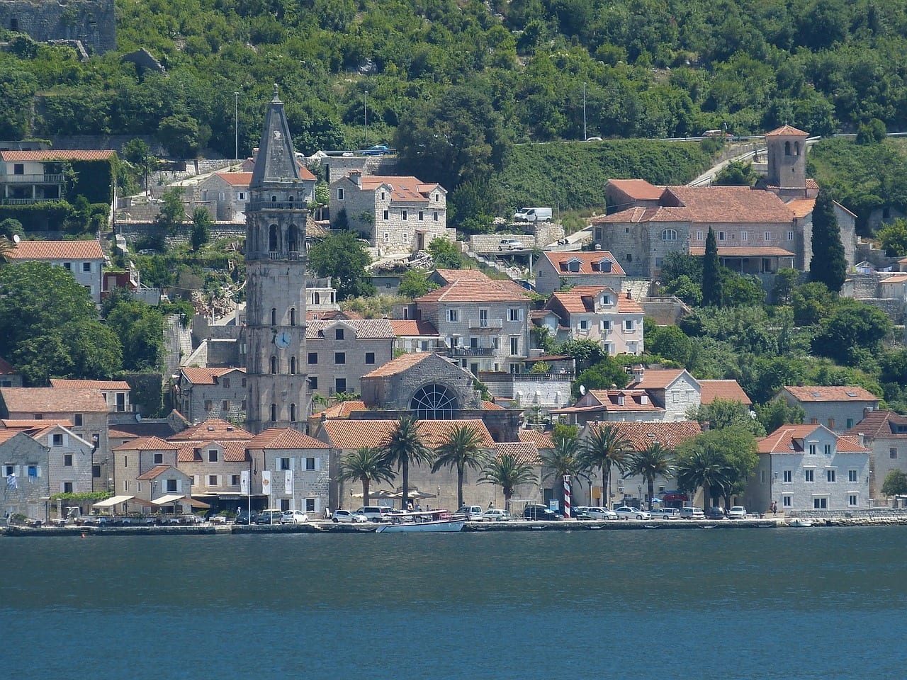
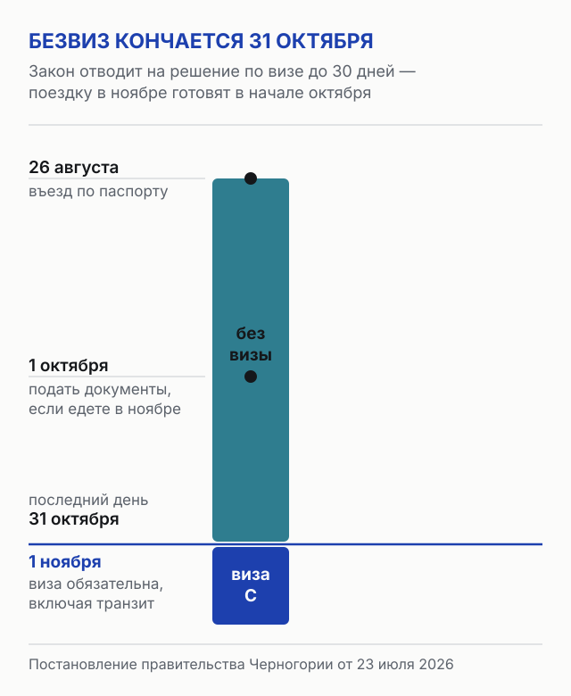
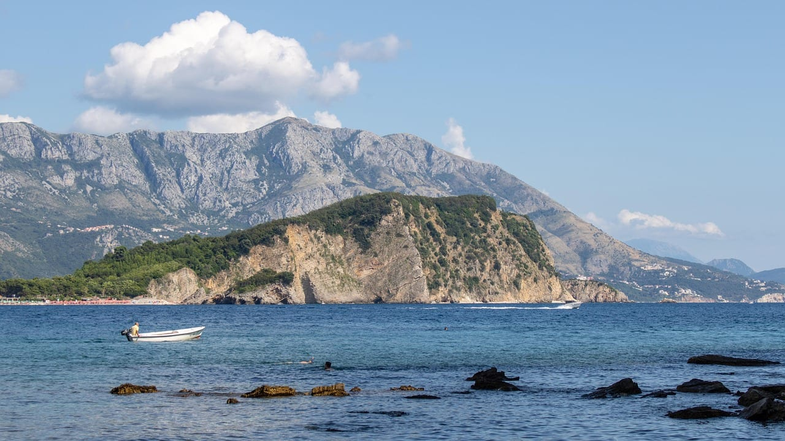
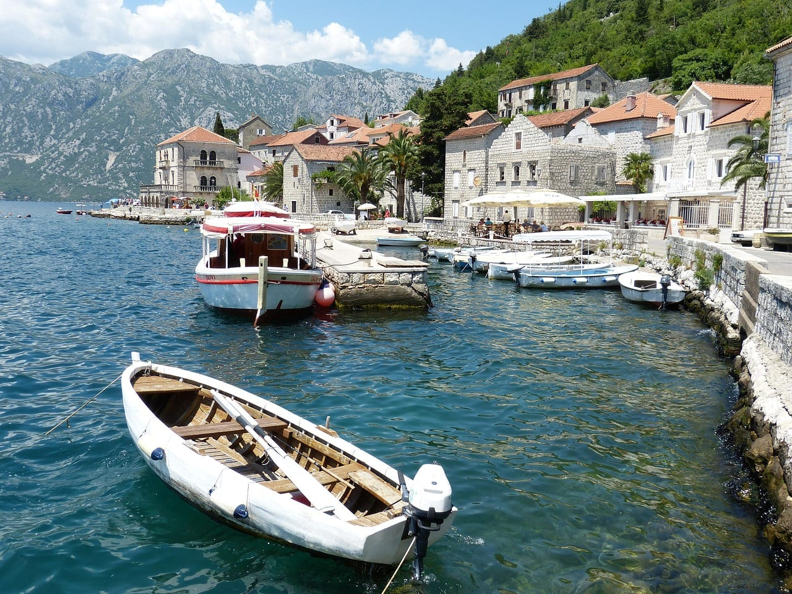
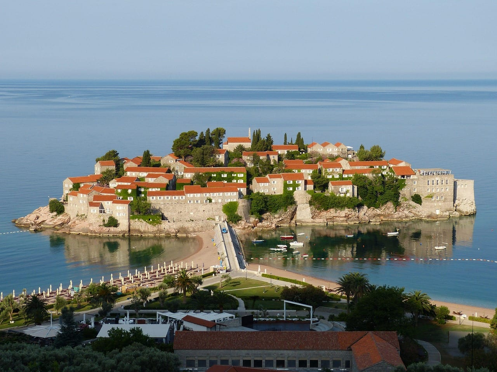

import AffiliateNote from '../../components/post/AffiliateNote.astro';
import { cherehapaCountry, aviasalesRoute } from '../../data/affiliate.js';

Черногория была самым обжитым для россиянина куском Адриатики: море, курортная инфраструктура и въезд по одному загранпаспорту — без визы, без записи, без справок о доходах. Добирались с пересадкой в Белграде, Стамбуле или Ереване, прямые рейсы закрыты с 2022 года. С 1 ноября 2026 года въезд по паспорту заканчивается, и порядок оформления визы теперь опубликован: сборы, документы и адреса центров подачи известны.

Если с документами всё понятно, а вопрос в том, есть ли смысл ехать в низкий сезон, читайте отдельный [разбор отдыха в Черногории после 1 ноября](/blog/montenegro-after-november-2026/): там курорты, погода, дорога и недельный бюджет без повторения визовой инструкции.

> **Если коротко:** до 31 октября 2026 года включительно всё как было — 30 дней по загранпаспорту. С 1 ноября нужна виза категории C: сбор **35 €** (около 3 450 ₽ по курсу ЦБ 98,5182 ₽ за евро на 26 августа 2026 года), для ребёнка до 14 лет 17,5 €. Подача личная, в одном из девяти центров, решение по закону до 30 дней. **Виза не понадобится тем, у кого есть действующая шенгенская виза, виза США, Великобритании или Ирландии либо вид на жительство в ЕС** — им остаются те же 30 дней по прежнему правилу.

<AffiliateNote />

## Что меняется 1 ноября и кого это касается

Правительство Черногории приняло поправку к постановлению о визовом режиме **23 июля 2026 года**. С 1 ноября виза нужна гражданам России, Беларуси, Турции, Китая и Саудовской Аравии — так МИД страны изложил решение в заявлении от 27 июля.

Причина не в отношениях с отдельной страной. Черногория подгоняет визовые правила под общеевропейские: это одно из завершающих условий для закрытия переговорной главы 24 в процессе вступления в Евросоюз. По сообщению правительства, выполнение условия открывает доступ примерно к 4 млн € из европейского Плана роста для Западных Балкан.

Из этого следует неприятное: отыграть назад вряд ли получится. Мера не сезонная и не временная, а часть длинной процедуры вступления.

**Отдельно про даты.** Часть русскоязычных изданий пишет, что визы вводятся до конца сентября. Первоисточник даёт другое число: постановление принято 23 июля, срок вступления — 1 ноября 2026 года. Если вы видели сентябрь или октябрь, это пересказ, а не документ.

## Кому виза не нужна даже после 1 ноября

Это правило почти не встречается в русскоязычных разборах темы, а именно оно снимает вопрос для многих.

У Черногории есть давнее правило: иностранец, которому виза в принципе нужна, въезжает без неё, если у него на руках действующая виза или вид на жительство определённых стран. Срок — **до 30 дней**, а если виза заканчивается раньше, то до её окончания. С 1 ноября россияне попадают в категорию «виза нужна», и правило начинает работать для них.

⛔ Здесь есть сложность, о которой стоит знать. Две версии официальной страницы виз Черногории перечисляют **разные наборы стран**.

| Что даёт право на 30 дней без черногорской визы | Черногорская версия страницы | Английская версия страницы |
|---|---|---|
| Действующая шенгенская виза | да | да |
| Виза США | да | да |
| Виза Великобритании | да | да |
| Виза Ирландии | да | да |
| Виза Канады, Японии, Австралии, Новой Зеландии | не названы | да |
| Национальная виза Болгарии или Румынии | не названы | да |
| Вид на жительство | да, в странах ЕС | да, в странах Шенгена |
| Вид на жительство США, Британии, Канады, Японии, Австралии, Новой Зеландии, Ирландии, Болгарии, Румынии | не назван | да |
| Деловая карта АТЭС | не названа | да |

Обе страницы датированы до постановления от 23 июля 2026 года, так что ни одна из них не переписана под новый порядок. Разумный вывод: **шенгенская виза, виза США, Великобритании или Ирландии и вид на жительство в ЕС — набор, который называют обе версии**, и на него можно опираться. Всё остальное из правой колонки перед поездкой стоит подтвердить в центре подачи, а не полагаться на сайт.

Практический смысл простой арифметики: если у вас есть живой шенген, черногорская виза не нужна вовсе, и оформление отменяется.

⛔ И оговорка, без которой совет был бы безответственным. Правило про 30 дней — действующее и записано на официальной странице, но написано оно до постановления от 23 июля 2026 года, а отдельного подтверждения «после 1 ноября оно работает и для россиян» на самой странице нет: это следует из заявления правительства, изложенного балканскими изданиями. Пока на границе не появилась практика, планировать поездку **только** на этом правиле — риск. Перед покупкой билетов переспросите в центре подачи и сохраните ответ.

## Сколько стоит виза и что ещё придётся оплатить

Консульский сбор берут по таблице центра подачи. Курс ЦБ на 26 августа 2026 года — 98,5182 ₽ за евро.

| Что оплачивается | В евро | Примерно в рублях |
|---|---|---|
| Краткосрочная виза C, взрослый | 35 € | 3 450 ₽ |
| Долгосрочная виза D, взрослый | 35 € | 3 450 ₽ |
| Виза ребёнку до 14 лет | 17,5 € | 1 725 ₽ |

⛔ **Про 62 €.** Нейроответ Яндекса и несколько разборов в выдаче называют для долгосрочной визы D сбор около 62 €, а для ребёнка около 32 €. Официальная таблица центра подачи даёт для D те же 35 €. Я привожу то, что стоит у того, кто принимает деньги.

Сбор платят **в самом центре наличными или картой** — так описывает порядок оплаты сайт центра подачи.

Отдельно от консульского сбора существует сервисный сбор центра, и вот его величину на 26 августа 2026 года на сайте центра найти не удалось. Придумывать число я не буду: заложите его в бюджет как неизвестную величину и уточните при записи. Что опубликовано — это тариф на **необязательные** услуги, и он в рублях: заполнение анкеты и помощь с записью 850 ₽, фотография на месте 850 ₽, копия страницы 100 ₽, СМС о готовности 400 ₽, курьерская доставка паспорта 600 ₽ плюс тариф курьера, донос забытых документов в тот же день 1 800 ₽. Есть и дорогие: подача вне очереди с сопровождающим 6 000 ₽, подача в нерабочие часы 7 000 ₽, премиум-зал 9 200 ₽. Ни одна из них на решение по визе не влияет — это написано на сайте центра прямым текстом.

## Где подавать: девять центров и их расписание

Заявления принимают центры VFS Global — до этого подать можно было только в посольстве. Расписание у большинства из них короткое, и это главная ловушка планирования: центр в вашем городе может работать один день в неделю.

| Город | Дни приёма | Часы |
|---|---|---|
| Москва, Летниковская | понедельник — пятница | 09:00–16:00 |
| Москва, Сириус | понедельник — пятница | 09:00–16:00 |
| Воронеж | понедельник — среда | 09:00–14:00 |
| Екатеринбург | понедельник — среда | 09:00–14:00 |
| Мурманск | понедельник — среда | 09:00–14:00 |
| Новороссийск | понедельник — среда | 09:00–14:00 |
| Петрозаводск | понедельник, вторник | 09:00–14:00 |
| Архангельск | только понедельник | 09:00–14:00 |
| Псков | только среда | 09:00–14:00 |

Расписание снято с сайта центра 26 августа 2026 года. Обратите внимание на Псков и Архангельск: один приёмный день в неделю означает, что промах с документами стоит недели, а не часа.

**Подавать нужно лично.** Заявление через третьих лиц центр не принимает; за несовершеннолетнего документы подаёт родитель или законный представитель. Доверенность на знакомого или агентство здесь не работает.

## Какие документы просят и сколько денег надо показать

Список для краткосрочной визы C официальный, привожу его как есть.

- **Загранпаспорт.** Выдан в последние десять лет, минимум две чистые страницы, и срок действия минимум на три месяца больше срока действия визы.
- **Одна цветная фотография** 35 × 45 мм.
- **Доказательство цели поездки** — гарантийное письмо от человека, приглашение от компании, государственного органа Черногории или организатора мероприятия.
- **Доказательство наличия средств.** Здесь стоит конкретное число: иностранец считается обеспеченным, если у него есть не менее **50 € на каждый день** запрошенного пребывания. Подходят выписка со счёта, подтверждение регулярного дохода, наличные, дорожные чеки, кредитные карты.
- **Медицинская страховка.**
- **Подтверждение оплаты консульского сбора.**

Дополнительно можно приложить бронь жилья или оплаченный тур и обратный билет — это не обязательные пункты, но они работают на обоснованность заявления.

Про **50 € в день** стоит посчитать заранее. Поездка на десять дней означает подтверждённые 500 € — около 49 300 ₽ по курсу ЦБ на 26 августа 2026 года. На семью из четверых за те же десять дней выходит 2 000 €, примерно 197 000 ₽. Это не сумма, которую надо потратить, а сумма, которую надо показать.

Страховка стоит в списке обязательных документов, то есть без полиса заявление не примут. Оформлять её имеет смысл после того, как определились с датами, но до записи в центр.

<a href={cherehapaCountry('montenegro', 'montenegro_visa_2026')} class="aff-cta" rel="sponsored">Подобрать полис в Черногорию</a> — Cherehapa сравнивает предложения по покрытию, а не только по цене, оплата картой российского банка, полис приходит в PDF. Как выбирать покрытие и на что смотреть кроме цены, разобрано в обзоре [страховок для поездок за границу](/blog/strahovka-dlya-puteshestviy-2026/).

## Сколько ждать решения: закон обещает 10 дней, центр — две-три недели

Здесь два разных числа из двух официальных источников, и знать стоит оба.

**Закон об иностранцах** отводит на решение по заявлению **десять дней** с момента подачи. Срок продлевается до **30 дней**, если заявление требует дополнительного рассмотрения, и в исключительном случае до **60 дней**, если запросили дополнительные документы.

**Центр подачи** на своём сайте называет ориентир иначе: «минимум две-три недели», с оговоркой, что срок меняется по усмотрению посольства.

Расхождение объяснимо: закон описывает предельные сроки, центр — наблюдаемую практику. Планировать разумно по худшему из чисел. Если поездка намечена на начало ноября, документы стоит подать в начале октября: тогда даже продление до 30 дней не срывает даты.

Отдельно про первые месяцы. Любая новая визовая схема на старте даёт очереди и отказы по формальностям, а ноябрь и декабрь 2026 года — как раз старт. Для первой попытки это худшее время из возможных.

## Что делать, если поездка запланирована

**Едете до 31 октября.** Ничего не меняется: летите по загранпаспорту, 30 дней. Единственное, что стоит сделать заранее, — взять билеты, потому что конец октября стал крайним сроком для всех, кто откладывал, и цена к нему пойдёт вверх.

<a href={aviasalesRoute('MOW', 'TIV', 'montenegro_visa_2026')} class="aff-cta" rel="sponsored">Посмотреть билеты Москва — Тиват</a> — Aviasales собирает все стыковки в одной выдаче, прямых рейсов нет — летят через Белград, Стамбул или Ереван.

**Едете позже и у вас есть шенген.** Оформление отменяется, читайте раздел про освобождения выше. Стоит проверить, что виза будет действовать в дни поездки: правило считает срок по ней, а не по вашему желанию.

**Едете позже и шенгена нет.** Считайте назад от даты вылета: две-три недели практики, до 30 дней по закону, плюс запас на расписание центра в вашем городе. Собирайте документы в сентябре.

**У вас была пересадка через Черногорию.** Проверьте маршрут, но не паникуйте: см. следующий раздел, там не всё так плохо.

## Транзит и пересадка: когда виза не нужна

Прежняя формулировка этой статьи говорила, что транзит после 1 ноября потребует визу. Это верно наполовину, и разницу стоит знать.

**Пересадка без выхода в страну визы не требует.** Если вы не покидаете самолёт или международную транзитную зону аэропорта, виза не нужна вовсе — так написано в правилах. Правительство при этом оставляет за собой право ввести отдельную аэропортовую транзитную визу категории A для граждан отдельных стран по соображениям безопасности.

**Проезд через страну — другое дело.** Наземный транзит, выход в город на стыковке, переезд из Сербии в Албанию через черногорскую территорию — здесь нужна виза C, и срок её действия должен соответствовать времени, необходимому для проезда.

⛔ И ещё одно, что честнее сказать прямо: **виза не гарантирует въезд**. Это дословная оговорка с официальной страницы. Решение на границе принимает пограничник, и наличие визы его не связывает.

## Регистрация в полиции: 24 часа и штраф до 600 евро

Правило существует давно, не связано с визами и продолжит действовать после 1 ноября, но про него мало кто помнит.

Иностранец обязан **в течение 24 часов** после приезда зарегистрироваться в полиции по месту проживания. Если вы живёте в гостинице или в апартаментах через сервис бронирования, заявление за вас подаёт хозяин жилья — это его обязанность. Живёте у знакомых или сняли жильё напрямую без регистрации хозяина как поставщика услуг — подаёте сами, в полицию или в бюро туристической организации.

Штраф за неисполнение — **от 60 до 600 €**, то есть примерно от 5 900 до 59 100 ₽. Важная деталь из справки МИД России: если зарегистрированный поставщик жилья не подал сведения, отвечает он, а не гость. Отсюда практический вывод: сохраняйте подтверждение бронирования и спросите у хозяина, подал ли он данные.

## Чего пока никто не знает

Список коротких честных пробелов на 26 августа 2026 года.

**Сервисный сбор центра.** Опубликован тариф необязательных услуг, но не обязательный сбор за приём документов.

**Как поведёт себя очередь.** Центры работают, но потока из России по черногорским визам до 1 ноября нет — оценивать сроки записи не по чему.

**Сезонное послабление.** Черногорская версия официальной страницы упоминает механизм освобождения от виз **на туристический сезон**. Решения применить его к россиянам нет, и туроператоры говорят лишь о надежде на 2027 год. Строить на этом планы я бы не стал, но механизм существует, и это не выдумка отрасли.

**Электронные визы.** МИД Черногории объявил о новой визовой информационной системе, согласованной с шенгенскими стандартами, с прицелом на электронные визы. Сроков нет.

⛔ **Справка МИД России устарела.** На 26 августа 2026 года страница по Черногории на сайте консульского департамента описывает соглашение от 21 декабря 2008 года и 30 дней без виз — про 1 ноября там нет ничего. Это не ошибка ведомства, а обычное отставание справочника, но при подготовке документов опираться на него нельзя.

## Куда вместо Черногории

Не буду сходу называть замену: у каждого своя причина ехать именно сюда, и «поезжайте в соседнюю страну» — ответ ни о чём. Что полезно, так это свериться со списком направлений, куда россиянину сейчас не нужна виза, и выбирать из него.

Он у меня собран отдельно и обновляется: [куда можно без визы](/bezviz/). Там видно срок пребывания и условия по каждой стране, а не одна галочка «безвиз».

Если Черногория была нужна ради моря и понятного перелёта, смотрите в сторону [Турции](/visa/turkey/) и [Грузии](/visa/georgia/) — по обеим у меня есть разбор правил въезда с первоисточниками. А если шенген у вас на руках, то он же открывает и Черногорию, и половину Европы: как его получают в 2026 году и где реально дают мультивизу, разобрано в [разборе шенгенских виз по 27 странам](/blog/schengen-visa-2026/).

## FAQ

**Нужна ли виза в Черногорию сейчас, в августе 2026 года?**
Нет. До 31 октября 2026 года включительно россияне въезжают по загранпаспорту и находятся в стране до 30 дней. Визовый режим начинается 1 ноября.

**Сколько стоит виза в Черногорию?**
Консульский сбор 35 € для взрослого и 17,5 € для ребёнка до 14 лет — около 3 450 и 1 725 ₽ по курсу ЦБ на 26 августа 2026 года. Сверх этого центр берёт свой сервисный сбор, величина которого на сайте не опубликована.

**Можно ли поехать в Черногорию с шенгенской визой?**
По действующему правилу да: шенгенская виза даёт право на въезд и пребывание до 30 дней без черногорской визы, а если срок шенгена короче — до его окончания. То же записано для виз США, Великобритании и Ирландии и для вида на жительство в ЕС. Правило сформулировано до постановления от 23 июля 2026 года, поэтому перед поездкой после 1 ноября его стоит переспросить в центре подачи.

**Сколько денег нужно показать на визу?**
Не менее 50 € на каждый день запрошенного пребывания. Для десятидневной поездки это 500 €, около 49 300 ₽ по курсу ЦБ на 26 августа 2026 года.

**Сколько делается виза в Черногорию?**
Закон отводит десять дней, с продлением до 30 дней при дополнительном рассмотрении и до 60 дней в исключительном случае. Центр подачи называет ориентир «минимум две-три недели».

**Нужна ли виза на пересадку в черногорском аэропорту?**
Если вы не выходите из самолёта или из международной транзитной зоны — нет. Для выхода в страну и наземного проезда через неё нужна виза категории C.

**Где подать документы на визу?**
В центрах подачи в девяти адресах: два в Москве, а также Воронеж, Екатеринбург, Мурманск, Новороссийск, Петрозаводск, Архангельск и Псков. Подача личная, через третьих лиц заявление не принимают.

**Вернут ли Черногории безвиз для россиян?**
Решения об этом нет. Отмена — часть процедуры вступления в Евросоюз, поэтому быстрый откат маловероятен. При этом в правилах существует механизм освобождения от виз на туристический сезон; применят ли его — неизвестно.

---

*Актуально на 26 августа 2026 года. Порядок оформления, сборы, документы и сроки сверены по официальной странице виз правительства Черногории и по сайту центра подачи документов; факт отмены безвиза и дата — по заявлению МИД Черногории от 27 июля 2026 года. Правила меняются: перед подачей сверяйтесь с [страницей виз правительства Черногории](https://www.gov.me/en/article/visas) и [сайтом центра подачи](https://visa.vfsglobal.com/rus/ru/mne/attend-centre).*

*Фото: Котор, Bengt Nyman, [CC BY](https://creativecommons.org/licenses/by/2.0/); Боко-Которский залив, Пераст и Свети-Стефан — falco, побережье у Будвы — osoian-marcel, Дурмитор — anarxi, [Pixabay](https://pixabay.com/service/license-summary/).*
