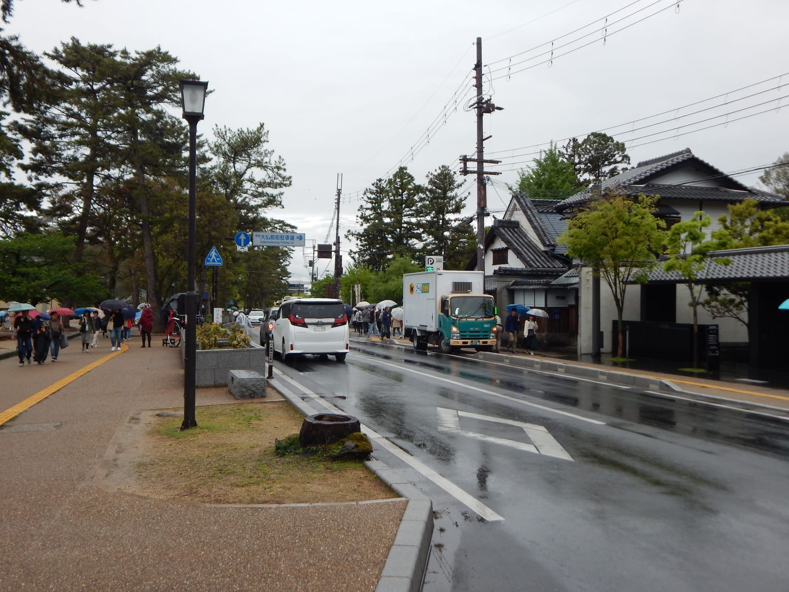
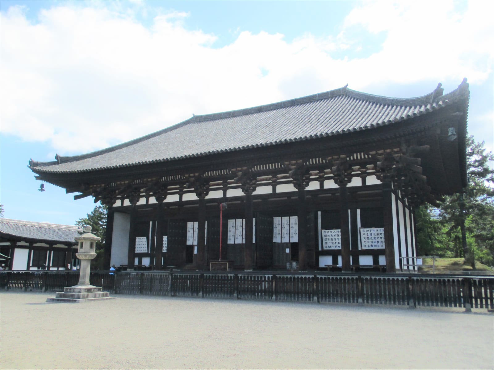
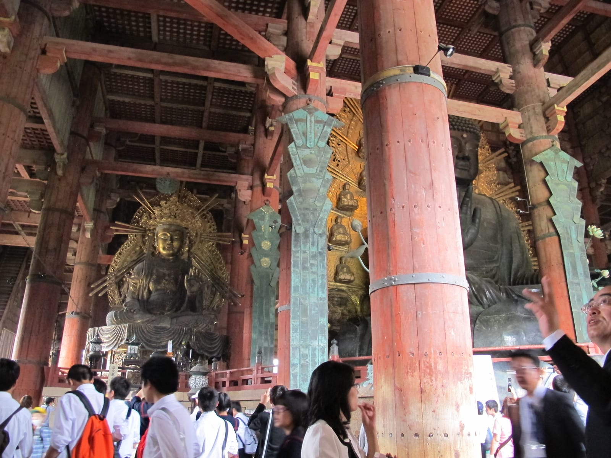
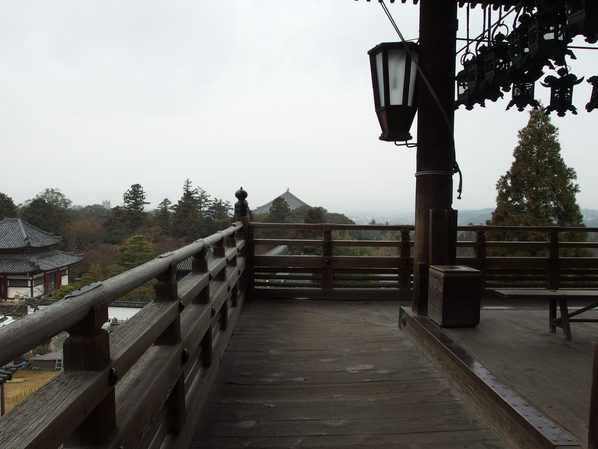
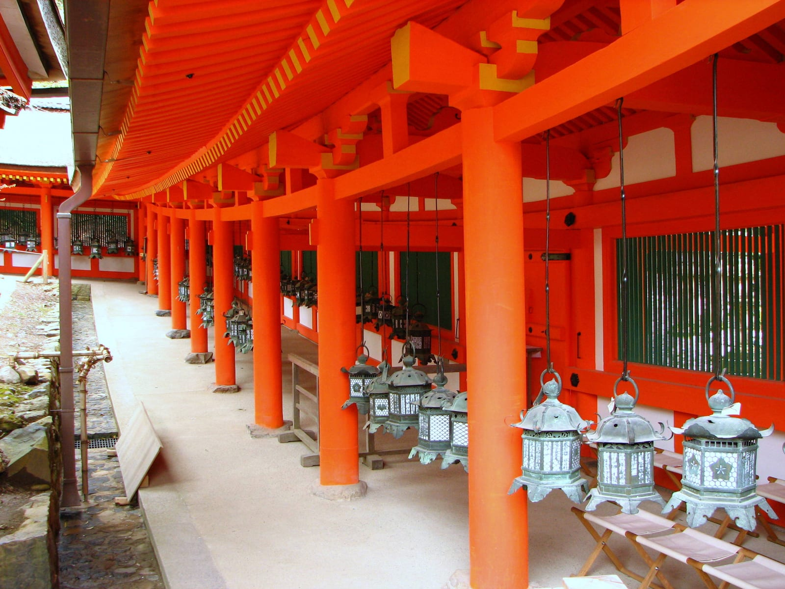
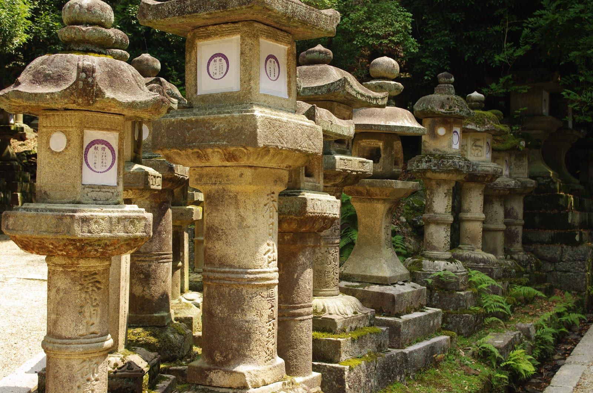
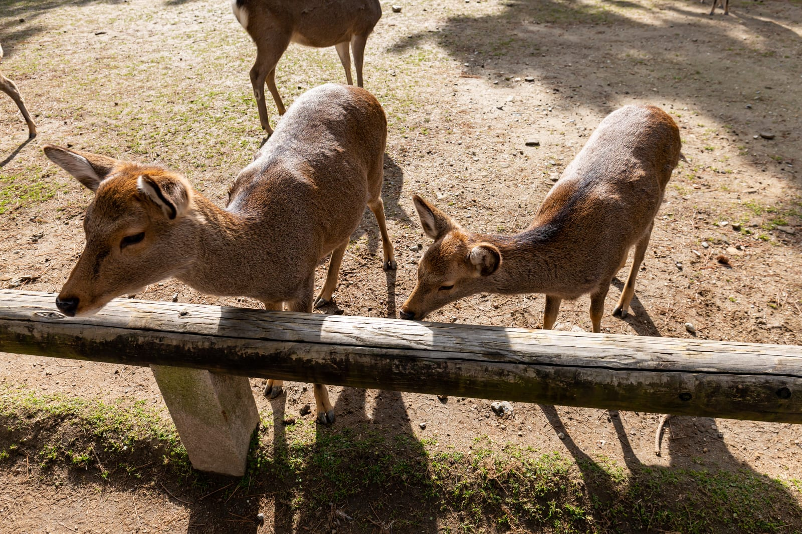
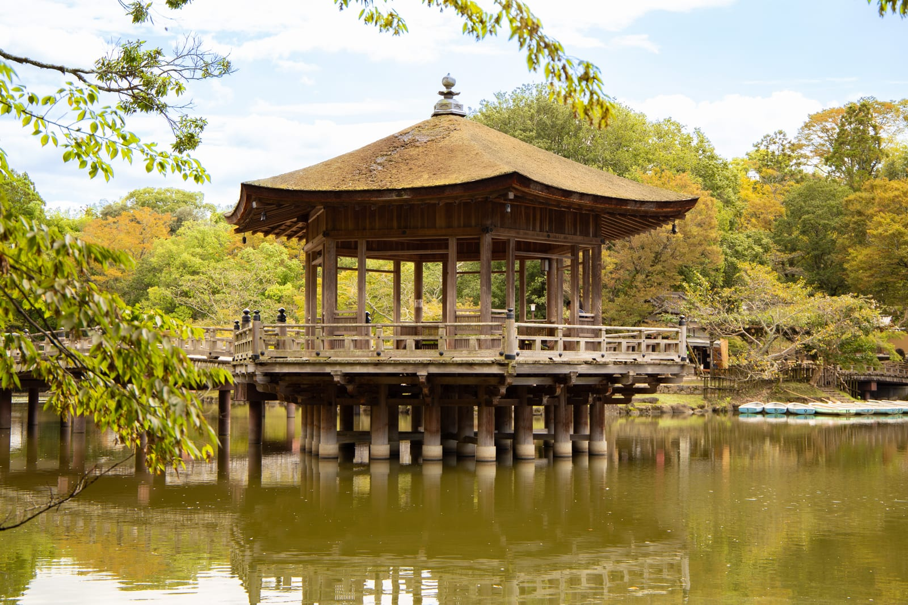
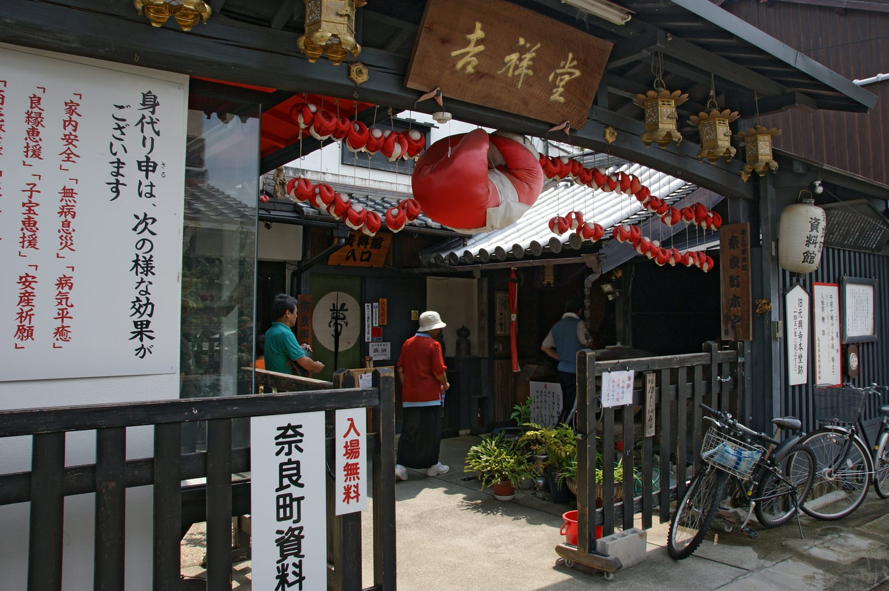

import RouteDays from '../../components/post/RouteDays.astro';
import { ostrovokCity } from '../../data/affiliate.js';

export const naraStay = ostrovokCity('japan', 'nara', 'nara_overnight');

**Первый день в Наре можно посвятить Тодай-дзи, Нигацу-до, Касуга-тайся и прогулке по Нарамати.** Из Осаки удобна линия Kintetsu от Osaka-Namba; из Киото сравните Kintetsu и JR по расположению отеля и своему проездному. Для такого плана выделите 6–8 часов в городе, отдельно от дороги туда и обратно.

Олени встречаются прямо на пути к храмам. Ради них не требуется отдавать парку весь день или покупать корм: прогулка без кормления вполне состоятельна. Самое важное решение — сколько платных залов хочется увидеть и хватит ли сил после них на старый квартал. Нара легко превращается в слишком длинный список, если к центру сразу добавить дальние храмы, гору и вечернюю Осаку.

Ночёвка нужна ради другого темпа: утро в парке, вечер у Нигацу-до, меньше оглядки на обратный поезд. Если это ваш план, <a href={naraStay} target="_blank" rel="sponsored noopener noreferrer">посмотрите жильё в Наре на Островке</a>. Для обычной поездки из Киото или Осаки переносить багаж и менять отель необязательно.

*На обложке — архивный кадр Тодай-дзи. Фото: Jakub Hałun, [CC BY-SA 4.0](https://creativecommons.org/licenses/by-sa/4.0/); [оригинал](https://commons.wikimedia.org/w/index.php?curid=11451315).*

## Как добраться в Нару из Киото и Осаки?

**Сначала выберите станцию прибытия: Kintetsu-Nara ближе к парку, JR Nara удобна для поездки по сети JR.** Это разные вокзалы. Если приложение предлагает билет до «Nara», посмотрите полное название станции и перевозчика, прежде чем оплачивать поездку.

Из района Namba в Осаке логично начинать с Kintetsu Osaka-Namba. Туристический портал Нары указывает около 34 минут на быстром поезде до Kintetsu-Nara; это время в поезде, без пути от отеля и ожидания. Из района станции Osaka сравните JR: переезд к Namba ради нескольких минут выигрыша может свести его на нет.

Из Kyoto Station есть оба варианта. У Kintetsu ограниченный экспресс до Нары занимает примерно 34 минуты; у быстрого поезда JR — около 41 минуты. Сравнивайте конкретное отправление: поезда Kintetsu бывают с пересадкой, а limited express требует доплаты. Табличное время самого быстрого рейса не описывает любой поезд с того же вокзала.

| Откуда и каким поездом | Что проверить перед покупкой |
|---|---|
| Osaka-Namba → Kintetsu-Nara | Обычный быстрый поезд или limited express с доплатой; конечную станцию |
| Kyoto → Kintetsu-Nara | Прямой ли рейс; нужна ли пересадка и отдельный билет на limited express |
| Osaka / Kyoto → JR Nara | Покрывает ли поездку имеющийся JR-проездной; дальнейший путь от станции к парку |

Базовый взрослый тариф Kintetsu в одну сторону — **¥680 из Osaka-Namba (примерно 370 ₽)** и **¥760 из Kyoto (примерно 410 ₽)**. Эти суммы не включают доплату за limited express. Рублёвые суммы — ориентир; курс при оплате может отличаться.

Для поездки по обычному тарифу не нужно автоматически покупать красивый туристический поезд или многодневный проездной. Сначала посчитайте свои переезды. Если есть JR Pass, проверьте его условия: он не превращается в билет Kintetsu. Подготовку остального путешествия — связь, деньги и перемещения — удобнее держать в [общем гайде по Японии](/blog/japan-guide-2026/).

*Фото: Raf24~commonswiki, [CC BY-SA 4.0](https://creativecommons.org/licenses/by-sa/4.0/); [оригинал](https://commons.wikimedia.org/w/index.php?curid=79192361).*

## В каком порядке смотреть Нару за один день?

**Ставьте платные посещения в первую половину дня, а Нарамати оставляйте на время после храмов.** У Касуга-тайся специальное посещение заканчивается раньше, чем может ожидать человек, привыкший гулять по парку до вечера. Олени и кафе не должны незаметно занять весь этот запас.

<RouteDays
  title="Один день: храмы, парк и старый квартал"
  days={[
    { n: 1, place: 'Kintetsu-Nara и Кофуку-дзи', what: 'Короткий внешний осмотр по пути к парку. Входы в отдельные залы добавляйте только вместо другой платной остановки.' },
    { n: 2, place: 'Тодай-дзи', what: 'Южные ворота и зал Большого Будды — основное посещение утра. Сюда идите до долгой прогулки с оленями.' },
    { n: 3, place: 'Нигацу-до и обед', what: 'Поднимитесь к галерее с видом на город, если подходят ступени. После этого сделайте паузу перед лесной частью маршрута.' },
    { n: 4, place: 'Касуга-тайся', what: 'Выберите внешний осмотр или специальное посещение. Проверьте часы и церемониальные ограничения до выхода.' },
    { n: 5, place: 'Укимидо и Нарамати', what: 'При запасе сил пройдите к павильону у воды, затем в старый торговый квартал. Если устали, сокращайте эту часть.' },
    { n: 6, place: 'Возвращение к станции', what: 'Проверьте обратный поезд своего перевозчика. Не рассчитывайте, что JR Nara и Kintetsu-Nara — один вход.' },
  ]}
  note="План — редакционная последовательность остановок, не расписание и не карта точной траектории. 6–8 часов включают прогулки, обед и паузы; очередь или дождь могут потребовать сокращения."
/>

Не прибавляйте к этому плану весь Киото до обеда. Нара за полдня возможна, но тогда стоит честно выбрать парк и Тодай-дзи, а не пытаться пройти сокращённую копию полного круга. Дальний Хорю-дзи и западные храмовые районы тоже требуют своего времени на дорогу.

*Фото: Cun Cun, [CC BY-SA 4.0](https://creativecommons.org/licenses/by-sa/4.0/); [оригинал](https://commons.wikimedia.org/w/index.php?curid=79848493).*

## Что увидеть в Тодай-дзи и сколько стоит вход?

**Главная платная остановка — зал Большого Будды, Daibutsu-den: взрослый билет стоит ¥800, около 430 ₽.** Посещение других платных залов и музея не входит автоматически в этот билет. Если нужен только основной зал, не закладывайте в маршрут весь храмовый комплекс как один короткий интерьер.

Подход через южные ворота Нандаймон даёт ощущение масштаба: деревянные конструкции, статуи стражей, широкое пространство перед залом. Не спешите сразу к кассе. У ворот и на подходе есть что рассмотреть, а внутри большого зала впечатление строится на соотношении огромной статуи и самого здания.

С апреля по октябрь Daibutsu-den открыт с 7:30 до 17:30, с ноября по март — с 8:00 до 17:00. Музей живёт по своему режиму. Если музей нужен вместо части прогулки, совместный взрослый билет в него и зал стоит ¥1 200, примерно 640 ₽. Это иной набор посещений, а не обязательная доплата к обычному билету.

Решите до кассы: смотреть музейную коллекцию или ограничиться залом и прогулкой к Нигацу-до. Так у дня появится разумный предел: один большой храм не должен незаметно забрать время, которое вы оставили для Касуга-тайся.

*Фото: sailko, [CC BY-SA 3.0](https://creativecommons.org/licenses/by-sa/3.0/); [оригинал](https://commons.wikimedia.org/w/index.php?curid=19813041).*

## Зачем подниматься к Нигацу-до?

**Нигацу-до даёт вид на город и спокойную смену масштаба после большого зала.** Галерея находится выше основной части комплекса; подходы включают лестницы. Туристический портал указывает бесплатное посещение и круглосуточный доступ, но религиозные события могут менять обычный опыт прогулки.

Сюда можно подойти по каменным ступеням или по крытой деревянной лестнице. Это хороший момент замедлиться: вместо следующего билета — город за перилами галереи, крыши и склон. Вечерний свет делает остановку особенно привлекательной, но для дневной поездки возвращаться сюда к закату необязательно.

Если у человека болят колени, тяжёлая коляска или накопилась усталость, этот подъём можно пропустить. Название «пеший маршрут» не означает ровную дорожку на всём протяжении. Лучше сохранить силы на выбранный храм, чем сделать ступени обязательной проверкой выносливости.

*Фото: Guilhem Vellut, [CC BY 2.0](https://creativecommons.org/licenses/by/2.0/); [оригинал](https://commons.wikimedia.org/w/index.php?curid=150051096).*

## Как посетить Касуга-тайся и не опоздать?

**Разделяйте прогулку по подходам к святилищу и специальное посещение внутренней части.** Для специального посещения опубликованы часы 9:00–16:00 и плата ¥700, примерно 380 ₽. В дни церемоний бывают ограничения, поэтому последнего свободного часа может не хватить.

Прогулка по подходам не равна доступу во все внутренние зоны. Музеи, сад и специальное посещение работают по собственному режиму. Перед поездкой посмотрите [календарь ограничений Касуга-тайся](https://www.kasugataisha.or.jp/en/about_en/basic/), особенно если рассчитываете на платный вход.

Каменные фонари на лесных подходах и подвесные фонари у красных галерей — разные части впечатления. Прогулка к святилищу ценна и без покупки всех дополнительных билетов. Выбирайте внутреннее посещение по интересу к самому месту, а не потому, что оно осталось единственной непоставленной галочкой.

*Фото: Bernard Gagnon, [CC BY-SA 3.0](https://creativecommons.org/licenses/by-sa/3.0/); [оригинал](https://commons.wikimedia.org/w/index.php?curid=4141984).*

*Фото: Bgabel, [CC BY-SA 3.0](https://creativecommons.org/licenses/by-sa/3.0/); [оригинал](https://commons.wikimedia.org/w/index.php?curid=22684703).*

## Можно ли кормить оленей и гулять с ребёнком?

**Кормление необязательно, а олени остаются дикими животными.** Правила префектуры разрешают для посетителей только специальные shika senbei; хлеб, сладости и другие продукты давать нельзя. Не оставляйте ребёнка одного рядом с животными и не превращайте пачку корма в приманку для фотографии.

Олени могут бодаться, кусать, толкать и тянуть вещи. Уберите бумажную карту, пакеты и еду, которую животное способно схватить. Мусор нужно унести с собой. Осенью самцы во время гона требуют особой осторожности; отсутствие заметных рогов не делает близкий контакт безопасным.

С ребёнком можно смотреть на оленей с расстояния, пройти к Тодай-дзи, пообедать и решить, нужны ли дальнейшие остановки. Если взрослым хочется кормления, сначала оцените обстановку и возможность спокойно отойти. Поездка без пачки крекеров не теряет своего главного содержания.

*Фото: Balon Greyjoy, [CC0](https://creativecommons.org/publicdomain/zero/1.0/deed.en/); [оригинал](https://commons.wikimedia.org/w/index.php?curid=114034520).*

## Что посмотреть после храмов: Укимидо и Нарамати?

**Укимидо подходит для короткой остановки у воды, Нарамати — для прогулки по старому торговому кварталу.** Это удобный переход от храмовых пространств к небольшим улицам, мастерским и кафе. Оба пункта можно сократить, если день получился длинным.

Павильон Укимидо стоит у пруда. Здесь важнее сама прогулка вокруг воды, чем стремление повторить чужой кадр с определённым отражением или цветущими деревьями. Погода и сезон меняют вид. Фото из весенней поездки не доказывает, что в сентябре вокруг будет такая же картинка.

*Фото: Ian G Shingler, [CC BY-SA 4.0](https://creativecommons.org/licenses/by-sa/4.0/); [оригинал](https://commons.wikimedia.org/w/index.php?curid=163263429).*

В Нарамати выбирайте несколько улиц вместо списка обязательных магазинов. Многие небольшие заведения имеют собственные выходные и заканчивают работу раньше вечернего поезда. Если нужен конкретный музей, ресторан или мастерская, проверьте именно его часы. «Погулять в квартале» и «успеть во все интерьеры» — разные планы.

Рядом с центром остаётся Кофуку-дзи, но его пятиэтажная пагода проходит большую реставрацию и скрыта защитным сооружением. Не стройте поездку вокруг открыточного вида этой башни над прудом Сарусава. Другие здания комплекса дают самостоятельную остановку; старые панорамные фото требуют поправки на сегодняшние работы.

*Фото: 663highland, [CC BY 2.5](https://creativecommons.org/licenses/by/2.5/); [оригинал](https://commons.wikimedia.org/w/index.php?curid=6006055).*

## Сколько заложить на поезд и храмовые билеты?

**Для одного взрослого из Osaka-Namba минимальная выбранная связка — ¥2 160, около 1 160 ₽: обычный Kintetsu туда-обратно и зал Большого Будды.** Из Kyoto та же связка стоит ¥2 320, около 1 250 ₽. Это билетная часть дня, без еды, жилья, автобусов и доплат за специальные поезда.

| План для взрослого | Из Osaka-Namba | Из Kyoto |
|---|---|---|
| Обычный Kintetsu туда-обратно + Daibutsu-den | ¥2 160 ≈ 1 160 ₽ | ¥2 320 ≈ 1 250 ₽ |
| То же + специальное посещение Касуга-тайся | ¥2 860 ≈ 1 540 ₽ | ¥3 020 ≈ 1 620 ₽ |
| Второй вариант на двух взрослых | ¥5 720 ≈ 3 070 ₽ | ¥6 040 ≈ 3 240 ₽ |

Расчёт сначала складывает тарифы в иенах, затем переводит итог в рубли. Детям нельзя автоматически назначать половину общей суммы: возрастные категории храмов и перевозчика нужно проверить отдельно. Если едете по JR или купленному проездному, замените железнодорожную часть собственным тарифом.

Парк, внешний осмотр и Нигацу-до позволяют провести содержательный день без набора дорогих входов. Деньги разумнее оставить на выбранный интерьер и нормальную паузу на обед, чем покупать музейный билет, когда на коллекцию осталось десять минут.

## Как изменить маршрут в дождь или при нехватке времени?

**При коротком визите оставьте Тодай-дзи и ближайшую часть парка; в дождь добавляйте один музей вместо длинной прогулки.** Нара не превращается в полностью крытый маршрут: между зданиями всё равно придётся идти. Платный билет не решает вопрос мокрой обуви и дороги до следующей остановки.

При сильном дожде разумнее выбрать Тодай-дзи с музеем, проверить режим работы и отказаться от длинного круга через Нарамати. С ребёнком или человеком, которому тяжело ходить, сокращайте подъёмы и количество остановок. Автобус может помочь на отдельном участке; его текущий маршрут смотрите у перевозчика, не по архивной цене туристического круга.

Если хочется ещё одной поездки из большого города в другой части Японии, сравните этот план с [Камакурой из Токио](/blog/kamakura-chto-posmotret/) и [Никко на один день](/blog/nikko-iz-tokio-za-odin-den/). В Наре преимущество — возможность собрать основные остановки в одну городскую прогулку. Никко сильнее зависит от того, остаётесь ли вы у храмов или едете дальше к озеру.

## Что пишут те, кто был

**Три рассказа дают полезные детали, но это малая неслучайная выборка: представительной считать её нельзя.** Прочитаны публикация на Reddit от 21 мая 2025 года о визите в тот же день и два отзыва Tripadvisor о поездках в июне и ноябре 2025-го, опубликованные 16 сентября и 19 декабря соответственно.

В майском рассказе путешественник с дочерью увидел мало людей у Касуга-тайся около 7:30, а ближе к девяти поток вырос. Ноябрьский посетитель советует пройти дальше ближайших оленей и дать время храмам. Это аргументы в пользу раннего начала и полноценной прогулки, но не обещание пустого парка в определённый час.

Июньский отзыв описывает менее приятную сторону: олени тянули сумку ещё до покупки корма, а в музее было многолюдно. Поэтому вещи лучше убрать заранее, кормление считать отдельным решением, а музей не включать только ради укрытия от дождя. Цены и правила из этих отзывов в расчёт поездки не перенесены.

Источники впечатлений: [майская поездка с ребёнком](https://www.reddit.com/r/JapanTravelTips/comments/1krxdyx/nara_park_from_serene_to_busy/), [ноябрьская прогулка](https://www.tripadvisor.com.tr/ShowUserReviews-g298198-d319880-r1042957859-Nara_Park-Nara_Nara_Prefecture_Kinki.html), [июньский визит](https://www.tripadvisor.com/ShowUserReviews-g298198-d319880-r1030686017-Nara_Park-Nara_Nara_Prefecture_Kinki.html).

## Частые вопросы

### Можно ли посмотреть Нару за полдня?

Можно, если ограничиться Тодай-дзи, оленями по пути и внешним осмотром Кофуку-дзи. Полный круг через Нигацу-до, Касуга-тайся и Нарамати лучше оставить на день, особенно с обедом и платными посещениями.

### Что удобнее: Kintetsu-Nara или JR Nara?

Kintetsu-Nara ближе к парку и Кофуку-дзи. JR Nara может быть удобнее по месту отправления или имеющемуся проездному. Сравнивайте весь путь от своего отеля, а не только время между станциями.

### Входит ли Касуга-тайся в билет Тодай-дзи?

Нет. Это разные места, и специальное посещение Касуга-тайся оплачивается отдельно. В Тодай-дзи тоже есть отдельные платные объекты; обычный билет в зал Большого Будды не равен доступу ко всему комплексу.

### Нужно ли покупать корм для оленей?

Нет. Наблюдать за животными можно без кормления. Если решите кормить, используйте только разрешённые shika senbei и соблюдайте правила парка; детям не стоит подходить к оленям без взрослого.

### Стоит ли оставаться в Наре на ночь?

Да, если хочется вечерней прогулки, раннего утра или второго дня для других храмов. С центром можно познакомиться за день из Киото или Осаки; менять отель только ради полного списка достопримечательностей необязательно.
