import AffiliateNote from '../../components/post/AffiliateNote.astro';
import { airaloSub, aviasalesRoute, cherehapaTravel, ostrovokSearch, youtravelSub } from '../../data/affiliate.js';

Вода в озере Гокио бирюзовая до неправдоподобия, и сквозь неё видно камни на дне — на высоте 4 790 метров, где вода должна быть чёрной и мёртвой. В сотне метров за береговым валом начинается ледник Нгозумпа: не белый язык из учебника, а серая каменная пустыня в несколько километров шириной, с провалами и мутными озерцами внизу.

А за три дня до этого, с гребня над Намче, видно другое — тёмную трапецию Эвереста, торчащую из-за снежной стены Лхоцзе. От неё до вас сорок километров по прямой, и она выглядит меньше соседей, потому что стоит дальше.

Кадры в этой статье сняты в ноябре 2022 года: Катманду 5 ноября, нижняя тропа с мостами 6-го, гребень над Намче 8-го, долина Гокио и ледник 13-го, верхние сераки 15-го. Ноябрь — вторая половина осеннего окна, и статья дальше объясняет, почему это окно лучшее и почему оно не гарантия.

> **Если коротко:** в район Эвереста ходят в два окна — **с середины марта по середину мая** и **с конца сентября по конец ноября**; осеннее чище по воздуху и многолюднее. Виза ставится по прилёте: **30 долларов за 15 дней, 50 за 30, 125 за 90** (≈2 488, 4 146 и 10 365 ₽ по курсу ЦБ на 22.08.2026). Разрешений два, оба платятся на месте: вход в парк **3 000 рупий** и Trek-Card муниципалитета **3 000 рупий**, вместе **6 000 рупий ≈ 3 248 ₽** — на тысячу больше, чем пишет большинство сайтов. С **31 марта 2023 года** ведомство требует лицензированного гида, и трек в базовый лагерь с Гокио названы в списке поимённо. Дорога занимает две-три недели с перелётом, и главная статья расходов — не разрешения, а сама поездка. <a href={youtravelSub('nepal_everest_trek_2026_top')} class="aff-cta" rel="sponsored">Посмотреть авторские туры в Непал</a> малые группы с русскоязычным гидом, программа и даты видны до оплаты. Вертолётная эвакуация с треккинга стоит тысячи долларов и покрывается только полисом с высотой: <a href={cherehapaTravel('nepal_everest_2026_tldr')} class="aff-cta" rel="sponsored">подобрать страховку с треккингом</a>.

<AffiliateNote />

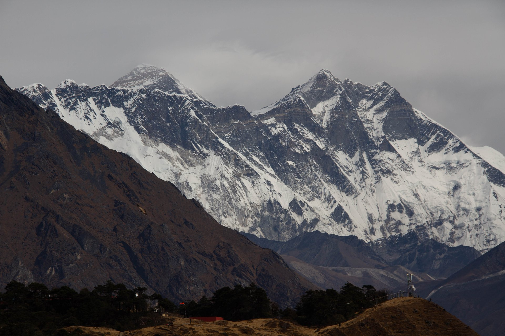

---

## Чем Гокио отличается от базового лагеря и что выбирать

В Кхумбу две главные долины, и они дают разные поездки.

**Долина к базовому лагерю** идёт от Намче через Тенгбоче, Дингбоче и Лобуче к Горак-Шепу. Финальных точек здесь две: сам лагерь на 5 364 метрах и холм Кала-Патхар на 5 644, откуда Эверест и видно по-человечески. Из самого лагеря вершина закрыта отрогом — это первое, что удивляет приехавших, и об этом честно пишут даже те, кто продаёт туда туры.

**Долина Гокио** уходит на север от Намче через Доле и Мачермо к цепочке ледниковых озёр под боком у ледника Нгозумпа. Финальная точка — Гокио-Ри, 5 357 метров, и с неё видно сразу четыре восьмитысячника. Народу здесь заметно меньше, а картинка разнообразнее: в первой долине вы идёте по камню, во второй к камню добавляется вода.

Соединяет их перевал Чо-Ла, 5 420 метров. Кольцо через него — самый популярный способ увидеть обе долины за один заход, и он же самый требовательный: перевал снежный, и в непогоду его закрывают.

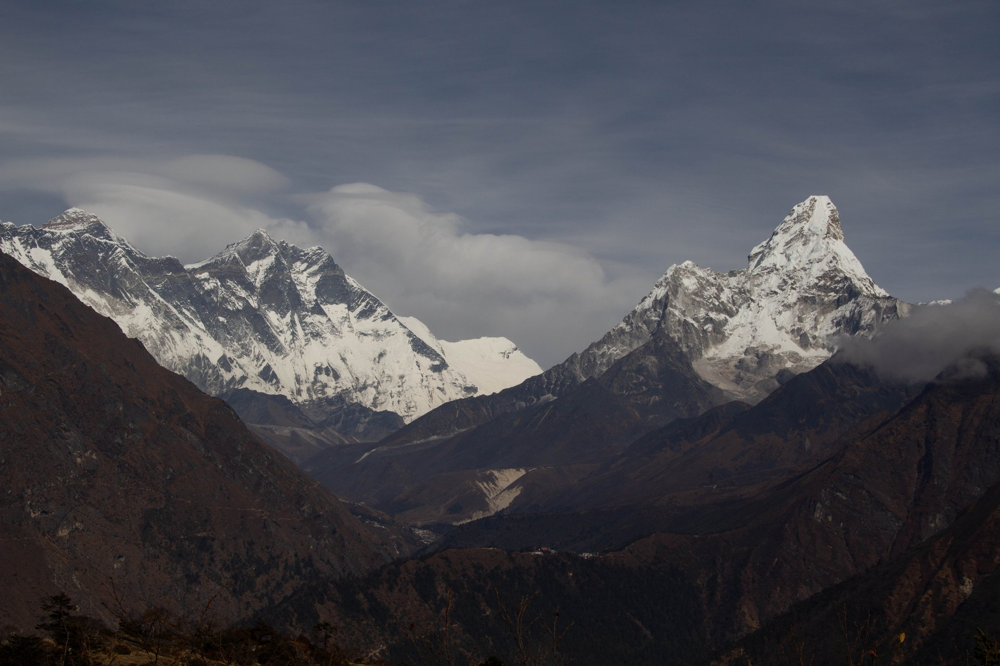

Ноябрьские кадры выше сняты во второй долине. Бирюза озера и серый ледник рядом — это её главное отличие от классического маршрута, где такой воды нет вовсе.

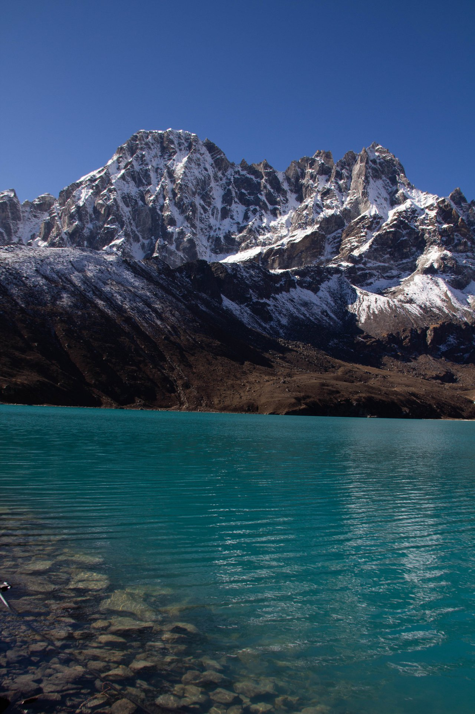

## Когда идти: два окна, и почему осень не гарантия

Метеослужба Непала считает нормой приход муссона **13 июня** и уход **2 октября** ([Департамент гидрологии и метеорологии Непала](https://dhm.gov.np/climate-services/monsoon-onset-and-withdrawal), сверка 22.08.2026). В 2026 году муссон дошёл до востока страны 19 июня — примерно на неделю позже нормы.

Эти две даты и режут год. Между ними — дожди, облака вместо гор и сорванные рейсы. По краям — два трековых окна.

**Весна, с середины марта по середину мая.** Цветут рододендроны, в базовом лагере стоят палатки экспедиций, которые готовятся к восхождению, — картинка, которой осенью не будет. Минус: во второй половине дня в апреле и мае дымка, и дальние виды садятся.

**Осень, с конца сентября по конец ноября.** Воздух после муссона промыт, видимость лучшая в году. Совет по туризму Непала прямо называет октябрь-ноябрь и март-май лучшими месяцами ([Совет по туризму Непала](https://ntb.gov.np/sagarmatha-national-park), сверка 22.08.2026). Минус здесь ровно один и весомый: это же самое многолюдное время, и упирается оно не в тропу, а в аэропорт и в очередь на проверку разрешений.

Зимой ясно и морозно, но перевалы закрывает снегом, и Чо-Ла становится лотереей. Летом идти незачем: гор не видно.

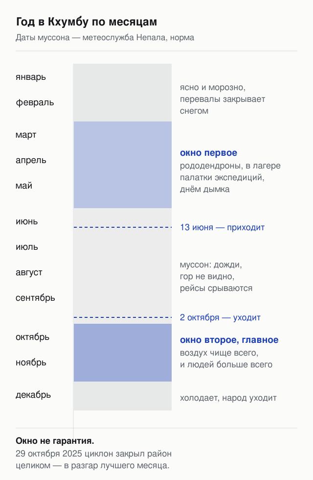

**Окно — это статистика, а не обещание.** 29 октября 2025 года район Эвереста закрыли для туризма с непальской и с китайской стороны из-за небывалого для этого времени снегопада, который принёс циклон; вертолёт, вылетевший забирать застрявших, разбился в глубоком снегу, а предупреждение о непогоде действовало до 1 ноября ([CNN](https://www.cnn.com/2025/10/29/asia/cyclone-montha-everest-tourism-nepal-tibet-intl-hnk), 29.10.2025). Это случилось в самой середине лучшего месяца и было вторым снежным ударом того октября.

Практический вывод простой: закладывать резервные дни и не покупать обратный билет впритык.

## Пять сценариев поездки: от пяти дней до трёх недель

Ниже — готовые схемы с честным минусом каждой. Дни считаются от прилёта в Луклу, без перелёта из России.

**1. Намче и смотровая, 5–6 дней.** Лукла, Пхакдинг, Намче, день акклиматизации с выходом к смотровой площадке над Сянгбоче, обратно. Вы видите Эверест, Лхоцзе и Ама-Даблам, ночуете не выше 3 440 метров. *Минус:* это не трек, а знакомство; выше 3 500 вы не поднимаетесь и настоящей высоты не чувствуете.

**2. Гокио, 10–12 дней.** Намче, Доле, Мачермо, Гокио, подъём на Гокио-Ри, обратно той же тропой. Озёра, ледник, четыре восьмитысячника с вершины, людей меньше. *Минус:* базового лагеря в программе нет, и объяснять это дома придётся отдельно.

**3. Классический базовый лагерь, 12–14 дней.** Намче, Тенгбоче, Дингбоче, Лобуче, Горак-Шеп, лагерь и Кала-Патхар, спуск по той же тропе. Самый узнаваемый маршрут. *Минус:* туда и обратно по одной тропе, и на спуске вы идёте мимо того же самого; плюс это самая загруженная долина Кхумбу.

**4. Гокио, Чо-Ла и базовый лагерь, 16–18 дней.** Кольцо через перевал: обе долины за один заход. Лучшее соотношение увиденного к затраченному. *Минус:* перевал 5 420 метров, снег и лёд, в непогоду вас развернут; резервный день нужен обязательно.

**5. Три перевала, 20–21 день.** Конгма-Ла, Чо-Ла и Ренджо-Ла, весь район с разных сторон. *Минус:* три недели отпуска и требования к форме заметно выше; отчёты о нём чаще других содержат фразу «на пределе сил».

Отдельный вариант — зайти пешком снизу, от Джири или Салери, добавив к любому из сценариев 5–7 дней. Так шли до того, как в Луклу стали летать. Плюс — плавная акклиматизация и почти пустая тропа; минус — неделя пути по лесистым холмам без больших гор в кадре.

| Сколько дней в Кхумбу | Что складывается |
|---|---|
| 5–6 | Намче, смотровая, Эверест издали; ночёвки до 3 440 м |
| 10–12 | Гокио, ледник Нгозумпа, Гокио-Ри 5 357 м |
| 12–14 | базовый лагерь 5 364 м и Кала-Патхар 5 644 м |
| 16–18 | обе долины через перевал Чо-Ла 5 420 м |
| 20–21 | три перевала, весь район |
| +5–7 к любому | заход пешком снизу, от Джири или Салери |

К любой из строк добавьте два дня на дорогу из России и обратно и хотя бы один резервный день на погоду.

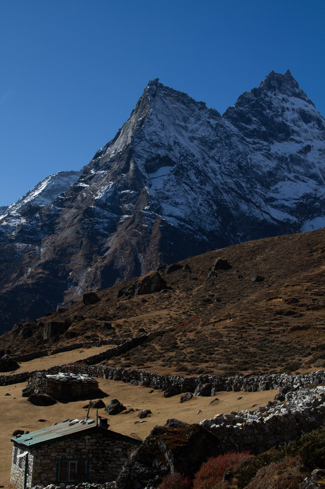

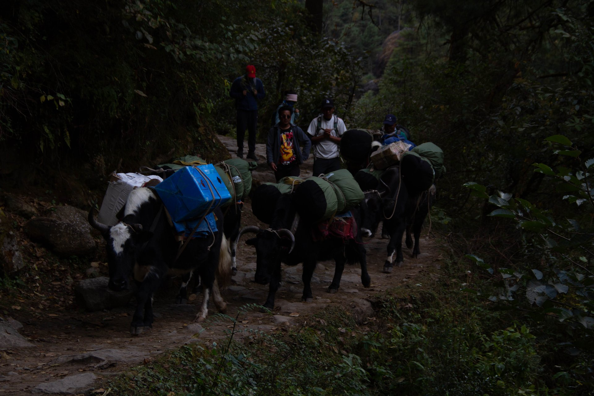

## Высота: где начинаются проблемы и что с ними делают

Трек не требует альпинистских навыков: ни кошек, ни верёвки, ни ледоруба. Требует он другого — терпения при наборе высоты.

Правило, вокруг которого построены все программы: **подниматься высоко, спать низко**. Отсюда акклиматизационные дни в Намче и Дингбоче, когда группа поднимается на 400–600 метров вверх и возвращается ночевать вниз. Отсюда же спуск в Пхакдинг в первый день: садятся в Лукле на 2 840 метрах, а ночуют ниже.

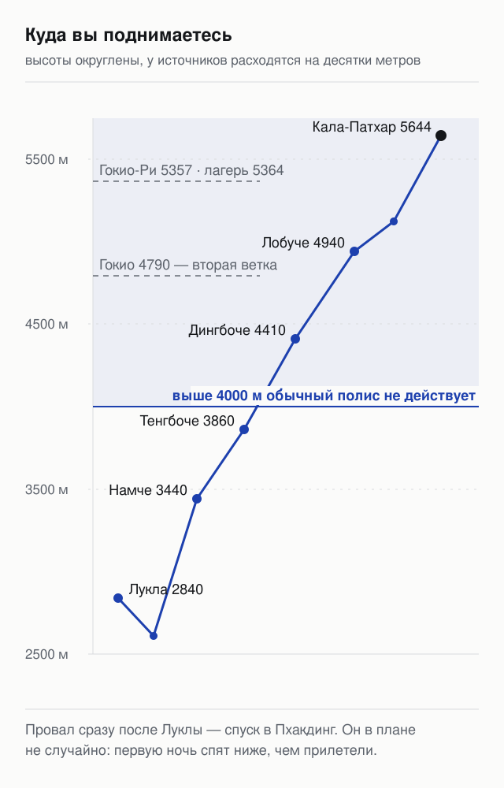

Проблемы начинаются не на вершине. В разобранных отчётах эвакуация вертолётом описана трижды, и во всех случаях это **Дингбоче и Лобуче — 4 400 и 4 940 метров**, то есть середина маршрута. Одному участнику стало плохо на 2 740 метрах, где по плану плохо быть не должно, и спускаться ниже было некуда.

Что из этого следует для планирования:

- **Резервный день — не роскошь.** Он тратится либо на погоду, либо на лишнюю ночь для акклиматизации, и оба расхода полезные.
- **Скорость решает больше, чем форма.** Хорошая физическая подготовка помогает идти, но от горной болезни не защищает; защищает медленный набор.
- **Симптомы называют вслух.** Головная боль, тошнота и одышка в покое — повод сказать гиду и сбавить, а не героически идти дальше.

## Как попасть в Луклу: самолёт, Рамечхап и вертолёт

Совет по туризму пишет, что до Луклы 30 минут лёта из Катманду. Формально верно, но в оба пиковых сезона это не так: рейсы переносят в аэропорт Рамечхап (Мантали) в 140 километрах юго-восточнее столицы, чтобы разгрузить расписание Катманду.

Значит, к перелёту добавляется наземный переезд. И вот здесь официальные оценки и практика расходятся: расчётными считаются 4–5 часов, а в отчётах сезона 2024–2025 дорога занимала **8–9 часов**, причём из-за дорожных работ выезд из Катманду сдвинулся с четырёх утра на полночь. Ночь перед первым днём трека проходит в микроавтобусе.

Второй способ — вертолёт. В отчётах он идёт по **500 долларов с человека** (≈41 461 ₽ по курсу ЦБ на 22.08.2026) в обе стороны, и в пик сезона очередь на него занимает часы: желающих больше, чем бортов. Самолёт с трансфером предлагали за 250 долларов, на месте находили около 200.

Третий способ — ногами снизу, от Джири или Салери. Дольше на неделю, зато не зависит от погодного окна в горах.

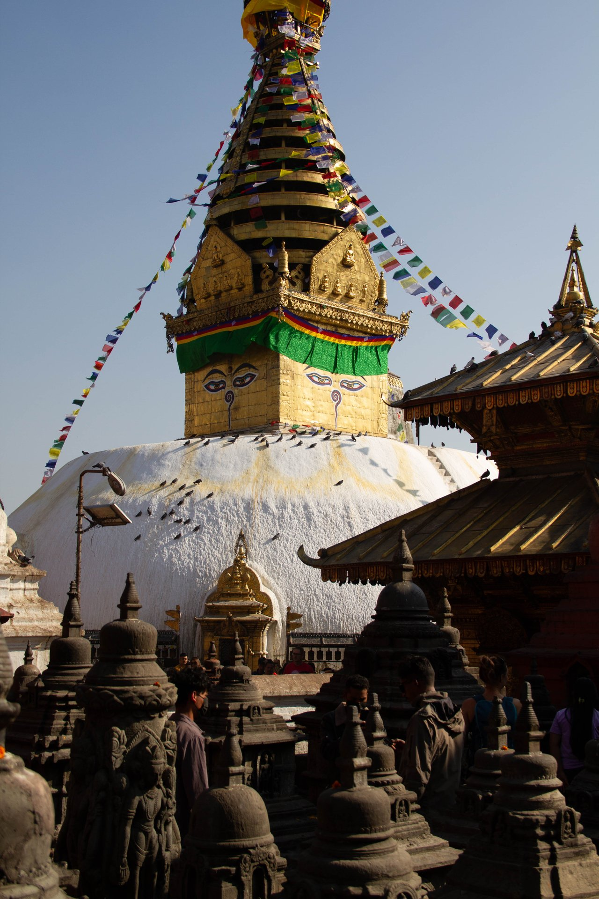

До Катманду из России летят со стыковкой — прямых рейсов нет. Смотреть маршрут стоит целиком, а не по отдельным плечам: разброс между вариантами стыковки больше, чем между авиакомпаниями.

<a href={aviasalesRoute('MOW','KTM','nepal_everest_trek_2026_flight')} class="aff-cta" rel="sponsored">Посмотреть перелёт Москва — Катманду</a> все стыковки в одной выдаче, оплата картой российского банка

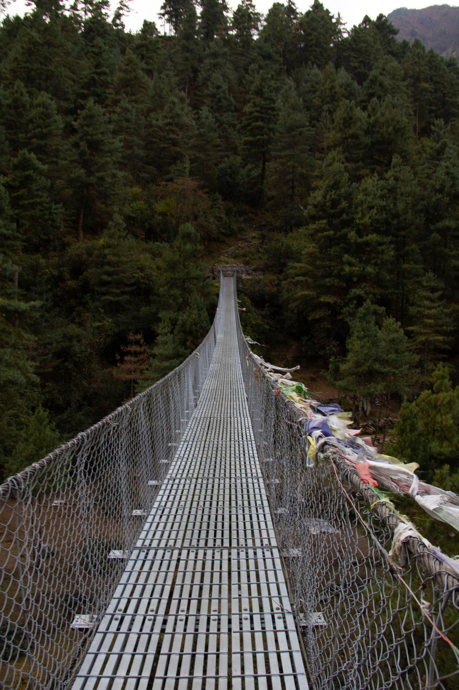

## Разрешения: два сбора, 6 000 рупий, и почему в интернете написано меньше

На классических маршрутах Кхумбу платят дважды.

**Вход в национальный парк Сагарматха — 3 000 рупий** с иностранца за одно посещение (граждане стран SAARC платят 1 500, непальцы 25). Это цифра самого Совета по туризму Непала ([источник](https://ntb.gov.np/sagarmatha-national-park), сверка 22.08.2026). Пост стоит в Монджо, разрешение можно взять заранее в Катманду.

**Trek-Card сельского муниципалитета Кхумбу Пасанг Лхаму — 3 000 рупий.** И вот тут расхождение, из-за которого стоит быть внимательным: почти все сайты, которые выдаёт поиск, называют 2 000 рупий. У самого муниципалитета в перечне услуг записано иначе: **страны SAARC и Китай — 2 000, остальные страны — 3 000** ([сельский муниципалитет Кхумбу Пасанг Лхаму](https://khumbupasanglhamumun.gov.np/), сверка 22.08.2026). Россия попадает во вторую группу. Карту выдают в информационном центре в Лукле, по паспорту и фотографии, за 15 минут.

Итого **6 000 рупий, около 3 248 ₽** по курсу ЦБ на 22.08.2026 (курс индийской рупии 0,866 ₽ за штуку, непальская привязана к ней как 1 к 1,6). Платят наличными в рупиях — банкоматов выше Намче нет.

Отдельно: в Солукхумбу есть зона особого разрешения — участок №5 муниципалитета Кхумбу Пасанг Лхаму ([Департамент иммиграции Непала](https://immigration.gov.np/trekking-route-and-permit-fee), сверка 22.08.2026). Стандартные маршруты на Гокио и в базовый лагерь туда не заходят, так что дополнительно платить не придётся.

Из практики сезона 2025 года: фотографию для разрешения на посту больше не спрашивают, а на самом посту в Монджо в пик сезона стоит очередь, и гиды с пачками паспортов своих групп проходят вперёд.

## Гид: правило есть, и оно строже, чем принято думать

Совет по туризму Непала формулирует прямо: с **31 марта 2023 года** в отдельных охраняемых территориях трекер обязан идти в сопровождении лицензированного гида и иметь карту TIMS, выданную турагентством. В списке маршрутов, на которые это распространяется, район Эвереста расписан поимённо — там и трек в базовый лагерь, и Гокио, и Чо-Ла, и Ренджо-Ла, и три перевала, и даже короткий маршрут к смотровой ([Совет по туризму Непала](https://ntb.gov.np/plan-your-trip/before-you-come/tims-card), сверка 22.08.2026).

То есть по букве правила ни один из пяти сценариев выше в одиночку не проходится.

При этом в отчётах 2024–2026 годов люди регулярно описывают, как шли по Кхумбу сами: и осенью 2024-го, и осенью 2025-го, и в феврале 2026-го, встречая на тропе других одиночек. Разрешения им продавали, на постах разворачивать не пытались.

Как это читать. Правило существует и записано ведомством; практика в Кхумбу от него расходится, но расхождение — не гарантия и не разрешение. Штраф, снятие с маршрута и отказ в следующих разрешениях — заявленные последствия, и меняться местная снисходительность может без предупреждения. Плюс у гида есть отдельная от бюрократии польза: он держит темп группы и первым замечает, что человеку плохо.

Носильщик — отдельная услуга и не заменяет гида: в отчётах он идёт по **20 долларов в день** (≈1 658 ₽) на три баула.

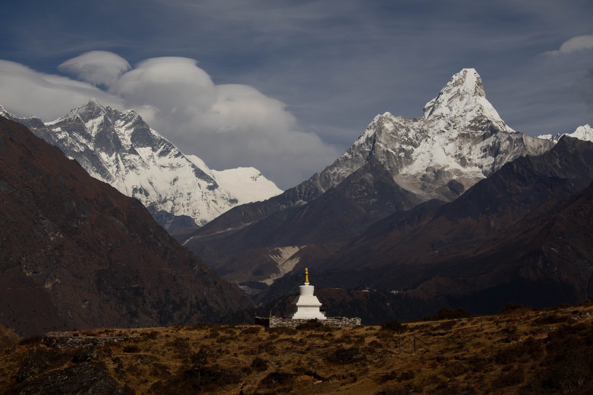

## Виза: 30, 50 или 125 долларов и правило 150 дней

Визу ставят по прилёте в аэропорту Трибхуван. Тарифы Департамента иммиграции Непала едины для всех и не зависят от гражданства ([источник](https://immigration.gov.np/visa-fees-and-documents), сверка 22.08.2026):

| Срок | Сбор | По курсу ЦБ на 22.08.2026 |
|---|---|---|
| 15 дней | 30 $ | ≈2 488 ₽ |
| 30 дней | 50 $ | ≈4 146 ₽ |
| 90 дней | 125 $ | ≈10 365 ₽ |

Все три варианта многократные. Продление стоит 3 доллара за день при минимуме в 15 дней, за просрочку берут 5 долларов в день.

Деталь, которую пересказы обычно теряют: **суммарно пробыть в стране по туристической визе можно 150 дней за визовый год, и год этот считается с января по декабрь**, а не от даты вашего въезда. Для двухнедельного трека это неважно, а для тех, кто едет весной и осенью одного года, — важно.

Под сценарий 5–6 дней хватает пятнадцатидневной визы. Под всё остальное берите тридцатидневную: разница в 20 долларов дешевле, чем продлевать на месте.

## Сколько стоит поездка целиком

Расходы делятся на три части: дорога, разрешения и жизнь на тропе. Цифры ниже — по курсу ЦБ на 22.08.2026 и с указанием, откуда они.

| Статья | Сколько | Откуда цифра |
|---|---|---|
| Виза на 30 дней | 50 $ ≈ 4 146 ₽ | Департамент иммиграции Непала |
| Вход в парк Сагарматха | 3 000 рупий ≈ 1 624 ₽ | Совет по туризму Непала |
| Trek-Card муниципалитета | 3 000 рупий ≈ 1 624 ₽ | муниципалитет Кхумбу Пасанг Лхаму |
| Перелёт в Луклу и обратно | 200–500 $ за плечо | со слов участников, сезон 2024–2025 |
| Ночлег на тропе | 200–500 рупий за номер | со слов участников |
| Еда на тропе | 600–800 рупий завтрак, 900–1 500 горячее | со слов участников |
| Носильщик | 20 $ в день | со слов участников |
| Страховка с эвакуацией | от 150 $ | со слов участников |

Обратите внимание на перекос: **разрешения — самая обсуждаемая и самая мелкая статья**. Шесть тысяч рупий это около 3 248 ₽, тогда как один перелёт в Луклу может стоить в двенадцать раз больше.

Жильё на тропе дёшево по номеру, но берут отдельно за всё: горячий душ в Намче со слов участников стоил 600 рупий, розетка для зарядки — по 200 рупий за устройство. Часть лоджей работает по схеме полного пансиона: в одном из отчётов это 50 долларов за ночь с душем, зарядкой и тремя приёмами пищи, плюс 30 долларов, если живёте один в номере.

Оценка расхода на тропе, которая встречается в отчётах, — **около 3 000 рупий в день** (≈1 624 ₽) при самостоятельной поездке. Организованный вариант в одном из отчётов сезона 2025 года стоил **2 000 долларов** за пакет с носильщиком и внутренними перелётами, но без питания.

В Катманду до и после трека закладывайте пару ночей: рейсы в горы утренние, и приезжать в день вылета рискованно.

<a href={ostrovokSearch('nepal_everest_trek_2026_stay')} class="aff-cta" rel="sponsored">Подобрать отель в Катманду</a> оплата российской картой, бронь без предоплаты у части отелей

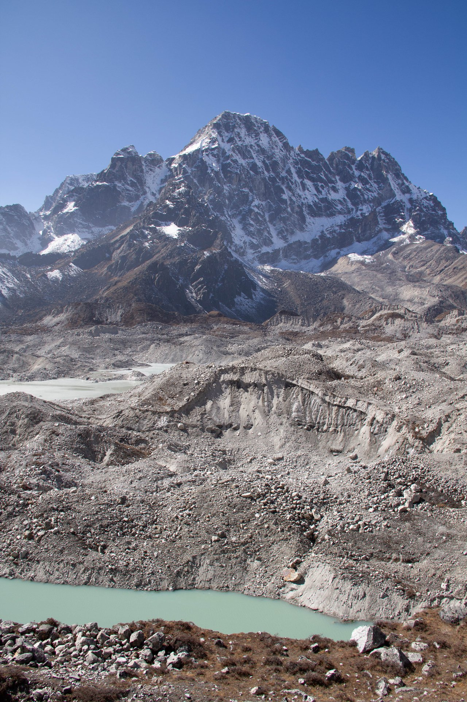

## Страховка: почему обычный полис здесь не работает

Это тот пункт, на котором экономить нельзя, и причина видна из раздела про высоту: эвакуация с 4 400 метров в отчётах встречается трижды, и вывозят оттуда вертолётом.

Обычный туристический полис в горах не поможет по двум причинам. Первая — **высотная граница**: массовые продукты перестают действовать выше 3 000–4 000 метров, а весь интересный участок маршрута лежит выше. Вторая — **поиск и эвакуация**: вертолётный вылет в Гималаях идёт отдельной опцией, и без неё страховая оплатит лечение, но не доставку до больницы.

Что должно быть в полисе под этот трек:

- **треккинг как вид активности** с указанием предельной высоты не ниже 5 600 метров;
- **поисково-спасательные работы и эвакуация вертолётом** отдельной строкой;
- **сумма покрытия** с запасом: в отчёте одного из участников полис на 14 дней с покрытием 50 000 евро и опцией эвакуации стоил 16 914 ₽.

Разброс цен большой, и зависит он не от страховщика, а от того, включена ли эвакуация и до какой высоты. Сравнивать имеет смысл по этим двум параметрам, а не по итоговой цифре.

<a href={cherehapaTravel('nepal_everest_trek_2026_ins')} class="aff-cta" rel="sponsored">Сравнить полисы с эвакуацией</a> Непал в форме выбирается вручную, активность — треккинг с указанием высоты; оплата картой РФ, полис приходит в PDF

## Связь, деньги и что взять

**Связь.** Местная eSIM берётся в Катманду или заранее. По отчётам десяти гигабайт хватает на трек с запасом, но работает связь неровно: выше 3 000 метров с перебоями, на 4 500 перестаёт ловить. В лоджах есть платный вайфай, и он тоже капризен.

<a href={airaloSub('nepal_everest_trek_2026_esim')} class="aff-cta" rel="sponsored">Взять eSIM на Непал</a> подключается до вылета, физическую симку менять не надо

**Деньги.** Наличные рупии нужны в количестве: банкоматов выше Намче нет, а разрешения, ночлег и еда идут наличными. Меняют в Катманду; курс в отчётах сезона 2025–2026 годов — 139–142 рупии за доллар.

**Снаряжение.** Кошки, ледоруб и каска на классических маршрутах не нужны. Нужны треккинговые ботинки, мембрана, тёплый слой и несколько пар носков. Дневная температура на высотах до 4 000 метров держится около +10…+15 °C, выше 5 000 ночью опускается ниже −10 °C, и ветер это ощущение усиливает.

Отопления в номерах лоджей нет — греются в общей столовой у печки. Спальник имеет смысл даже там, где выдают одеяла.

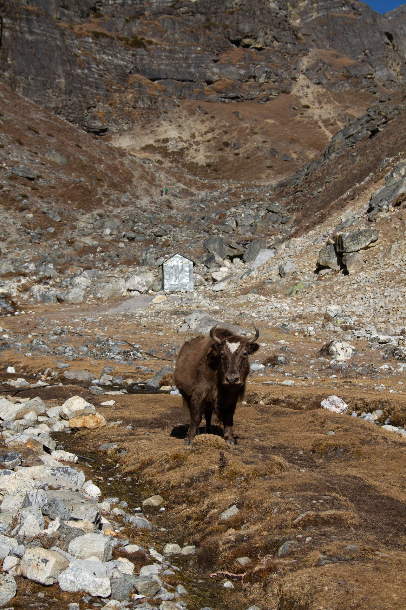

## Что пишут те, кто был

Разобрал десять отчётов о районе Эвереста с форума путешественников — 380 сообщений за период с ноября 2024 по июль 2026 года. Это выборка одного раздела одного форума, представительной её считать нельзя. Но несколько вещей в ней повторяются у разных авторов, и в официальных описаниях маршрута их нет.

**Ломается не тропа, а логистика.** Больше всего места в отчётах занимает не подъём, а дорога до старта: ожидание погоды в аэропорту по два дня, ночной выезд в Рамечхап, восьмичасовой переезд обратно. Люди, которые прошли трек без единой проблемы, отдельно пишут про эти два дня как про худшую часть поездки.

**Плохо становится в середине, а не наверху.** Три независимых отчёта описывают эвакуацию вертолётом, и все три — с Дингбоче и Лобуче. В одном из них участник коммерческой группы был вывезен по страховке из Дингбоче, в другом эвакуировали попутчика с того же места, в третьем — коллегу с Лобуче с последующей ночью в больнице Катманду.

**Отчёты расходятся в том, нужна ли акклиматизация по расписанию.** В одном и том же треде встречаются и подробная схема с двумя днями в Намче и радиальными выходами, и рассказ человека, живущего в горах по месяцу в год, который говорит, что дополнительные дни ему не нужны. Разброс объясняется опытом высоты, а не силой: тот же автор, который отстоял схему, отдельно пишет, что в предыдущий заход подошёл к акклиматизации неразумно и потом неделю мучился.

**Погода осенью двойственная.** Отчёты за октябрь-ноябрь 2024 года описывают ровный сезон с одной метелью в Дингбоче 4 ноября, после которой все дни были ясными. Отчёты за конец октября 2025-го описывают циклон: 28 октября последний сухой день, потом снег в Гокио, закрытая Лукла и обсуждение, уходить ли вниз пешком. Разница между двумя годами в одном и том же месяце — лучший аргумент за резервный день.

**Претензии повторяются.** Очередь на проверку разрешений в Монджо и в Намче, где гиды с пачками паспортов идут вперёд. Толпы на подъёме в Намче в пик сезона. Плата за каждую мелочь отдельно: душ, розетка, вайфай. И тропа между мостом Хиллари и постом, которую в одном отчёте описывают как каменно-корневую лестницу без единой скамейки.

**Отдельное наблюдение про кадры.** Несколько человек пишут, что ехали за конкретной картинкой, виденной в чужом отчёте, — сухими каменными склонами Гокио-Ри, — а попали в снег. Картинка в чужом отчёте это один день одного года, и планировать по ней не стоит.

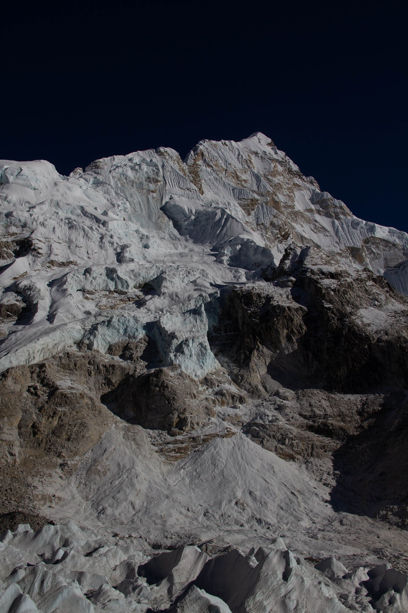

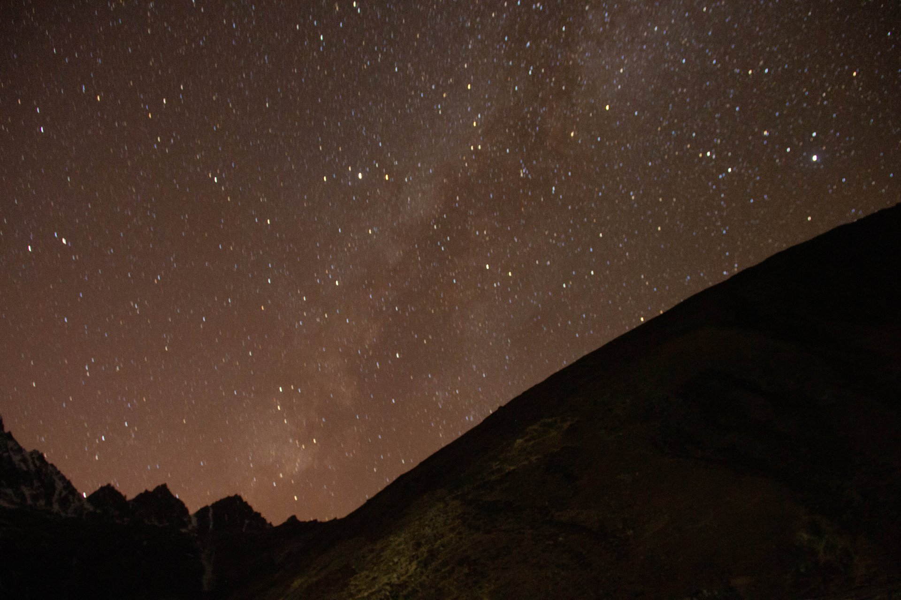

## Частые вопросы

**Виден ли Эверест из базового лагеря?**
Нет. Из самого лагеря вершина закрыта отрогом Нупцзе. Её видно с холма Кала-Патхар (5 644 м), куда поднимаются отдельным выходом, и с гребня над Намче в начале маршрута.

**Сколько стоят разрешения?**
Два сбора по 3 000 рупий: вход в национальный парк Сагарматха и Trek-Card муниципалитета Кхумбу Пасанг Лхаму. Вместе 6 000 рупий, около 3 248 ₽ по курсу ЦБ на 22.08.2026. Цифра 2 000 за второй сбор, которая встречается на многих сайтах, относится к странам SAARC и Китаю.

**Нужен ли гид?**
По правилам Совета по туризму Непала — да, с 31 марта 2023 года, и трек в базовый лагерь с Гокио названы в списке маршрутов поимённо. В отчётах 2024–2026 годов люди ходят там в одиночку, но это расхождение практики с правилом, а не отмена правила.

**Какая нужна физическая подготовка?**
Альпинистских навыков маршрут не требует. Требуется выносливость для многочасовой ходьбы по пересечённой местности несколько дней подряд. Важнее подготовки — темп набора высоты: горная болезнь настигает и подготовленных.

**Когда лучше ехать?**
С конца сентября по конец ноября, если нужна лучшая видимость. С середины марта по середину мая, если хотите увидеть цветущие рододендроны и палаточный лагерь экспедиций. Между этими окнами — муссон, зимой закрываются перевалы.

**Сколько дней закладывать?**
На базовый лагерь 12–14 дней в Кхумбу, на Гокио 10–12, на кольцо через Чо-Ла 16–18. Плюс два дня на дорогу из России и минимум один резервный день на погоду.

**Работает ли обычная туристическая страховка?**
Нет. Массовые полисы перестают действовать выше 3 000–4 000 метров, а эвакуация вертолётом идёт отдельной опцией. Нужен полис с треккингом до 5 600 метров и с поисково-спасательными работами.

**Можно ли обойтись без перелёта в Луклу?**
Да, зайти пешком снизу от Джири или Салери. Это добавляет 5–7 дней, зато снимает зависимость от погодного окна в горах и даёт плавную акклиматизацию.

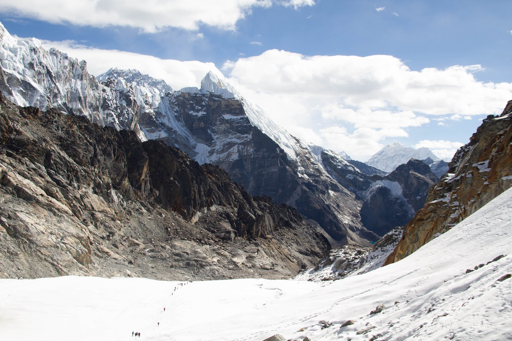

## Что почитать дальше

- [Патагония: маршруты, сезон и бюджет](/blog/patagonia-2026/) — другой конец света с той же логикой дальней поездки и высоким чеком.
- [Камчатка: как спланировать поездку](/blog/kamchatka-guide-2026/) — если хочется гор и вулканов без визы и перелёта со стыковкой.
- [Страховка для путешествий: что покрывает и чего не покрывает](/blog/strahovka-dlya-puteshestviy-2026/) — подробно про то, как читать условия полиса.

<a href={youtravelSub('nepal_everest_trek_2026_bottom')} class="aff-cta" rel="sponsored">Посмотреть авторские туры в Непал</a> малые группы с русскоязычным гидом, даты и программа видны до оплаты
