import AffiliateNote from '../../components/post/AffiliateNote.astro';
import { airaloSub, aviasalesRoute, cherehapaCountry, cherehapaTravel, ostrovokCountry, youtravelSub } from '../../data/affiliate.js';

Солнце садится за хребет, и на секунду вершина Аораки становится розовой — единственное освещённое пятно на всю долину. Внизу лежит озеро Пукаки, вода в нём молочно-бирюзовая от ледниковой муки, и по берегу стоят машины с людьми, которые приехали ровно за этой минутой.

Через три дня и четыреста километров к северу мы летели над океаном у Кайкоуры на четырёхместном самолёте, и пилот заваливал крыло, чтобы стало видно кашалота. Кит выдохнул, ушёл вниз, оставив на воде белое пятно размером с теннисный корт.

Кадры в этой статье сняты с 13 по 18 марта 2026 года на Южном острове: Кайкоура, долина Мак-Кензи и Аораки, Ванака и Ройс-Пик, перевал Хааст и Западный берег. Это новозеландская осень — тот сезон, который дальше в статье и советуется. **Северного острова в этой поездке не было, и там, где речь пойдёт о нём, это будут чужие данные, а не мои кадры.**

> **Если коротко:** россиянам нужна полноценная **Visitor Visa**, электронное разрешение NZeTA не подходит. Стоит она **441 NZD на одного человека** — и это сумма целиком, а не «441 плюс сбор». Вдвоём по одной заявке выходит **541 NZD**, потому что визовый сбор берут за заявление, а природный — за человека. Прямых рейсов нет: дешёвая дорога идёт **через Китай, 29–44 часа** в одну сторону, туда-обратно **от 108 000 ₽**. Главная ловушка планирования — **места в хижинах на пеших маршрутах разобрали в мае**, за полгода до сезона. Три недели с перелётом, машиной и жильём обходятся примерно в **420 000 ₽** на человека. Медицина для иностранцев платная, а спасательные работы в горах выставляют счётом: <a href={cherehapaCountry('new-zealand', 'new_zealand_2026_tldr')} class="aff-cta" rel="sponsored">подобрать страховку в Новую Зеландию</a>. <a href={youtravelSub('new_zealand_guide_2026_top')} class="aff-cta" rel="sponsored">Посмотреть авторские туры в Новую Зеландию</a> малые группы с русскоязычным гидом, маршрут и даты видны до оплаты. 

<AffiliateNote />

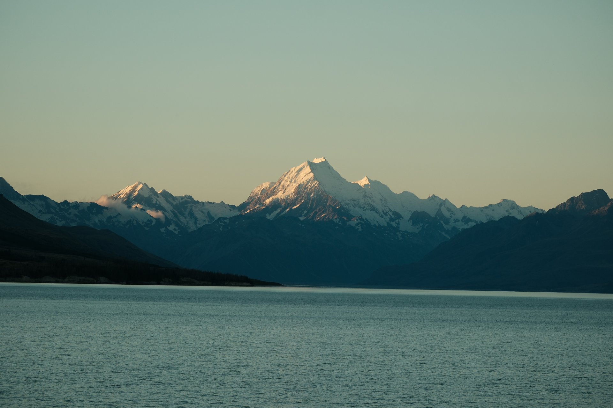

---

## Новая Зеландия — это не одна страна, а две разные поездки

Страна вытянута на полторы тысячи километров с севера на юг, и её два главных острова похожи не больше, чем Кубань на Камчатку.

**Северный остров** — вулканы, гейзеры, кипящие озёра Роторуа, длинные пляжи, полтора миллиона человек в Окленде и почти вся городская жизнь страны. Климат мягче, зелени больше, гор меньше.

**Южный остров** — Южные Альпы во всю длину, ледники, фьорды, бирюзовые ледниковые озёра, овцы и почти пустые дороги. Людей здесь вчетверо меньше, чем на Северном, а пейзажей, ради которых летят на другой конец света, — вчетверо больше.

Между островами три часа на пароме через пролив Кука или час на самолёте. В одну поездку помещаются оба, но каждый переезд стоит половины дня, и это первое, с чем придётся считаться при планировании.

Если времени меньше двух недель, выбор почти очевиден: **берите Южный остров целиком и не размазывайтесь**. Вулканы и гейзеры Северного никуда не денутся, а Фьордленд с ледниками — то, чего нет больше нигде на этой планете в такой концентрации.

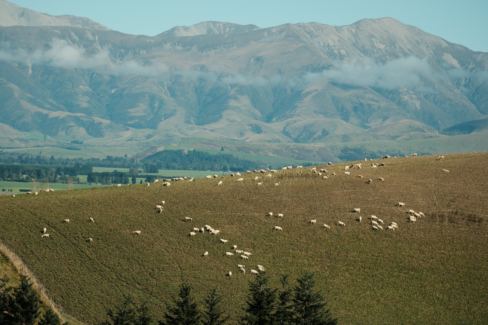

---

## Когда ехать: три календаря, которые не совпадают

Первое, что ломает планирование: **времена года перевёрнуты**. Январь — разгар лета, июль — зима. Самый холодный месяц — июль, самый тёплый — январь или февраль, это данные новозеландской метеослужбы.

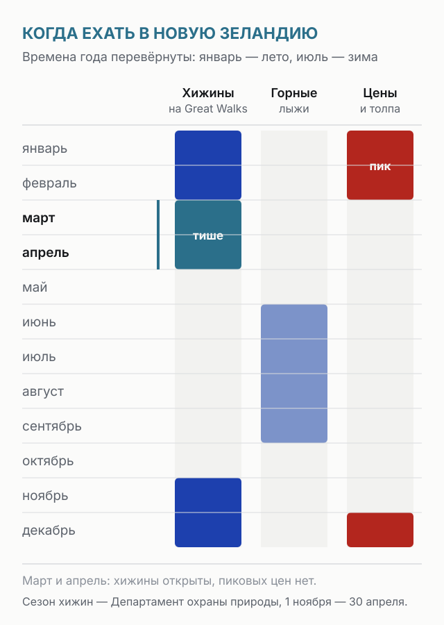

**Пешие маршруты — с 1 ноября по 30 апреля.** Это официальный сезон хижин на маршрутах Great Walks, установленный Департаментом охраны природы. Вне сезона хижины работают, но без плиты, без газа и часто без смотрителя, а перевалы могут быть под снегом.

**Горные лыжи — с июня по сентябрь.** Курорты вокруг Квинстауна и Ванаки. Ради лыж на другой конец света летят редко, но если поездка выпала на наше лето, это не потерянный сезон.

**Пик цен и толпы — с декабря по февраль.** Совпадают три вещи: местные летние каникулы, Рождество и главный туристический наплыв. Аренда кемпера в это время стоит вдвое дороже, чем в межсезонье, а места в хижинах разбирают в первые минуты продаж.

**Март и апрель — лучший компромисс.** Хижины ещё работают, вода в озёрах прогрета за лето, дороги открыты, а пиковых цен нет. Мои кадры сняты в середине марта, и за неделю поездки погода дала всё: жару в Мак-Кензи, шторм на Западном берегу и ясную ночь с южным сиянием.

Март — мой любимый месяц здесь, и причина не в погоде. Туристов меньше, трава на склонах жёлтая, а снег на вершинах свежий: конец лета и начало зимы стоят в одном кадре. На Ройс-Пике в середине марта во второй половине дня на гребне было три человека вместе со мной — на той самой точке, где летом по утрам стоит очередь за одинаковым снимком.

Про сияние подробнее — в отдельном разборе о том, [где и когда его ловить на Южном острове](/blog/aurora-new-zealand-2026/): у него своя логика, привязанная к солнечному циклу и равноденствиям, а не к туристическому сезону.

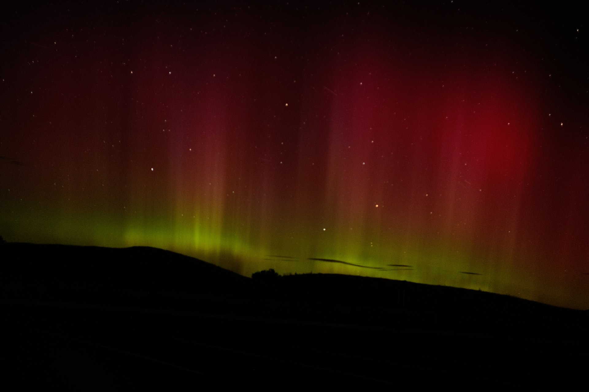

---

## Главная ловушка планирования: хижины разбирают в мае

Это то, чего нет ни в одной русской статье о Новой Зеландии, и то, что рушит поездку сильнее визы.

Места в хижинах на пеших маршрутах продаются **не круглый год, а одним залпом за полгода до сезона**. На сезон 2026/27 продажи открыли 12–21 мая 2026 года, по одному маршруту в день: Папароа 12 мая, **Милфорд 13 мая**, Абель-Тасман 14-го, Рутберн 15-го, Кеплер 19-го, Хифи и Фангануи 20-го, Тонгариро и Ракиура 21-го.

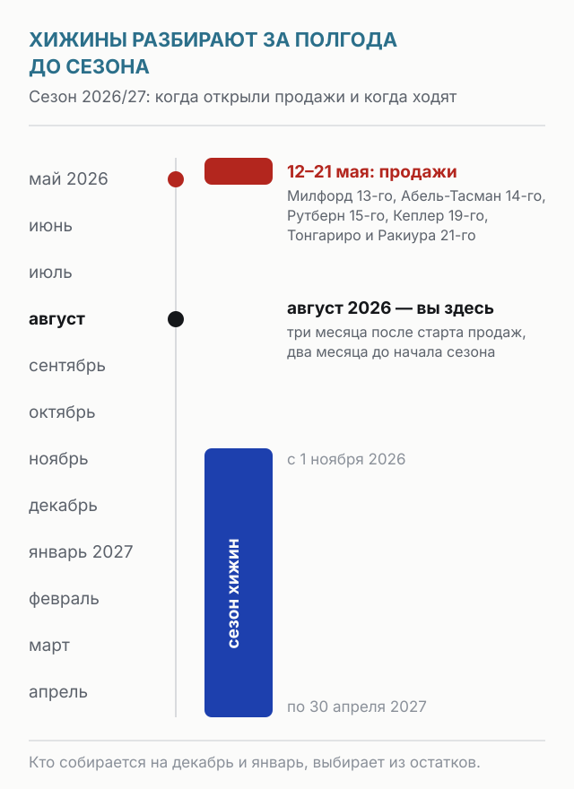

Департамент охраны природы сам сравнивает спрос на популярные маршруты с продажей билетов на концерт. Что это означает на практике: **если вы читаете это в августе и собираетесь идти Милфорд в декабре или январе — вы опоздали на три месяца.**

Что с этим делать:

- **Смотреть остатки прямо сейчас, а не «когда определимся с датами».** Отмены случаются, места возвращаются в продажу, но ловить их надо постоянно, а не раз в месяц.
- **Брать менее раскрученный маршрут.** Кеплер и Рутберн проходят по тем же горам Фьордленда, а разбирают их медленнее Милфорда.
- **Идти однодневками.** Первые километры Рутберна, долина Хукер под Аораки, Ройс-Пик над Ванакой — всё это делается за день, без броней и без хижин.
- **Заменить трек круизом.** Милфорд-Саунд смотрят с воды за два часа, и это отдельная поездка со своей логистикой — [как туда добраться и что выбрать, каяк или круиз](/blog/milford-sound-2026/).

Отдельно про **Милфорд-Трек**: это 55 километров, четыре дня и три ночи, и ходят его **только в одну сторону**. К началу и концу маршрута нет автодороги — на старт везёт катер до причала Глейд, с финиша забирают от Сэндфлай-Пойнт, и транспорт бронируется заранее отдельно от хижин. Ночь в хижине стоит иностранцу **152 NZD** против 106 для новозеландца, то есть три ночи — 456 NZD, около **22 600 ₽** только за нары.

Если бронь есть, а вы не пришли или пришли не в свою дату, департамент прямо предупреждает: могут выписать штраф или развернуть, если хижина заполнена.

---

## Дорога: прямых рейсов нет, и это 30–44 часа

Проверка на поиске билетов 24 августа 2026 года: фильтр «прямые рейсы» отдаёт **«нет билетов»**. Из России в Новую Зеландию не летает никто.

Дешёвая дорога изменилась и идёт теперь **через Китай**, а не через Персидский залив, как писали статьи трёхлетней давности. Замер на реальные даты поездки — 10 февраля по 4 марта 2027 года, Москва — Окленд туда-обратно:

| Вариант | Цена | Время в пути туда |
|---|---|---|
| Самый дешёвый, через Хайкоу | 113 583 ₽ | 44 часа |
| Соседние даты, 13 и 16 февраля | 108 250 – 109 212 ₽ | те же 40+ часов |
| Короче в пути, через Гуанчжоу | 127 929 ₽ | 29 ч 40 мин |
| Самый быстрый, через Дубай | 291 196 ₽ | 24 ч 55 мин |

Разрыв между китайским и дубайским маршрутом — **в два с половиной раза по деньгам и пять часов по времени**. Пять часов на фоне суток в дороге стоят 160 тысяч рублей, и это тот выбор, который каждый делает сам.

⚠️ **Витринное «от 47 538 ₽», которое показывает поиск на главной, — не про вашу поездку.** Это цена в одну сторону и на 8 сентября, то есть на конец новозеландской зимы. На рекомендуемый февраль–март в обе стороны считайте от 108 тысяч.

<a href={aviasalesRoute('MOW', 'AKL', 'new_zealand_guide_2026_flight')} class="aff-cta" rel="sponsored">Билеты Москва — Окленд</a> все стыковки в одной выдаче, видно время пересадки и цену под конкретные даты

### Про пересадку в Китае есть срок годности

Безвизовый въезд в Китай для граждан России действует **с 15 сентября 2025 по 14 сентября 2026 года** — так написано в разъяснении генерального консульства КНР. Тридцать дней, транзит в список целей входит.

Продление на дальнейший срок на момент публикации не объявлено. **Для зимней поездки 2026/27 это означает: к моменту вылета режим может кончиться**, и пятнадцатичасовую пересадку в Пекине придётся сидеть в транзитной зоне вместо города. Перед покупкой билета с длинной стыковкой стоит проверить, что решили к этому времени.

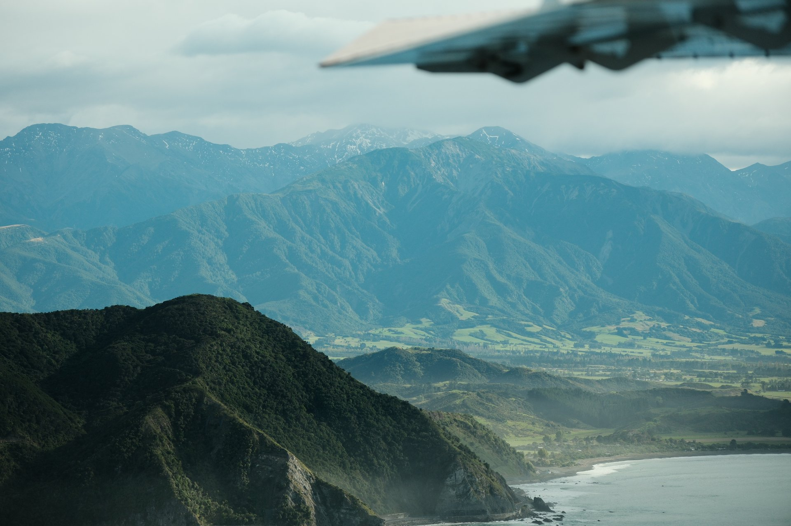

---

## Погода: семь метров дождя и тридцать сантиметров в ста километрах

Новозеландская метеослужба даёт цифру, в которую трудно поверить: **Милфорд-Саунд получает почти 7 метров осадков в год**. Александра в Центральном Отаго, до которой оттуда около сотни километров по прямой, — примерно **30 сантиметров**. Разница в двадцать с лишним раз.

Причина — Южные Альпы. Влажный западный ветер с Тасманова моря упирается в хребет, отдаёт всю воду на западном склоне и приходит на восточный сухим. Отсюда практическое следствие: **на Южном острове погода зависит не от месяца, а от того, с какой стороны хребта вы стоите**.

В остальной стране осадков 600–1600 мм в год, среднегодовая температура от 10 °C на юге до 16 °C на севере. Солнца много — больше двух тысяч часов в год в защищённых местах.

Две вещи, которые метеослужба отмечает отдельно и которые ощущаются кожей:

- **Ультрафиолет летом метеослужба описывает как высокий, а в горах — как экстремальный.** Крем нужен не «на пляж», а каждый день, включая пасмурный.
- **Погода меняется за часы.** Утро на перевале Хааст было ясным, к полудню облако сползло с хребта и накрыло дорогу целиком.

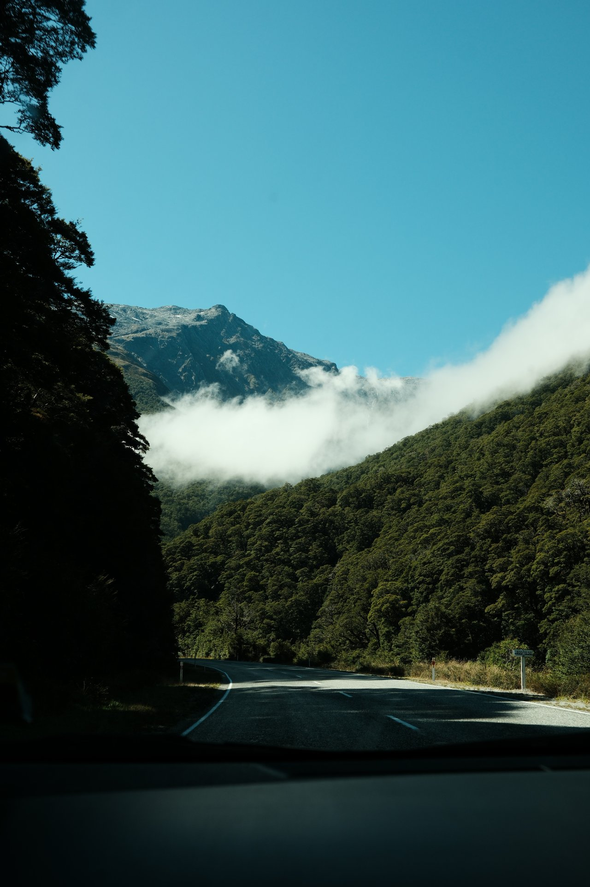

---

## Что смотреть: пять мест, ради которых летят

### Кайкоура — киты в получасе от берега

На восточном берегу Южного острова материковый шельф обрывается почти у пляжа: глубина полтора километра начинается в нескольких километрах от суши. Кашалоты кормятся прямо здесь и держатся круглый год.

Смотреть можно с катера или с маленького самолёта. **Берите самолёт.** С воды видно спину и фонтан, и мозг говорит «ну кит». С воздуха видно кашалота целиком — восемнадцать метров и полсотни тонн, — и в этот момент масштаб доходит по-настоящему. Плюс не укачивает.

Полёт занимает около получаса и стоит **180–250 NZD** (≈8 900–12 400 ₽) — по моему чеку весны 2026 года. Самолёт четырёхместный, набиваются в него плотно.

В тот же вылет попались дельфины. Это дасковые дельфины, они живут здесь постоянно и держатся стаями по 200–500 голов — на воде это сотни точек, растянутые на полкилометра. Кашалот посреди этой компании выглядит как старший брат.

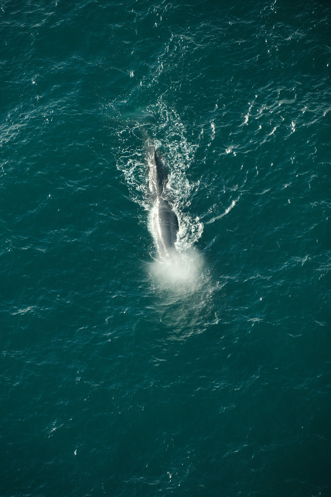

На берегу у Кайкоуры лежит колония новозеландских морских котиков — без билетов и заборов, вдоль обычной дороги. Правило одно: не подходить ближе двадцати метров и не вставать между зверем и водой.

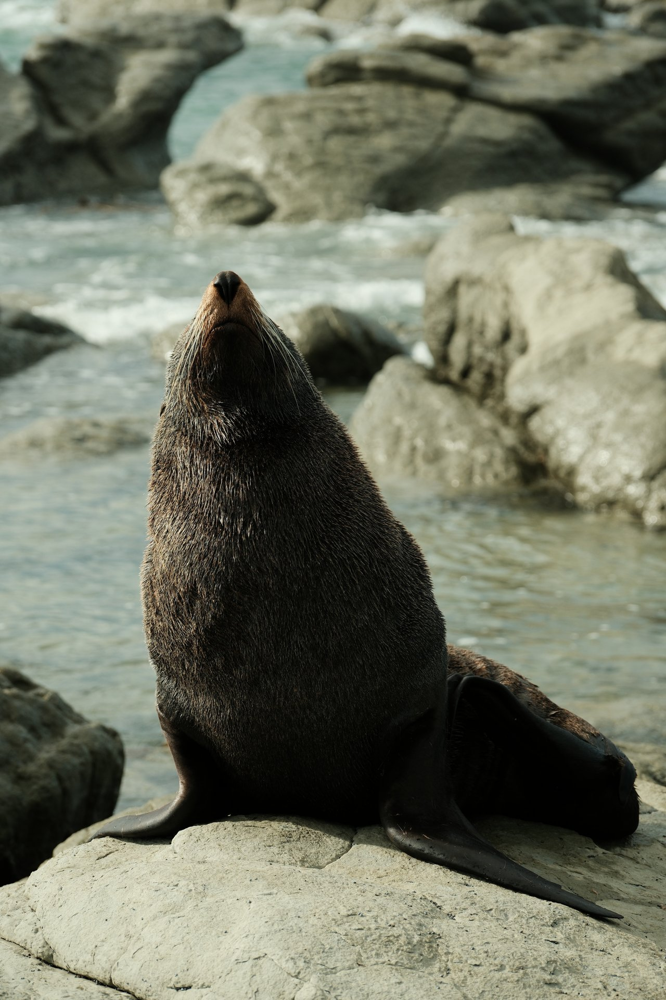

### Долина Мак-Кензи и Аораки — те самые бирюзовые озёра

Тéкапо и Пукаки — ледниковые озёра, и их цвет даёт не глубина, а ледниковая мука: перетёртая в пыль порода, которая висит в воде и рассеивает свет. Вблизи вода мутная, издалека — бирюзовая.

Аораки, он же Маунт-Кук, — высшая точка страны и главный вид долины. Смотровые площадки стоят вдоль дороги на Пукаки, а к самой горе идёт долина Хукер — три часа туда-обратно по ровной тропе с подвесными мостами.

Вся долина Мак-Кензи входит в международный заповедник тёмного неба, поэтому здесь же ловят и Млечный Путь, и южное сияние.

Расстояния по моей поездке: из Крайстчерча до Пукаки 3,5 часа по трассам SH1 и SH8, из Квинстауна 2,5 часа через Твайзел, из Текапо — 55 километров и 33 минуты. Без машины сюда ехать смысла нет.

Две вещи, которые стоят остановки. Прямо у воды работает **лососевая ферма** — лучший перекус после дороги. И вдоль берега идёт **велотрек до озера Охау**, с видом на горы весь маршрут.

Главная ошибка здесь — проехать мимо за десять минут ради снимка со смотровой. Смотровых вдоль дороги на Маунт-Кук несколько, и каждая бьёт по-своему; лучшее, что можно сделать, — заглушить двигатель и постоять.

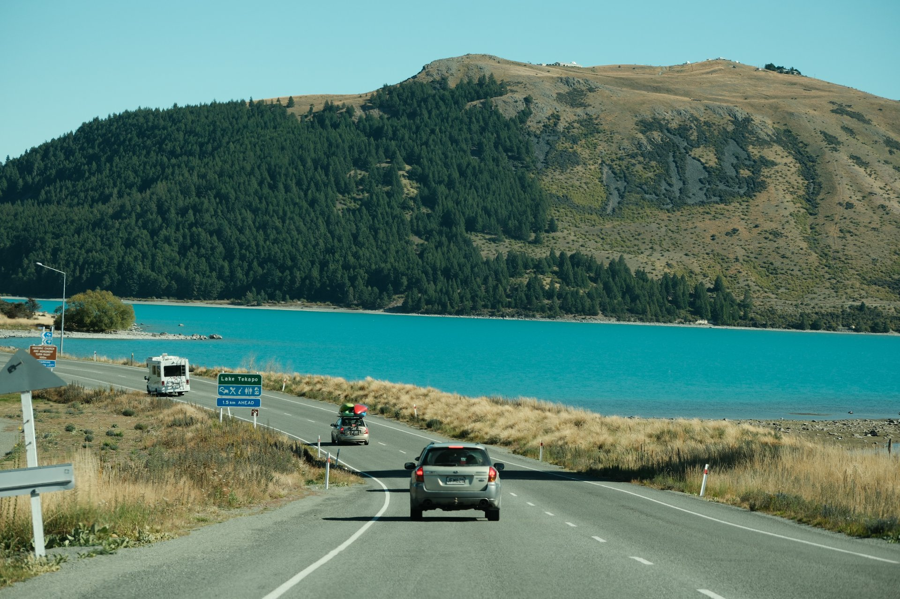

### Ванака и Квинстаун — горы, до которых легко дойти

Квинстаун — курортный городок на берегу озера Уакатипу и база для всего активного: прыжки с тарзанки, рафтинг, катера, вертолёты. Ванака в часе езды — то же самое, но тише и дешевле.

Над Ванакой поднимается **Ройс-Пик** — шестнадцать километров и 1228 метров набора, самый растиражированный кадр страны. В соцсетях он выглядит так, будто к гребню подъезжают на машине. На деле это подъём по голому склону действующей овечьей фермы: **ни одного дерева, ни тени, ни воды** от парковки до верха. Полтора-два литра на человека и крем от солнца — обязательны.

Парковка в шести километрах от Ванаки, мест около сотни, к девяти утра забита. Отсюда мой главный совет по этому маршруту: **не гонитесь за рассветной толпой, выходите после обеда**. Вид тот же, тропа пустая, а свет для фотографии мягче полуденного. Обратные 1 200 метров вниз по той же крутизне бьют по коленям сильнее, чем подъём, — обувь с протектором тут не роскошь.

Сам трек бесплатный. С 1 октября по 10 ноября он закрыт на окот. [Подробный разбор маршрута — в отдельной статье](/blog/roys-peak-2026/).

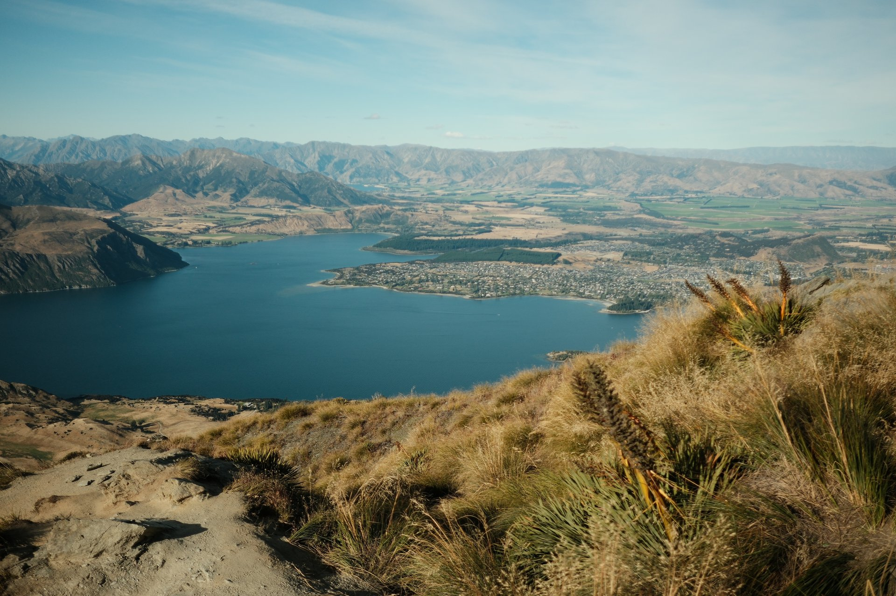

### Фьордленд — то, ради чего стоит терпеть дорогу

Милфорд-Саунд — фьорд с отвесными стенами в километр высотой. Дождь здесь не портит впечатление, а создаёт его: каждая стена покрывается сотней временных водопадов, которых в сухую погоду нет.

Дорога в Милфорд из Те-Анау занимает около двух часов, из Квинстауна — четыре с лишним в одну сторону. Ехать однодневкой из Квинстауна означает восемь часов за рулём ради двух часов на воде: автобус в шесть утра, толпа на палубе, сорок одинаковых снимков в телефоне к ужину.

**Каяк против круиза.** Круиз стоит около 100 NZD, морской каяк-тур — около 240, втрое дороже. Разница не в деньгах, а в положении: с катера вы зритель на палубе, между вами и фьордом двигатель и голос гида в динамике. С каяка вы на уровне воды и сами по себе — можно подойти вплотную под водопад, можно перестать грести и сидеть в тишине. Мне это стоило вымокнуть насквозь, и я об этом не жалею.

Четыре вещи, которые стоило знать заранее:

- **Ехать надо в дождь.** Это одно из самых дождливых мест планеты, и постоянных водопадов здесь всего два. Остальные включает ливень: после хорошего дождя каждая стена сверху донизу превращается в сотню струй. Прогноз с дождём на неделю — повод ехать, а не переносить.
- **Мошка namu.** На берегу в безветрие она сжирает заживо за минуты. Репеллент с DEET наносить **в машине, до того как открыл дверь**, а не после.
- **Заправляться в Те-Анау под полную.** Дальше сто двадцать километров до фьорда без заправок и без связи, дорога одна.
- **Ночевать в Те-Анау.** Это даёт ранний слот на воду до автобусных толп из Квинстауна.

Март и апрель здесь лучше не только по людям, но и по мошке — её заметно меньше.

### Гленорчи и дорога в Paradise

От Квинстауна вдоль озера Уакатипу идут сорок шесть километров асфальта до Гленорчи — их проедет любая машина, и смотровые попадаются почти каждый километр. Дальше асфальт кончается: ещё около получаса по гравийке с бродами через ручьи, без мостов, и стоит зелёная табличка Paradise, заклеенная стикерами со всего света. За ней река Дарт и начало трека. Ни магазина, ни заправки, ни кофе.

⚠️ **После дождя ручьи поднимаются, и «любая машина» превращается в «полный привод или разворачивайся».** Уточняйте у прокатчика, разрешает ли договор гравий и броды: у многих это отдельный пункт.

Коровы пасутся прямо у дороги без забора со стороны воды — это обычное пастбище, а не ферма для туристов. И честно: дорога здесь интереснее точки назначения. Табличка — повод проехать этот участок, а не цель.

### Перевал Хааст и Западный берег — самая недооценённая часть

Дорога с востока на запад через перевал Хааст проходит через мокрый буковый лес, где стволы обрастают мхом до самой кроны, а по бокам стоят древовидные папоротники — те самые серебряные, что на гербе.

По пути — ущелья с бирюзовой водой, водопады прямо у обочины и выходы к океану по деревянным настилам через дюны. Западный берег дикий: скалы, накат, ни одного отеля на десятки километров.

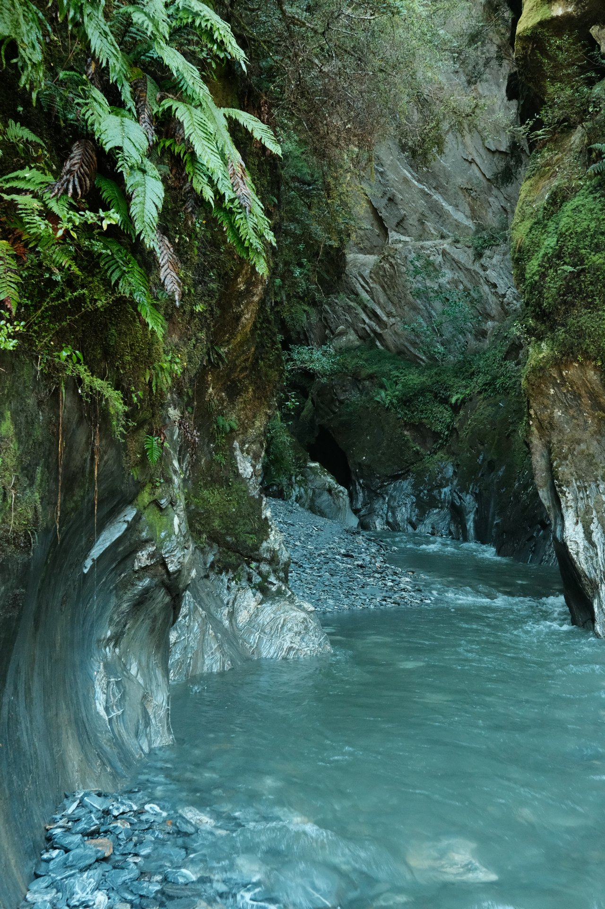

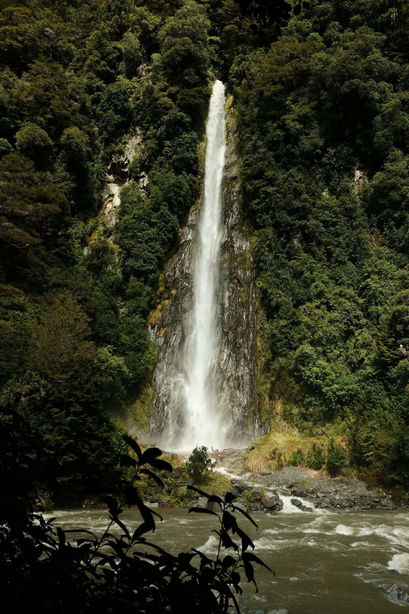

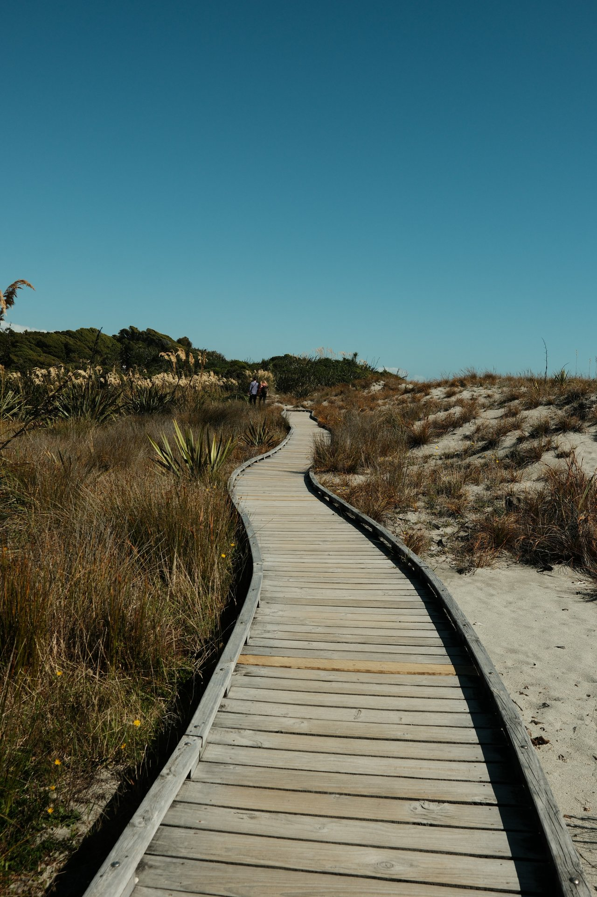

---

## Сценарии поездок

**Десять дней, только Южный остров кольцом.** Прилёт в Крайстчёрч, Кайкоура, долина Мак-Кензи и Аораки, Ванака, Квинстаун, Те-Анау с выездом в Милфорд, обратно в Крайстчёрч.
*Минус:* Западный берег и ледники не поместятся, темп плотный, две ночи подряд в одном месте будут редкостью.

**Две недели, Южный остров без спешки.** То же кольцо плюс перевал Хааст и Западный берег, с двумя-тремя ночёвками в ключевых точках.
*Минус:* половина дней всё равно уйдёт на переезды — расстояния здесь короткие, но дороги извилистые и двухполосные.

**Две недели, два острова.** Окленд, Роторуа с гейзерами, Тонгариро, перелёт в Квинстаун, южное кольцо в укороченном виде.
*Минус:* Северный остров съедает пять дней, и Южный придётся резать по живому. Это маршрут для второй поездки, а не для первой.

**Три недели, вся страна.** Оба острова с паромом через пролив Кука, ледники Франца-Иосифа и Фокса, Фьордленд, Стюарт с киви и сияниями.
*Минус:* цена. При таком сроке перелёт перестаёт быть главной статьёй расходов, но машина и жильё складываются в сумму, сравнимую с ним.

**Неделя, один регион.** Прилёт в Квинстаун, база в Ванаке или Те-Анау, каждый день радиально: Ройс-Пик, Милфорд, долина Хукер, винодельни Центрального Отаго.
*Минус:* тридцать часов дороги ради семи дней. Честно говоря, это плохая арифметика, и опытные путешественники на форуме советуют закладывать не меньше десяти дней — иначе и визовый офицер задаст вопрос, зачем лететь так далеко на такой срок.

| Сколько дней | Что складывается |
|---|---|
| 7 | Один регион Южного острова радиально, без переездов |
| 10 | Южное кольцо: Кайкоура, Аораки, Ванака, Фьордленд |
| 14 | То же плюс перевал Хааст, Западный берег и ледники |
| 21 | Оба острова с паромом, Стюарт, время на погоду |

---

## Машина, кемпер и ночлег: с 7 июня 2026 правила другие

Без машины Новая Зеландия почти не работает: общественный транспорт между городами есть, но до тропы, смотровой и ледника он не довозит. Движение левостороннее, дороги узкие и извилистые, средняя скорость на трассе ниже, чем кажется по карте.

Аренда кемпера по объявленным тарифам прокатчиков: **80–150 NZD в сутки в низкий сезон, 120–220 в межсезонье и 180–350 и выше в пик с декабря по февраль**. Бензин 95-й около 2,77 NZD за литр. Дизельные машины и электромобили дополнительно платят дорожный сбор — 76 NZD за тысячу километров у лёгких машин, и прокатчики выставляют его отдельным счётом по пробегу.

<a href="https://economybookings.tpk.mx/xlSFNA6p?erid=2VtzqxYvA5V&sub_id=new_zealand_guide_2026" class="aff-cta" rel="sponsored">Сравнить прокат авто в Новой Зеландии</a> локальные и международные прокатчики с ценой под даты, видно условия страховки и депозита

### Что изменилось этим летом

**С 7 июня 2026 года** для ночёвки вне оборудованных кемпингов нужен **зелёный талон автономности**. Синий, по которому ездили до этого, больше не действует. Главное требование нового стандарта: **машина с переносным туалетом сертификат не получает — туалет должен быть закреплён к полу**.

Это бьёт по дешёвому сегменту: бюджетные фургоны, которые продавались как «self-contained» с биотуалетом в углу, под новый стандарт не подходят. **При бронировании кемпера спрашивайте про зелёный талон прямым текстом**, а не про формулировку «self-contained» в описании.

Штрафы выписывают на месте, суммы из таблицы министерства:

| Нарушение | Штраф | Максимум по суду |
|---|---|---|
| Ночёвка не в автономной машине там, где это требуется | 400 NZD (≈19 800 ₽) | 1 200 NZD |
| Не показан талон автономности | 200 NZD (≈9 900 ₽) | 600 NZD |
| Мусор мимо урны или порча места | **800 NZD (≈39 600 ₽)** | 2 400 NZD |
| Людей больше, чем машина сертифицирована | 400 NZD | 1 200 NZD |
| Поддельный талон | 600 NZD | 1 800 NZD |

Последняя строка про количество людей — неочевидная: талон выдаётся на определённое число мест, и лишний пассажир в машине превращает законную ночёвку в нарушение.

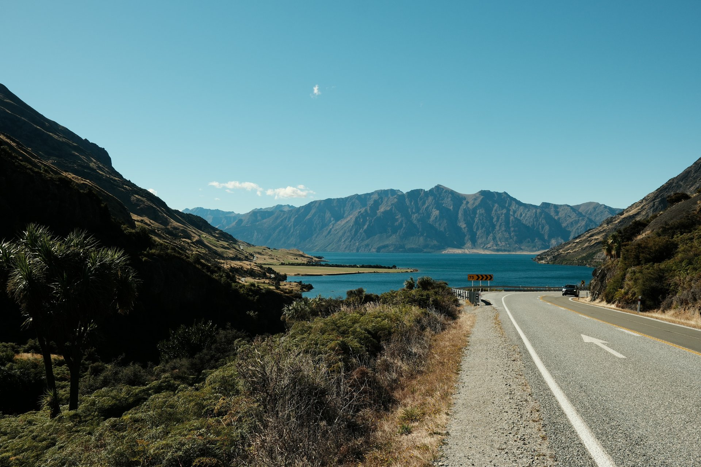

---

## Сколько стоит поездка

Курс на 22 августа 2026 года по данным Центрального банка: **1 новозеландский доллар = 49,48 ₽**, 1 доллар США = 82,92 ₽.

**Перелёт.** 108 000–128 000 ₽ туда-обратно на февраль–март по замеру выше. В декабре и январе, на пик их лета и наши каникулы, закладывайте больше.

**Виза.** 441 NZD на одного (≈21 800 ₽), 541 на двоих в одной заявке (≈26 800 ₽). Подробности ниже — там же объяснение, откуда берётся эта арифметика.

**Машина.** Агрегатор проката на 24 августа 2026 года показывает по Новой Зеландии 46 прокатчиков в 57 точках и витринный минимум **80,17 €** (≈7 800 ₽) — это, как всегда у витринных «от», не про пиковые даты. Кемпер по объявленным тарифам операторов дороже: 120–220 NZD в сутки в межсезонье. Топливо на кольцо по Южному острову — около 2 000 километров, при расходе 8 литров на сотню это 160 литров и примерно **440 NZD (≈21 800 ₽)** по цене 2,77 NZD за литр.

**Жильё.** По замеру на 24 августа 2026 года в Окленде предложения начинались от **2 508 ₽** за ночь в хостеле и от **4 875 ₽** в трёхзвёздочном отеле. За пределами крупных городов выбор беднее, а цены в сезон выше — закладывать стоит с запасом, ориентир по стране без собственного замера я давать не буду.

<a href={ostrovokCountry('new-zealand', 'new_zealand_guide_2026_stay')} class="aff-cta" rel="sponsored">Посмотреть жильё в Новой Зеландии</a> оплата картой российского банка, подтверждение сразу — для визовой заявки это важнее скидки

**Активности.** Круиз по Милфорд-Саунд от 143 NZD (≈7 100 ₽) за два часа по тарифу оператора, морской каяк-тур там же — около 240 NZD (≈11 900 ₽) по моему чеку. Полёт над Кайкоурой 180–250 NZD (≈8 900–12 400 ₽) за полчаса. Ночь в хижине на Милфорде 152 NZD. Полёт над Кайкоурой и вертолёт на ледник — отдельные суммы, каждая сравнима с дневным бюджетом.

**Еда.** Ужин в кафе 30–45 NZD на человека, продукты в супермаркете примерно как в Москве при пересчёте. Кофе везде хороший и стоит около 6 NZD.

**Итог по чеку — оценка, а не замер.** Три недели на человека складываются примерно в **420 000 ₽**: перелёт 118 000, виза 21 800, половина машины и топлива около 42 000, жильё около 104 000, еда около 62 000, активности и мелочи остальное. Твёрдые здесь только первые две строки — они измерены; остальное считано по дневным ценникам и меняется от сезона и аппетита.

<a href={cherehapaTravel('new_zealand_guide_2026')} class="aff-cta" rel="sponsored">Подобрать полис для Новой Зеландии</a> сравнивает страховщиков по цене и покрытию, оплата картой РФ, полис приходит в PDF — его же прикладывают к визовой заявке

---

## Виза: что действительно нужно знать

**Россия не входит в список безвизовых стран.** В перечне иммиграционной службы 61 страна и территория, России там нет. Значит, электронное разрешение **NZeTA не подходит** — нужна полноценная Visitor Visa. Это первая и самая частая ошибка: люди пытаются оформить NZeTA, потому что так пишут агрегаторы.

### Откуда берутся 441 и 541

Русские сайты пишут «441 NZD плюс природный сбор 100» — и завышают цену на пять тысяч рублей. Прейскурант ведомства издания мая 2026 года раскладывает сумму так:

| Составляющая | Сколько | За что берут |
|---|---|---|
| Визовый сбор, полоса C | 300 NZD | за заявление |
| Иммиграционная пошлина | 41 NZD | за заявление |
| Природный и туристический сбор | 100 NZD | **за человека** |
| **Один человек** | **441 NZD** | ≈21 800 ₽ |
| **Двое в одной заявке** | **541 NZD** | ≈26 800 ₽ |

Пример с парой приведён в самом прейскуранте. Разница с наивным подсчётом «441 × 2» — **341 NZD, около 16 900 ₽**. Подавайтесь одной заявкой на семью.

Природный сбор не возвращают даже при отказе — это написано на странице ведомства отдельной строкой.

### Порядок подачи

Всё делается онлайн, визовый центр в обычном случае не нужен. Нужен аккаунт **RealMe** — государственная система входа Новой Зеландии, регистрируется бесплатно. Оплата принимается картами Mastercard, Visa или UnionPay; карта российского банка международный платёж не проведёт, и это отдельная задача, которую решают заранее.

**Биометрию для подачи не берут.** Онлайн грузится одно фото. Отпечатки, снимок лица и радужки берут на границе — отказ от этой процедуры служба называет основанием не пустить в страну.

Срок по официальной статистике — **80% решений за две недели**. Что происходит на практике — в следующем разделе.

### Деньги и документы

Ориентир по средствам: **1 000 NZD в месяц на человека**, или 400 NZD, если жильё оплачено заранее. Visitor Visa даёт находиться до 6 месяцев по многократной или до 9 месяцев за полтора года по однократной. Работать на новозеландского работодателя нельзя, **удалённо на зарубежного — можно**, это прямо разрешено.

**Про переводы правила смягчили с 26 мая 2025 года**: приложения к Visitor Visa больше не требуют заверенного перевода. Но три условия остались:

- Переводить **не может** сам заявитель, член его семьи или помогавший советник.
- В переводе указываются имя переводчика, адрес, телефон, квалификация и опыт.
- Справки о здоровье и о несудимости по-прежнему **требуют заверенного перевода** — на них смягчение не распространяется.

---

## Что пишут те, кто подавался

Разобрал 97 сообщений за период с 3 сентября 2025 по 22 августа 2026 года из ветки о самостоятельной подаче на форуме путешественников — это последние две страницы из пятидесяти восьми, а не вся ветка, поэтому представительной выборку считать нельзя. Но четыре вещи в ней повторяются у разных людей, и ни одной из них нет в официальной инструкции.

**Официальные две недели — это середина, а не потолок.** Самый подробный разобранный случай: подача 30 октября 2025 года, дозапрос документов 16 декабря, виза-мультивиза на год 18 декабря. Сорок девять дней от подачи до решения, у человека с открытыми визами США, Канады, Шенгена и Австралии за плечами. Другой заявитель в январе 2026-го писал, что статус «на рассмотрении» висит почти два месяца при полностью предоплаченной поездке на конец февраля.

**Дозапрашивают военный билет с переводом.** В официальном списке документов его нет. В разобранной выборке это самый частый дозапрос у мужчин, и именно он растянул случай выше на полтора месяца.

**Выданная виза может не совпасть с описанным маршрутом.** В конце января 2026-го участнику выдали однократную визу на два месяца, хотя маршрут был круизным — с выездом из страны и возвратом, и план круиза прилагался к заявке вместе с сопроводительным письмом. Вывод, который стоит унести: **проверяйте тип визы сразу после выдачи**, не перед вылетом.

**Технические мелочи, на которых спотыкаются.** Документ и его перевод грузят разными файлами в разные поля — склеенный в один PDF даёт ошибку. Справки из банка и с работы стоит сразу просить на английском, тогда переводить почти нечего. Виза считается от даты выдачи примерно на год, поэтому подача за 10–12 месяцев до поездки съедает срок её действия.

Одно расхождение стоит назвать прямо. Правило службы запрещает переводить документы самому себе, но в выборке есть человек, который в феврале 2026-го перевёл всё сам и приписал в конце свой балл языкового экзамена — и это сработало. Официальное правило от этого не меняется, и опираться на такой опыт я бы не стал.

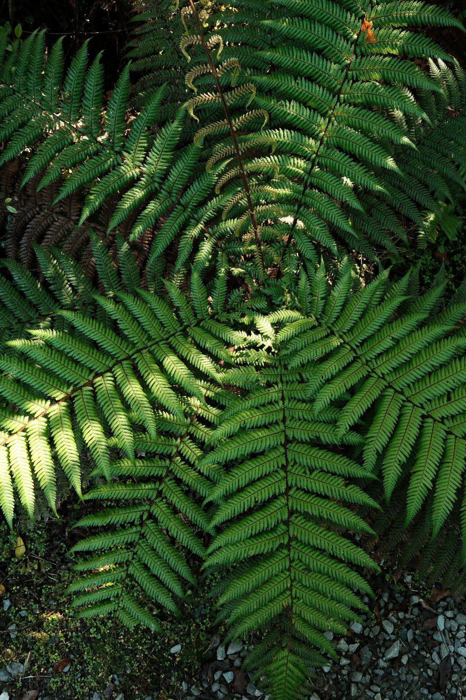

---

## Частые вопросы

**Нужна ли россиянам виза в Новую Зеландию в 2026 году?**
Да, полноценная Visitor Visa. Россия не входит в список из 61 безвизовой страны и территории, поэтому электронное разрешение NZeTA не подходит.

**Сколько стоит виза?**
441 NZD на одного человека — около 21 800 ₽ по курсу Центрального банка на 22 августа 2026 года. Двое в одной заявке платят 541 NZD, потому что визовый сбор берут за заявление, а природный сбор — за человека.

**Есть прямые рейсы из Москвы?**
Нет. Поиск с фильтром «только прямые» отдаёт пустую выдачу. Дешёвая дорога идёт через Китай и занимает 29–44 часа в одну сторону, быстрая через Дубай — около 25 часов, но втрое дороже.

**Когда лучше ехать?**
Март и апрель — сезон хижин ещё открыт, а пиковых цен и толп нет. Декабрь–февраль дают лучшую погоду, но это местные каникулы: цены выше, места в хижинах разобраны.

**Можно ли пройти Милфорд-Трек, если решил ехать в августе?**
На декабрь и январь — почти наверняка нет: продажи на сезон 2026/27 открыли 13 мая 2026 года. Остаются отмены, менее раскрученные Кеплер и Рутберн, однодневные маршруты и круиз по фьорду.

**Хватит ли недели?**
Формально да, фактически тридцать часов дороги ради семи дней — плохая арифметика. Опытные путешественники советуют закладывать от десяти дней, и визовый офицер задаёт тот же вопрос.

**Нужна ли машина?**
Практически обязательна. До троп, смотровых и ледников общественный транспорт не довозит. Движение левостороннее.

**Можно ли ночевать в машине где угодно?**
Нет. С 7 июня 2026 года нужен зелёный талон автономности, машина с переносным туалетом его не получает. Штраф за ночёвку без него — 400 NZD, за мусор мимо урны — 800.

**Работает ли карта российского банка?**
Нет, ни для оплаты визового сбора, ни на месте. Оплату визы принимают картами Mastercard, Visa и UnionPay, выпущенными за пределами России; вопрос платёжного средства решается до подачи.

<a href={airaloSub('new_zealand_guide_2026')} class="aff-cta" rel="sponsored">eSIM для Новой Зеландии</a> подключается до вылета, интернет работает с момента посадки — на горных дорогах навигатор нужен постоянно

---

## Коротко о главном

Новая Зеландия — дорогая и далёкая страна, в которой почти нет способа сэкономить на дороге: тридцать часов в одну сторону и от ста тысяч рублей за перелёт — это входной билет, и он не снижается.

Взамен на площади размером с Британию лежат ледники, фьорды, вулканы и пустые дороги, а расстояния между ними такие, что за две недели видно всё главное.

Три вещи, которые стоит сделать раньше остального:

1. **Проверить остатки мест в хижинах** — если в планах есть пеший маршрут. Это единственный элемент поездки, который нельзя докупить позже.
2. **Решить вопрос с картой** — визовый сбор российской картой не оплатить, и это блокирует подачу.
3. **Подаваться одной заявкой на семью** и не раньше чем за полгода — иначе часть срока визы сгорит до вылета.

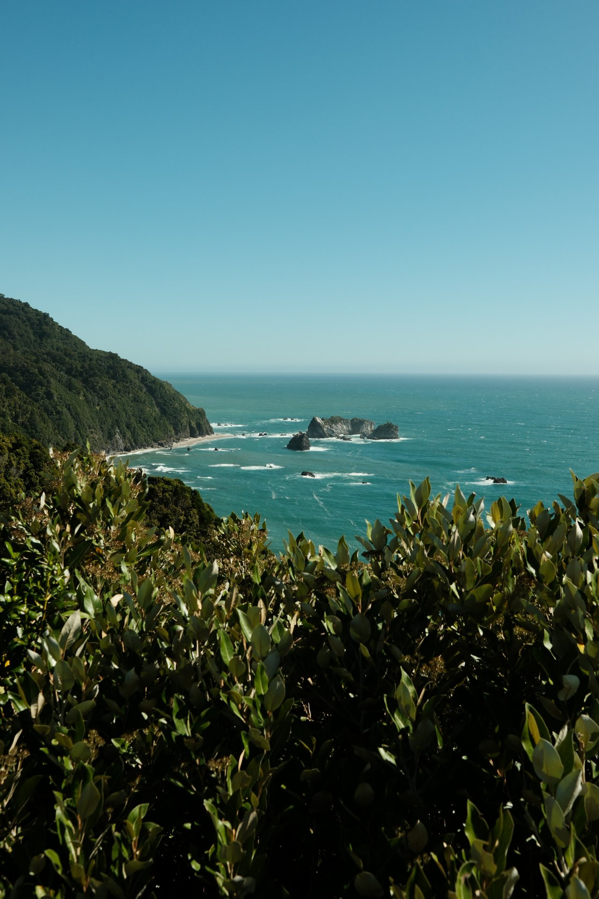

<a href={youtravelSub('new_zealand_guide_2026_bottom')} class="aff-cta" rel="sponsored">Авторские туры в Новую Зеландию с гидом</a> маршрут, даты и состав группы видны до оплаты — вариант для тех, кто не хочет собирать логистику и садиться за руль в левом ряду
