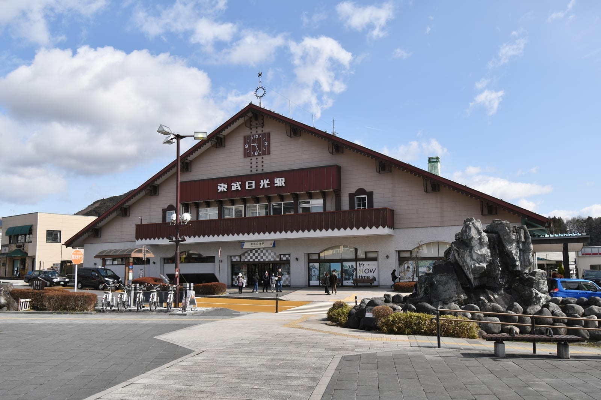
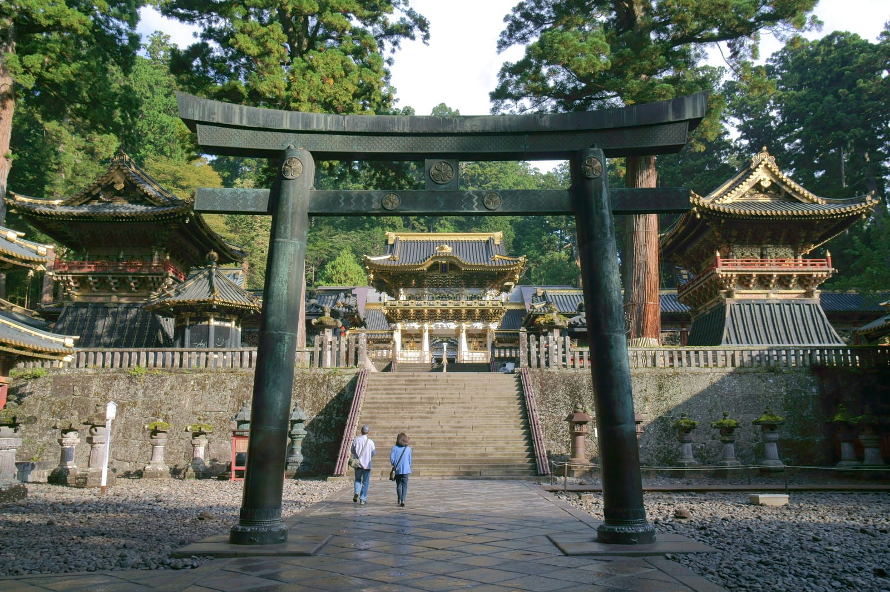
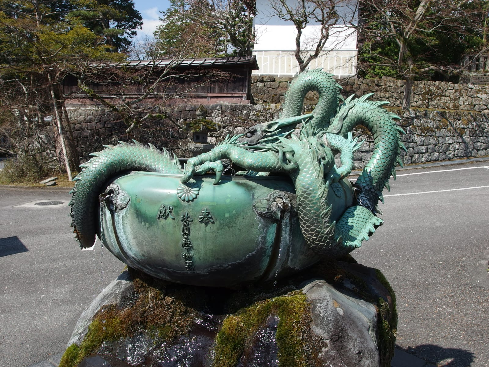
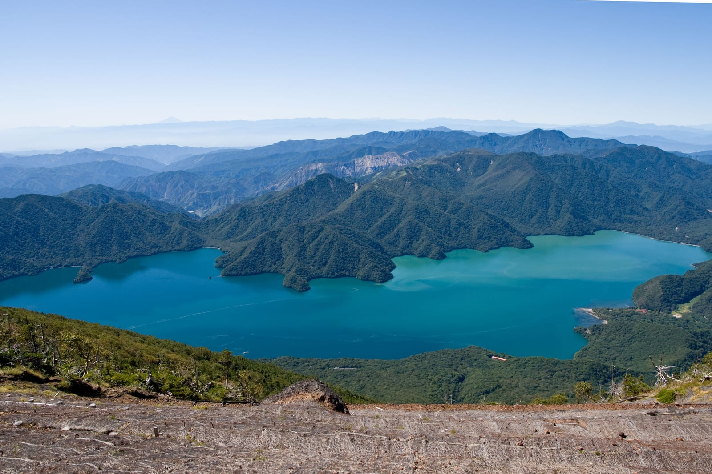
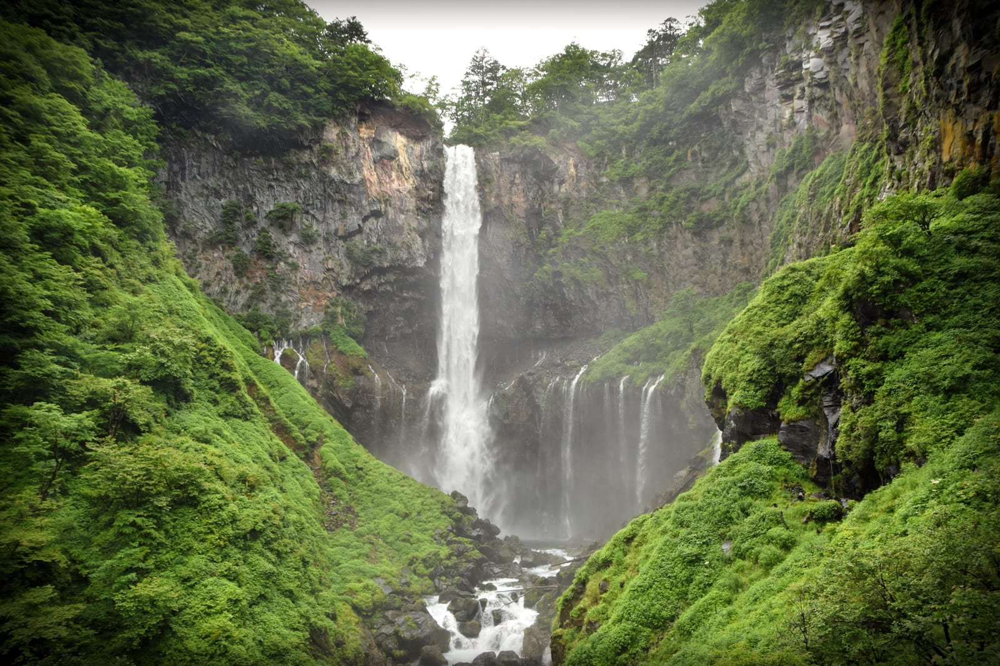

import { ostrovokCity } from '../../data/affiliate.js';

export const nikkoStay = ostrovokCity('japan', 'nikko', 'nikko_overnight');

**За один день из Токио разумно посмотреть храмовый район Никко: Тосёгу, мост Синкё и один соседний комплекс.** Дорога поездом занимает около двух часов в одну сторону. Озеро Тюдзэндзи и водопад Кэгон требуют отдельного автобусного участка; в осенние пробки лучше выделить им второй день и ночёвку.

Главная развилка возникает ещё до покупки билета: едете смотреть резные ворота и святилища среди леса или поднимаетесь к горному озеру. На карте эти места принадлежат одному Никко. В расписании одного дня между ними лежат пересадка, серпантин, очереди и необходимость успеть на обратный поезд.

*На обложке — Синкё в июле 2010 года. Фото: Jakub Hałun / [Wikimedia Commons](https://commons.wikimedia.org/w/index.php?curid=11426058), [CC BY-SA 4.0](https://creativecommons.org/licenses/by-sa/4.0/). Кадр обрезан.*

## Как добраться из Токио в Никко

**Для обычной поездки на день удобная отправная точка — станция Asakusa железной дороги Tobu.** Проверяйте именно вокзал перевозчика: название района на карте ещё не означает нужный вход на платформу. Конечная станция для храмового маршрута — Tobu-Nikko. Рядом находится отдельная станция JR Nikko; это разные железнодорожные системы.

На limited express из Асакусы или Синдзюку закладывайте около двух часов. Обычные поезда из Асакусы добавляют примерно час. Перед покупкой смотрите конкретный рейс: место отправления, пересадки и время прибытия, а не только строку «Tokyo — Nikko» в поиске.

Другой путь — синкансэн до Utsunomiya и пересадка на JR Nikko Line. Его имеет смысл сравнить, если у вас есть подходящий железнодорожный проездной. Не переносите покрытие JR на все поезда Tobu и местные автобусы: у каждого билета своя схема действия. Подготовка остального маршрута собрана в [гайде по Японии](/blog/japan-guide-2026/).

*Архивное фото: Saigen Jiro / [Wikimedia Commons](https://commons.wikimedia.org/w/index.php?curid=117298420), [CC0](https://creativecommons.org/publicdomain/zero/1.0/deed.en/).*

## Какой Nikko Pass нужен на один день

**Для храмового района сравните World Heritage Area с обычными билетами; All Area нужен прежде всего для более широкого маршрута.** Название дорогого проездного не делает его выгодным автоматически. Сначала выпишите поездки, которые действительно собираетесь совершить.

| Проездной | Взрослый / ребёнок | Срок | Для какого плана |
|---|---|---|---|
| World Heritage Area | ¥3 000 (≈1 608 ₽) / ¥1 500 (≈804 ₽) | 2 дня | Поездка из Асакусы и автобусы в храмовой зоне |
| All Area | ¥8 000 (≈4 288 ₽) / ¥4 000 (≈2 144 ₽) | 4 дня | Более широкая автобусная сеть Никко, включая поездку к озеру |

Оба варианта включают одну поездку туда и обратно между Асакусой и Симо-Имаити и свободные поездки в обозначенной зоне. Nikko Pass предназначены для иностранных путешественников. **Место в limited express оплачивается отдельно. Входные билеты храмов тоже не входят.** У детского тарифа проверьте возрастные условия перед оформлением.

Для расчёта дня сложите четыре строки: проездной либо обычный проезд, доплату за выбранные экспрессы, входы в выбранные комплексы и еду. Если едете на день, не считайте оставшиеся дни действия проездного экономией. А если пользуетесь маршрутом JR, заново проверьте, какую часть поездки Tobu Pass вообще заменит.

## Маршрут по храмам: что успеть без гонки

**Поставьте Тосёгу первым крупным посещением, затем оставьте время на обед и один соседний комплекс.** Ниже — план с запасом, а не расписание транспорта. Подставьте в него свои подтверждённые рейсы.

1. **Утро: поезд в Никко.** Выберите прибытие, после которого остаётся время на выбранные комплексы до их закрытия. Поздний выезд из Токио сокращает именно прогулку, а не дорогу.
2. **Около получаса после прибытия: остановка и автобус.** Найдите нужное направление у станции. Не принимайте первый автобус с надписью Nikko за маршрут к своему входу.
3. **Примерно два часа: Тосёгу.** Заложите время на билет, осмотр и подъёмы по ступеням. Музей и дополнительные пространства добавляйте по интересу, а не по принципу «включено в список».
4. **Около часа: обед и пауза.** Этот промежуток также поглощает небольшое опоздание поезда или очередь на входе.
5. **Ещё час-полтора: Риннодзи или прогулка по соседним территориям.** Не покупайте все виды билетов заранее, если пока не знаете свой темп.
6. **Перед отъездом: Синкё и возвращение к станции.** Оставьте запас на автобус и поиск платформы. Последний удобный поезд — плохая точка, к которой стоит приходить впритык.

*Архивное фото: Koichi Sato / [Wikimedia Commons](https://commons.wikimedia.org/w/index.php?curid=63338474), [CC BY-SA 4.0](https://creativecommons.org/licenses/by-sa/4.0/).*

### Тосёгу: главный запас времени

**Тосёгу лучше осматривать днём, пока вы не считаете минуты до поезда.** Комплекс связан с Токугавой Иэясу; здесь важны не только общий вид, но и резные детали, которые легко пробежать мимо. Выберите несколько вещей, на которых хотите остановиться, вместо попытки снять каждый фасад.

Тосёгу работает с 9:00 до 17:00 с апреля по октябрь и до 16:00 с ноября по март, с последним входом за полчаса до закрытия. На конкретный день проверьте объявления самого комплекса. Время работы — крайняя граница входа, а не рекомендация приезжать к ней.

### Риннодзи и Синкё: выбрать свой темп

**Риннодзи подходит для второй части дня, если хочется продолжить знакомство с храмовым районом.** В комплекс входят главный зал, сокровищница и сад Сёёэн. Для них продаются разные билеты: название комплекса не равно единому входу во всё перечисленное.

Если после Тосёгу хочется паузы, сократите платные посещения. Мост Синкё можно включить как отдельную остановку для вида на реку; осмотр с соседней дороги и платный выход на сам мост — разные решения. Не ставьте на оставшееся время одновременно ещё храм, дальнюю прогулку и автобус к озеру.

*Деталь комплекса Риннодзи, архивный кадр. Guilhem Vellut / [Wikimedia Commons](https://commons.wikimedia.org/w/index.php?curid=150565012), [CC BY 2.0](https://creativecommons.org/licenses/by/2.0/).*

## Почему Тюдзэндзи и Кэгон лучше оставить на второй день

**Проблема озера — время подъезда и возвращения, особенно осенью.** В пик сезона, примерно с середины октября до середины ноября, путь от станции Никко до озера может растянуться с обычных 45 минут до более чем четырёх часов. Это предупреждение о возможной пробке, не ежедневный прогноз.

Такой риск плохо сочетается с фиксированным поездом в Токио. Если озеро — главная цель, организуйте день вокруг него и оставьте храмы на другое время. Ночёвка в районе Оку-Никко позволяет не возвращаться по серпантину вечером только ради гостиницы в Токио.

*Панорама озера Тюдзэндзи с горы Нантай, архивный кадр. Фото: Σ64 / [Wikimedia Commons](https://commons.wikimedia.org/w/index.php?curid=29789524), [CC BY 3.0](https://creativecommons.org/licenses/by/3.0/).*

**Канатную дорогу Акэтидайра в маршрут не включайте.** Она закрыта с 16 января 2026 года по 31 августа 2027 года; срок может быть продлён из-за объёма работ. Старые путеводители со смотровой площадкой наверху не подтверждают её доступность.

Кэгон и прогулка у озера — самостоятельный план на день, а не обязательный довесок к Тосёгу. Проверяйте автобус обратно до начала прогулки. Видимость водопада, погода и работа платных площадок тоже важнее красивого времени в примерном маршруте.

*Архивное фото: Raita Futo / [Wikimedia Commons](https://commons.wikimedia.org/w/index.php?curid=130151787), [CC BY 2.0](https://creativecommons.org/licenses/by/2.0/).*

## Когда нужна ночёвка и где её искать

**Оставайтесь на ночь, если хотите и храмы, и озеро, либо не готовы к длинному дню на ногах.** Сначала выберите район: жильё у железнодорожных станций удобно для раннего поезда, рядом с храмами — для прогулки, у Тюдзэндзи — для отдельного дня в горах. Одинаковое слово «Никко» в адресе не означает одинаковую дорогу до вашего плана.

Перед бронированием уточните последний автобус, время заселения и ужина, если он входит в тариф. Отдельно посмотрите, можно ли оставить багаж. Для рёкана ранний ужин бывает важнее близости номера к главной фотографии из путеводителя.

Если ночёвка решает вашу задачу, откройте <a href={nikkoStay} target="_blank" rel="sponsored noopener noreferrer">поиск жилья в Никко</a> на нужные даты. Сравнивайте расположение на карте и условия отмены; наличие конкретного номера и способ оплаты нужно проверить при бронировании.

## Что проверить вечером перед поездкой

**Пять проверок полезнее ещё пяти точек на карте:** выбранные поезда туда и обратно, покрытие проездного, часы нужных входов, прогноз погоды и сообщения о транспорте. Сохраните названия станций латиницей и адрес ночёвки, если остаётесь.

Для дождя оставьте меньше открытых прогулок и больше времени на переходы. Для ребёнка или человека, которому тяжело долго ходить по ступеням, сократите маршрут до одного главного комплекса. Подробности въезда вынесены в [разбор японской визы](/blog/japan-visa-2026/), а особенности загруженных праздничных дат — в [материал о Золотой неделе](/blog/japan-golden-week-2026/).

## Что пишут те, кто был

Взяты два отчёта и одно обсуждение на форуме Винского за 2019–2026 годы. Выборка мала и непредставительна: она показывает отдельные сценарии, а не среднее время в пути или размер очередей.

В отчёте о поездке весной 2026 года обычный маршрут с пересадками оказался сложнее ожидаемого: путешественники заблудились и потратили около четырёх часов в одну сторону, а обратно выбрали limited express. Семейный рассказ показывает другую причину не торопиться: Тосёгу можно осматривать долго, внутри много лестниц, а с ребёнком на переходы и обед нужен дополнительный запас. В обсуждении маршрута ночёвку накануне считают полезной, когда есть свободный день, но не обязательной частью короткой поездки.

Практический вывод из этих разных сценариев: для однодневного маршрута заранее сохраните конкретную цепочку поездов и ограничьтесь храмовым районом. Ночёвка решает другую задачу — добавляет время на озеро, семейный темп или спокойное утро, но сама по себе не делает длинный список точек выполнимым.

## Частые вопросы

### Можно ли съездить в Никко за один день из Токио?

Да, если выбрать храмовый район и ранний поезд. На дорогу заложите около двух часов в каждую сторону, затем время на местный транспорт и прогулку. Добавление озера делает день заметно менее устойчивым к задержкам.

### Нужно ли покупать All Area Pass ради Тосёгу?

Сам по себе Тосёгу не требует дорогого проездного. Сравните World Heritage Area и обычные билеты для своего пути. Вход в святилище оплачивается отдельно от обоих Nikko Pass, как и доплата за limited express.

### Nikko Pass включает билет на экспресс?

Он включает базовый проезд в предусмотренных пределах, но не доплату за limited express. Выберите рейс и оформите нужный билет дополнительно. Проверьте, не купили ли вы только место без базового проезда или наоборот.

### Можно ли приехать с Japan Rail Pass?

До Никко можно доехать через Utsunomiya на поездах JR. Покрытие зависит от конкретного вашего проездного. Не считайте автоматически включёнными все поезда Tobu, местные автобусы и платные входы в храмы.

### Успею ли за день Тосёгу, Тюдзэндзи и Кэгон?

При удачных пересадках короткий осмотр возможен, но такой план почти не оставляет запаса. Осенью пробки на дороге к озеру могут разрушить расписание. Для спокойного осмотра разумнее два дня или выбор одной зоны.

### Работает ли канатная дорога Акэтидайра?

Оператор объявил закрытие с 16 января 2026 года до 31 августа 2027 года и допускает продление работ. Перед будущей поездкой проверяйте именно сообщение о возобновлении, а не старую карту достопримечательностей.

### Что выбрать с ребёнком?

Один главный комплекс, нормальный обед и короткую прогулку вместо полного списка храмов и водопадов. Учитывайте ступени, погоду и дорогу обратно. Возраст сам по себе не показывает, сколько часов ребёнок выдержит в вашем темпе.

### Когда стоит остаться на ночь?

Когда хотите совместить храмовый район с Оку-Никко, фотографировать без спешки или путешествуете в осенний пик. Выбирайте район ночёвки по следующему утру, затем проверяйте автобус, заселение и время ужина.
