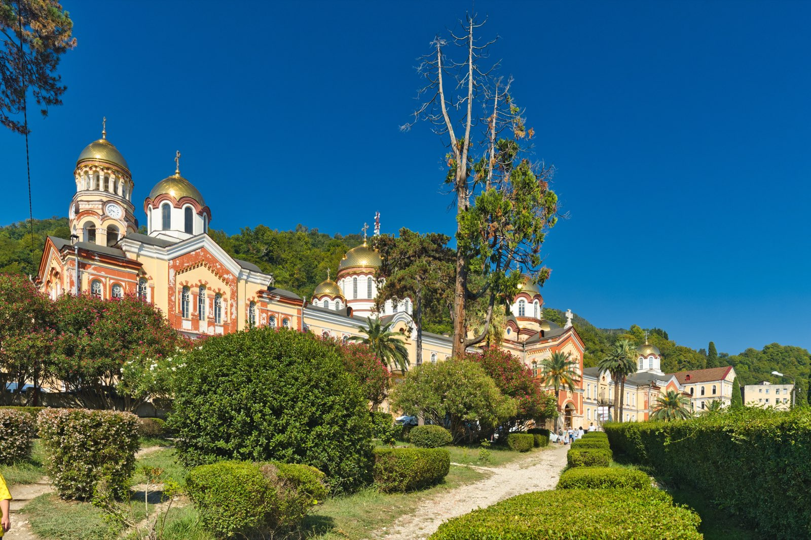

import AffiliateNote from '../../components/post/AffiliateNote.astro';
import { TP_LINKS } from '../../data/affiliate.js';

Новоафонская пещера — это вход в гору на маленьком подземном поезде и полтора часа среди залов размером с собор: сталактиты, подсветка, зал с органом, где дают концерты. Одна из крупнейших оборудованных пещер мира и главная «нерпляжная» достопримечательность Абхазии. Собрал всё, что нужно для поездки в 2026 году: сколько стоит билет, когда открыто, как добраться и как не простоять полдня в очереди.

> **Если коротко:** Новоафонская пещера — в центре Нового Афона. **Билет с 2026 года — 1000 ₽** (дети до 8 лет бесплатно), оплата **только наличными**, фотосъёмка +50 ₽. Внутрь везёт **подземный электропоезд**, экскурсия по залам — около **1,5 часа**, температура круглый год **+11…+14 °C** (берите кофту). Летом (1 июля — 30 сентября) открыто **ежедневно 09:00–19:00**, в межсезонье — с выходными и санитарным днём в пятницу. **Онлайн-брони нет**, билеты в кассе по живой очереди — летом приходите к 9 утра. От Гагры — ~60 км, рядом — Новоафонский монастырь.

<AffiliateNote />

---

## Что такое Новоафонская пещера?

**Это огромная карстовая пещера в недрах Иверской горы — одна из крупнейших оборудованных для туристов пещер в мире.** Её открыли и обустроили во второй половине XX века: проложили тоннель, пустили подземный электропоезд и оборудовали маршрут с подсветкой и дорожками. Общая длина исследованных ходов превышает 3 км, перепад высот доходит до 183 метров, а возраст образований оценивают примерно в 2 миллиона лет.

Всего в пещере девять залов; **для посещения открыто шесть**. Самый большой — зал **Махаджиров** (около 260 метров в длину, потолки до 50 метров). Отдельная гордость — зал **Спелеологов**: в нём установлен орган, и здесь проходят настоящие концерты под сводами пещеры.

В отличие от диких пещер, сюда не нужны ни снаряжение, ни подготовка: вы едете на поезде, идёте по оборудованным мостикам и слушаете гида. Это спокойная прогулка, доступная даже с детьми и пожилыми — с поправкой на то, что внутри прохладно и есть лестницы.

Пещера — часть связки достопримечательностей Нового Афона; если выбираете базу для отдыха, в гайде [стоит ли ехать в Абхазию 2026](/blog/abkhazia-2026/) разобрал, чем Новый Афон отличается от Гагры и Пицунды.

---

## Немного истории

**Пещеру для туристов открыли сравнительно недавно.** Местные знали о бездонном провале на склоне Иверской горы издавна — его так и звали «Бездонной ямой», — но спуститься и описать систему залов спелеологи смогли только в середине XX века. Чтобы сделать подземелье доступным обычным людям, в горе пробили почти полуторакилометровый тоннель и пустили по нему электропоезд. Так появилось «пещерное метро» — решение, аналогов которому в мире единицы. С момента открытия маршрута пещеру прошли миллионы туристов, и сегодня это одна из самых посещаемых природных достопримечательностей всего Кавказа.

Масштаб впечатляет даже на цифрах: общая длина исследованных ходов — больше 3 км, перепад высот доходит до 183 метров, а площадь подземных залов измеряется десятками тысяч квадратных метров. Возраст натёчных образований — сталактитов и сталагмитов — оценивают примерно в 2 миллиона лет: за это время капля за каплей вода вырастила колонны в человеческий рост и выше.

---

## Сколько стоит билет в 2026 году?

**С 2026 года вход в пещеру стоит 1000 ₽** — цену подняли на 300 ₽ относительно прежней. Отдельных детских и студенческих тарифов нет: бесплатно проходят только дети до 8 лет и граждане Абхазии по документу.

| Что | Цена 2026 |
|---|---|
| Билет (стандартный) | **1000 ₽** |
| Дети до 8 лет | бесплатно |
| Фото- и видеосъёмка | +50 ₽ |
| Парковка у входа | ~200 ₽ |
| Прокат пледа на входе | ~100 ₽ |

Главное про оплату: **только наличные.** Картой или переводом билет не купить, поэтому берите рубли заранее. Банкоматы рядом есть, но в сезон в них бывает пусто ([график и цены, afon-cave.ru](https://afon-cave.ru/inner-section/info/grafik/); [подробный разбор, vandrovnik.ru](https://vandrovnik.ru/abh/afon-cave)).

Как в принципе устроены деньги в Абхазии (почему карты не работают и сколько везти наличных) — в гайде [как платить за границей россиянам](/blog/pay-abroad-2026/).

---

## Часы работы и расписание

**Режим работы пещеры зависит от сезона, и у неё есть выходные и санитарный день — это важно спланировать заранее.** В высокий сезон работает каждый день, в межсезонье — с перерывами.

| Период | Режим |
|---|---|
| 1 июля — 30 сентября | ежедневно, **09:00–19:00** |
| Июнь | ежедневно 10:00–19:00 (отдельные выходные в начале месяца) |
| Май, начало января | ежедневно 10:00–18:00 |
| Межсезонье (осень–весна) | ср, чт, сб, вс 10:00–18:00; **санитарный день — пятница** |

Группы отправляют по мере набора: летом — примерно по 100 человек, зимой — от 70. Из-за этого зимой в будни иногда ждут, пока наберётся группа. Точный график по датам меняется год от года — **перед поездкой сверьтесь на официальном сайте**, особенно если едете в межсезонье ([afon-cave.ru](https://afon-cave.ru/inner-section/info/grafik/)).

---

## Как устроена экскурсия

**Сначала — поезд, потом пешком.** От входного павильона туристов везёт подземный электропоезд («пещерное метро») — около 1,3 км по тоннелю за 3–5 минут до станции у зала Анакопия. Дальше — пеший маршрут по залам примерно на 2 км, с лестницами, мостиками и подсветкой. Вся экскурсия с гидом занимает **около 1,5 часа**.

> «Когда входишь внутрь, попадаешь не в саму пещеру, а на небольшую платформу, откуда в пещеру туристов везёт электропоезд» — *автор темы, [Форум Винского](https://forum.awd.ru/viewtopic.php?t=374094)*.

Два момента, к которым стоит подготовиться:

- **Прохладно.** Внутри круглый год около +11…+14 °C и влажно — после летней жары контраст резкий. На входе предлагают пледы за отдельную плату, но проще взять свою кофту.
- **Скользко и есть подъёмы.** Дорожки местами мокрые, маршрут с лестницами — нужна удобная нескользящая обувь.

> «В пещере прохладно, где-то +12…15, на входе предлагают пледы за отдельную плату. Но мне в обычной рубашке с короткими рукавами было не холодно» — *автор темы, [Форум Винского](https://forum.awd.ru/viewtopic.php?t=374094)*.

Это субъективные впечатления — кому-то в футболке нормально, кому-то холодно; ориентируйтесь на себя, но кофту лучше иметь.

---

## Залы и концерты под землёй

**Маршрут проходит через шесть оборудованных залов, и каждый — со своим характером.** Залы соединены тропами и мостиками, перепады высот внутри ощутимые, а подсветка специально выстроена так, чтобы подчёркивать рельеф сводов и натёки.

- **Зал Махаджиров** — самый большой на маршруте: около 260 метров в длину и до 50 метров в высоту. Это и есть тот самый «собор под землёй», ради кадров с которого сюда едут.
- **Зал Спелеологов** — один из самых глубоких (до ~97 метров) и с особенной акустикой. Здесь установлен орган, и в зале проходят настоящие концерты под каменными сводами.
- Остальные залы — с натёчными колоннами, сталактитами и сталагмитами, подземными озёрами и галереями; гид по дороге показывает самые выразительные образования.

Концерты в пещере — это не аттракцион «для галочки»: звук в зале Спелеологов держится естественно, без усиления аппаратурой, и услышать орган в недрах горы стоит, если попадёте на дату. Расписание выступлений нерегулярное — уточняйте заранее.

---

## Кому может быть тяжело

**Сама прогулка несложная, но комфортна она не для всех одинаково.** Что стоит учесть до покупки билета:

- **Лестницы и подъёмы.** Маршрут на 2 км — это постоянные спуски и подъёмы по ступеням; людям с больными коленями и родителям с коляской будет тяжело, детскую коляску внутрь не возьмёшь.
- **Холод и влажность.** Внутри круглый год +11…+14 °C — после летней жары контраст резкий, в шортах и майке за полтора часа замёрзнете.
- **Скользкий пол.** Дорожки мокрые — нужна обувь с цепким протектором, не пляжные шлёпки.
- **Туалета внутри нет** — сходите заранее (на входе он платный, ~10 ₽), внутри отлучиться будет некуда.

Зато по самому маршруту идти просто: это спокойная прогулка с гидом, а не спелеология со снаряжением, и с ней справляются и дети постарше, и пожилые — в удобной обуви и с кофтой.

---

## Как добраться до пещеры

**Вход в пещеру — в центре Нового Афона, ул. Чанба, 16**, слева от центрального входа, за скульптурой «Золотое руно». Сам Новый Афон — между Гагрой и Сухумом, добраться можно несколькими способами.

| Откуда | Расстояние | Как доехать |
|---|---|---|
| Сухум | ~26 км | маршрутка / такси |
| Гагра | ~60 км | ~1 ч на машине, ~1,5 ч на маршрутке |
| Пицунда | ~50 км | маршрутка с пересадкой / такси |

- **Маршруткой.** По трассе Гагра — Сухум ходят маршрутки с остановкой в Новом Афоне (200–250 ₽). От остановки до входа в пещеру — около 1 км в гору пешком или на местном такси (200–300 ₽).
- **Такси.** Из Гагры — от ~2500 ₽ в одну сторону; удобно компанией.
- **С гидом.** Самый простой вариант без своей машины — поехать по Абхазии с местным гидом в малой группе: Новый Афон обычно входит в маршрут вместе с другими точками. <a href={TP_LINKS.youtravel} class="aff-cta" rel="sponsored">Поехать по Абхазии с местным гидом</a> (маршрут и трансферы уже собраны, оплата картой РФ).

Как добираются до Абхазии в целом — самолётом в Сухум или через Адлер и границу Псоу — подробно в [главном гайде по Абхазии](/blog/abkhazia-2026/).

---

## Как не простоять в очереди

**Билеты продают только в кассе по живой очереди — онлайн-брони для самостоятельных туристов нет.** Организованные группы от турфирм проходят первыми, поэтому в разгар сезона индивидуалы ждут от 30 минут до пары часов.

Что помогает:

- **Приходите к открытию.** Летом касса начинает работу с ~08:30; очередь набегает быстро.

> «Касса открывается в 10 часов утра, но приходить туда советую к 9 часам — очередь формируется очень быстро, и есть риск, что билетов может не хватить» — *отзыв на [trekking.ru](https://trekking.ru/abkhazia/sights/other/novoafonskaya-peshhera.html)*.

- **Выбирайте «непиковые» дни.** Меньше всего организованных групп обычно в понедельник.
- **Берёте экскурсию — приедете с группой** и пройдёте без отдельной очереди в кассу.

И ещё одна честная цитата про то, ради чего всё это:

> «Весь путь 1,5 км — спуски и подъёмы, где мокро и холодно, но это того стоит хотя бы на один раз» — *vostrik23, [trekking.ru](https://trekking.ru/abkhazia/sights/other/novoafonskaya-peshhera.html)*.

---

## Что посмотреть рядом в Новом Афоне

**Пещеру логично совместить с остальным Новым Афоном — всё компактно и в пешей доступности.**

- **Новоафонский (Симоно-Кананитский) монастырь** — главная доминанта города, основан в XIX веке русскими монахами с Афона. Вход свободный (бесплатный), действующий мужской монастырь — нужна закрытая одежда.
- **Рукотворный водопад** — каскад на реке Псырцха, построенный монахами в XIX веке; рядом старая железнодорожная платформа Псырцха в стиле модерн — популярная фототочка.
- **Анакопийская крепость** — древняя крепость на Иверской горе с видами на побережье. С 2024 года к ней ведёт канатная дорога (заброска ~300 ₽), так что подниматься пешком уже не обязательно.
- **Грот Симона Кананита** — место паломничества в ущелье Псырцхи, в стороне от туристических троп.

На Новый Афон с пещерой, монастырём и прогулкой по ущелью спокойно уходит полдня-день.

---

## Сколько заложить времени на Новый Афон

**На саму пещеру с дорогой внутри уходит около 2 часов, на весь Новый Афон — полдня-день.** Самый удобный план — приехать к открытию, пока не набежала очередь, а остальное обойти после:

- **Утро:** пещера — билет, подземный поезд и 1,5 часа маршрута по залам.
- **День:** Новоафонский монастырь и рукотворный водопад с платформой Псырцха в стиле модерн.
- **После обеда:** при силах — Анакопийская крепость (виды на всё побережье, наверх ведёт канатная дорога) или тихий грот Симона Кананита.

Если едете из Гагры или Пицунды одним днём, закладывайте дорогу в обе стороны (~1,5 часа в одну сторону) и берите с собой воду, наличные и кофту для пещеры. Совмещать пещеру с озером Рица в один день не стоит — это разные направления и два полных выезда; [как добраться до Рицы](/blog/ozero-ritsa-2026/) разобрал отдельно.

---

## FAQ

**Сколько стоит билет в Новоафонскую пещеру в 2026 году?**
**1000 ₽** для взрослых, дети до 8 лет — бесплатно. Фотосъёмка оплачивается отдельно (+50 ₽). Оплата **только наличными**, картой билет не купить.

**Какой режим работы у пещеры?**
В высокий сезон (1 июля — 30 сентября) — **ежедневно 09:00–19:00**. В межсезонье работает по средам, четвергам, субботам и воскресеньям 10:00–18:00, выходные — понедельник и вторник, **санитарный день — пятница**. График по датам сверяйте на официальном сайте.

**Можно ли купить билет онлайн?**
**Нет.** Для самостоятельных туристов брони нет — билеты только в кассе по живой очереди. Заранее пройти можно лишь с организованной экскурсией.

**Холодно ли внутри пещеры?**
Да, круглый год **около +11…+14 °C** и влажно. После летней жары ощущается резко — берите кофту; на входе есть прокат пледа за ~100 ₽.

**Сколько длится экскурсия?**
**Около 1,5 часа.** Сначала подземный электропоезд (~3–5 минут), затем пеший маршрут по залам примерно на 2 км с лестницами и мостиками.

**Как добраться до пещеры из Гагры?**
**Около 60 км:** маршруткой по трассе Гагра — Сухум до Нового Афона (~1,5 часа, 200–250 ₽) плюс ~1 км в гору до входа, либо такси от ~2500 ₽, либо экскурсией с трансфером.

**Что посмотреть рядом с пещерой?**
**Новоафонский монастырь** (вход бесплатный), рукотворный водопад и платформа Псырцха, Анакопийская крепость с канатной дорогой. Всё компактно — закрывается за полдня-день.

**Можно ли в пещеру с детьми?**
**Да, детям постарше — без проблем.** Но маршрут с лестницами и подъёмами, внутри +11…+14 °C, поэтому совсем малышам и людям с больными коленями будет тяжело; детскую коляску внутрь не взять.

**Нужно ли бронировать билет заранее?**
**Самостоятельным туристам брони нет** — билет покупают в кассе по живой очереди. Гарантированно пройти без ожидания можно только с организованной экскурсией с трансфером.

---

## Что почитать дальше

- [Стоит ли ехать в Абхазию 2026](/blog/abkhazia-2026/) — главный гайд: безопасность, документы, цены, отзывы
- [Озеро Рица 2026](/blog/ozero-ritsa-2026/) — как добраться, цена входа и что рядом
- [Абхазия — кратко: сезоны, бюджет, регионы](/abkhazia/) — краткая справка по направлению
- [Что брать в Абхазию](/packing/abkhazia/) — сборы по месяцам
- [Как платить за границей россиянам 2026](/blog/pay-abroad-2026/) — карты, наличные, нюансы

---

*Материал носит справочный характер. Цены и расписание в Абхазии меняются — билет, часы работы и санитарные дни сверяйте на [официальном сайте пещеры](https://afon-cave.ru/) перед поездкой. Проверял 20.06.2026. Нашли неточность — напишите в [Telegram-канал @traveltriberu](https://t.me/traveltriberu), обновлю.*

*Фото: Alexxx1979 / [Wikimedia Commons](https://commons.wikimedia.org/wiki/File:Abkhazia._New_Athos_Cave_P9110237_2600.jpg) / [CC BY-SA 4.0](https://creativecommons.org/licenses/by-sa/4.0/).*
