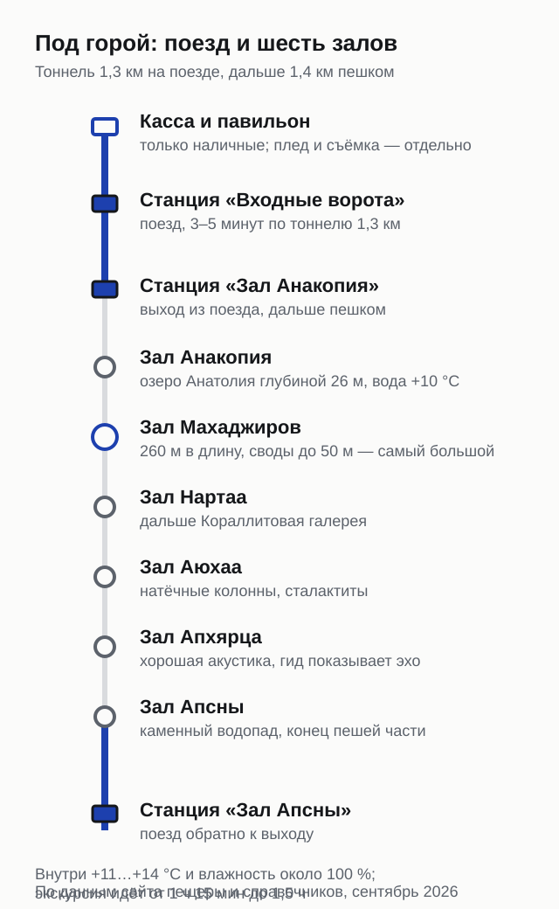
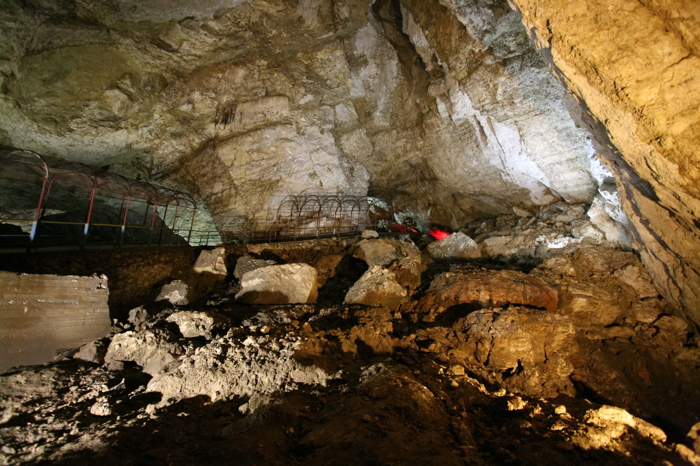
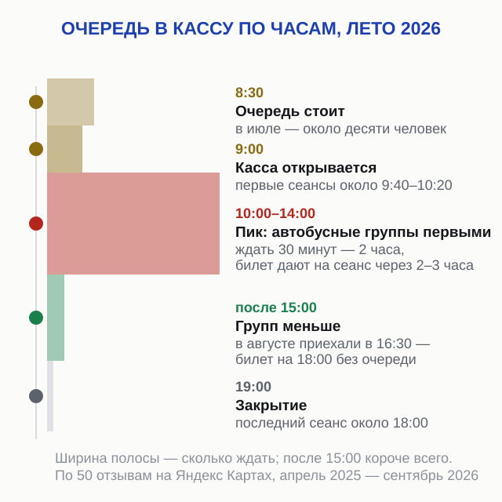
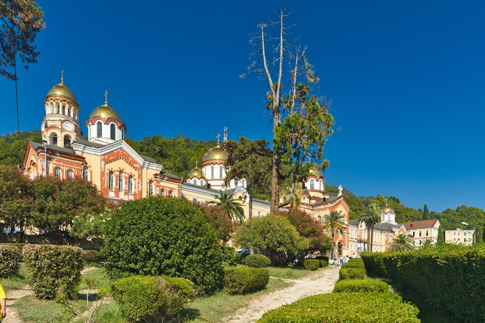
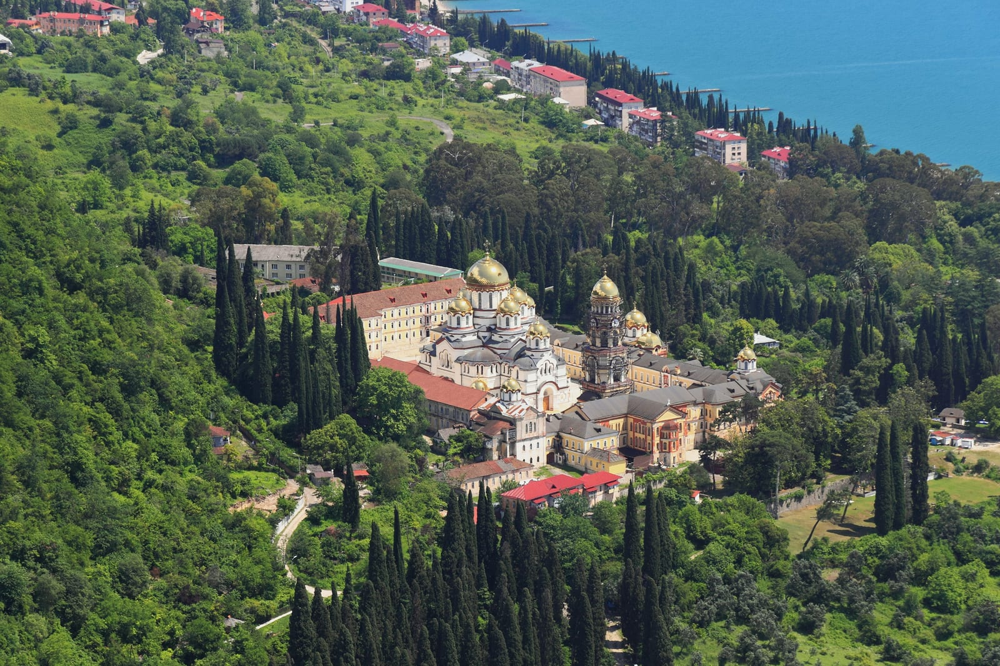

import AffiliateNote from '../../components/post/AffiliateNote.astro';
import { aviasalesRoute, cherehapaCountry, sutochnoRegion, youtravelCountry, kiwitaxiRoute, sputnik8City } from '../../data/affiliate.js';

Новоафонская пещера — это въезд в гору на маленьком подземном поезде и полтора часа среди залов размером с собор: сталактиты, подсветка, залы с такой акустикой, что в одном из них устроили концертный зал. Одна из крупнейших оборудованных пещер мира и главная «непляжная» достопримечательность Абхазии. Собрал всё, что нужно для поездки в 2026 году: сколько стоит билет, когда открыто, как добраться, как не простоять полдня в очереди — и что пишут те, кто был, в полусотне свежих отзывов.

> **Если коротко:** Новоафонская пещера стоит в центре Нового Афона. **Билет с 2026 года стоит 1000 ₽** (дети до 8 лет бесплатно), оплата **только наличными**, фотосъёмка +50 ₽. Внутрь везёт **подземный электропоезд** по тоннелю 1,3 км, пешком по залам — **1,4 км и 1 ч 15 мин — 1,5 часа**, температура круглый год **+11…+14 °C** при влажности под 100 % (берите кофту). Летом (1 июля — 30 сентября) открыто **ежедневно 09:00–19:00**, в межсезонье есть выходные и санитарный день в пятницу. **Брони для самостоятельных туристов нет**, билеты в кассе по живой очереди: летом приходите к открытию или после 15:00. От Гагры ехать ~60 км, рядом стоит Новоафонский монастырь. Полис берут заранее: ОМС в Абхазии не действует, а без него лечение и перевозку в Сочи оплачивают из своего кармана — <a href={cherehapaCountry('abkhazia', 'novoafonskaya_peschera_2026')} class="aff-cta" rel="sponsored">подобрать страховку в Абхазию</a>. Остановиться проще всего в самом Новом Афоне: <a href={sutochnoRegion('https://abkhazia.sutochno.ru/', 'novoafonskaya_peschera_2026_stay')} class="aff-cta" rel="sponsored">жильё рядом с пещерой, оплата картой РФ</a>.

<AffiliateNote />

---

## Что такое Новоафонская пещера?

**Это огромная карстовая пещера в недрах Иверской горы — одна из крупнейших оборудованных для туристов пещер в мире.** Глубина, по справочникам, 183 метра; объём залов, по данным самой пещеры, больше полутора миллионов кубометров. Чтобы люди попадали внутрь без верёвок, в горе пробили тоннель длиной 1,3 км и пустили по нему электропоезд, а по залам проложили дорожки, мостики и подсветку: пеший маршрут — 1,4 км.

Залов в пещере девять; **на обычном экскурсионном маршруте шесть**: «Анакопия», «Махаджиров», «Нартаа», «Аюхаа», «Апхярца» и «Апсны», между ними — Кораллитовая галерея. Самый большой — **Махаджиров**: около 260 метров в длину, до 75 в ширину и до 50 в высоту. Самый высокий свод — в зале **Спелеологов**, до 97 метров: его оборудовали под концертный зал на 150 мест, звук там держится без аппаратуры. Сама пещера пишет о нём двояко: на одной странице зал «закрыт для посетителей экскурсий», на другой — «включён в эксклюзивный маршрут»; на обычной экскурсии его не показывают, а концерты там дают.

В отличие от диких пещер, сюда не нужны ни снаряжение, ни подготовка: вы едете на поезде, идёте по оборудованным мостикам и слушаете гида. Это спокойная прогулка, доступная и с детьми, и пожилым — с поправкой на то, что внутри прохладно, сыро и есть лестницы.

Пещера — часть связки достопримечательностей Нового Афона; если выбираете базу для отдыха, в гайде [стоит ли ехать в Абхазию 2026](/blog/abkhazia-2026/) разобрал, чем Новый Афон отличается от Гагры и Пицунды.

---

## Как пещеру нашли и пустили в неё поезд

Местные знали о бездонном провале на склоне Иверской горы издавна и звали его «Бездонной ямой». В 1961 году вход нашёл Гиви Смыр, и 14 июля того же года спелеологи впервые спустились по каскаду колодцев на глубину 135 метров — в зал, который потом назвали «Анакопия». Чтобы сделать подземелье доступным обычным людям, в горе пробили тоннель и 4 июля 1975 года пустили по нему электропоезд: три станции, 1291 метр пути — «пещерное метро», аналогов которому в мире единицы. В 2014 году старые составы «Турист» заменили новым поездом на 102 места.

В 1981 году здесь снимали эпизод «Приключений Тома Сойера и Гекльберри Финна» — та самая пещера, где дети блуждают в темноте, и есть Новоафонская. С момента открытия маршрута пещеру прошли миллионы туристов, и сегодня это одна из самых посещаемых природных достопримечательностей всего Кавказа.

---

## Сколько стоит билет в 2026 году?

**С 2026 года вход в пещеру стоит 1000 ₽** — цену подняли на 300 ₽ относительно прежней: в отзывах апреля и августа 2025 года ещё 700 ₽. Отдельных детских и студенческих тарифов нет: бесплатно проходят только дети до 8 лет и граждане Абхазии по документу.

| Что | Цена 2026 |
|---|---|
| Билет (стандартный) | **1000 ₽** |
| Дети до 8 лет | бесплатно |
| Фото- и видеосъёмка | +50 ₽ за устройство |
| Прокат пледа на входе | ~100 ₽, со слов посетителей |
| Туалет на входе | 20–30 ₽, со слов посетителей |
| Парковка у входа | платная; со слов посетителей, есть бесплатная неподалёку |

Главное про оплату: **только наличные.** Картой или переводом билет не купить — об этом пишет каждый второй отзыв, а сама пещера продаёт билеты только в кассе комплекса (сообщение от 10 июля 2026). Берите рубли заранее: банкоматы рядом с кассой есть — в отзыве от 5 августа 2026 с российской карты снимали наличные, — но в сезон они бывают пустыми, строить на них план не стоит. Цены — по [официальному графику и ценам пещеры](https://afon-cave.ru/inner-section/info/grafik/), подробный разбор — на [vandrovnik.ru](https://vandrovnik.ru/abh/afon-cave).

Как в принципе устроены деньги в Абхазии (почему карты работают через раз и сколько везти наличных) — в гайде [как платить за границей россиянам](/blog/pay-abroad-2026/).

---

## Часы работы в 2026 году по месяцам

Режим работы пещеры зависит от сезона, и у неё есть выходные и санитарный день — это важно спланировать заранее. Летом работает каждый день, в межсезонье — четыре дня в неделю. График ниже — с официального сайта пещеры на 5 сентября 2026 года.

| Период 2026 года | Режим |
|---|---|
| 1–11 января | ежедневно 10:00–18:00 |
| 12 января — 30 апреля | ср, чт, сб, вс 10:00–18:00; пятница — санитарный день |
| 1–11 мая | ежедневно 10:00–18:00 |
| 12–31 мая | 10:00–18:00, выходные понедельник и пятница |
| июнь | ежедневно 10:00–19:00, кроме 1 и 8 июня |
| 1 июля — 30 сентября | ежедневно, **09:00–19:00** |
| 1–11 октября | ежедневно 10:00–18:00 |
| 12–31 октября | 10:00–18:00, отдельные понедельники — выходные |
| 1 ноября — 31 декабря | ср, чт, сб, вс 10:00–18:00; пятница — санитарный день |

Группы отправляют по мере набора: летом примерно по 100 человек, зимой от 70. Из-за этого зимой в будни иногда ждут, пока наберётся группа. Точный график по датам меняется год от года, поэтому **перед поездкой сверьтесь на официальном сайте**, особенно если едете в межсезонье ([afon-cave.ru](https://afon-cave.ru/inner-section/info/grafik/)).

---

## Как устроена экскурсия

Сначала — поезд, потом пешком. От станции «Входные ворота» подземный электропоезд везёт 1,3 км по тоннелю, 3–5 минут, до станции «Зал Анакопия». Дальше — пеший маршрут 1,4 км через шесть залов, с лестницами, мостиками и подсветкой; заканчивается он на станции «Зал Апсны», откуда поезд возвращает к выходу. Вся экскурсия с гидом занимает **около 1,5 часа** — так пишет сама пещера, а в отзывах называют от 1 ч 15 мин до 1,5 часа.

> «Когда входишь внутрь, попадаешь не в саму пещеру, а на небольшую платформу, откуда в пещеру туристов везёт электропоезд» — *автор темы, [Форум Винского](https://forum.awd.ru/viewtopic.php?t=374094)*.

Два момента, к которым стоит подготовиться:

- **Прохладно и сыро.** Сама пещера называет +14 °C на странице цен и в описании и +11…+14 °C на странице залов, влажность около 100 %; посетители называют от +9 до +15 — после летней жары контраст резкий. На входе предлагают пледы за отдельную плату, но проще взять свою кофту.
- **Скользко и есть подъёмы.** Дорожки местами мокрые, маршрут с лестницами — нужна удобная нескользящая обувь.

> «В пещере прохладно, где-то +12…15, на входе предлагают пледы за отдельную плату. Но мне в обычной рубашке с короткими рукавами было не холодно» — *автор темы, [Форум Винского](https://forum.awd.ru/viewtopic.php?t=374094)*.

Это субъективные впечатления — кому-то в футболке нормально, кому-то холодно; ориентируйтесь на себя, но кофту лучше иметь.

---

## Залы и концерты под землёй

Маршрут проходит через шесть оборудованных залов, и каждый — со своим характером. Залы соединены тропами и мостиками, перепады высот внутри ощутимые, а подсветка выстроена так, чтобы подчёркивать рельеф сводов и натёки.

- **Зал Анакопия** — первый по маршруту, с озером Анатолия: площадь около 1000 м², глубина 26 метров, вода +10 °C.
- **Зал Махаджиров** — самый большой: около 260 метров в длину и до 50 метров в высоту. Это и есть тот самый «собор под землёй», ради кадров с которого сюда едут; посетители отдельно вспоминают длинный мост через зал.
- **Зал Апхярца** — с хорошей акустикой, которую гид показывает на обычной экскурсии; по справочникам здесь дают музыкальные концерты, сама пещера пишет о выступлениях в прошедшем времени.
- **Зал Апсны** — последний на маршруте, с каменным водопадом: застывший поток натёков, который в отзывах называют самым эффектным местом пещеры.
- Остальные залы — Нартаа и Аюхаа, а между ними Кораллитовая галерея — с натёчными колоннами, сталактитами и сталагмитами; гид по дороге показывает самые выразительные образования.

Концерты в пещере возобновили в июле 2024 года, программа нерегулярная и зависит от гастролей: анонсы вывешивают на сайте пещеры, а билеты на концерты продают только онлайн на ticketme.biz и в офисах «А-Мобайл» — [сообщение пещеры от 1 января 2026](https://afon-cave.ru/inner-section/news/index.php?ELEMENT_ID=6379). В кассе у входа их не купить.

В обычную экскурсию входят не все залы, и в отзывах на это жалуются — «некоторые залы не показывают, а хотелось бы». Ответ у пещеры есть: зал Спелеологов с самым высоким сводом оборудован под концертный зал на 150 мест и в обычную экскурсию не входит (пещера пишет о нём то как о закрытом, то как об отдельном маршруте), зал Гиви Смыра — самый высоко расположенный из благоустроенных, а для науки оставлен только Геликтитовый грот.

---

## Кому может быть тяжело

Сама прогулка несложная, но комфортна она не для всех одинаково. Что стоит учесть до покупки билета:

- **Лестницы и подъёмы.** Маршрут на 1,4 км — это спуски и подъёмы по ступеням; людям с больными коленями будет тяжело. Коляску формально не запрещают — в отзыве от 17 августа 2026 в группе были люди с колясками и грудничком, — но на лестницах её придётся нести.
- **Холод и влажность.** Внутри +11…+14 °C при влажности под 100 % — после летней жары контраст резкий, в шортах и майке за полтора часа замёрзнете.
- **Скользкий пол.** Дорожки мокрые — нужна обувь с цепким протектором, не пляжные шлёпки. Отдельно в отзывах предупреждают про выход к поезду: тёмный полированный камень, на котором не видно, где скользко.
- **Туалета внутри нет** — сходите заранее (на входе он платный, 20–30 ₽ со слов посетителей), внутри отлучиться будет некуда.
- **Замкнутое пространство.** Над головой до 200 метров породы, группа большая, свет за ней гасят. Двое из полусотни авторов отзывов пишут, что в первые минуты было не по себе; людям с клаустрофобией стоит это учесть.

Зато сам маршрут лёгкий: это спокойная прогулка с гидом, а не спелеология со снаряжением, и с ней справляются и дети постарше, и пожилые — в удобной обуви и с кофтой.

---

## Как добраться до пещеры

Вход в пещеру — в центре Нового Афона, ул. Чанба, 16, слева от центрального входа, за скульптурой «Золотое руно». Сам Новый Афон — между Гагрой и Сухумом, добраться можно несколькими способами.

| Откуда | Расстояние | Как доехать |
|---|---|---|
| Сухум | ~26 км | маршрутка / такси |
| Гагра | ~60 км | ~1 ч на машине, ~1,5 ч на маршрутке |
| Пицунда | ~50 км | маршрутка с пересадкой / такси |

- **Маршруткой.** По трассе Гагра — Сухум ходят маршрутки с остановкой в Новом Афоне (200–250 ₽). От остановки до входа в пещеру — около 1 км в гору пешком или на местном такси (200–300 ₽). Цены — по отзывам туристов, ориентир.
- **Такси.** Из Гагры — от ~2500 ₽ в одну сторону; удобно компанией.
- **На своей машине.** Парковка у входа платная; в отзыве от 13 мая 2026 машину оставили на съезде с шоссе и дошли за десять минут.
- **Самолётом до Адлера.** Ближайший аэропорт — Сочи (Адлер): дальше граница Псоу и ~80 км по Абхазии. <a href={aviasalesRoute('MOW', 'AER', 'novoafonskaya_peschera_2026')} class="aff-cta" rel="sponsored">Найти билет Москва — Сочи</a> — сравнивает все авиакомпании, cookie 30 дней.
- **Трансфером.** <a href={kiwitaxiRoute('abkhazia', 'novoafonskaya_peschera_2026').href} class="aff-cta" rel="sponsored">Трансфер из аэропорта Сочи в Абхазию</a> — машина к рейсу.
- **Экскурсией.** <a href={sputnik8City('sukhum', 'novoafonskaya_peschera_2026')} class="aff-cta" rel="sponsored">Экскурсии из Сухума</a> — билет в программе.
- **С гидом.** Самый простой вариант без своей машины — поехать по Абхазии с местным гидом в малой группе: Новый Афон обычно входит в маршрут вместе с другими точками. <a href={youtravelCountry('abkhazia', 'novoafonskaya_peschera_2026')} class="aff-cta" rel="sponsored">Поехать по Абхазии с местным гидом</a> (маршрут и трансферы собраны, оплата картой РФ).

Как добираются до Абхазии в целом — самолётом в Сухум или через Адлер и границу Псоу — подробно в [главном гайде по Абхазии](/blog/abkhazia-2026/).

---

## Как не простоять в очереди

Билеты продают только в кассе по живой очереди — бронь, по сообщению самой пещеры от 10 июля 2026 года, открыта только для экскурсионных фирм Абхазии. Их гиды получают билеты вне очереди, поэтому в разгар сезона самостоятельные туристы ждут от 30 минут до пары часов, а билет дают на сеанс через два-три часа.

Что помогает:

- **Приходите к открытию.** Летом касса открывается в 9:00; в отзыве от 7 июля 2026 к 8:30 стояло около десяти человек, а продавали только на ближайший сеанс 10:20; у автора отзыва от 14 августа 2025 экскурсия началась в 9:40.
- **Или приезжайте после 15:00.** Автобусные группы идут с утра; в отзыве от 17 августа 2026 приехали в 16:30 и взяли билеты на 18:00 без очереди, а в отзыве от 23 августа 2026 прямо советуют вторую половину дня.
- **Берёте экскурсию — приедете с группой** и пройдёте без отдельной очереди в кассу.
- **Займите ожидание.** До рукотворного водопада от пещеры 7–8 минут пешком — если сеанс через два часа, спуститься к нему выгоднее, чем стоять в холле, где летом нет кондиционера.

Совет из отзыва 2018 года, когда касса открывалась в 10:00, а билет стоил 500 ₽, работает и сейчас — приходить за час до открытия:

> «Касса открывается в 10 часов утра, но приходить туда советую к 9 часам — очередь формируется очень быстро, и есть риск, что билетов может не хватить» — *отзыв от 25 июля 2018 года на [trekking.ru](https://trekking.ru/abkhazia/sights/other/novoafonskaya-peshhera.html)*.

---

## Что посмотреть рядом в Новом Афоне

Пещеру логично совместить с остальным Новым Афоном — всё компактно и в пешей доступности.

- **Новоафонский (Симоно-Кананитский) монастырь** — главная доминанта города, основан в XIX веке русскими монахами с Афона. Вход свободный (бесплатный), действующий мужской монастырь — нужна закрытая одежда.
- **Рукотворный водопад** — каскад на реке Псырцха, построенный монахами в XIX веке; рядом старая железнодорожная платформа Псырцха в стиле модерн — популярная фототочка.

- **Анакопийская крепость** — древняя крепость на Иверской горе с видами на побережье. С 2024 года к ней ведёт канатная дорога (заброска ~300 ₽), так что подниматься пешком не обязательно.
- **Грот Симона Кананита** — место паломничества в ущелье Псырцхи, в стороне от туристических троп.

На Новый Афон с пещерой, монастырём и прогулкой по ущелью спокойно уходит полдня-день.

---

## Сколько заложить времени на Новый Афон

На саму пещеру с дорогой внутри уходит около 2 часов, на весь Новый Афон — полдня-день. Самый удобный план — приехать к открытию, пока не набежала очередь, а остальное обойти после:

- **Утро:** пещера — билет, подземный поезд и 1 ч 15 мин — 1,5 часа маршрута по залам.
- **День:** Новоафонский монастырь и рукотворный водопад с платформой Псырцха в стиле модерн.
- **После обеда:** при силах — Анакопийская крепость (виды на всё побережье, наверх ведёт канатная дорога) или тихий грот Симона Кананита.

Если едете из Гагры или Пицунды одним днём, закладывайте дорогу в обе стороны (~1,5 часа в одну сторону) и берите с собой воду, наличные и кофту для пещеры. Совмещать пещеру с озером Рица в один день не стоит — это разные направления и два полных выезда; [как добраться до Рицы](/blog/ozero-ritsa-2026/) разобрал отдельно.

---

## Что пишут те, кто был: 50 отзывов с Яндекс Карт

Рамка: у карточки пещеры на Яндекс Картах на 5 сентября 2026 года — оценка 5,0 при 18 752 оценках и 6 833 отзывах. Я разобрал первые 50 в выдаче по умолчанию; они охватывают апрель 2025 — сентябрь 2026. Это выборка, представительной считать её нельзя, но по ней видно, от чего зависит впечатление. Сводка самих Карт по темам показательна: «вид» хвалят 100 % из 1 879 отзывов, а «билет» — только 49 % из 736: ругают цену и кассу, а не пещеру.

**В чём сходятся почти все.** Цена 1000 ₽ с человека в 2026 году — в отзывах июня, июля и августа; в апреле и августе 2025 года ещё 700 ₽. Оплата наличными, съёмка 50 ₽ за устройство — и почти каждый второй добавляет, что внутри никто не проверяет, платил ты или нет. Плед на входе около 100 ₽ и, по словам одного из посетителей, больше похож на большое полотенце; туалет 20–30 ₽ и только снаружи. Температуру называют от +9 до +15: кому-то нормально в футболке, кому-то холодно, и куртку в итоге советуют почти все. Экскурсия длится 1 ч 15 мин — 1,5 часа вместе с поездом.

**Что ругают.** Группы летом по 100–120 человек — на это жалуются чаще всего: толпа, «толком не рассмотреть в темноте», гид подгоняет, свет за группой гасят, чтобы отставшие не задерживались. В замкнутом воздухе сильно пахнет чужими дезодорантами. Поезд шумный и изношенный, местами сломаны сиденья. Часть авторов считает место «на один раз» и «раскрученным», а 1000 ₽ — дорого для такой экскурсии; двое пишут о панике в первые минуты под 200 метрами породы. Есть и мусор на маршруте, и «всем пофиг» на просьбу ничего не трогать.

**Где отзывы противоречат друг другу — и это самое полезное.**

- **Очередь.** В июле 2026 купили билет в 11:45 на сеанс 15:10; в июне 2026 купили в 10:50 и прошли в 11:20; в августе 2026 приехали в 16:30 и взяли на 18:00 без очереди; в понедельник в июле к 8:30 стояли десять человек. Кто-то ждал два часа, кто-то попал «случайно, потому что очереди не было». Вывод: очередь зависит от автобусов с группами, а не от дня недели, и после 15:00 она короче.
- **Дети.** Пятилетнего в июле 2026 пустили бесплатно, а в отзыве от 6 июня 2026 пишут, что заплатить заставили за всех, включая детей с семи лет. Правило «до 8 лет бесплатно» на кассе трактуют по-своему — свидетельство о рождении лучше иметь при себе.
- **Бронь.** Один отзыв от 26 апреля 2026 уверяет, что билет можно забронировать на сайте; сообщение пещеры от 10 июля 2026 говорит обратное — бронь только для экскурсионных фирм.
- **Скользко или нет.** «Покрытие хорошее, относительно не скользко» против «на выходе к поезду полированный тёмный гранит, скользко и не видно». Правы, похоже, обе стороны: на маршруте есть поручни, у поезда — нет.
- **Коляски.** Раньше я писал, что коляску внутрь не взять; в отзыве от 17 августа 2026 в группе были и коляски, и грудничок. Запрета нет, но лестницы никуда не делись.

**Что стоит взять из отзывов на заметку.** Сувенир — камушек из пещеры «на удачу», в августе 2025 просили 500–1000 ₽ в зависимости от подставки (со слов посетителя). До водопада от пещеры 7–8 минут пешком — удобно занять время до сеанса. Фонарь с собой: подсвечена не вся пещера, и с ним видно больше. И один совет, который повторяют из отзыва в отзыв: приезжайте с запасом по времени, потому что билет вам продадут не на сейчас, а на сеанс через час-два.

---

## FAQ

**Сколько стоит билет в Новоафонскую пещеру в 2026 году?**
**1000 ₽** для взрослых, дети до 8 лет — бесплатно. Фотосъёмка оплачивается отдельно (+50 ₽ за устройство). Оплата **только наличными**, картой билет не купить.

**Какой режим работы у пещеры?**
В высокий сезон (1 июля — 30 сентября) пещера открыта **ежедневно 09:00–19:00**. С 12 января по 30 апреля и с 1 ноября по 31 декабря работает по средам, четвергам, субботам и воскресеньям 10:00–18:00, **санитарный день — пятница**. Май, июнь и октябрь — с отдельными выходными, полный график по датам — в таблице выше и на официальном сайте.

**Можно ли купить билет онлайн?**
**Нет.** По сообщению пещеры от 10 июля 2026 года бронь открыта только для экскурсионных фирм Абхазии; самостоятельные туристы покупают билеты в кассе по живой очереди. Заранее пройти можно лишь с организованной экскурсией.

**Холодно ли внутри пещеры?**
Да, круглый год **+11…+14 °C** при влажности почти 100 %, посетители называют от +9 до +15. После летней жары ощущается резко — берите кофту; на входе есть прокат пледа за ~100 ₽.

**Сколько длится экскурсия?**
**От 1 ч 15 мин до 1,5 часа.** Сначала подземный электропоезд (1,3 км, 3–5 минут), затем пеший маршрут 1,4 км через шесть залов с лестницами и мостиками.

**Как добраться до пещеры из Гагры?**
**Около 60 км:** маршруткой по трассе Гагра — Сухум до Нового Афона (~1,5 часа, 200–250 ₽) плюс ~1 км в гору до входа, либо такси от ~2500 ₽, либо экскурсией с трансфером.

**Что посмотреть рядом с пещерой?**
**Новоафонский монастырь** (вход бесплатный), рукотворный водопад и платформа Псырцха, Анакопийская крепость с канатной дорогой. Всё компактно — закрывается за полдня-день.

**Можно ли в пещеру с детьми?**
**Да, детям постарше — без проблем,** до 8 лет — бесплатно. Но маршрут с лестницами и подъёмами, внутри +11…+14 °C, поэтому совсем малышам и людям с больными коленями будет тяжело; коляску не запрещают, но нести её придётся на руках.

**Нужно ли бронировать билет заранее?**
**Самостоятельным туристам брони нет** — билет покупают в кассе по живой очереди. Гарантированно пройти без ожидания можно только с организованной экскурсией с трансфером.

**Когда в пещере меньше всего народа?**
**К открытию кассы в 9:00 или после 15:00** — по отзывам лета 2026 года. С 10 до 14 часов идут автобусные группы, и билет дают на сеанс через два-три часа.

---

## Что почитать дальше

- [Стоит ли ехать в Абхазию 2026](/blog/abkhazia-2026/) — главный гайд: безопасность, документы, цены, отзывы
- [Озеро Рица 2026](/blog/ozero-ritsa-2026/) — как добраться, цена входа и что рядом
- [Гагра 2026: пляжи, жильё и что смотреть](/blog/gagra-2026/) — курорт, из которого чаще всего едут в пещеру
- [Нужен ли загранпаспорт в Абхазию](/blog/zagranpasport-v-abhaziyu-2026/) — по каким документам пускают взрослых и детей
- [Что привезти из Абхазии](/blog/chto-privezti-iz-abhazii-2026/) — вино, чача, специи и нормы провоза
- [Абхазия — кратко: сезоны, бюджет, регионы](/abkhazia/) — краткая справка по направлению
- [Что брать в Абхазию](/packing/abkhazia/) — сборы по месяцам
- [Как платить за границей россиянам 2026](/blog/pay-abroad-2026/) — карты, наличные, нюансы

---

*Материал носит справочный характер. Цены и расписание в Абхазии меняются — билет, часы работы и санитарные дни сверяйте на [официальном сайте пещеры](https://afon-cave.ru/) перед поездкой. График, цены и описание маршрута проверял 5 сентября 2026; цены пледа, туалета и сувениров — со слов посетителей на даты отзывов. Нашли неточность — напишите в [Telegram-канал @traveltriberu](https://t.me/traveltriberu), обновлю.*

*Фото: Alexxx1979 (пещера, монастырь) / [Wikimedia Commons](https://commons.wikimedia.org/wiki/File:Abkhazia._New_Athos_Cave_P9110237_2600.jpg) / [CC BY-SA 4.0](https://creativecommons.org/licenses/by-sa/4.0/); Hons084 (вид с Анакопийской крепости) / [Wikimedia Commons](https://commons.wikimedia.org/w/index.php?curid=37204531) / CC BY-SA 4.0; WomEOS (зал пещеры) / [Wikimedia Commons](https://commons.wikimedia.org/w/index.php?curid=34702764) / [CC BY-SA 2.0](https://creativecommons.org/licenses/by-sa/2.0/). Схемы маршрута и очереди наши.*
