import AffiliateNote from '../../components/post/AffiliateNote.astro';
import { aviasalesRoute, cherehapaTravel } from '../../data/affiliate.js';

export const kamchatkaFlight = aviasalesRoute('MOW', 'PKC', 'ny_2027_kamchatka_flight', 11);
export const egyptFlight = aviasalesRoute('MOW', 'HRG', 'ny_2027_egypt_flight', 11);
export const uaeFlight = aviasalesRoute('MOW', 'DXB', 'ny_2027_uae_flight', 11);
export const thaiFlight = aviasalesRoute('MOW', 'HKT', 'ny_2027_thailand_flight', 11);
export const sydneyFlight = aviasalesRoute('MOW', 'SYD', 'ny_2027_australia_flight', 11);
export const aucklandFlight = aviasalesRoute('MOW', 'AKL', 'ny_2027_nz_flight', 11);
export const tokyoFlight = aviasalesRoute('MOW', 'TYO', 'ny_2027_japan_flight', 11);
export const nairobiFlight = aviasalesRoute('MOW', 'NBO', 'ny_2027_kenya_flight', 11);
export const seychellesFlight = aviasalesRoute('MOW', 'SEZ', 'ny_2027_seychelles_flight', 11);
export const mauritiusFlight = aviasalesRoute('MOW', 'MRU', 'ny_2027_mauritius_flight', 11);
export const capeTownFlight = aviasalesRoute('MOW', 'CPT', 'ny_2027_southafrica_flight', 11);
export const insurance = cherehapaTravel('ny_2027_insurance');

Новогодняя поездка — единственная в году, где дату выбираете не вы. Все хотят улететь 30 декабря и вернуться 8 января, и цена это знает.

Поэтому вопрос «куда поехать на Новый год 2027» на самом деле состоит из трёх. Сколько дней у меня есть. Во сколько мне обойдётся сам факт праздника в датах. И что из этого я успею оформить. Я снял цены сам и разложил их по направлениям — числа ниже неожиданнее, чем «бронируйте заранее».

> **Если коротко:** каникулы планируются с **31 декабря 2026 по 10 января 2027** — 11 дней, но перенос выходных на 5 сентября 2026 остаётся **проектом постановления**. Перелёт в новогоднее окно стоит от **0,98 до 2,86** от цены обычной недели января: от Казани с множителем 2,86 до Камчатки, где праздник цену не поднял вовсе. Множитель обманывает — считайте разницу в рублях: у Казани это 9 132 ₽, у Саньи при меньшем множителе 49 066 ₽. **Дороже всего праздник обходится на дальних направлениях**: Сидней забирает сверху 66 288 ₽, Килиманджаро — 71 872 ₽, Кейптаун — 73 802 ₽. Там же и главные сроки на документы: австралийская виза по калькулятору департамента — 38 дней на девять заявок из десяти, и это число по всей категории, а не срез по России; японская в декабре растягивается с недели до двух. На части направлений цена ломается после **9 января**. <a href={kamchatkaFlight} class="aff-cta" rel="sponsored">Посмотреть перелёт Москва — Петропавловск-Камчатский</a> — Aviasales откроет маршрут с датой в середине декабря, свои дни подставьте сами; это единственное направление из проверенных, где спешить с покупкой смысла нет.

<AffiliateNote />

## Сколько дней отдыха выпадает на самом деле

Одиннадцать дней подряд — с четверга 31 декабря по воскресенье 10 января. Так это выглядит в проекте, который Минтруд опубликовал 30 апреля 2026 года: субботу 2 января переносят на 5 ноября, воскресенье 3 января — на 31 декабря ([Минтруд России](https://mintrud.gov.ru/social/social/1390)).

Ключевое слово — **проект**. На 5 сентября 2026 года постановление правительства не подписано, оно лежит на общественном обсуждении. Само по себе это не редкость: такие документы утверждают осенью. Но пока подписи нет, **31 декабря 2026 года остаётся рабочим четвергом**.

| Дата | Что это за день |
|---|---|
| 31 декабря 2026, чт | выходной **только если подпишут** перенос с 3 января |
| 1–8 января 2027 | нерабочие праздничные дни по трудовому кодексу |
| 9–10 января 2027, сб и вс | обычные выходные |
| 11 января 2027, пн | рабочий день |

Что с этим делать практически: пока подписи нет, не покупайте невозвратный билет на 31 декабря в расчёте, что это выходной. Платить за перенос почти не придётся — я доснял эту дату 5 сентября 2026 года, и вылет 31 декабря стоил примерно как 30-го: Сочи 38 637 против 39 394 ₽, Хургада 53 722 против 54 751 ₽, у Дубая и Стамбула цена совпала до рубля. Дороже вышел только Ереван — 39 394 против 36 506 ₽.

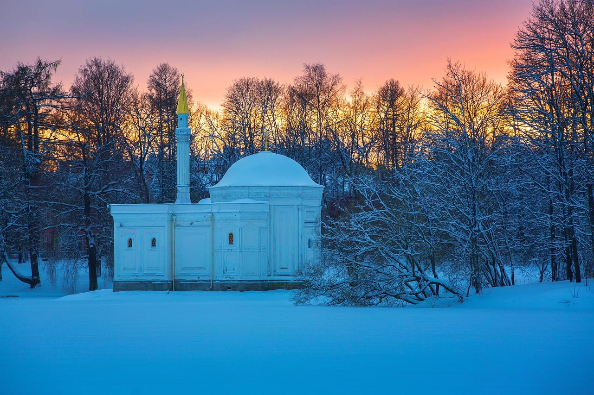

## Во сколько раз новогодняя неделя дороже обычной

Я взял 41 направление из Москвы — от Хургады до Сиднея — и сравнил две вылазки одинаковой длины: **30 декабря — 8 января** и обычную неделю **21–28 января**. Обе цены — минимальные предложения, которые отдал Travelpayouts Data API 5 сентября 2026 года. Это не котировка и не бронь: агрегатор показывает лучшее, что видел, и к декабрю числа поедут.

Часть направлений из таблицы выпала. По Хургаде, Шарм-эль-Шейху, Гоа, Еревану и Гаване агрегатор не отдал цену на контрольную неделю, по Пунта-Кане — на само новогоднее окно, а по Нячангу не отдал ни одной цены ни за один период. Придумывать им множитель я не стал: этих строк здесь нет.

| Направление | 30.12 — 08.01 | 21–28.01 | Множитель | Переплата за праздник |
|---|---:|---:|---:|---:|
| Сидней | 169 969 ₽ | 103 681 ₽ | 1,64 | **66 288 ₽** |
| Токио | 123 156 ₽ | 64 403 ₽ | 1,91 | 58 753 ₽ |
| Санья | 99 595 ₽ | 50 529 ₽ | 1,97 | 49 066 ₽ |
| Маврикий | 147 512 ₽ | 99 283 ₽ | 1,49 | 48 229 ₽ |
| Бангкок | 105 379 ₽ | 59 070 ₽ | 1,78 | 46 309 ₽ |
| Хошимин | 111 145 ₽ | 66 330 ₽ | 1,68 | 44 815 ₽ |
| Пхукет | 109 013 ₽ | 66 555 ₽ | 1,64 | 42 458 ₽ |
| Окленд | 163 539 ₽ | 122 261 ₽ | 1,34 | 41 278 ₽ |
| Коломбо | 103 338 ₽ | 64 573 ₽ | 1,60 | 38 765 ₽ |
| Мале | 112 469 ₽ | 75 045 ₽ | 1,50 | 37 424 ₽ |
| Денпасар | 106 891 ₽ | 71 160 ₽ | 1,50 | 35 731 ₽ |
| Анталья | 56 394 ₽ | 26 601 ₽ | 2,12 | 29 793 ₽ |
| Иркутск | 50 741 ₽ | 22 476 ₽ | 2,26 | 28 265 ₽ |
| Стамбул | 51 309 ₽ | 23 425 ₽ | 2,19 | 27 884 ₽ |
| Дубай | 61 739 ₽ | 34 663 ₽ | 1,78 | 27 076 ₽ |
| Сочи | 39 394 ₽ | 15 070 ₽ | 2,61 | 24 324 ₽ |
| Мурманск | 27 627 ₽ | 15 209 ₽ | 1,82 | 12 418 ₽ |
| Тбилиси | 43 337 ₽ | 34 113 ₽ | 1,27 | 9 224 ₽ |
| Казань | 14 053 ₽ | 4 921 ₽ | **2,86** | 9 132 ₽ |
| Санкт-Петербург | 11 907 ₽ | 8 758 ₽ | 1,36 | 3 149 ₽ |
| Петропавловск-Камчатский | 35 790 ₽ | 36 358 ₽ | **0,98** | −568 ₽ |

Первое, что видно: **верх таблицы занимают дорогие направления**. Сидней забирает за праздник 66 288 ₽ с человека, Токио — 58 753 ₽. Это не потому, что там множитель выше — он как раз средний; это потому, что база большая, и полтора множителя от ста семидесяти тысяч дороже, чем три множителя от пяти.

Таблица отсортирована по переплате, а не по множителю — и порядок получился обратный привычному. **Казань даёт самый большой множитель во всей выборке и почти самую маленькую переплату.** Билет там дешёвый и в праздник, и без него: 14 тысяч против пяти. А Санья с множителем меньше двух забирает сорок девять тысяч, потому что база большая.

Отсюда правило, которого нет ни в одной подборке: процент годится для заголовка, решение принимают по рублям. Если вы выбираете между Казанью и Дубаем, «Казань дорожает в 2,86 раза» — не аргумент против Казани.

И отдельная строка — **Камчатка**. Из всех проверенных направлений это единственное, где новогоднее окно не дороже обычной недели: 35 790 ₽ против 36 358 ₽ в январе и 35 896 ₽ в феврале. Перевозка туда живёт своей жизнью, праздничного всплеска на ней нет. Значит, единственное место в этом списке, где не нужно спешить с покупкой билета, — Камчатка. Про саму поездку — в [гайде по Камчатке](/blog/kamchatka-guide-2026/).

## Где ломается цена: даты вылета

Второй замер — та же поездка, но с разными датами старта. Здесь видно, что «уехать на день раньше» работает не везде одинаково.

| Направление | 29.12 | 30.12 | 31.12 | 02.01 | 05.01 | 09.01 | 14.01 |
|---|---:|---:|---:|---:|---:|---:|---:|
| Хургада | 48 306 ₽ | 54 751 ₽ | 53 722 ₽ | 59 068 ₽ | — | **31 136 ₽** | 35 232 ₽ |
| Шарм-эль-Шейх | 63 509 ₽ | 64 781 ₽ | 64 879 ₽ | 51 897 ₽ | 40 208 ₽ | 45 469 ₽ | **32 997 ₽** |
| Дубай | 67 078 ₽ | 61 739 ₽ | 61 739 ₽ | 70 992 ₽ | 49 741 ₽ | 35 665 ₽ | **34 650 ₽** |
| Пхукет | 115 184 ₽ | 109 013 ₽ | 107 329 ₽ | 93 163 ₽ | 90 682 ₽ | 71 169 ₽ | **65 892 ₽** |
| Сочи | 39 720 ₽ | 39 394 ₽ | 38 637 ₽ | 34 114 ₽ | 21 744 ₽ | **14 959 ₽** | 16 100 ₽ |
| Стамбул | 46 060 ₽ | 51 309 ₽ | 51 309 ₽ | 43 508 ₽ | 31 542 ₽ | **25 715 ₽** | — |
| Ереван | 33 934 ₽ | 36 506 ₽ | 39 394 ₽ | 32 096 ₽ | 28 182 ₽ | **25 654 ₽** | 25 754 ₽ |
| Гоа | 88 854 ₽ | 88 176 ₽ | 75 289 ₽ | 93 850 ₽ | 106 268 ₽ | — | **61 994 ₽** |
| Камчатка | 35 897 ₽ | 35 790 ₽ | 36 376 ₽ | — | — | 36 358 ₽ | — |

Читается это так. **Ступень вниз после 9 января есть, но не везде.** У Сочи и Хургады она резкая — цена падает больше чем вдвое и на треть соответственно. У Шарм-эль-Шейха и Пхукета спуск плавный, без излома именно на девятом числе. У Камчатки ступени нет вовсе. По Мурманску данных на 9 января агрегатор не отдал, поэтому про него я ничего не утверждаю.

Совет «улетайте на день раньше» тоже не универсальный. Вылет 29 декабря дешевле 30-го для Стамбула и Хургады, но дороже для Дубая и Пхукета. У Гоа порядок переворачивается вовсе: 31 декабря там 75 289 ₽, а 5 января — 106 268 ₽. Проверять надо своё направление, а не запоминать правило.

Есть и вторая, календарная сторона у этой ступени. Дешёвые даты начинаются 9 января, а каникулы заканчиваются 10-го: внутри отдыха дешёвых дней ровно два. Всё, что дальше, требует отпуска, а не праздничных дней.

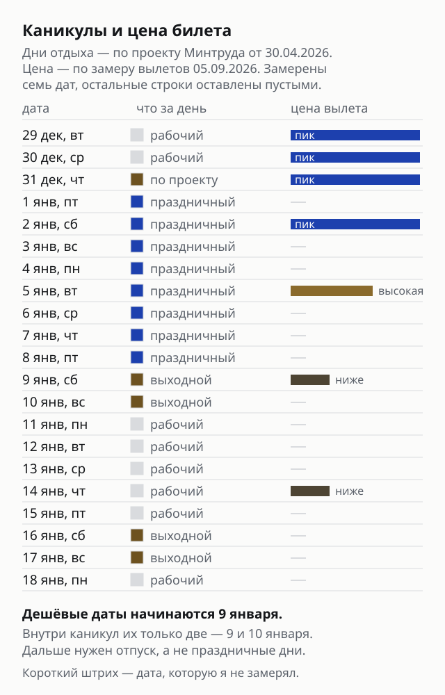

## Шесть сценариев, между которыми выбирают

### Египет, 9–10 дней, машина не нужна

Ближайшее тёплое море: пять-шесть часов лёта, виза ставится по прилёте. Январь в Хургаде — воздух около +21 °C днём и +11 °C ночью, вода около +24 °C: цифры из помесячной статистики египетского статведомства ([CAPMAS](https://www.censusinfo.capmas.gov.eg/Metadata-ar-v4.2/index.php/catalog/1342/download/4478)) и температуры моря ([NOAA](https://www.ncei.noaa.gov/products/optimum-interpolation-sst)), сверенных для нашего разбора Египта 3 сентября 2026 года. Минус честный: **вода пригодна для короткого плавания, а ветер решает, каким будет пляжный день** — подробнее в [разборе месяцев и курортов Египта](/blog/egypt-guide-2026/). <a href={egyptFlight} class="aff-cta" rel="sponsored">Найти билет Москва — Хургада</a> — Aviasales сравнивает прямые и стыковочные, форма открывается на декабрьской дате.

### ОАЭ, 5–7 дней, машина нужна со второго дня

Здесь едут за городом и салютом, а не за купанием: по сезонной таблице [нашего разбора Эмиратов](/blog/uae-guide-2026/) в январе воздух держится около +24…+26 °C, а вода остывает до +19…+22 °C. Переплата за праздник — 27 076 ₽ на человека, множитель 1,78. Минус: короткая поездка не оставляет времени на всё, ради чего сюда стоит ехать помимо Дубая, — мечеть в Абу-Даби и горы в Рас-эль-Хайме требуют машины и двух дней. Что там есть кроме небоскрёбов, разобрано [в гайде по Эмиратам](/blog/uae-guide-2026/).

 <a href={uaeFlight} class="aff-cta" rel="sponsored">Найти билет Москва — Дубай</a> — прямые рейсы и пересадки в одном поиске.

### Таиланд, 12–14 дней, машина не нужна

Самый дорогой билет из всей таблицы и почти девять часов прямого перелёта на Пхукет. На неделю лететь туда невыгодно арифметически: переплата за праздник 42 458 ₽ ложится на те же семь дней, что и в Египте, только билет вдвое дороже. И отдельный минус, появившийся 15 сентября 2026 года: **безвизовый срок для российских паспортов сокращён с 60 дней до 30** ([Управление по туризму Таиланда](https://www.tatnews.org/2026/09/thailand-introduces-new-30-day-and-15-day-visa-exemption-rules-from-15-september/)). Для двухнедельного отпуска ничего не меняется, для зимовки — меняет всё; сезоны островов и цены собраны [в гайде по Таиланду](/blog/thailand-guide-2026/).

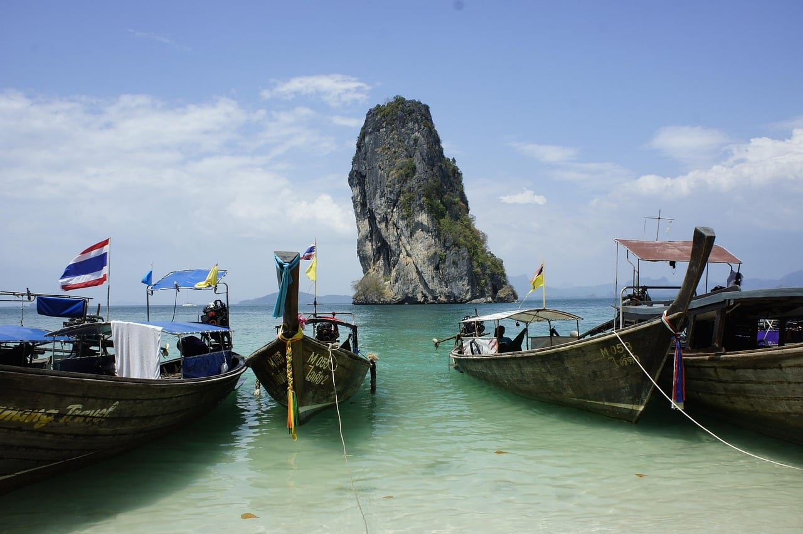

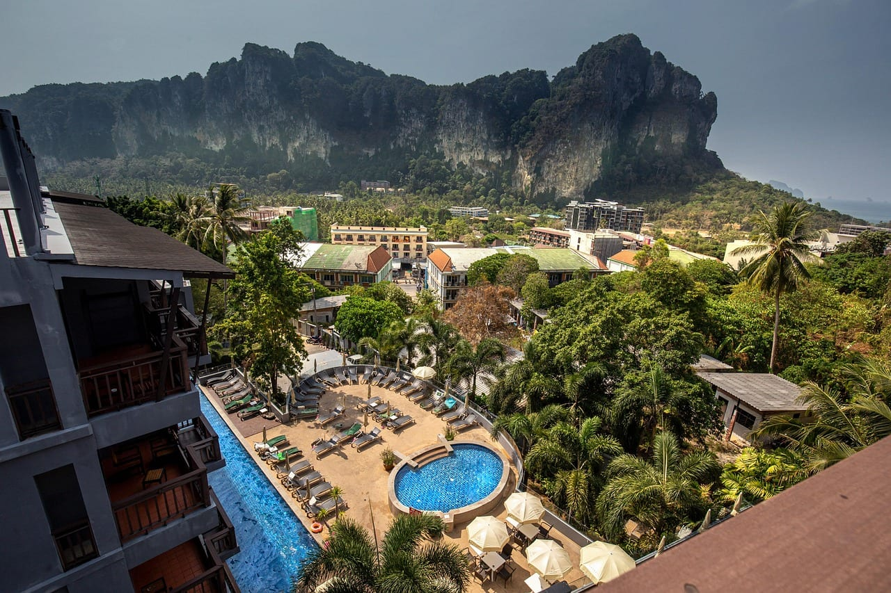 <a href={thaiFlight} class="aff-cta" rel="sponsored">Найти билет Москва — Пхукет</a> — гибкие даты дают заметную разницу, форма откроется на декабре.

### Мурманск и Кольский, 4–6 дней, машина нужна

Тут я скажу против самого популярного новогоднего плана, и скажу это на своих граблях. Декабрь и начало января — худшее время сезона за сиянием, и дело не в солнечной активности, а в облаках: **в Мурманске за год в среднем 13 ясных дней, в декабре — один**, а по нижней облачности декабрь даёт 4 ясные ночи против 7 в марте ([климатические таблицы метеостанции 22113](http://www.pogodaiklimat.ru/climate/22113.htm)). Полярная ночь даёт темноту, но не даёт неба. Если сияние — главная цель поездки, конец февраля и март дешевле и результативнее: [разбор сезона на Кольском](/blog/aurora-murmansk-2027/). На новогодние даты Кольский берут ради снега и Териберки, а сияние считают бонусом.

Своё правило про зиму в России я вывел не здесь, а на Байкале. Купил билеты на середину февраля в расчёте доехать на машине до Хужира по ледовой переправе — и не доехал: переправу открывают не по календарю, а по толщине льда, в 2026 году её открыли 27 февраля и закрыли 24 марта. Зима в России продаётся календарём, а работает погодой, и новогодние даты провоцируют эту ошибку сильнее всего. Практический вывод для любого зимнего сценария в списке: закладывайте под погоду минимум три ночи. Одна ночь — лотерея, три меняют арифметику. Подробности про лёд — [в разборе Байкала зимой](/blog/baikal-zimoy-2027/).

### Сочи и Красная Поляна, 5–7 дней, машина не нужна

Множитель 2,61 — второй по величине в выборке, переплата 24 324 ₽. Зато после 9 января билет падает до 14 959 ₽, то есть праздничная неделя стоит здесь дороже всего относительно соседней. Минус: горы в каникулы — это очереди на канатных дорогах и цены на ски-пасс, которые в отзывах упоминают чаще самих трасс (см. раздел ниже). И снег в январе на Кавказе не гарантирован.

### Камчатка, 8–9 дней, транспорт даёт тур

Единственное направление без праздничной наценки. Минус здесь не в деньгах, а в погоде: вертолётные и снегоходные выходы отменяют, и запас в два-три дня — не роскошь, а условие. Световой день в начале января короткий, программа сжимается к середине дня.

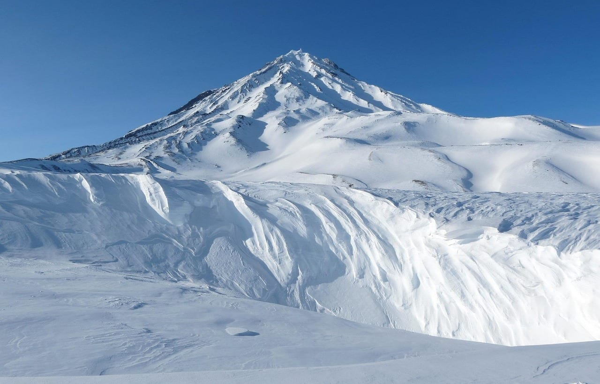

## Девять дорогих направлений, где Новый год — это лето

Всё выше — про то, куда летают массово. Но 31 декабря в южном полушарии стоит середина лета, и это единственная неделя в году, когда «дорого» и «сезон» совпадают. Здесь другая арифметика: множитель средний, а переплата самая большая во всём замере. И здесь же решает не цена, а срок оформления документов.

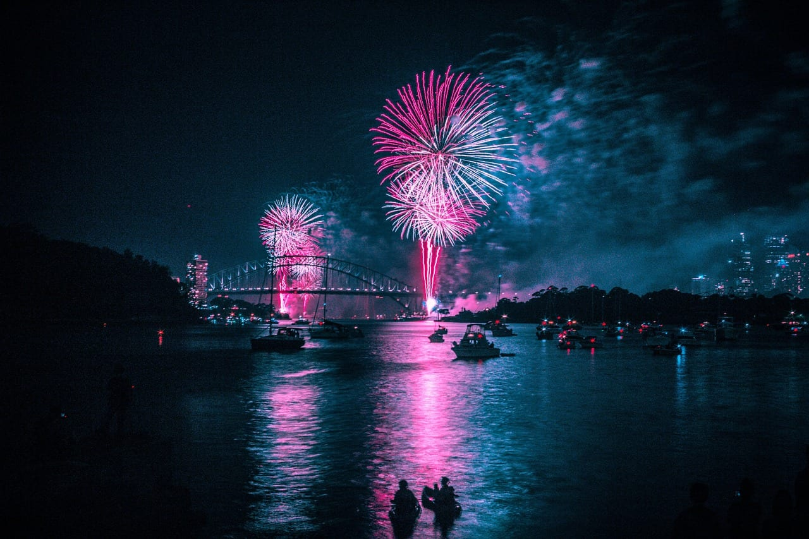

### Австралия, Сидней. 14–16 дней, машина нужна вне города

Переплата за праздник — **66 288 ₽** с человека, больше всех в таблице: 169 969 ₽ в новогоднее окно против 103 681 ₽ в обычную неделю января. Взамен получаете разгар южного лета и салют над Харбор-Бридж. Честный минус здесь не в деньгах, а в календаре. Департамент внутренних дел Австралии публикует сроки числом: его калькулятор по гостевой визе subclass 600, поток Tourist, на 5 сентября 2026 года показывает **половину решений за 18 дней и девять из десяти за 38** ([калькулятор](https://immi.homeaffairs.gov.au/visas/getting-a-visa/visa-processing-times/global-visa-processing-times)). ⚠️ Это числа по всей категории, а не срез по России: наши заявки проходят дополнительные проверки, ускоренной опции нет, поэтому 38 дней считайте нижней границей планирования, а не обещанием. Практический вывод: до 30 декабря запас есть, но невозвратные билеты до решения не выкупать. Сбор — **250 AUD**. Разбор подачи и документов — [в отдельной статье про австралийскую визу](/blog/australia-visa-2026/). <a href={sydneyFlight} class="aff-cta" rel="sponsored">Посмотреть перелёт Москва — Сидней</a> — Aviasales откроет маршрут на декабрьской дате, свои дни подставьте сами.

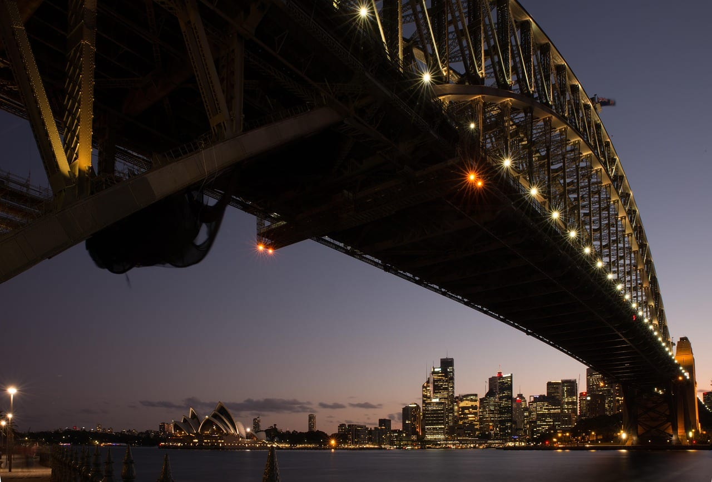

### Новая Зеландия, Окленд. 16–18 дней, машина обязательна

Самый низкий множитель среди дорогих — **1,34**: 163 539 ₽ против 122 261 ₽. Праздник поднимает цену меньше, чем в Сиднее, но сама поездка длиннее: прямых рейсов нет, дорога занимает **30–44 часа** с пересадкой, чаще всего в Китае. И вот здесь всплывает сюжет из предыдущего раздела: **безвизовый транзит через Китай подтверждён только до 14 сентября 2026 года**, продление за эту дату я подтвердить не смог. Для новогодней пересадки это надо выяснять до покупки билета. Виза — **441 NZD** на одного и 541 на двоих, действует около года от выдачи. Что там со снаряжением, хижинами и сезоном — [в гайде по Новой Зеландии](/blog/new-zealand-guide-2026/).

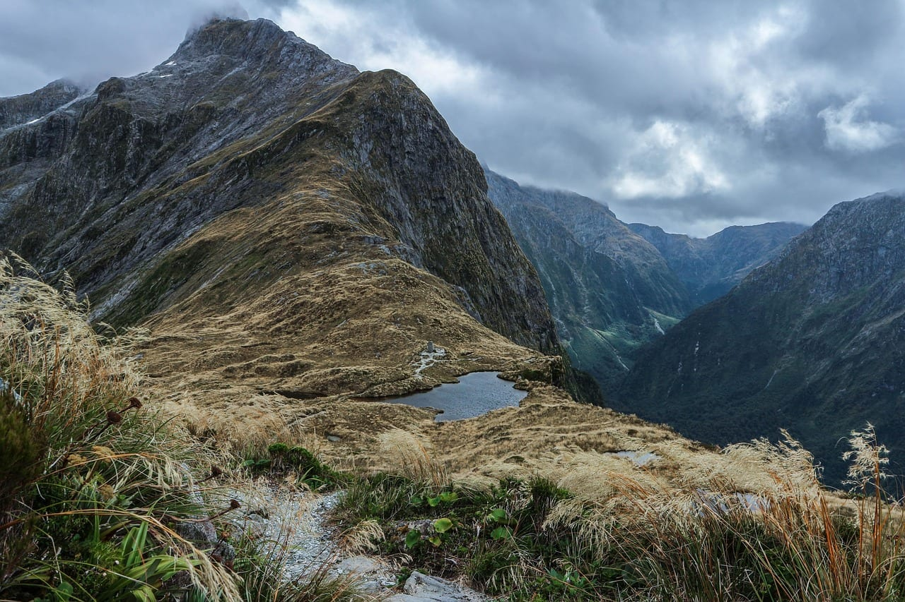

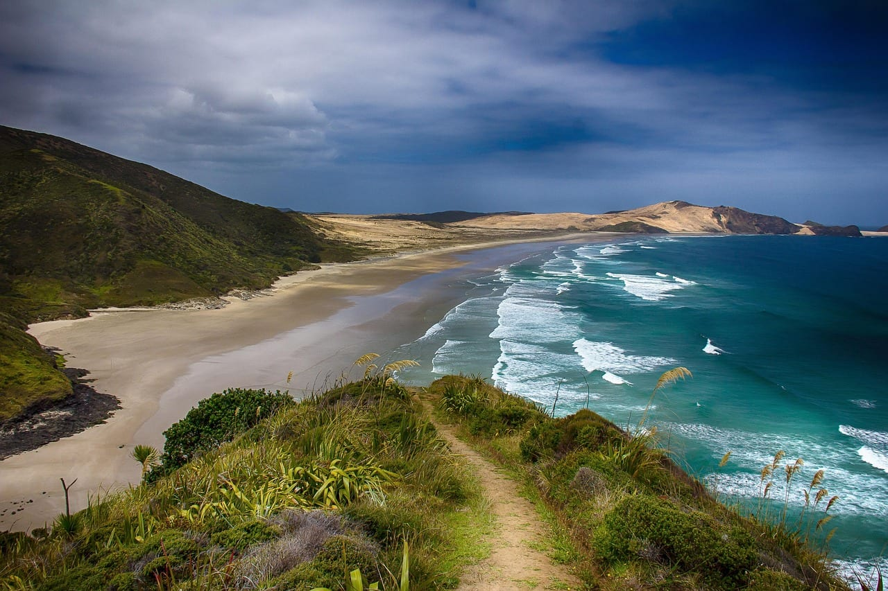 <a href={aucklandFlight} class="aff-cta" rel="sponsored">Посмотреть перелёт Москва — Окленд</a> — маршрут открывается сразу, стыковки видно в одном списке.

### Япония, Токио. 9–12 дней, машина не нужна

Множитель **1,91** — самый высокий среди дорогих: 123 156 ₽ против 64 403 ₽. Но у Японии есть особенность, которой нет ни у кого в этом списке: **Новый год там главный праздник года**, и в первые дни января страна закрывается — не работает часть музеев, магазинов и ресторанов, зато храмы полны людьми. Это не минус и не плюс, это другая поездка: ехать надо ради неё, а не вопреки ей. Виза при этом самая быстрая в списке — стандартный срок **4–7 рабочих дней**, сама бесплатна, сервисный сбор 970 ₽ в Москве и Петербурге. Но ⚠️ **именно в декабре перед Новым годом срок растягивается до 10–14 дней**, а платной срочной услуги нет, так что закладывать надо две недели, а не неделю. Подавать можно не раньше чем за три месяца до вылета: [что нужно для японской визы](/blog/japan-visa-2026/).

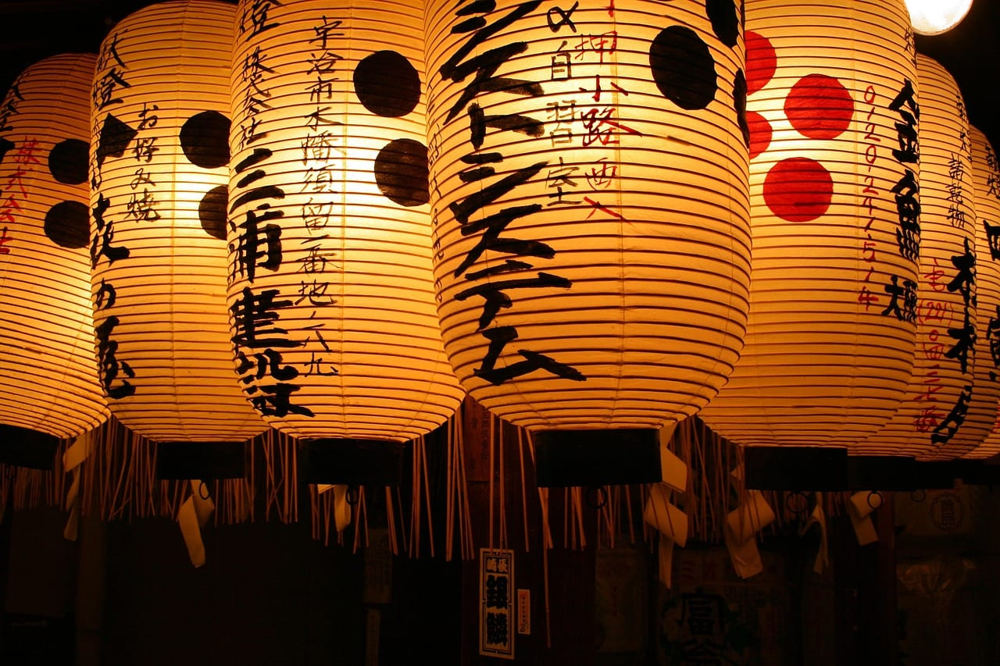 <a href={tokyoFlight} class="aff-cta" rel="sponsored">Посмотреть перелёт Москва — Токио</a> — прямые и стыковочные в одном поиске.

### Танзания, Килиманджаро. 12–14 дней, транспорт даёт тур

Вторая по величине переплата во всём замере: **171 191 ₽** в новогоднее окно против **99 319 ₽** на вылет 14 января — разница **71 872 ₽**. ⚠️ Контроль здесь другой: на неделю 21–28 января цены не нашлось, поэтому сравнение идёт с серединой января, и это не та же самая пара дат, что в главной таблице. Смысл всё равно читается: за новогодние даты вы платите вторую поездку. Взамен — короткий сухой сезон и восхождение без дождя. Минус честный: акклиматизация занимает дни, которые нельзя сжать, а погода на горе не подчиняется календарю каникул.

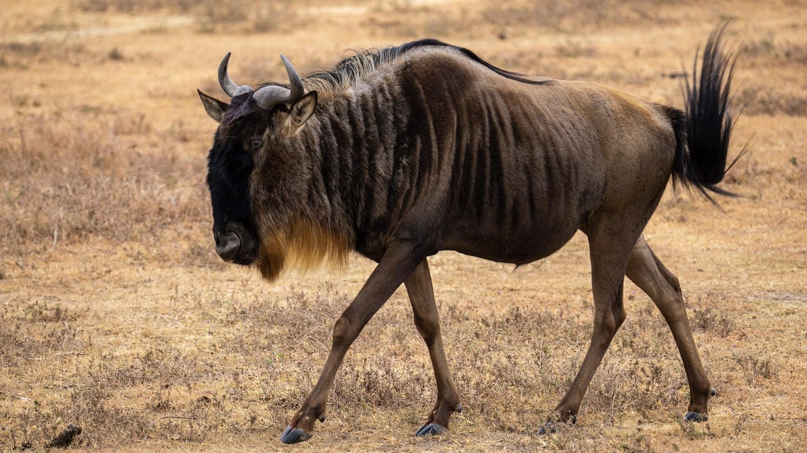

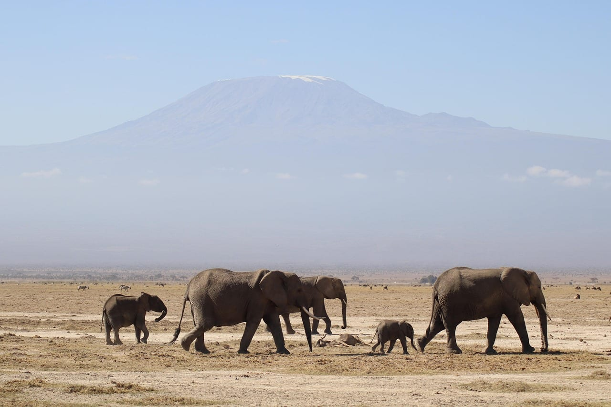

### Кения, Найроби. 10–12 дней, транспорт даёт тур

Самая маленькая праздничная наценка среди дорогих: **90 898 ₽** против **66 139 ₽** на 14 января — переплата 24 759 ₽. Виза оформляется онлайн, **eTA за 30 $**, и это единственное дорогое направление в списке, где документы не диктуют срок. Минус: январь в Масаи-Мара — не сезон Великой миграции, она идёт с июля по октябрь, так что ехать надо за кратерами и хищниками, а не за переправами через Мару. Парки, бюджет и прививки — [в гайде по Кении](/blog/kenya-guide-2026/).

 <a href={nairobiFlight} class="aff-cta" rel="sponsored">Посмотреть перелёт Москва — Найроби</a> — стыковочные варианты сравниваются в одном окне.

### Сейшелы, Маэ. 10–12 дней, машина нужна на Маэ и Праслене

В новогоднее окно **114 039 ₽**. ⚠️ Контроль здесь пришлось брать другой: на неделю 21–28 января цен не нашлось, зато нашлись на вылет 9 января — **87 273 ₽** — и на начало февраля — **71 595 ₽**. То есть от новогоднего окна к началу февраля билет дешевеет в полтора раза: 114 039 против 71 595 ₽. Визы нет, но **электронное разрешение на въезд обязательно для всех** и стоит от **10 €** при подаче за сутки; срочные тарифы — 30 € за шесть часов и 70 € за час, а прилетевшему без одобренного разрешения выписывают штраф 30 €, который в аэропорту не принимают ни наличными, ни картой. Подавать можно в течение 30 дней до прилёта. Отдельно про дорогу: прямые рейсы «Аэрофлота» заявлены **до декабря** по средам и субботам, в конце года добавляется понедельник — то есть на новогодние даты сетка меняется, и её надо смотреть под свои дни. Условия въезда и выбор острова — [в разборе Сейшел](/blog/seychelles-2026/).

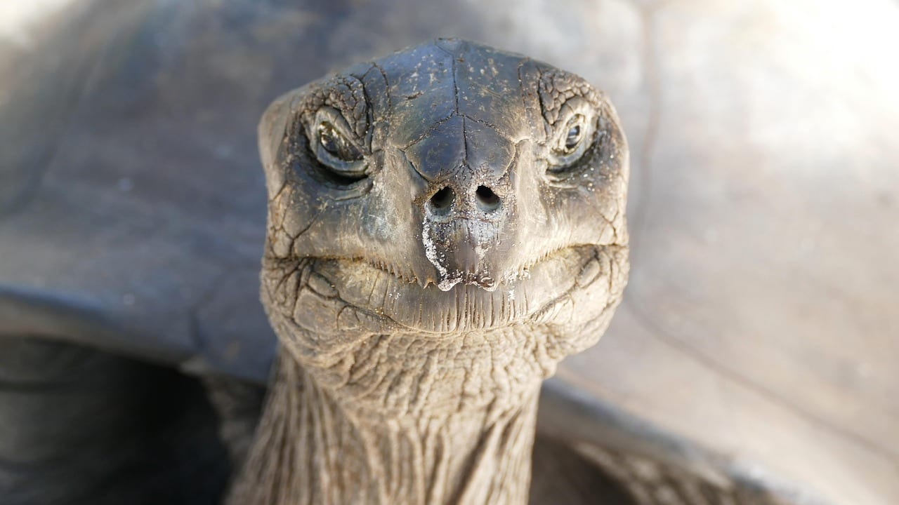 <a href={seychellesFlight} class="aff-cta" rel="sponsored">Посмотреть перелёт Москва — Маэ</a> — прямые и стыковочные в одном списке, даты меняются под ваши.

### Маврикий. 10–14 дней, машина обязательна

Одно из двух дальних направлений — вместе с Мальдивами, — что встало в главную таблицу на общей методике: **147 512 ₽** против 99 283 ₽ в обычную неделю января, множитель **1,49**, переплата **48 229 ₽**. Здесь же самая наглядная выгода от сдвига дат внутри праздников: вылет 29 декабря стоил **167 848 ₽**, а 2 января — **122 376 ₽**. Сорок пять тысяч рублей за четыре дня ожидания. Визы нет, но **единая въездная форма обязательна по закону**, а не рекомендована: подтверждение спрашивают при посадке, форма бесплатна, а платные сайты-посредники к ней отношения не имеют. Плюс турсбор **3 €** за ночь с гостей от двенадцати лет. Минус: январь — разгар сезона циклонов в юго-западной части Индийского океана, и это причина брать возвратный тариф, а не абстракция; что там с берегами и месяцами — [в разборе Маврикия](/blog/mauritius-2026/).

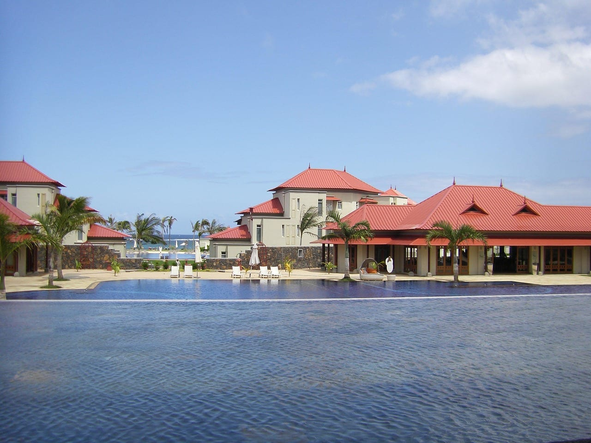 <a href={mauritiusFlight} class="aff-cta" rel="sponsored">Посмотреть перелёт Москва — Маврикий</a> — прямых рейсов нет, стыковки видно сразу.

### Мальдивы, Мале. 9–11 дней, машина не нужна вовсе

Новогоднее окно — **112 469 ₽** против 75 045 ₽ в обычную неделю января: множитель **1,50**, переплата **37 424 ₽**. Это та же методика, что в главной таблице, без оговорок. Январь на Мальдивах — сухой северо-восточный муссон, то есть лучшее время года, и именно поэтому праздничная неделя тут дорожает вместе с сезоном, а не вопреки ему. Минус денежный и жёсткий: билет — меньшая часть сметы, потому что на атоллах вы платите ещё и за трансфер до острова, а гидросамолёт летает только днём и в цену перелёта не входит. Второй минус — на острове одна цена на всё, торговаться не с кем.

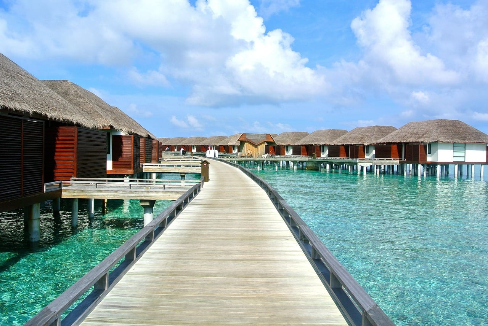

### ЮАР, Кейптаун. 12–16 дней, машина обязательна

Здесь самая большая переплата во всём замере: **155 882 ₽** против **82 080 ₽** в обычную неделю января — разница **73 802 ₽**. ⚠️ Оговорка обязательна: на 30 декабря цены не нашлось, число снято на вылет **29 декабря**, то есть это не та же пара дат, что в главной таблице. Взамен — разгар южного лета на мысе, виноградники Стелленбоша и Столовая гора без зимних туманов. Виза россиянам не нужна — в списке Департамента внутренних дел ЮАР записано **90 дней**, — но с **1 июля 2026 года** декларацию о вещах и валюте подают **онлайн до поездки**. Минус — ветер: по данным метеослужбы ЮАР самые сильные юго-восточные ветры в Кейптауне приходятся именно на **декабрь и февраль**, со средней скоростью около 7 м/с, а ветер от 1,6 м/с стоит там 95,6% дней в году. Сезоны внутри страны при этом не совпадают: Кейптаун хорош с ноября по март, а сафари в Крюгере — с мая по сентябрь, и совместить их в одну поездку не выйдет. Подробности — [в гайде по ЮАР](/blog/south-africa-guide-2026/).

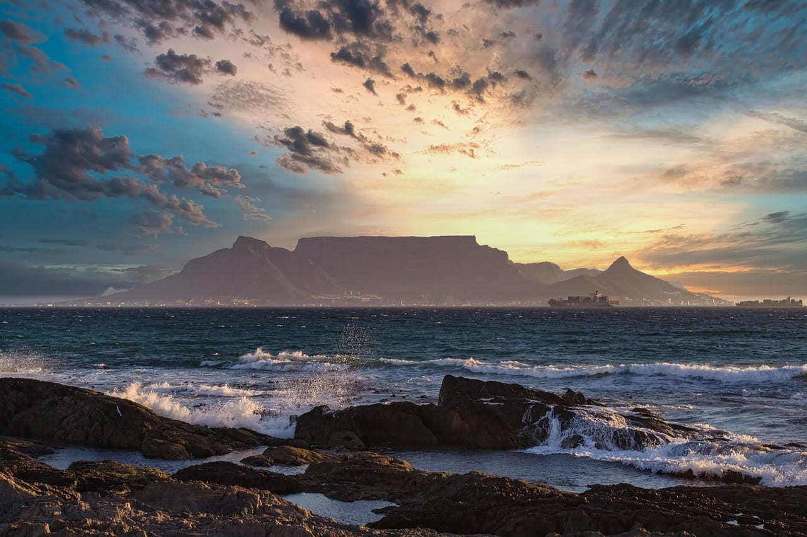 По Йоханнесбургу новогодняя цена нашлась — **130 363 ₽**, — но контрольной недели нет, поэтому множителя я не считаю. <a href={capeTownFlight} class="aff-cta" rel="sponsored">Посмотреть перелёт Москва — Кейптаун</a> — стыковки через Стамбул и Залив сравниваются в одном окне.

⛔ **Чего у меня по дорогим направлениям нет.** Южная Америка не дала ни одной цены ни за один период: по Буэнос-Айресу, Сантьяго, Лиме, Кито, Ушуае, Пунта-Аренасу и Ла-Пасу агрегатор молчит целиком. Это не значит, что билетов нет, — это значит, что подставить туда число я не могу и не буду. Патагония и Ушуая на новогодние даты остаются без замера, и проверять их придётся вручную.

## Сколько дней — что складывается

| Длина поездки | Что успеваете | Во что упирается бюджет |
|---|---|---|
| 4 дня, 31.12 — 03.01 | один город: Казань или Петербург | жильё в новогоднюю ночь, а не билет: перелёт от 12 до 14 тысяч |
| 5–7 дней | Дубай, Сочи с горами, Стамбул | билет — от 39 до 62 тысяч, это половина сметы |
| 9–10 дней, 30.12 — 08.01 | Египет с морем и одной экскурсией; Камчатка | билет плюс виза 30 $; на Камчатке — тур, а не билет |
| 12–14 дней | Таиланд, Вьетнам, Шри-Ланка, Бали, Танзания | билет от 103 до 171 тысячи; короче ехать невыгодно |
| 14–18 дней | Австралия, Новая Зеландия, ЮАР | билет от 156 до 170 тысяч плюс виза; решает не цена, а срок её оформления |

Смысл таблицы в последней колонке. **До недели решает жильё, после недели решает билет.** На четыре дня в Казани переплата за перелёт — девять тысяч, а новогодняя ночь в ресторане отеля съест больше. На две недели в Азии билет становится половиной поездки, и экономить надо на нём.

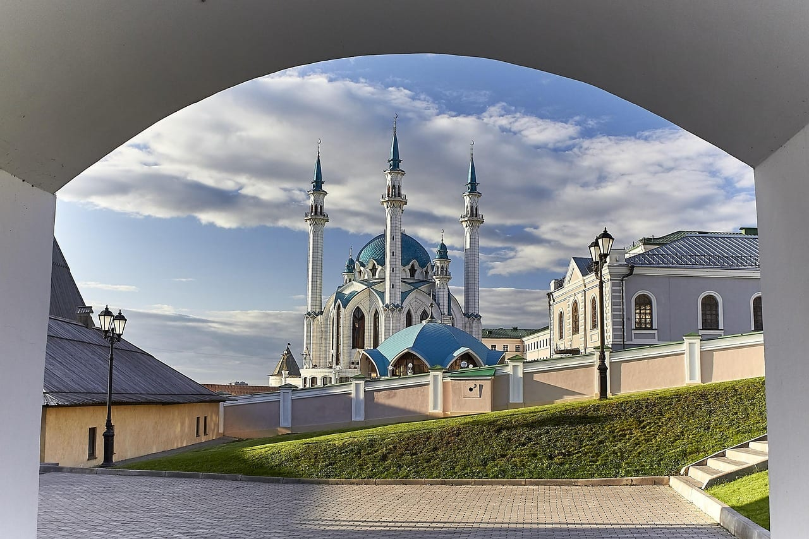

## Куда успеваете с документами

Все направления выше — без предварительной визы или с оформлением онлайн. Сроки, которые действительно поджимают, тут два: заявление на египетскую электронную визу и календарь безвизовых режимов.

| Направление | Что нужно | Срок и цена |
|---|---|---|
| Египет | виза по прилёте либо электронная | заявление подают **минимум за 7 дней** до вылета; однократная 30 $ (≈ 2 600 ₽), многократная 65 $ |
| ОАЭ | ничего оформлять не нужно | штамп на границе, до 90 дней в течение 180 |
| Таиланд | ничего оформлять не нужно | до 30 дней при въезде с 15 сентября 2026 |
| Россия | ничего | — |
| Кения | eTA онлайн | сбор **30 $**, срок оформления документы не диктуют |
| Маврикий | визы нет, но обязательна единая въездная форма | форма бесплатна, её спрашивают при посадке; турсбор 3 € за ночь |
| ЮАР | визы нет, 90 дней | с 1 июля 2026 декларация о вещах и валюте подаётся онлайн до поездки |
| Сейшелы | визы нет, но обязательно разрешение на въезд | от **10 €** при подаче за сутки, срочно 30 € за шесть часов и 70 € за час |
| Япония | виза в консульстве | **4–7 рабочих дней**, виза бесплатна, сервисный сбор 970 ₽ |
| Новая Зеландия | виза онлайн | **441 NZD** на одного, действует около года от выдачи |
| Австралия | виза онлайн плюс биометрия | калькулятор департамента на 05.09.2026: **18 дней у половины заявок, 38 у девяноста процентов**; числа по категории, не по России; сбор 250 AUD |

Сбор в 30 $ — с портала электронных виз МВД Египта, там же указаны 65 $ (около 5 630 ₽) за многократную ([портал e-Visa](https://visa2egypt.gov.eg/eVisa/FAQ?lang=en)). В выдаче до сих пор встречается цифра 25 $ — она устарела. Пересчёт в рубли по курсу Банка России на 5 сентября 2026 года: 86,5857 ₽ за доллар.

Китай в эту таблицу я не поставил, и это отдельный сюжет. Единственная страница консульства, которую мне удалось прочитать, называет пробный безвизовый режим сроком **с 15 сентября 2025 по 14 сентября 2026 года** ([генконсульство КНР в Хабаровске](https://khabarovsk.china-consulate.gov.cn/rus/zytz/202509/t20250917_11710332.htm)) — то есть он заканчивается раньше новогодних дат. О продлении до конца 2027 года сообщали со ссылкой на МИД КНР в мае 2026-го, но подтверждения на страницах консульств я 5 сентября 2026 года не нашёл. Значит, для поездки в Китай или на Хайнань условие въезда надо уточнять в консульстве до покупки билета, а не считать безвиз данностью.

На границе Египта спросят паспорт со сроком не меньше шести месяцев от даты прилёта, распечатку визы и подтверждение брони отеля — это требования самого портала, а не совет из блога. Что до страховки: обязательной для этих направлений она не является, а вот горные лыжи и мотобайк страховщики считают отдельным риском и в базовый полис не включают. <a href={insurance} class="aff-cta" rel="sponsored">Подобрать полис под свои даты</a> — Cherehapa сравнивает предложения, оплата картой РФ, полис приходит в PDF; страна на новогоднюю поездку у каждого своя, поэтому ссылка ведёт на подбор, а не на конкретное направление.

## Что пишут те, кто был в горах в каникулы

Отзывы на горнолыжный курорт в Красной Поляне я посмотрел на Яндекс.Картах: первая страница отдала **27 отзывов, из них 13 датированы декабрём и январём** — с 2019 по 2025 год. Это выборка, представительной её считать нельзя.

Повторяются две вещи. Первая — **очереди на канатных дорогах в высокий сезон**: их называют и в положительных отзывах, и в тех, где ставят три звезды. Вторая — цены: ски-пасс и еда упоминаются как дорогие даже теми, кто ставит пятёрку.

Ценнее всего противоречие. В одном январском отзыве снег хвалят, в другом, за январь 2023 года, посетитель пишет, что снега не было вовсе, а на трассах лежали камни — со слов посетителя, официального подтверждения этому я не искал. Вывод для планирования: **снег в Красной Поляне на конкретные даты не обещан никем**, и бронировать невозвратное жильё на горы за месяц — это ставка.

## Чего в этой статье нет

Нет цен на жильё по каждому направлению: новогодняя ночь продаётся пакетом с ужином, и сравнить её с обычной ночью честно не получится. Нет моей собственной новогодней поездки ни на одно из этих направлений — зимние поездки по России у меня есть, новогодних за границу нет, и выдумывать я их не стану. Нет прогноза, подпишут ли постановление о выходных: это решение правительства, а не предмет для гадания. Нет цен по Южной Америке — агрегатор не отдал по Буэнос-Айресу, Сантьяго, Лиме, Кито, Ушуае, Пунта-Аренасу и Ла-Пасу ни одного числа ни за один период, и выдумывать их я не стал. По Йоханнесбургу есть новогодняя цена, но нет контрольной недели, поэтому множителя по нему в статье тоже нет.

Цены — снимок одного дня, 5 сентября 2026 года. Я пересниму их в начале ноября, до пика спроса; если увидите даты старее — считайте, что соотношение осталось, а суммы поехали.

## Вопросы перед бронью

**Когда крайний срок покупки билета на Новый год?**
Жёсткого срока нет ни у одного перевозчика. По замеру 5 сентября 2026 года новогоднее окно стоило в 1,3–2,9 раза дороже соседней недели — за четыре месяца до вылета. Единственный жёсткий срок в этом списке — египетская электронная виза: заявление подают минимум за семь дней до вылета.

**Правда ли, что 31 декабря 2026 будет выходным?**
Так предполагает проект постановления, опубликованный Минтрудом 30 апреля 2026 года. Подписанного документа на 5 сентября 2026 года нет, поэтому планировать вылет утром 31 декабря стоит с возвратным тарифом.

**Где дешевле всего встретить Новый год из проверенных направлений?**
По билету — Санкт-Петербург: 11 907 ₽ туда-обратно, переплата 3 149 ₽. По соотношению цены и «непохожести на дом» — Казань: 14 053 ₽ при переплате 9 132 ₽.

**Есть ли смысл лететь далеко и дорого именно на Новый год?**
Смысл ровно один: 31 декабря в южном полушарии — середина лета, и другой такой недели в году нет. Платите за это дорого: в Сиднее переплата 66 288 ₽ с человека, на Килиманджаро 71 872 ₽. Решает при этом не только цена, но и сроки документов: австралийский калькулятор на 5 сентября 2026 года даёт 38 дней на девять заявок из десяти — по всей категории, а не по России, так что для наших заявок это нижняя граница; японская виза в декабре идёт 10–14 дней вместо обычных 4–7.

**Что выбрать, если отпуск можно сдвинуть?**
Вторую декаду января: на Сочи разница между вылетом 30 декабря и 9 января — 39 394 против 14 959 ₽. Из проверенных направлений сдвиг не даёт выигрыша только на Камчатке.

Что из этого открыто россиянам вообще и куда пускают без визы в принципе — отдельный разбор: [двадцать направлений года и условия въезда](/blog/best-2026-for-russians/). Если тянет к снегу и льду, а не к морю, есть [Байкал зимой с честными датами ледовой переправы](/blog/baikal-zimoy-2027/).
