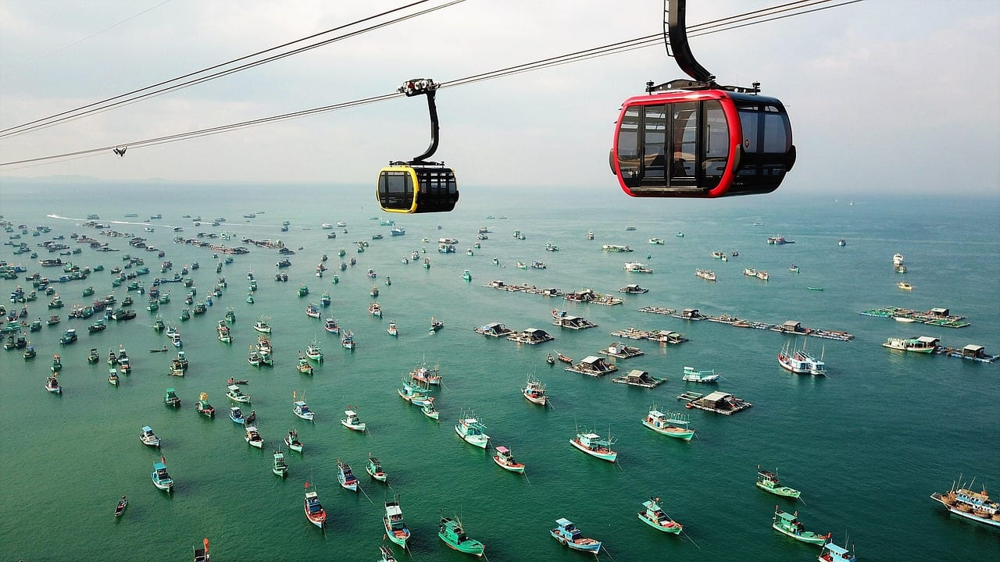
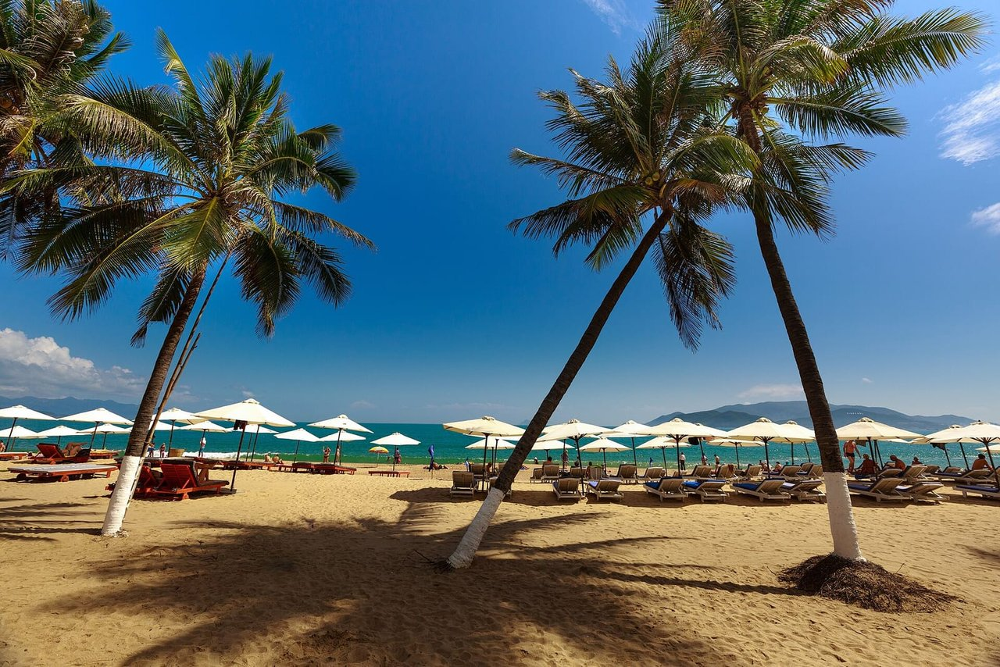

import AffiliateNote from '../../components/post/AffiliateNote.astro';
import { aviasalesRoute, cherehapaCountry, ostrovokCity } from '../../data/affiliate.js';

export const stayPhuQuoc = ostrovokCity('vietnam', 'phu_quoc', 'nyachang_fukuok_2026_stay_pqc');
export const stayNhaTrang = ostrovokCity('vietnam', 'nha_trang', 'nyachang_fukuok_2026_stay_cxr');
export const flightsPhuQuoc = aviasalesRoute('MOW', 'PQC', 'nyachang_fukuok_2026_flights_pqc', 11);
export const flightsNhaTrang = aviasalesRoute('MOW', 'CXR', 'nyachang_fukuok_2026_flights_cxr', 5);
export const insurance = cherehapaCountry('vietnam', 'nyachang_fukuok_2026_insurance');

«Куда лучше — в Нячанг или на Фукуок?» Короткий ответ «зимой Фукуок, летом Нячанг» верен наполовину. Дожди приходят на эти курорты в разные месяцы, но не зеркально: в ноябре на Нячанг выпадает 400 мм, на Фукуок 180, в июле наоборот — 45 против 438, а с января по март сухо на обоих. Ниже оба курорта по двенадцати месяцам в миллиметрах, что с дорогой и деньгами и где у каждого минусы.

> **Если коротко:** в **декабре и на Новый год — Фукуок**: 77 мм дождя за месяц против 224 в Нячанге. **С января по март** сухо на обоих. **С апреля по август — Нячанг**: 45–78 мм в месяц, пока на Фукуоке 137–438. **Сентябрь, октябрь и ноябрь** мокрые оба: в сентябре меньше льёт в Нячанге, в ноябре — на Фукуоке. Нячанг дешевле примерно на 15–20%, и прямые рейсы из Москвы есть только туда. <a href={stayPhuQuoc} class="aff-cta" rel="sponsored">Выбрать отель на Фукуоке</a> · <a href={stayNhaTrang} class="aff-cta" rel="sponsored">Выбрать отель в Нячанге</a>

<AffiliateNote />

Если вместо острова рассматриваете центральное побережье, посмотрите [сравнение Дананга и Нячанга: районы, пляжи и бюджет поездки](/blog/danang-ili-nyachang/).

## Коротко: кому Нячанг, а кому Фукуок

| Критерий | Нячанг | Фукуок |
|---|---|---|
| **Сухие месяцы** | январь–август | декабрь–март |
| **Самый мокрый месяц** | ноябрь, 400 мм | сентябрь, 542 мм |
| **Цены** | ниже | примерно на 15–20% выше |
| **Атмосфера** | город, набережная, тусовка | остров, тишина, резорты |
| **Пляжи** | городской + острова | белый песок, чище |
| **Прямой рейс из Москвы** | есть | нет, только с пересадкой |
| **Кому** | бюджет, первый раз, экскурсии | семьи, пары, спокойный отдых |
| **Доля в турах «Русского Экспресса» за 2025 год** | больше 60% | почти четверть |

Одной строкой: декабрь — Фукуок, апрель–август — Нячанг, январь–март — любой из двух, а осенью выбирайте меньшее из двух зол по таблице ниже.

---

## Нячанг или Фукуок по месяцам: дожди в цифрах

Разница между курортами не в температуре, а в дожде. Тепло на обоих круглый год, а миллиметры за месяц отличаются в разы, поэтому выбирать надо по цифрам, а не по слову «сезон».

| Месяц | Нячанг | Фукуок | Куда ехать |
|---|---|---|---|
| январь | 54 мм, 9 дней | 31 мм | оба |
| февраль | 13 мм, 4 дня | 21 мм | оба |
| март | 39 мм, 5 дней | 90 мм | оба, Нячанг суше |
| апрель | 46 мм, 5 дней | 137 мм | Нячанг |
| май | 78 мм, 9 дней | 230 мм | Нячанг |
| июнь | 48 мм, 7 дней | 369 мм | Нячанг |
| июль | 45 мм, 9 дней | 438 мм | Нячанг |
| август | 54 мм, 10 дней | 415 мм | Нячанг |
| сентябрь | 176 мм, 15 дней | 542 мм | оба мокрые, в Нячанге легче |
| октябрь | 325 мм, 17 дней | 326 мм | оба мокрые |
| ноябрь | 400 мм, 18 дней | 180 мм | Фукуок, но это переход |
| декабрь | 224 мм, 15 дней | 77 мм | Фукуок |

Дождливым днём считается день хотя бы с 0,1 мм осадков. Для Фукуока в многолетней норме есть только миллиметры, без числа дней. Норма — среднее за много лет, а не прогноз на вашу неделю: штормовые предупреждения по побережью публикует метеослужба Вьетнама на nchmf.gov.vn.

С теплом всё ровнее. В Нячанге в январе днём около 27 °C, ночью 22, в мае днём 32–33, ночью 26. На Фукуоке средняя за сутки держится около 27–29 °C круглый год.

### Где сезон ломается

- **Сентябрь в Нячанге — первый мокрый месяц, а не хвост лета.** 176 мм за 15 дождливых дней, больше чем втрое против августа.
- **Ноябрь — худший месяц Нячанга за год:** 400 мм за 18 дней. На Фукуоке в ноябре 180 мм — меньше, но сухо там станет только в декабре, когда выпадает 77.
- **Май на Фукуоке — начало дождей, а не конец сухого сезона.** 230 мм, в июне 369, пик в сентябре — 542 мм.
- **Январь в Нячанге не дождливый:** 54 мм за 9 дней, как в августе. Минус другой — это самый прохладный месяц, ночью около 22 °C.
- **Октябрь мокрый на обоих одинаково:** 325 и 326 мм. Выбирать между этими курортами в октябре бессмысленно — у севера страны в этом месяце сухо, у бухты Халонг 88 мм за месяц. Разбор по регионам — на странице [Вьетнам в октябре](/trips/october/vietnam/).

---

## Пляжи и море

Нячанг — это 6-километровая городская набережная: широкий жёлто-серый песок, пальмы, отели вдоль линии. Удобно и оживлённо, но это пляж в черте города, с дорогой и стройками за спиной. Лучшее море — не у города, а на **островах** (Хон Мун, Хон Там): туда возят на дайвинг и снорклинг, вода прозрачнее.

**Фукуок** — про пляж в классическом смысле. **Лонг-Бич** (Бай-Чыонг) на западе тянется длинной полосой с закатами, а **Бай-Сао** на юге — открыточный белый песок и бирюзовая вода. Чище, тише, меньше городской суеты. За это и дороже.

Вывод по пляжу: **за «настоящим островным пляжем» — Фукуок**, за удобной инфраструктурой «всё под рукой» — Нячанг. Но пляж решает только в подходящий месяц: в сентябре на Фукуоке белый песок не спасёт от 542 мм дождя.

---

## Где дешевле: разница 15–20%

Нячанг дешевле, и дело не в одних отелях. Туроператор «Русский Экспресс» оценивает разницу примерно в 15–20%: на Фукуоке дороже всё, от еды до экскурсий. Отелей на острове меньше, чем в Нячанге, и в декабре–феврале, в его высокий сезон, бывают сложности с подтверждением брони.

Нячанг и выбирают чаще. У того же туроператора в 2025 году на него пришлось больше 60% туристов во Вьетнам, на Фукуок — почти четверть. В Нячанге отели на любой кошелёк, а в районе Камрани много комплексов «всё включено».

Перелёт при этом стоит похоже, разница в другом — в прямом рейсе. Об этом следующий раздел.

---

## Как добраться: прямой рейс есть только до Нячанга

Нячанг принимает рейсы через аэропорт Камрань (CXR), у Фукуока свой аэропорт (PQC). Билет в одну сторону из Москвы на одну и ту же дату, 15 декабря 2026 года:

| | Нячанг (Камрань) | Фукуок |
|---|---|---|
| **Прямой рейс** | от 56 454 ₽, около 10 часов | нет |
| **С одной пересадкой** | от 45 618 ₽ | от 44 519 ₽ |
| **Самый дешёвый** | 40 174 ₽, три пересадки, почти двое суток | 38 987 ₽, две пересадки, 19 ч 40 мин |

Самый быстрый путь на Фукуок — 13 ч 40 мин с пересадкой в Ханое, но за 51 736 ₽. Дешёвые варианты на оба курорта идут через Китай — Пекин, Шанхай, Гуанчжоу или Чэнду. Если пересадка в Пекине долгая, [как выйти в город и что с багажом](/blog/peresadka-v-pekine/).

К Новому году Фукуок дорожает резко. Вылет 3–13 декабря — около 32,5–33,5 тысячи рублей, 18–27 декабря — от 51,7 до 67 тысяч, то есть в полтора–два раза дороже.

<a href={flightsPhuQuoc} class="aff-cta" rel="sponsored">Найти билет Москва — Фукуок на декабрь</a> — прямых рейсов нет, только с пересадкой.

<a href={flightsNhaTrang} class="aff-cta" rel="sponsored">Найти билет Москва — Нячанг на июнь</a>

Электронная карта прибытия обязательна во всех аэропортах Вьетнама — и в Камрани, и на Фукуоке. Её заполняют на портале иммиграционной службы не раньше чем за три дня до прилёта или по прилёте: в аэропорту есть QR-код и бумажный бланк. Остальные правила въезда — в [статье о визе во Вьетнам](/blog/vietnam-visa-2026/).

---

## Что делать — развлечения и экскурсии

Нячанг:
* **VinWonders на острове Хон Тре** — парк развлечений с аквапарком, добраться можно по морской канатной дороге над заливом
* **Грязевые термальные источники** (Тхап-Ба, I-Resort) — визитная карточка курорта
* **Башни По Нагар** — храм тямов из красного кирпича в черте города
* **Дайвинг и снорклинг** на островах, морские прогулки
* Развитая ночная жизнь и бары на набережной

**Фукуок:**
* **Hon Thom Cable Car** — одна из самых длинных морских канатных дорог в мире (почти 8 км над морем)
* **VinWonders Phu Quoc** — парк развлечений, рядом сафари-парк
* **Ночной рынок Зыонг-Донг** — морепродукты на углях
* Спокойные пляжи и закаты, меньше «активностей», больше расслабления

По набору именно **активного досуга Нячанг богаче** (экскурсии, острова, ночная жизнь), Фукуок — про размеренный отдых и хорошие отели.

---

## Кому какой курорт подходит

Выбирайте Нячанг, если:
* Едете с апреля по август
* Важна цена: на Фукуоке всё дороже примерно на 15–20%
* Нужен прямой рейс из Москвы
* Первый раз во Вьетнаме, нужна русскоязычная инфраструктура
* Хотите много экскурсий, дайвинг, активный отдых и ночную жизнь

**Выбирайте Фукуок, если:**
* Едете в декабре или на новогодние праздники — или в ноябре, когда сдвинуть даты нельзя
* В приоритете чистый пляж, тишина и хорошие отели
* Семья с детьми или романтическая поездка
* Готовы доплатить и лететь с пересадкой

С января по март выбирайте по характеру отдыха, а не по погоде: сухо на обоих.

---

## Тур или самостоятельно

Горящих туров во Вьетнам на высокий сезон почти не бывает: прямые рейсы и чартеры распродают заранее. Туроператоры советуют планировать поездку за 4–6 месяцев, особенно на зиму на Фукуоке и на лето в Нячанге.

Самостоятельная сборка экономит в первую очередь на перелёте. В декабре билет на Нячанг с одной пересадкой дешевле прямого почти на 11 тысяч рублей в одну сторону — цена за это время в пути и риск опоздать на стыковку.

Страховку берите с покрытием активного отдыха, если собираетесь на байк или нырять: <a href={insurance} class="aff-cta" rel="sponsored">Оформить страховку для Вьетнама</a>

---

## FAQ — Нячанг или Фукуок

### Что дешевле — Нячанг или Фукуок?

**Нячанг.** На Фукуоке еда, экскурсии и отели примерно на 15–20% дороже. Перелёт стоит похоже: на 15 декабря с одной пересадкой — от 44 519 ₽ до Фукуока и от 45 618 ₽ до Нячанга, но прямой рейс есть только в Нячанг.

### Куда ехать в декабре и на Новый год?

**На Фукуок.** 77 мм дождя за декабрь против 224 в Нячанге, где декабрь — третий по мокроте месяц года. Билеты на Фукуок с вылетом после 18 декабря дороже в полтора–два раза, чем в начале месяца.

### Куда ехать в январе и феврале?

**На любой из двух.** В Нячанге в январе 54 мм, в феврале 13 — это самый сухой месяц года; на Фукуоке 31 и 21 мм. Нячанг в эти месяцы прохладнее: ночью около 22 °C.

### Куда ехать летом?

**В Нячанг.** С мая по август там 45–78 мм в месяц, на Фукуоке — 230–438: у острова сезон дождей.

### Куда ехать в ноябре?

**Скорее на Фукуок.** В Нячанге ноябрь — самый мокрый месяц года, 400 мм за 18 дней. На Фукуоке 180 мм: меньше, но сухо там станет только в декабре. Если ноябрь не сдвинуть, посмотрите юг материка и север — [Вьетнам в ноябре по регионам](/trips/november/vietnam/).

### Где лучше с детьми?

**Фукуок** в сухой сезон: спокойное море, хорошие резорты, парк VinWonders и сафари. В Нячанге с детьми тоже можно (аквапарк, грязевые ванны), но это более городской и шумный вариант.

### Где лучше пляжи?

На **Фукуоке** пляжи чище и «островные» (белый песок Бай-Сао). В Нячанге пляж городской, а лучшее море — на окрестных островах, куда возят на экскурсии.

### Можно ли совместить оба за одну поездку?

**Да, с января по март** — в эти месяцы сухо на обоих. Между Камранью и Фукуоком летает прямой рейс: 1 ч 20 мин, на 15 декабря — от 5 572 ₽.

---

## Что дальше

* Полный разбор страны — [гайд по Вьетнаму 2026](/blog/vietnam-guide-2026/): виза, кухня, север, маршруты
* Безвиз, e-Visa и карта прибытия — [виза во Вьетнам 2026](/blog/vietnam-visa-2026/)
* Краткая справка по статусам — [виза во Вьетнам](/visa/vietnam/)
* Где сухо в ноябре, а где льёт — [Вьетнам в ноябре по регионам](/trips/november/vietnam/)
* Точное окно под ваш месяц — [таблица сезонов](/seasons/)
* Посчитайте поездку — [калькулятор бюджета](/calculator/)

Свежие отзывы по сезонам и нестандартные направления — в [@traveltriberu](https://t.me/traveltriberu).

---
