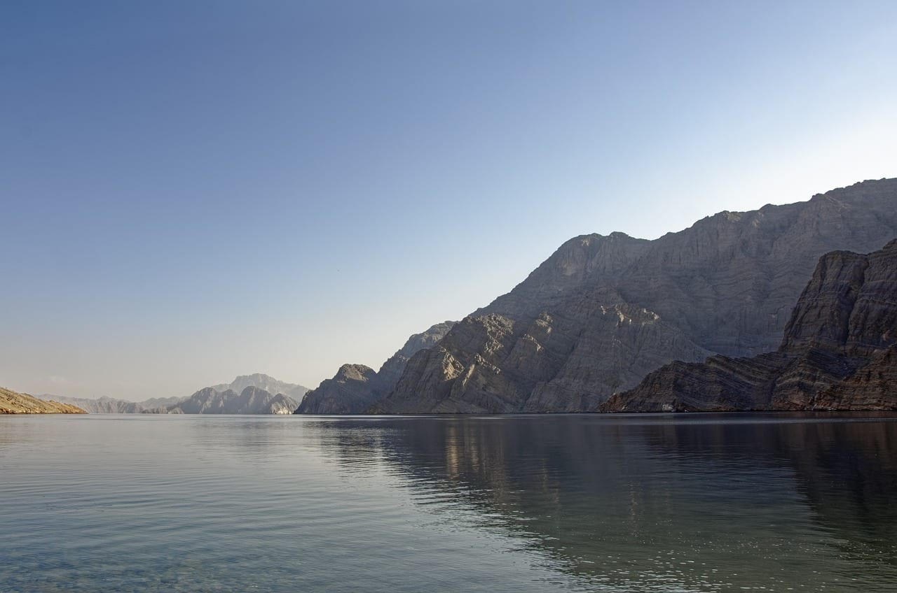
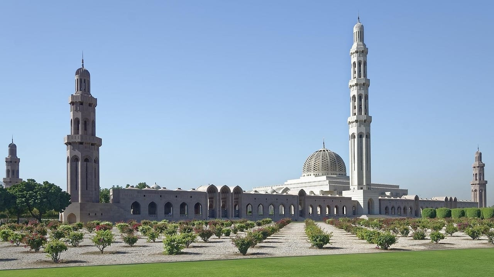
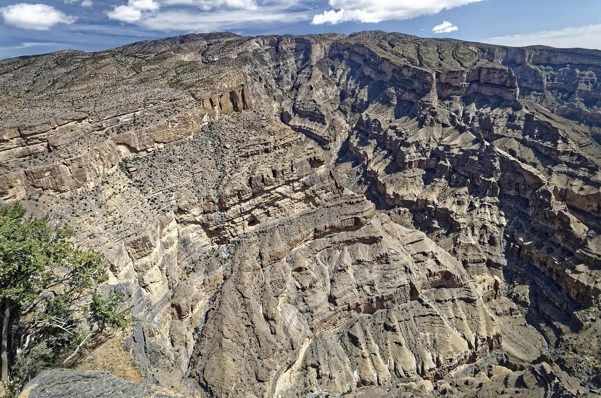
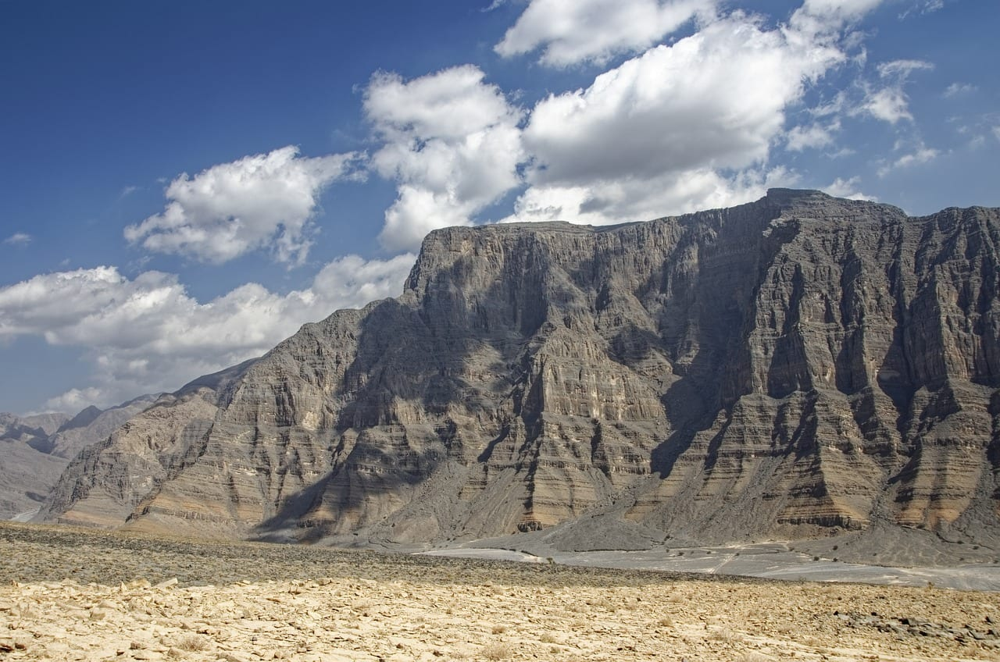
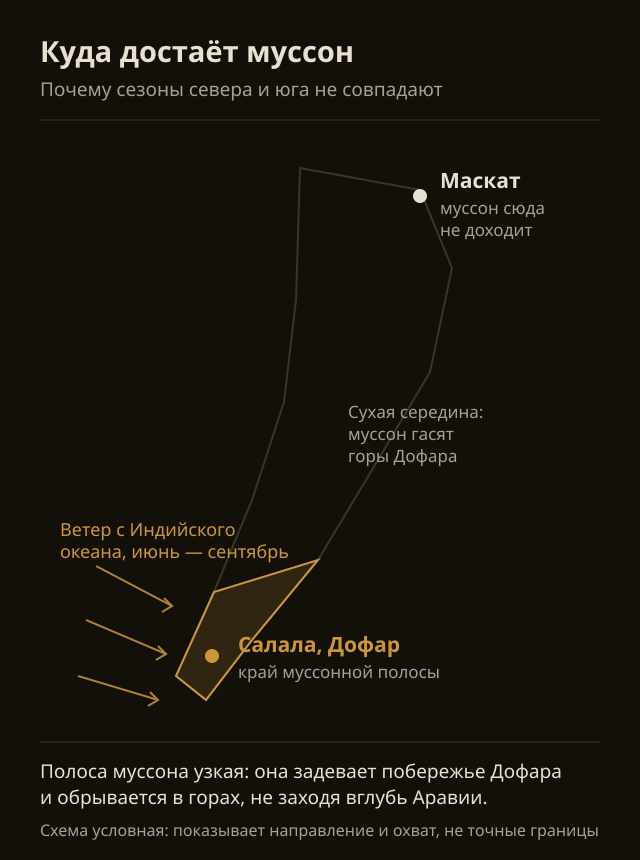
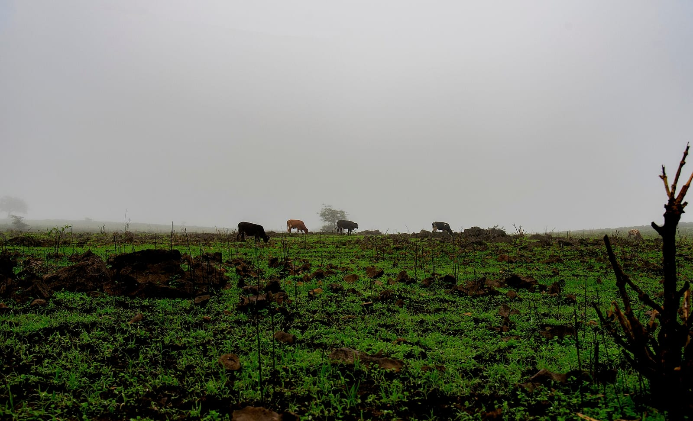
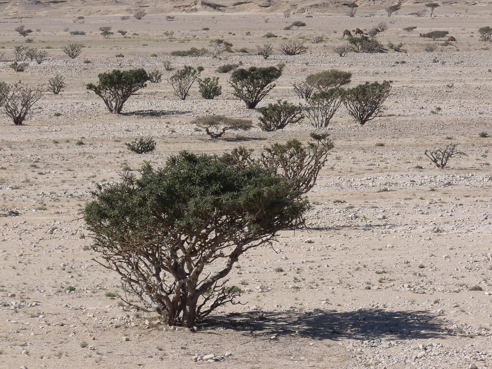
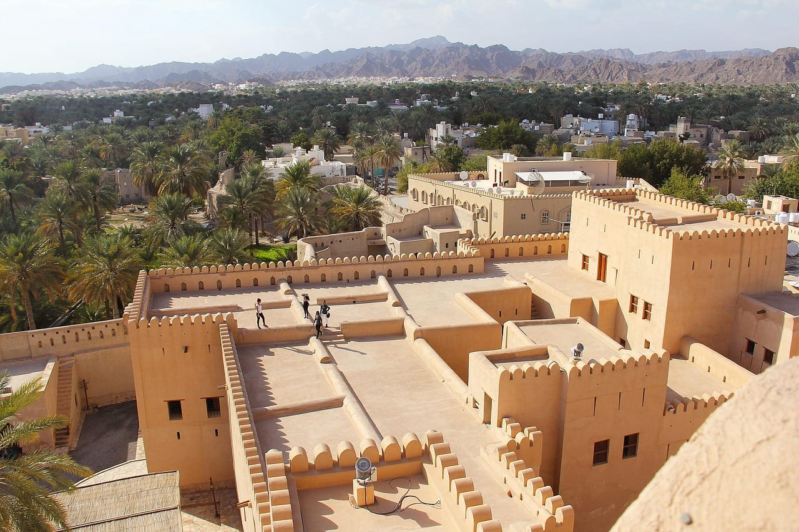
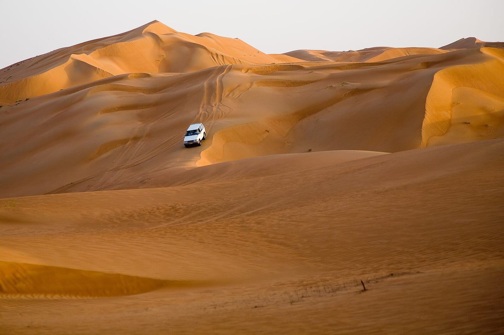

import AffiliateNote from '../../components/post/AffiliateNote.astro';
import { aviasalesRoute, cherehapaTravel } from '../../data/affiliate.js';

export const muscatFlight = aviasalesRoute('MOW', 'MCT', 'oman_2026_flight', 10);
export const insurance = cherehapaTravel('oman_2026_insurance');

Про Оман обычно спрашивают «когда там сезон», как будто сезон в стране один. Его два, и они не совпадают. Пока на севере закрывают окна от жары, на юге идёт муссон и зеленеют горы; когда на юге кончается зелень, на севере начинается лучшее время года.

Это не тонкость для знатоков. От того, в какую половину страны вы летите, зависит, поедете вы в ноябре или в июле — разница в полгода.

> **Если коротко:** **Маскат, горы и пустыня — с ноября по март.** Дневная норма в это время 25–29 °C, а с мая по сентябрь она держится на 36–39 °C, и никакой кондиционер не делает прогулку по форту приятной. **Салала на юге — отдельная история:** в июле её дневная норма 29 °C, то есть летом там прохладнее, чем в Маскате в любой месяц с апреля по октябрь. Плата за это — дожди и туман: 12 дождливых дней в июле против одного в январе. Хотите пляж и сушь — Салала зимой, хотите зелёные горы — Салала летом, хотите форты, вади и дюны — север зимой. Совместить север и юг в одну поездку можно: между ними полтора часа перелёта, у SalamAir витринное «от 29 риалов» (около 6 500 ₽ по курсу Банка России на 5 сентября 2026 года), и это заменяет сутки за рулём. <a href={muscatFlight} class="aff-cta" rel="sponsored">Посмотреть перелёт Москва — Маскат</a> — Aviasales откроет маршрут с датой в ноябре, свои дни подставьте сами.

<AffiliateNote />

## Почему у Омана два сезона, а не один

Страна вытянута на полторы тысячи километров с севера на юг, и её южная провинция Дофар попадает под край индийского муссона. Тот же ветер, что заливает дождями Индию и Шри-Ланку, задевает побережье вокруг Салалы — местные называют это время «хариф».

Севера муссон не касается вовсе. Маскат, горы Хаджар и пустыня Вахиба живут по обычному аравийскому календарю: сухо круглый год, зимой тепло, летом невыносимо.

Вот нормы по двум точкам.

| Месяц | Маскат, днём | Маскат, осадки | Салала, днём | Салала, осадки |
|---|---|---|---|---|
| Январь | 25 °C | 13 мм, 3 дня | 27 °C | 5 мм, 1 день |
| Февраль | 26 °C | 8 мм, 1 день | 27 °C | 1 мм, 1 день |
| Март | 29 °C | 11 мм, 2 дня | 29 °C | 15 мм, 2 дня |
| Апрель | 34 °C | 9 мм, 1 день | 31 °C | 9 мм, 2 дня |
| Май | 38 °C | 1 мм, 0 дней | 32 °C | 98 мм, 4 дня |
| Июнь | 39 °C | 0 мм, 0 дней | 31 °C | 30 мм, 8 дней |
| Июль | 38 °C | 8 мм, 1 день | 29 °C | 58 мм, 12 дней |
| Август | 37 °C | 0 мм, 0 дней | 28 °C | 25 мм, 9 дней |
| Сентябрь | 36 °C | 0 мм, 0 дней | 29 °C | 26 мм, 8 дней |
| Октябрь | 34 °C | 15 мм, 1 день | 30 °C | 28 мм, 3 дня |
| Ноябрь | 29 °C | 6 мм, 1 день | 30 °C | 6 мм, 2 дня |
| Декабрь | 26 °C | 12 мм, 1 день | 28 °C | 3 мм, 1 день |

Главное в этой таблице — не отдельные числа, а размах. У Маската между январём и июнем разница в 14 градусов, у Салалы между самым тёплым месяцем и самым прохладным — пять. Север живёт с ярко выраженной зимой и летом, юг почти не меняется по температуре, зато меняется по воде с неба.

## Север: почему сезон именно с ноября по март

С ноября по март в Маскате днём 25–29 °C. В такую погоду работает всё, ради чего в Оман и едут: форты, старые кварталы, каньоны, ночёвка в дюнах.

В апреле норма поднимается до 34 °C, в мае до 38 °C. Это не «жарко, но терпимо»: в такую температуру прогулка по открытому форту перестаёт быть прогулкой, а поход по вади становится вопросом выносливости, а не удовольствия.

Что именно даёт север в свой сезон:

- **Форты и старые города.** Низва, Бахла, Нахль — глиняные крепости, вокруг которых выросли города. Ходить по ним нужно днём, то есть в самое жаркое время суток.
- **Горы Хаджар.** Джебель-Шамс с километровым обрывом, Джебель-Ахдар с террасами. Наверху всегда на 8–10 градусов холоднее, чем внизу, и зимой ночью там бывает около нуля — тёплые вещи в списке обязательны.
- **Вади.** Ущелья с водой в глубине: Шаб, Бани-Халид, Тиви. Купание в пресной воде среди скал — то, чего в соседних эмиратах нет.
- **Пустыня Вахиба.** Ночёвка в лагере среди дюн. Зимой ночью прохладно, летом песок не остывает и к ночи.

Отдельно про Мусандам — это анклав на севере, отрезанный от остальной страны территорией эмиратов. Туда ходят на лодке-доу по фьордам, и добираться туда логичнее из Дубая, а не из Маската.

От себя: в Омане я был — Маскат и снорклинг у побережья. Это к вопросу о том, зачем ехать сюда, когда рядом Эмираты: здесь смотрят не город, а страну, и часть её — под водой.

## Юг: что такое хариф и кому он подходит

С июня по сентябрь на побережье Дофара приходит муссонная морось. В июне дневная норма ещё 31 °C, с июля по сентябрь она опускается до 28–29 °C, воздух становится влажным, склоны вокруг Салалы зеленеют, а с гор идут временные водопады.

Для Аравийского полуострова это уникально: больше нигде на нём летом не бывает зелёных гор. Именно поэтому в июле и августе в Салалу летят жители Персидского залива — для них это спасение от 45 градусов дома.

Но честно про плату. В июле норма — 58 мм осадков и 12 дождливых дней из 31. Это не тропический ливень на полчаса, а затяжная морось с туманом; море в это время неспокойное, и пляжный отдых в привычном смысле отменяется. Едут смотреть на зелень, а не лежать у воды.

Про число дождливых дней стоит сказать точнее, потому что цифры гуляют. В таблице выше днём с осадками считается тот, где выпало не меньше миллиметра. Морось хариф часто до этого порога не дотягивает, хотя небо серое и мокро с утра до вечера, — поэтому счёт «пасмурных и сырых» дней выходит заметно больше, чем счёт дней с измеримым дождём. В нашем [визовом разборе Омана](/visa/oman/) для августа названо двадцать с лишним таких дней: это не другое лето, а другой способ считать.

Зимой в Салале всё наоборот: 27–28 °C, сухо, море спокойное. Зелень к декабрю выгорает — склоны становятся такими же жёлто-серыми, как везде на юге Аравии.

Так что вопрос «когда ехать в Салалу» распадается надвое:

- **Нужна зелень и водопады** — июль и август. Готовьтесь к сырости, туману и закрытому морю.
- **Нужны пляж, сушь и солнце** — с ноября по март. Зелени не будет.

## Какой месяц выбрать под свою задачу

| Что вам нужно | Когда ехать | Чем платите |
|---|---|---|
| Форты, вади, пустыня, горы | Ноябрь — март | Пик спроса, в Новый год дороже всего |
| Пляж без жары | Ноябрь — март, север или юг | То же |
| Зелёные горы Дофара | Июль — август, только Салала | Морось, туман, неспокойное море |
| Меньше людей, сносная погода | Ноябрь и март | Днём около 29–30 °C |
| Дешевле всего | Май — сентябрь на севере | 36–39 °C днём, осмотр почти невозможен |

Ноябрь и март — компромисс, о котором стоит подумать отдельно. В оба месяца в Маскате около 29 °C: это выше, чем в разгар зимы, но заметно ниже апрельских 34 °C. Людей меньше, чем в новогодние недели.

## Как совместить север и юг

Между Маскатом и Салалой около тысячи километров пустой дороги. Проехать её можно, и этим маршрутом ходят те, кто едет на машине через пески Руб-эль-Хали, но это полноценные сутки за рулём в один конец.

Альтернатива — внутренний перелёт: около полутора часов, у SalamAir на витрине маршрута стоит «от 29 риалов». По курсу Банка России на 5 сентября 2026 года риал стоит 225,19 ₽, то есть это около 6 500 ₽ — но помните, что витринное «от» относится к самым дешёвым датам и в высокий сезон оно другое.

Практический вывод: если поездка короче недели, выбирайте одну половину страны. Север и юг в пять дней складываются только за счёт перелётов туда-обратно, и половина этих дней уйдёт на дорогу.

## Что пишут те, кто был

Я посмотрел раздел «Оман отдых отзывы» на форуме Винского 6 сентября 2026 года: в нём 55 тем с отчётами о поездках. Это выборка людей, которые пишут длинные отчёты, представительной её считать нельзя — но она отвечает на вопрос, который не закрывают ни нормы, ни путеводители: когда туда ездят на самом деле.

Сезон назван прямо в 21 заголовке из 55. Раскладка получается такая: зима — 12 тем, весна — 5, осень — 4, лето — 1.

Показательнее не сам перевес зимы, а состав летних тем. Их четыре, если считать вместе с теми, где месяц назван внутри: «Салала летом (когда всё зелёное)», «Султанат Оман: хариф и Рамадан», «Четыре дня в Омане. Июль 2022» и отчёт о поездке с палаткой в сентябре. То есть в жаркую половину года люди едут либо на юг за зеленью, либо коротко и с оговорками.

Зимние отчёты выглядят иначе — это маршруты по всей стране: «На машине по Большому Кольцу Омана. Декабрь 2021», «Январский Оман 2023. Горы, вади. С детьми», «Оман. 5 дней на машине вокруг Маската. Февраль 2025». Чужой опыт совпал с тем, что показывают нормы, и это самый честный аргумент в пользу зимней поездки: так поступают те, кто съездил до вас.

## Что стоит знать до покупки билетов

**Про документы.** Виза россиянам не нужна: пускают по загранпаспорту на 30 дней за въезд, суммарно не больше 90 дней в календарном году, паспорт должен действовать шесть месяцев на момент выезда. Подробности — в нашем [разборе визового режима Омана](/visa/oman/). Оговорка про свежесть: 6 сентября 2026 года ни портал Королевской полиции Омана, ни консульский портал МИД России нужный раздел не отдали — оба вернули ошибку, поэтому сверить срок у ведомства в этот день не вышло. Перед поездкой откройте [портал виз Омана](https://evisa.rop.gov.om/en/home) сами: правила въезда меняются быстрее, чем любая статья.

**Про алкоголь и одежду.** Оман строже соседних эмиратов. Алкоголь продаётся в лицензированных барах при отелях, не в магазинах. На улице и в деревнях уместна закрытая одежда — плечи и колени; на курортном пляже требования мягче, но это территория отеля, а не общая норма.

**Про страховку.** Медицина в Омане платная и недешёвая, а половина маршрутов — это горы и пустыня в стороне от больниц. <a href={insurance} class="aff-cta" rel="sponsored">Подобрать полис на Черехапе</a> — сервис сравнивает предложения российских страховых, оплата картой РФ, полис приходит в PDF.

**Про машину.** Без своей машины север не работает: форты, вади и дюны разбросаны, общественного транспорта между ними по сути нет. Дороги хорошие, но съезды к вади и в дюны требуют полного привода — обычная легковая там застревает.

## Кому в Оман не надо

Скажу прямо, потому что это дороже, чем кажется по картинкам.

- **Тем, кто едет только за пляжем.** Пляжный отдых здесь есть, но он дороже египетского и беднее по инфраструктуре. Смысл Омана — в горах, фортах и пустыне, а не в шезлонге.
- **Тем, кто не готов садиться за руль.** Экскурсионные группы по стране редки, а такси между регионами разоряет.
- **Тем, кто хочет ночной жизни.** Её тут почти нет — это сознательный выбор страны, а не недоработка.
- **Тем, кто едет летом на север.** 38–39 градусов в мае–августе делают осмотр невозможным, а дешёвый билет в это время — не выгода, а ловушка.

## Частые вопросы

**Когда в Омане лучший сезон?**
Для севера — с ноября по март: днём 25–29 °C. Для Салалы на юге сезонов два: июль и август, если нужна зелень муссона, и ноябрь–март, если нужны сушь и спокойное море.

**Правда, что летом в Салале прохладно?**
Да, по норме за 2015–2024 годы в июле там 29 °C днём — прохладнее, чем в Маскате в любой месяц с апреля по октябрь. Но вместе с прохладой приходят 12 дождливых дней в месяц и туман.

**Стоит ли ехать в Оман в апреле?**
Апрель — переходный месяц: в Маскате норма поднимается до 34 °C. Горы ещё терпимы, побережье и пустыня — на грани. Если выбор между апрелем и мартом, берите март.

**Можно ли увидеть и Маскат, и Салалу за неделю?**
Технически да, через внутренний перелёт около полутора часов. Но в неделю это укладывается плохо: тысяча километров между ними и перелёты съедят половину времени. Короткая поездка — одна половина страны.

**Чем Оман отличается от ОАЭ?**
Тем, что там смотрят не города, а страну: горы, ущелья с водой, глиняные форты, пустыню. Небоскрёбов и больших торговых центров здесь почти нет, а правила по алкоголю и одежде строже. Если нужен контраст с [поездкой в Эмираты](/blog/uae-guide-2026/) — это он и есть.

Если Оман кажется слишком сложным для первой дальней поездки, посмотрите разбор [когда лучше ехать в Египет](/blog/egypt-guide-2026/): там сезонная логика проще, а перелёт короче. А если хочется той же связки «горы плюс пустыня», но с европейским перелётом, — есть [разбор поездки в Марокко](/blog/morocco-guide-2026/), устроенный по такому же принципу.
