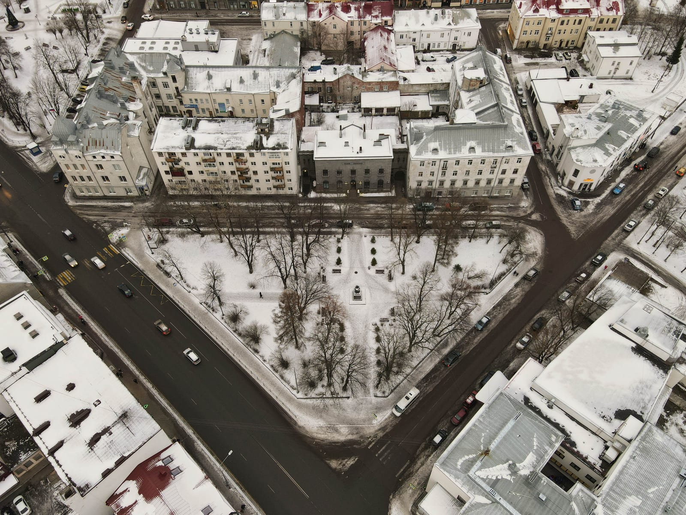
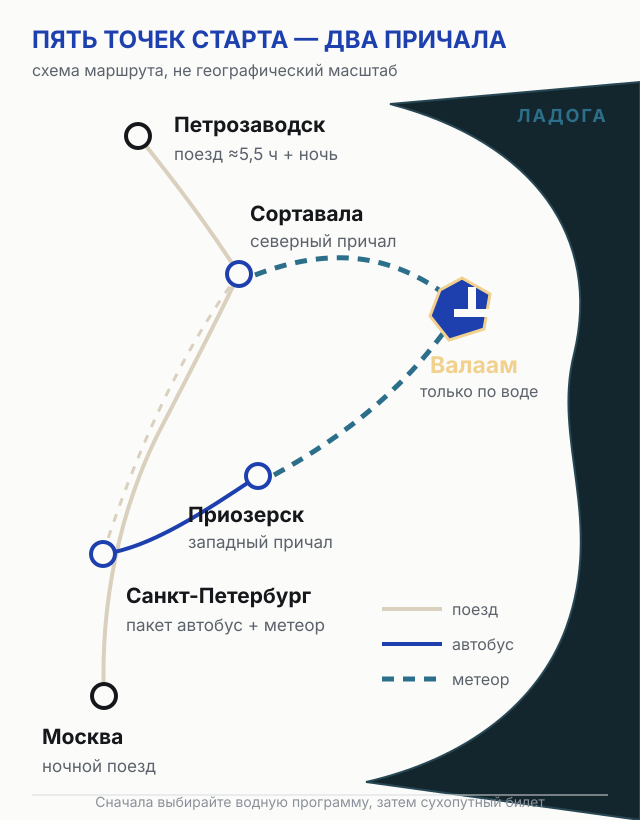
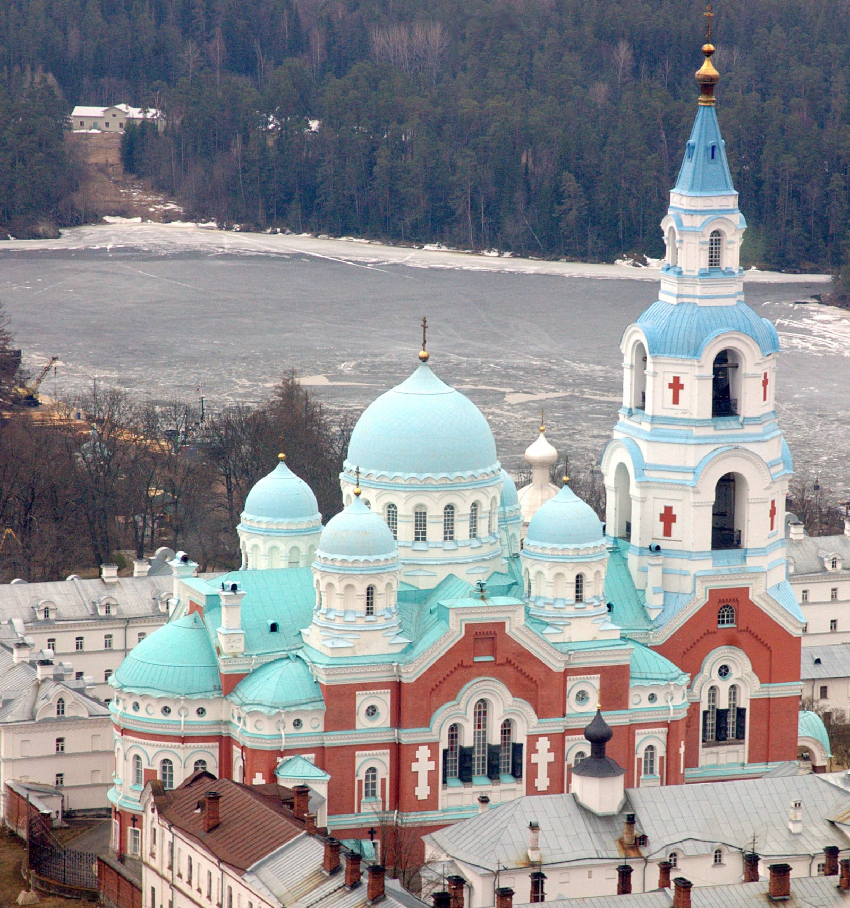
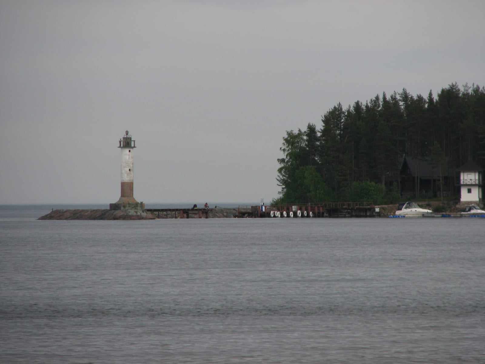
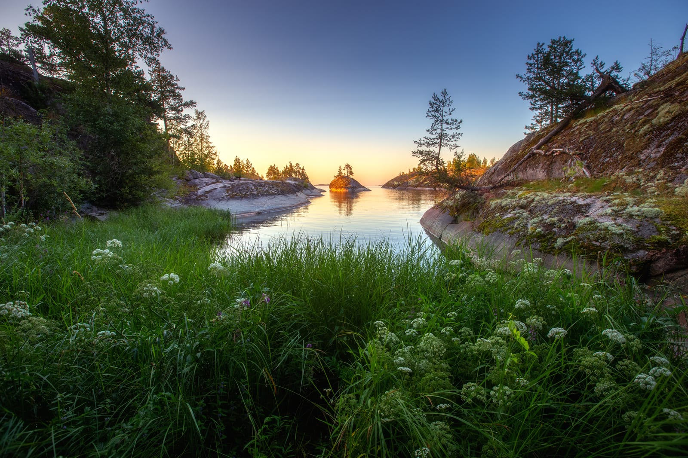

import AffiliateNote from '../../components/post/AffiliateNote.astro';
import { sutochnoRegion } from '../../data/affiliate.js';

До Валаама нет дороги: последний отрезок в любом маршруте проходит по Ладоге. Самостоятельность здесь означает собрать три звена — поезд или автобус до причала, заранее забронированное место на судне и обратную стыковку с запасом на погоду.

> **Если коротко:** для поездки из Москвы или Петрозаводска удобнее ночевать в **Сортавале** и выходить на Валаам утром. Из Петербурга на один день проще взять официальную автобусно-водную программу через **Приозерск**. На 3 сентября программа из Сортавалы стоит **6 030 ₽ без обеда** или **от 6 930 ₽ с обедом**, из Приозерска — **от 9 000 ₽**, из Петербурга — **от 11 500 ₽ при покупке двух мест**. Утренняя программа из Сортавалы занимает 7,5 часа, на острове остаётся около пяти. Рейс зависит от Ладоги; после возвращения закладывайте минимум три часа до поезда.

<AffiliateNote />

---

## Какой маршрут выбрать

| Старт | Рабочая связка | Когда ночевать | Где ломается план |
|---|---|---|---|
| **Сортавала** | Причал → метеор → Валаам | Накануне раннего рейса | Утренний поезд может прийти почти к отправлению судна |
| **Приозерск** | Причал → метеор → Валаам | Накануне, если вы без машины | Большинство программ начинается утром |
| **Санкт-Петербург** | Автобус оператора → Приозерск → метеор | Не нужна для пакетной однодневки | День занимает около 12 часов, свободного времени мало |
| **Москва** | Ночной поезд → Сортавала → поздний утренний метеор | Нужна, если нет запаса хотя бы час | Поезд № 160В в начале сентября приходит около 08:25, ранняя программа начинается почти сразу |
| **Петрозаводск** | Поезд → Сортавала → ночь → метеор | Нужна | Дневной поезд идёт около 5,5 часа и приходит вечером |

Самый управляемый вариант — **Сортавала с ночёвкой до и после острова**. Он дороже на стоимость жилья, зато не заставляет связывать поезд, метеор и обратный поезд в одну цепочку. <a href={sutochnoRegion('https://sortavala.sutochno.ru/', 'ostrov_valaam_2026')} class="aff-cta" rel="sponsored">Найти жильё в Сортавале</a> смотрите расстояние до причала и условия отмены до оплаты.

---

## Схема маршрутов из пяти городов

На схеме две водные точки: **Сортавала** на северном берегу и **Приозерск** на западном. Петербургская однодневная программа идёт автобусом до Приозерска; Москва и Петрозаводск логичнее связаны с Сортавалой. Круиз из Москвы или Петербурга — другой продукт: он решает вопрос дороги, но не запрос о самостоятельной однодневке.

---

## Как добраться из Сортавалы

На 3 сентября в [живом каталоге однодневных программ](https://valaam.com/ru/odnodnevnye.html) доступны отправления из Сортавалы с 8 мая по 30 сентября. У отдельной программы даты могут быть уже, поэтому проверяйте не общий календарь, а карточку своего рейса.

[Утренняя программа](https://valaam.com/ru/iz-sortavala-na-valaam-za-1-den1/iz-sortavala-na-valaam-na-meteore-09-00.html) расписана с 09:00 до 16:30: переход по Ладоге занимает около 1 часа 15 минут в каждую сторону, на острове — около пяти часов. В опубликованную сумму входят судно, две экскурсии и обед.

Поезд № 160В из Москвы в начале сентября приходит в Сортавалу около 08:25. Стыковать его с отправлением в 09:00 нельзя: оператор требует быть на причале за 30 минут, то есть почти в момент прибытия поезда. Выбирайте программу на 11:00 или 12:45, если она доступна в ваш день, либо приезжайте накануне.

---

## Как добраться из Приозерска и Петербурга

Из Приозерска официальный оператор продаёт программу примерно на восемь часов, из них пять проходят на острове. В каталоге на дату проверки она стоит **от 9 000 ₽**. Утреннее отправление делает вариант удобным для машины и неудобным для электрички из Петербурга в тот же день; автомобиль оставляют на платной охраняемой стоянке у причала, на остров его не перевозят.

Из Петербурга есть готовая связка **автобус + метеор через Приозерск**. Она занимает около 12 часов. Базовый тариф в мае, сентябре и летние будни — **11 900 ₽**, при одновременной покупке двух мест — **11 500 ₽ с человека**; сбор заявлен в 08:15, в отдельные дни — в 06:30. Это выбор для однодневки без самостоятельного поиска стыковок. Цена выше, а день жёстко привязан к группе.

Если хочется гулять без автобусного плеча и длинной групповой программы, езжайте поездом в Сортавалу накануне. Это добавляет ночь, но даёт выбор утренних рейсов и меньше точек отказа.

---

## Как добраться из Москвы

Рабочая связка — ночной поезд до Сортавалы и метеор не раньше позднего утра. В расписании на начало сентября поезд № 160В идёт около 16 часов и прибывает примерно в 08:25. Время меняется по датам: сначала выберите водную программу, затем проверяйте поезд на сайте РЖД или в [Яндекс Расписаниях](https://rasp.yandex.ru/all-transport/moscow--sortavala).

Обратный поезд в день Валаама — плохая экономия на ночи. Официальная памятка просит оставлять после программы не меньше трёх часов: судно может задержаться из-за волнения, а путь между бухтой и причалом отправления меняется. Надёжная схема — ночь в Сортавале после острова и поезд на следующий день.

---

## Как добраться из Петрозаводска

Прямого водного рейса из Петрозаводска в текущем каталоге Валаамского монастыря нет. Сначала нужно попасть в Сортавалу. На 3 сентября [дневной поезд Петрозаводск — Сортавала](https://rasp.yandex.ru/train/petrozavodsk--sortavala) отправляется около 13:50, идёт примерно 5 часов 30 минут и приходит вечером. На метеор того же дня он не успевает.

План состоит из двух дней: поезд и ночь в Сортавале, затем Валаам. Автобус может дать другое время, но его тоже проверяют на конкретную дату после покупки водной программы, а не наоборот.

---

## Сколько стоит поездка в 2026 году

Ниже — опубликованные цены на одного взрослого **только за программу оператора**. Поезд, гостиница, еда вне программы и личные расходы в них не входят.

| Откуда | Цена на 03.09.2026 | Что проверить перед оплатой |
|---|---:|---|
| Сортавала, сентябрь без обеда | **6 030 ₽** | Есть ли дата в живом календаре |
| Сортавала, май и сентябрь с обедом | **6 930 ₽** | Есть ли дата в живом календаре |
| Сортавала, будни июня–августа | **7 700 ₽** | Время отправления и бухта возврата |
| Сортавала, выходные и праздники июня–августа | **8 100 ₽** | Состав программы и питание |
| Приозерск | **9 000–9 400 ₽** | День недели, время сбора и стоянка автомобиля |
| Санкт-Петербург | **11 500 ₽ за место при покупке двух; иначе от 11 900 ₽** | Точка посадки в автобус и длительность дня |

Страница природного парка по-прежнему называет платёж **200 ₽ за 2025 год**. Это не доказательство цены 2026 года, поэтому я не прибавляю его к смете. Текущую сумму смотрите в форме бронирования или уточняйте у оператора перед оплатой.

---

## Что успеете за пять часов на острове

Типовая однодневная программа соединяет центральную усадьбу со Спасо-Преображенским собором и маршрут по скитам. Пять часов — это экскурсия, переходы, обед и короткие паузы, а не пять часов свободной прогулки.

Важная география: метеор обычно приходит в Монастырскую бухту. Обратно в Сортавалу он уходит из Никоновской, в Приозерск — из Монастырской. Между бухтами по Главной монастырской дороге **6,5 км**. Точную точку обратного сбора сообщает гид — записывайте её сразу.

Свой велосипед на суда монастыря не принимают. Если хотите дойти до дальних скитов без группы, планируйте ночёвку и заранее выясняйте, какой транспорт работает на острове в ваши даты.

---

## Когда ехать и что будет при шторме

Каталог 2026 года показывает однодневные поездки с 8 мая по 30 сентября. Это границы продаж на момент проверки, а не обещание рейса в любой день. После летней навигации регулярного пассажирского сообщения нет; зимой доступны отдельные организованные программы.

Оператор принимает решение об отмене по официальному гидрометеорологическому прогнозу. При отмене из-за шторма заявлен полный возврат по заявлению. Возврат денег не вернёт поезд или гостиницу, поэтому Валаам нельзя ставить на последний день поездки по Карелии.

На воде холоднее, чем в Сортавале: нужны непродуваемая куртка, дождевик и закрытая обувь. Если вас укачивает, подготовьте средство заранее и не выбирайте маленький катер ради экономии без проверки условий.

---

## Документы, связь, лекарства и правила монастыря

- **Документы.** Возьмите оригинал документа, на который оформлены поезд и водная программа, а также полис ОМС. Отдельного пропуска в официальной однодневной программе оператор не указывает.
- **Лекарства.** Аптеки на острове нет. Личные препараты и средство от укачивания везите с собой.
- **Связь.** В FAQ оператора перечислены МТС, Мегафон, Билайн и Tele2. Это не гарантия сигнала в каждой бухте, но старое утверждение, что Tele2 не работает, неверно.
- **Оплата.** У части программ работает онлайн-форма, у части заявка подтверждается через менеджера. На острове есть карточные терминалы, но оператор советует держать часть средств наличными.
- **Одежда.** В храмах и на территории скитов нельзя быть в шортах, короткой юбке, пляжной или спортивной одежде. Женщинам для храма нужны юбка ниже колена и покрытая голова; мужчины снимают головной убор.
- **Фото.** Не снимайте монашествующих и духовенство без разрешения. Правила любительской съёмки на территории строже обычного туристического места — сверяйтесь с указателями и словами гида.
- **Животные.** Официальные правила запрещают приезжать с домашними животными.

Обычная страховка путешественника для поездки по России не обязательна. Если покупаете её ради отмены или несчастного случая, проверьте, покрывает ли полис водный транспорт и срыв стыковки из-за погоды: эти риски часто описаны отдельно.

---

## Что пишут те, кто был

Я просмотрел **12 последних развернутых отзывов в Яндекс Картах** о Валаамском монастыре за период с мая 2025 по август 2026 года. Это добровольные отзывы, а не представительная выборка: чаще пишут люди с сильным впечатлением, и оценки нельзя переносить на всех посетителей.

Повторяются три сюжета. Природа, собор и хор получают больше всего похвалы. К однодневным программам претензия одна и та же: трёх–пяти часов мало, а крупные группы съедают свободное время. В критических отзывах также встречаются дорогая еда, толпы и ощущение коммерциализации. Практический вывод из массива — выбирать однодневку для первого знакомства, а ради тишины и дальних скитов оставаться на ночь. [Посмотреть исходные отзывы](https://yandex.com/maps/org/valaam_monastery/1045643005/reviews/).

---

## Однодневка или ночёвка

**Одного дня хватает**, если цель — увидеть собор, пройти официальную экскурсию и понять, хотите ли вы вернуться. Это маршрут с таймингом группы, обедом и коротким свободным окном.

**Ночёвка нужна**, если цель — дальние скиты, службы, прогулки без толпы или съёмка на утреннем и вечернем свете. Бронь жилья на острове проверяйте через официальный раздел размещения; городской отель в Сортавале не заменяет ночь на Валааме, но страхует дорожную стыковку.

Для первой поездки я бы выбрал Сортавалу, одну ночь до острова и одну после. Для жителя Петербурга без машины — пакет через Приозерск, если важнее уложиться в один день, чем гулять своим темпом.

---

## Частые вопросы

**Можно ли купить только билет на метеор без экскурсии?**
Да. Официальная служба просит бронировать только проезд по телефону; в киоски на причалах билеты попадают по остаточному принципу и могут закончиться. Цена такого билета в FAQ не опубликована.

**Сколько времени занимает дорога из Сортавалы?**
В утренней программе переход по воде занимает около 1 часа 15 минут в одну сторону. Для отдельных судов и погоды время меняется.

**Можно ли съездить на Валаам одним днём из Москвы?**
Физически — да, если ночной поезд приходит к позднему утреннему рейсу. Обратно в Москву в тот же вечер ехать рискованно: после острова нужен запас минимум три часа.

**Есть ли прямой маршрут из Петрозаводска?**
В официальном каталоге однодневных программ его нет. Рабочий путь идёт через Сортавалу с ночёвкой.

**Можно ли приехать зимой?**
Регулярного пассажирского сообщения нет. Нужна отдельная организованная программа, подтверждённая оператором на ваши даты.

**Сколько денег закладывать?**
Минимум на программу из Сортавалы в сентябре — 6 030 ₽ без обеда или 6 930 ₽ с обедом на взрослого по тарифам 3 сентября. Добавьте поезд, ночёвки в Сортавале, питание вне программы и актуальный платёж природного парка.

---

## Что почитать дальше

- [Карелия 2026: как собрать поездку по региону](/blog/kareliya-guide-2026/)
- [Горный парк Рускеала: билеты, поезд и время на маршруте](/blog/gornyy-park-ruskeala-2026/)
- [Остров Кижи: как добраться из Петрозаводска](/blog/ostrov-kizhi-2026/)
- [Карелия в августе: погода и сезонные ограничения](/trips/august/karelia/)
- [Калькулятор поездки](/calculator/)

---

*Цены, расписание и крайние даты навигации меняются. Перед оплатой откройте карточку своего рейса, а не общий рекламный список. Факты и стыковки проверены 3 сентября 2026 года. Нашли расхождение — напишите в [@traveltriberu](https://t.me/traveltriberu).*

*Фото: Ptahh / [Wikimedia Commons](https://commons.wikimedia.org/wiki/File:%D0%A1%D0%BF%D0%B0%D1%81%D0%BE-%D0%9F%D1%80%D0%B5%D0%BE%D0%B1%D1%80%D0%B0%D0%B6%D0%B5%D0%BD%D1%81%D0%BA%D0%B8%D0%B9_%D0%BC%D0%BE%D0%BD%D0%B0%D1%81%D1%82%D1%8B%D1%80%D1%8C_001.jpg) / CC BY-SA 4.0; Иерей Максим Массалитин / [Wikimedia Commons](https://commons.wikimedia.org/w/index.php?curid=7906510) / CC BY-SA 2.0; SadPetzl / [Wikimedia Commons](https://commons.wikimedia.org/w/index.php?curid=98630339) / CC BY-SA 4.0; metatron1 / [Wikimedia Commons](https://commons.wikimedia.org/w/index.php?curid=6725119) / CC BY-SA 2.0; Yuriy Stolypin / [Wikimedia Commons](https://commons.wikimedia.org/w/index.php?curid=130412047) / CC BY 4.0. Схема маршрутов — TravelTribe.*
