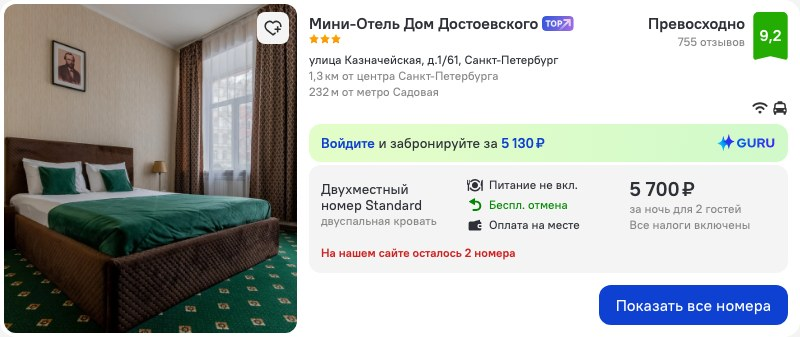
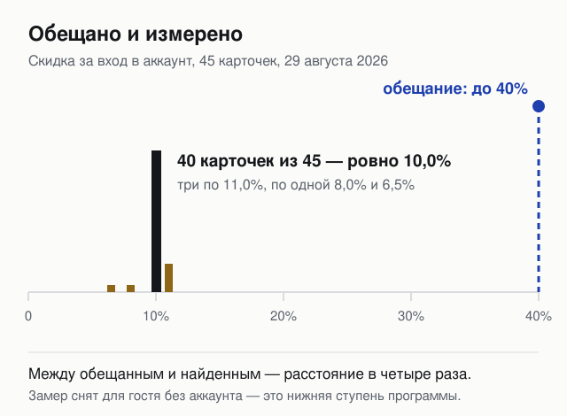

import AffiliateNote from '../../components/post/AffiliateNote.astro';
import { ostrovokCity, ostrovokSearch } from '../../data/affiliate.js';

Островок — не туроператор и не турагент. В юридической информации сервиса стоит ООО «Бронирование гостиниц» с основным кодом деятельности 63.11.1 — обработка данных и размещение информации, а по пункту 2.2 пользовательского соглашения компания названа **владельцем агрегатора информации** по Закону «О защите прав потребителей». Номер в реестре туроператоров ей не нужен, и его нет.

Отсюда главный вопрос, ради которого затевался замер. Главная страница обещает **«Скидки до 40% по программе лояльности ГУРУ»** и **«Без комиссии»**. 29 августа 2026 года я прошёл 60 карточек гостиниц в трёх городах на одну ночь и дошёл до шага оплаты — картина оказалась ровно наполовину такой, как обещает витрина.

> **Если коротко:** «без комиссии» — правда. Пункт 2.3 соглашения запрещает брать с гостя сборы, и на шаге бронирования сумма к оплате совпала с ценой карточки. «До 40%» — нет. Из **45 карточек**, где видны обе цены, у **40** разница между открытой ценой и ценой после входа в аккаунт составила **ровно 10,0%**, у трёх — 11,0%, крайние значения 6,5% и 8,0%. Сорока процентов не было ни разу. Процента скидки в правилах программы нет вовсе: по документу скидку даёт **отель**, и только там, где в описании стоит отметка GURU. Что действительно не входит в цену — **туристический налог и курортный сбор**: по Правилам сервиса они платятся при заселении, хотя на карточке написано «Все налоги включены».

<AffiliateNote />

## Кто сдаёт номер и кто за него отвечает

В юридической информации указано: ООО «Бронирование гостиниц», ИНН 7703389880, ОГРН 1157746695644, адрес — 127030, Москва, улица Новослободская, дом 16, помещение 1/1. Основной код ОКВЭД — **63.11.1**. Компания аккредитована как ИТ-организация, номер в реестре аккредитованных — **30103**.

Для гостя это не формальность. По пункту 2.4 соглашения, заказывая номер, вы вступаете в отношения **напрямую с отелем**, а сервис стороной договора не является и услугу размещения не оказывает. По пункту 2.5 он не отвечает за неточности в описании, **ценах** и фотографиях. Правила сервиса повторяют это прямее: всю информацию об отелях предоставили сами отели, и компания её не меняет, «являясь владельцем агрегатора информации».

Практический вывод: претензия к номеру — отелю, претензия к бронированию, оплате и возврату — сервису. Это ровно та развилка, из-за которой в отзывах спорят, кто виноват.

## «Без комиссии»: строки в чеке нет, и наценки тоже

Пункт 2.3 соглашения сформулирован без оговорок: оператор предоставляет доступ к сервису **на безвозмездной основе** и «не взимает с Заказчика никаких сборов, связанных с заказом Услуг, заключением договоров». Заработок компании лежит на другой стороне — по юридической информации она продаёт отелям доступ к своей программе Экстранет и рекламные услуги, а стоимость считает индивидуально.

Проверить обещание можно только одним способом — дойти до шага оплаты. 29 августа 2026 года я открыл карточки, перешёл к бронированию и сверил сумму:

| Город | Гостиница | Цена на карточке | Сумма к оплате |
|---|---|---|---|
| Москва | Cosmos Москва ВДНХ | 4 300 ₽ | 4 300 ₽ |
| Москва | Измайлово Гамма | 4 185 ₽ | 4 185 ₽ |
| Москва | Сафмар Аврора Люкс | 10 965 ₽ | 10 965 ₽ |
| Санкт-Петербург | Меблированные комнаты Дарумс | 4 708 ₽ | 4 708 ₽ |
| Санкт-Петербург | Мини-отель Дом Достоевского | 5 700 ₽ | 5 700 ₽ |
| Санкт-Петербург | Mercure Hotel and Residences | 5 310 ₽ | 5 310 ₽ |
| Санкт-Петербург | Коринтия Санкт-Петербург | 15 826 ₽ | 15 826 ₽ |
| Сочи | Mantera Resort & Congress | 14 620 ₽ | 14 620 ₽ |
| Сочи | GRAND KARAT SOCHI | 24 800 ₽ | 24 800 ₽ |

*Девять гостиниц, ночь 15–16 сентября 2026 года для двоих, замер 29 августа 2026 года. Ещё у четырёх объектов тариф был с оплатой на месте, и снять сумму строкой не вышло — они в таблицу не попали.*

Ни разу к цене ничего не добавилось: сумма на шаге бронирования равнялась цене на карточке. Отдельной строки «сервисный сбор» на этом шаге нет.

<a href={ostrovokCity('russia', 'sochi', 'ostrovok_hub_2026_body')} class="aff-cta" rel="sponsored">Проверить цену ночи в Сочи на свои даты</a> — цена в карточке уже с налогами, оплата картой российского банка, у части объектов бесплатная отмена.

## «Скидки до 40%»: замер 45 номеров

Обещание главной страницы звучит как «Скидки до 40% по программе лояльности ГУРУ». В самих Правилах программы **процентов нет ни одного** — ни сорока, ни каких-либо других. Документ говорит другое: «Бонусы и Скидки предоставляются Отелем исключительно в случае, если в описании Отеля в Сервисе есть отметка „GURU“», а размер зависит от уровня участника и «технических возможностей Отеля».

Уровней четыре, и присваиваются они по числу завершённых поездок: GURU 1 — 0–1 бронирование, GURU 2 — 2–3, GURU 3 — 4–11, GURU 4 — от 12 и больше.

Что видит человек без аккаунта, я замерил 29 августа 2026 года. Даты — ночь с 15 на 16 сентября 2026 года, двое гостей, три города, по 20 карточек в каждом. На части карточек рядом с открытой ценой стоит строка «Войдите и забронируйте за …» — это и есть скидка, которую сервис предлагает за регистрацию.

| Город | Гостиница | Номер | Открытая цена | После входа | Скидка |
|---|---|---|---|---|---|
| Санкт-Петербург | Дом Достоевского | Двухместный Standard | 5 700 ₽ | 5 130 ₽ | 10,0% |
| Санкт-Петербург | Коринтия Санкт-Петербург | Двухместный Standard | 15 826 ₽ | 14 243 ₽ | 10,0% |
| Санкт-Петербург | Апарт-отель Вало Бизнес | Двухместный Комфорт Классик | 3 960 ₽ | 3 645 ₽ | **8,0%** |
| Москва | The St. Regis Moscow Nikolskaya | Двухместный Мансардный | 27 000 ₽ | 24 300 ₽ | 10,0% |
| Москва | Измайлово Гамма | Двухместный Standard | 4 185 ₽ | 3 767 ₽ | 10,0% |
| Москва | Сафмар Аврора Люкс | Двухместный Делюкс | 10 965 ₽ | 9 869 ₽ | 10,0% |
| Сочи | Mantera Resort & Congress | Двухместный Стандарт с видом на море | 14 620 ₽ | 13 158 ₽ | 10,0% |
| Сочи | Централ Резиденс | Стандарт без окна | 3 155 ₽ | 2 808 ₽ | **11,0%** |
| Сочи | Грейс Наири | Двухместный Делюкс с кухней | 8 625 ₽ | 7 676 ₽ | **11,0%** |
| Сочи | AZIMUT Парк Отель Виноградная 4* | Двухместный Бизнес с балконом | 7 619 ₽ | 7 124 ₽ | **6,5%** |

*Ночь 15–16 сентября 2026 года для двоих, замер 29 августа 2026 года. Жирным отмечены все случаи, где скидка отличалась от десяти процентов: их во всей выборке пять из сорока пяти.*

Из 60 карточек обе цены показали **45**. Разброс скидки — от 6,5% до 11,0%, и он почти не разброс: **у 40 карточек из 45 ровно 10,0%**. Ещё три дали 11,0%, по одной — 8,0% и 6,5%.

Обещанных сорока процентов не встретилось ни разу. Это не значит, что их не бывает: мой замер показывает предложение для человека **без аккаунта**, то есть нижнюю ступень программы, а сколько даёт GURU 4, из документов не следует — правила процентов не называют. Но и обещание на главной ничем не оговорено, а «до 40%» и «ровно 10% в 40 случаях из 45» — разные обещания.

Отдельно сервис пишет про мобильное приложение: «Цены ниже, чем на сайте». Насколько ниже, на странице не сказано, и этого я не проверял.

## Что в цену не входит

На всех 60 карточках стоит строка **«Все налоги включены»**. Правила сервиса добавляют к ней важную оговорку: местным законодательством стран и их регионов «могут взиматься дополнительные налоги (туристический налог, курортный сбор и т.п.), подлежащие уплате Пользователем **дополнительно при заселении в Отель**».

Противоречия тут нет, но и очевидным это не назовёшь: «все налоги включены» относится к тому, что вошло в цену брони, а туристический налог платится на стойке и в сумму на сайте не попадает. На шаге бронирования одной из петербургских гостиниц это написано прямо: «Оплата налогов и сборов будет производиться в валюте отеля (RUB)».

Второй пункт, который стоит знать до оплаты, — **баллы**. Один балл равен одному рублю, но по пункту 5.7 правил программы баллами оплачивается **не больше 20% стоимости** брони. По пункту 5.8 их нельзя сложить с промокодом или другой скидкой, кроме скидки самой программы. По умолчанию баллы живут **год** с даты начисления.

## Отмена, возврат и удержание

Главное здесь — одна фраза из Правил сервиса: возможность отмены и «наступление последствий в виде полного или частичного удержания стоимости Бронирования зависят **исключительно от Отеля**» в соответствии с его политикой отмены. Компания за убытки от отмены в нарушение этой политики не отвечает.

Из этого следуют четыре практических вещи:

**Шкалы удержаний у сервиса нет.** Условия отмены устанавливает отель, они показываются при бронировании и попадают в ваучер. Единой таблицы «за столько-то дней удержат столько-то» не существует — у каждого объекта своя.

**Поддержка подключается после отмены, а не до неё.** Правила говорят, что просьбу уменьшить удержание служба поддержки может рассмотреть **только после того, как гость отменил бронирование**, и результата при этом не гарантирует. Порядок неочевидный: сначала отмена с потерей денег, потом просьба их вернуть.

**Деньги, отданные отелю напрямую, возвращает отель.** Компания возвращает только предоплату, внесённую на сайте. Требования по суммам, уплаченным на стойке, предъявляются самому отелю.

**Ошибка в цене может отменить бронь.** Правила прямо оставляют компании право отменить бронирование, если цена или другая информация в системе не совпала с фактической. Деньги в этом случае возвращают, но поездка остаётся без брони.

Есть и обратная норма, в пользу гостя: если отель не смог разместить, а гость отказался от предложенных вариантов и нашёл жильё сам, компания обязуется вернуть **изначально оплаченную стоимость** брони.

## Кому Островок не подходит

- **Тем, кто рассчитывает на сорок процентов.** Скидка за вход в аккаунт в замере — 10,0% в 40 случаях из 45; максимум, который встретился, — 11,0%.
- **Тем, кто не хочет заводить аккаунт.** Открытая цена на 45 карточках из 45 была выше цены после входа, и по правилам программы бронирование без авторизации вообще не засчитывается в уровень.
- **Тем, кому нужна предсказуемая отмена.** Шкалу удержаний задаёт отель, а не сервис, и до выбора конкретного тарифа её не видно.
- **Тем, кто планирует бюджет до рубля на месте.** Туристический налог и курортный сбор платятся при заселении сверх суммы, показанной на сайте.
- **Тем, кто копит баллы под крупную поездку.** Больше 20% стоимости брони ими не закрыть, с промокодом они не складываются, а при отмене с удержанием сгорают.

Кому подходит: тем, кто бронирует жильё в России и странах, куда карта российского банка проходит, ценит цену с налогами сразу в карточке и готов завести аккаунт ради десяти процентов.

<a href={ostrovokSearch('ostrovok_hub_2026_final')} class="aff-cta" rel="sponsored">Посмотреть цены на свои даты</a> — цена в карточке показывается с налогами, оплата картой российского банка, у части объектов бронь без предоплаты.

Как устроена денежная сторона у соседей по рынку, разобрано в статьях о том, [что берёт с брони Яндекс Путешествия](/blog/yandex-puteshestviya-kak-rabotaet-2026/), [сколько платит площадке хозяин квартиры на Суточно.ру](/blog/sutochno-ru-2026/) и [какие сборы берёт Авиасейлс](/blog/aviasales-2026/).

## FAQ — частые вопросы про Островок

**Берёт ли Островок комиссию с гостя?**
Нет. Пункт 2.3 пользовательского соглашения в редакции от 16 июля 2026 года говорит, что оператор предоставляет доступ к сервису на безвозмездной основе и не взимает с заказчика никаких сборов. Замер 29 августа 2026 года это подтвердил: на шаге бронирования сумма к оплате совпала с ценой карточки, отдельной строки сбора нет.

**Правда ли, что скидка доходит до 40%?**
В замере — нет. Из 45 карточек с двумя ценами у 40 разница составила ровно 10,0%, у трёх — 11,0%, крайние значения 6,5% и 8,0%. В Правилах программы GURU процент скидки не назван вообще; по документу её даёт отель и только там, где в описании стоит отметка GURU.

**Почему цена после входа в аккаунт ниже?**
Так работает программа лояльности: скидку предоставляет отель участнику программы. Уровень зависит от числа завершённых поездок — GURU 1 при 0–1 бронировании, GURU 4 от 12 и больше. Бронирование без авторизации в личном кабинете в уровень не засчитывается.

**Входит ли курортный сбор в цену?**
Нет. Правила сервиса относят туристический налог и курортный сбор к дополнительным платежам, которые гость вносит при заселении в отель. Строка «Все налоги включены» на карточке относится к налогам в составе цены брони.

**Сколько удержат при отмене?**
Заранее из документов сервиса это не следует: последствия отмены зависят исключительно от отеля и его политики отмены, которая показывается при бронировании и указывается в ваучере. Единой шкалы у сервиса нет.

**Можно ли оплатить всю бронь баллами?**
Нет. По пункту 5.7 правил программы баллами оплачивается не больше 20% стоимости брони. Один балл равен одному рублю, срок жизни по умолчанию — год, с промокодами баллы не складываются, а при отмене с удержанием не возвращаются.

**Кто такой Островок юридически?**
ООО «Бронирование гостиниц», ИНН 7703389880, ОГРН 1157746695644, адрес: 127030, Москва, улица Новослободская, дом 16, помещение 1/1. Основной код ОКВЭД — 63.11.1, компания аккредитована как ИТ-организация под номером 30103. Туроператором или турагентом она не является.

**Кому предъявлять претензию, если номер оказался не таким, как на фото?**
Отелю. По пункту 2.4 соглашения договор об оказании услуг заключается напрямую с ним, а по пункту 2.5 сервис не отвечает за неточности в описании, ценах и фотографиях, поскольку не меняет информацию, которую отель разместил.

*Скриншоты сервиса сняты нами 29 августа 2026 года. Цены 60 карточек в Москве, Санкт-Петербурге и Сочи сняты 29 августа 2026 года на ночь 15–16 сентября для двоих гостей и меняются в течение дня; условия — по пользовательскому соглашению, Правилам сервиса и Правилам программы GURU на ту же дату. Материал описывает условия документов сервиса и не заменяет юридическую консультацию.*
