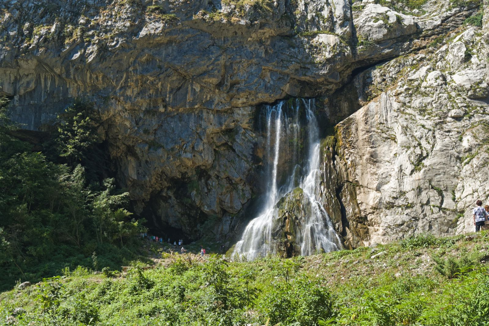

import AffiliateNote from '../../components/post/AffiliateNote.astro';
import PricingCards from '../../components/post/PricingCards.astro';
import { TP_LINKS } from '../../data/affiliate.js';

Озеро Рица — та самая бирюзовая открытка, ради которой едут вглубь Абхазии: горное озеро на высоте 950 метров, зажатое между поросшими лесом хребтами. Сама дорога к нему — половина впечатления: серпантин вдоль реки Бзыбь, Голубое озеро у обочины и каньон с отвесными стенами. Разбираю по делу: сколько стоит вход в 2026 году, как добраться без своей машины и что посмотреть по пути, чтобы не проехать мимо главного.

> **Если коротко:** Рица — горное озеро в Рицинском реликтовом нацпарке, **вход с 1 мая 2026 — 1000 ₽** с взрослого (дети 8–12 — 500 ₽, до 8 лет бесплатно). **Общественного транспорта нет**: добираются на экскурсии (от ~900 ₽/чел), джип-туре, такси (~6000 ₽ из Гагры) или своей машине. От Гагры — **55 км и 1–1,5 часа** по серпантину. По дороге — Голубое озеро и Юпшарский каньон; рядом — Гегский водопад, дача Сталина и Молочный водопад. Ехать лучше **с мая по октябрь**: зимой дорогу выше Рицы переметает.

<AffiliateNote />

---

## Что такое озеро Рица и почему туда едут?

**Рица — самое известное и одно из самых глубоких озёр Абхазии, главная природная достопримечательность страны.** Лежит на высоте 950 метров над уровнем моря, в ущелье, где сливаются реки Лашипсе и Юпшара; наибольшая глубина — 116 метров, длина около 2,5 км ([посольство Республики Абхазия](https://emb-abkhazia.ru/turizm_i_otdyh/ozero_rica/)).

Озеро молодое: оно образовалось, когда горный обвал перегородил реку и вода заполнила котловину. Отсюда фирменная черта Рицы — **цвет, который меняется по сезону**: весной и летом, когда в воде много мелкой взвеси и планктона, она зеленовато-бирюзовая; к зиме вода светлеет и становится холодно-синей.

Едут сюда за двумя вещами сразу — за самим озером и за дорогой к нему. Маршрут проходит через Рицинский реликтовый национальный парк: реликтовые леса, ущелья, водопады и пара озёр поменьше. Это не пляжный отдых, а выезд на полный день из Гагры или Пицунды — горы, прохлада и виды вместо моря.

Если ещё только решаете направление в целом — отдельно разобрал, [стоит ли ехать в Абхазию 2026](/blog/abkhazia-2026/): безопасность, документы, цены и честные отзывы.

---

## Сколько стоит вход на Рицу в 2026 году?

**Озеро находится на территории заповедника, поэтому за въезд берут экологический сбор. С 1 мая 2026 года тариф вырос.** Цены утвердил Кабинет министров Абхазии, они действуют для всех способов заезда — на экскурсии, такси или своей машине.

| Категория | Сбор в нацпарк 2026 |
|---|---|
| Взрослый | **1000 ₽** |
| Дети 8–12 лет | **500 ₽** |
| Дети до 8 лет | **бесплатно** |
| Граждане Абхазии, ветераны войн | бесплатно |

До 1 мая 2026 взрослый билет стоил 700 ₽, так что во многих старых отзывах и описаниях экскурсий цена ещё прежняя — на КПП ориентируйтесь на новую ([Апсныпресс, госагентство Абхазии, 30.03.2026](https://www.apsnypress.info/ru/home/novosti/item/19775-tseny-na-poseshchenie-ritsinskogo-natsionalnogo-parka-uvelichatsya-s-1-maya)).

**Важный момент про деньги:** сбор платят **наличными** на въезде, и это не единственная трата. Если едете самостоятельно, заложите ещё на парковку, перекус у озера (цены наверху выше прибрежных) и сувениры. Карты в Абхазии работают плохо везде, а в горах — тем более; как с этим жить, подробно в гайде [как платить за границей россиянам](/blog/pay-abroad-2026/) (для Абхазии правило простое: везите наличные рубли).

---

## Как добраться до озера Рица?

**Главное, что нужно знать заранее: общественного транспорта к Рице нет.** Ни автобуса, ни маршрутки до озера не ходит — добраться можно только на экскурсии, такси, джипе или своей машине. Дорога одна: поворот с приморской трассы сразу после моста через реку **Бзыбь**, дальше около 40 км горного серпантина вдоль реки до озера.

Расстояния и время в пути от основных курортов (на машине, без учёта остановок):

| Откуда | Расстояние | Время в пути |
|---|---|---|
| Гагра | 55 км | 1–1,5 ч |
| Пицунда | 59 км | 1–1,5 ч |
| Гудаута | 69 км | ~1,5 ч |
| Новый Афон | 85 км | 2–3 ч |
| Сухум | 110 км | 2–3 ч |
| Граница с РФ (Псоу) | 82 км | ~2 ч |
| Адлер | 93 км | 2,5–3 ч + граница |
| Сочи | 120 км | 3–3,5 ч + граница |

Цифры — ориентир по горной дороге; летом в выходные на серпантине и у Голубого озера бывают пробки из экскурсионных автобусов ([как добраться, edemgagra.ru](https://edemgagra.ru/dostoprimechatelnosti/ozero-ritsa-kak-dobratsya/)).

### Какой способ выбрать

<PricingCards tiers={[
 { tier: 'Экскурсия', featured: true, badge: 'Проще всего',
 price: 'от ~900 ₽/чел',
 priceNote: 'без своей машины',
 features: [
 'Группой на автобусе или джипе',
 'Заезжают на Голубое озеро и в каньон',
 'Не нужно платить за КПП отдельно — обычно входит',
 'Минус: график группы и толпа на точках',
 ] },
 { tier: 'Такси',
 price: '~6000–6500 ₽',
 priceNote: 'за машину туда-обратно',
 features: [
 'Свой темп и остановки',
 'Удобно компанией 3–4 человека',
 'Цену и ожидание оговаривайте заранее',
 'Сбор в нацпарк — отдельно',
 ] },
 { tier: 'Своя машина',
 price: '1000 ₽ + бензин',
 priceNote: 'максимум свободы',
 features: [
 'Едете когда хотите и где хотите',
 'Серпантин узкий — не для новичков за рулём',
 'К Гегскому водопаду легковая не проедет',
 'Аренда авто — заранее',
 ] },
]} />

Если не хотите сами водить и разбираться с логистикой, можно поехать по Абхазии с местным гидом в малой группе — Рица почти всегда в программе вместе с другими точками маршрута: <a href={TP_LINKS.youtravel} class="aff-cta" rel="sponsored">поехать по Абхазии с местным гидом</a> (маршрут и трансферы уже собраны, оплата картой РФ).

По отзывам путешественников, **главная развилка — групповой автобус против джипа или своей машины**. Автобус дешевле, но это весь день по чужому графику; самостоятельная поездка даёт время постоять там, где красиво, а не там, где остановили всех.

---

## Что посмотреть по дороге и рядом с Рицей

**Дорога к Рице — это маршрут с остановками, а не просто переезд.** Вот что встречается по пути и рядом, в порядке движения от трассы.

- **Голубое озеро (Адзиасцва)** — прямо у дороги, маленькое карстовое озеро насыщенного сине-бирюзового цвета. Глубина около 76 метров, вода холодная круглый год (~+10 °C) и не мутнеет даже в дождь. Остановка на 10–15 минут, дальше — сувениры и фототочки.
- **Юпшарский каньон («Каменный мешок»)** — около 8 км ущелья, где скалы поднимаются почти отвесно. Самое узкое место — **Юпшарские ворота**: стены сходятся, и небо превращается в полоску. Лучшая точка дороги после самого озера.
- **Гегский водопад** — мощный поток высотой около 70 метров (туристы оценивают пониже), в стороне от основной дороги. Сюда **легковая машина не проедет**: последний отрезок — грунтовка, проходимая только на внедорожнике или местном УАЗе. Зато весной водопад особенно полноводный. Кстати, именно здесь снимали сцену схватки Холмса с Мориарти у Рейхенбахского водопада в советском «Шерлоке Холмсе».
- **Дача Сталина** — у самого озера, на берегу. Скромная снаружи и аскетичная внутри, без позолоты; внутрь пускают за отдельную небольшую плату — любопытно тем, кому интересна история.
- **Молочный водопад** — недалеко от дачи, выше Рицы. Вода кажется белой, словно вспененное молоко, отсюда и название.
- **Малая Рица** — озеро поменьше и повыше (более 1200 м), к нему ведёт пеший подъём от большой Рицы. Туда добираются те, кому хочется тишины без толп.

Про Гегский водопад в отзывах пишут прямо и про красоту, и про дорогу:

> «Гегский водопад в мае — отрыв башки. Огромный поток с высоты, да ещё и с ледником — действительно круто» — *iamvoland2009, [Форум Винского](https://forum.awd.ru/viewtopic.php?t=268425)*.

> «Вы будете ехать над пропастью по камням и валунам. Если не боитесь за свою жизнь — езжайте на Гегский» — *блог [turzametka.com](https://turzametka.com/abxaziya-chto-stoit-posmotret/)*.

Это мнения путешественников, а не инструкция: дорогу к Гегскому осилит только подготовленная машина с опытным водителем, и в межсезонье съезд может быть закрыт.

---

## Когда лучше ехать на Рицу?

**Лучше всего — с мая по октябрь.** Летом на высоте заметно прохладнее, чем на побережье: даже в жару у воды свежо, а вечером и ночью в горах может быть около +10 °C. Берите кофту, даже если на пляже +30.

- **Весна (апрель–май):** меньше людей, водопады максимально полноводные после таяния снега. Минус — погода переменчивая, на высоте ещё может лежать снег.
- **Лето (июнь–август):** самый удобный сезон по дороге и погоде, но и самый людный — в выходные на серпантине и у Голубого озера толпы и пробки. Едьте пораньше с утра.
- **Бархатный сезон (сентябрь — начало октября):** прохладно, ясно, мало народу — пожалуй, лучшее время для экскурсий.
- **Зима:** дорогу выше Рицы переметает снегом, часть точек недоступна, а само озеро под серым небом выглядит угрюмо. Ехать стоит только ради зимних пейзажей и без гарантий, что пустят до конца.

Какие месяцы вообще лучшие для Абхазии в целом, с погодой и ценами по сезонам, — в гайде [стоит ли ехать в Абхазию 2026](/blog/abkhazia-2026/).

---

## Стоит ли Рица потраченного дня?

**Да, если ехать за природой и дорогой, а не за «вау» от самого озера.** В отзывах Рицу часто ругают именно за то, что вокруг неё выросла туриндустрия:

> «Рица не самое красивое. Слишком сильно испорчена цивилизацией — повсюду кафешки, музыка, толпы людей. Малая Рица гораздо более глубокий отпечаток оставила» — *iamvoland2009, [Форум Винского](https://forum.awd.ru/viewtopic.php?t=268425)*.

Это полезная поправка к открыточным фото: у берега большой Рицы — кафе, прокат катамаранов, музыка и людно. Но дорога к озеру, каньон, Голубое озеро и водопады компенсируют это с лихвой, а тем, кто готов пройтись пешком, открываются Малая Рица и виды без толпы.

**Вывод:** Рица — обязательная точка первой поездки в Абхазию, но воспринимайте её как целый маршрут на день, а не как одно озеро. Тогда не разочаруетесь.

---

## Сколько времени заложить и план на день

**Рица — это полноценный выезд на день, а не часовая остановка.** На дорогу от Гагры и обратно уходит 2,5–3 часа только в движении, плюс остановки по пути и время у самого озера. Лучший план:

- **Утро (выезд к 8–9):** пока трасса и серпантин свободны, доехать до поворота на Бзыби и подняться к озеру.
- **По дороге наверх:** короткие остановки на Голубом озере и в Юпшарском каньоне.
- **У озера:** прогулка по берегу, обед в кафе (дороже прибрежных), при желании — дача Сталина и подъём к Малой Рице.
- **На обратном пути:** заехать к водопадам; Гегский — только если у вас джип или местный транспорт.

Тем, кто хочет успеть и Рицу, и Новый Афон, лучше разнести их на два дня: это разные направления, и в один день галопом смазывается и то, и другое. Что внутри Нового Афона — в гайде про [Новоафонскую пещеру](/blog/novoafonskaya-peschera-2026/).

---

## Практические советы

- **Выезжайте рано.** К 9–10 утра у Голубого озера уже автобусы; ранний выезд экономит и время, и нервы на серпантине.
- **Тёплая одежда.** На высоте прохладно даже летом — лёгкая куртка обязательна, особенно если планируете задержаться до вечера.
- **Наличные рубли.** Сбор в нацпарк, кафе, парковки, дача Сталина — всё за наличные. Карты в горах не работают.
- **Обувь по погоде.** Если планируете Малую Рицу или подходы к водопадам — нужна нескользящая обувь, тропы бывают сырыми.
- **Страховка.** Горные серпантины и удалённость от больниц — повод не экономить на полисе: ОМС в Абхазии не действует, а эвакуация в Сочи дорогая. <a href={TP_LINKS.cherehapa} class="aff-cta" rel="sponsored">Оформить страховку в Абхазию</a> — выбираете покрытие под даты, оплата картой РФ.
- **Гегский — только на подготовленной машине.** На своей легковой даже не пытайтесь; берите джип-тур или местный транспорт у поворота.

---

## FAQ

**Сколько стоит вход на озеро Рица в 2026 году?**
**Экологический сбор в Рицинский нацпарк с 1 мая 2026 — 1000 ₽ с взрослого**, 500 ₽ за ребёнка 8–12 лет, дети до 8 лет — бесплатно. Платят наличными на КПП при въезде, тариф одинаковый для экскурсий, такси и своей машины.

**Как добраться до Рицы без машины?**
**Только на экскурсии, джип-туре или такси** — общественного транспорта к озеру нет. Групповые экскурсии из Гагры и Пицунды стоят от ~900 ₽ с человека, такси — около 6000 ₽ за машину туда-обратно.

**Сколько ехать до Рицы от Гагры?**
**Около 55 км и 1–1,5 часа** по горному серпантину вдоль реки Бзыбь. От Пицунды — примерно столько же, от Сухума — 2–3 часа.

**Что посмотреть по дороге на Рицу?**
**Голубое озеро и Юпшарский каньон** — прямо на маршруте; **Гегский водопад** — в стороне, только на внедорожнике. У самого озера — дача Сталина и Молочный водопад, выше — Малая Рица.

**Можно ли доехать до Рицы на своей машине?**
**Да**, но дорога — узкий горный серпантин не для новичков за рулём. На КПП оплачивается сбор в нацпарк. К Гегскому водопаду легковая не пройдёт — нужен внедорожник.

**Когда лучше ехать на Рицу?**
**С мая по октябрь.** Весной водопады полноводнее, бархатный сезон (сентябрь — начало октября) — самый спокойный. Зимой дорогу выше озера переметает снегом.

**Холодно ли на Рице летом?**
На высоте 950 метров прохладнее, чем на побережье: днём свежо, вечером и ночью в горах бывает около +10 °C. Тёплая кофта нужна даже в летнюю поездку.

**Можно ли купаться в озере Рица?**
**Нет.** Рица — заповедное озеро, купание в нём запрещено, да и вода холодная даже в разгар лета. За плаванием — на море, на побережье Гагры или Пицунды.

**Подходит ли поездка на Рицу для детей?**
**Да, в формате экскурсии на машине или автобусе.** Дорога — длинный серпантин, поэтому укачивающимся детям пригодятся средства от укачивания, а у воды прохладно — берите тёплую одежду и воду.

---

## Что почитать дальше

- [Стоит ли ехать в Абхазию 2026](/blog/abkhazia-2026/) — главный гайд: безопасность, документы, цены, отзывы
- [Новоафонская пещера 2026](/blog/novoafonskaya-peschera-2026/) — билеты, расписание и как добраться
- [Абхазия — кратко: сезоны, бюджет, регионы](/abkhazia/) — краткая справка по направлению
- [Что брать в Абхазию](/packing/abkhazia/) — сборы по месяцам
- [Как платить за границей россиянам 2026](/blog/pay-abroad-2026/) — карты, наличные, нюансы

---

*Материал носит справочный характер. Цены и режим работы в Абхазии меняются — сбор в Рицинский нацпарк сверяйте на месте, перед поездкой проверяйте актуальные правила. Проверял 20.06.2026. Нашли неточность — напишите в [Telegram-канал @traveltriberu](https://t.me/traveltriberu), обновлю.*

*Фото: Alexxx1979 / [Wikimedia Commons](https://commons.wikimedia.org/wiki/File:Abkhazia._Lake_Ritsa_P9100178_2600.jpg) / [CC BY-SA 4.0](https://creativecommons.org/licenses/by-sa/4.0/).*
