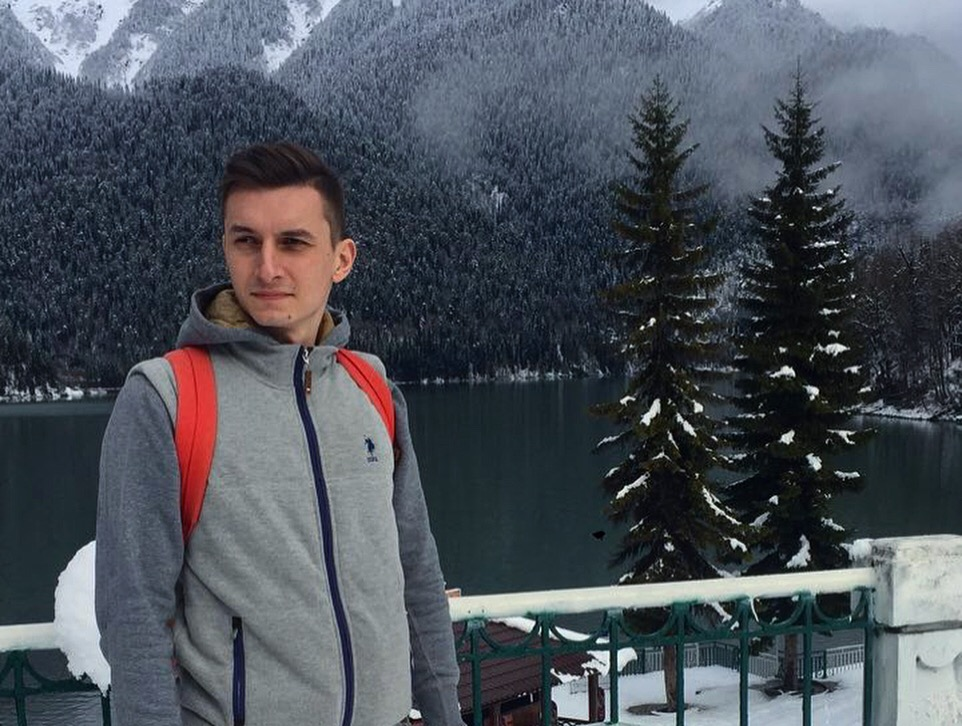
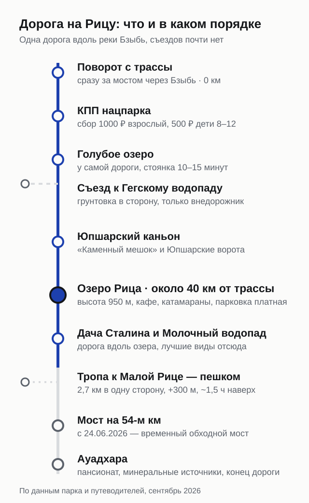
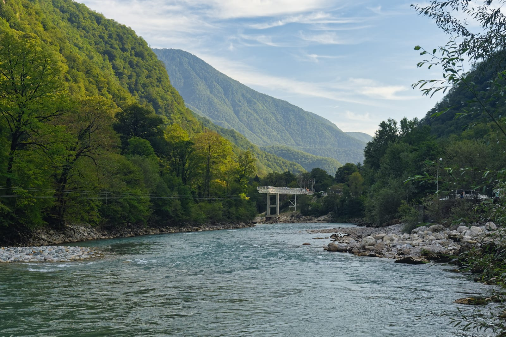
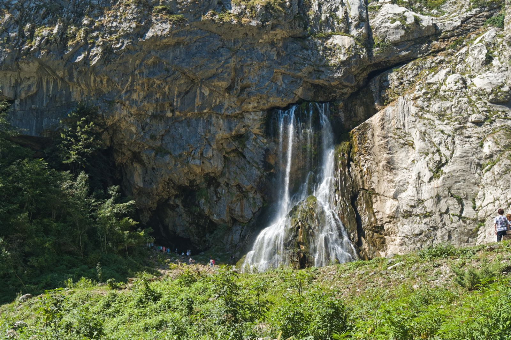
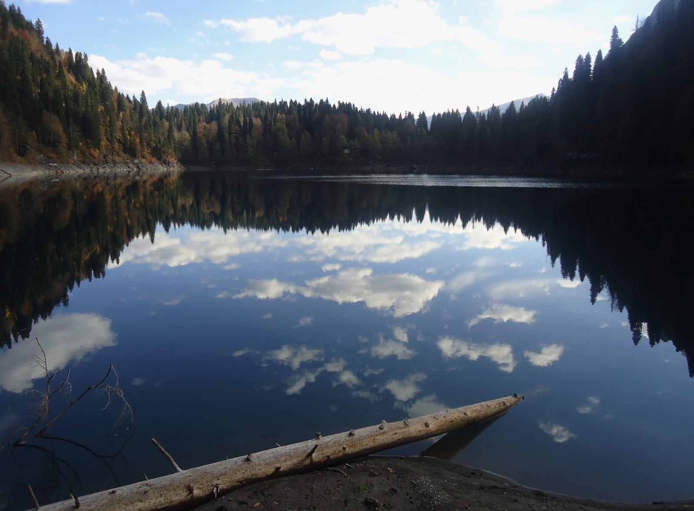
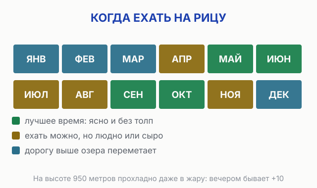

import AffiliateNote from '../../components/post/AffiliateNote.astro';
import PricingCards from '../../components/post/PricingCards.astro';
import { cherehapaCountry, sutochnoRegion, youtravelCountry, kiwitaxiRoute, sputnik8City } from '../../data/affiliate.js';

Озеро Рица — та самая бирюзовая открытка, ради которой едут вглубь Абхазии: горное озеро на высоте 950 метров, зажатое между поросшими лесом хребтами. Сама дорога к нему — половина впечатления: серпантин вдоль реки Бзыбь, Голубое озеро у обочины и каньон с отвесными стенами. Вторая половина впечатления — не всегда приятная: платная парковка, кафе на берегу, фотографы в папахах и толпа к полудню.

Ниже — всё, что понадобится для решения и для самого дня: тариф нацпарка с 1 мая 2026 года с официальным источником, состояние дороги по новостям самого парка (летом 2026 на 54-м километре меняли мост), расклад «экскурсия, такси или своя машина», сколько уходит за день на двоих, что пишут 50 человек, побывавших там с апреля 2023 по июль 2026, и как приехать так, чтобы застать озеро без толпы.

> **Если коротко:** Рица — горное озеро в Рицинском реликтовом нацпарке, **вход с 1 мая 2026 — 1000 ₽** с взрослого (дети 8–12 — 500 ₽, до 8 лет бесплатно). **Общественного транспорта нет**: добираются на экскурсии (от ~900 ₽/чел), джип-туре, такси (~6000 ₽ из Гагры) или своей машине. От Гагры — **55 км и 1–1,5 часа** по серпантину. По дороге — Голубое озеро и Юпшарский каньон; рядом — Гегский водопад, дача Сталина и Молочный водопад. Ехать лучше **с мая по октябрь и к открытию**: к полудню у озера не протолкнуться. На месте платят за всё — парковку, туалет, катамаран, — и почти всюду наличными. Ночуют у Рицы редко — базой удобнее Гагра или Пицунда. Полис оформляют до выезда: ОМС в Абхазии не работает, а перевозку в больницу Сочи без полиса оплачивают из своего кармана — <a href={cherehapaCountry('abkhazia', 'ozero_ritsa_2026')} class="aff-cta" rel="sponsored">подобрать страховку в Абхазию</a>.

<AffiliateNote />

---

## Моя Рица: 26 декабря 2017

Сам я был на Рице один раз — 26 декабря 2017 года. Зима, снег на пихтах, тёмная вода — и озеро всё равно восхитительное, мне безумно понравилось. А сильнее видов запомнился копчёный сыр: его коптили прямо там, у озера, и ел бы я его бесконечно. С той поездки прошло почти девять лет, поэтому цены, дорогу, мост и режим парка в этой статье я сверял по свежим источникам и отзывам 2025–2026 годов, а не по памяти.

## Что такое озеро Рица и почему туда едут?

**Рица — самое известное и одно из самых глубоких озёр Абхазии, главная природная достопримечательность страны.** Лежит на высоте 950 метров над уровнем моря, в ущелье, где сливаются реки Лашипсе и Юпшара; наибольшая глубина — 116 метров, длина около 2,5 км ([посольство Республики Абхазия](https://emb-abkhazia.ru/turizm_i_otdyh/ozero_rica/)). На карте это Гудаутский район, примерно 43,48° северной широты и 40,54° восточной долготы ([карточка на Яндекс.Картах](https://yandex.ru/maps/105958/gudauta-district/geo/164368733/)).

Озеро молодое: оно образовалось, когда горный обвал перегородил реку и вода заполнила котловину. Отсюда фирменная черта Рицы — **цвет, который меняется по сезону**: весной и летом, когда в воде много мелкой взвеси и планктона, она зеленовато-бирюзовая; к зиме вода светлеет и становится холодно-синей.

Едут сюда за двумя вещами сразу — за самим озером и за дорогой к нему. Маршрут проходит через Рицинский реликтовый национальный парк: реликтовые леса, ущелья, водопады и пара озёр поменьше. Парк живой, а не музейный: 2 сентября 2026 его сотрудники в экспедиции на гору Пшегишха нашли пять новых для парка видов растений ([Апсныпресс, 02.09.2026](https://www.apsnypress.info/ru/item/21749-uchenye-obnaruzhili-na-gore-pshegishkha-novye-vidy-redkikh-rastenij)). Это не пляжный отдых, а выезд на полный день из Гагры или Пицунды — горы, прохлада и виды вместо моря.

Если ещё только решаете направление в целом — отдельно разобрал, [стоит ли ехать в Абхазию 2026](/blog/abkhazia-2026/): безопасность, документы, цены и честные отзывы.

---

## Почему озеро называется Рица

**Рица — имя девушки из абхазской легенды.** По преданию, она пасла стада в этой долине, а её три брата, Агепста, Ацетук и Пшегишха, охотились в горах. Пока братьев не было, девушку похитили разбойники Гега и Юпшара. Братья услышали крик и бросились на помощь, но брошенный в похитителей камень попал в саму Рицу, и она утонула в реке. От горя братья окаменели и стали горами вокруг долины, а вода заполнила котловину.

Легенда держится за настоящую карту: вершины вокруг озера так и называются, Агепста, Ацетука и Пшегишха, а Гега и Юпшара — реальные реки. Их вы увидите по дороге: Гегский водопад и Юпшарский каньон, про которые ниже.

По науке всё прозаичнее: озеро появилось от горного обвала, перегородившего реку. Но названия на карте достались от легенды.

---

## Сколько стоит вход на Рицу в 2026 году?

**Озеро находится на территории заповедника, поэтому за въезд берут экологический сбор. С 1 мая 2026 года тариф вырос до 1000 ₽ с взрослого.** Новые цены утвердил Кабинет министров Абхазии, прежнее решение от 21 апреля 2022 года отменено; тариф одинаковый для всех способов заезда — на экскурсии, такси или своей машине ([Апсныпресс, 30.03.2026](https://www.apsnypress.info/ru/item/19775-tseny-na-poseshchenie-ritsinskogo-natsionalnogo-parka-uvelichatsya-s-1-maya)).

| Категория | Сбор в нацпарк с 1 мая 2026 |
|---|---|
| Взрослый | **1000 ₽** |
| Дети 8–12 лет | **500 ₽** |
| Дети до 8 лет (любое гражданство) | бесплатно |
| Граждане Абхазии по паспорту или свидетельству о рождении | бесплатно |
| Ветераны и инвалиды войны 1992–1993 и Великой Отечественной | бесплатно |

До 1 мая 2026 взрослый билет стоил 700 ₽, а до апреля 2022 — 350 ₽, так что в старых отзывах и описаниях экскурсий цена другая. Посетители лета 2026 в отзывах на Яндекс.Картах называют новую сумму прямо: в отзыве от 15 июля 2026 — «за два года выросла с 350 до 1000 рублей».

**Как платят.** Сбор берут на КПП у въезда, там же продают билеты ([страница билетов на сайте парка](https://ritsa-park.ru/index.php/services/bilety)). Рассчитывайте на **наличные рубли**: в отзыве от 13 октября 2025 карту на КПП приняли только после того, как выяснилось, что наличных у водителя нет, — это исключение, а не правило. Карты в Абхазии работают плохо везде, а в горах тем более; подробно про деньги — в гайде [как платить за границей россиянам](/blog/pay-abroad-2026/) (для Абхазии правило одно: везите наличные рубли).

---

## Сколько стоит день на Рице на двоих

**Сбор в нацпарк — не главная трата дня.** По отзывам посетителей 2024–2026 годов на озере платят за парковку, туалет, катамаран и обед, и вместе это выходит больше самого билета. Таблица — оценка на двоих взрослых, суммы из отзывов помечены датами; официального прайса на эти услуги нет.

| Статья расхода | Своя машина или такси | Групповая экскурсия |
|---|---|---|
| Сбор в нацпарк, 2 взрослых | 2000 ₽ | 2000 ₽ (иногда включён в цену тура — уточняйте) |
| Экскурсия или дорога | бензин ~110 км из Гагры и обратно; такси 6000–6500 ₽ за машину | от ~900 ₽ до ~1500 ₽ с человека |
| Парковка у озера | 200 ₽ (отзыв от 22 июля 2024) — 500 ₽ (отзыв от 13 октября 2025) или обязательный чек в «своём» кафе: 1000 ₽ (отзыв от 5 июля 2024) — 1500 ₽ (отзыв от 13 октября 2025) | входит |
| Туалеты | 20–50 ₽ за раз (отзывы от 5 июля 2024 и 22 июля 2024) | 20–50 ₽ за раз |
| Катамаран, 30 минут | 500 ₽ с человека, трёхместный — 1500 ₽ за лодку (отзыв от 22 июля 2024) | столько же |
| Обед в кафе на берегу | ~1000 ₽ с человека и выше; куриный шашлык — 700 ₽ (отзыв от 18 сентября 2025) | столько же или еда с собой |
| **Итого на двоих** | **около 5500–7500 ₽ без бензина** | **около 4000–6000 ₽** |

Сэкономить можно на трёх вещах, и все три подтверждают отзывы: взять еду с собой (отзыв от 6 января 2026 — устроились с бутербродами на берегу), свернуть с основной парковки к указателю «Дача 11» и оставить машину бесплатно в лесу у пляжа (отзыв от 21 октября 2025), не платить за фото на пирсе и у Голубого озера — про эти «услуги» ниже отдельно.

---

## Как добраться до озера Рица?

**Главное, что нужно знать заранее: общественного транспорта к Рице нет.** Ни автобуса, ни маршрутки до озера не ходит — добраться можно только на экскурсии, такси, джипе или своей машине. Дорога одна: поворот с приморской трассы сразу после моста через реку **Бзыбь**, дальше около 40 км горного серпантина вдоль реки до озера.

<a href={kiwitaxiRoute('abkhazia', 'ozero_ritsa_2026').href} class="aff-cta" rel="sponsored">Трансфер из аэропорта Сочи в Абхазию</a> — машина к рейсу, граница без пересадок. <a href={sputnik8City('abkhazia', 'ozero_ritsa_2026')} class="aff-cta" rel="sponsored">Экскурсии на Рицу из Гагры</a> — расписание и отзывы.

Если не хотите сами водить и разбираться с логистикой, можно поехать по Абхазии с местным гидом в малой группе — Рица почти всегда в программе вместе с другими точками маршрута: <a href={youtravelCountry('abkhazia', 'ozero_ritsa_2026')} class="aff-cta" rel="sponsored">поехать по Абхазии с местным гидом</a> (маршрут и трансферы уже собраны, оплата картой РФ).

Расстояния и время в пути от основных курортов (на машине, без учёта остановок). Ближе всех — [Гагра](/blog/gagra-2026/), и по этой же дороге чаще всего везут экскурсии:

| Откуда | Расстояние | Время в пути |
|---|---|---|
| Гагра | 55 км | 1–1,5 ч |
| Пицунда | 59 км | 1–1,5 ч |
| Гудаута | 69 км | ~1,5 ч |
| Новый Афон | 85 км | 2–3 ч |
| Сухум | 110 км | 2–3 ч |
| Граница с РФ (Псоу) | 82 км | ~2 ч |
| Адлер | 93 км | 2,5–3 ч + граница |
| Сочи | 120 км | 3–3,5 ч + граница |

Цифры — ориентир по горной дороге; летом в выходные на серпантине и у Голубого озера бывают пробки из экскурсионных автобусов ([как добраться, edemgagra.ru](https://edemgagra.ru/dostoprimechatelnosti/ozero-ritsa-kak-dobratsya/)). Экскурсия едет дольше своей машины не из-за дороги, а из-за остановок: в отзыве от 16 июля 2024 путь до озера занял почти 2,5 часа из-за заездов на дегустации вина, сыра и мёда, обратный — заметно короче.

Ближе всего к Рице Гагра и Пицунда: от них час-полтора по серпантину, оттуда и едет большинство. Жильё в Абхазии — это в основном частный сектор и мини-гостиницы, поэтому искать его удобнее не по отельным сайтам: <a href={sutochnoRegion('https://abkhazia.sutochno.ru/', 'ozero_ritsa_2026_stay')} class="aff-cta" rel="sponsored">Посмотреть жильё в Абхазии</a> — цены, отзывы и оплата картой РФ.

### Дорога в 2026 году: мост на 54-м километре

**Летом 2026 парк менял мост выше озера.** В июне 2026 дирекция парка сообщила, что мост на 54-м км дороги Бзыбь — Ауадхара признан аварийным по итогам обследования Государственного управления по архитектуре и градостроительству Абхазии и закрыт для проезда ([новости парка, июнь 2026](https://ritsa-park.ru/index.php/novosti/456-most-na-54km-zakryt-dlya-proezda)). С 18 по 24 июня рядом построили временный обходной мост, и 24 июня 2026 его ввели в эксплуатацию с просьбой к водителям соблюдать осторожность ([новости парка, 24.06.2026](https://ritsa-park.ru/index.php/novosti/458-vremennyj-most-na-54km-avtodorogi)).

Что это значит для обычной поездки: **до самого озера мост не касается**: Рица стоит примерно на 40-м километре, а 54-й км — это участок выше, по пути к Ауадхаре и минеральным источникам. Если планируете ехать дальше озера — к пансионату Ауадхара, к Семиозёрью, — перед выездом откройте [раздел новостей парка](https://ritsa-park.ru/index.php/novosti): там же публикуют сообщения о расчистке дороги после снега и камнепадов.

### Какой способ выбрать

<PricingCards tiers={[
 { tier: 'Экскурсия', featured: true, badge: 'Проще всего',
 price: 'от ~900 ₽/чел',
 priceNote: 'без своей машины',
 features: [
 'Группой на автобусе или джипе',
 'Заезжают на Голубое озеро и в каньон',
 'Не нужно платить за КПП отдельно — обычно входит',
 'Минус: график группы, дегустации по дороге и толпа на точках',
 ] },
 { tier: 'Такси',
 price: '~6000–6500 ₽',
 priceNote: 'за машину туда-обратно',
 features: [
 'Свой темп и остановки',
 'Удобно компанией 3–4 человека',
 'Цену и ожидание оговаривайте заранее',
 'Сбор в нацпарк — отдельно',
 ] },
 { tier: 'Своя машина',
 price: '1000 ₽ + бензин',
 priceNote: 'максимум свободы',
 features: [
 'Едете когда хотите и где хотите',
 'Серпантин узкий — не для новичков за рулём',
 'К Гегскому водопаду легковая не проедет',
 'Аренда авто — заранее',
 ] },
]} />

По отзывам путешественников, **главная развилка — групповой автобус против джипа или своей машины**. Автобус дешевле, но это весь день по чужому графику; самостоятельная поездка даёт время постоять там, где красиво, а не там, где остановили всех. Один из посетителей в отзыве от 21 октября 2025 формулирует жёстче: если вы на машине, экскурсию брать не стоит — всё, что в ней описано, видно по дороге на озеро.

Решение за минуту:
- **Без прав или с детьми до школы** — экскурсия: не надо думать про серпантин, парковку и наличные на КПП.
- **Компания 3–4 человека** — такси: цена за машину делится, темп свой.
- **Хотите тишины и вида без толпы** — своя машина и выезд к 7–8 утра; иначе разницы с автобусом почти нет.

---

## Что посмотреть по дороге и рядом с Рицей

**Дорога к Рице — это маршрут с остановками, а не переезд из точки в точку.** Вот что встречается по пути и рядом, в порядке движения от трассы.

- **Голубое озеро (Адзиасцва)** — прямо у дороги, маленькое карстовое озеро насыщенного сине-бирюзового цвета. Глубина около 76 метров, вода холодная круглый год (~+10 °C) и не мутнеет даже в дождь. Остановка на 10–15 минут, дальше — сувениры и фототочки. Здесь же дежурят фотографы с папахами и ружьями: в отзыве от 18 февраля 2026 цену — 1000 ₽ — назвали только после съёмки, а за отказ платить угрожали. Снимайтесь на свой телефон.
- **Юпшарский каньон («Каменный мешок»)** — около 8 км ущелья, где скалы поднимаются почти отвесно. Самое узкое место — **Юпшарские ворота**: стены сходятся, и небо превращается в полоску. Лучшая точка дороги после самого озера.
- **Гегский водопад** — мощный поток высотой около 70 метров (туристы оценивают пониже), в стороне от основной дороги. Сюда **легковая машина не проедет**: последний отрезок — грунтовка, проходимая только на внедорожнике или местном УАЗе. Зато весной водопад особенно полноводный. Кстати, именно здесь снимали сцену схватки Холмса с Мориарти у Рейхенбахского водопада в советском «Шерлоке Холмсе».
- **Дача Сталина** — у самого озера, на берегу. Скромная снаружи и аскетичная внутри, без позолоты; внутрь пускают за отдельную небольшую плату — любопытно тем, кому интересна история. Бывает закрыта без предупреждения: в отзыве от 6 января 2026 на дачу не пустили, потому что там отдыхало руководство республики.
- **Молочный водопад** — недалеко от дачи, выше Рицы. Вода кажется белой, словно вспененное молоко, отсюда и название. Дорога к нему вдоль озера — та самая, откуда, по отзыву от 21 октября 2025, открываются лучшие виды на Рицу.
- **Малая Рица** — озеро поменьше и выше, к нему ведёт пешая тропа от большой Рицы. Туда добираются те, кому хочется тишины без толп.

### Тропа к Малой Рице в цифрах

**2,7 км в одну сторону и 300 метров набора — это полдня, а не прогулка до кафе.** Тропа начинается от парковки у большой Рицы (986 м) и выводит к Малой Рице на 1235 м, по пути забираясь до 1293 м; наверх идут около полутора часов, вниз — меньше часа, на всё с отдыхом у воды закладывают 3–5 часов. Отдельного билета не нужно — хватает сбора в нацпарк; на тропе нет ни воды, ни еды, только туалет у начала; проходима она с середины мая до середины ноября, но как минимум до конца мая на тропе ещё лежит снег, а в конце октября рано темнеет — на 3–5 часов пути закладывайте светлое время ([Vandrovnik, обновлено 31.03.2026](https://vandrovnik.ru/abh/malaya-ritsa)). Посетители оценивают подъём по-разному: в отзыве от 17 июля 2024 маршрут назван тяжёлым и «на один раз», но озеро — стоящим этих усилий.

Тем, кто хочет настоящих гор, есть маршрут выше — на Пшегишхву: в отзыве от 29 июля 2025 люди вышли рано утром на своей машине, поднялись на гору и встретили медведя. Это не экскурсия, а поход: нужны обувь, вода и запас времени, а лучше — местный проводник.

Про Гегский водопад в отзывах пишут прямо и про красоту, и про дорогу:

> «Гегский водопад в мае — отрыв башки. Огромный поток с высоты, да ещё и с ледником — действительно круто» — *iamvoland2009, [Форум Винского](https://forum.awd.ru/viewtopic.php?t=268425)*.

> «Вы будете ехать над пропастью по камням и валунам. Если не боитесь за свою жизнь — езжайте на Гегский» — *блог [turzametka.com](https://turzametka.com/abxaziya-chto-stoit-posmotret/)*.

Это мнения путешественников, а не инструкция: дорогу к Гегскому осилит только подготовленная машина с опытным водителем, и в межсезонье съезд может быть закрыт.

---

## Когда лучше ехать на Рицу?

**Лучше всего — с мая по октябрь, и в любой месяц — к открытию, а не к обеду.** Летом на высоте заметно прохладнее, чем на побережье: даже в жару у воды свежо, а вечером и ночью в горах бывает около +10 °C. Берите кофту, даже если на пляже +30.

Сколько градусов ждать у озера — оценка по нашим климатическим нормам для побережья Абхазии (реанализ ERA5, средние за 2015–2024, точка замера — Сухум) с поправкой на высоту: на каждый километр вверх воздух холоднее примерно на 6 °C, Рица лежит на 950 м. Это расчёт, а не замер на месте — ±2–3 °C.

| Месяц | Побережье, ночь…день | У озера, оценка |
|---|---|---|
| Май | 13…20 °C | 7…14 °C |
| Июнь | 18…25 °C | 12…19 °C |
| Июль | 20…27 °C | 14…21 °C |
| Август | 22…28 °C | 16…22 °C |
| Сентябрь | 18…25 °C | 12…19 °C |
| Октябрь | 12…20 °C | 6…14 °C |

Отзывы сходятся с расчётом: в отзыве от 28 ноября 2024 в 7:40 утра у озера было +12 °C, в отзыве от 21 октября 2025 предупреждают, что утром там холодно и нужна тёплая одежда.

- **Весна (апрель–май):** меньше людей, водопады максимально полноводные после таяния снега. Минус — погода переменчивая, на высоте ещё может лежать снег: в отзыве от 27 марта 2025 выше озера дорогу к даче Сталина и водопаду завалило снегом, проехать не удалось.
- **Лето (июнь–август):** самый удобный сезон по дороге и погоде, но и самый людный — в выходные на серпантине и у Голубого озера толпы и пробки. Выезжайте так, чтобы быть у озера к открытию кафе и прокатов, около 9 утра.
- **Бархатный сезон (сентябрь — начало октября):** прохладно, ясно, мало народу — пожалуй, лучшее время для экскурсий. Отзыв от 17 ноября 2025 добавляет: осенью серпантин особенно красочный, и ехать стоит на своей машине, чтобы останавливаться на каждом повороте.
- **Зима:** дорогу выше Рицы переметает снегом, часть точек недоступна, а само озеро под серым небом выглядит угрюмо. Зато людей мало: в отзыве от 7 января 2024 на новогодних праздниках было спокойно, на дороге местами гололёд.

**Про свет и фотографии.** Утром солнце ещё за горами, и вода в озере на снимках выходит тёмной — в отзыве от 21 октября 2025 советуют приезжать рано ради тишины, а снимать озеро на обратном пути, когда оно освещено. Лучшие ракурсы — с противоположного берега, по дороге к даче Сталина и Молочному водопаду.

Какие месяцы вообще лучшие для Абхазии в целом, с погодой и ценами по сезонам, — в гайде [стоит ли ехать в Абхазию 2026](/blog/abkhazia-2026/).

---

## Сколько времени заложить и план на день

Рица — это полноценный выезд на день, а не часовая остановка. На дорогу от Гагры и обратно уходит 2,5–3 часа только в движении, плюс остановки по пути и время у самого озера. Лучший план:

- **Утро (выезд к 7–8):** пока трасса и серпантин свободны, доехать до поворота на Бзыби и подняться к озеру. У Голубого озера остановиться на 10 минут — до автобусов.
- **У озера до полудня:** прогулка по берегу, катамаран, при желании — подъём к Малой Рице (3–5 часов на всё) или дача Сталина.
- **Обед:** в кафе на берегу (мамалыгу и шашлык в отзывах хвалят, чебуреки — нет) или свои бутерброды с видом на воду.
- **На обратном пути:** Юпшарский каньон и Голубое озеро при дневном свете — тогда и снимки, и меньше людей на точках, которые экскурсии проходят с утра; Гегский — только если у вас джип или местный транспорт.

Тем, кто хочет успеть и Рицу, и Новый Афон, лучше разнести их на два дня: это разные направления, и в один день галопом смазывается и то, и другое. Что внутри Нового Афона — в гайде про [Новоафонскую пещеру](/blog/novoafonskaya-peschera-2026/). А если хочется увидеть больше одной Рицы — Ауадхару, источники, тропы, — есть вариант с ночёвкой наверху: в отзыве от 28 ноября 2024 ради этого бронировали жильё в Ауадхаре.

---

## Практические советы

- **Выезжайте рано.** К 9–10 утра у Голубого озера стоят автобусы; ранний выезд экономит и время, и нервы на серпантине.
- **Тёплая одежда.** На высоте прохладно даже летом — лёгкая куртка обязательна, особенно если планируете задержаться до вечера.
- **Наличные рубли, мелкими.** Сбор в нацпарк, парковка, туалеты по 20–50 ₽, дача Сталина, катамаран — всё за наличные. Карты в горах почти не работают.
- **Парковка.** У главного берега попросят 200–500 ₽ или чек из «своего» кафе. Свернув к указателю «Дача 11», можно оставить машину в лесу у пляжа бесплатно и подняться пешком к Молочному водопаду — по отзыву от 21 октября 2025.
- **Фото за деньги.** Цену у фотографов с папахами спрашивайте до съёмки или не снимайтесь вовсе — жалобы на 1000 ₽ «после» и грубость повторяются в отзывах 2026 года.
- **Обувь по погоде.** Если планируете Малую Рицу или подходы к водопадам — нужна нескользящая обувь, тропы бывают сырыми.
- **Обратно — засветло.** Серпантин узкий, а местные водители ездят быстро, — отзыв от 16 августа 2024 советует заканчивать прогулку до темноты.
- **Страховка.** Горные серпантины и удалённость от больниц — повод не экономить на полисе: ОМС в Абхазии не действует, а перевозку в больницу Сочи без полиса оплачивают из своего кармана. <a href={cherehapaCountry('abkhazia', 'ozero_ritsa_2026')} class="aff-cta" rel="sponsored">Оформить страховку в Абхазию</a> — выбираете покрытие под даты, оплата картой РФ.
- **Гегский — только на подготовленной машине.** На своей легковой даже не пытайтесь; берите джип-тур или местный транспорт у поворота.

---

## Стоит ли Рица потраченного дня?

**Да, если ехать за природой и дорогой, а не за «вау» от самого озера.** В отзывах Рицу ругают именно за то, что вокруг неё выросла туриндустрия:

> «Рица не самое красивое. Слишком сильно испорчена цивилизацией — повсюду кафешки, музыка, толпы людей. Малая Рица гораздо более глубокий отпечаток оставила» — *iamvoland2009, [Форум Винского](https://forum.awd.ru/viewtopic.php?t=268425)*.

Это полезная поправка к открыточным фото: у берега большой Рицы — кафе, прокат катамаранов, музыка и людно. Но дорога к озеру, каньон, Голубое озеро и водопады компенсируют это с лихвой, а тем, кто готов пройтись пешком, открываются Малая Рица и виды без толпы.

Честно про минусы, чтобы не разочароваться:
- **Берег занят.** Троп вокруг озера нет, к воде на главном берегу не подойти из-за кафе и прокатов — жалоба из отзыва от 19 июля 2025; вариантов на месте два: катамаран или кафе.
- **Платят за каждый шаг.** Парковка, туалет, фото, катамаран, бинокль на смотровой — и почти всё наличными.
- **Инфраструктура не тянет поток.** Туалетов мало, на самой дороге до озера их нет; мусор у берега попадает в отзывы и 2023, и 2025 года.
- **Навязчивость.** Зазывалы-фотографы, «охранники» парковок и заезды экскурсий в дегустационные залы — самая частая причина сниженных оценок.

**Вывод:** Рица — обязательная точка первой поездки в Абхазию, но воспринимайте её как целый маршрут на день, а не как одно озеро. Тогда не разочаруетесь.

---

## Что пишут те, кто был: 50 отзывов с Яндекс.Карт

Разобрал первые 50 отзывов о Рицинском реликтовом национальном парке на Яндекс.Картах — они охватывают период с апреля 2023 по июль 2026 года ([карточка парка](https://yandex.ru/maps/org/ritsinskiy_reliktovy_natsionalny_park/194115096120/reviews/): рейтинг 5,0, 430 оценок, 210 отзывов, Карты отдают только первые 50). Это не все отзывы и не случайная выборка — представительной её считать нельзя, зато она даёт то, чего нет ни в официальных описаниях, ни в ответе нейросети: цены на месте с датами, часы без толпы и то, из-за чего люди ставят низкие оценки.

**Что хвалят почти все — дорогу, а не берег.** Сама сводка Карт: вид одобряют 97% из 162 отзывов, впечатления в целом 83% из 204. Слова о дороге повторяются из отзыва в отзыв: серпантин вдоль реки, каньон, Голубое озеро, «останавливаться на каждом повороте». Про сам берег пишут сдержаннее.

**Что ругают — деньги и сервис.** По той же сводке кафе получают отрицательные оценки в 22% из 36 отзывов, парковка в 8% из 33. В текстах это выглядит так: парковка 200 ₽ в июле 2024 и 500 ₽ в октябре 2025 либо обязательный чек в указанном кафе на 1000 ₽ (июль 2024) — 1500 ₽ (октябрь 2025); туалет 20–50 ₽ и один действующий на всё озеро; фотографы, которые называют цену после съёмки; катамаран по 500 ₽ с человека за полчаса; куриный шашлык за 700 ₽ и чебуреки, которые в отзыве от 6 мая 2025 не советуют брать вовсе. Отдельная тема — «охранники» с рациями на дороге вдоль озера, которые, по отзыву от 13 октября 2025, направляют машины на платные стоянки.

**В чём отзывы спорят между собой.** Одни платили за парковку 200 ₽ (июль 2024), другие 500 ₽ (октябрь 2025), третьих в августе 2024 не попросили ни рубля. Одни называют дорогу от Гагры 40–50 минутами, другие — 2,5 часами: разница в остановках экскурсии на дегустациях. Одни советуют брать экскурсию ради удобства, другие (октябрь 2025) — не брать вовсе, если есть машина. Расхождение по кафе ещё шире: мамалыгу с мясом и сыром хвалят в отзыве от 15 июля 2026, те же кафе в отзыве от 22 июля 2024 называют невкусными и дорогими.

**Что пригодится, и о чём молчат путеводители.**
- Лучшие виды — с противоположного берега, по дороге к даче Сталина; у указателя «Дача 11» есть бесплатная стоянка в лесу (октябрь 2025).
- Утром холодно и солнце за горами, зато пусто; снимать озеро лучше на обратном пути (октябрь 2025).
- В марте выше озера может лежать снег, и к даче с водопадом не проехать (март 2025); на Новый год людей мало, на дороге гололёд (январь 2024).
- С собакой пускают, в том числе на катамаран (август 2025). С дошкольниками тяжело из-за долгой дороги (июль 2025, сентябрь 2023).
- Телефоны и ключи с катамаранов тонут регулярно: в отзыве от 6 января 2026 упоминают услугу водолазов примерно за 20 000 ₽.
- На Пшегишхву поднимаются с раннего утра, там встречают медведей (июль 2025); тропа на Малую Рицу — тяжёлая, но озеро того стоит (июль 2024).
- Тарзанка над рекой и качели над озером — то, что запоминается детям (июнь 2025, декабрь 2024).

Цены здесь — со слов посетителей на указанные даты; официальных прайсов на парковку, туалеты и катамараны у парка нет, и к вашему приезду они могут измениться.

---

## FAQ

**Сколько стоит вход на озеро Рица в 2026 году?**
**Экологический сбор в Рицинский нацпарк с 1 мая 2026 — 1000 ₽ с взрослого**, 500 ₽ за ребёнка 8–12 лет, дети до 8 лет — бесплатно ([Апсныпресс, 30.03.2026](https://www.apsnypress.info/ru/item/19775-tseny-na-poseshchenie-ritsinskogo-natsionalnogo-parka-uvelichatsya-s-1-maya)). Платят наличными на КПП при въезде, тариф одинаковый для экскурсий, такси и своей машины.

**Как добраться до Рицы без машины?**
**Только на экскурсии, джип-туре или такси** — общественного транспорта к озеру нет. Групповые экскурсии из Гагры и Пицунды стоят от ~900 ₽ с человека, такси — около 6000 ₽ за машину туда-обратно.

**Сколько ехать до Рицы от Гагры?**
**Около 55 км и 1–1,5 часа** по горному серпантину вдоль реки Бзыбь. От Пицунды примерно столько же, от Сухума — 2–3 часа. С экскурсией дольше — до 2,5 часов из-за остановок на дегустациях.

**Где находится озеро Рица?**
**В Абхазии, в Гудаутском районе, на высоте 950 метров**, примерно в 40 км от приморской трассы вглубь гор по дороге вдоль реки Бзыбь. Координаты — около 43,48° северной широты и 40,54° восточной долготы. По-английски озеро называют Lake Ritsa.

**Что посмотреть по дороге на Рицу?**
**Голубое озеро и Юпшарский каньон** — прямо на маршруте; **Гегский водопад** — в стороне, только на внедорожнике. У самого озера дача Сталина и Молочный водопад, выше — Малая Рица (2,7 км пешком в одну сторону).

**Можно ли доехать до Рицы на своей машине?**
**Да**, но дорога — узкий горный серпантин не для новичков за рулём. На КПП оплачивается сбор в нацпарк, у озера — парковка (200–500 ₽ по отзывам 2024–2025 годов). К Гегскому водопаду легковая не пройдёт — нужен внедорожник.

**Что с дорогой и мостом в 2026 году?**
**До озера дорога открыта.** Мост на 54-м км дороги Бзыбь — Ауадхара (выше Рицы, на пути к Ауадхаре) в июне 2026 признали аварийным и закрыли, с 24 июня 2026 работает временный обходной мост ([новости парка](https://ritsa-park.ru/index.php/novosti/458-vremennyj-most-na-54km-avtodorogi)). Едете дальше озера — проверьте раздел новостей парка перед выездом.

**Когда лучше ехать на Рицу?**
**С мая по октябрь и с утра.** Весной водопады полноводнее, бархатный сезон (сентябрь — начало октября) — самый спокойный. Зимой дорогу выше озера переметает снегом, а в марте снег может лежать даже у дачи Сталина.

**Холодно ли на Рице летом?**
На высоте 950 метров прохладнее, чем на побережье, примерно на 6 °C: в июле у озера ждите около 14…21 °C против 20…27 °C в Сухуме (оценка по климатическим нормам 2015–2024). Утром бывает +12 °C и в ноябре, и летом — тёплая кофта нужна в любую поездку.

**Можно ли купаться в озере Рица?**
**Нет.** Рица — заповедное озеро, купание в нём запрещено (по отзывам, за это штрафуют), да и вода холодная даже в разгар лета. По воде катаются на катамаранах и лодках с электромоторами; за плаванием — на море, на побережье Гагры или Пицунды.

**Есть ли на Рице туалеты и парковка?**
**Есть, и то и другое платное.** Туалет — 20–50 ₽, на дороге от КПП до озера их нет вовсе. Парковка у главного берега — 200–500 ₽ или чек из кафе; бесплатно машину оставляют в лесу у поворота к даче Сталина (указатель «Дача 11»). Всё — со слов посетителей 2024–2025 годов.

**Подходит ли поездка на Рицу для детей?**
**Да, в формате экскурсии на машине или автобусе.** Дорога — длинный серпантин, поэтому укачивающимся детям пригодятся средства от укачивания, а у воды прохладно — берите тёплую одежду и воду. С дошкольниками, по отзывам, тяжеловато из-за долгой дороги; школьникам нравятся тарзанка и качели над озером.

**Пускают ли на Рицу с собакой?**
**Да.** В отзыве от 7 августа 2025 с собакой пустили и в парк, и на катамаран. Правил на сайте парка по животным мы не нашли, так что переспросите на КПП.

**Почему озеро называется Рица?**
**По абхазской легенде Рица — имя девушки**, которую похитили разбойники Гега и Юпшара, а её братья Агепста, Ацетук и Пшегишха от горя окаменели и стали горами вокруг озера. Вершины и реки с этими именами есть на карте. Геологически озеро возникло иначе — от горного обвала, перегородившего реку.

---

## Что почитать дальше

- [Стоит ли ехать в Абхазию 2026](/blog/abkhazia-2026/) — главный гайд: безопасность, документы, цены, отзывы
- [Новоафонская пещера 2026](/blog/novoafonskaya-peschera-2026/) — билеты, расписание и как добраться
- [Гагра 2026: пляжи, жильё и что смотреть](/blog/gagra-2026/) — ближайший к Рице курорт, откуда чаще всего едут
- [Нужен ли загранпаспорт в Абхазию](/blog/zagranpasport-v-abhaziyu-2026/) — по каким документам пускают взрослых и детей
- [Что привезти из Абхазии](/blog/chto-privezti-iz-abhazii-2026/) — вино, чача, специи и нормы провоза
- [Абхазия — кратко: сезоны, бюджет, регионы](/abkhazia/) — краткая справка по направлению
- [Что брать в Абхазию](/packing/abkhazia/) — сборы по месяцам
- [Как платить за границей россиянам 2026](/blog/pay-abroad-2026/) — карты, наличные, нюансы
- [Отдых в Грузии 2026](/blog/georgia-guide-2026/) — тот же Кавказ, но за границей: без визы до 365 дней, море в Аджарии, горы и вино

---

*Материал носит справочный характер. Цены и режим работы в Абхазии меняются — сбор в Рицинский нацпарк сверяйте на месте, перед поездкой проверяйте новости парка. Тариф и состояние дороги проверял 05.09.2026, суммы за парковку, туалеты и катамаран — со слов посетителей на указанные даты. Нашли неточность — напишите в [Telegram-канал @traveltriberu](https://t.me/traveltriberu), обновлю.*

*Фото с Wikimedia Commons, лицензия [CC BY-SA 4.0](https://creativecommons.org/licenses/by-sa/4.0/): Alexxx1979 — [озеро Рица](https://commons.wikimedia.org/wiki/File:Abkhazia._Lake_Ritsa_P9100178_2600.jpg), [река Бзыбь](https://commons.wikimedia.org/wiki/File:Abkhazia._Bzyb_River_P9100191_2600.jpg), [Гегский водопад](https://commons.wikimedia.org/wiki/File:Abkhazia._Gegsky_waterfall_P9100123_2600.jpg); SKas — [Малая Рица](https://commons.wikimedia.org/w/index.php?curid=46786210). Схемы наши.*
