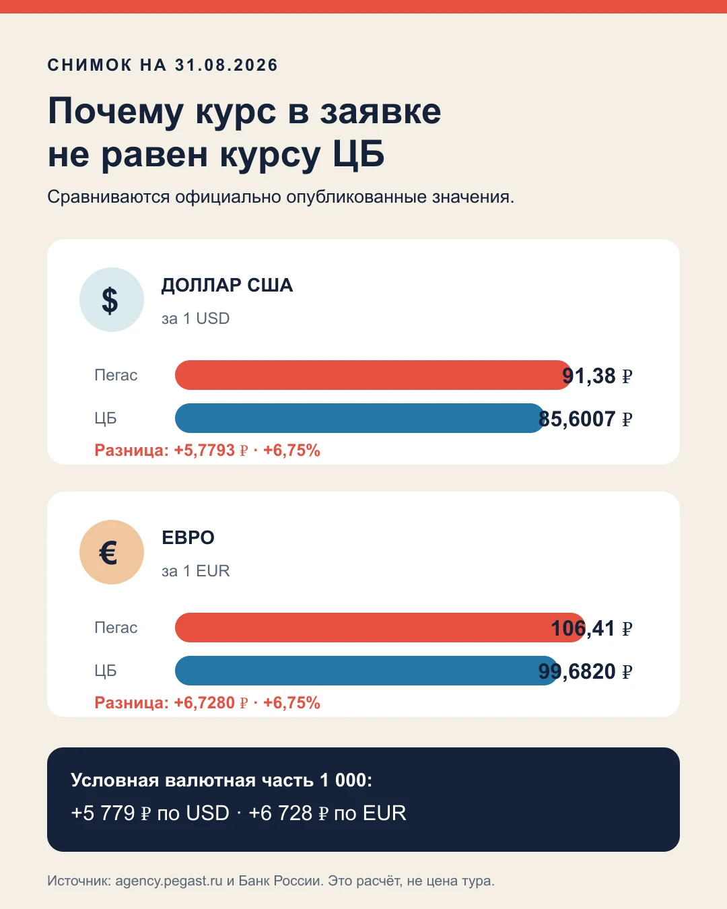
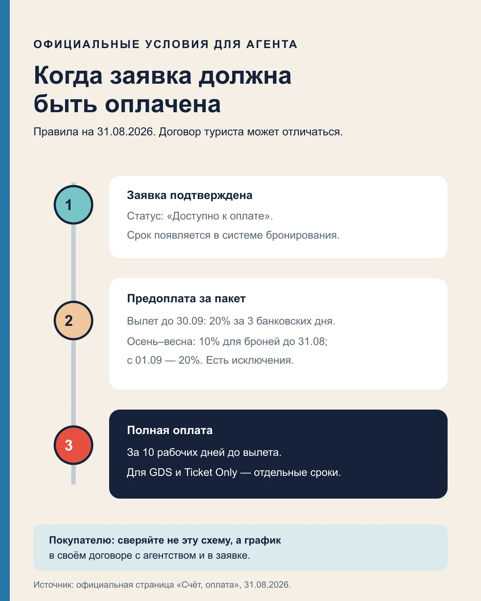
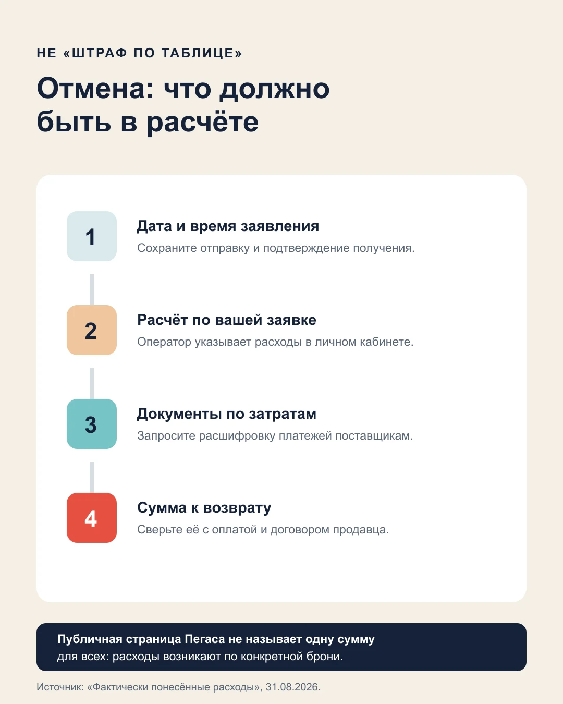
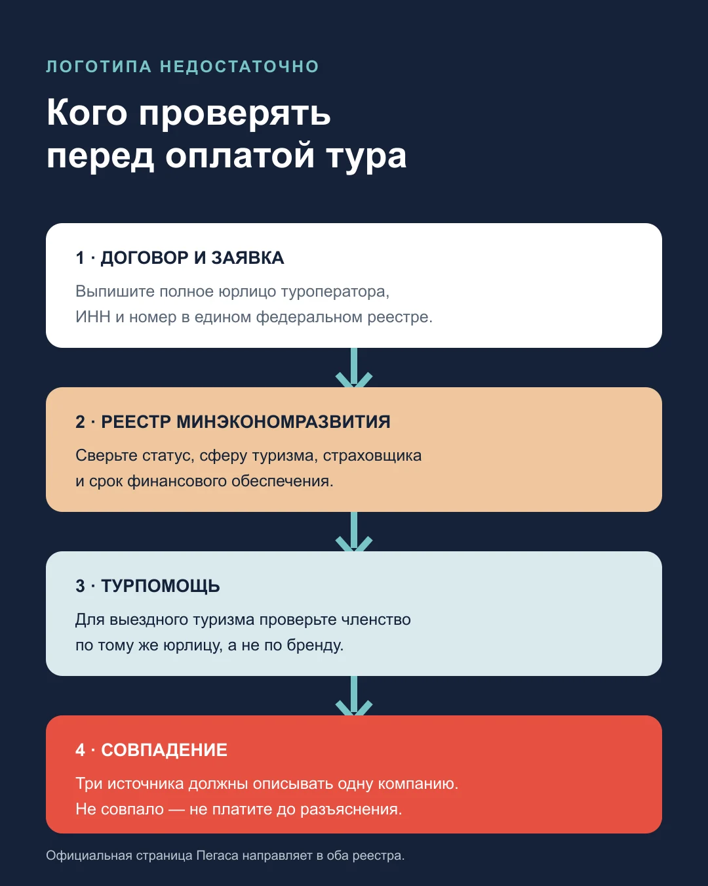

import AffiliateNote from '../../components/post/AffiliateNote.astro';
import { TP_LINKS } from '../../data/affiliate.js';

31 августа 2026 года внутренний курс оплаты туров у «Пегас Туристик» был **91,38 ₽ за доллар и 106,41 ₽ за евро**. Официальный курс ЦБ, действующий с субботы 29 августа, — 85,6007 и 99,6820 ₽ соответственно. Разница почти одинаковая: **6,75%**.

Это не наценка на весь тур и не доказательство переплаты. Пакет может включать рублёвые и валютные части, а договор турист обычно заключает с агентством. Но внутренний курс — реальная строка расчёта между агентом и оператором, которую полезно увидеть **до** внесения денег.

> **Если коротко:** попросите продавца назвать полную рублёвую сумму, курс и срок его фиксации; затем сверьте юрлицо туроператора, график платежей и порядок отмены в своей заявке. Отзывы не отвечают ни на один из этих вопросов.

<AffiliateNote />

## Что именно проверено у «Пегас Туристик»?

Проверка ограничена тем, что можно подтвердить первичными документами на дату публикации. Официальный сайт для агентств открыл страницы [«Счёт, оплата»](https://agency.pegast.ru/bill_payment), [«Фактически понесённые расходы»](https://agency.pegast.ru/cooperation/charges) и [«Финобеспечение»](https://agency.pegast.ru/financial). На них опубликованы внутренний курс, сроки оплаты заявок и общая логика расходов при отказе.

Туристическая витрина `pegast.ru` при проверке из двух браузеров показала запрет доступа с текущего IP. Поэтому здесь нет выдуманной цены «от», пересказа недоступного договора или вывода о качестве поездок. В публичном канале TravelTribe также не найден подтверждённый личный опыт покупки тура у этого оператора.

## Чем внутренний курс отличается от курса ЦБ?

На 31 августа официальный агентский сайт показывал:

| Валюта | Курс Пегаса | Курс ЦБ | Разница | Выше ЦБ |
|---|---:|---:|---:|---:|
| 1 USD | 91,38 ₽ | 85,6007 ₽ | 5,7793 ₽ | 6,75% |
| 1 EUR | 106,41 ₽ | 99,6820 ₽ | 6,7280 ₽ | 6,75% |

31 августа — выходной, поэтому [Банк России](https://www.cbr.ru/currency_base/daily/?UniDbQuery.Posted=True&UniDbQuery.To=31.08.2026) показывает курс, установленный с 29 августа. Для условной валютной части в 1 000 долларов разница составила бы 5 779 ₽, для 1 000 евро — 6 728 ₽. Это мой арифметический расчёт по двум официальным значениям, а не цена какого-либо тура.

## Как проверить рублёвую цену до оплаты?

Официальная инструкция для агентств говорит: тур оплачивается в рублях **по внутреннему курсу туроператора согласно агентскому договору**. Это описывает расчёты агента с Пегасом, а не автоматически условия вашего договора с розничным продавцом.

До перевода денег запросите у агентства четыре ответа в одном сообщении:

1. Полная цена тура в рублях прямо сейчас.
2. Какая часть рассчитана по внутреннему курсу и какой курс применён.
3. Что именно фиксирует цену: бронь, предоплата или полная оплата.
4. Может ли остаток измениться и по какому пункту договора.

Если ответ звучит только как «цена в условных единицах», попросите формулу. Самая простая проверка: валютная часть × внутренний курс + рублёвая часть = сумма к оплате. Сверять два предложения можно лишь при одинаковых рейсе, багаже, номере, питании, трансфере и страховке.

## Какие сроки оплаты опубликованы сейчас?

Для пакетных чартерных и блочных туров с вылетом до 30 сентября 2026 года страница для агентств указывает предоплату **20% в течение трёх банковских дней** после подтверждения и полную оплату за 10 рабочих дней до вылета.

Для вылетов с 1 октября 2026-го по 31 мая 2027-го при бронировании до 31 августа действует предоплата 10%; с 1 сентября — 20%. Для новогодних дат, GDS-туров, билетов без наземного пакета и заявок ближе 14 дней до вылета опубликованы отдельные правила.

Это не готовый график платежей туриста. Между вами и оператором может стоять агентство со своим договором. В заявке должны совпасть сумма, дата каждого платежа и последствия просрочки; при расхождении ориентируйтесь на подписанный документ, а не на пересказ менеджера.

## Что происходит при отмене тура?

Официальная страница не обещает одну фиксированную сумму возврата. При отказе от подтверждённой заявки, её автоматической аннуляции из-за неоплаты или изменении условий агент должен по требованию оператора компенсировать **фактически понесённые расходы**. Они возникают в расчётах с контрагентами и отображаются в системе бронирования агента.

Это важнее слова «штраф». До заявления никто не может честно назвать универсальный процент для любой страны, гостиницы, авиакомпании и даты. После отмены запросите у продавца расчёт по своей заявке и документы, которыми подтверждаются отдельные суммы.

На странице также названы случаи аннуляции без расходов: если полётная программа по направлению не может быть выполнена оператором и в течение трёх дней после официального объявления о старте его полётной программы. Применимость к конкретной заявке нужно подтверждать письменно.

## Можно ли изменить заявку вместо отмены?

Пегас относит изменение условий бронирования к ситуациям, в которых могут возникнуть фактические расходы. Публичная страница не даёт туристу универсального тарифа на замену фамилии, даты или гостиницы.

Поэтому сначала запросите стоимость изменения, затем сравните её с отменой и новой бронью. Не просите менеджера менять данные без письменного подтверждения: авиабилет, номер и трансфер могут жить по разным правилам поставщиков.

## Как проверить финансовое обеспечение?

Пегас сам направляет за сведениями о финансовом обеспечении в единый федеральный реестр туроператоров, а за членством в объединении выездного туризма — в реестр [«Турпомощи»](https://www.tourpom.ru/touroperators).

Проверять нужно не вывеску «PEGAS Touristik», а полное юрлицо из договора и приложения к заявке. Выпишите ИНН и номер в реестре, затем сверьте статус, сферу деятельности, страховщика и срок финансового обеспечения. В опубликованной странице оплаты перечислено несколько компаний, в адрес которых агент может провести платёж; это ещё одна причина не угадывать юрлицо по бренду.

Государственный реестр по официальной ссылке во время проверки не открылся. Поэтому точные номера и суммы финансового обеспечения в эту статью не перенесены: маршрут проверки подтверждён, а сами значения — нет.

## Можно ли судить по отзывам о «Пегас Туристик»?

Запрос «пегас туристик отзывы» собирает вместе разные события: работу конкретного турагентства, перелёт, встречу в аэропорту, трансфер, отель и решение оператора по заявке. Высокая или низкая оценка без номера договора не показывает, кто отвечал за спорный эпизод.

Отзывы полезны как список вопросов. Повторяется жалоба на перенос рейса — проверьте перевозчика и условия изменения времени. Пишут о возврате — запросите форму заявления и порядок расчёта расходов. Но неподтверждённый рассказ нельзя превращать в факт о бренде, поэтому негатив с отзовиков в материал не включён.

## Кому такой способ покупки не подходит?

- **Тем, кому нужна окончательная цена одним числом до заявки.** Внутренний курс участвует в расчётах, а туристическая витрина не дала проверить последний шаг.
- **Тем, кто планирует платить частями без риска пересчёта.** Условия фиксации нужно искать в своём договоре.
- **Тем, кому нужна заранее известная сумма возврата.** Публичное правило привязано к фактическим расходам конкретной брони.
- **Тем, кто хочет свободно менять туристов или даты.** Изменение само может создать расходы.

Подходит этот сценарий тому, кто покупает пакет через проверенное агентство, получает полную заявку до оплаты и готов сохранять документы на каждом денежном шаге.

## Где сравнить тот же пакет?

PEGAS Touristik не платил TravelTribe за этот материал. Travelata и Level.Travel платят комиссию за бронирования по ссылкам ниже; цена для читателя от этого не меняется. Наличие партнёрской ссылки не означает, что найденный там тур лучше прямого предложения или предложения офлайн-агента.

<a href={`${TP_LINKS.travelata}&sub_id=pegas_touristik_2026_body`} class="aff-cta" rel="sponsored">Сравнить пакетные туры у Travelata</a> — задайте те же даты, состав туристов и город вылета, затем проверьте оператора в карточке.

<a href={`${TP_LINKS.level}&sub_id=pegas_touristik_2026_body`} class="aff-cta" rel="sponsored">Проверить предложения у Level.Travel</a> — сравнивайте полную комплектацию, а не только название гостиницы.

Почему цены двух продавцов иногда совпадают до рубля, показано в [замере двенадцати одинаковых туров](/blog/travelata-2026/). Для прямых витрин операторов есть отдельные разборы [ANEX Tour](/blog/anex-tour-2026/) и [Библио-Глобуса](/blog/biblio-globus-2026/). Сценарии поездки собраны в гайдах по [Турции](/blog/turkey-guide-2026/) и [Египту](/blog/egypt-guide-2026/).

## Что сохранить перед переводом денег?

1. Карточку тура с датами, туристами и полной комплектацией.
2. Договор и приложение с точным юрлицом туроператора.
3. Полную рублёвую цену и использованный внутренний курс.
4. График предоплаты и окончательного платежа.
5. Чек, статус заявки и подтверждение зачисления денег.
6. Порядок изменения и отмены именно для вашей брони.
7. Переписку, заявление об отказе и расчёт расходов, если до него дойдёт.

## Короткие ответы о «Пегас Туристик»

**Какой курс у Пегаса сегодня?**

На 31 августа 2026 года официальный агентский сайт показывает 91,38 ₽ за доллар и 106,41 ₽ за евро. Курс меняется, поэтому перед оплатой его нужно смотреть заново, а не брать из этой статьи.

**Почему он выше курса ЦБ?**

Это внутренний курс расчётов туроператора, а курс ЦБ — официальный ориентир денежного регулятора. Пегас не публикует на проверенной странице формулу, которая объясняла бы разницу. На дату замера внутренние значения были выше на 6,75%; объяснять эту разницу комиссией или страховкой без документа нельзя.

**Зафиксируется ли цена после предоплаты?**

Публичная страница для агентов описывает размер и сроки платежей, но не даёт универсального ответа для договора туриста. Попросите продавца указать письменно, какое действие фиксирует рублёвую сумму и что произойдёт с остатком при изменении курса.

**Какую сумму удержат при отмене?**

Заранее точной суммы нет. Официальная страница связывает её с фактическими расходами по конкретной заявке. Требуйте расчёт и подтверждение затрат; ориентир менеджера до отмены не равен окончательной сумме.

**Где смотреть финансовые гарантии?**

Сначала выпишите юрлицо и номер туроператора из своей заявки. Затем проверьте его в едином федеральном реестре и, для выездного туризма, в реестре «Турпомощи». Поиск только по слову «Пегас» может смешать разные компании.

**Это отзыв о качестве туров?**

Нет. Это документальная проверка денежных условий. У TravelTribe нет подтверждённого личного опыта покупки тура у Пегаса, а впечатления клиентов с внешних площадок не проверены по заявкам и договорам.

<a href={`${TP_LINKS.travelata}&sub_id=pegas_touristik_2026_final`} class="aff-cta" rel="sponsored">Сверить Пегас с другими операторами</a> — перенесите в поиск точные даты, отель, номер и состав пакета.

*Документы и курсы проверены 31 августа 2026 года. Материал не содержит личного отзыва о поездке с PEGAS Touristik и не заменяет юридическую консультацию. Туристическая витрина с текущего IP была недоступна, поэтому статья честно ограничена денежной механикой и официальными страницами для агентств.*
