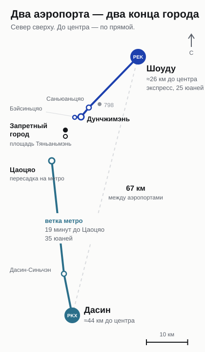
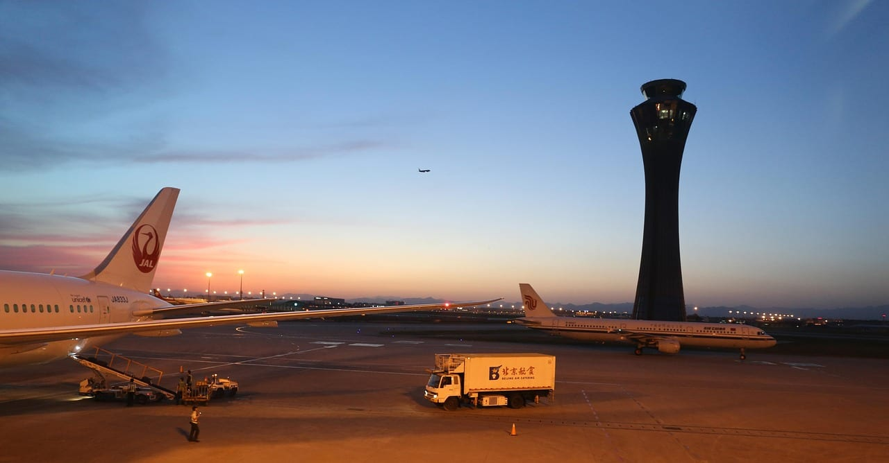
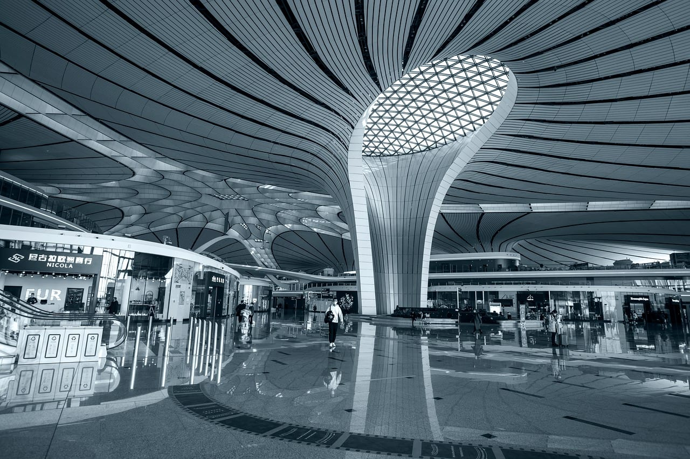
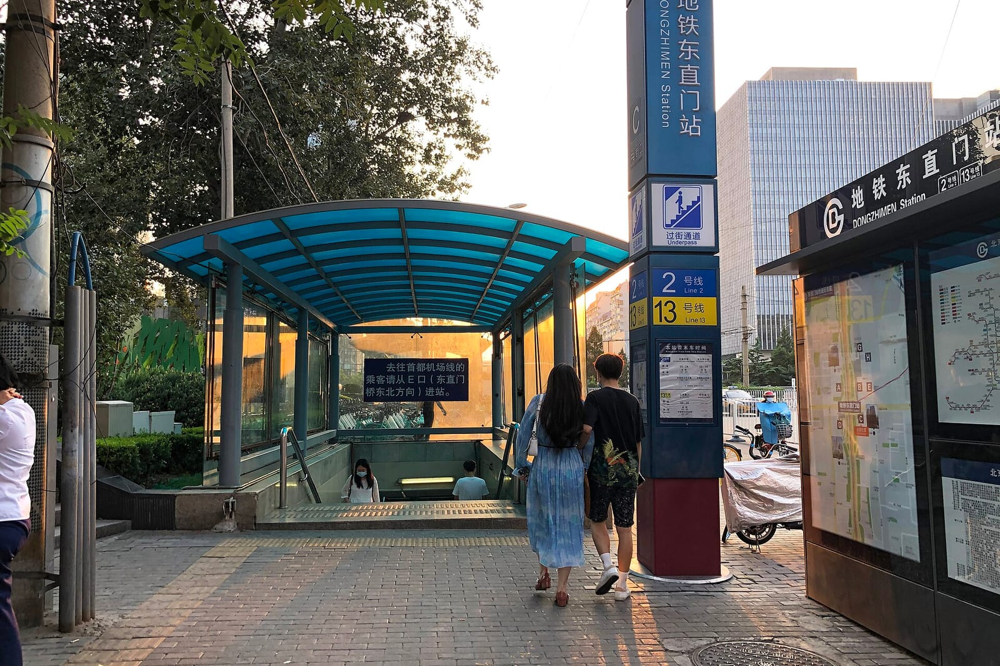
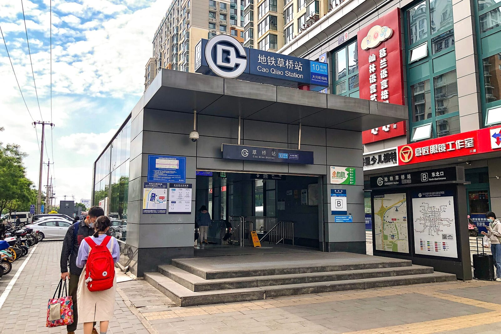
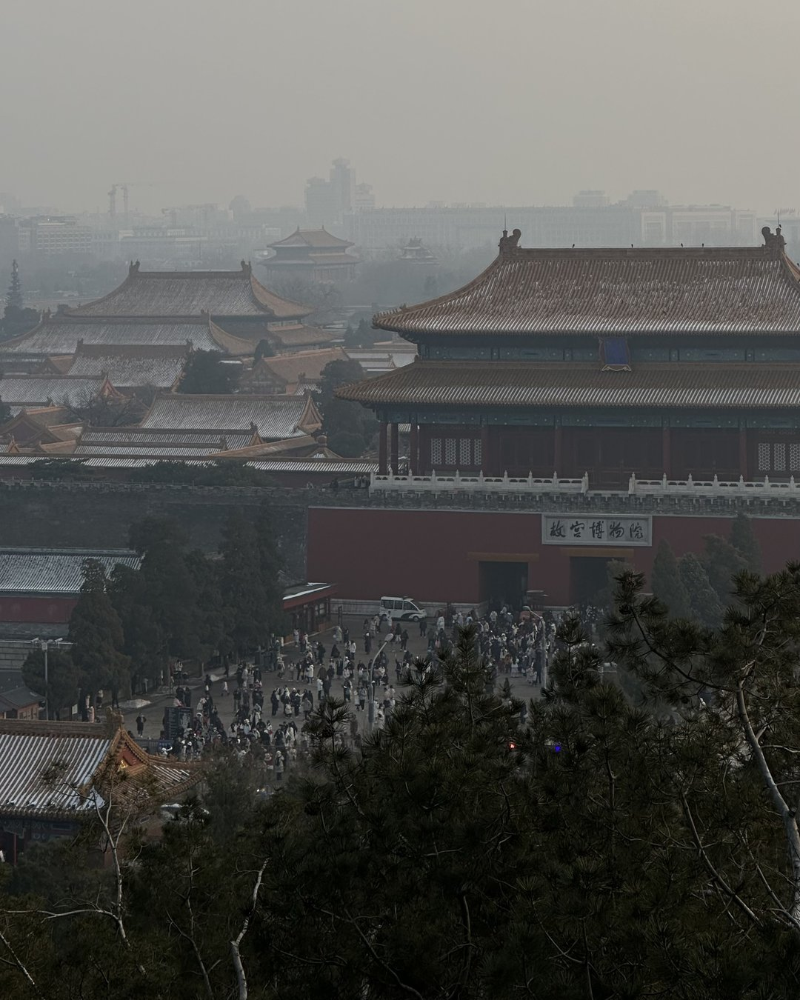
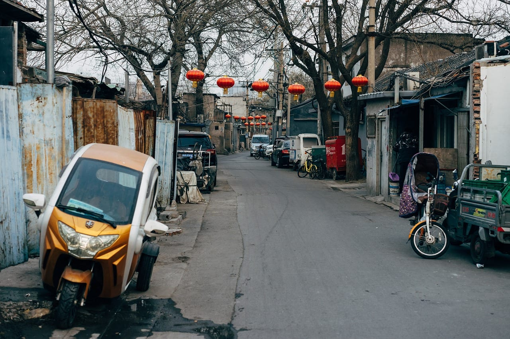
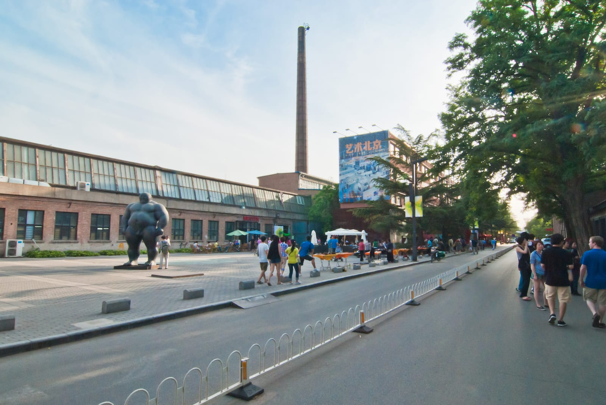
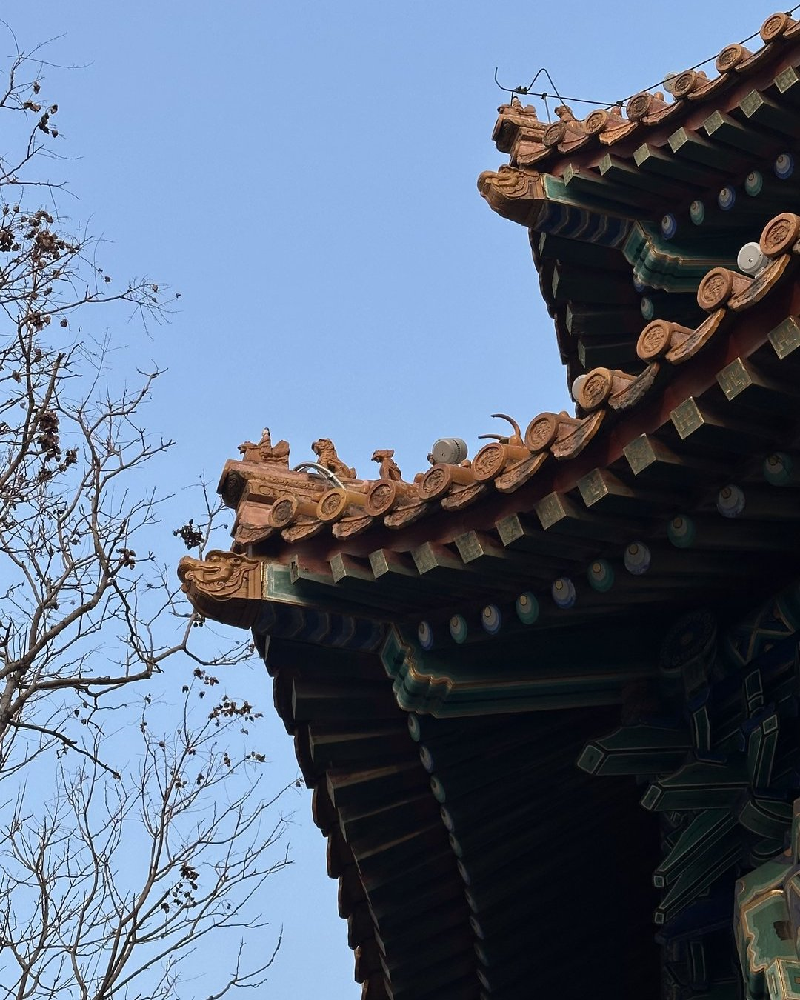

import RouteDays from '../../components/post/RouteDays.astro';
import { aviasalesRoute, ostrovokCity } from '../../data/affiliate.js';

export const stay = ostrovokCity('china', 'beijing', 'peresadka_v_pekine_stay');
export const flightSanya = aviasalesRoute('MOW', 'SYX', 'peresadka_v_pekine_flight_syx');

**Выйти в город при пересадке в Пекине россиянину можно без визы.** Безвиз на 30 дней продлён до 31 декабря 2027 года и прямо включает транзит, билет в третью страну для этого не нужен. Решают три другие вещи: в какой аэропорт вы летите, оформлен ли багаж до конца маршрута и сколько часов между рейсами.

> **Если коротко:** с международного рейса на международный по одному билету граница не нужна: вы остаётесь в транзитной зоне, чемодан летит дальше сам. Перед внутренним рейсом, например в Санью, границу и таможню проходят в Пекине. При раздельных билетах рассчитывайте на получение багажа и новую регистрацию. В город есть смысл ехать при стыковке от 10 часов днём.

## Нужна ли виза, чтобы выйти из аэропорта в Пекине?

**Нет, с обычным российским загранпаспортом виза не нужна до 31 декабря 2027 года.** Китай пускает россиян без визы на срок до 30 дней, и транзит стоит в списке целей рядом с туризмом, делами и поездками к родным. Срок считают со следующего дня после въезда, въезжать можно сколько угодно раз. Работа, учёба и журналистика в этот режим не входят.

В ноябре 2024 года я разбирал в канале 144-часовой транзит: тогда из аэропорта выпускали только с билетом в третью страну. Похожий режим на 240 часов есть и сейчас, но россиянину он не нужен, хватает общего безвиза. Билеты на следующий рейс и бронь жилья посольство Китая советует держать при себе.

Если у вас сквозной билет в третью страну, между международными рейсами меньше суток и вы не выходите из транзитной зоны, в Шоуду и Дасине пограничный контроль проходить не надо. Так устроено с 11 января 2024 года, и карту прибытия в этом случае не заполняют.

Если выходите, на границе понадобится **карта прибытия**. С 20 ноября 2025 года её можно заполнить онлайн заранее: на сайте иммиграционной службы Китая, в приложении «移民局12367» или в мини-программах WeChat и Alipay. Тогда на контроле показываете QR-код, а бумажные бланки в аэропорту тоже остались. Иностранцам от 14 до 70 лет при въезде снимают отпечатки пальцев.

## Шоуду или Дасин: в какой аэропорт вы прилетите

В Пекине два международных аэропорта, между ними 67 километров. Шоуду с кодом PEK стоит на северо-востоке, Дасин с кодом PKX — на юге. Air China принимает международные рейсы в третьем терминале Шоуду, Hainan Airlines прилетает из Москвы во второй терминал того же аэропорта. «Аэрофлот» из Шереметьево садится в Дасине.

Смотрите код аэропорта в каждом плече билета. Прилёт в PEK и вылет из PKX означают смену аэропорта с новой регистрацией. Между аэропортами ходит городской автобус с остановками в Пекине, и по пробкам он не срежет. Такую стыковку по раздельным билетам я бы не планировал короче шести-семи часов.

*Вышка аэропорта Шоуду. Фото: Benny1900 / [Pixabay](https://pixabay.com/photos/china-beijing-1405217/).*

## Сколько времени нужно на пересадку в Пекине?

**Официальный минимум в Дасине — 45 минут между международными рейсами и 60 минут, если один из рейсов внутренний.** У Hainan Airlines во втором терминале Шоуду нормы строже: 90 минут между международными рейсами и 120 минут с внутреннего на международный. Эти минимумы рассчитаны на первый рейс без опоздания.

| Как устроен билет | Что проходите в Пекине | Сколько я бы закладывал |
|---|---|---|
| Международный рейс на международный, один билет | транзитный досмотр, без границы | от 2 часов |
| Москва — Пекин — внутренний рейс, один билет | граница, таможня, внутренний вылет | от 3 часов |
| Два отдельных билета, один аэропорт | граница, чемодан, новая регистрация и досмотр | от 4 часов |
| Смена аэропорта Шоуду — Дасин | то же плюс 67 км по городу | от 6–7 часов |
| Выход в город | граница туда и обратно, дорога, досмотр | от 10 часов днём |

Правая колонка — мой запас на очереди и опоздания, а не норма аэропорта. На короткой стыковке с выходом через границу выигрывает тот, кто заполнил карту прибытия заранее: QR-код проходит быстрее бумажного бланка.

## Нужно ли забирать багаж при пересадке в Пекине?

**Нет, если чемодан оформлен до конечного пункта: это видно по коду аэропорта на багажной бирке.** Между двумя международными рейсами по одному билету он переходит на следующий самолёт без вашего участия.

Сложнее с внутренним рейсом после Пекина. Air China оформляет чемоданы из Москвы сразу до конечного города в Китае, и в Шоуду их не получают, хотя сами вы проходите границу и таможню. На бирке при этом подписывают согласие на таможенный досмотр. На рейсах партнёров, которые выполняет не Air China, это правило не действует.

У Hainan Airlines во втором терминале Шоуду порядок такой: при сквозной регистрации идёте сразу в зал внутренних вылетов на втором этаже, без неё забираете чемодан и сдаёте его заново. Если летите из Москвы в Дасин с пересадкой на внутренний рейс, спросите на регистрации в Шереметьево, до какого аэропорта оформлен багаж.

*Зал аэропорта Дасин. Фото: RockSoldier / [Pixabay](https://pixabay.com/photos/china-daxing-airport-building-5094728/).*

При раздельных билетах рассчитывайте на получение багажа. Сквозное оформление между разными перевозчиками бывает только по их договорённости, и узнаёте вы о нём на стойке в аэропорту вылета.

## Можно ли успеть в город при пересадке и что посмотреть?

**Смысл есть при стыковке от 10 часов, если она приходится на день.** Граница на выходе, дорога в центр и обратно и регистрация на следующий рейс съедают больше половины этого времени. Из Дасина дорога длиннее: ветка метро идёт только до станции Цаоцяо на юге города.

<RouteDays
  title="Стыковка 10 часов в Шоуду"
  days={[
    { n: 1, place: 'Граница и выход', what: 'около часа вместе с отпечатками и таможней' },
    { n: 2, place: 'Экспресс и метро до центра', what: 'час в одну сторону' },
    { n: 3, place: 'Город', what: 'три с половиной часа на один район' },
    { n: 4, place: 'Дорога обратно в аэропорт', what: 'час' },
    { n: 5, place: 'Регистрация, граница, досмотр', what: 'два часа до вылета' },
    { n: 6, place: 'Запас', what: 'полтора часа на опоздания и очереди' },
  ]}
  note="Мой расчёт с запасом, а не норма аэропорта. Для Дасина прибавьте время на дорогу с юга города."
/>

**Экспресс из Шоуду** стоит 25 юаней (около 310 ₽). Он идёт от терминалов T3 и T2 через Саньюаньцяо и Дунчжимэнь до Бэйсиньцяо, поезда ходят примерно раз в 10 минут. Из T3 первый поезд уходит в 6:22, последний — в 22:52, из Дунчжимэня в аэропорт поезда идут с 6:00 до 22:30.

*Выход C станции Дунчжимэнь. Фото: [N509FZ](https://commons.wikimedia.org/wiki/File:Exit_C_of_Dongzhimen_Station_%2820200820181923%29.jpg), [CC BY-SA 4.0](https://creativecommons.org/licenses/by-sa/4.0).*

**Ветка метро из Дасина** довозит до станции Цаоцяо за 19 минут. Полный тариф — 35 юаней (около 440 ₽), в вагоне бизнес-класса — 50 (около 630 ₽). Из аэропорта поезда уходят с 6:00 до 23:00, в аэропорт — с 5:41 до 22:30. На Цаоцяо пересаживаются на линии 10 и 19 обычного метро.

*Вход B станции Цаоцяо. Фото: [N509FZ](https://commons.wikimedia.org/wiki/File:Exit_B_of_Caoqiao_Station_%2820210430144905%29.jpg), [CC BY-SA 4.0](https://creativecommons.org/licenses/by-sa/4.0).*

Турникеты пекинского метро, включая обе ветки в аэропорты, принимают бесконтактные карты UnionPay, Visa, Mastercard, JCB и American Express. Российские Visa и Mastercard за границей не работают, поэтому варианты с наличными и зарубежными картами смотрите в разборе [чем платить за границей](/blog/pay-abroad-2026/).

Чемодан в Шоуду можно сдать в круглосуточную камеру хранения: во втором терминале на первом этаже у двери 7 или в T3-C на втором этаже зоны прилёта. Сутки за чемодан до 20 дюймов стоят 30 юаней (около 380 ₽), за больший — 40 (около 500 ₽).

**Запретный город** без брони не посмотреть. Билеты продают онлайн по паспорту, с 20:00 за семь дней до даты визита, на текущий день их не продают. По понедельникам музей закрыт, кроме праздников. Вход — через южные ворота Умэнь, последний запуск в 16:10 с апреля по октябрь и в 15:30 с ноября по март. Билет стоит 60 юаней в высокий сезон и 40 в низкий (около 750 и 500 ₽).

*Запретный город с холма Цзиншань, декабрь 2023 года. Фото Никиты Зайцева.*

Если брони нет или выпал понедельник, остаются хутуны вокруг озёр Шичахай, где гуляют без билетов.

*Хутун в Пекине. Фото: viarami / [Pixabay](https://pixabay.com/photos/street-road-cars-vehicles-5484705/).*

Если прилетели в Шоуду и времени в обрез, посмотрите на район 798: галереи в бывших заводских корпусах стоят вдвое ближе к аэропорту, чем центр.

*Район 798. Фото: [Leeluv](https://commons.wikimedia.org/w/index.php?curid=15510532), [CC BY-SA 3.0](https://creativecommons.org/licenses/by-sa/3.0).*

## Ночная пересадка: бесплатный отель Air China или своя гостиница

У Air China есть бесплатная ночь в гостинице при пересадке в Пекине. Условия жёсткие, и выполнить надо все сразу:

- номер билета начинается на 999, оба рейса выполняются под кодом CA;
- стыковка от 6 до 30 часов, а при прилёте до 8:00 утра — от 6 часов в тот же день;
- отель забронирован больше чем за 24 часа до прилёта первого рейса;
- тариф не из классов O, I, X и N;
- у вас есть право въезда в Китай, а россиянам его даёт безвиз.

Номера выдают, пока они есть в гостиницах. Условия рассчитаны на прилёты до 31 декабря 2026 года: до 15 октября программа разрешает пересадку между Шоуду и Дасином, с 16 октября — только в пределах Шоуду.

У China Eastern похожая программа: нужен билет с номером на 781 и рейсы, которые выполняет сама авиакомпания или Shanghai Airlines, а остальные условия стыковки уточняйте у перевозчика до покупки. При подходящей стыковке в Дасине в тот же день вместо гостиницы дают три часа в бизнес-зале. Если стыковка сорвалась по вине China Southern и новая длится больше 4 часов, перевозчик селит в гостиницу после прохождения границы.

*Карниз павильона в парке Цзиншань, декабрь 2023 года. Фото Никиты Зайцева.*

Без бесплатной программы остаются два варианта. В Шоуду в зоне T3E напротив выхода E10 работают комнаты отдыха с душем и почасовой оплатой. Второй вариант — выйти по безвизу и снять номер у своего аэропорта. <a href={stay} class="aff-cta" rel="sponsored">Подобрать гостиницу в Пекине на ночь пересадки</a> — смотрите расстояние до своего аэропорта: Шоуду и Дасин на разных концах города.

## Что проверить до покупки билета с пересадкой в Пекине

1. **Код аэропорта в обоих плечах.** PEK и PKX — разные аэропорты в 67 км друг от друга.
2. **Один билет или два.** От этого зависят граница, багаж и то, отправят ли вас следующим рейсом, если первый опоздает.
3. **Номер билета.** Для отеля Air China он начинается на 999, для программы China Eastern — на 781 при рейсах самой авиакомпании.
4. **Время прилёта.** Последний экспресс из T3 Шоуду уходит в 22:52, последний поезд из Дасина — в 23:00.
5. **День недели.** В понедельник Запретный город закрыт.

Если билет на Хайнань ещё не куплен, <a href={flightSanya} class="aff-cta" rel="sponsored">сравните рейсы Москва — Санья</a> и посмотрите в выдаче, в каком аэропорту пересадка и сколько она длится.

## Что пишут те, кто был

Я прочитал 33 сообщения в ветке о пересадках в Шоуду на форуме Винского за 18 апреля — 2 сентября 2026 года. Пишут в основном те, у кого возник вопрос, так что выборка перекошена и представительной её считать нельзя.

**Короткая стыковка по одному билету работает, если первый рейс не опоздал.** На вопрос о двух часах в T3 перед рейсом в Сеул 14 июня ответили: хватит, багаж получать не надо, карта прибытия не нужна, раз вы не въезжаете в Китай. Тем, кто сидит в транзитной зоне, штампов в паспорт не ставят.

**О багаже перед внутренним рейсом мнения расходятся.** 10 августа пассажиру с полутора часами до Шанхая написали, что забирать чемодан скорее всего не придётся, а точно скажут на регистрации в Москве. 26 августа другой участник предупредил, что службы китайских аэропортов работают непредсказуемо и иногда багаж всё-таки выдают. Третий посоветовал смотреть код аэропорта на бирке.

**Раздельные билеты с опозданием — самый нервный сценарий.** 12 мая пассажир после задержки рейса перешёл из T3 в T2 за 1 час 10 минут: две границы, выдача чемодана и регистрация на рейс Hainan. Он называет это экстримом, который не хочется повторять, и благодарит заранее сделанный QR-код.

**Бесплатная комната в зале отдыха Air China кому-то понравилась больше отеля.** Путешественница со стыковкой 10 часов написала 18 мая про тихую комнату с душем и кроватью, еда там простая. Но сначала ей дали только доступ в общую зону, и комнату пришлось добиваться на стойке. Пассажир с 16-часовой стыковкой до Токио 29 апреля получил от Air China транзитный отель.

С пауэрбанками опыт разный: в сообщении 18 мая их выкладывали отдельно и ощупывали, а у пассажира 12 мая во втором терминале на них лишь на секунду взглянули. Зажигалки на досмотре запрещены. При пересадке с внутреннего рейса на международный 24 августа от выхода из самолёта до паспортного контроля прошло 25 минут, включая поезд между частями терминала.

## FAQ: частые вопросы о пересадке в Пекине

**Можно ли выйти в город при пересадке 5 часов?**

Формально да, безвиз это позволяет. На деле после границы, дороги в центр и обратно и нового досмотра на прогулку почти ничего не остаётся, поэтому при пяти часах я бы остался в аэропорту.

**Нужна ли карта прибытия, если не выходить из аэропорта?**

Нет. При пересадке по сквозному билету в третью страну, если до следующего международного рейса меньше суток и вы не выходите из транзитной зоны, её не заполняют.

**Сколько стоит дорога из аэропорта в центр?**

Экспресс из Шоуду стоит 25 юаней (около 310 ₽), ветка метро из Дасина до Цаоцяо — 35 юаней (около 440 ₽).

**Где оставить чемодан, если выходишь в город?**

В Шоуду есть круглосуточные камеры хранения во втором терминале и в T3-C. Сутки стоят 30–40 юаней (около 380–500 ₽) в зависимости от размера чемодана.

**Даёт ли Air China бесплатный отель при пересадке в Пекине?**

Да, при стыковке 6–30 часов, билете с номером на 999, рейсах под кодом CA и брони больше чем за сутки до прилёта. Номера выдают, пока они есть.

**Нужно ли забирать багаж при пересадке в Пекине на Хайнань?**

При перелёте Air China из Москвы по одному билету чемодан оформляют до конечного города, в Пекине его не получают, но границу и таможню проходят. У других авиакомпаний спросите на регистрации, до какого аэропорта оформлен багаж.

**Из какого аэропорта удобнее выйти в город?**

Из Шоуду: до центра около 26 км по прямой, и экспресс довозит до Дунчжимэня. Дасин лежит на юге, примерно в 44 км, и поезд из него идёт только до Цаоцяо.

## Что почитать дальше

- [Когда лучше ехать в Китай: месяцы, регионы и цены](/blog/china-guide-2026/) — если после пересадки захочется вернуться в Пекин на неделю.
- [Хайнань: цены в Санье и безвиз на 30 дней](/blog/hainan-guide-2026/) — туда летят многие из тех, кто пересаживается в Пекине.
- [Чем платить за границей россиянину](/blog/pay-abroad-2026/) — какие карты и наличные пригодятся у турникетов и в кафе.
- [Связь за границей: eSIM и роуминг](/blog/esim-zagranicey-2026/) — как остаться на связи во время стыковки.
- [Китай: что нужно знать до поездки](/china/) — страница направления со всеми материалами о стране.

*Фото на обложке: зал аэропорта Дасин, RockSoldier / [Pixabay](https://pixabay.com/photos/china-daxing-airport-building-5094729/).*
