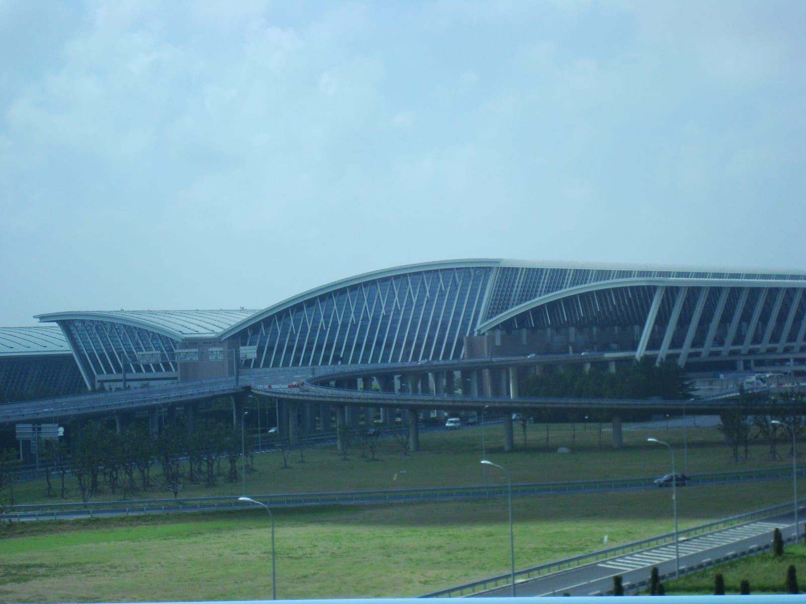
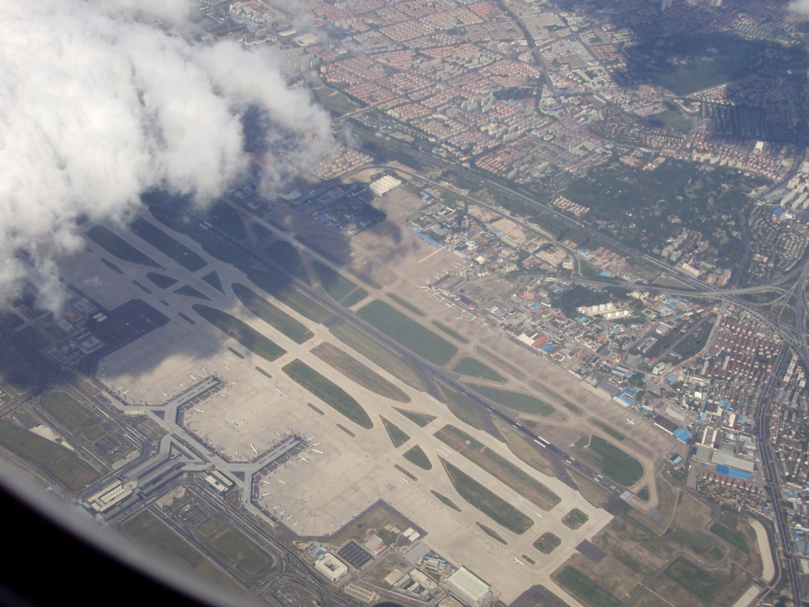
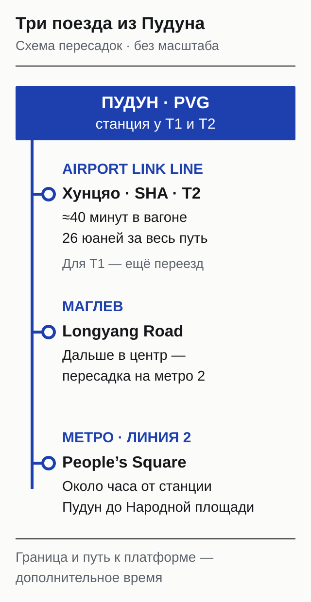
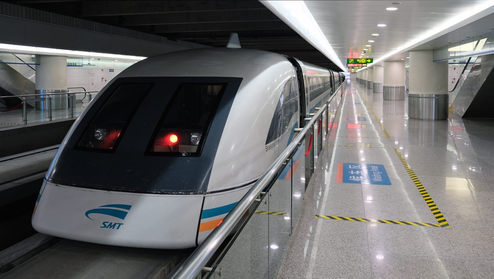
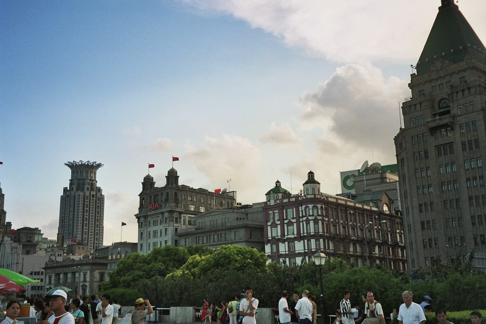
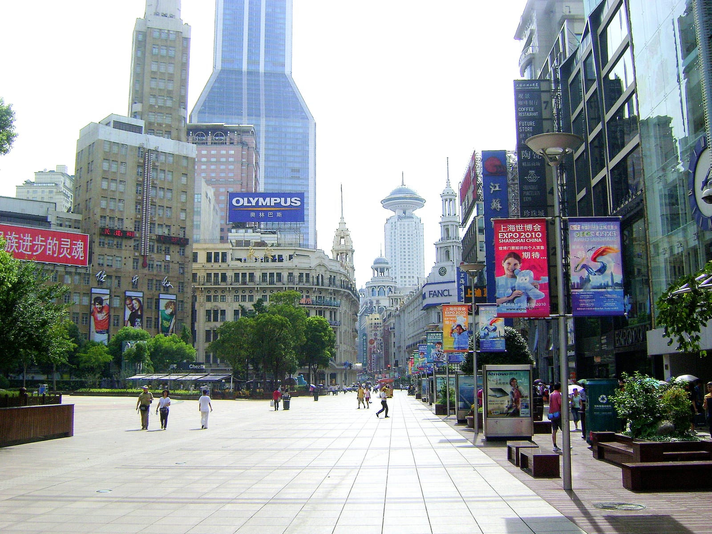

import { ostrovokCity } from '../../data/affiliate.js';

export const stay = ostrovokCity('china', 'shanghai', 'peresadka_v_shankhae_stay');

**При пересадке в Шанхае сначала проверьте три вещи: код аэропорта, порядок получения багажа и время следующего вылета.** Россиянину с обычным загранпаспортом для короткого выхода в город виза не нужна, но прогулка легко съедает запас на пересадку. Особенно если в билете прилёт в Пудун, а вылет из Хунцяо.

На длинной дневной стыковке можно увидеть набережную. На короткой лучше сразу найти следующий выход на посадку. Ночью полезнее заранее решить вопрос с кроватью и обратной дорогой: красивый вид из центра не поможет, если поезд в аэропорт не ходит.

## Пудун и Хунцяо: что проверить в билете

PVG — Пудун, SHA — Хунцяо; смена этих кодов означает поездку в другой аэропорт. Одинаковое слово Shanghai в двух строках бронирования ничего не гарантирует. Откройте подробности каждого рейса, включая перевозчика, который его выполняет, аэропорт и терминал.

В Пудуне есть терминалы T1 и T2. У Хунцяо тоже есть T1 и T2 — это ещё одна причина смотреть весь маршрут. Переход из T1 в T2 одного аэропорта и поездка из PVG в SHA требуют разного запаса времени. Внутри Пудуна между основными терминалами ходит бесплатный автобус, но возможность воспользоваться им зависит от того, вышли ли вы из транзитной зоны.

Проверьте и устройство покупки. Два рейса, показанные на одном экране агрегатора, могут продаваться как самостоятельная пересадка. Найдите условия именно своего билета: кто перебронирует следующий рейс при задержке первого, нужно ли получать чемодан и проходить новую регистрацию. Сохраните ответ перевозчика, а не только красивую карточку маршрута.

*Терминал T1 Пудуна, архивный кадр. Фото: dani / [Wikimedia Commons](https://commons.wikimedia.org/w/index.php?curid=76649473), [CC BY 2.0](https://creativecommons.org/licenses/by/2.0/).*

## Нужно ли получать багаж при пересадке в Шанхае?

**Универсального ответа по названию авиакомпании нет: порядок зависит от конкретных рейсов и оформления чемодана.** На первой регистрации задайте два разных вопроса: до какого города оформлен багаж и нужно ли физически забирать его в Шанхае для таможни или пересдачи.

Код конечного аэропорта на бирке полезен, но сам по себе не отменяет таможенную процедуру. Попросите сотрудника проговорить маршрут после посадки: идти по указателям Transfer или на получение багажа. Сохраните бирку до завершения поездки. Лекарства, документы, зарядку и вещи на одну ночь положите в ручную кладь: доступа к сквозному чемодану на стыковке может не быть.

В Шанхае работают соглашения между разными перевозчиками, в том числе China Eastern, Shanghai Airlines и Juneyao. Это не означает, что любой их билет автоматически подходит. Даже **при смене PVG на SHA** China Eastern может перевезти чемодан между аэропортами на подходящем маршруте. Подтверждение должно относиться к вашим рейсам и дате.

Если сквозную услугу не подтвердили, считайте пересадку с получением багажа, выходом через границу и новой сдачей. При раздельных билетах дополнительно проверьте время закрытия регистрации: покупка следующего рейса не держит стойку открытой ради опоздавшего пассажира.

## Как переехать из Пудуна в Хунцяо

**Между аэропортами ходит Airport Link Line: около 40 минут в поезде и примерно 330 ₽ за полный маршрут, или 26 юаней.** Линия соединяет станцию Pudong Airport T1 & T2 со станцией Hongqiao Airport Terminal 2. Поезда идут примерно каждые 15 минут.

Сорок минут — время в вагоне. До него ещё будут выход из самолёта, граница, возможно чемодан и дорога к платформе. После него — путь в нужный терминал, регистрация и досмотр. Если в билете вылет из **T1 Хунцяо**, после Airport Link нужен ещё переезд к первому терминалу: к нему подходит линия метро 10. Не путайте аэропорт с соседним железнодорожным вокзалом Hongqiao Railway Station.

*Airport Link Line — поезд между аэропортами. Фото: Greencarp / [Wikimedia Commons](https://commons.wikimedia.org/w/index.php?curid=157057663), [CC0](https://creativecommons.org/publicdomain/zero/1.0/).*

Пересадка между PVG и SHA требует въезда в Китай. Закрытого транзитного коридора через город нет. На короткой стыковке я бы выбирал билет без смены аэропорта; на длинной — сначала проверил расписание поезда именно в нужную сторону и возможность сквозного багажа. Ночной переезд нельзя рассчитывать по дневному интервалу.

*Хунцяо с высоты, архивная фотография, не схема действующих выходов. Фото: Zakaria55 / [Wikimedia Commons](https://commons.wikimedia.org/w/index.php?curid=21918322), [CC BY-SA 3.0](https://creativecommons.org/licenses/by-sa/3.0/).*

## Можно ли выйти в город без визы?

**Да: обычный российский загранпаспорт позволяет въехать в Китай без визы на срок до 30 дней, политика действует до 31 декабря 2027 года.** Транзит входит в разрешённые цели. Паспорт должен быть действительным на время пребывания; билеты дальше и бронь жилья, если ночуете, держите под рукой.

Не смешивайте этот порядок с отдельными правилами безвизового транзита. Для обычного безвиза не требуется билет именно в третью страну. Старые инструкции о 144 часах и обязательном Temporary Entry Permit описывают другой режим. Въезд всё равно оформляет пограничная служба: наличие безвиза не превращает прогулку в проход без контроля.

Если паспорт другой страны, не переносите на себя российские условия. Сверьте своё гражданство, документы и маршрут в [разделе о въезде в Китай](/visa/china/). При пересадке на внутренний китайский рейс вопрос въезда возникает независимо от желания погулять: дальше вы летите внутри страны.

## Восемь часов между рейсами — сколько останется на город?

**Считайте прогулку назад от следующего вылета: сначала резерв в аэропорту, затем обратная дорога.** Восемь часов в билете не равны восьми часам на улицах Шанхая. Ни один универсальный запас не заменяет правила регистрации и посадки вашей авиакомпании.

Возьмём пример: самолёт прилетает в PVG в 09:00, следующий международный рейс вылетает оттуда же в 17:00. Вышли из аэропорта в 10:30. Отвели по 75 минут на дорогу от терминала до прогулки и обратно, включая ожидание и переходы. Решили быть в терминале в 14:30, за два с половиной часа до вылета. Получилось окно **11:45–13:15 — всего полтора часа**.

Это расчёт с выбранными допущениями, не обещание очередей и не официальный минимум стыковки. Если выход занял на час больше, прогулка сократилась до получаса. Если нужно снова сдавать багаж или менять аэропорт, такой план лучше отменить. При вылете в 19:00 и тех же условиях городское окно увеличится до трёх с половиной часов.

| Ваша ситуация | Разумный план |
|---|---|
| Короткая стыковка, следующий рейс скоро | Найти транзитный маршрут и выход на посадку |
| Около восьми часов днём, один аэропорт, багаж оформлен | Решать после границы; максимум одна короткая прогулка |
| Десять часов и больше днём | Один район с едой, без плотной цепочки музеев |
| Ночь между рейсами | Проверить отдых или гостиницу и обратный транспорт |
| Разные аэропорты | Сначала переезд и процедуры; город — только из оставшегося запаса |

Поставьте на телефоне время разворота обратно. Если опаздываете к нему, сокращайте маршрут, а не резерв перед самолётом. С детьми, ограниченной подвижностью или большим чемоданом переходы займут больше времени — это хороший повод выбрать отдых в аэропорту.

## Метро, маглев и прогулка у набережной

Из Пудуна в центр можно ехать по линии метро 2; маглев довозит только до Longyang Road. До Народной площади, People's Square, метро идёт около часа, поездка стоит примерно 90 ₽, или 7 юаней. Переходы по аэропорту в этот час не входят.

Маглев хорош, если хочется прокатиться на самом поезде. После него всё равно придётся пересаживаться на городской транспорт. Airport Link Line решает третью задачу — связывает Пудун с Хунцяо. Названия трёх линий легко спутать, поэтому перед турникетом сверяйте конечную станцию.

*Маглев на обложке и здесь — линия до Longyang Road. Фото: kallerna / [Wikimedia Commons](https://commons.wikimedia.org/w/index.php?curid=85832560), [CC BY-SA 4.0](https://creativecommons.org/licenses/by-sa/4.0/).*

Первую короткую прогулку можно ограничить восточной частью Нанкинской улицы и набережной Вайтань, которую на английских указателях называют The Bund. Выходите на станции East Nanjing Road, идите к реке, посмотрите на башни через Хуанпу и возвращайтесь тем же понятным путём. Не добавляйте подъём на смотровую: очередь и контроль билета превращают свободную прогулку в ещё одно расписание.

*Вайтань, 2006 год: архивный вид исторической застройки. Фото: Don-kun / [Wikimedia Commons](https://commons.wikimedia.org/w/index.php?curid=6690176), [CC BY 3.0](https://creativecommons.org/licenses/by/3.0/).*

Если после дороги на прогулку осталось больше трёх часов, можно спокойно поесть и пройти часть Нанкинской улицы. На стыковке я бы не соединял набережную, сад Юйюань и Диснейленд: это несколько самостоятельных поездок. Для полноценного возвращения пригодится [гайд по Китаю с выбором сезона и региона](/blog/china-guide-2026/).

*Нанкинская улица, архивный кадр. Фото: Lars Curfs (Grashoofd) / [Wikimedia Commons](https://commons.wikimedia.org/w/index.php?curid=33559073), [CC BY-SA 3.0 NL](https://creativecommons.org/licenses/by-sa/3.0/nl/deed.en/).*

## Где отдохнуть ночью и когда нужен отель

**При ночной пересадке выбирайте место сна вместе с дорогой обратно, а не только по цене номера.** В Пудуне есть зоны отдыха, отдельные кабины, круглосуточные душевые и гостиничные предложения на несколько часов. Доступ из вашей зоны и свободные места уточняйте у стойки информации до выхода через границу.

Бесплатный транзитный отель авиакомпании — отдельная услуга с условиями. Длинная пересадка сама по себе его не обещает. Проверьте право на услугу по своему билету, получите подтверждение брони, узнайте место встречи и время обратного трансфера. Если перевозчик предлагает несколько вариантов отдыха, уточните, можно ли их сочетать.

Для самостоятельной ночёвки <a href={stay} class="aff-cta" rel="sponsored">подберите гостиницу в Шанхае на свои даты</a> и проверьте адрес относительно аэропорта вылета. Слово Pudong в названии может обозначать большой городской район. Напишите отелю точное время прилёта и вылета: поздняя регистрация и утренний трансфер должны подходить вам, а не присутствовать в списке удобств.

Для дневных стыковок в Пудуне больше восьми часов существуют и бесплатные экскурсии. Это вариант после подтверждения записи, права въезда и времени возврата; он не заменяет самостоятельный расчёт. Не покупайте короткую стыковку только ради обещания бесплатной прогулки.

## Что пишут путешественники о пересадке в Шанхае

Для этого разбора прочитаны шесть сообщений четырёх участников ветки China Eastern на форуме Винского за 30 августа — 14 сентября 2026 года. **Это выборка, представительной её считать нельзя.** Два сообщения относятся к подготовке и результату одной поездки.

В двух отчётах от 14 сентября чемоданы дошли через Шанхай до конечного города. В одном случае предупреждение агрегатора требовало получить багаж, но на регистрации его оформили дальше. Это причина задать вопрос перевозчику, а не считать скриншот бронирования последним словом.

С гостиницей разброс заметнее. В сообщении от 13 сентября завтрак фигурировал в условиях бронирования; в отчёте другого пассажира от 14 сентября питание в проживание не входило, а отель оказался далеко от метро. Подтверждённый бесплатный номер ещё не означает бесплатный ужин или удобный выход к достопримечательностям.

## Частые вопросы о пересадке в Шанхае

**Хватит ли полутора часов в Пудуне?**

Это зависит от сочетания рейсов, терминалов и допуска перевозчика к такой стыковке. Для раздельных билетов с получением багажа такой запас я бы не выбирал. Если билет куплен, запросите у выполняющей рейс авиакомпании порядок пересадки и действия при задержке. Прогулку в город здесь планировать не стоит.

**Можно ли выйти в город на восемь часов?**

Восемь часов между самолётами — не восемь часов прогулки. Право въезда и запас времени проверяют отдельно. В примере с Пудуном после границы, двух поездок и резерва перед вылетом осталось полтора часа. Решение принимайте по фактическому времени выхода из терминала, а при задержке откажитесь от города.

**Нужен ли россиянину билет в третью страну?**

Для обычного безвиза по российскому загранпаспорту это не обязательное условие. Требование третьей страны относится к отдельному транзитному режиму. При этом билет следующего рейса полезно иметь под рукой: он объясняет цель и срок короткого въезда, а перевозчику нужен для оформления вашей пересадки и багажа.

**При рейсе из Шанхая на Хайнань нужно проходить границу?**

Да, после международного прилёта дальше следует внутренний китайский рейс. Порядок с чемоданом уточняйте отдельно: прохождение границы пассажиром и сквозная перевозка багажа — разные процедуры. Название China Eastern на билете само по себе не подтверждает, что именно на этом маршруте чемодан не придётся получать.

**Всегда ли забирают багаж при смене аэропорта?**

Нет. Для подходящих маршрутов China Eastern действует перевозка багажа между Пудуном и Хунцяо. Но это нужно подтвердить для своих рейсов, а не выводить из чужого удачного опыта. Без подтверждения оставляйте время на получение и новую сдачу; сами между аэропортами вы переезжаете через город после въезда в Китай.

**Маглев довезёт из Пудуна в Хунцяо?**

Нет, его конечная станция в городе — Longyang Road. Между аэропортами работает другая линия, Airport Link Line, до T2 Хунцяо. Проверьте терминал следующего рейса: если нужен T1, после поезда остаётся дополнительный переезд. Время в вагоне не включает паспортный контроль, ожидание и дорогу к стойке регистрации.

**Можно ли оставить чемодан и погулять налегке?**

Если багаж оформлен до конечного города и получать его не требуется, он продолжит путь без вашей прогулки. Если чемодан у вас, сначала уточните у аэропортовой стойки информации доступную камеру хранения, её часы и обратный маршрут. Не выходите к поезду, рассчитывая найти удобное хранение по дороге.

**Бесплатный отель положен всем пассажирам China Eastern?**

Нет, рассчитывать на него только по названию авиакомпании нельзя. Нужны подходящий билет и подтверждение услуги. До поездки выясните, где встречают пассажиров, входит ли питание и когда везут обратно. Для семьи отдельно проверьте, что в бронировании отеля указаны все путешественники, а не только владелец аккаунта.

**Что делать, если пересадка приходится на ночь?**

Сначала проверьте, сможете ли отдохнуть в своей зоне аэропорта. Если выбираете гостиницу снаружи, учтите прохождение границы, позднее заселение и обратный трансфер. Дневное расписание метро не подходит для ночного плана; короткая ночь легко превращается в две поездки почти без сна. Иногда остаться в терминале практичнее.

**Что подготовить на телефоне до прилёта?**

Сохраните билеты обоих рейсов, аэропорт и терминал вылета, подтверждение гостиницы или транзитной услуги, адрес места встречи и время возвращения. Держите копии доступными без интернета. Для связи заранее разберите [eSIM и роуминг за границей](/blog/esim-zagranicey-2026/), а для трат — [способы оплаты в поездке](/blog/pay-abroad-2026/).

Если сравниваете варианты перелёта через Китай, рядом есть отдельный [разбор пересадки в Пекине](/blog/peresadka-v-pekine/): его аэропорты и условия пересадки отличаются от шанхайских.
