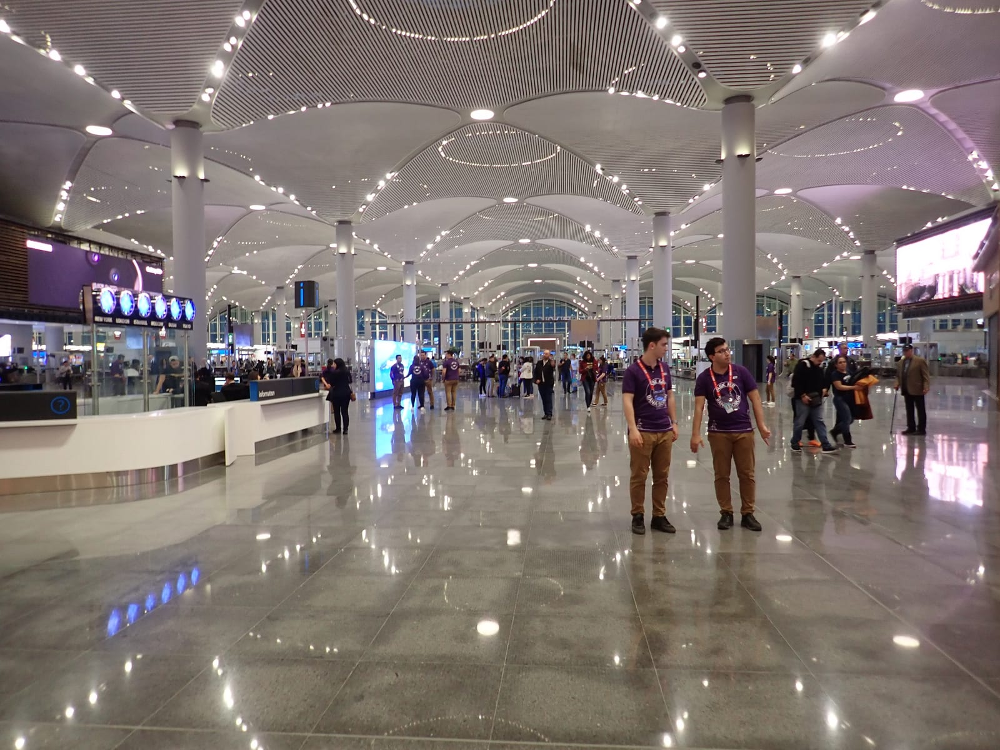
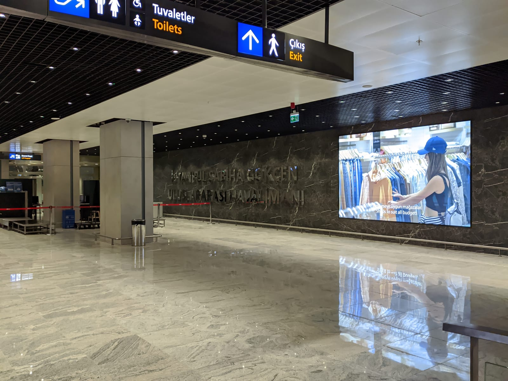
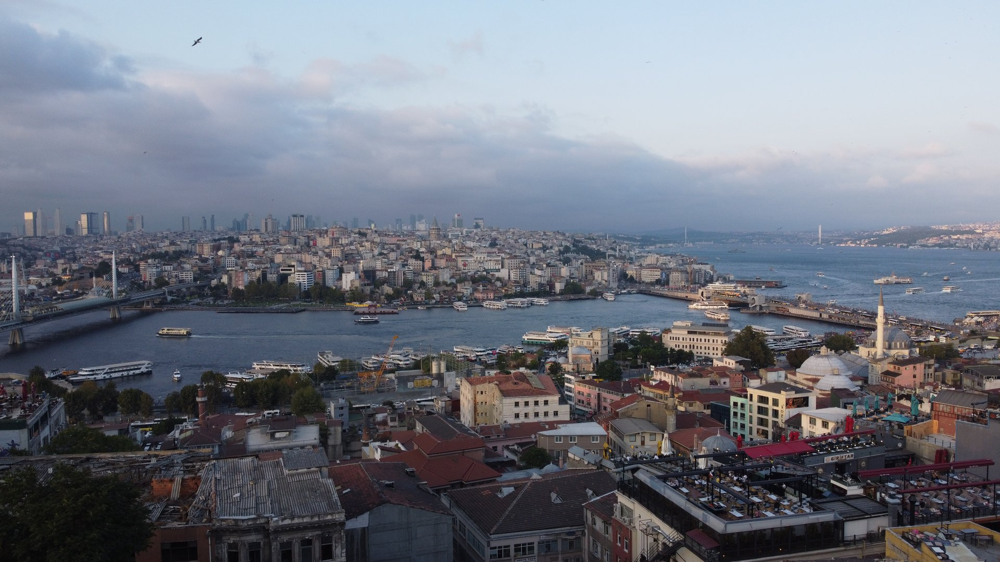
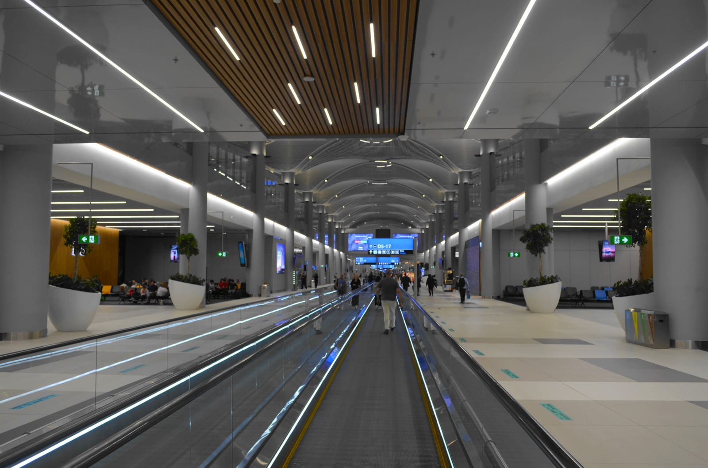

import { aviasalesRoute, ostrovokCity } from '../../data/affiliate.js';

export const flights = aviasalesRoute('MOW', 'IST', 'peresadka_stambul_flights');
export const hotels = ostrovokCity('turkey', 'istanbul', 'peresadka_stambul_hotels');

**При пересадке в Стамбуле россиянин может выйти в город без визы, если соблюдены условия въезда.** Но сначала проверьте три вещи: аэропорт следующего вылета, единый или раздельный билет и конечный пункт на багажной бирке. Они определяют, можно ли остаться в транзитной зоне и сколько времени останется на прогулку.

Два часа между рейсами — задача дойти до выхода на посадку. Десять часов днём могут оставить время на город. Ночь между рейсами требует отдельного решения: бесплатный отель Turkish Airlines положен не каждому пассажиру с длинной пересадкой.

## Сначала билет: IST, SAW и кто отвечает за стыковку

**IST — аэропорт Стамбул, SAW — Сабиха Гёкчен. Это разные аэропорты по разные стороны Босфора.** Надписи «Стамбул» в поиске билетов недостаточно: сравните трёхбуквенные коды прилёта и вылета в маршрутной квитанции. Если коды различаются, понадобится въезд в Турцию и наземный переезд. Перехода между терминалами здесь нет.

Следующий вопрос — один ли это билет со стыковкой, которую оформил перевозчик. Одна покупка на сайте посредника ещё не означает единый билет: в ней могут собрать самостоятельные рейсы. Ищите пометку «самостоятельная пересадка», условия при опоздании и номера электронных билетов. Если ответ неясен, задайте продавцу конкретный вопрос: «Кто переоформит второй рейс при задержке первого?»

Для короткой пересадки выбирайте один аэропорт и единый билет. К стоимости раздельных билетов добавьте расходы на багаж, ночёвку и возможный новый перелёт. При отдельной остановке в городе можно <a href={flights} rel="sponsored">сравнить перелёты Москва — IST</a>; в результате поиска всё равно проверьте код аэропорта каждого рейса и условия пересадки.

| Маршрут | Первое действие после прилёта |
| --- | --- |
| Международный → международный, один билет и аэропорт | Следовать указателям International Transfer; проверить следующий выход |
| Раздельные билеты, багаж только до Стамбула | Пройти границу, получить чемодан и зарегистрировать его заново |
| Международный → внутренний рейс по Турции | Пройти въездной контроль; порядок получения багажа уточнить по своему билету |
| Прилёт IST, вылет SAW или наоборот | Въехать в Турцию, забрать багаж по условиям перевозки и переехать в другой аэропорт |

*Зал аэропорта IST. Архивный кадр показывает масштаб терминала; нужный выход ищите по табло своего рейса.*

## Нужно ли забирать багаж в Стамбуле

**Решает багажная бирка и оформление перевозки, а не только название авиакомпании.** До вылета попросите сотрудника показать, до какого аэропорта зарегистрирован чемодан. Сохраните отрывную часть бирки до получения багажа.

У Turkish Airlines на международном маршруте по одному билету, в том числе с подходящим партнёрским соединением, багаж обычно отправляют до конечного пункта. Для перехода между международными рейсами проходить турецкую границу не требуется. При отдельных билетах рассчитывайте на получение и новую сдачу чемодана, пока перевозчик явно не подтвердит другое оформление.

Отсутствие посадочного на второй рейс само по себе не означает обязательный выход в город: сначала обратитесь к стойке трансфера. Но наличие ручной клади вместо чемодана тоже не гарантирует транзит без границы. Перевозчик следующего рейса должен уметь оформить вас внутри транзитной зоны; проверьте это заранее, если билеты раздельные.

На рейсе дальше по Турции паспортный контроль будет в первом турецком аэропорту. С багажом возможны разные схемы в зависимости от билета, таможенного оформления и конечного аэропорта — уточняйте их при первой регистрации. Совет «на внутреннюю пересадку всегда забирайте чемодан» слишком грубый.

Положите лекарства, зарядку и вещи на ночь в ручную кладь. Если чемодан зарегистрирован до конечного пункта, получить его только ради прогулки или душа обычно не получится по собственному желанию. При Stopover дольше 24 часов Turkish Airlines требует забрать багаж в Стамбуле.

## Можно ли выйти из аэропорта и нужна ли виза

**С обычным российским загранпаспортом туристический въезд разрешён без визы на срок до 60 дней за поездку.** Общий предел пребывания — 90 дней в любые 180 дней. Несколько часов на пересадке не отменяют предыдущие поездки: если лимит исчерпан, рассчитывать на новый въезд нельзя.

Срок паспорта должен покрывать разрешённое пребывание и ещё 60 дней. Для 60-дневного безвиза это даёт не менее 120 дней со дня въезда. Билет дальше, условия въезда в конечную страну и документы детей проверяются отдельно. Для другого гражданства смотрите свой визовый режим: российский безвиз к нему не относится.

Выход начинается с паспортного контроля. За границей вас не «держит» транзитный билет, но и авиакомпания не выдаёт разрешение на въезд вместо пограничника. Скачайте посадочный, маршрут и бронь ночёвки до выхода из аэропортового Wi-Fi. Часы в билетах указаны местные: сверяйте ещё и дату, особенно если следующий вылет после полуночи.

Если впереди обычная поездка по стране, пригодится [гайд по Турции](/blog/turkey-guide-2026/). Эта статья помогает решить, стоит ли тратить ограниченное окно между самолётами на город.

## Сколько часов оставить на прогулку

Считайте время от обратного рейса, а не от посадки первого самолёта. Из окна пересадки вычтите выход из самолёта и границу, дорогу в обе стороны, возвращение к регистрации и контролю. Для международного вылета Turkish Airlines рекомендует прибыть в аэропорт за три часа; оформление и сдача багажа заканчиваются раньше самого вылета, обычно за час.

Ниже условный пример для десятичасовой дневной стыковки. Полтора часа на выход и по полтора часа на дорогу — заложенные резервы, не измеренное время очередей и не обещание скорости такси. На прогулку остаётся два с половиной часа. Задержка первого рейса уменьшает именно этот отрезок.

<figure style={{maxWidth:'440px',margin:'2rem auto'}}>
  <svg viewBox="0 0 360 458" width="100%" role="img" aria-labelledby="istanbul-time-title istanbul-time-desc">
    <title id="istanbul-time-title">Как десять часов пересадки превращаются в два с половиной часа в городе</title>
    <desc id="istanbul-time-desc">Пример: прилёт в 8, выход к 9:30, город с 11 до 13:30, возвращение к 15, следующий вылет в 18. Длины цветных участков пропорциональны времени.</desc>
      <g fontFamily="var(--ff-body)" fill="currentColor">
      <text x="18" y="25" fontSize="18" fontWeight="600">10 часов между самолётами</text>
      <rect x="92" y="55" width="16" height="54" fill="#1d40ae" opacity=".35" />
      <rect x="92" y="109" width="16" height="54" fill="#1d40ae" opacity=".65" />
      <rect x="92" y="163" width="16" height="90" fill="#1d40ae" />
      <rect x="92" y="253" width="16" height="54" fill="#1d40ae" opacity=".65" />
      <rect x="92" y="307" width="16" height="108" fill="#1d40ae" opacity=".35" />
      <g fontFamily="PT Mono, monospace" fontSize="15" textAnchor="end">
        <text x="80" y="60">08:00</text><text x="80" y="114">09:30</text>
        <text x="80" y="168">11:00</text><text x="80" y="258">13:30</text>
        <text x="80" y="312">15:00</text><text x="80" y="420">18:00</text>
      </g>
      <g fontSize="15">
        <text x="126" y="86">Самолёт → граница → выход</text>
        <text x="126" y="140">Дорога в город</text>
        <text x="126" y="200" fontWeight="600">Прогулка: 2½ часа</text>
        <text x="126" y="222">Один район, без гонки</text>
        <text x="126" y="286">Дорога обратно</text>
        <text x="126" y="352">Снова в аэропорту</text>
        <text x="126" y="376">Контроль и посадка</text>
      </g>
      <text x="18" y="451" fontSize="13">Пример расчёта — подставьте свои часы и запас.</text>
    </g>
  </svg>
</figure>

С двумя-тремя часами оставайтесь в аэропорту и сразу ищите следующий выход. С шестью часами самостоятельная прогулка даёт слишком мало запаса: подходящую экскурсию перевозчика оценивают по её отдельному расписанию. Для восьми-девяти часов расчёт имеет смысл, но это не разрешение ехать к любой достопримечательности. Десять-двенадцать часов днём удобнее для одного района и обеда.

Ночью тот же запас часто полезнее потратить на сон. Поздний прилёт, ранний вылет, усталость после длинного рейса и дети меняют решение сильнее, чем красивая цифра «9 часов» в билете. Не планируйте прогулку, которой придётся пожертвовать сном и запасом на возвращение одновременно.

## Куда ехать из IST и из Сабихи

Выбирайте один район с понятной дорогой обратно. Из IST линия M11 связывает аэропорт с Gayrettepe, где можно пересесть на M2. Это направление удобно рассматривать для европейской части города. Но поезд до пересадочной станции — ещё не дорога до Галатской башни или Султанахмета: остаются переходы, ожидание и пеший участок.

Из SAW линия M4 идёт в сторону Kadıköy. Для короткого знакомства азиатский берег часто разумнее, чем попытка успеть ещё и на европейский. На паром, дополнительную ветку метро и достопримечательность с очередью понадобится отдельный запас.

*Сабиха Гёкчен — отдельный аэропорт. Надпись на билете и код SAW важнее общего слова «Стамбул».*

Проверьте часы движения на день поездки. Не переносите дневной маршрут на ночную стыковку автоматически: наличие метро не означает, что нужный поезд будет ходить в час вашего возвращения. Такси избавляет от пересадок, но не от дорожной обстановки. Перед прогулкой сохраните точный адрес аэропорта вылета и время, когда пора ехать назад.

Я бы выбрал набережную и обед вместо попытки собрать несколько музеев. Купленный входной билет может привязать к неудобному часу, а очередь отнять тот запас, который нужен на дорогу. Более длинный маршрут оставьте для отдельной остановки на одну-две ночи.

*Золотой Рог и мосты Стамбула, август 2021 года. Для короткой остановки хватит прогулки по одному берегу.*

## Три бесплатные программы Turkish Airlines

Touristanbul, Hotel Service и Stopover решают разные задачи. Длительность пересадки — только первое условие. Проверьте номер билета, фактического перевозчика, маршрут и оформление услуги до того, как рассчитывать на бесплатную ночь.

| Программа | Когда имеет смысл проверять | Что может помешать |
| --- | --- | --- |
| Touristanbul — экскурсия | Международная пересадка в IST 6–24 часа, подходящее время тура, билет Turkish Airlines на 235, рейсы в одной брони | Расписание тура не помещается в стыковку; нужно пройти границу и явиться к стойке за 30 минут до начала |
| Hotel Service — отель при долгой стыковке | Международное соединение от 12 часов в экономклассе или от 9 в бизнесе, единый подтверждённый билет | На маршруте есть более короткая стыковка: даже отсутствие свободных мест на ней не даёт права на отель |
| Stopover — заранее выбранная остановка | От 20 часов до 7 дней в IST, поездка туда-обратно в одной брони, подходящая страна начала путешествия | Нет заранее выданного ваучера; не соблюдены условия билета, маршрута или класса бронирования |

**[Touristanbul](https://www.turkishairlines.com/en-int/flights/fly-different/touristanbul/faq/).** Начните с проверки доступного тура в бронировании. У стойки в транзитной зоне можно уточнить право участия, а регистрация проходит в зале прилёта после границы. Между окончанием тура и следующим вылетом требуется не меньше часа и 25 минут. Это условие организованной экскурсии, его нельзя переносить на самостоятельную прогулку. На совместном рейсе подтвердите участие по конкретному билету: одного логотипа TK недостаточно. На одной стыковке экскурсия не совмещается с бесплатным отелем ни по Hotel Service, ни по Stopover.

**[Hotel Service](https://www.turkishairlines.com/en-tr/flights/hotel-service/).** Если подходите под условия, обращайтесь в Hotel Desk после выхода в зал прилёта. Для совместного рейса в этой программе нужен фактический перевозчик Turkish Airlines. Гостиницу выбирает авиакомпания, перевозка до неё входит в услугу. Это не обещание номера прямо в транзитной зоне: для выезда потребуется право въезда в Турцию. Добровольно выбрать более долгую стыковку и автоматически получить отель не выйдет.

**[Stopover](https://www.turkishairlines.com/ru-ru/flights/stopover/).** Заявка подаётся не позднее чем за 72 часа до нужного рейса; ваучер оформляют до начала поездки. Россия есть в списке стран отправления. Базово экономкласс получает одну ночь, бизнес — две; правила отдельных стран могут отличаться. Все перелёты должны выполняться Turkish Airlines, номер билета начинается с 235, страна начала и конца всей поездки совпадает. Отдельные билеты туда и обратно и совместные рейсы не подходят; классы N и R исключены. Включены отель и завтрак, а дорогу между аэропортом и гостиницей пассажир оплачивает сам.

*Траволатор в IST. Архивный снимок; нужный выход и время посадки проверяйте на табло своего рейса.*

## Где спать, если бесплатный отель не положен

Сначала выберите сторону границы, затем гостиницу. В IST названия YOTEL и YOTELAIR похожи, но доступ различается. YOTELAIR находится внутри международной транзитной зоны; нужен действующий посадочный на международный рейс. YOTEL Landside расположен с городской стороны. При международном прилёте для него придётся пройти паспортный контроль.

Если чемодан нужно получать и снова сдавать, не бронируйте номер в транзитной зоне, пока не выясните, сможете ли туда попасть в нужный час. Для внутреннего рейса или смены аэропорта удобство такого номера тоже исчезает. Бесплатная программа и платный отель в терминале — разные услуги.

Для ночи с выходом в город <a href={hotels} rel="sponsored">посмотрите гостиницы Стамбула</a> и сразу откройте карту относительно **своего** аэропорта. Подборка общегородская: она не гарантирует пешую доступность терминала или трансфер. Уточните позднее заселение, время обратной машины, стоимость дороги и правила отмены. Отель дешевле на одну ночь может оказаться дороже с двумя поездками.

Если остановка занимает сутки и больше, можно выбрать район ради прогулки. Для короткой ночи приоритет другой: добраться, поспать и вовремя вернуться. Сравнивать предложения стоит по общей сумме и часам сна, а не только по цене номера.

## Что проверить перед первым вылетом

Откройте билет и запишите **IST или SAW**, местную дату следующего рейса, условия самостоятельной пересадки и конечный пункт багажа. Сохраните посадочные и контакты перевозчика офлайн. Для выхода в город проверьте паспорт и остаток разрешённого пребывания, а для ночёвки — сторону границы, адрес и время заселения.

На первой регистрации задайте два коротких вопроса: «Чемодан получаю в Стамбуле или в конечном аэропорту?» и «Где получить следующий посадочный, если сейчас его не выдали?» Ответы полезнее универсального совета о минимальных часах пересадки. При задержке обращайтесь к сотрудникам перевозчика сразу, не тратьте короткое окно на магазины.

Если сравниваете маршрут через несколько стран, правила будут различаться. Отдельно разобраны [пересадка в Пекине](/blog/peresadka-v-pekine/) и [пересадка в Шанхае](/blog/peresadka-v-shankhae/): переносить их порядок границы и багажа на Стамбул нельзя.
