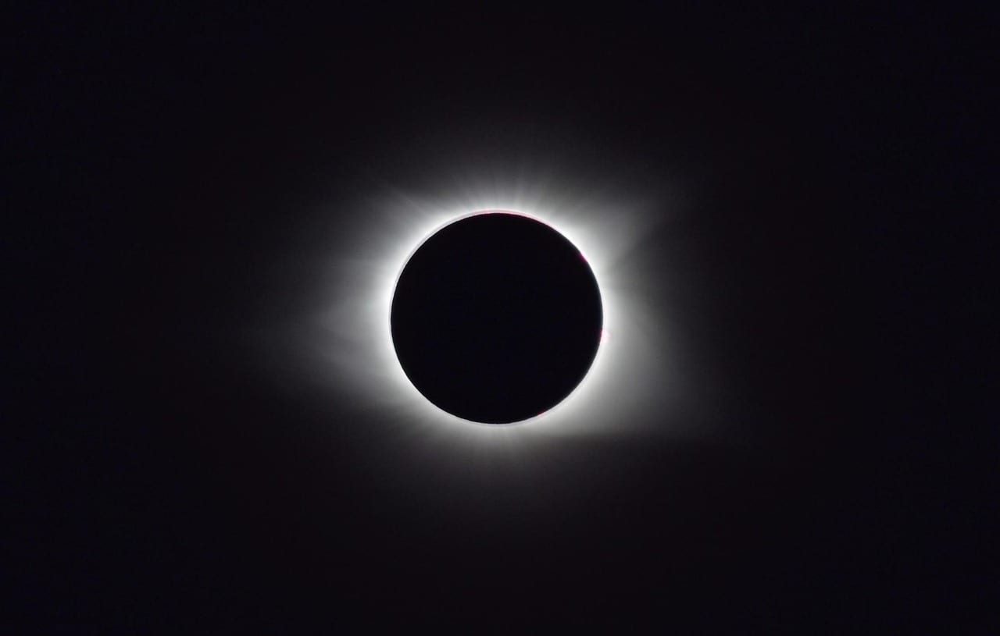
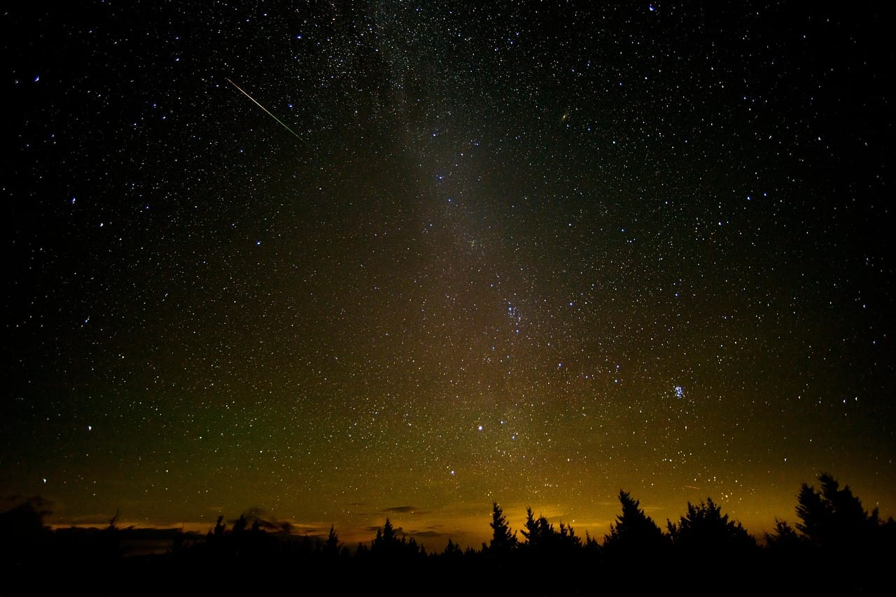
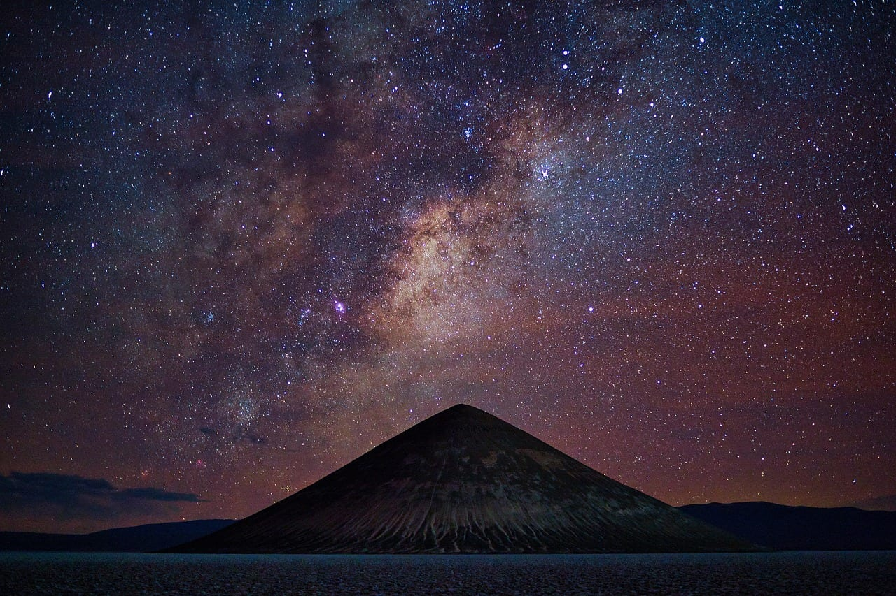
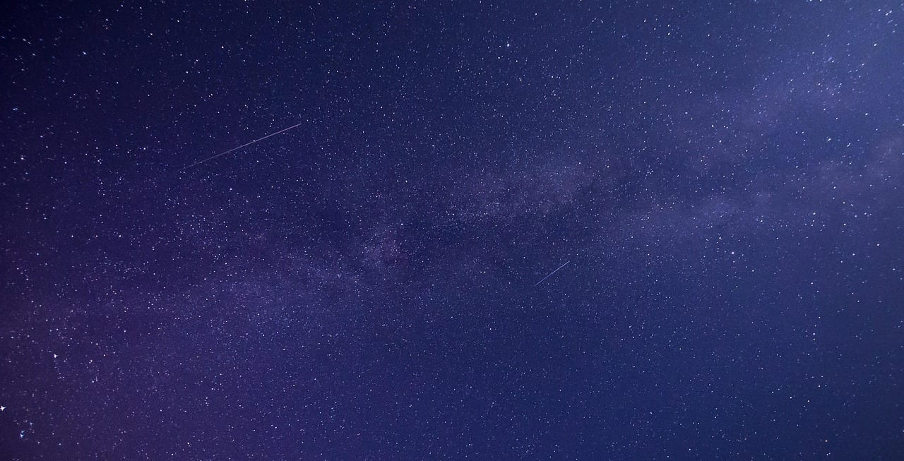

import AffiliateNote from '../../components/post/AffiliateNote.astro';
import { otelloStay } from '../../data/affiliate.js';

Одну и ту же ночь обещают как событие десятилетия и как «ничего особенного» — и оба раза говорят правду — только про разные места. 12 августа Луна прошла перед Солнцем, а через несколько часов Земля влетела в шлейф кометы Свифта-Туттля, и начался звездопад. Разбираю по расчётам обсерваторного календаря, что из этого реально увидит человек в Москве, в Питере и за городом.

> **Если коротко:** затмение 12 августа в России **частное и на самом закате**. В Москве Луна закрыла всего **9% диаметра** Солнца, и всё это уложилось в **девять минут** — с 20:03 до 20:12, когда светило уже касается горизонта. В Петербурге и Калининграде куда интереснее: **83–85%** закрытого диска, но тоже у горизонта, так что нужен открытый вид на запад-северо-запад. Полная фаза в России есть — на побережье Таймыра около полуночи, куда без экспедиции не добраться. Главное событие для всех остальных — **ночь с 12 на 13 августа**: пик Персеид совпал с новолунием, и под тёмным небом идёт **30–50 метеоров в час**. Ехать за этим нужно недалеко: хватит 100–150 км от города. Следующий заметный поток — Ориониды в октябре, и ночёвку под него ищут заранее: <a href={otelloStay('perseidy_2026')} class="aff-cta" rel="sponsored">посмотреть домики и гостевые дома рядом</a> — Отелло, оплата картой РФ, бронь подтверждается сразу.

<AffiliateNote />

---

## Что вообще происходит 12 августа 2026 года?

**Полное солнечное затмение и пик самого популярного звездопада года попали в одни сутки.** Совпадение не случайное: Персеиды всегда сильнее всего в середине августа, а полная фаза затмения бывает только в новолуние — то есть в ту самую ночь, когда Луна не мешает смотреть на метеоры. Такое сочетание выпадает редко, и следующего похожего ждать долго.

Так выглядит полная фаза — из России 12 августа её не было видно нигде, кроме высоких широт Арктики. Кадр снят в США в 2017 году.

Полоса полного затмения прошла по Гренландии, западной Исландии и северу Испании — там перед самым закатом на минуту-две наступили сумерки: Солнце в момент полной фазы стояло всего в 8–13 градусах над горизонтом. Всё, что восточнее, видит частные фазы: Луна откусывает от солнечного диска кусок тем меньше, чем дальше вы от полосы.

Россия оказалась на самом краю этой картины, и отсюда все разночтения в новостях. Формально полная фаза у нас есть. Практически — увидеть её могут разве что полярники.

---

## Во сколько смотреть затмение и сколько будет видно?

**Всё произошло на закате 12 августа, и чем западнее город, тем больше повезёт.** Времена ниже — по расчёту календаря затмений timeanddate для конкретных точек, местное время:

| Город | Начало | Максимум | Закрыто | Солнце садится |
|---|---|---|---|---|
| Калининград | 19:10 | 20:02 | **85% диаметра** | 20:17 |
| Санкт-Петербург | 20:00 | 20:51 | **83%** | 21:00 |
| Москва | 20:03 | 20:08 | **9%** | 20:12 |

Разница между Москвой и Петербургом не в пару процентов, а на порядок. В столице Луна едва надкусит край диска, и через четыре минуты после максимума Солнце село. Высота светила в этот момент — две десятых градуса: это меньше половины видимого диаметра самого Солнца. То есть из окна, со двора и вообще откуда угодно, где есть дома и деревья, смотреть нечего. Нужна открытая высокая точка с чистым видом на запад-северо-запад — и даже там это будет надкушенный краешек, а не зрелище.

В Петербурге и Калининграде картинка настоящая: Солнце превращается в узкий рыжий серп у самого горизонта. Но условие то же — открытый горизонт, лучше берег залива, поле или крыша.

На севере — Мурманская область, Карелия, Архангельская область — затмение начинается раньше (в Мурманске в 19:44 по Москве) и тянется час сорок четыре — до 21:28, потому что Солнце там идёт вдоль горизонта, а не падает за него.

### А где в России видно полное затмение?

**На арктическом побережье Таймыра — около полуночи по местному времени.** Южная граница полосы прошла по морю, поэтому под полной фазой оказался берег Красноярского края, а не якутская суша. Полоса полной фазы задела бухту Марии Прончищевой и соседний Прончищева и соседнее побережье моря Лаптевых: там полная фаза длится считаные минуты, 12 августа около 23:58 по красноярскому времени. Это места без дорог и жилья, куда добираются экспедиционным транспортом.

Следующее полное солнечное затмение, которое можно будет застать в России в нормальных условиях, — 30 марта 2033 года. Для Москвы и Петербурга ждать придётся ещё дольше: следующая полная фаза над этими городами приходится на XXII век.

### Как смотреть, чтобы не сжечь глаза

Правило одно и без исключений: **на Солнце нельзя смотреть без специального фильтра**, даже когда от диска остался серп, даже у горизонта, даже «одну секундочку». Обычные солнцезащитные очки, закопчённое стекло, рентгеновская плёнка и дымка на горизонте не защищают.

Работают только очки для наблюдения затмений со стандартом ISO 12312-2 либо проекция: сделайте в картонке отверстие и смотрите не на Солнце, а на его изображение, спроецированное на белый лист. Через бинокль или объектив фотоаппарата без специального фильтра смотреть на Солнце опаснее всего — оптика собирает свет и сжигает сетчатку мгновенно, необратимо и без боли.

---

## Персеиды 2026: сколько метеоров реально увидеть?

**Под по-настоящему тёмным небом — 30–50 метеоров в час, а не сто с лишним.** Цифра «100–120» гуляет по новостям, потому что это ZHR — зенитное часовое число, идеализированный показатель: он считается для условий, когда точка вылета метеоров стоит прямо в зените, а небо идеально чёрное. Международная метеорная организация в своём календаре прямо пишет, чего ждать на практике: 30–50 метеоров в час за городом на пике.

Зато сам пик в этом году исключительно удачный. Он пришёлся на ночь с 12 на 13 августа, и в эту же дату новолуние — Луна освещена на 0% и не засвечивает небо вовсе. Метеоры Персеид быстрые, 59 км/с, часто с длинными следами, которые ещё секунду висят в воздухе после вспышки.

Смотреть лучше **после полуночи и до рассвета**: к этому времени точка вылета метеоров в созвездии Персея поднимается высоко над северо-восточным горизонтом, и поток становится заметно гуще. Специально искать её глазами не надо — метеоры чертят по всему небу, поэтому смотрите вверх, в самую тёмную часть неба.

Ещё одна честная оговорка: активность потока размазана по неделе. Ночи с 11 на 12 и с 13 на 14 августа дадут заметно меньше, но всё равно неплохо — если в пик небо затянет, вечер не потерян.

---

## Куда ехать за тёмным небом

Дальше, чем кажется, но ближе, чем страшно. Городская засветка съедает почти все слабые метеоры: во дворе спального района вы увидите за ночь десяток вместо полусотни. При этом ехать за тысячу километров бессмысленно — хватает 100–150 км от города в сторону от него, чтобы по направлению взгляда не было ни посёлков, ни трасс.

Что важнее расстояния:

- **Открытый горизонт на северо-восток** — поле, берег озера, вершина холма. Лес и высокий берег отрезают нижнюю треть неба, а там как раз всё интересное.
- **Никаких фонарей и фар в поле зрения.** Глаз привыкает к темноте 20–30 минут — и одна встречная машина сбрасывает адаптацию в ноль. Я это каждый раз недооцениваю на съёмке: полчаса сидишь, ждёшь, пока небо «проявится», потом кто-то подъезжает с дальним светом, и всё заново.
- **Прогноз облачности, а не погоды.** Смотрите именно на облачность ночью: тёплый ясный день часто заканчивается затянутой ночью.
- **Телефон — в красный режим или в карман.** Белый экран убивает ночное зрение так же, как фонарь.

Из направлений, которые я разбирал подробно, лучше всего под это подходят [Карелия](/blog/kareliya-guide-2026/) — озёрные берега с открытой водой на север, [Алтай](/blog/altai-guide-2026/) с его высотой и сухим воздухом и [Дагестан](/blog/dagestan-guide-2026/), где в горах за час отъезда от Махачкалы небо становится по-настоящему чёрным. Ночевать в такие ночи удобнее не в городе, а рядом с точкой наблюдения: <a href={otelloStay('perseidy_2026_stay')} class="aff-cta" rel="sponsored">найти домик или базу с оплатой картой РФ</a>.

Из вещей нужны только тёплая одежда, коврик или раскладной стул и термос. Август обманчив: в поле после полуночи холодно даже в жару, а смотреть в небо стоя невозможно — шея не выдержит и получаса.

---

## Что ещё будет видно в августе 2026

28 августа — частное лунное затмение. Земная тень накроет большую часть лунного диска; на северо-западе России видна частная фаза, в центральной части — более слабая, полутеневая. Смотреть можно без фильтров, голыми глазами: лунные затмения безопасны, в отличие от солнечных.

В ту же ночь полнолуние — так что если Персеиды пропустите из-за облаков, следующее заметное событие месяца будет уже лунным, а не метеорным.

---

## Частые вопросы

### Видно ли затмение 12 августа из Москвы?

Формально да, практически почти нет: Луна закроет 9% диаметра Солнца с 20:03 до 20:12, и всё это в момент захода, у самого горизонта. Нужна открытая высокая точка с видом на запад-северо-запад и специальные очки.

### Во сколько смотреть Персеиды?

В ночь с 12 на 13 августа, лучше всего после полуночи и до рассвета. В этом году Луна не мешает совсем — она новая.

### Сколько метеоров будет за час?

За городом на пике — 30–50 в час по оценке Международной метеорной организации. Числа «100 и больше» из новостей — это теоретический максимум для идеальных условий, а не то, что видит человек.

### Нужен ли телескоп или бинокль?

Нет, и они даже мешают: метеор пролетает через всё небо за секунду, а бинокль сужает поле зрения. Смотрят звездопад только невооружённым глазом.

### Можно ли смотреть на затмение через закопчённое стекло или солнечные очки?

Нет. Подходят только очки со стандартом ISO 12312-2 или проекция изображения на лист бумаги. Оптика без солнечного фильтра — самый опасный вариант.

---

Фотография в шапке — моя, снята ночью на Южном острове Новой Зеландии: небо там подсвечено полярным сиянием, но важно другое — сколько звёзд видно, когда рядом нет ни одного фонаря. Ради этой разницы и стоит отъехать сотню километров от города.

Данные по времени и фазам затмения — расчёты [календаря затмений timeanddate](https://www.timeanddate.com/eclipse/in/russia?iso=20260812) для конкретных городов, оценка активности Персеид — [календарь Международной метеорной организации](https://www.imo.net/resources/calendar/). Проверено 11 августа 2026 года.
