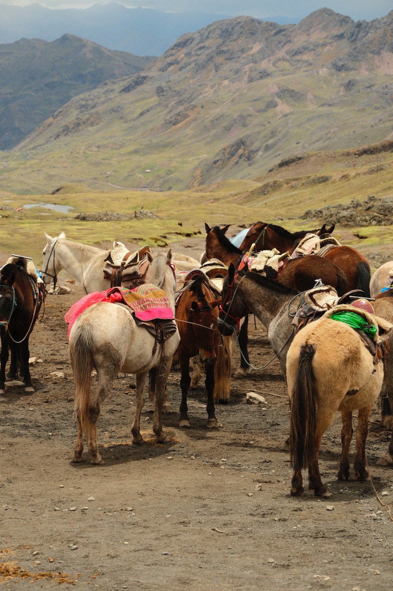
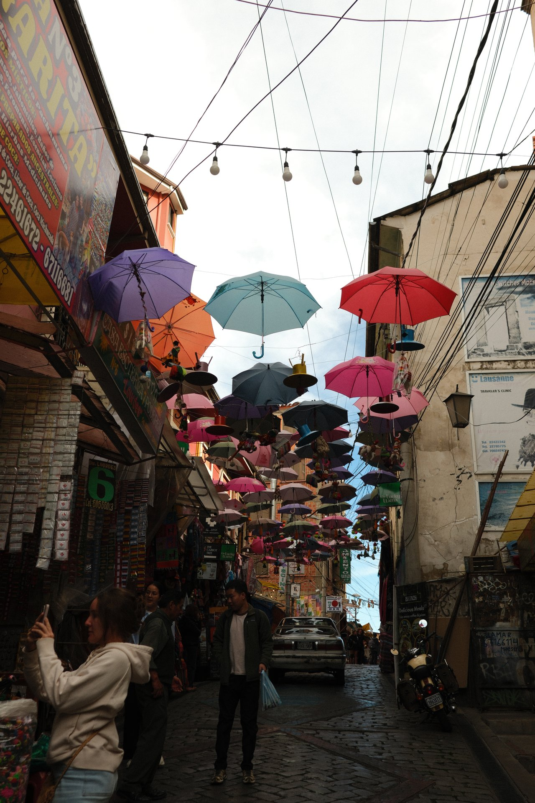

import PricingCards from '../../components/post/PricingCards.astro';
import AffiliateNote from '../../components/post/AffiliateNote.astro';

В мае 2025 я прошёл от Куско до Мачу-Пикчу — этот гайд из того опыта: пермиты, цифры и сезоны, на которые реально нарвался. К Радужной горе подъём 3–6 часов на 5200 м (автобуса до вершины нет), Тропа инков — пермит $650 и бронь за 5–7 месяцев, амазонский Икитос — только самолёт или 3 дня по реке. Без галопа и красивых обобщений.

> **Если коротко:** россиянам **виза не нужна** (90 дней безвиз). Лучшие месяцы — **май–сентябрь** (сухой сезон в Андах). Мачу-Пикчу: вход **152 PEN** ($40) + поезд из Куско от **$70**. Тропа инков — пермит **$650** на 4 дня, бронировать **за 5–7 месяцев**. Бюджет 10–14 дней без перелёта из Москвы — от **$1200** (хостелы, локальные автобусы) до **$3500+** (3*-отели, поезд PeruRail).

<AffiliateNote />

> **Когда лучше ехать в Перу:** см. [таблицу сезонов](/seasons/) — у страны три климатических зоны. В Андах сухой сезон **май–сентябрь** (днём +18 °C, ночью около нуля); влажный **декабрь–март** — частые ливни, тропы могут быть закрыты. На побережье (Лима) — наоборот, июнь–сентябрь это **гарун**: серая морось без осадков, +15 °C. В Амазонии — жарко круглый год, сухой период **апрель–октябрь**.

---

## Нужна ли виза в Перу россиянам в 2026?

С 2024 года Перу **в одностороннем порядке вернул безвизовый режим** для граждан России на 90 дней в течение полугода (по данным [МИД РФ](https://www.mid.ru/ru/maps/pe/) и [Migraciones Peru](https://www.migraciones.gob.pe/), актуально на май 2026 — проверяйте перед поездкой). Достаточно загранпаспорта со сроком действия минимум 6 месяцев и обратного билета. На границе могут спросить подтверждение проживания (бронь отеля или приглашение) и финансовую состоятельность — по практике туристов 2025 ориентир $50/день × дни поездки (точное требование уточняйте на [migraciones.gob.pe](https://www.migraciones.gob.pe/)).

Перевод срока через консульство — около **$30** (тариф уточняйте на [migraciones.gob.pe](https://www.migraciones.gob.pe/), актуально на май 2026), делается онлайн. На практике туристам это редко нужно — 90 дней покрывают почти любой маршрут.

**Прививки:** жёлтая лихорадка не обязательна, но настоятельно рекомендуется ВОЗ при поездках в Амазонию (Икитос, Пукальпа). Сертификат могут спросить при пересадке через ряд стран региона.

## Сезоны — когда лететь

| Период | Что в Андах | Что на побережье | Что в Амазонии |
|---|---|---|---|
| **Май–сентябрь** | ★ Сухо, ясно, лучшее время для треков | Гарун — серо, прохладно | Сухо, легче ходить по тропам |
| Октябрь–ноябрь | Переходный, мало туристов | Чистое небо, +18 °C | Конец сухого, цены падают |
| Декабрь–март | Влажно, часть троп закрыта | Тёплый сезон, до +28 °C | Высокая вода, видны розовые дельфины |
| Апрель | Окончание дождей, природа сочная | Тёплый, мало народа | Сухой период начинается |

**Тропа инков** официально закрывается **на февраль каждого года** — на ремонт. Если хочешь именно её, не февраль.

## Маршрут на 12–14 дней — классика

Минимум, чтобы охватить главные точки без галопа:

1. **Лима** (1–2 дня) — Мирафлорес, гастрономия (Перу — №1 кухня Латинской Америки в 2024 по рейтингу [50 Best Latin America](https://www.theworlds50best.com/latin-america/en/)). Музей Ларко, обзор тихоокеанского побережья.
2. **Паракас + Уакачина** (1–2 дня) — лодки на острова Бальестас («бедные Галапагосы», морские львы и пингвины), сэндбординг в дюнах. Автобус из Лимы Cruz del Sur, 4 ч, ~$25.
3. **Куско** (3–4 дня) — акклиматизация на 3400 м обязательна. Священная долина: Писак, Ольянтайтамбо, соляные террасы Maras и круги Морай.
4. **Мачу-Пикчу** (1–2 дня) — поездом PeruRail Vistadome от $130 в обе стороны, или Inca Rail. Ночёвка в Aguas Calientes, утренний подъём. Отели в Aguas Calientes удобно искать через <a href="https://ostrovok.tpk.mx/w4cAS1wZ" class="aff-cta" rel="sponsored">Забронировать отель в Aguas Calientes</a>реклама — принимают карты МИР, и в каталоге есть всё включая Inkaterra и бутики у реки Урубамба.
5. **Радужная гора Vinicunca** (1 день из Куско) — выезд в 3:30 утра, подъём на 5200 м, треккинг 3–6 ч. Тур ~$25 + вход $7. На последнем подъёме встречают альпак и лам с погонщиками — это часть кадра Vinicunca, не постановка для туристов (так живут общины Pampa Phallaqocha).

6. **Опционально**: **Пуно и озеро Титикака** (плавучие острова Урос, ночь у местных), либо **Икитос с Амазонкой** (лодж 3 дня от $300).

**Альтернатива классике** — **Тропа инков 4 дня** до Мачу-Пикчу. Пермит $650 (включает гида, носильщика, питание), бронировать **за 5–7 месяцев**. Кроме неё есть [Salkantay Trek](https://salkantaytrekking.com/) — 5 дней, без пермитов, дешевле ($300–$450).

## Священная долина — день за днём

Стандартный day-tour из Куско ($35–80) обходит 4–5 точек за 9–10 часов. Это половина «Boleto Turístico» ($33), который покрывает 16 разрешённых сайтов.

**Писак (Pisac)** — крепость инков на гребне 3300 м над одноимённой деревней. Террасы по склону, обсерватория, гробницы с мумиями инков в скале. Утренний рынок в деревне до 10:00 — лучшие цены на текстиль до прихода тургрупп. Время на месте: 1.5 ч.

**Maras (соляные террасы)** — 5000 испарительных бассейнов на склоне, сливают подземный солёный источник. Семьи владеют конкретными бассейнами с XV века. Соль продают на месте по $1–3/кг. Лучше час до заката — белые террасы становятся розовыми. 1 ч.

**Морай (Moray)** — концентрические круги-кратеры с разной микроклиматической зоной на каждом ярусе. Гипотеза: сельскохозяйственная лаборатория инков для адаптации сортов кукурузы и картофеля. Перепад температур между верхним и нижним кругом — до 15 °C. 30 мин.

**Ольянтайтамбо (Ollantaytambo)** — единственный город Перу где живы инкские планировка и каналы. Крепость на склоне, гранитные блоки до 50 тонн (тащили 40 км из карьера). Отсюда отходят поезда PeruRail и Inca Rail в Мачу-Пикчу. 1.5 ч.

**Чинчеро (Chinchero)** — деревня ткачей кечуа. Демонстрация натурального крашения шерсти альпаки (кошениль = красный, индиго, мох). Аутентичный текстиль $30–80. По воскресеньям утренний рынок.

Для всех точек Священной долины удобнее всего русскоговорящие гиды: программа целого дня с трансфером, обедом и хорошей хронологией (Морай → Maras → Ollantaytambo). Дешевле чем местные турагентства в Куско и не нужно договариваться по-испански.

## Радужная гора — что нужно знать заранее

Vinicunca (5200 м) стала туристической точкой только с 2015 года — раньше была покрыта ледником, который отступил из-за изменения климата. Это **самый высокий треккинговый день** программы (≈5200 м).

**Логистика:** выезд из Куско в 3:30–4:00 утра, дорога 3 часа. Точка старта Pampa Phallaqocha (4900 м), до вершины 4 км трекинга по склону, набор высоты 300 м. Лошадь по тропе вверх $20–30 с погонщиком.

**Что взять:** утеплитель (ночью −5 °C наверху), солнцезащитный крем SPF50 (ультрафиолет на 5000 м в 4 раза сильнее), 2 литра воды на человека, перекус, наличные на лошадь и сувениры. Коко-мате обязательно — местные продают листья ($1).

**Альтернатива** — **Palccoyo** (Палькойо), 4900 м, 3 разноцветных холма. Менее культовый вид, но **меньше туристов** и **легче подъём** (45 мин вместо 3–4 часов). Тур $30, выезд в 6:00.

**Когда не ехать:** январь–март (дожди, тропа размыта, видимость менее 30 м). Лучшее время — **май–сентябрь**, утром до 10:00 (потом облачность).

## Тропа инков vs Salkantay vs Lares — что выбрать

Если хочешь дойти до Мачу-Пикчу пешком, есть 3 варианта:

| Трек | Дни | Цена | Пермит | Что особенного |
|---|---|---|---|---|
| **Inca Trail (Camino Inca)** | 4 | $650+ | Да, за 5–7 мес | Финиш через Sun Gate на рассвете, исторические руины по пути, лимит 200 трекеров/день |
| **Salkantay** | 5 | $300–450 | Нет | Перевал 4630 м, гора Salkantay 6271 м рядом, лагуна Humantay, дешевле и доступнее |
| **Lares** | 4 | $400–550 | Нет | Через деревни кечуа, культурный фокус, минимум туристов |

**Для первой поездки:** если бронируешь за полгода — Inca Trail (исторические руины по пути, финиш через Sun Gate). Спонтанно — Salkantay: без пермитов, перевал 4630 м и лагуна Humantay, я выбрал бы его, если бы решил за месяц до вылета.

## Сколько стоит поездка в Перу на 12 дней?

Без международного перелёта из Москвы (~80 000–130 000 ₽ Turkish/Aeroflot или Stop-over):

<PricingCards tiers={[
  { tier: 'Эконом', price: '$1 200', priceNote: '12 дней без перелёта из РФ', emoji: '🟢',
    features: [
      'Хостел/гестхаус $15–25/ночь',
      'Питание $15/день — комбини и menu del día',
      'Внутр. перелёт LIM↔CUZ $80 в обе',
      'Поезд в Мачу-Пикчу $70 (Expedition)',
      'Туры по Священной долине $35/день',
    ] },
  { tier: 'Средний', price: '$2 300', priceNote: '3*-отели, средние туры', emoji: '🟡',
    featured: true,
    features: [
      '3* отель $50–80/ночь',
      'Питание $30/день — нормальные рестораны',
      'Внутр. перелёт $150 (бронь заранее)',
      'Поезд PeruRail Vistadome $130',
      'Гид + транспорт на Радужную гору $70',
    ] },
  { tier: 'Комфорт', price: '$3 500+', priceNote: '4*-отели, поезд Hiram Bingham', emoji: '🔴',
    features: [
      'Бутик-отель $120–250/ночь (Inkaterra)',
      'Питание $60+/день — премиум-рестораны',
      'Внутр. перелёт бизнес $250',
      'Hiram Bingham luxury train $300+',
      'Частный гид-английский $150/день',
    ] },
]} caption="Бюджет на 12 дней в Перу — три уровня комфорта" />

К этому: вход в Мачу-Пикчу **152 PEN** (~$40), Радужная гора $25, Бальестас $30, Сачайакта-музеи $5–10. Плюс акклиматизация в Куско — стоит закладывать 2 дня до любого треккинга.

**Или готовый тур** — если не собирать по частям. Пакет из Москвы — <a href="https://travelata.tpk.mx/Do2A3cgV?erid=2VtzqufPtiT" class="aff-cta" rel="sponsored">Подобрать тур в Перу</a>реклама: оплата картой МИР, цена сразу с перелётом.

## Как добраться в Перу из Москвы в 2026?

Прямых рейсов нет. Все варианты — с пересадкой 1–2 раза, общее время в пути 22–32 часа в одну сторону.

- **Через Стамбул + Мадрид/Амстердам** (Turkish + Iberia/KLM) — самый частый и относительно дешёвый: $900–1300 туда-обратно. Рекомендую.
- **Через Дубай + Сан-Паулу** (Emirates + LATAM) — комфортнее, но 30+ часов пути. $1100–1500.
- **Через Стамбул + Боготу** (Turkish + Avianca) — короче по времени, но Богота — не самая удобная пересадка.
- **Через Доху + Сан-Паулу** (Qatar + LATAM) — хороший комфорт, $1200–1600.

Подобрать перелёт с пересадками удобнее всего так — <a href="https://www.aviasales.ru/?marker=546042.Zz66f13c16ff6b488883a4127-546042&market=ru&origin_iata=MOW&destination_iata=LIM" class="aff-cta" rel="sponsored">Найти билет Москва — Лима</a>реклама: агрегатор сравнивает все авиакомпании и стыковки сразу (Turkish, Iberia, KLM, Emirates, Qatar и комбинации в одной выдаче — удобно сопоставить цену и время в пути), cookie 30 дней — можно мониторить цену и забронировать позже.

Внутри Латамерики ходит **LATAM, Avianca, JetSmart** — лоукостеры. На маршруте Лима → Куско билеты от $80, бронировать **за 6+ недель**, иначе цены растут вдвое. Если хочешь сэкономить ещё — ночные автобусы Cruz del Sur Лима → Куско идут 21 час, $50–80, но после 22-часового перелёта из Москвы это почти сутки на серпантине без нормального сна.

## Высота и здоровье

Куско — **3400 м**, Пуно — **3800 м**, Радужная гора — **5200 м**. Большая часть туристов чувствует горную болезнь: головная боль, тошнота, бессонница в первые 24–48 часов. Что работает:

- Прилёт сразу из Лимы (уровень моря, 0 м) на 3400 м в Куско — **тяжело**. Лучше начинать со Священной долины (2800 м) и подниматься постепенно.
- Mate de coca — листья коки кипятком, продают в любом отеле Куско ($1 пакет), помогает с симптомами. В РФ ввоз запрещён, ст. 228 УК.
- Препарат **Diamox (ацетазоламид)** — рецептурный, по данным [CDC](https://wwwnc.cdc.gov/travel/yellowbook/2024/environmental-hazards-risks/high-elevation-travel-and-altitude-illness) 125 мг 2 р/д за сутки до набора высоты; принимать только по назначению врача.
- Алкоголь и обильная еда в первые 2 дня — нет.

При выраженных симптомах (одышка в покое, голубые губы) — спускаться немедленно. В Куско несколько клиник, кислород подаётся в большинстве отелей.

## Безопасность и расходы по пути

Краткая сводка — детали и адреса клиник ниже в разделе [«Связь, деньги, безопасность»](#связь-деньги-безопасность--детали). Карманники в Лиме (особенно в Мирафлоресе и центре) и в Куско работают активно. Большие суммы — в сейфе отеля, рюкзак — впереди. Такси — только официальные (приложение Cabify работает). Ночные межгородские автобусы Cruz del Sur и Excluciva — безопаснее частных.

Деньги: PEN (новый соль), курс ~3.7 за доллар. Карты МИР не работают. Visa/Mastercard — берут в Лиме и Куско, в провинции — наличные. Банкоматы есть везде.

## Еда — что попробовать обязательно

Перу — гастрономическая столица Латинской Америки (по рейтингу 50 Best 4 года подряд).

- **Севиче** — сырая рыба маринованная в соке лайма, лук, кориандр, чили. Лучше пробовать на побережье в **cevichería** в Лиме — Pescados Capitales или местные cevicherías в Мирафлорес. $8–18.
- **Ломо сальтадо** — стейк жареный с луком и помидорами, картошка фри, рис. Классика, $10–14.
- **Aji de gallina** — курица в жёлтом перечном соусе, сливки, хлеб. Уютная домашняя еда, $7–10.
- **Куй (cuy)** — морская свинка на гриле или жареная. Местная экзотика, в основном в Андах. $15–25, не для всех.
- **Pisco sour** — национальный коктейль (виноградная водка пиcко, белок яйца, лайм, сахар). $5–10.
- **Chicha morada** — напиток из фиолетовой кукурузы. Безалкогольный, освежающий, бесплатно во многих ресторанах.
- **Антикучос** — шашлычки из говяжьего сердца, уличная еда. Mercado San Pedro в Куско или ночной рынок — $3–6.

- **Lúcuma** — местный фрукт, мороженое, десерты. Похоже на ваниль с карамелью.

В Куско попробуй **chocolate caliente** на высоте — какао согревает в +5 °C ночью. И **mate de coca** — листья коки, заваренные кипятком, легально, помогает с горной болезнью.

## Что НЕ работает в Перу

Чтобы сэкономить деньги и нервы — что не стоит делать:

- **Не покупай Boleto Turístico** если едешь только в Мачу-Пикчу. Boleto за $33 включает 16 точек в Куско и Священной долине, но если у тебя только 2 дня — переплатишь.
- **Не бронируй Inca Trail в последний момент** — пермиты заканчиваются за 5–7 месяцев. Альтернатива — Salkantay (без пермитов).
- **Не ешь в первый день в Куско после прилёта** — высота 3400 м + жирная еда = плохо. Лёгкий суп + чай-мате-де-кока сначала.
- **Не пей водопроводную воду** — только бутилированная или с фильтром (LifeStraw, Sawyer). В горах часто рекомендуют кипятить.
- **Не доверяй частным такси** в Куско после 22:00 — официальные стоянки или приложение InDriver/Cabify.
- **Не покупай Mate de Coca в подарок** — листья коки в России запрещены, конфискуют на таможне.

## Что почитать дальше

- [Сравнить Перу с другими странами по сезонам](/seasons/)
- [Калькулятор бюджета на Перу](/calculator/)
- [Виза в Перу — детально для россиян](/visa/peru/)
- [Перу в мае 2026 — что работает](/trips/may/peru/)

## Связь, деньги, безопасность — детали

**SIM-карта.** Claro и Movistar — главные операторы. Турпак на 7–14 дней с 6–10 ГБ интернета — $10–15. Покупать в аэропорту Лимы или в любом фирменном салоне в городе. eSIM работает через Airalo (от $9 за 5 ГБ).

**Деньги.** Соль (PEN), курс ~3.7 за доллар. Visa/Mastercard принимают почти везде в Лиме и крупных туристических точках Куско. В Священной долине и сельской местности — наличные. Банкоматы BCP и BBVA дают до 700 PEN ($190) за раз с комиссией ~$5. **Карты МИР не работают.** Если едешь без партнёра — бери минимум $300 наличными на первый день. Если своей иностранной карты нет — <a href="https://platipomiru.com/?utm_source=traveltribe&utm_medium=cpa" class="aff-cta" rel="sponsored">Выпустить виртуальную карту USD/EUR</a>реклама: пара минут, пополнение рублями.

**Безопасность.** Перу — относительно спокойная страна для туриста. Главные риски:
- **Карманники в Лиме** (Мирафлорес, Сан-Исидро, исторический центр) — рюкзак впереди, телефон в внутреннем кармане.
- **Куско ночью** — после 23:00 в районах вне Plaza de Armas осторожно. Такси через приложение.
- **Серпантины Анд** — ночные межгородские автобусы выбирай только премиум-классом (Cruz del Sur, Excluciva). Эконом-операторы попадают в аварии.
- **Альтиплано и удалённые тропы** — gps-трек, не одиночные походы, мобильная связь часто отсутствует.

Скорая в Перу — **тел. 116** (на испанском), частные клиники Lima Centro / Clinica San Pablo — англоговорящий персонал, $80–200 за приём.

## FAQ

**Можно ли ехать в Перу с Visa/Mastercard?**
В крупных городах (Лима, Куско, Арекипа) — да, многие отели и рестораны принимают. В провинции и для туров — наличные доллары / соль.

**Сколько стоит Мачу-Пикчу с поездом?**
Минимум: $40 вход + $70 поезд = **$110**. Стандарт: $40 + $130 + $20 автобус наверх = **$190**. С гидом и Хуайна-Пикчу — **$220–250**.

**Безопасно ли в Перу одному?**
Да, для опытного путешественника. Большие города требуют осторожности с ценностями, но насилие против туристов редко. Женщинам соло — не ходить ночью пешком по нетуристическим районам Лимы.

**Какой сезон лучший для Радужной горы?**
**Май–сентябрь** — сухой период, видимость хорошая. С декабря по март гору часто закрывает облачность или снег, и тур могут отменить.

**Стоит ли ехать в Перу в декабре?**
Можно, но это влажный сезон в Андах. Тропы скользкие, часть закрыта, Мачу-Пикчу часто в облаках. Зато на побережье в Лиме — лето +25 °C и пусто. Рождественские праздники в Куско колоритны.

**Сколько дней нужно на Мачу-Пикчу?**
Минимум 1 ночь в Aguas Calientes + 1 день на месте. Утро (вход 6:00–7:00) даёт лучшие фото без толп — рекомендую circuit 2 (классическая открытка) или circuit 4 (через ворота Inti Punku). За 1 день из Куско галопом — реально, но качество впечатления ниже из-за усталости от 4-часового переезда. Если хочешь подняться на Huayna Picchu (отдельный билет $20, лимит 400/день) — нужны 2 дня минимум.

**Безопасно ли пить местную воду в Перу?**
Нет. Только **бутилированная** или фильтрованная. Даже в дорогих отелях Куско, Лимы, Aguas Calientes пить из-под крана нельзя — местные кишечные бактерии адаптированы к иностранному микробиому, гарантирована диарея. Лёд в напитках в эконом-кафе тоже подозрителен. Вода в Лиме по нормам Sedapal (муниципальный водоканал) хлорируется, но туристам безопаснее бутилированная.

**Что НЕ привозить из Перу?**
Листья коки, продукты коки в любом виде (даже мате-чай в пакетиках), необработанная шерсть альпаки/ламы (фитосанитарный запрет), археологические находки (даже черепки). За коку при таможне в РФ — статья. Сувенирные изделия — серебро 950 пробы, текстиль — везти можно.

**Какие приложения скачать перед поездкой?**
- **Maps.me** или **OsmAnd** — оффлайн-карты Анд (Google не всегда актуален в горах)
- **Cabify** или **InDriver** — официальные такси в Куско и Лиме
- **PeruRail** — билеты на поезд в Мачу-Пикчу
- **Get Your Guide** — резерв туров на Радужную гору и Священную долину
