import AffiliateNote from '../../components/post/AffiliateNote.astro';
import { aviasalesRoute, tpkDeep, airaloSub, ostrovokCountry, youtravelSub } from '../../data/affiliate.js';

Про Филиппины пишут одно и то же: ехать с ноября по май, а с июня по октябрь там тайфуны и дожди. Совет звучит логично и разваливается на первой же таблице официальных норм.

Метеослужба страны ведёт наблюдения по станциям и публикует нормы за тридцать лет. По ним **на Бохоле сентябрь суше ноября**: 121,9 мм против 179,9. На Себу январь мокрее мая. А в Короне июль мокрее марта почти в тридцать четыре раза, и вот там сезон настоящий. Одного ответа на вопрос «когда ехать на Филиппины» не существует, потому что западные и восточные берега архипелага ловят разные муссоны: запад — летний, восток — зимний с тихоокеанским пассатом.

**Своих кадров с Филиппин у меня нет.** Всё, что ниже, собрано из документов — визового портала страны, метеослужбы, центральных банков двух стран, справки МИД — и из отчётов тех, кто ездил туда зимой и весной 2026 года. Фотографии в статье стоковые, авторы указаны в подписях.

> **Если коротко:** сезон надо выбирать не по стране, а по острову. **Палаван и Боракай** сухие с декабря по май, **Себу и Бохоль** дают дождь ровным слоем весь год с минимумом в марте–мае, **Манила** в апреле получает 9 мм осадков, а в августе 208. Виза не нужна: **30 дней бесплатно**, но обязательна бесплатная анкета **eTravel строго за 72 часа** до вылета. Прямых рейсов из России нет, средний билет до Манилы **58 956 ₽** туда-обратно. Сквозной билет до Палавана дороже связки через Манилу **на 21 812 ₽ на человека**. Две недели с перелётом выходят примерно в **145 000 ₽**. <a href={youtravelSub('philippines_guide_2026_top')} class="aff-cta" rel="sponsored">Посмотреть авторские туры на Филиппины</a> малые группы с русскоязычным гидом, маршрут и даты видны до оплаты

<AffiliateNote />

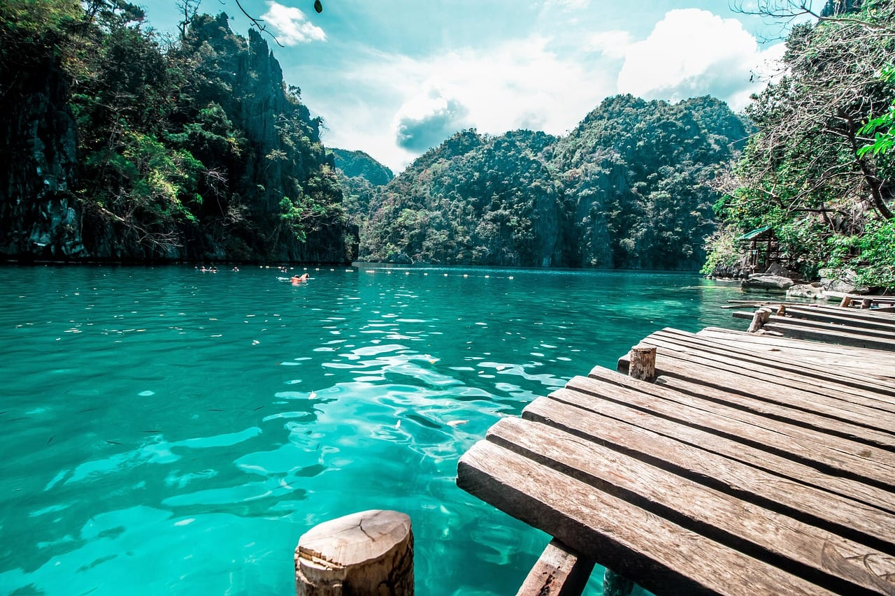

---

## Единого сезона у Филиппин нет, и общий совет «с ноября по май» верен меньше чем для половины страны

Метеослужба Филиппин публикует климатические нормы по станциям за окно 1991–2020: сколько миллиметров выпадает в каждом месяце и сколько дней в месяце идёт дождь. Дождливым считается день, когда выпало хотя бы 1 мм.

Вот эти нормы по шести станциям — от Манилы до Бохоля.

| Месяц | Манила | Корон, север Палавана | Пуэрто-Принсеса | Себу | Бохоль | Панай, станция Рохас |
|---|---|---|---|---|---|---|
| январь | 11,5 мм / 3 дн | 19,2 / 3 | 55,6 / 5 | 135,1 / 12 | 114,0 / 12 | 83,6 / 11 |
| февраль | 9,5 / 3 | 22,9 / 2 | 30,7 / 3 | 88,9 / 9 | 104,8 / 10 | 63,1 / 8 |
| март | 10,3 / 3 | 15,4 / 3 | 37,1 / 4 | 60,9 / 7 | 104,7 / 9 | 62,3 / 7 |
| апрель | 9,0 / 3 | 37,0 / 4 | 49,3 / 5 | 55,6 / 5 | 76,5 / 8 | 65,1 / 5 |
| май | 57,1 / 7 | 186,9 / 11 | 125,8 / 10 | 94,4 / 9 | 91,7 / 9 | 142,1 / 9 |
| июнь | 100,5 / 11 | 318,7 / 17 | 157,0 / 14 | 180,7 / 13 | 155,0 / 12 | 283,9 / 15 |
| июль | 158,7 / 16 | 521,5 / 21 | 170,4 / 15 | 210,6 / 15 | 143,9 / 12 | 274,4 / 17 |
| август | 208,0 / 16 | 471,7 / 19 | 173,4 / 14 | 157,9 / 13 | 124,5 / 10 | 197,6 / 13 |
| сентябрь | 159,2 / 16 | 470,4 / 20 | 172,0 / 14 | 190,4 / 14 | 121,9 / 10 | 219,2 / 14 |
| октябрь | 93,5 / 11 | 241,2 / 14 | 212,9 / 15 | 207,6 / 15 | 176,5 / 15 | 305,1 / 17 |
| ноябрь | 76,2 / 8 | 107,1 / 7 | 196,3 / 12 | 131,0 / 12 | 179,9 / 15 | 212,9 / 14 |
| декабрь | 54,1 / 8 | 90,3 / 6 | 174,9 / 9 | 171,9 / 14 | 160,9 / 14 | 227,7 / 15 |

Так устроены не одни Филиппины: во Вьетнаме [муссоны бьют по побережью в разное время, и Нячанг с Фукуоком живут по зеркальным сезонам](/blog/vietnam-guide-2026/). Разница в том, что там курортов два, а здесь климатических зон четыре. На Карибах то же самое: [в Доминикане северный берег в январе мокрее восточного в 2,3 раза](/blog/dominican-republic-2027/), хотя весь январь там считается высоким сезоном.

Из таблицы следуют три вещи, которых нет ни в одном путеводителе на русском языке.

**Запад страны живёт по резкому сезону.** Корон в июле получает 521,5 мм за двадцать один дождливый день, а в марте — 15,4 мм за три. Разница почти в тридцать четыре раза. Манила в апреле получает 9,0 мм осадков за три дождливых дня. Для Палавана, Манилы и западного побережья Лусона совет «декабрь–май» работает без оговорок.

**Висайи живут иначе.** На Бохоле самый мокрый месяц не июль и не август, а ноябрь: 179,9 мм за пятнадцать дней. Август даёт 124,5 мм за десять дней, сентябрь — 121,9 за десять. То есть **«низкий сезон» на Бохоле суше «высокого»**. На Себу январь с его 135,1 мм и двенадцатью дождливыми днями мокрее мая с 94,4 мм и девятью.

**Самый надёжный месяц для всей страны разом — апрель.** На каждой из шести станций он либо самый сухой в году, либо стоит рядом с самым сухим. Плата за это — жара: в Короне ездившие в апреле 2026 года записывали +34 днём.

Последний столбец таблицы стоит читать с оговоркой. Ближайшая к Боракаю официальная станция — Рохас на Панайе, и она стоит на **восточном** берегу острова, а Боракай лежит у северо-западной оконечности. Западный берег суше: там работает тот же режим, что на Палаване и в Маниле, а цифры Рохаса дают верхнюю границу, не среднюю.

<figure>
<svg viewBox="0 0 620 250" xmlns="http://www.w3.org/2000/svg" role="img" aria-label="Календарь дождливых дней по месяцам: Манила, Корон, Себу и Бохоль. У Манилы и Корона сухо с декабря по апрель и мокро с июня по сентябрь. У Себу и Бохоля дождь распределён по всему году без резкого сухого сезона." style="width:100%;height:auto;display:block">
  <g fill="currentColor" font-family="system-ui, sans-serif" font-size="12">
    <text x="0" y="16" font-size="12.5" font-weight="600">Дождливых дней в месяце (норма 1991–2020)</text>
    <text x="104" y="46">я</text><text x="144" y="46">ф</text><text x="184" y="46">м</text><text x="224" y="46">а</text><text x="264" y="46">м</text><text x="304" y="46">и</text><text x="344" y="46">и</text><text x="384" y="46">а</text><text x="424" y="46">с</text><text x="464" y="46">о</text><text x="504" y="46">н</text><text x="544" y="46">д</text>
    <text x="0" y="76">Манила</text>
    <text x="0" y="118">Корон</text>
    <text x="0" y="160">Себу</text>
    <text x="0" y="202">Бохоль</text>
    <text x="0" y="238" font-size="11">Полосы: до 5 дней · 6–10 · 11–13 · 14–17 · 18 и больше</text>
  </g>
  <g>
    <rect x="100" y="60" width="36" height="24" fill="#dbeafe"/><rect x="140" y="60" width="36" height="24" fill="#dbeafe"/><rect x="180" y="60" width="36" height="24" fill="#dbeafe"/><rect x="220" y="60" width="36" height="24" fill="#dbeafe"/><rect x="260" y="60" width="36" height="24" fill="#93c5fd"/><rect x="300" y="60" width="36" height="24" fill="#3b82f6"/><rect x="340" y="60" width="36" height="24" fill="#1d4ed8"/><rect x="380" y="60" width="36" height="24" fill="#1d4ed8"/><rect x="420" y="60" width="36" height="24" fill="#1d4ed8"/><rect x="460" y="60" width="36" height="24" fill="#3b82f6"/><rect x="500" y="60" width="36" height="24" fill="#93c5fd"/><rect x="540" y="60" width="36" height="24" fill="#93c5fd"/>
    <rect x="100" y="102" width="36" height="24" fill="#dbeafe"/><rect x="140" y="102" width="36" height="24" fill="#dbeafe"/><rect x="180" y="102" width="36" height="24" fill="#dbeafe"/><rect x="220" y="102" width="36" height="24" fill="#dbeafe"/><rect x="260" y="102" width="36" height="24" fill="#3b82f6"/><rect x="300" y="102" width="36" height="24" fill="#1d4ed8"/><rect x="340" y="102" width="36" height="24" fill="#1e3a8a"/><rect x="380" y="102" width="36" height="24" fill="#1e3a8a"/><rect x="420" y="102" width="36" height="24" fill="#1e3a8a"/><rect x="460" y="102" width="36" height="24" fill="#1d4ed8"/><rect x="500" y="102" width="36" height="24" fill="#93c5fd"/><rect x="540" y="102" width="36" height="24" fill="#93c5fd"/>
    <rect x="100" y="144" width="36" height="24" fill="#3b82f6"/><rect x="140" y="144" width="36" height="24" fill="#93c5fd"/><rect x="180" y="144" width="36" height="24" fill="#93c5fd"/><rect x="220" y="144" width="36" height="24" fill="#dbeafe"/><rect x="260" y="144" width="36" height="24" fill="#93c5fd"/><rect x="300" y="144" width="36" height="24" fill="#3b82f6"/><rect x="340" y="144" width="36" height="24" fill="#1d4ed8"/><rect x="380" y="144" width="36" height="24" fill="#3b82f6"/><rect x="420" y="144" width="36" height="24" fill="#1d4ed8"/><rect x="460" y="144" width="36" height="24" fill="#1d4ed8"/><rect x="500" y="144" width="36" height="24" fill="#3b82f6"/><rect x="540" y="144" width="36" height="24" fill="#1d4ed8"/>
    <rect x="100" y="186" width="36" height="24" fill="#3b82f6"/><rect x="140" y="186" width="36" height="24" fill="#93c5fd"/><rect x="180" y="186" width="36" height="24" fill="#93c5fd"/><rect x="220" y="186" width="36" height="24" fill="#93c5fd"/><rect x="260" y="186" width="36" height="24" fill="#93c5fd"/><rect x="300" y="186" width="36" height="24" fill="#3b82f6"/><rect x="340" y="186" width="36" height="24" fill="#3b82f6"/><rect x="380" y="186" width="36" height="24" fill="#93c5fd"/><rect x="420" y="186" width="36" height="24" fill="#93c5fd"/><rect x="460" y="186" width="36" height="24" fill="#1d4ed8"/><rect x="500" y="186" width="36" height="24" fill="#1d4ed8"/><rect x="540" y="186" width="36" height="24" fill="#1d4ed8"/>
  </g>
</svg>
<figcaption>Два верхних ряда — резкий сезон запада, два нижних — ровный дождь Висайев. Данные метеослужбы Филиппин, нормы 1991–2020.</figcaption>
</figure>

---

## Тайфуны: 8,4 выхода на сушу в год, и предсказать месяц нельзя

Тропический циклон и дождливый месяц — разные вещи, и путать их дорого. Дождь портит день, циклон отменяет паромы и внутренние рейсы на трое суток.

Метеослужба Филиппин считает климатическую норму: **8,4 циклона в год выходят на сушу архипелага**, окно нормали 1991–2020. Сезон 2022 года был ниже нормы — пять выходов, по одному в апреле, августе и сентябре и два в октябре. Апрельский случай показывает главное: календарной границы у сезона нет.

К 1 августа 2026 года метеослужба выпустила предварительные отчёты по одиннадцати названным циклонам сезона 2026 года.

Что из этого следует для брони:

- **Самый мокрый месяц и самый опасный — разные месяцы.** По осадкам хуже всех выглядит июль, а из пяти выходов на сушу в 2022 году четыре пришлись на август–октябрь.
- **Между островами закладывайте запас.** Отменённый паром или рейс на Боракай ломает стыковку с международным вылетом из Манилы. Один свободный день перед обратным рейсом стоит дешевле нового билета.
- **Апрельский случай 2022 года — не курьёз, а правило.** Циклон вышел на сушу в месяц, который все путеводители зовут лучшим для поездки.

---

## Куда именно ехать: четыре разных Филиппины

Страна распадается на несколько поездок, которые между собой почти не пересекаются. Сложить их в одну можно, но это будет две недели, половина которых уйдёт на перелёты.

### Боракай — пляж, за который платят сборами и толпой

Небольшой остров у северо-западной оконечности Панайя. Главный пляж — Уайт-бич, полоса белого песка, разделённая на три «станции» по номерам.

Что стоит знать до брони. Вода у Уайт-бич **мелкая, и водорослей много** — так пишут ездившие в феврале 2026 года. Самая широкая полоса песка у первой станции, там же проще найти место. Лежаков мало: они стоят у ресторанов и дорогих отелей, остальное — свой коврик.

Вход на остров платный. Экологический сбор муниципалитета Малай — **300 песо с иностранца** (около 411 ₽), внутренние туристы платят 150, жители Малая освобождены. Отдельно берут терминальный сбор в порту Катиклана и плату за лодку. За выдачу себя за местного жителя в постановлении прописан штраф 2 500 песо.

**Минус Боракая** — он собран для массового отдыха и работает как курорт. Тишины там нет, ночная жизнь на Уайт-бич громкая, а зазывалы с массажем и морскими развлечениями подходят каждые сто метров. По плотности застройки и шуму это ближе к [Пхукету в высокий сезон](/blog/thailand-guide-2026/), чем к пустому острову с картинки.

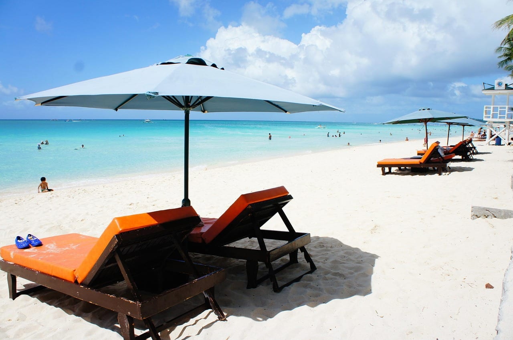

### Палаван — Эль-Нидо и Корон, скалы и лагуны

Длинный узкий остров на западе страны с двумя туристическими узлами на севере. **Эль-Нидо** — городок на материковой части Палавана, откуда лодки уходят к островам архипелага Бакуит. **Корон** — отдельный остров Бусуанга с затонувшими японскими кораблями и озёрами в скалах.

Морские прогулки в Эль-Нидо разложены по четырём маршрутам с буквами A, B, C и D: разные острова и лагуны, день с девяти утра до пяти вечера, обед шведским столом на борту. Ездившие весной 2026 года называют цену 1 500–2 000 ₽ за человека и считают маршрут A интереснее прочих: переходы между точками короче, снорклинг лучше.

Экологический сбор Эль-Нидо действует десять дней; по данным местных туристических служб в 2026 году он поднялся до 400 песо (около 547 ₽) с прежних 200. Постановление муниципалитета проверить не вышло — сайт закрыт защитой от роботов, поэтому цифру считайте ориентиром, а не нормой.

**Минус Палавана** — логистика. Прямых рейсов из Манилы в Эль-Нидо мало, летает туда одна небольшая авиакомпания, и билет считается удачным при цене около 6 000 ₽. Альтернатива — прилететь в Пуэрто-Принсесу и ехать на микроавтобусе: в отчёте о поездке февраля 2026 года человек выехал из Эль-Нидо утром и улетел из Пуэрто-Принсесы вечером того же дня.

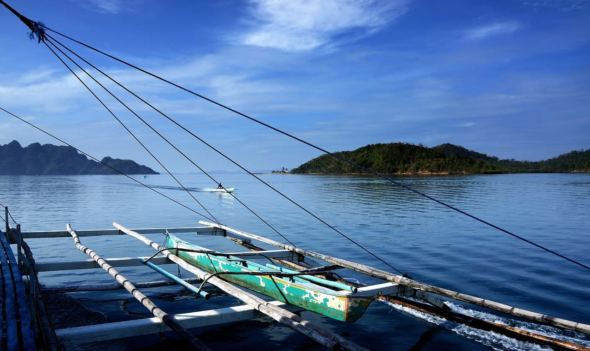

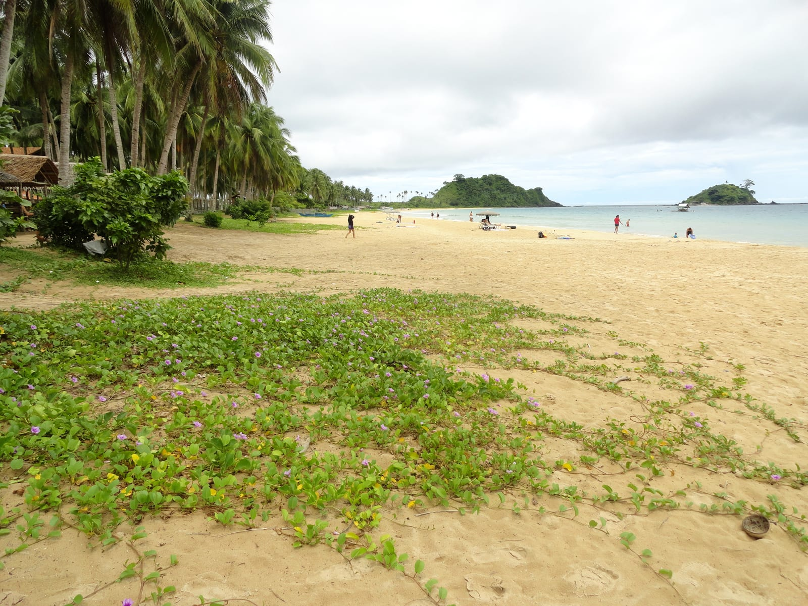

### Себу и Бохоль — пара островов, между которыми ходят лодки

Себу — крупный город и удобная точка входа: билет туда стоит дороже манильского, зато без внутренней стыковки. На юге острова, в Моалбоале и Ослобе, живёт то, ради чего туда едут: снорклинг, водопады Кавасан и китовые акулы.

**Бохоль** лежит рядом, между островами ходят лодки и паромы. Там Шоколадные холмы — поле почти одинаковых зелёных конусов, которые к концу сухого сезона выгорают до коричневого. Там же живут долгопяты, и с ними связана самая частая ошибка русскоязычных материалов.

Нейроответ Яндекса по запросу «отдых на филиппинах 2026» пишет про долгопятов, «которых можно погладить». **Трогать их запрещено.** Вид охраняется с 1997 года, держать зверей разрешено только под сертификатом природоохранного ведомства. В заповедниках правила одинаковые: не трогать, не брать в руки, без вспышки, без селфи-палок, держаться в метре. Долгопят — ночной зверёк размером с ладонь, и стресс от прикосновения для него опасен.

Вход к долгопятам в январе 2026 года стоил 170 песо (около 233 ₽), сам осмотр занимает 25 минут. Гид показывает, где спит зверь, и помогает сделать кадр — без прикосновений.

Китовых акул смотрят в Тан-Аване под Ослобом: жилет, лодка, группа, камера хранения за 20 песо, памятка на русском языке. Честный минус — море. В отчёте о январе 2026 года записано: при заметном волнении человека кувыркало волнами, в трубку заливалась вода, и рядом с акулой было страшно.

**Минус связки Себу и Бохоль** — погода, о которой шла речь выше. Январь и декабрь там дают по двенадцать–четырнадцать дождливых дней. Ехавшие на Панглао 19 января 2026 года записывали в отчёте пасмурное утро, сильный ветер, волны и дождь, который трижды за день сгонял их с пляжа.

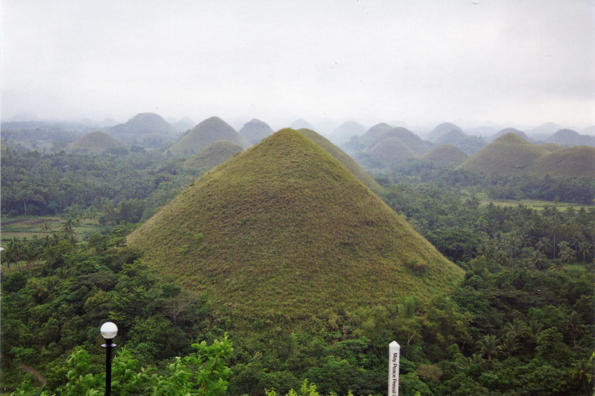

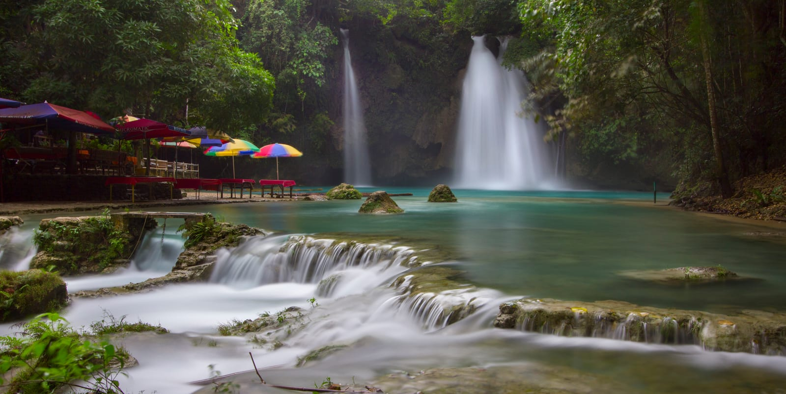

### Лусон и Манила — то, ради чего на Филиппины не летят, но зря

Главный остров страны берут редко: пляжей у столицы нет, а сама Манила шумная и тяжёлая. При этом на Лусоне лежат две вещи, которых нет больше нигде в Юго-Восточной Азии.

**Рисовые террасы Банауэ** в горах Кордильер — ступени, вырезанные в склонах вручную. **Вулкан Майон** в провинции Албай — почти идеальный конус, действующий.

В самой Маниле смотрят Интрамурос — испанский квартал внутри крепостных стен. В отчёте об апреле 2026 года записано, что за целый день в городе не встретилось ни одного туриста: столица не туристическая вовсе.

Метро в Маниле надземное, поездка через город стоит 35–40 песо (около 48–55 ₽) и занимает минут двадцать. Джипни — переделанные армейские вседорожники — остаются основным городским транспортом и главным украшением улиц.

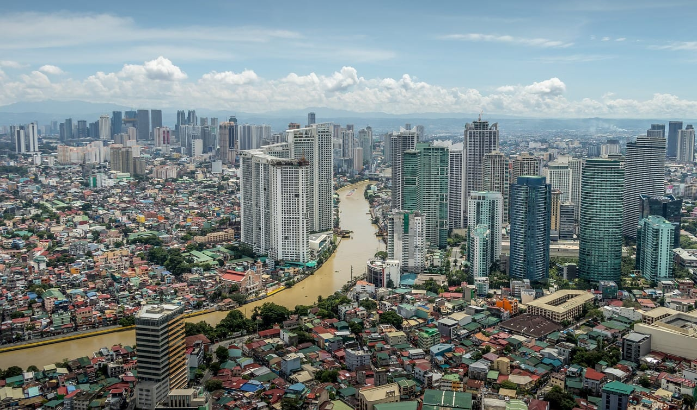

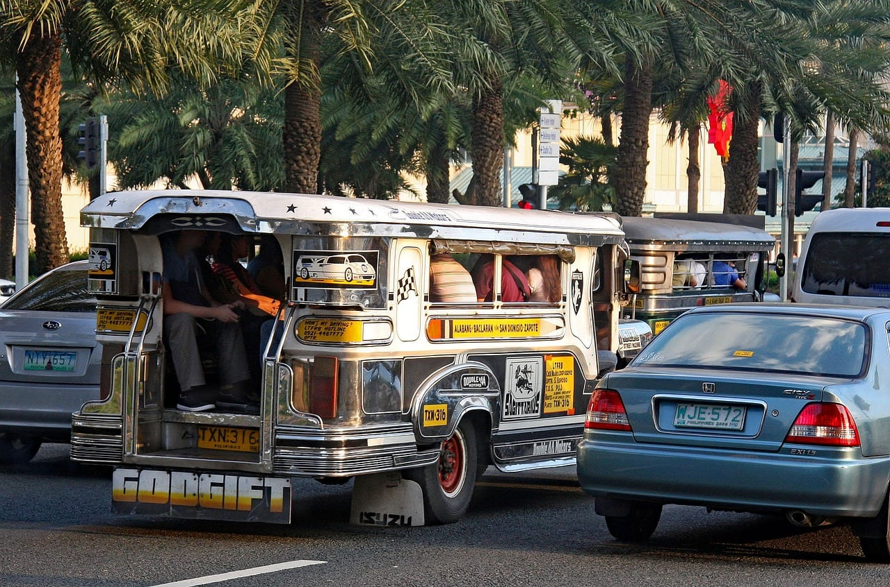

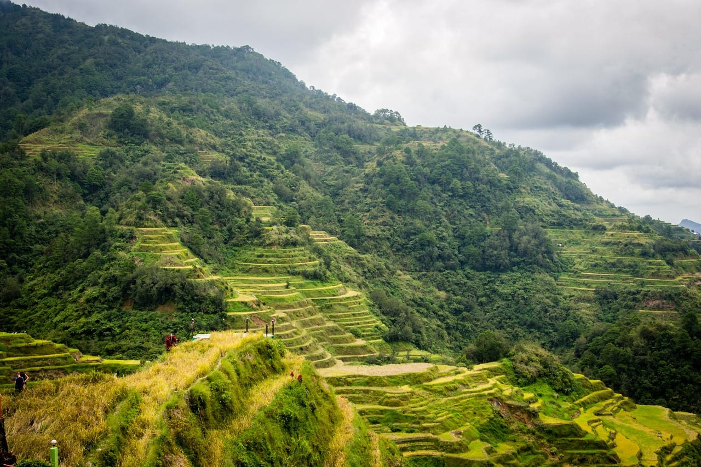

---

## Дорога: прямых рейсов нет, а сквозной билет до Палавана дороже на 21 812 ₽

Прямого сообщения между Россией и Филиппинами нет. Летят с одной или двумя пересадками — через Дубай, Маскат, Бангкок, Куала-Лумпур, Сеул, Пекин или Шанхай. Дорога с пересадками съедает большую часть суток.

Замер по агрегатору на 27 августа 2026 года, туда-обратно из Москвы:

| Куда | Минимум | Медиана | Средняя |
|---|---|---|---|
| Манила | 45 862 ₽ | 60 230 ₽ | 58 956 ₽ |
| Себу | 57 484 ₽ | 73 268 ₽ | 72 887 ₽ |
| Пуэрто-Принсеса, Палаван | 65 929 ₽ | 83 671 ₽ | 87 495 ₽ |

Витринный минимум по Маниле в 45 862 ₽ приходится на **сентябрь** — месяц, когда в столице шестнадцать дождливых дней. На декабрь и январь средняя держится около 60 000 ₽.

Дальше — арифметика, которая экономит больше, чем любая охота за акцией.

**Внутренние перелёты на Филиппинах стоят копейки.** Туда-обратно из Манилы по медиане: Пуэрто-Принсеса 6 727 ₽, Катиклан у Боракая 5 906 ₽, Калибо 5 181 ₽, Себу 5 761 ₽, Тагбиларан на Бохоле 8 138 ₽, Бусуанга у Корона 13 719 ₽.

Сложите: **Москва — Манила 58 956 ₽ плюс внутренний до Пуэрто-Принсесы 6 727 ₽ = 65 683 ₽.** Сквозной билет на тот же Палаван — 87 495 ₽. Разница **21 812 ₽ на человека**, на пару — сумма отдельного отпуска. По Себу разрыв меньше, но заметный: 64 717 ₽ против 72 887 ₽.

**Честный минус связки.** Два отдельных билета — это два разных договора. Опоздали на внутренний рейс из-за задержки международного — авиакомпания ничего не должна. Багаж переоформляют заново. И главное: в Маниле международный и внутренний терминалы **не соединены переходами**, между ними ходят бесплатные шаттлы, а расстояние заметное. Ночёвка в Маниле между рейсами снимает риск целиком и стоит дешевле разницы.

<a href={aviasalesRoute('MOW','MNL','philippines_guide_2026_flight')} class="aff-cta" rel="sponsored">Посмотреть билеты Москва — Манила</a> показывает все стыковки в одной выдаче и календарь цен по месяцам, оплата картой российского банка

---

## Сценарии поездок

**Девять дней, один остров.** Манила транзитом, внутренний перелёт на Боракай или в Пуэрто-Принсесу, неделя на месте, обратно через Манилу.
*Минус:* дорога съедает три дня из девяти. Для одного пляжа арифметика получается спорной, и такой формат оправдан, если билет достался дёшево.

**Двенадцать дней, Палаван целиком.** Манила, перелёт в Пуэрто-Принсесу, подземная река, микроавтобус в Эль-Нидо, четыре дня лодочных туров, паром или перелёт в Корон, вылет через Манилу.
*Минус:* три полных дня уйдут на переезды. Отчёты ездивших весной 2026 года так их и описывают — «день целиком потрачен на логистику».

**Двенадцать дней, Себу и Бохоль.** Прилёт в Себу, юг острова с Моалбоалем и Ослобом, водопады Кавасан, паром на Панглао, Шоколадные холмы и долгопяты, обратно из Себу.
*Минус:* погода. Брать этот маршрут с декабря по февраль — лотерея, лучший отрезок здесь март–май.

Соединять Филиппины с соседней страной в одной поездке неудобно: паромов туда нет, всё делается перелётом. Из ближайших вариантов [Камбоджа со своим Ангкором](/blog/cambodia-guide-2026/) стыкуется через Манилу или Сингапур и требует отдельной визы.

**Две недели, Боракай плюс Палаван.** Неделя на Боракае, перелёт Катиклан — Эль-Нидо, четыре дня лагун, микроавтобус в Пуэрто-Принсесу, вылет через Манилу. Ровно так прошёл февральский маршрут 2026 года, разобранный на форуме.
*Минус:* перелёт Катиклан — Эль-Нидо выполняет одна авиакомпания, и цена на него скачет сильнее всего в стране.

**Три недели, четыре острова.** Себу, Бохоль, Корон, Эль-Нидо с возвратом через Манилу — маршрут, который на форуме собирают чаще прочих.
*Минус:* внутренних перелётов набирается пять, и каждый — риск для стыковки с обратным рейсом.

| Сколько дней | Что складывается |
|---|---|
| 9 | Один остров, без переездов |
| 12 | Палаван целиком либо связка Себу и Бохоля |
| 14 | Боракай плюс север Палавана |
| 21 | Четыре острова, пять внутренних перелётов |

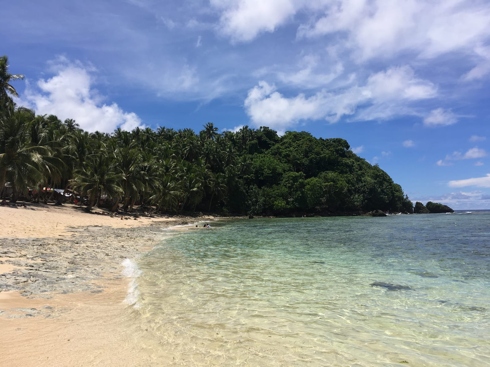

---

## Сколько стоит поездка

Курсы на 27 августа 2026 года: Центральный банк России даёт **1 доллар США = 84,2820 ₽**, Центральный банк Филиппин — **61,5820 песо за доллар**. То есть **1 песо = 1,37 ₽**, а тысяча песо — около 1 369 ₽.

**Перелёт.** 58 956 ₽ до Манилы туда-обратно по средней плюс 5 000–14 000 ₽ на внутренний. Считайте 65 000–73 000 ₽ на человека.

**Виза.** Ноль. Безвизовый въезд на 30 дней, анкета eTravel бесплатна.

**Жильё.** Ездившие зимой и весной 2026 года называют такие цены — со слов постояльцев, официальным источником не подтверждены: бюджетный отель на Боракае с завтраком 43 доллара за сутки, отель в центре Себу 34 доллара, домик на острове у Корона 1 500 песо, гостиница у пляжа под Эль-Нидо 110 долларов за двое суток с завтраком.

<a href={ostrovokCountry('philippines', 'philippines_guide_2026_stay')} class="aff-cta" rel="sponsored">Посмотреть жильё на Филиппинах</a> оплата картой российского банка, подтверждение сразу — его же спрашивают на паспортном контроле

**Сборы и входы.** Экологический сбор Боракая 300 песо, Эль-Нидо около 400 песо на десять дней, вход к долгопятам 170 песо, разрешение на подземную реку в Пуэрто-Принсесе с лодкой и гидом — порядка 1 500–2 000 песо. На две недели с переездами закладывайте 3 000–5 000 песо, то есть 4 100–6 850 ₽.

**Транспорт на месте.** Цены января–апреля 2026 года со слов ездивших: аренда мотобайка на Панглао 300 песо в день без залога, только с фотографией прав; трайсикл по посёлку 100–200 песо; автобус Ослоб — Себу 295 песо за три часа; лодка Панглао — Ослоб 1 000 песо плюс 150 за багаж; такси через приложение до аэропорта Себу 400 песо; метро Манилы 35–40 песо.

**Еда и развлечения.** Морская прогулка в Эль-Нидо 1 500–2 000 ₽ с обедом, тур к затонувшим кораблям в Короне 1 700 песо, массаж на Боракае 600–900 песо, прогулка по морскому дну в шлеме 1 500 песо после торга — первая названная цена была 2 000.

**Страховка.** Для въезда она **не требуется** — ни визовый портал, ни правила eTravel её не спрашивают. Это отдельно стоит сказать, потому что нейроответ Яндекса по филиппинским запросам предписывает полис «не менее 40 000 долларов»: это чужое правило, шенгенское. Полис при этом брать стоит по другой причине: медицина платная, а половина маршрутов — лодки, скалы и мотобайк.

<a href={tpkDeep('cherehapa', 'https://cherehapa.ru/country/philippines', 'philippines_guide_2026')} class="aff-cta" rel="sponsored">Подобрать полис для поездки на Филиппины</a> сравнивает страховщиков по цене и покрытию, оплата картой РФ, полис приходит в PDF

**Итого на человека.** Считаю от суточной нормы, которую даёт сводка бюджетов путешественников по стране: средний уровень обходится примерно в 5 400 ₽ в день на человека без перелёта, бюджетный — в 2 700 ₽. Четырнадцать дней среднего уровня это 75 600 ₽, плюс перелёт со связкой через Манилу 65 683 ₽, плюс сборы и входы около 5 000 ₽ — **около 145 000 ₽**. Бюджетный вариант с гестхаусами и без частых перелётов укладывается **в 105 000 ₽**.

---

## Виза: 30 дней бесплатно, но анкету надо заполнить строго за 72 часа

Россиянам виза на Филиппины не нужна. Визовый портал страны перечисляет Россию среди государств, чьи граждане въезжают по указу 408 **на первичный срок 30 дней**. Условий два: паспорт действителен минимум шесть месяцев сверх планируемого срока пребывания и на руках обратный или транзитный билет.

Отдельно стоит закрыть частый вопрос про 59 дней. Такой срок есть, но **только у Бразилии и Израиля** по двусторонним соглашениям. Россиянам он не положен — 59 дней получаются иначе, платным продлением на месте.

**Анкета eTravel обязательна.** Это бесплатная электронная регистрация на правительственном портале, её заполняют все прилетающие. Правило одно и жёсткое: заполнять **в окно 72 часов до прилёта**, не раньше. Формулировка портала прямая: «зарегистрироваться можно в течение 72 часов (трёх дней) до прибытия в страну или вылета из неё».

Портал отдельно предупреждает, что регистрация **бесплатна и не собирает никаких платежей**. Всё, что продают за деньги под видом оформления eTravel, — накрутка. Годится и распечатка QR-кода, и скриншот.

Ездившие в феврале 2026 года добавляют деталь, которой нет в инструкции: **включённый онлайн-переводчик на русский язык ломает анкету**, заполнять её надо по-английски. QR-код спрашивают при регистрации на рейс ещё в Москве, а при вылете обратно другой авиакомпанией просят показать и обратный билет.

**Справка МИД России по стране отстала от нормы.** Она в двух местах называет срок безвизового пребывания 21 днём — при том что сама же сообщает о его увеличении до 30 дней с 1 августа 2013 года. Про обязательную регистрацию eTravel на странице нет ни слова. В таких разночтениях правым оказывается тот, кто пускает в страну: визовый портал Филиппин.

**Продление на месте.** По отчётам 2023–2024 годов первые 29 дней сверх безвиза стоят 2 030–3 030 песо, разница — экспресс-сбор на усмотрение офицера. Оформляют в офисе иммиграционного бюро на третьем этаже аэропорта Манилы или в отделениях по стране, платят наличными; аэропортовое окно работает примерно до пяти вечера. Свежего подтверждения этих сумм найти не удалось, так что перед поездкой их стоит уточнить.

---

## Деньги, связь и безопасность

**Наличные решают больше, чем карта.** Российские карты на Филиппинах не работают. Меняют доллары; курс лучше в городе, чем в аэропорту, и даже внутри аэропорта он разный. В отчёте за 1 апреля 2026 года записано: в обменниках на первом этаже аэропорта Манилы давали 59,25 песо за доллар, на втором — 59,70. На обмене семисот долларов внизу потерялось больше трёхсот песо.

Справка МИД добавляет бытовое: обменные пункты работают до восьми вечера, после — только бизнес-центр Макати в Маниле и по заниженному курсу.

**Связь.** Местную симку продают в аэропорту сразу за паспортным контролем. Вариант без очереди — eSIM, купленная заранее: она включается по прилёте.

<a href={airaloSub('philippines_guide_2026')} class="aff-cta" rel="sponsored">Купить eSIM для Филиппин заранее</a> активируется по прилёте без похода в салон, оплата картой РФ, тариф виден до покупки

**Безопасность.** МИД России пишет прямо: **строго не рекомендуется посещать южные острова — Минданао, Басилан, Тави-Тави и соседние**. Причина названа отдельно: похищения людей ради выкупа, и европейцы с японцами в этом смысле мишень. Туристические маршруты статьи в эти районы не заходят.

По остальной стране ведомство предупреждает о карманных кражах и разбоях, включая крупные торговые центры, и советует сдавать документы и деньги на хранение администратору отеля даже в дорогих гостиницах.

**Две вещи, которые удивляют на границе.** Вывоз ракушек и прочих морских сувениров, купленных с рук без чека из магазина, запрещён — их изымают на контроле в аэропорту. И российское водительское удостоверение МИД использовать не рекомендует: местные права оформляют в транспортном управлении за пару часов и около десяти долларов.

**Мелочь, о которой не пишут.** На пляже Накпан под Эль-Нидо водятся песчаные мухи; предупреждающая табличка там стоит, и следы от укусов держатся долго.

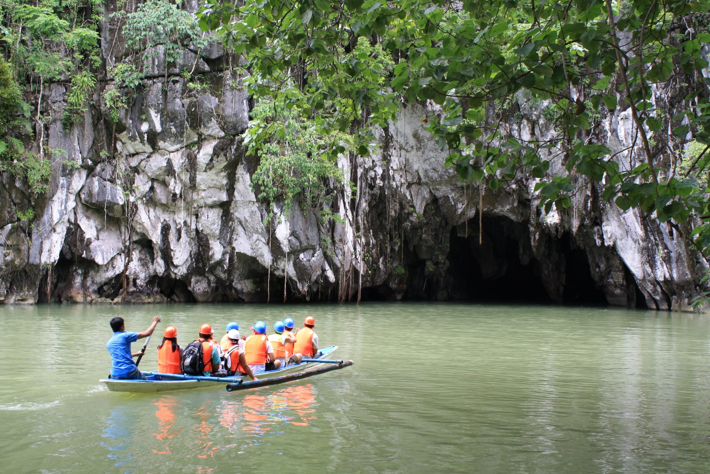

---

## Что пишут те, кто был

Прочитал 104 сообщения из пяти веток филиппинского раздела форума путешественников за период с 15 февраля 2023 по 22 мая 2026 года. Четыре ветки — свежие отчёты о поездках января–апреля 2026 года, пятая про продление безвиза. Это последние страницы выбранных веток, а не весь раздел, поэтому представительной выборку считать нельзя. Но пять вещей повторяются у разных людей, и ни одной из них нет в официальных источниках.

**Январь на Бохоле и Себу совпал с нормами метеослужбы, а не с рекламой.** Отчёт о поездке 19 января — 4 февраля 2026 года читается как сводка погоды: пасмурное утро, сильный ветер и волны на пляже Момо, дождь, который трижды за день сгонял с пляжа Дюмалуан, и последний день, когда дождь шёл почти без перерыва. Февральский отчёт с Боракая жалоб на дождь не содержит вовсе — и там февральская норма вчетверо ниже.

**Курс в аэропорту Манилы зависит от этажа.** Первое апреля 2026 года: внизу 59,25 песо за доллар, этажом выше 59,70. Разница на семистах долларах — больше трёхсот песо, и заметна она стала, когда менять было поздно.

**Терминалы Манилы разнесены.** Международный и внутренний не соединены переходами, ходят бесплатные шаттлы, расстояние заметное. Люди с шестидневной поездкой отдельно подбирали остров с близким аэропортом, чтобы не терять день на пересадку.

**Торговаться на Боракае стоит.** Прогулку по морскому дну в шлеме одному и тому же покупателю называли по 2 000 песо, а через два дня продали за 1 500. Массаж на набережной идёт по 600–900 песо в зависимости от вида.

**Цены со слов посетителей** за январь–апрель 2026 года: байк на Панглао 300 песо в день без залога, только фотография прав; вход к долгопятам 170 песо на 25 минут; обед-круиз по реке Лобок 1 000 песо; лодка Панглао — Ослоб 1 000 песо плюс 150 за багаж; автобус Ослоб — Себу 295 песо; сувениры в Короне дешевле и разнообразнее, чем в Интрамуросе и аэропорту Манилы. Официальными источниками эти суммы не подтверждены.

Отдельная деталь про перелёт: один из отчётов называет билет Москва — Панглао с двумя пересадками за 118 000 ₽ на двоих, купленный за полтора месяца. Это 59 000 ₽ на человека — почти в точности средняя по агрегатору, 58 956 ₽.

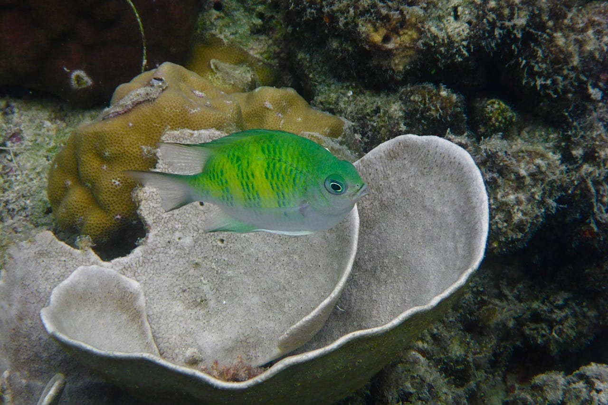

---

## FAQ — что чаще всего спрашивают про Филиппины

**Нужна ли виза россиянам?**
Нет. Безвизовый въезд на 30 дней по указу 408. Нужны паспорт со сроком действия минимум шесть месяцев сверх поездки и обратный либо транзитный билет.

**Правда ли, что дают 59 дней по прилёте?**
Нет. Срок 59 дней есть только у граждан Бразилии и Израиля по двусторонним соглашениям. Россиянам дают 30, дальше — платное продление в иммиграционном бюро.

**Что такое eTravel и сколько стоит?**
Обязательная электронная регистрация на правительственном портале, бесплатная. Заполняют строго в окно 72 часов до прилёта или вылета. Любая плата за «оформление» — накрутка.

**Когда лучше ехать?**
Зависит от острова. Палаван, Боракай и Манила — с декабря по май. Себу и Бохоль — с марта по май; зима там не сухая, в январе дождь идёт двенадцать дней из тридцати одного. Апрель сухой везде сразу, но жаркий.

**Сколько стоит поездка на две недели?**
Около 145 000 ₽ на человека при среднем уровне: 5 400 ₽ в день на четырнадцать дней, перелёт 65 683 ₽ и сборы. Бюджетный вариант — около 105 000 ₽.

**Обязательна ли страховка?**
Для въезда — нет, её не спрашивают ни на визовом портале, ни в eTravel. Брать стоит по медицинским причинам: лечение платное.

**Работают ли российские карты?**
Нет. Везут наличные доллары и меняют на месте, курс в городе выгоднее аэропортового.

**Можно ли трогать долгопятов?**
Нет. Это запрещено, и заповедники требуют держаться в метре, не пользоваться вспышкой и селфи-палками. От стресса зверь может погибнуть.

**Куда нельзя ехать?**
МИД России строго не рекомендует южные острова — Минданао, Басилан, Тави-Тави и соседние — из-за похищений людей ради выкупа.

---

## Коротко о главном

Филиппины не собираются в одну поездку, и первое решение — не «когда ехать в страну», а «на какой остров и в каком месяце». Запад архипелага сухой с декабря по май, Висайи — с марта по май, а на Бохоле в январе дождь идёт чаще, чем в августе: двенадцать дней против десяти.

Второе решение — про билет. Сквозной перелёт до Палавана дороже связки через Манилу на 21 812 ₽ на человека, и эта разница больше любой сезонной скидки. Цена риска — самостоятельная стыковка, которую снимает одна ночёвка в столице.

Остальное просится в список: анкета eTravel за 72 часа и ни песо сверх нуля, наличные доллары вместо карт, свободный день перед обратным рейсом на случай отменённого парома, юг страны — мимо.

<a href={youtravelSub('philippines_guide_2026_final')} class="aff-cta" rel="sponsored">Посмотреть авторские туры на Филиппины</a> маршрут, даты и состав группы видны до оплаты, организаторы с отзывами
