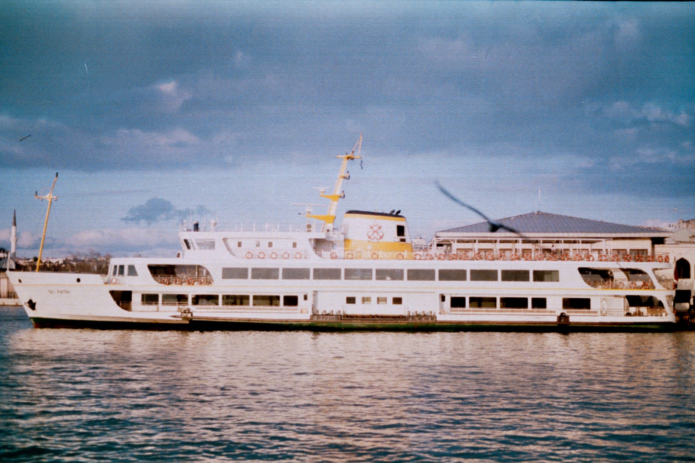
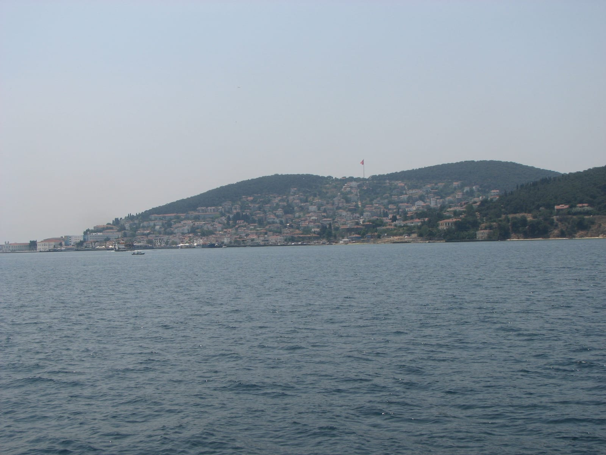
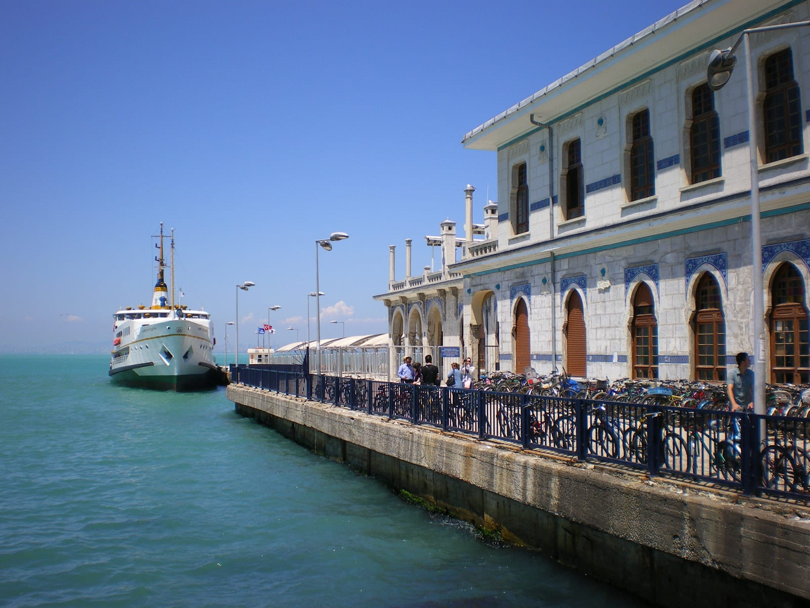
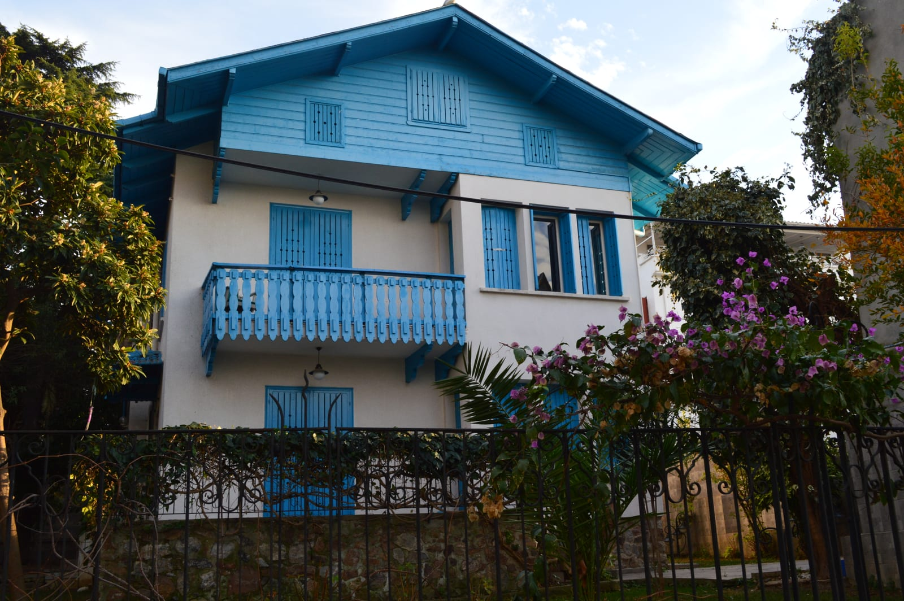
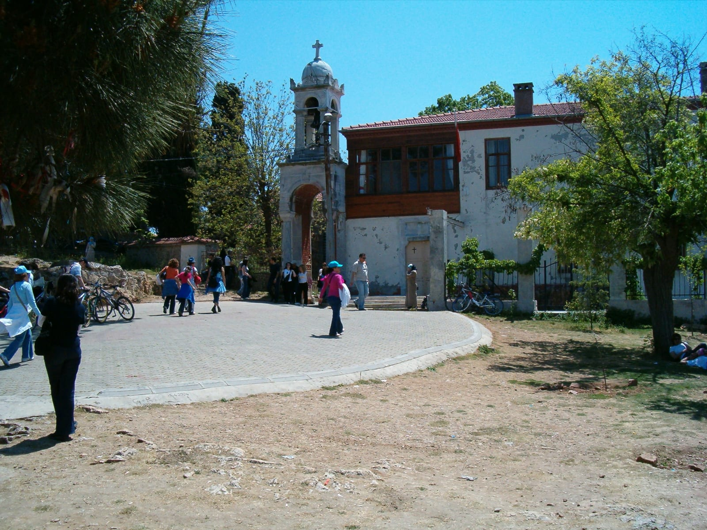
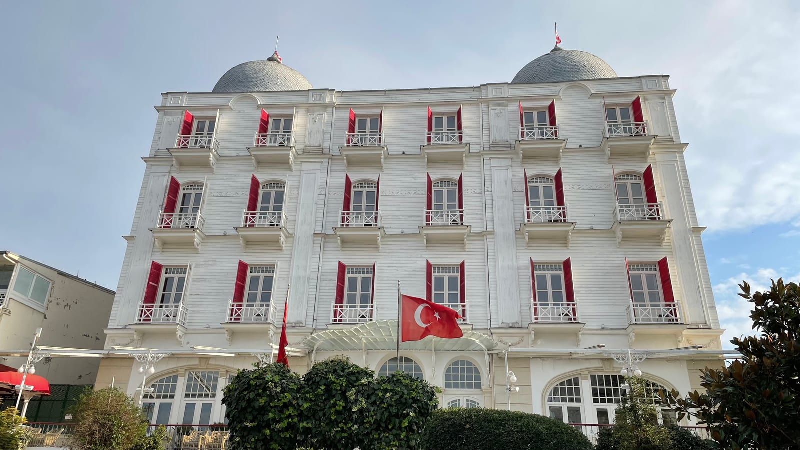
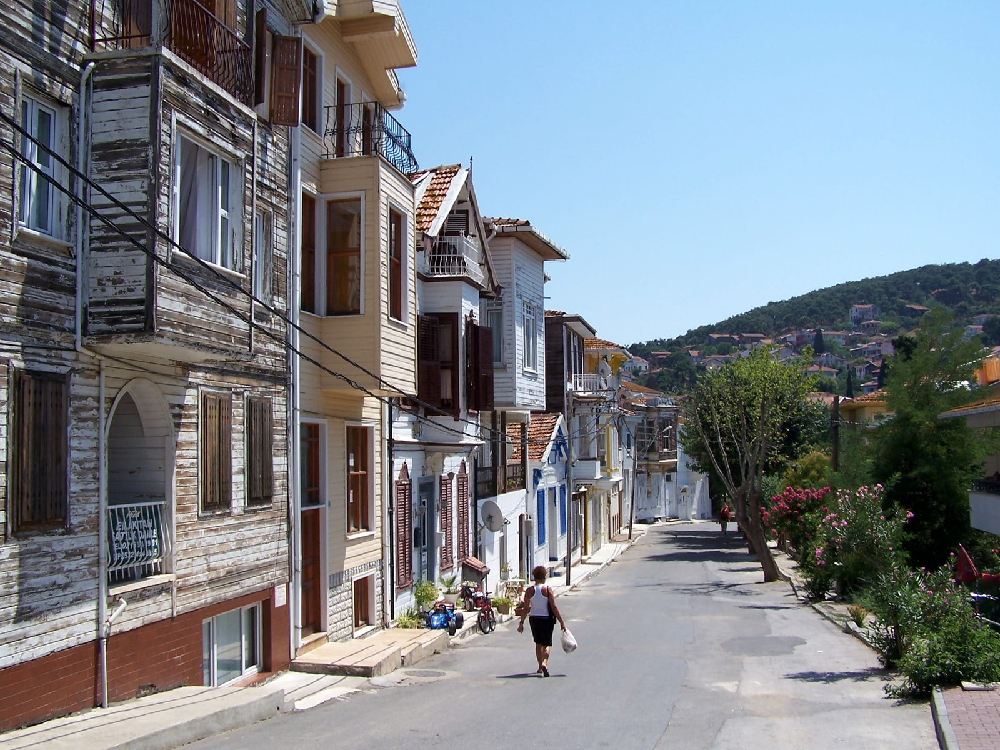
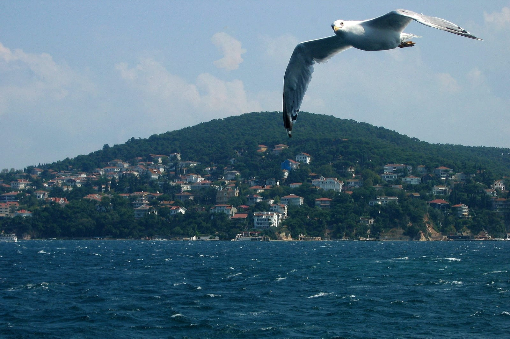
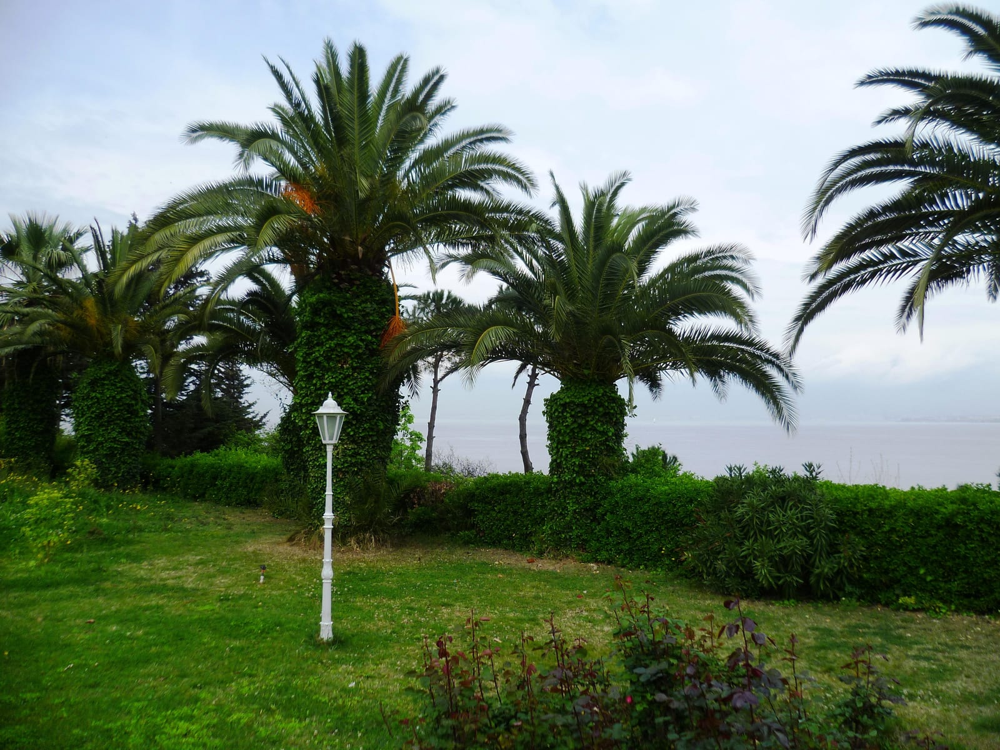
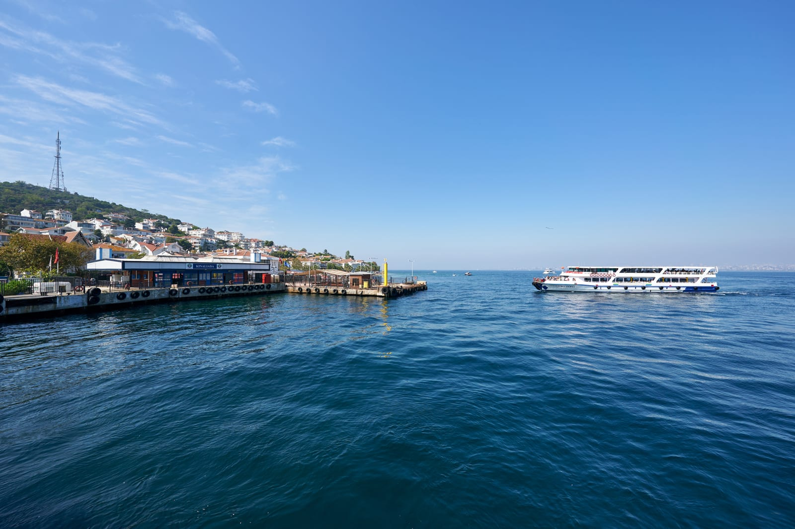

На Принцевы острова отведите **целый день**: утром — паром, днём — прогулка по Бююкаде, вечером — возвращение в Стамбул. От Кабаташа путь занимает **1 час 45 минут в одну сторону**. Если в городе всего два-три дня, придётся решить, готовы ли вы потратить один из них на море, старые дома и островные улицы.

Для первой поездки выбирайте **Бююкаду**: от пристани удобно идти к историческим кварталам и видовым точкам. Хейбелиада тише и зеленее, Бургазада меньше, Кыналыада ближе к Стамбулу. На один день лучше выбрать один остров — с переездами между четырьмя большая часть времени уйдёт на паромы.

## Как добраться до Принцевых островов

У городского перевозчика [Şehir Hatları](https://sehirhatlari.istanbul/en/timetables/domestic-trips/adalar-princes-islands-lines/adalar-lines-177) есть линия **Kabataş–Adalar**. С европейского берега удобна пристань Кабаташ. Паром идёт через Кадыкёй и последовательно останавливается на Кыналыаде, Бургазаде, Хейбелиаде и Бююкаде. На азиатском берегу можно сесть в Кадыкёе или воспользоваться отдельной линией из Бостанджи. Перед посадкой проверьте свой остров в строке конкретного рейса: не каждый паром делает одинаковые остановки.

Зимнее расписание действует **с 7 сентября 2026 года до 27 июня 2027 года**. По будням и субботам отправление из Кабаташа в 08:00 означает прибытие на Бююкаду в 09:45; следующее — 09:00 → 10:45. В воскресенье и праздники удобные утренние варианты — 07:30 → 09:15 и 08:30 → 10:15. Обратно с Бююкады можно выбрать 16:30 → 18:20 или 17:35 → 19:25; оба варианта указаны и для будней, и для воскресенья. Время местное. Прочерк в колонке причала означает, что рейс там не останавливается. Из-за погоды движение может измениться: откройте расписание ещё раз утром перед выходом.

### Сколько стоит паром

По [тарифу Şehir Hatları](https://sehirhatlari.istanbul/tr/ucret-tarifeleri/vapur-hatlari-79) обычный полный билет по İstanbulkart без островной AdaKart стоит **151,23 турецкой лиры — около 260 ₽ в одну сторону**. Туда и обратно на этих условиях — **302,46 лиры, около 520 ₽ на человека**. Рублёвый эквивалент зависит от курса обмена. Цифра 90,70 лиры в тарифе относится к AdaKart, а не ко всем пассажирам. Для островных линий перевозчик отдельно указывает, что обычная скидка за пересадку здесь не действует. Проезд до пристани в расчёт не входит.

Не покупайте дорогую «морскую экскурсию» только ради переправы: городской паром проходит мимо нескольких островов. Экскурсия может быть полезна ради гида или трансфера, но для самостоятельной прогулки по одному острову она не нужна. Деньги на обратную дорогу держите отдельно.

### Если вы остановились на азиатском берегу

Ехать через центр к Кабаташу только потому, что он чаще встречается в путеводителях, не обязательно. На опубликованной схеме есть посадка в Кадыкёе на той же линии; для живущих дальше к востоку — отдельный маршрут **Bostancı–Adalar**. Проверьте, какой причал ближе к вашему жилью, а затем ищите рейс именно с него. Между «дойти до пристани» и «выйти на Бююкаде» складываются очередь, посадка, путь по воде и высадка. Сравнивайте всё время в дороге, а не только минуты на пароме.

Если вы возвращаетесь вечером на другой берег, не угадывайте по утреннему билету, где окажетесь. У обратных рейсов есть остановки в Кадыкёе и конечные причалы в городе; нужная колонка расписания важнее названия линии. Для поездки с детьми или тяжёлым багажом разумнее заранее выбрать одну пристань возвращения и отказаться от лишних пересадок между островами.

## Какой остров выбрать

| Остров | Ради чего ехать | Сколько оставить |
| --- | --- | --- |
| **Бююкада** | Деревянные особняки, длинные прогулки, подъём к Айя-Йорги | Полный день |
| **Хейбелиада** | Более спокойные улицы, сосны, виды на воду | Полдня или отдельный день |
| **Бургазада** | Короткая прогулка у моря и по посёлку | Несколько часов |
| **Кыналыада** | Ближайшая из этой четвёрки при движении из Кабаташа | Несколько часов |

Это выбор по характеру прогулки, а не рейтинг островов. [Go Türkiye](https://goturkiye.com/routes/3-day-route-across-the-princes-islands) отводит на четыре населённых острова три дня. Для одной поездки лучше взять один, особенно если в планах подъём к монастырю или купание.

У поездки есть три разных темпа. За **короткий выезд** можно успеть набережную и соседние улицы одного острова без подъёма. **Полный день на Бююкаде** даёт время на старые кварталы, Айя-Йорги и обед без спешки. **Два острова** возможны, если отказаться от длинной прогулки на каждом и заранее выписать промежуточный и обратный паромы. Второй вариант обычно полезнее для первого визита: вы действительно увидите место, а не только четыре причала.

## Маршрут по Бююкаде на один день

**08:00–09:45 — паром из Кабаташа.** Если хотите смотреть на воду с открытой палубы, приходите к началу посадки. Ветер на море ощущается сильнее, чем на берегу. В воскресенье можно взять рейс 08:30–10:15 и сдвинуть весь день на полчаса.

**09:45–11:00 — пристань и старые улицы.** Не садитесь сразу в транспорт у выхода. Пройдите от исторического здания пристани вглубь жилых кварталов: деревянные виллы и небольшие сады дают острову иной ритм, чем главная набережная. [Туристический портал Турции](https://istanbul.goturkiye.com/buyukada) выделяет старую пристань и особняки как главные достопримечательности. Дома жилые — фотографируйте с улицы.

**11:00–13:30 — к Айя-Йорги, если готовы идти в гору.** Церковь и монастырь стоят на Юджетепе, самой высокой точке Бююкады; место описывает [муниципалитет Адалар](https://adalar.bel.tr/aya-yorgi-rum-manastiri-yucetepe/). Последний участок подъёма пеший и заметно круче прогулки у пристани. Посетители в отзывах отдельно предупреждают о жаре и затяжном подъёме. Оставьте время на воду, остановки и обратный путь. Если идти вверх не хочется, замените эту часть маршрута прогулкой по кварталам и побережью.

### Маршрут без подъёма

Подъём к Айя-Йорги можно пропустить. Если жарко, вы с ребёнком или не хотите тратить силы на склон, после пристани идите по ближайшим жилым улицам с особняками. Оттуда возвращайтесь к набережной, выбирайте место для обеда и выходите на паром в 16:30. На прогулке останется больше времени для домов, набережной и обеда.

При таком варианте не нужно заранее оплачивать островной транспорт: сначала пройдите доступную вам часть пешком и решите на месте, требуется ли поездка дальше. Не стройте план вокруг музея или пляжа, пока не сверили их собственные часы и правила входа. Паром доставляет на остров, но не гарантирует, что отдельный объект будет открыт именно в этот день. Если погода испортится, короткую прогулку можно закончить ближайшим подходящим обратным рейсом, не «отрабатывая» заранее придуманный список точек.

**13:30–15:30 — обед и свободный выбор.** Вернитесь к улицам возле пристани либо продолжите прогулку к побережью. Осенью не стройте день вокруг пляжа: сервисы сезонны, а погоду и состояние воды нужно проверять отдельно. В тёплый сезон уточняйте цену входа на конкретный пляж до поездки — общей цены для всех пляжей нет.

**15:30–17:35 — запас на возвращение.** Вернитесь к пристани без гонки. Если устали, есть рейс в 16:30; если хочется ещё погулять — в 17:35. По текущей таблице оба идут до Кабаташа. Не ставьте сразу после парома невозвратный авиабилет: морское расписание зависит от условий на воде.

## Если хотите увидеть два острова

Выбирайте **Бююкаду и Хейбелиаду**, но решите заранее, что ради второго острова сократите прогулку на первом. Паромы останавливаются на обоих, однако направление важно: по пути из Кабаташа сначала Хейбелиада, затем Бююкада, а обратно — наоборот. Поэтому маршрут «утром Бююкада, вечером Хейбелиада» может совпасть с рейсом в город. Сверяйте строку отправления с Бююкады и строку обратного рейса с Хейбелиады; нельзя считать, что подойдёт любой паром.

На Хейбелиаде оставьте время на одну прогулку от пристани к тихим улицам и виду на море. [Go Türkiye](https://goturkiye.com/routes/3-day-route-across-the-princes-islands) описывает её как второй по величине остров архипелага с соснами и историческими домами. Если приехали после обеда, не закладывайте длинный маршрут по обоим островам.

Бургазаду и Кыналыаду удобнее оставить на следующую поездку. Они видны по пути, но выход на каждой остановке потребует ещё одного ожидания и оплаты следующей посадки. Для короткого выезда без подъёма выберите один из них вместо Бююкады, а не в дополнение к ней.

## Что учесть до выхода из отеля

- **Паром — не экскурсионный корабль с билетом на весь день.** Пересадки и обратный путь считайте отдельными посадками.
- **На островах много ходят пешком.** У пристани всё близко, но маршрут к Айя-Йорги идёт в гору. Удобная обувь важнее плана на четыре острова.
- **Купание не гарантировано.** Пляжи отличаются доступом и сезонностью; в октябре поездка имеет смысл и без моря для купания.
- **На обратный паром оставьте запас.** Очередь в конце дня или изменение рейса важнее ещё одной фототочки.

Если острова — часть первого знакомства с городом, сопоставьте поездку с [общим маршрутом по Турции](/blog/turkey-guide-2026/). При длинной стыковке в аэропорту сначала проверьте [реальное время выхода в Стамбул](/blog/peresadka-v-stambule/): между рейсами самолётов на острова лучше не ехать.

## Частые вопросы

### Сколько времени занимает дорога до Бююкады?

По зимнему расписанию Şehir Hatları рейс 08:00 из Кабаташа приходит на Бююкаду в 09:45 — 1 час 45 минут. Из Кадыкёя на том же рейсе путь короче: 08:25–09:45, то есть 1 час 20 минут. У другого перевозчика или маршрута время может отличаться.

### Можно ли успеть на острова за полдня?

Да, если выбрать один остров, поехать из удобной для вас пристани и ограничиться прогулкой возле посёлка. Из Кабаташа только паром до Бююкады и назад займёт примерно три с половиной часа. Для спокойного осмотра большого острова лучше оставить полный день.

### Нужна ли экскурсия или отдельный билет для входа на остров?

Экскурсия не нужна: острова доступны на обычных городских паромах. Платите за проезд, а не за въезд на Бююкаду. У отдельных пляжей, музеев и других объектов могут быть свои правила и цены — проверяйте их у выбранного места.

### Где сверить последний паром обратно?

На [странице линии Kabataş–Adalar](https://sehirhatlari.istanbul/en/timetables/domestic-trips/adalar-princes-islands-lines/adalar-lines-177) смотрите блок отправления в сторону Кабаташа и колонку нужного острова. Проверяйте день недели и конечный причал: рейс до Кадыкёя не подойдёт, если вам нужен европейский берег.
