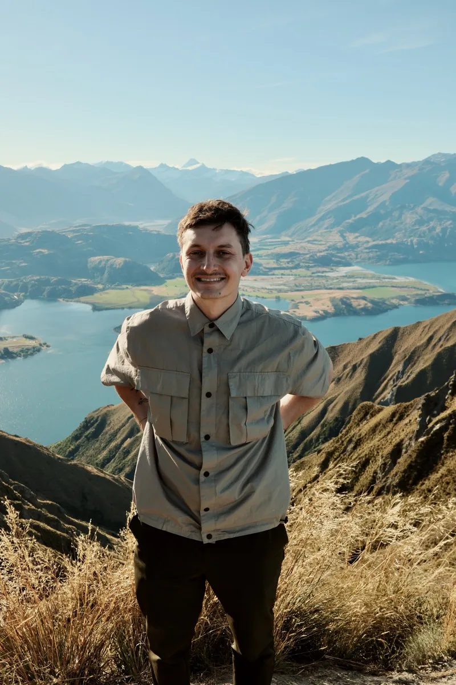
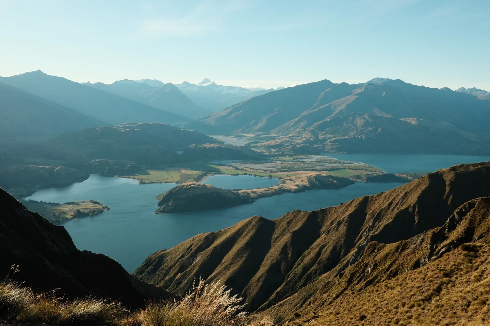
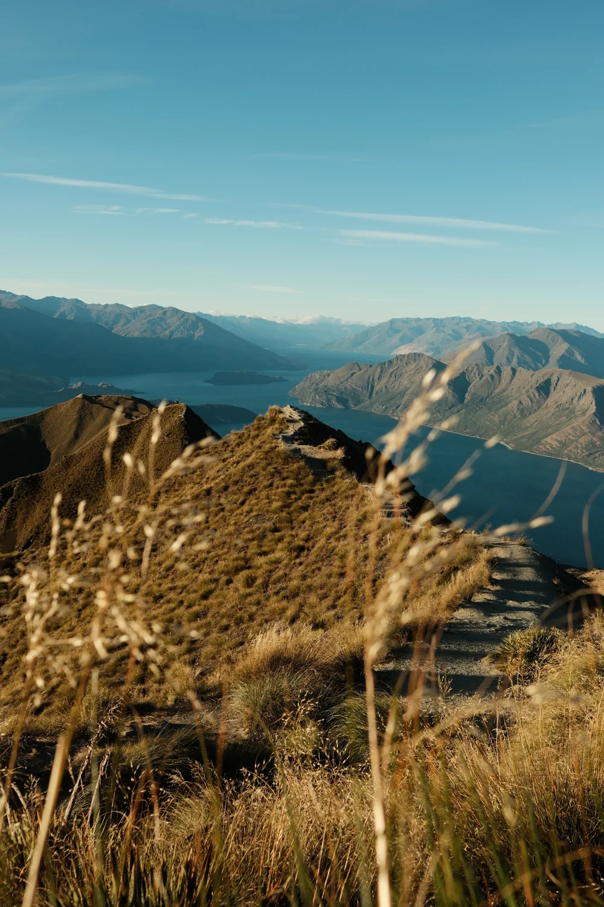

Самый растиражированный кадр Новой Зеландии — вот этот гребень над озером Ванака. В инстаграме он выглядит так, будто к нему подъезжаешь на машине и выходишь на минутку сделать фото.

Реальность: 16 километров пешком и больше километра набора высоты по голому склону овечьей фермы. Ни одного дерева. Серьёзно — от парковки до верха нет ни тени, ни воды.

Я поднялся в середине марта, во второй половине дня. Тут уже осень: трава золотая, свет мягкий, и главное — на точке, куда в сезон по утрам стоит живая очередь за одним и тем же кадром, было пусто. Гребень, озеро на 360 и ветер. Вся очередь — я и ещё пара человек. **Дальше — как пройти это правильно, во сколько выходить и сколько стоит.** Всё проверено лично.

> **Если коротко:** Roys Peak — самый известный хайк Новой Зеландии, над озером Ванака на Южном острове. Культовый кадр — на **смотровой (~6,3 км в одну сторону, 804 м набора)**, не на вершине; до **вершины — 8 км и 1228 м**. Полный круг **5–6 часов**, сложность высокая. Сам трек **бесплатный**. На тропе **нет воды и тени**. Парковка забита **к 9 утра** — выходи на рассвете или, как я, после обеда. С **1 октября по 10 ноября трек закрыт** на ягнение.

> По некоторым ссылкам в гайде можно сразу оформить или забронировать — цена для тебя та же, а блог получает небольшую комиссию. Это держит его бесплатным.

---

## Что такое Roys Peak и почему все туда лезут

Roys Peak — это отдельно стоящая гора над Ванакой на Южном острове. Её слава держится на одном кадре: узкий травяной гребень уходит вниз к озеру, человек стоит на самом краю, а вокруг — вода и горы во все стороны. Ощущение, будто стоишь на краю земли.

Так вот, **этот кадр — не с вершины.** Он со смотровой площадки на гребне, примерно на две трети подъёма. Большинство тех, кто гонится за фотографией, до настоящей вершины даже не доходят — снимаются на гребне и идут вниз. И правильно делают: вид с гребня уже открыточный, а последний отрезок до вершины добавляет высоты и усталости, но не сильно меняет картинку.

Что важно понять заранее: **это не прогулка, это полноценный подъём.** Тропа идёт зигзагами по открытому склону действующей овечьей фермы. Уклон постоянный, без выполаживаний, где можно отдышаться на ходу. Наверх идёшь и идёшь вверх, вниз — километр с лишним спуска по той же крутизне, и вот это уже про колени.

---

## Сколько идти: смотровая или вершина

Первое, что надо решить, — до смотровой (за фото) или до самой вершины. Разница в дистанции небольшая, в усталости — заметная.

| | До смотровой | До вершины |
|---|---|---|
| Расстояние в одну сторону | ~6,3 км | ~8 км |
| Набор высоты | ~804 м | 1228 м |
| Время вверх | ~2,5–3 часа | +30 минут от смотровой |
| Что получаешь | тот самый кадр, вид на 360 | галочка «был на вершине», вид почти тот же |
| Кому | 90% идущих сюда | кто хочет пройти до конца |

Полный маршрут туда-обратно до вершины — **16 км, 1228 м набора, 5–6 часов** в нормальном темпе с остановками. Сложность высокая: не технично (тропа хорошая, натоптанная), но физически тяжело из-за постоянного уклона и полного отсутствия тени.

**Честный совет:** если ты не заядлый хайкер и идёшь ради вида и фото — разворачивайся на смотровой. Сэкономишь час-полтора и колени на спуске, а лучший кадр сделаешь именно там.

---

## Когда закрыт и когда лучше идти

**Сначала главное, из-за чего люди зря приезжают: с 1 октября по 10 ноября Roys Peak закрыт.** Тропа идёт через овечью ферму, и на это время её закрывают на ягнение (lambing). Открывается 11 ноября. Планируешь октябрь-начало ноября — сюда не попадёшь, проверяй даты перед поездкой.

По сезонам (в Новой Зеландии всё наоборот, лето — декабрь-февраль):

* **Осень (март–апрель)** — мой выбор. Трава золотая, воздух прозрачный, жары нет, людей заметно меньше летнего пика. Я ходил в марте — идеально.
* **Лето (декабрь–февраль)** — пик. Длинный день и стабильная погода, но на смотровой утром реальная очередь за фото, а подъём по жаре без тени тяжёлый.
* **Зима (июнь–август)** — верх часто в снегу, тропа скользкая и опасная, нужна нормальная экипировка. Не для случайного туриста.

**Теперь про толпу — это ключевое.** Знаменитый кадр стал настолько популярным, что летом на смотровой выстраивается очередь: люди ждут по 20–40 минут, чтобы сфотографироваться на одном и том же выступе. Классический совет — **выходить затемно, часа в 4 утра**, чтобы встретить рассвет на гребне и успеть до толп.

Но есть второй способ, которым воспользовался я: **идти во второй половине дня.** Основная масса спускается к обеду, парковка освобождается, а на гребне ближе к вечеру почти никого. Свет мягче жёсткого полуденного, трава подсвечена. Минус один — рассчитай время, чтобы не спускаться в темноте: закладывай запас и возьми налобный фонарь на всякий случай.

---

## Парковка и как добраться

Roys Peak — рядом с Ванакой, а Ванака — это Южный остров, регион Отаго. Ближайший аэропорт — **Квинстаун (ZQN)**, оттуда до Ванаки около **1–1,5 часа на машине** через живописный перевал Кроун-Рейндж.

**Парковка** — в 6 км от центра Ванаки по дороге Wanaka–Mount Aspiring Road, от города 5–7 минут. Мест около сотни, и **к 9 утра в сезон она забита** — машины потом бросают вдоль дороги. Ещё один аргумент выйти либо очень рано, либо после обеда, когда утренние спускаются и места освобождаются.

**Без машины сюда неудобно.** Между Квинстауном и Ванакой ходит шаттл (Ritchies, около 40 NZD в одну сторону), но он высаживает в центре Ванаки, а до тропы ещё 6 км. Реально работающий вариант — своя машина: и до тропы довезёт, и вся Ванака с озёрами и виноградниками останется в твоём распоряжении.

Аренда на Южном острове — от 40–70 USD в день (Jucy, Apex, GO; по данным операторов на 2026, проверяй под даты). <a href="https://economybookings.tpk.mx/xlSFNA6p?erid=2VtzqxYvA5V&sub_id=roys_peak_2026" class="aff-cta" rel="sponsored">Сравнить прокат авто в Новой Зеландии</a>: агрегатор показывает локальных и международных прокатчиков с ценой под твои даты, бронь часто без предоплаты — удобно поймать машину на связку Квинстаун — Ванака.

---

## Что взять: воды нет, тени нет

Roys Peak прощает мало ошибок в снаряжении, потому что на склоне ты один на один с солнцем и уклоном.

* **Вода — 1,5–2 литра на человека.** На тропе нет ни ручья, ни крана. В жаркий день этого едва хватает, бери с запасом.
* **Защита от солнца.** Весь подъём — открытый склон, тени ноль. Новозеландское солнце жжёт быстрее, чем ждёшь (озоновый слой над регионом тоньше). Крем, кепка, очки.
* **Нормальные кроссовки или ботинки с протектором.** Наверх поднимаешься по натоптанной тропе, но **1228 метров спуска** по сыпучей подсохшей траве на гладкой подошве — это про подвёрнутые колени и голеностоп.
* **Ветровка.** Внизу может быть тепло и безветренно, а на гребне — сильный холодный ветер. Разница чувствительная.
* **Налобный фонарь** — если идёшь на рассвет (стартуешь в темноте) или задерживаешься к вечеру.

Отдельно про страховку. Подъём на 1228 метров, крутой спуск, подвёрнутый голеностоп в паре часов от дороги — это ровно то, что базовый туристический полис часто не покрывает. <a href="https://cherehapa.tpk.mx/GmVWjhCN?erid=2VtzquZTwb5&sub_id=roys_peak_2026&u=https%3A%2F%2Fcherehapa.ru%2Ftravel%2F" class="aff-cta" rel="sponsored">Собрать страховку с активным отдыхом</a> — в фильтрах отметь «треккинг / хайкинг», оформляется за пару минут, а лечение и эвакуация в Новой Зеландии стоят дорого.

---

## Сколько стоит Roys Peak

Самое приятное: **сам трек бесплатный.** Ни входа, ни платы за парковку, ни обязательного гида. Редкий случай, когда главная открытка страны не стоит ни доллара — только твои ноги и день.

Реальные расходы — вокруг тропы, и они опциональны:

| Статья | Ориентир |
|---|---|
| Вход на Roys Peak | 0 NZD |
| Аренда авто (день) | 40–70 USD |
| Ночь в Ванаке | от 120 NZD бюджетно |
| Шаттл Квинстаун — Ванака | ~40 NZD в одну сторону |
| Страховка с активным отдыхом | пара сотен ₽ в день |

Ванака — приятная база сама по себе: озеро, кафе, знаменитое дерево That Wanaka Tree прямо в воде. Стоит заночевать здесь ради утреннего или вечернего захода на гору — <a href="https://ostrovok.tpk.mx/xtyTcUcY?erid=2VtzqvE1cv3&sub_id=roys_peak_2026" class="aff-cta" rel="sponsored">Забронировать жильё в Ванаке</a>: Ostrovok принимает карты Visa/MC/МИР, в пик сезона в маленькой Ванаке жильё разбирают заранее.

Полную стоимость поездки в Новую Зеландию с перелётом и визой я разбираю в [гайде про южное сияние](/blog/aurora-new-zealand-2026/), а посчитать бюджет под свои даты можно в [калькуляторе](/calculator/).

---

## Стоит ли Roys Peak того — честно

Да. Но давай без розовых соплей.

Вид с гребня — один из лучших, что я видел с ног, а не с самолёта: озеро с островами внизу, ряды хребтов до горизонта, в ясный день на дальнем плане торчит снежная вершина — там уже хребты национального парка Маунт-Аспайринг. Ради этого стоит потерпеть подъём.

Что реально может испортить впечатление:

* **Толпа в сезон.** Если приедешь к 8–9 утра в январе, ты будешь стоять в очереди за кадром на краю обрыва. Вся романтика «на краю земли» — с двадцатью людьми за спиной. Решается временем: рассвет или вечер.
* **Недооценка подъёма.** Люди идут в кедах и с одной маленькой бутылкой, а это тяжёлый хайк на полдня. К обеду на тропе видишь тех, кто сел на склоне и не понимает, как спускаться.
* **Спуск.** Наверх тянет адреналин и вид, а вниз — километр с лишним однообразного крутого спуска, который выбивает колени сильнее, чем подъём.

**Что бы я сказал другу, который собрался:** не гонись за рассветной толпой, если не любишь вставать в три ночи — вечерний заход даёт тот же вид и пустой гребень. Разворачивайся на смотровой, вершина не обязательна. И надень нормальную обувь: спуск важнее подъёма.

---

## FAQ

**Сколько по времени занимает Roys Peak?**
Полный маршрут до вершины и обратно — 5–6 часов в нормальном темпе. До культовой смотровой (где делают знаменитое фото) — около 2,5–3 часов вверх, то есть весь круг можно уложить в ~5 часов, если не идти на саму вершину.

**Где делают то самое фото — на вершине?**
Нет, на смотровой на гребне, примерно на 6,3 км и 804 м набора. До вершины идти ещё ~30 минут, но кадр там не лучше. Большинство разворачивается на смотровой.

**Когда Roys Peak закрыт?**
С 1 октября по 10 ноября — закрытие на ягнение (тропа идёт через овечью ферму). Открывается 11 ноября. В остальное время трек доступен.

**Нужно ли платить за Roys Peak?**
Нет, трек бесплатный, платы за вход и парковку нет. Платишь только за то, как добраться и где жить.

**Как обойти толпу на Roys Peak?**
Два способа: выйти на рассвете (старт около 4 утра) или, наоборот, зайти во второй половине дня, когда утренние спустились. Днём к 8–9 утра парковка забита и на смотровой очередь за фото.

**Тяжёлый ли это хайк?**
Да, сложность высокая. Технически тропа простая и натоптанная, но 1228 м набора по открытому склону без тени физически тяжёлые, а километровый спуск бьёт по коленям. Новичку реально дойти хотя бы до смотровой при нормальном темпе и запасе воды.

**Что взять с собой?**
1,5–2 литра воды (на тропе воды нет), крем от солнца и кепку (тени нет), обувь с протектором для спуска, ветровку (на гребне холодный ветер), фонарь для раннего или позднего выхода.

**Как добраться до Roys Peak без машины?**
Шаттл из Квинстауна до Ванаки (~40 NZD в одну сторону) высаживает в городе, а до тропы ещё 6 км — нужно такси или попутка. Практичнее взять машину: до парковки довезёт и остальную Ванаку покажет.

---

## Что делать дальше

* [Милфорд-Саунд 2026](/blog/milford-sound-2026/) — вторая обязательная точка Южного острова: каяк, круиз и почему туда надо в дождь
* [Южное сияние в Новой Зеландии 2026](/blog/aurora-new-zealand-2026/) — маршрут по Южному острову, виза и биометрия детально
* [Новая Зеландия — кратко](/new-zealand/) — виза, сезоны, логистика по стране
* [Таблица сезонов](/seasons/) — лучшие месяцы для НЗ и 70+ направлений
* [Калькулятор бюджета](/calculator/) — перелёт, проживание и курс ЦБ РФ
* [Подпишись на @traveltriberu](https://t.me/traveltriberu) — разборы и маршруты без воды

---

*Актуально на 21 июля 2026. Дистанции, набор высоты и даты закрытия на ягнение — по данным Департамента охраны природы Новой Зеландии (DOC). Цены на аренду авто, жильё и шаттлы — операторы на момент поездки, проверяй под свои даты. Фото мои, март 2026.*
