import { airaloSub, aviasalesRoute, cherehapaTravel, ostrovokCountry, youtravelSub } from '../../data/affiliate.js';

Вопрос «куда ехать на сафари» на русском языке обычно решают за вас: показывают Серенгети и Масаи-Мара и предлагают тур. Цену при этом называют одну — за пакет, где входные билеты, спуски и сборы свалены в общую сумму. Разложить её обратно нельзя, и сравнить две страны между собой тоже.

Я открыл прайсы шести управлений парков — танзанийского, охраняемой зоны Нгоронгоро, южноафриканского и угандийского. Разброс оказался четырёхкратным. Сутки в Серенгети стоят **82,60 $ с человека**, сутки в Крюгере — **602 ранда, это 3 225 ₽**. А день в кратере Нгоронгоро на четверых в одном джипе выходит **13 384 ₽ с человека**, потому что за спуск на дно берут отдельные **295 $ с машины**.

**Мои сафари — Уганда, Замбия, Намибия и ЮАР, зима 2025/26.** Кении и Танзании, о которых спрашивают чаще всего, в моих поездках не было, и притворяться не буду: по ним я опираюсь на прайсы управлений парков, визовый портал и отчёты тех, кто ездил. Фотографии с животными в этой статье — угандийские, мои.

> **Если коротко:** первое сафари дешевле всего брать в **ЮАР** — 3 225 ₽ за день в парке, безвизовый въезд и можно ехать за рулём самому. **Танзания** дороже вдвое, но даёт Серенгети и Нгоронгоро; закладывайте на кратер 295 $ с машины сверх входа. **Кения** берёт 100 $ за день в Масаи-Мара и 200 $ в сезон миграции, а наличные там принимает только сам резерват. **Уганда** — не про львов, а про горилл: разрешение 800 $, вход в парк 45 $. Сафари **на Занзибаре нет** — оттуда летят или едут на материк. Перелёт в Найроби в среднем 65 500 ₽ туда-обратно. Эвакуация из национального парка стоит дороже самого сафари, поэтому полис берут первым делом: <a href={cherehapaTravel('safari_afrika_2026_tldr')} class="aff-cta" rel="sponsored">подобрать страховку для сафари</a>. <a href={youtravelSub('safari_afrika_2026_top')} class="aff-cta" rel="sponsored">Посмотреть авторские туры на сафари</a> малые группы с русскоязычным гидом, маршрут и даты видны до оплаты. 

---

## Под словом «сафари» продают четыре разных занятия

Разница между ними больше, чем между странами, и в описании тура её обычно не видно.

**Джип-сафари.** То, что представляют по умолчанию: машина с поднимающейся крышей, вы стоите в проёме и снимаете. Выходить из машины нельзя нигде, кроме отмеченных площадок. Это единственный формат, где за день реально увидеть Большую пятёрку.

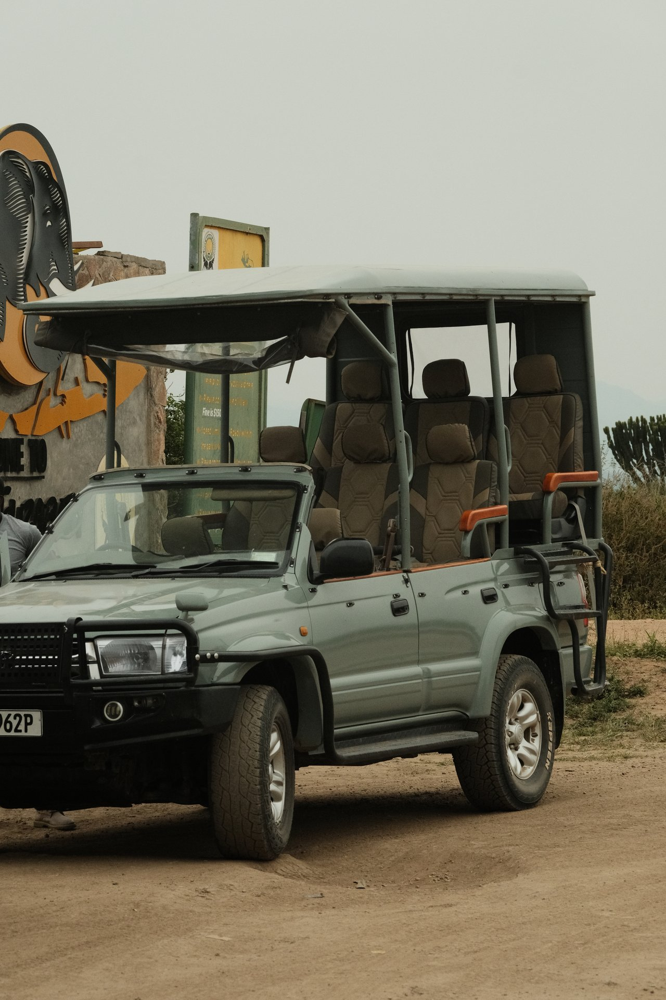

**Пешее сафари.** Идёте с вооружённым рейнджером, смотрите следы, растения и мелкую живность, к крупным зверям подходить не будете. В Нгоронгоро это отдельная услуга: короткая прогулка до четырёх часов — 23,60 $, длинная — 29,50 $.

**Лодочное сафари.** Бегемоты, крокодилы и птицы с воды. В Уганде это канал Казинга, в Замбии — Замбези, в Ботсване — дельта Окаванго. Свои лучшие кадры с бегемотами я снял с лодки: на суше они держат дистанцию, в воде подпускают.

**Самодрайв.** Едете сами на своей арендованной машине по дорогам парка. Работает в ЮАР и Намибии, где сеть асфальта и заправок внутри парков плотная. В Танзании и Кении так почти не делают: вход машины оплачивается отдельно, дороги грунтовые, а без гида звери находятся хуже.

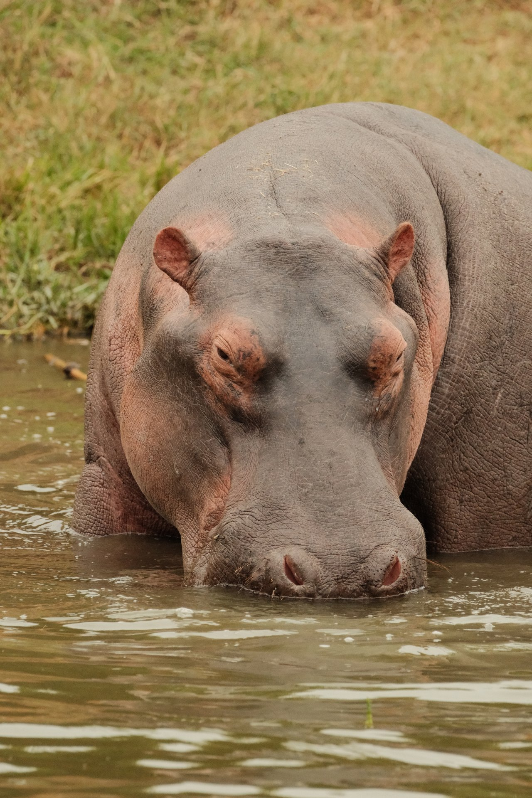

---

## Сколько стоит день в парке: шесть стран по официальным прайсам

Все цифры ниже — из прайсов управлений парков, а не из предложений операторов. Пересчёт в рубли по курсу Центрального банка на 29 августа 2026 года: **1 доллар = 85,6007 ₽**, **1 ранд = 5,357 ₽**.

| Парк и страна | Взрослый, за сутки | В рублях | Что сверху |
|---|---|---|---|
| Крюгер, ЮАР | 602 ранда | **3 225 ₽** | ничего: машина и дороги входят |
| Мурчисон-Фолс и Бвинди, Уганда | 45 $ | **3 852 ₽** | горилла — 800 $ отдельно |
| Тарангире и Маньяра, Танзания | 59 $ с налогом | **5 050 ₽** | машина 40 $ + налог |
| Нгоронгоро, Танзания | 70,80 $ | **6 061 ₽** | машина 47,20 $ и спуск 295 $ с машины |
| Серенгети, Танзания | 82,60 $ с налогом | **7 071 ₽** | машина 40 $ + налог |
| Масаи-Мара, Кения | 100–200 $ | **8 560–17 120 ₽** | билет живёт 12 часов, не сутки |

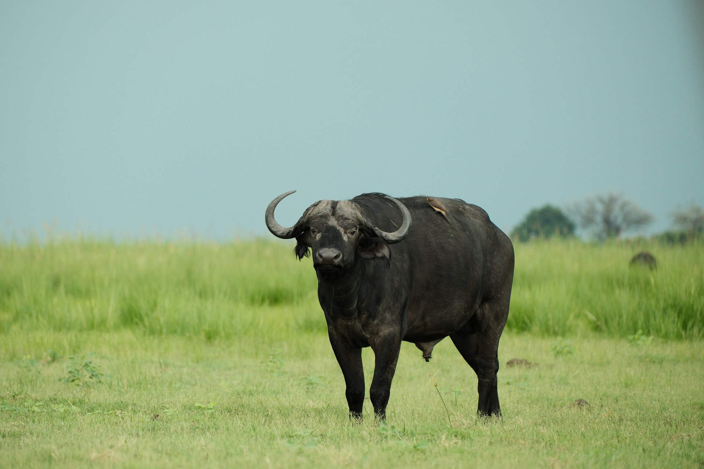

Четырёхкратный разброс внутри одного континента объясняется не качеством зверей. Он объясняется тем, кто платит за парк: в ЮАР сеть содержит государство и внутренний турист, в Танзании и Кении — почти целиком иностранец.

### Танзания: 70 долларов превращаются в 82,60

Прайс управления парков Танзании выложен на его сайте, и в нём есть подвох, из-за которого русские материалы называют разные числа. В таблице стоит **70 $** за Серенгети, а внизу мелкой строкой — «все ставки указаны без налога 18%». Настоящая сумма к оплате — **82,60 $ за сутки с человека**, и на самом сайте она же показана в шиллингах: 178 850.

Сбор действует ровно 24 часа с момента въезда. Ставка сезонная: с 16 мая по 14 марта — 70 $, с 15 марта по 15 мая — 60 $. Тарангире, Маньяра и Аруша дешевле: 50 и 45 $ соответственно, то есть 59,00 и 53,10 $ с налогом.

Ночевать внутри парка можно двумя способами. Общественный кемпинг — **30 $ с человека за ночь** (35,40 с налогом), и это единственный дешёвый вариант. Лодж внутри парка платит за вас концессию: **60 $ с человека за ночь с июля по сентябрь и 50 $ с октября по июнь**, и она сидит в цене номера.

⛔ Отдельно стоит сказать про дату прайса. Файл, который управление отдаёт по ссылке «скачать», называется **«с 1 июля 2023 по 30 июня 2024»**, а страница тарифов помечена финансовым годом 2023/24. То есть официальный источник на конец августа 2026 года публикует тариф двухлетней давности. Числа в нём и числа на живой странице совпадают, поэтому я беру их как действующие — но если гид назовёт больше, спорить будет не с чем.

### Нгоронгоро: 295 долларов только за то, чтобы спуститься

Кратер Нгоронгоро — отдельная охраняемая зона со своим управлением и своим прайсом, и складывать его с танзанийским нельзя. Вход — **70,80 $** со взрослого. Машина иностранной регистрации до двух тонн — **47,20 $**. А дальше строка, которой нет почти нигде в русских материалах: **сбор за спуск в кратер, 295 $ с машины за поездку**.

Посчитаем честный день. Четыре человека в одном джипе:

- вход: 4 × 70,80 = **283,20 $**
- машина: **47,20 $**
- спуск в кратер: **295,00 $**
- итого: **625,40 $**, это **156,35 $ с человека**, или **13 384 ₽**

Один день. Без жилья, еды, гида и бензина. Тот же день в Крюгере стоит 3 225 ₽ — **разница в 4,15 раза**.

Из этого следует практический вывод: в Нгоронгоро ездят полной машиной. Вдвоём тот же день выходит **241,90 $** с человека, вчетвером — 156,35 $, вшестером — **127,83 $**. Разница между парой и полной машиной — 1,9 раза. Так работают обе строки, которые берут с машины, а не с человека: спуск в кратер и въезд самого джипа делятся на всех, кто внутри.

<figure>
<svg viewBox="0 0 640 672" xmlns="http://www.w3.org/2000/svg" role="img" aria-label="Столбцы стоимости одного дня в парке на человека: Крюгер в ЮАР 3225 рублей, Мурчисон-Фолс в Уганде 3852, Тарангире в Танзании 5050, Серенгети 7071, Нгоронгоро со спуском в кратер 13384, Масаи-Мара в Кении в сезон миграции 17120." style="width:100%;height:auto;display:block">
  <g fill="currentColor" font-family="system-ui, sans-serif">
    <text x="0" y="34" font-size="23" font-weight="600">Один день в парке</text>
    <text x="0" y="66" font-size="23" font-weight="600">на человека, ₽</text>
    <text x="0" y="110" font-size="19">Крюгер, ЮАР</text>
    <rect x="0" y="120" width="81" height="30" fill="#4d7c0f"/>
    <text x="93" y="143" font-size="19" font-weight="600">3 225 ₽</text>
    <text x="0" y="192" font-size="19">Мурчисон-Фолс, Уганда</text>
    <rect x="0" y="202" width="97" height="30" fill="#4d7c0f"/>
    <text x="109" y="225" font-size="19" font-weight="600">3 852 ₽</text>
    <text x="0" y="274" font-size="19">Тарангире, Танзания</text>
    <rect x="0" y="284" width="127" height="30" fill="#a16207"/>
    <text x="139" y="307" font-size="19" font-weight="600">5 050 ₽</text>
    <text x="0" y="356" font-size="19">Серенгети, Танзания</text>
    <rect x="0" y="366" width="178" height="30" fill="#a16207"/>
    <text x="190" y="389" font-size="19" font-weight="600">7 071 ₽</text>
    <text x="0" y="438" font-size="19">Нгоронгоро, Танзания</text>
    <rect x="0" y="448" width="336" height="30" fill="#b91c1c"/>
    <text x="348" y="471" font-size="19" font-weight="600">13 384 ₽</text>
    <text x="0" y="520" font-size="19">Масаи-Мара, Кения</text>
    <rect x="0" y="530" width="430" height="30" fill="#b91c1c"/>
    <text x="442" y="553" font-size="19" font-weight="600">17 120 ₽</text>
    <text x="0" y="632" font-size="16">Курс ЦБ на 29.08.2026. Нгоронгоро — джип</text>
    <text x="0" y="656" font-size="16">на четверых со спуском; Масаи-Мара — сезон миграции</text>
  </g>
</svg>
<figcaption>Разброс четырёхкратный, и дешёвый край — не про худших зверей, а про то, что южноафриканскую сеть содержит внутренний турист.</figcaption>
</figure>

### ЮАР: самый дешёвый вход и удобная страна для поездки за рулём

Национальные парки ЮАР публикуют тариф на год вперёд, с 1 ноября по 31 октября. На сезон 2025/26 иностранец платит за Крюгер **602 ранда в день**, ребёнок 2–11 лет — 300. Для сравнения, гражданин ЮАР платит 134 ранда: разница между своим и чужим тут в 4,5 раза, и это она держит цену для иностранца низкой в абсолютных числах.

**Крюгер — самый удобный из больших парков для того, кто едет сам.** Внутри асфальтовые дороги, указатели, лагеря с заправками и магазинами, ворота работают по расписанию от рассвета до заката. Машину берут обычную легковую, полный привод не нужен. Про сезоны, декларацию и то, почему в Кейптауне купаются не там, где красиво, — в [отдельном разборе поездки в ЮАР](/blog/south-africa-guide-2026/).

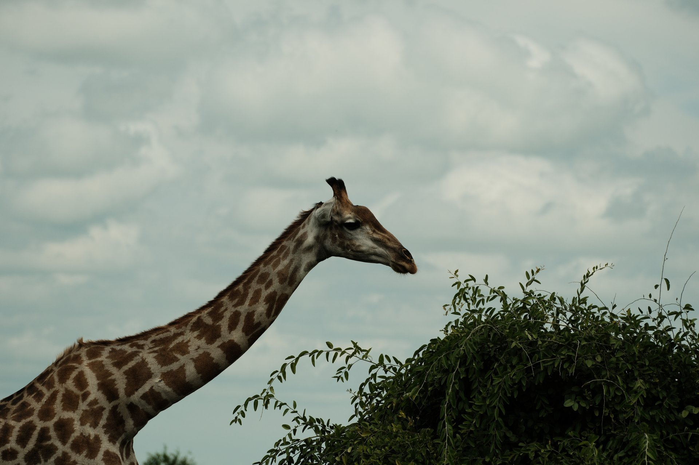

Плата за это — расстояние и время. Перелёт в Кейптаун стоит в среднем **82 854 ₽** туда-обратно, дорога с пересадкой в Стамбуле или Персидском заливе занимает 14–18 часов, а от Кейптауна до Крюгера ещё внутренний перелёт.

### Кения: цифра известна, официального источника у меня сегодня нет

С Кенией вышла честная неудача, и я её назову. **Все государственные сайты страны 29 августа 2026 года с моей стороны не открывались** — ни служба дикой природы, ни визовый портал, ни министерство туризма. Архивной копии страницы тарифов тоже нет: снимок отдаёт страницу с ошибкой. Поэтому официальную цену входа в Масаи-Мара я подтвердить не могу.

Что известно из двух независимых источников. Операторы, работающие в резервате, называют **100 $ с человека в день с января по июнь и 200 $ с 1 июля**, дети 9–17 лет — 50 $ круглый год. Ту же вилку независимо называет путешественница, побывавшая в Масаи-Мара в июле 2026 года: сто долларов в обычное время и двести в период миграции гну и зебр, и цену она описывает как главную причину отказаться от части маршрута. Считайте это ориентиром, а не нормой.

⛔ Вторая особенность Масаи-Мары важнее цены. **Билет там живёт 12 часов, а не сутки.** Человек, ездивший по паркам Кении соло в январе 2026 года, описал это так: если не выехать из парка до 18:00, берут плату за вторые сутки — ещё сто долларов. У танзанийских парков сбор действует полные 24 часа, и это меняет расчёт поездки сильнее, чем разница в ставке.

Подробнее про кенийские парки, электронное разрешение eTA и Великую миграцию — в [разборе поездки в Кению](/blog/kenya-guide-2026/).

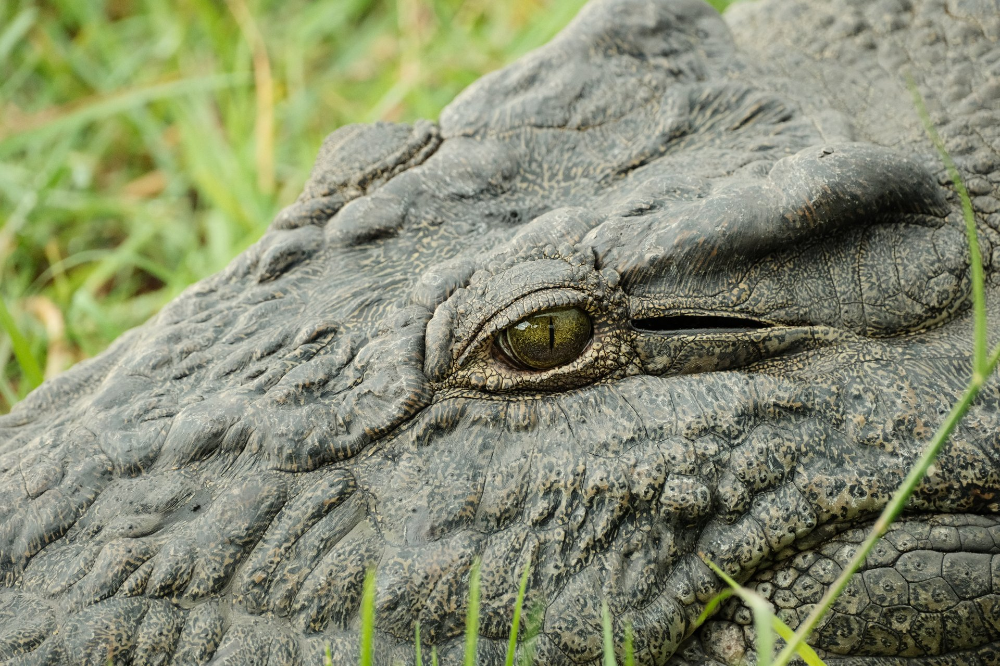

### Уганда: вход дешёвый, а горилла стоит как две недели в Танзании

Уганда стоит особняком: туда едут не за Большой пятёркой, а за горными гориллами. Управление дикой природы держит вход в парки на уровне **45 $ со взрослого** — вдвое дешевле Серенгети. А разрешение на треккинг к гориллам стоит **800 $ с человека**, и это отдельная строка.

В цену разрешения входят вход в парк на день, гид и отчисление общине. Правила жёсткие: возраст от 15 лет, группа не больше восьми человек, час у семьи горилл, десять метров дистанции, без вспышки. Больной простудой к гориллам не допускается — они заражаются от людей.

Мой собственный треккинг был в Бвинди, и главное, чего не пишут: подъём тяжёлый. Идёте по мокрому лесу вверх, следопыты рубят проход мачете, и сколько это займёт — час или пять — заранее не знает никто. [Полный отчёт о поездке в Уганду](/blog/uganda-safari-2026/) — отдельной статьёй.

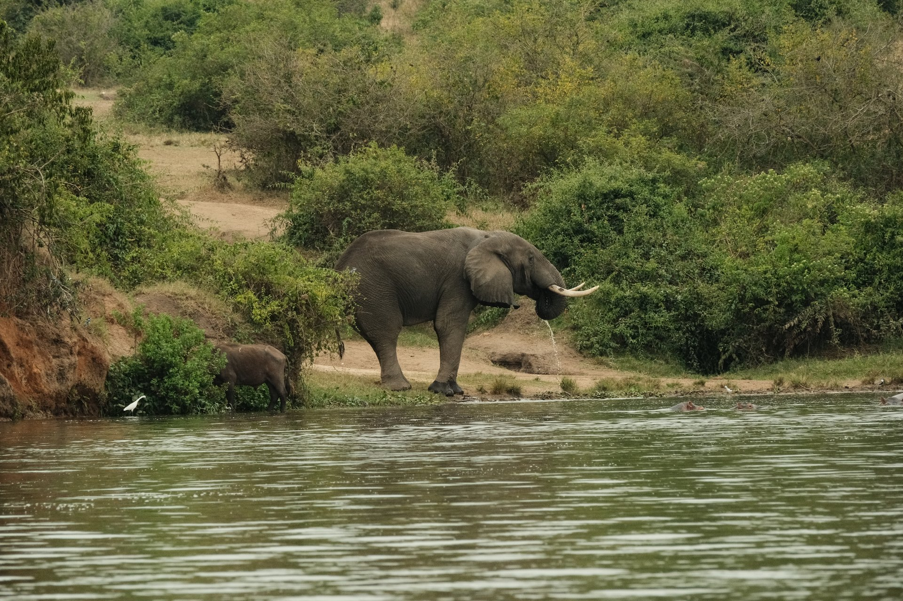

⛔ Один нюанс с прайсом Уганды: файл, который управление выкладывает на своём сайте, назван «июль 2024 — июнь 2026», то есть срок его действия истёк, а новый на конец августа 2026 года не опубликован. Числа выше — из него.

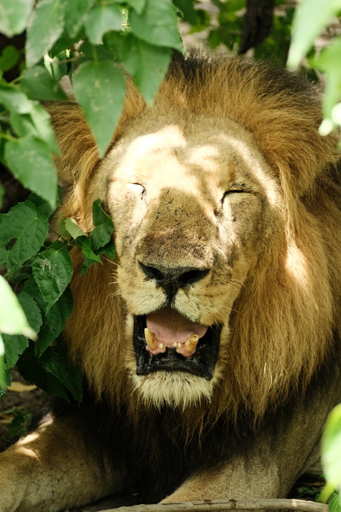

### Ботсвана, Замбия и Намибия: что там своё

Эти три страны в списке «куда на сафари» стоят ниже Кении и Танзании, и попадают туда те, кто едет во второй раз. Цену входа по ним я не проверял по официальным прайсам — управления парков этих стран в сегодняшнюю сверку не входили, поэтому чисел не называю. Назову то, за чем туда едут, — это в описаниях туров теряется.

**Ботсвана — вода вместо саванны.** Дельта Окаванго — река, которая никуда не впадает и разливается в пустыне. Сафари там частью идёт на долблёной лодке мокоро, а не на джипе: вас толкают шестом по протокам между папирусом, и звери смотрят на вас с берега. В Чобе на севере страны собираются одни из самых больших слоновьих стад Африки.

**Замбия — про пешее сафари.** Долину Луангвы называют его родиной, и там оно осталось основным форматом, а не дополнительной услугой. С замбийской стороны падает и Виктория: тут подходят к обрыву вплотную и промокают насквозь. Моя поездка была в январе, и радугу в водяной пыли я снял с тропы над обрывом.

**Намибия — сафари для тех, кто за рулём.** Этоша устроена вокруг солончака: звери приходят к немногим водопоям, и там их ждут, а не ищут по саванне. Дороги приличные, страна пустая, и это вторая после ЮАР точка, где имеет смысл ехать самому. Рядом — дюны Соссусфлей, к сафари отношения не имеющие, но обычно попадающие в тот же маршрут.

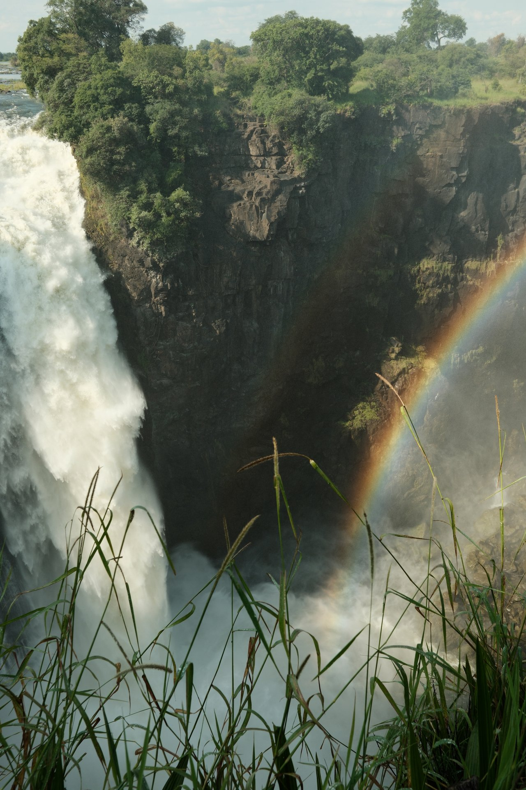

---

## Когда ехать: сезон видно по самим прайсам

Совет «ехать в сухой сезон» верен, но бесполезен: сухой сезон в Танзании и в ЮАР приходится на разные месяцы, а в Уганде его два. Полезнее смотреть, когда сами управления парков снижают цену — это и есть их собственная оценка низкого сезона.

| Страна | Что говорит прайс | Как это читать |
|---|---|---|
| Танзания | 60 $ вместо 70 с 15 марта по 15 мая | длинные дожди, грунтовки размывает |
| Кения | 100 $ вместо 200 с января по июнь | зверей меньше, но и людей тоже |
| ЮАР | цена не меняется весь год | сезон определяет не парк, а трава |
| Уганда | цена не меняется весь год | горилл смотрят круглый год |

Из таблицы следуют две вещи, которых нет в путеводителях.

**Танзания честно говорит, когда к ней не надо ехать** — и это два месяца, с середины марта до середины мая. В остальные десять месяцев ставка одинаковая, то есть управление не считает август лучше января.

**Кения делит год пополам не по погоде, а по миграции.** Ставка удваивается ровно 1 июля, когда стада гну заходят в Масаи-Мара с юга, и держится до конца года. Сухой сезон при этом начинается в январе.

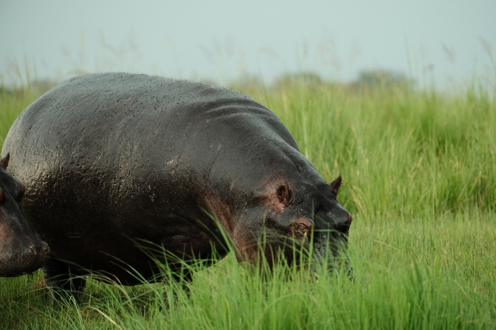

**У ЮАР сезон определяется травой, а не дождём.** Зимой, с мая по сентябрь, трава в Крюгере выгорает и ложится, зверей видно на километр, и они собираются у немногих оставшихся водопоев. Летом трава по пояс, зелено и красиво — и звери в ней не видны.

### Перелёт спорит с входным билетом

Тут прячется ловушка, которую видно только если положить рядом два календаря — цену парка и цену перелёта. Я взял свои данные по билетам из Москвы, обновлённые 28 августа 2026 года.

| Месяц | Найроби, туда-обратно | Что в это время в парке |
|---|---|---|
| ноябрь | **57 884 ₽** — минимум года | короткие дожди, зверей мало |
| декабрь–февраль | 59 000–59 800 ₽ | сухо, лучшее время Кении |
| март | 64 964 ₽ | начинаются длинные дожди |
| апрель–май | 73 368–74 771 ₽ | **дожди и максимум цены билета** |
| июнь–июль | 73 743–74 771 ₽ | миграция, билет в парк 200 $ |

Средний билет до Найроби — **65 500 ₽**, разрыв между лучшим и худшим месяцем — **29,2%**.

⛔ **Дешёвый по входному билету сезон Танзании совпадает с самым дорогим перелётом.** С середины марта по середину мая парк отдаёт 10 $ скидки в день, а авиабилет в те же недели дороже ноябрьского на 16 887 ₽. На неделе поездки скидка парка даст 70 $ — около 6 000 ₽, — а на билете вы потеряете втрое больше. Экономить на низком сезоне в Восточной Африке смысла нет.

Настоящая экономия лежит в другом месте: **декабрь и февраль дают почти минимальную цену билета и при этом сухую погоду в Кении и юге Серенгети**. Это и есть окно, куда стоит целиться.

<a href={aviasalesRoute('MOW','NBO','safari_afrika_2026_flight')} class="aff-cta" rel="sponsored">Сравнить билеты Москва — Найроби</a> все стыковки в одной выдаче, цена без наценки за поиск

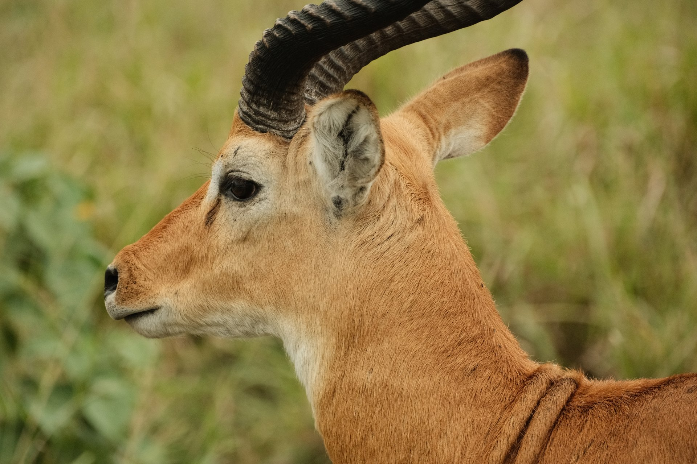

---

## Сафари на Занзибаре: его там нет

Это самый частый и самый неудобный вопрос темы: в месяц его задают около 1 800 раз. Ответ короткий — **на самом Занзибаре сафари не бывает**. Остров небольшой, лесной, и крупных зверей на нём нет: максимум — красные колобусы в лесу Джозани. Всё, что продают под словом «сафари на Занзибаре», происходит на материке.

Вариантов два, и оба длинные.

**Самолётом в Микуми или Ньерере на один день.** Ранний вылет с Занзибара, час в воздухе, полдня в парке, вечерний рейс обратно. По цене это самый дорогой способ увидеть слонов, по времени — единственный, укладывающийся в сутки.

**Машиной через Дар-эс-Салам на два-три дня.** Паром или короткий перелёт до материка, дальше пять-шесть часов по земле до Микуми. Дешевле, но день уходит в каждую сторону.

Отчёт о таком однодневном вылете от 15 октября 2022 года стоит прочесть целиком любому, кто собрался. Коротко: вместо обещанного выезда в 5:30 подъём перенесли на 4 утра; в аэропорту деньги взяли без квитанции и договора; посадочный выдали на чужое имя; обратный рейс перенесли, и рейнджер об этом не знал; в 17:30 самолёт ещё не вылетел, а в Танзании темнеет в 18 часов и подсветки на аэродроме в Микуми нет.

Вывод из этого не «не ездите», а «закладывайте запас». Однодневное сафари с острова — это конструкция из четырёх стыковок подряд, и ломается она вся целиком. Если сафари в поездке важно — планируйте под него отдельные дни на материке, а Занзибар оставляйте на пляжную часть. [Про сам остров, прямые рейсы и обязательный полис](/blog/zanzibar-2026/) — отдельно.

Танзанийская виза, кстати, покрывает и материк, и Занзибар: в анкете указывается только первый пункт въезда, второй визы не нужно.

---

## Шесть сценариев поездки

Ниже — готовые схемы с длительностью, нужна ли машина и честным минусом каждой.

**1. Первое сафари за рулём. ЮАР, 10–12 дней.** Кейптаун, перелёт до Нелспрейта, неделя в Крюгере на своей машине, лагеря внутри парка. Машина обязательна и в ней весь смысл. **Минус:** Большую пятёрку за рулём собирают дольше, чем с гидом, — вы не знаете, где кто был утром.

**2. Классика Восточной Африки. Танзания, 8–9 дней.** Аруша, Тарангире, Маньяра, Серенгети, Нгоронгоро, обратно. Машина с гидом, самому не поехать. **Минус:** самый дорогой вариант из всех, сборы съедают около трети бюджета.

**3. Миграция. Кения, 6–7 дней.** Найроби, Масаи-Мара на три-четыре ночи, Накуру или Амбосели на обратном пути. Только июль–октябрь. Машина с гидом. **Минус:** двойная ставка входного билета и максимум людей у переправ.

**4. Гориллы. Уганда, 8–10 дней.** Энтеббе, Бвинди с треккингом, Королевы Елизаветы с лодкой по каналу Казинга, Ишаша с древесными львами. Машина с водителем. **Минус:** разрешение 800 $ и физическая нагрузка; сидячий отдых это не.

**5. Сафари плюс пляж. Танзания и Занзибар, 12–14 дней.** Материк с парками, потом остров. Одна виза на всё. **Минус:** два перелёта внутри страны и совсем разный темп двух половин поездки.

**6. Дёшево и самостоятельно. Кения, 12–15 дней.** Общественным транспортом между парками, ночёвки в гестхаусах, сафари покупается на месте одним-двумя выездами. **Минус:** матату, ожидания и полная зависимость от чужого расписания; входные билеты платятся картой, которой у российского туриста может не быть.

| Сколько дней | Что складывается |
|---|---|
| 5–6 | один парк одной страны: Крюгер, или Масаи-Мара, или Микуми |
| 7–9 | северное кольцо Танзании либо Кения с двумя-тремя парками |
| 10–12 | ЮАР с Кейптауном и Крюгером; Уганда с гориллами и лодкой |
| 13–16 | сафари плюс океан: Танзания с Занзибаром, Кения с Диани |
| 18+ | две страны подряд — Кения и Танзания через границу Намангу |

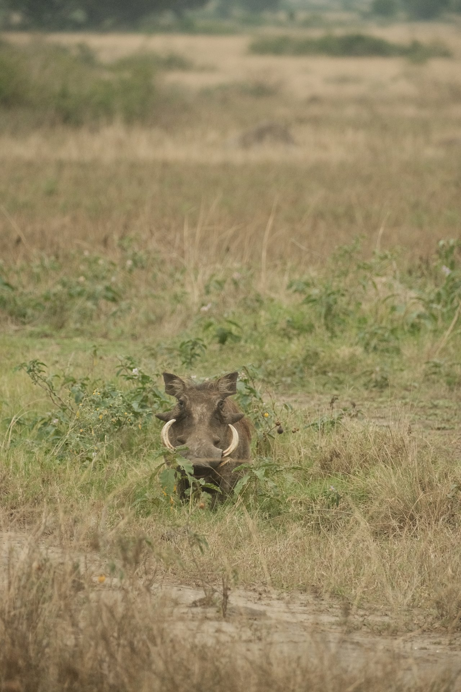

---

## Виза, прививки и чем платить

**Танзания.** Обычная однократная виза **50 $**, срок пребывания до 90 дней. Россия входит в список стран, чьи граждане получают визу по прилёте, но онлайн-заявку обрабатывают до десяти дней, и подавать заранее спокойнее. Одна виза действует и на материке, и на Занзибаре.

⛔ **Сбор оплачивается только картой Visa или Mastercard** — других способов на портале нет. Российская карта не пройдёт, и это касается не одной визы: в парках Кении, по отчёту января 2026 года, наличные тоже не принимают, платят картой иностранного банка или через мобильные деньги M-Pesa. Единственное исключение — сам резерват Масаи-Мара, там берут наличными. Как выпускать иностранную карту и чем платить за границей — [в отдельном разборе](/blog/pay-abroad-2026/).

**ЮАР.** Визы нет: в перечне Департамента внутренних дел у российских паспортов записано 90 дней. С 1 июля 2026 года декларацию о вещах и валюте подают онлайн до поездки.

**Кения.** Вместо визы электронное разрешение eTA, сбор около 30 $, оформляется онлайн.

**Уганда.** Виза оформляется через электронную систему иммиграционной службы.

**Прививки.** Главная — жёлтая лихорадка. Сертификат спрашивают при въезде из стран эндемичной зоны, а при маршруте через несколько африканских стран подряд это почти любой перелёт. Прививка ставится один раз и действует пожизненно. Отдельно стоит профилактика малярии: Восточная Африка — зона риска круглый год, и в отличие от жёлтой лихорадки таблетки надо начинать пить до вылета.

**Страховка.** Лечение платное везде, и главная строка полиса для сафари — не медицина, а эвакуация: из парка до больницы бывает несколько сотен километров. <a href={cherehapaTravel('safari_afrika_2026_ins')} class="aff-cta" rel="sponsored">Подобрать полис с покрытием эвакуации</a> сравнивает предложения страховых, страну выбираете в форме, полис приходит в PDF

**Связь.** Мобильный интернет в парках работает пятнами, но в лагерях и на дорогах между парками ловит. В Кении симка нужна ещё и для оплаты через M-Pesa. <a href={airaloSub('safari_afrika_2026')} class="aff-cta" rel="sponsored">Купить eSIM до вылета</a> подключается до поездки, местную симку в аэропорту искать не надо

**Жильё.** Внутри парков брони идут через сами парки или лоджи, а города-ворота — Аруша, Найроби, Нелспрейт — бронируются обычным способом. <a href={ostrovokCountry('tanzania','safari_afrika_2026_hotel')} class="aff-cta" rel="sponsored">Отели в Танзании</a> оплата картой МИР, подтверждение сразу

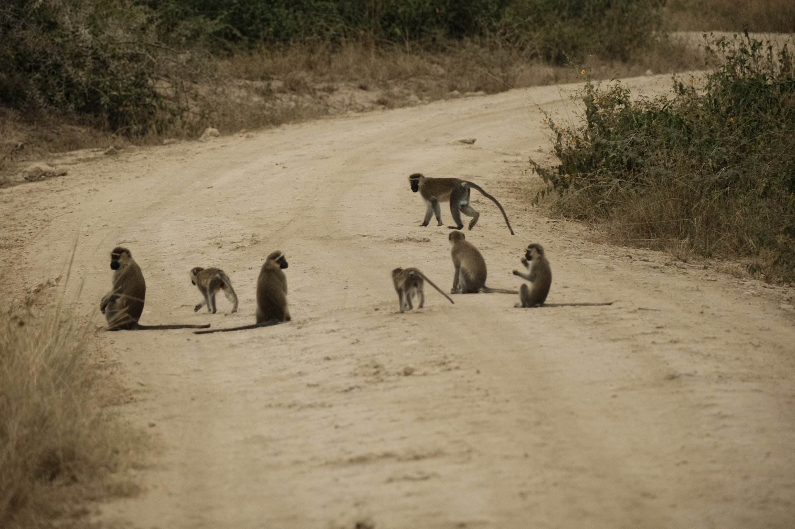

---

## Что пишут те, кто был

Разобрал 111 сообщений из четырёх веток африканского раздела форума путешественников за период с 15 октября 2022 по 4 августа 2026 года. Это четыре отчёта, а не весь раздел, поэтому представительной выборку считать нельзя. Но четыре вещи в них повторяются у разных людей, и ни одной из них нет в описаниях туров.

**Наличные в парках Кении не работают.** Человек, проехавший страну соло в январе 2026 года, столкнулся с этим на вулкане Лонгонот: вход 50 $, наличные не принимают, нужна карта иностранного банка или мобильные деньги. Позже он же уточнил в ответе на вопрос: наличными можно заплатить только в Масаи-Мара, во всех остальных парках — карта либо M-Pesa. Курс обмена при этом лучше в городе, чем в аэропорту: 127 против 125,5 шиллинга за доллар.

**Двенадцать часов — это не сутки.** В том же отчёте: гид тянул время у дерева с леопардом, и группе пришлось срочно выезжать, потому что после 18:00 с них взяли бы плату за второй день — ещё по сто долларов с человека. Впечатление от сафари это испортило сильнее, чем сама сумма.

**Двойная цена в сезон миграции — не слух.** Женщина, ездившая в Кению в июле 2026 года, называет ту же вилку, что и операторы: сто долларов в обычное время и двести в период миграции. Её группа в Хеллс-Гейт не поехала как раз из-за цены билетов.

**Верхняя планка стоит десять тысяч долларов.** Отчёт о десяти днях в частных заповедниках Мары в ноябре–декабре 2025 года: лагерь около 600 $ с человека в день со всей едой, напитками и выездами, машина максимум на шестерых. Вся поездка, включая частную машину и без международных перелётов, обошлась почти ровно в 10 000 $ за 11 ночей.

---

## Частые вопросы

**В какой стране Африки лучше сафари?**

Для первой поездки — ЮАР: вход 602 ранда в день, безвиз, можно ехать самому. За Большой пятёркой в один день — Танзания или Кения. За гориллами — Уганда или Руанда. За водой и слонами — Ботсвана.

**Сколько стоит сафари в Африке?**

Только входные билеты: от 3 225 ₽ за день в Крюгере до 13 384 ₽ за день в Нгоронгоро на четверых в машине. С жильём, гидом и транспортом бюджетный формат Восточной Африки начинается примерно с 200–300 $ в день на человека, частные заповедники Кении — около 600 $ в день.

**Кения или Танзания — где лучше сафари?**

Танзания даёт больше пейзажа и полные сутки на билет, Кения — концентрацию зверей на меньшей площади и короткие переезды. По деньгам в сезон миграции Кения дороже: 200 $ за 12 часов против 82,60 $ за 24 часа в Серенгети.

**Когда ехать на сафари?**

В Восточную Африку — декабрь и февраль: сухо, а билет из Москвы близок к годовому минимуму. В ЮАР — с мая по сентябрь, когда трава выгорела и зверей видно.

**Нужна ли виза в Танзанию?**

Да, обычная стоит 50 $ и даёт до 90 дней. Россия в списке стран, получающих визу по прилёте, но заявку лучше подать заранее. Одна виза покрывает и Занзибар.

**Есть ли сафари на Занзибаре?**

Нет. Крупных зверей на острове не водится, все «сафари с Занзибара» — это вылет или выезд на материк, в Микуми или Ньерере.

**Сколько стоит увидеть горилл?**

Разрешение в Уганде — 800 $ с человека, это 68 481 ₽. Вход в парк на день, гид и отчисление общине в цену входят.

---

## Читайте также

- [Кения 2026: сафари, виза eTA, бюджет](/blog/kenya-guide-2026/) — парки, Великая миграция, как собрать поездку самому
- [Уганда: гориллы Бвинди и сафари](/blog/uganda-safari-2026/) — личный отчёт о десяти днях
- [ЮАР 2026: безвиз, декларация SARS, сезоны](/blog/south-africa-guide-2026/) — Крюгер, Кейптаун и почему сезоны не совпадают
- [Занзибар 2026: прямые рейсы, полис, сезон](/blog/zanzibar-2026/) — пляжная половина поездки
- [Чем платить за границей](/blog/pay-abroad-2026/) — карты, которые работают в Африке
