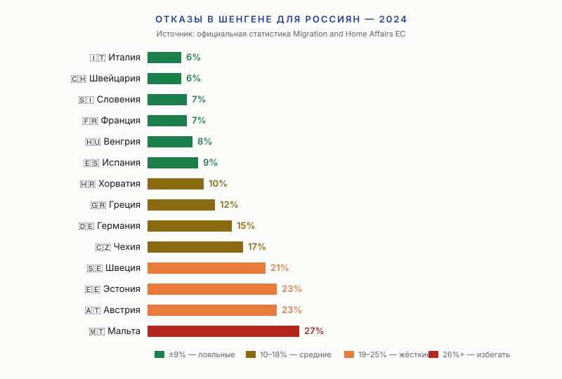
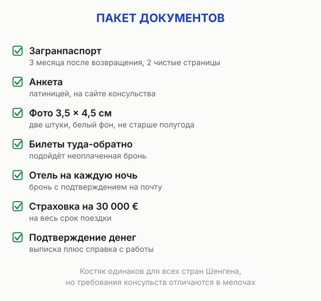
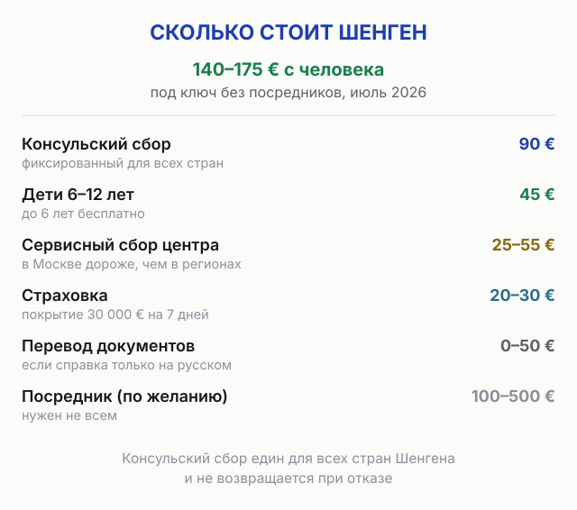
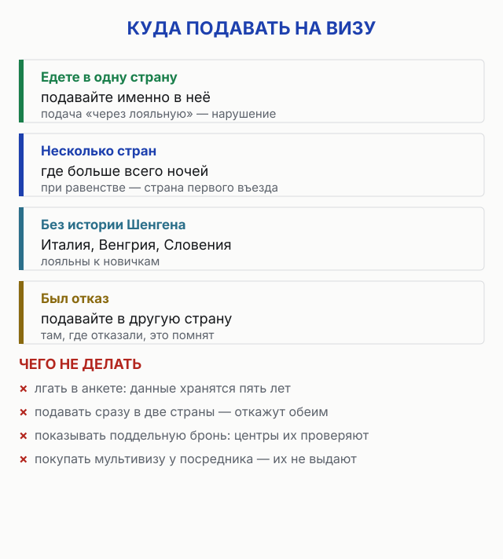

**Мальта — 26,7% отказов. Италия — 5,2%.** Тот же паспорт, тот же пакет документов, та же цель «туризм». По [данным ЕС за 2024](https://home-affairs.ec.europa.eu/policies/schengen-borders-and-visa/visa-policy_en) разница в шансах — почти **в 4 раза** в зависимости от консульства подачи.

С 7 ноября 2025 года многократную шенгенскую визу россиянам почти не выдают: по решению Еврокомиссии она осталась близким родственникам тех, кто легально живёт в ЕС, родственникам граждан ЕС и транспортникам — водителям, морякам, поездным бригадам. Остальным дают однократную, под даты конкретной поездки. Это первое из трёх изменений, которые поменяли правила игры в 2026: дальше биометрия EES на границе и точечное ужесточение ещё в нескольких странах. Подача в «правильное» консульство теперь — ключевой фактор успеха (по нашей оценке на основе статистики ЕС за 2024).

Разбираемся: куда реально дают шенген россиянам в 2026, где меньше всего отказывают, что собирать, сколько стоит и как избежать типичных ошибок при подаче.

> **Если коротко:** шенген россиянам дают, но **с 7 ноября 2025 года почти всем только однократный**, под даты конкретной поездки. Многократную оставили близким родственникам жителей ЕС и транспортникам; в обоснованных случаях её всё ещё можно получить, доказав необходимость частых поездок. Меньше всего отказов у Франции, Италии, Греции и Испании, больше всего у Мальты, Австрии и Эстонии. Под ключ выходит около **150–170 €**, решение принимают за 15 дней, в сложных случаях до 45. Общий отказ россиянам снизился до **6,4%**.

> **Связано:** [EES в Шенгене 2026 — биометрия для россиян](/blog/ees-shengen-2026/) — даже с визой на границе теперь обязательная биометрия.

> По некоторым ссылкам в гайде можно сразу забронировать или оформить — цена для вас та же, а блог получает небольшую комиссию. Это держит его бесплатным.

---

## Главное за 30 секунд

* **С 7 ноября 2025** многократную визу выдают узкому кругу: близким родственникам россиян, законно живущих в ЕС, и граждан ЕС — на год при трёх использованных визах за два года; водителям, морякам и поездным бригадам — на девять месяцев при двух визах. Всем прочим однократная, под даты поездки. Решение касается только тех, кто подаёт документы внутри России.
* **С 10 апреля 2026 действует** [биометрия EES](/blog/ees-shengen-2026/) на границе — фото лица + отпечатки пальцев; в крупных аэропортах время прохода границы выросло.
* **Лояльные страны:** Франция, Италия, Греция, Испания (отказы 5–10%, [данные ЕС за 2024](https://home-affairs.ec.europa.eu/policies/schengen-borders-and-visa/visa-policy_en)).
* **Жёсткие страны:** Мальта (26.7%), Австрия (22.8%), Эстония (22.6%), Швеция (20.9%).
* **Стоимость:** 90 € консульский сбор + сервисный сбор визового центра, который по визовому кодексу не превышает половины консульского, то есть 45 €, + страховка от 20 € = около **150–170 €** под ключ (на июль 2026).
* **Сроки:** по визовому кодексу решение принимают за 15 календарных дней, в сложных случаях срок продлевают максимум до 45. На практике выходит 3–4 недели, подавать стоит минимум за полтора месяца до вылета.
* **Свежие данные ЕС за 2025** (опубл. 28.05.2026): общий отказ россиянам снизился до **6,4%** — третий год падения (10,6% в 2023 → 7,5% в 2024 → 6,4% в 2025). Постранновая разбивка ниже — за 2024 (последняя полная).
* **Шенген открывает не только страны Шенгена.** С действующей шенгенской визой пускают на 30 дней в Черногорию, а она [с 1 ноября 2026 года закрывает безвиз для россиян](/blog/montenegro-visa-2026/) — отдельную черногорскую визу владельцу шенгена оформлять не нужно.

---

## Куда реально дают визу россиянам

**Реальнее всего получить визу через лояльные консульства — Италия (5,2% отказов), Швейцария (4,7%), Португалия (4,8%), Германия (5,4%), Хорватия и Словения (по 5,5%). Дальше идут Испания (7,9%), Швейцария (~6%), Франция (~7%), Словения (~7%), Венгрия (~8%), Испания (~9%).** Жёстче всех отказывают Мальта (26.7%), Австрия (22.8%) и Эстония (22.6%); Латвия, Литва и Финляндия туристам из РФ визы практически не выдают.

Цифры по странам — официальная статистика ЕС за 2024 год (последняя полная постранновая разбивка по консульствам в России); общие итоги за 2025 вышли: отказ россиянам 6,4% против 7,5% в 2024 — тренд на снижение. Источник — [Migration and Home Affairs](https://home-affairs.ec.europa.eu/policies/schengen-borders-and-visa/visa-policy_en).

### Лояльные (отказ 5–10%)

| Страна | % отказов | Тип визы | Заметки |
|---|---|---|---|
| **Франция** | ~7% | Однократная под даты | Самая лояльная для туристов. ВЦ в Москве и СПб. |
| **Италия** | 5,2% | Однократная или до 90 дней | По отзывам на Винском (2024⁠–⁠2025), часто дают на 3 месяца, не строго под даты. |
| **Греция** | ~12% | Однократная под даты | Стала жёстче с 2024, но шансы хорошие. |
| **Испания** | 7,9% | Однократная или до 90 дней | Лояльна к туристам. ВЦ работают стабильно. |
| **Венгрия** | ~8% | Однократная | Бюджетная альтернатива популярным. |
| **Словения** | 5,5% | Однократная | Маленькая страна, лояльное консульство. |
| **Швейцария** | 4,7% | Однократная | Не ЕС, но Шенген. Дорогое сервисное обслуживание. |
| **Хорватия** | 5,5% | Однократная | Вступила в Шенген в 2023. Лояльны к туристам. |

**Редакция рекомендует.** Если документы однозначные и реально едете в одну страну — подавайте именно туда. Для гибкости — Италия или Франция: по отзывам заявителей в 2024–2025 они чаще дают визу с горизонтом 3 месяца, не привязывая к датам.

### Средние (отказ 10–18%)

* **Германия** — по цифрам одна из самых лояльных: 5,4% отказов. Требует подробного маршрута.
* **Португалия** — 4,8% отказов, одна из самых лояльных; сроки рассмотрения долгие, но по кодексу не дольше 45 дней.
* **Чехия** — была лояльной, ужесточили в 2024.

### Жёсткие (отказ 20%+)

| Страна | % отказов | Почему |
|---|---|---|
| **Мальта** | 26.7% | Самая жёсткая. Не подавайте без сильной мотивации. |
| **Австрия** | 22.8% | Резко ужесточилась с 2023. По отзывам заявителей в 2024 — отказы часто без развёрнутых объяснений. |
| **Эстония** | 22.6% | По данным ЕС за 2024 — 22.6% отказов; туристические визы россиянам ограничены (источник: МИД Эстонии). |
| **Швеция** | 20.9% | Ужесточение с 2024. Большие требования к финансам. |

Россияне-мигранты в Эстонии/Латвии/Литве — отдельная история, через эти страны лучше не подавать как турист.

### Не выдают вообще или почти

* **Латвия, Литва** — туристические визы практически не выдают россиянам с 2022.
* **Финляндия** — закрыла консульство для туристов из РФ.
* **Польша** — крайне ограниченно, только для близких родственников (по официальной позиции МИД Польши, 2024).

---

## Какие документы нужны для шенгена россиянам в 2026?

Базовый пакет одинаковый для всех стран Шенгена. Нюансы у каждой страны свои, но костяк один.

### Обязательно

1. **Загранпаспорт** — оригинал + копия. Срок действия минимум 3 месяца после возвращения, 2 чистые страницы.
2. **Анкета** — на сайте консульства/визового центра. Заполняется латиницей.
3. **Фото 3.5 × 4.5 см** — 2 шт., цветное, на белом фоне, не старше 6 месяцев.
4. **Бронь авиабилетов** — туда-обратно. Допустимы неоплаченные брони.
5. **Бронь отелей** на каждую ночь поездки. Booking из РФ не работает — для брони визовых отелей берите Ostrovok: российский сервис, отели в 220 странах, принимает РФ-карты (Visa/MC/МИР). <a href="https://ostrovok.tpk.mx/xtyTcUcY?erid=2VtzqvE1cv3&sub_id=schengen_visa_2026" class="aff-cta" rel="sponsored">Забронировать отель для визы</a> — оплата картой МИР работает, бронь приходит на почту для печати в пакет.
6. **Страховка** — покрытие минимум **30 000 €**, на весь срок поездки. Удобный поиск с фильтром по покрытию — Cherehapa, от 20 € за 7 дней (на май 2026). <a href="https://cherehapa.tpk.mx/fkM7suze?erid=2VtzquZTwb5&sub_id=schengen_visa_2026" class="aff-cta" rel="sponsored">Оформить страховку для Шенгена</a> — полис подбирается под нужную страну и даты поездки, принимается консульствами. Все требования к полису (репатриация, зона действия, срок) — в разборе [Страховка для шенгенской визы 2026](/blog/schengen-insurance-2026/).
7. **Подтверждение финансов** — выписка с карты + справка с работы или подтверждение источника дохода.

### Финансовые требования

| Параметр | Минимум | Идеал |
|---|---|---|
| Остаток на карте | 50 €/день | 100 €/день |
| Подтверждённый доход | 30 000 ₽/мес | 80 000 ₽/мес |

*Ориентировочные значения по практике 2024–2025; официальных порогов консульства ЕС не публикуют.*
| Срок выписки | не старше 1 мес | свежая |

**Карты иностранных банков** (Грузия, Армения, Казахстан) принимают многие консульства, но не все. Уточняйте на сайте конкретного ВЦ. Если карта только зарубежного банка — нужна переведённая выписка с печатью.

### Что добавляет шансы

* **История путешествий** — старые шенгены, штампы, поездки в визовые страны (Япония, США, Канада, Великобритания).
* **Подтверждение возвращения** — недвижимость в РФ, семья, бизнес, постоянная работа.
* **Спонсорство** — если едете «за чужой счёт» (родственник, муж/жена), нужны документы о родстве + спонсорское письмо + копии финансов спонсора.

---

## Сколько стоит шенген россиянам в 2026?

**Под ключ без посредников — около 140–175 € (≈14 000–17 500 ₽) с человека (на июль 2026).** Сюда входят фиксированный консульский сбор 90 €, сервисный сбор визового центра 25–55 €, страховка 20–30 € и при необходимости перевод документов. С посредником добавляется их комиссия.

| Платёж | Стоимость | Где |
|---|---|---|
| Консульский сбор | **90 €** (≈9000 ₽) | Все страны, фиксированно ЕС ([Регламент ЕС 2019/1155](https://eur-lex.europa.eu/eli/reg/2019/1155/oj), повышение с 11.06.2024) |
| Дети 6⁠–⁠12 лет | 45 € | — |
| Дети до 6 лет | бесплатно | — |
| Сервисный сбор ВЦ | до 45 € | Сильно зависит от страны и центра: Нидерланды ~26 €, Швейцария ~35 €, Москва дороже регионов |
| Страховка (30 000 €, 7 дней) | 20⁠–⁠30 € | Любой страховщик |
| Перевод документов | 0⁠–⁠50 € | Если справка только на русском |
| Услуги посредников (опционально) | 100⁠–⁠500 € | Если не хотите подавать сами |

**Итого без посредников:** около **140–165 €** (≈14 000–16 500 ₽) с одного человека.

С посредником — добавьте сверху их комиссию. Посредник нужен только если боитесь ошибиться в анкете, хотите проверку пакета перед подачей или живёте в регионе без визового центра.

---

## Где подавать в Москве

Все основные страны принимают через [VFS Global](https://www.vfsglobal.com/) или собственные визовые центры:

* **Франция (VFS Global):** Большая Сухаревская площадь, 16/18, стр. 1.
* **Италия (VMS):** Большой Каретный переулок, 20, стр. 1.
* **Испания (BLS):** Сущёвский Вал, 31, стр. 1.
* **Греция (GVCW):** Шлюзовая набережная, 6.
* **Венгрия (VFS Global):** ул. Сущёвский Вал, 31.
* **Швейцария (TLS):** Серебрянический пер., 9.

Последняя сверка адресов — май 2026; перед подачей проверяйте на [vfsglobal.com/ru](https://www.vfsglobal.com/). Запись только онлайн.

---

## Стратегия: как выбрать страну для подачи

### Если едете в одну конкретную страну

Подавайте в неё. Подача в Италию ради Греции — нарушение правила «первой страны въезда» ([Визовый кодекс ЕС 810/2009, ст. 5](https://eur-lex.europa.eu/legal-content/EN/TXT/?uri=CELEX%3A32009R0810)). Могут отказать или аннулировать визу при повторной подаче.

### Если планируете несколько стран

Подавайте в страну, где **проведёте больше всего ночей**. Если поровну — в страну **первого въезда**.

Пример: Москва → Париж (3 ночи) → Барселона (5 ночей) → Москва. Подача — в Испанию (больше ночей), въезд через Париж — допустимо.

### Если хотите максимум шансов

* **Без истории шенгена:** Италия, Венгрия, Словения, Хорватия — лояльны к новичкам.
* **С хорошей историей:** Франция или Италия — могут дать визу на 3 месяца, не строго под даты.
* **С отказом в прошлом:** избегайте страны, где отказывали (запомнят). Подавайте в другую с честным заполнением.

### Чего не делать

* **Не лгите в анкете.** Любое несоответствие = отказ; данные хранятся в системе VIS до 5 лет ([Регламент ЕС 767/2008](https://eur-lex.europa.eu/legal-content/EN/TXT/?uri=CELEX%3A32008R0767)).
* **Не подавайте параллельно в две страны** — обнаружат, отказ обеим.
* **Не используйте поддельные брони отелей.** ВЦ проверяют через Booking — если бронь поддельная, отказ + чёрный список.
* **Не верьте обещанию «сделаем мультивизу всем»** — с 7.11.2025 её выдают только по перечисленным основаниям, и посредник это правило не обходит.

---

## Что изменилось в шенгене для россиян в 2026?

**Три ключевых изменения 2026: многократные визы с 7 ноября 2025 оставили узкому кругу, на границе с 10 апреля 2026 работает система въезда-выезда, а проверки связи с Россией ужесточились.** Плюс ETIAS к россиянам по-прежнему не применяется, а Финляндия и страны Балтии туристические визы практически не выдают.

1. **Многократные визы с 7.11.2025 — по узкому списку оснований.** Всем прочим однократные, под даты поездки.
2. **Система въезда-выезда с 10.04.2026.** На границе снимают фото лица; отпечатки у владельцев визы не берут — они уже в визовой базе. [Подробный гайд](/blog/ees-shengen-2026/).
3. **Ужесточение проверок.** Консульства тщательнее проверяют связь с РФ, источники дохода, маршрут.
4. **ETIAS не для россиян.** Это разрешение для безвизовых стран, к россиянам не применяется.
5. **Финляндия и страны Балтии** — туристические визы россиянам практически не выдают.
6. **Польша, Латвия, Литва, Эстония** — по сообщениям пограничных служб (2024–2025) на въезде из РФ практикуются дополнительные проверки в дополнение к EES.

Виза в паспорте — половина дела: с 2026 на границе ещё биометрия EES с очередями до пары часов, и интернет там сильно выручает (онлайн-табло, брони, переводчик). eSIM ставится до вылета: <a href="https://drimsim.tpk.mx/ELmQp51R?sub_id=schengen_visa_2026" class="aff-cta" rel="sponsored">Drimsim с оплатой картой РФ</a> или <a href="https://airalo.pxf.io/c/1209822/1310283/15608?erid=2VtzqxRWDfm&sharedID=546042_schengen_visa_2026&u=https%3A%2F%2Fairalo.com%2Fru" class="aff-cta" rel="sponsored">eSIM Airalo под страну поездки</a>.

---

## FAQ

**Можно ли получить шенген, если живёшь в Грузии/Армении/Казахстане?**
Да, через консульства тех стран. По отзывам заявителей в 2024–2025 — местные консульства меньше загружены русскоязычными заявителями, что часто упрощает подачу. Потребуется ВНЖ или регистрация в стране подачи.

**Сколько раз можно подавать в год?**
Ограничений нет. Но 3+ подачи без поездок в течение года — повод для дополнительных вопросов.

**Что делать, если отказали?**
Получить письменное обоснование отказа, исправить указанные причины, подать заново через 1–3 месяца. Подавать в другую страну Шенгена сразу после отказа — рискованно, проверят историю.

**Дают ли визы по приглашению от друзей-туристов в ЕС?**
Только если приглашающий имеет ВНЖ или гражданство страны Шенгена. Туристическое приглашение от другого россиянина в ЕС не считается.

**Можно ли получить шенген ребёнку отдельно?**
Да, по тому же пакету + свидетельство о рождении + согласия родителей (если едет с одним).

**Сколько действует виза?**
Однократная — под даты поездки или максимум 90 дней с горизонтом 3 месяца. Мультивизы (на 1–5 лет) **не выдают с 7.11.2025** ([рекомендация Еврокомиссии C(2025) 7572](https://home-affairs.ec.europa.eu/policies/schengen-borders-and-visa/visa-policy_en)).

**Я подавал в 2023, дали мультивизу на 2 года — она ещё действует?**
Да. Уже выданные мультивизы действуют до конца срока. Запрет касается только новых выдач.

**Имеет ли смысл оформлять «под надёжную страну» типа Швейцарии?**
Швейцария лояльна (~6% отказов по данным ЕС за 2024), но дороже: 90 € консульский сбор + ~39 € сервисный TLS + страховка ~30 € + переводы ~20–40 € — суммарно около 180–200 € вместо 150–170 € (на июль 2026). Имеет смысл, если едете именно в Швейцарию, в прошлом были там или в других странах часто отказывают.

**Сколько ждать рассмотрения шенгенской визы в 2026?**
Срок рассмотрения — от 15 до 60 дней, в среднем 3–4 недели. Дольше всего рассматривает Португалия (до 60 дней). Подавайте минимум за 1.5 месяца до вылета, чтобы остался запас на возможные задержки или дозапрос документов. Точные сроки уточняйте на сайте конкретного визового центра.

**Нужна ли биометрия EES, если у меня есть шенгенская виза?**
Да. С 10 апреля 2026 на границе Шенгена обязательна биометрия EES — фото лица и отпечатки пальцев — независимо от наличия визы. Это пограничный контроль, а виза — разрешение на въезд: нужны оба. Подробности процедуры — в гайде [EES в Шенгене 2026](/blog/ees-shengen-2026/).

---

## Что делать дальше

* [EES биометрия в Шенгене 2026](/blog/ees-shengen-2026/) — что вас ждёт на границе после получения визы
* [Сезоны путешествий](/seasons/) — выбери лучший месяц для подачи и поездки в Европу
* [Калькулятор бюджета](/calculator/) — посчитай поездку с учётом визы, страховки и перелёта
* [Хайнань без визы](/blog/hainan-guide-2026/) — альтернатива Шенгену, безвиз 30 дней
* [Виза в Японию 2026](/blog/japan-visa-2026/) — бесплатная, статистика отказов в гайде
* [@traveltriberu](https://t.me/traveltriberu) — оперативные новости по визам и Шенгену в Telegram

---

*Первая публикация: 30 апреля 2026. Пересверка 12 августа 2026: консульский сбор остаётся **90 €** для взрослых и 45 € для детей 6–12 лет — размер не менялся с июня 2024, о новом повышении не объявляли. Статистика отказов — [официальные данные ЕС за 2024 год](https://home-affairs.ec.europa.eu/policies/schengen-borders-and-visa/visa-policy_en). Адреса визовых центров и сервисные сборы (25–55 €) с апреля не пересматривались — сверяйте на сайте центра своей страны перед подачей. Запрет мультивиз — постановление Еврокомиссии от 7.11.2025.*
