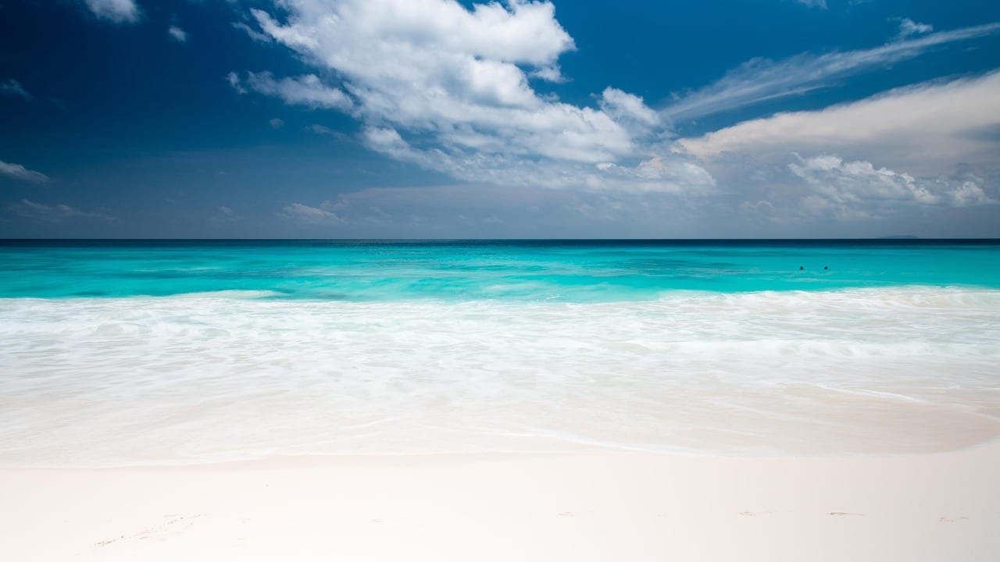
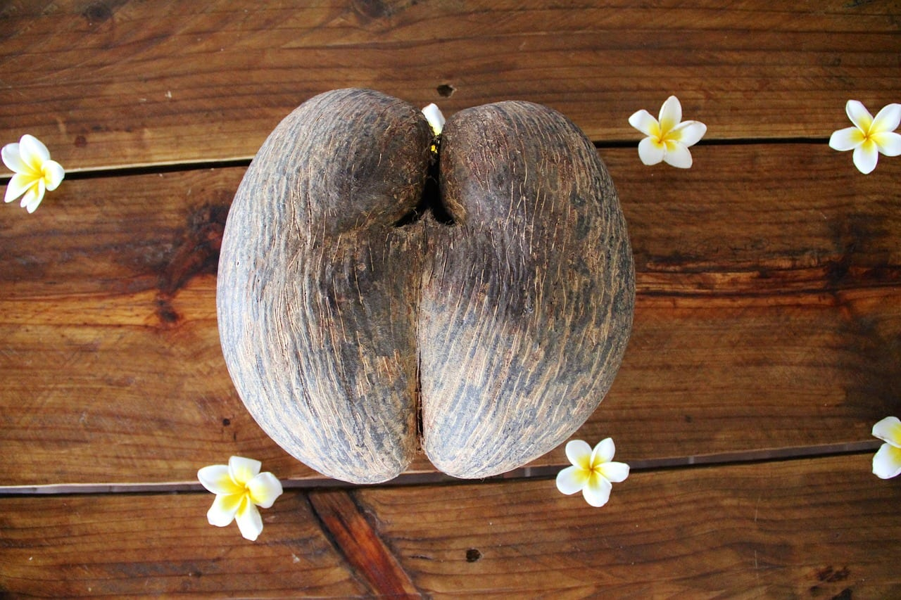
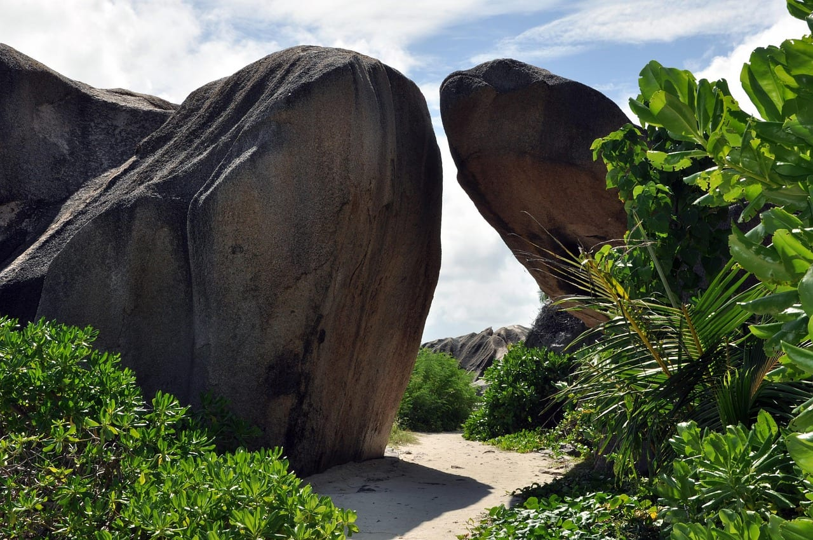
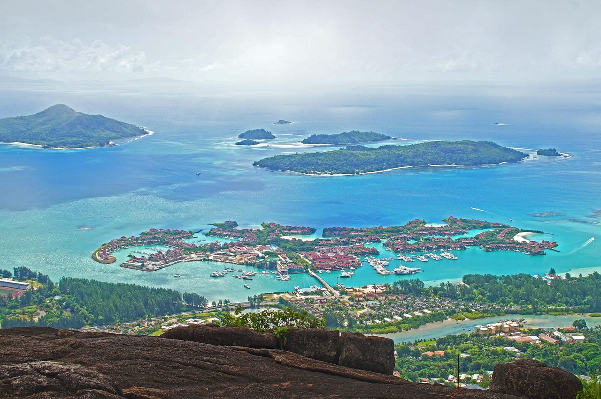
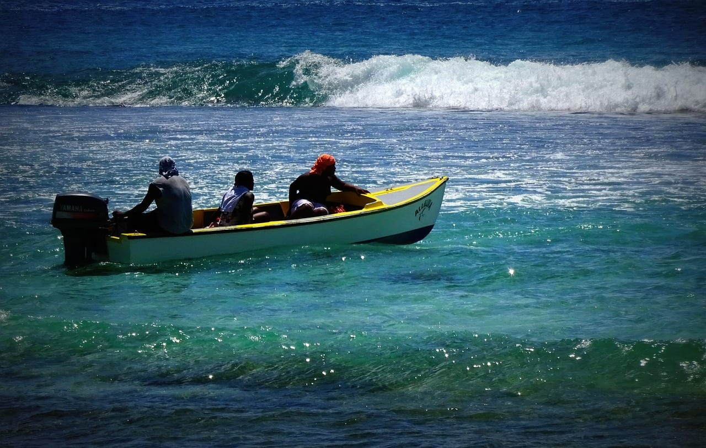
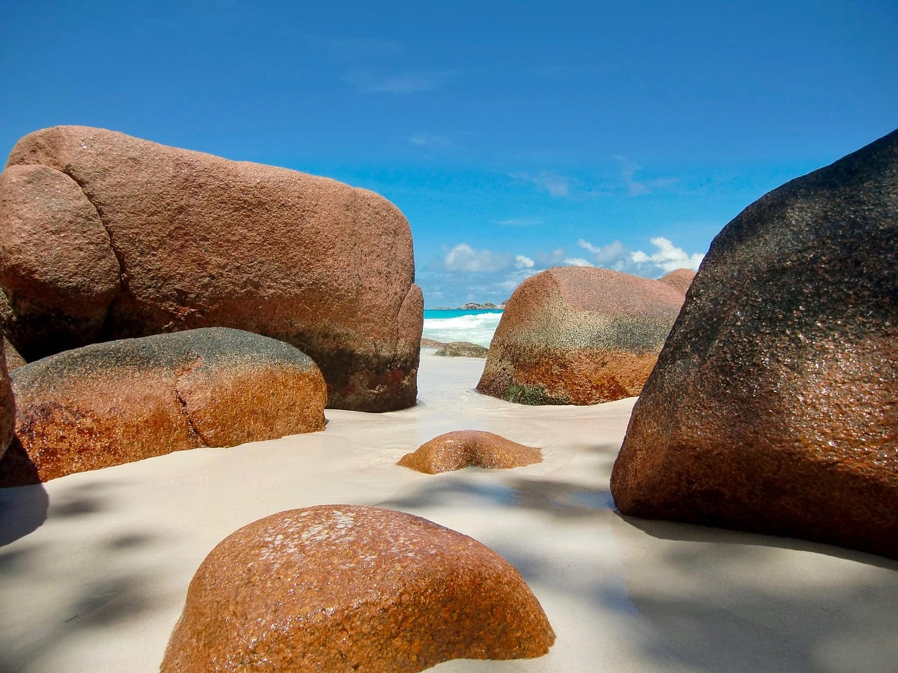
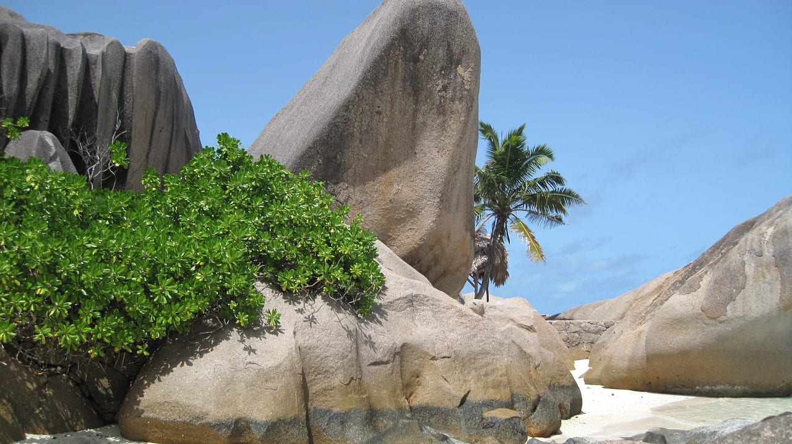
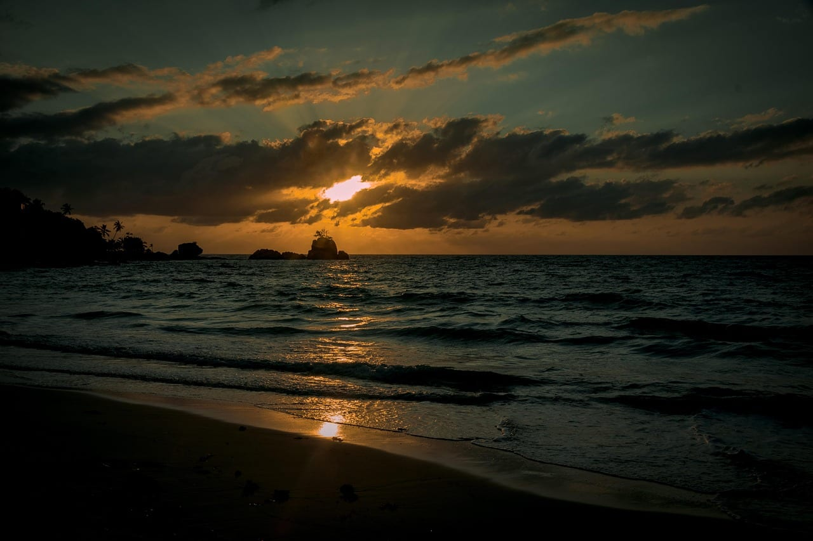
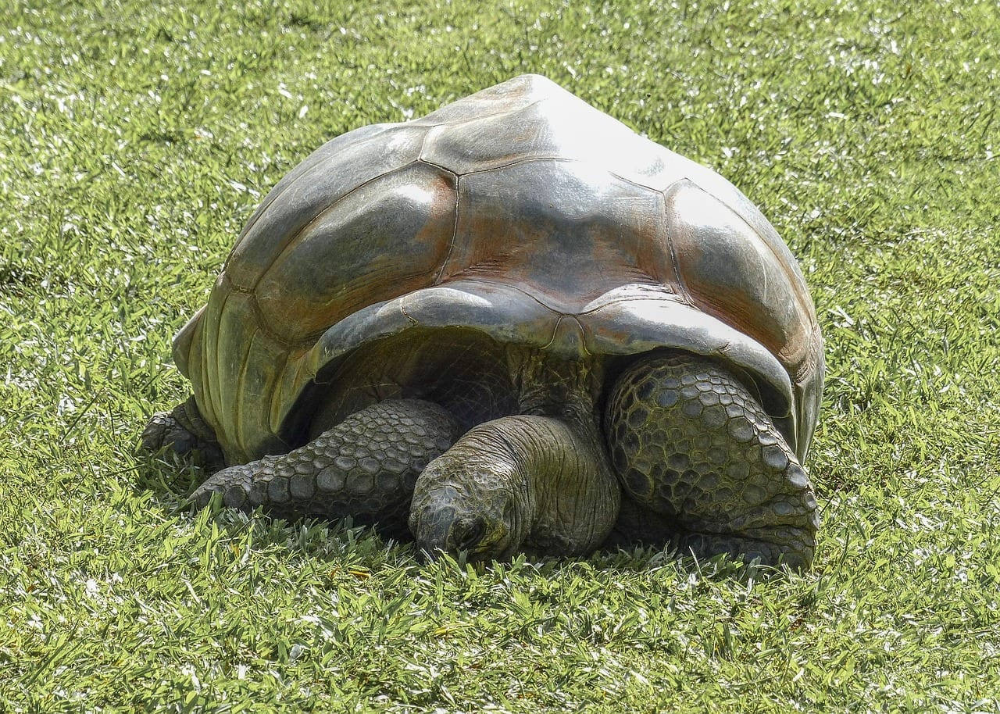

import AffiliateNote from '../../components/post/AffiliateNote.astro';
import { TP_LINKS, aviasalesRoute, ostrovokCountry, cherehapaTravel, airaloSub, youtravelSub } from '../../data/affiliate.js';

export const tours = youtravelSub('seychelles_2026');
export const flights = aviasalesRoute('MOW', 'SEZ', 'seychelles_2026');
export const stay = ostrovokCountry('seychelles', 'seychelles_2026');
export const insurance = cherehapaTravel('seychelles_2026');
export const esim = airaloSub('seychelles_2026');

Сейшелы выглядят на снимках одинаково с любого ракурса: розовато-серые гранитные валуны, обкатанные до формы капли, белый песок и вода трёх оттенков за ними. Из-за этой картинки острова кажутся однородными, и решение сводится к выбору отеля.

Это главная ошибка при планировании. Архипелаг лежит в зоне, где ветер меняет направление дважды в год, и вместе с ветром меняется то, на каком берегу можно купаться. Один и тот же пляж в мае и в декабре ведёт себя по-разному.

Второе, что решает поездку, — окно прямых рейсов. Оно то открывается, то закрывается: в 2026 году окно было закрыто почти два месяца, с 13 мая по 8 июля.

> **Если коротко:** «Аэрофлот» прекратил прямые рейсы Москва — Маэ **13 мая 2026** и вернул их **8 июля**; программа заявлена **до декабря** по средам и субботам, в конце года добавится понедельник. Виза россиянам не нужна, разрешение посетителя дают на срок **до трёх месяцев**, но электронное разрешение на въезд обязательно и стоит **10 €** (**985 ₽** по курсу ЦБ 98,5457 ₽ за евро на 20.08.2026). Берег выбирают под месяц: с июня по сентябрь юго-восточный пассат заваливает водорослями южные и юго-восточные пляжи, спокойны запад и северо-запад. <a href={tours} class="aff-cta" rel="sponsored">Посмотреть авторские туры по Сейшелам</a> — YouTravel собирает программы малых групп с гидом, видно даты, размер группы и что входит в цену.

<AffiliateNote />

## Три острова, между которыми выбирают

Гранитных островов в архипелаге больше сорока, но туристическая жизнь держится на трёх, и они не взаимозаменяемы.

**Маэ** — главный остров и единственный с международным аэропортом. Здесь столица Виктория, здесь же большая часть отелей и вся инфраструктура: магазины, аренда машин, больница. Берег изрезан бухтами, и это делает Маэ единственным островом, где почти в любой сезон найдётся защищённая от ветра сторона.

**Праслин** — второй по размеру, в часе с небольшим хода на пароме. Ради него едут за двумя пляжами и за лесом Валле-де-Мэ, где растёт коко-де-мер, пальма с самым тяжёлым семенем в мире. Остров маленький, дорог мало, вечерней жизни почти нет.

**Ла-Диг** — самый открыточный и самый неудобный. Машин на нём почти нет, передвигаются на велосипедах, отелей мало, цены выше ожидаемого. Именно здесь снимали большинство кадров, по которым Сейшелы узнают.

Расстояния между ними считает расписание парома. По данным оператора Cat Cocos на 20.08.2026, Маэ и Праслин разделяет **1 час 15 минут** хода, Маэ и Ла-Диг напрямую — **1 час 10 минут**, а через Праслин — **1 час 45 минут**. Праслин и Ла-Диг стоят в **15 минутах** друг от друга.

| остров | чем хорош | чем разочарует | сколько дней |
|---|---|---|---|
| Маэ | инфраструктура, выбор берегов под ветер, аренда авто | пляжи не самые эффектные, есть городской шум | 3–4 |
| Праслин | Валле-де-Мэ, Анс-Лацио, тишина | мало дорог, вечером делать нечего | 2–3 |
| Ла-Диг | самые фотогеничные бухты, велосипеды вместо машин | дорого, мало жилья, всё далеко | 1–2 |

## Что случилось с прямыми рейсами на Сейшелы в 2026 году

История этого года стоит того, чтобы её знать: она объясняет, почему цены и предложения по Сейшелам скакали.

По сообщению Ассоциации туроператоров России от 15.05.2026, **с 13 мая «Аэрофлот» прекратил прямые рейсы из Москвы на Маэ**. Перевозчик снимал летнюю программу и в 2024, и в 2025 годах, так что решение не выглядело новым. Сложность добавило другое: привычные стыковки через Дубай, Абу-Даби и Доху к тому моменту стали дороже и менее предсказуемыми.

Через две с половиной недели решение изменилось. 02.06.2026 та же ассоциация со ссылкой на официальный канал перевозчика сообщила, что **с 8 июля рейсы возвращаются** — дважды в неделю, по средам и субботам, на Airbus A350.

К середине июля программу продлили. По публикации от 19.07.2026, **до декабря рейсы идут по средам и субботам, а в конце года к расписанию добавляется понедельник**. Билеты туда и обратно с багажом там же названы **от 76 500 ₽**.

Спрос это подтверждает цифрами. В первом квартале 2026 года турпоток из России на Сейшелы вырос на **11,4%** и составил 14,8 тысячи человек; за первые пять месяцев Россия вышла на первое место по числу приезжих на островах. Разница между сезонами с прямым рейсом и без него измерена: в 2023 году, когда рейсы летали, летом на Сейшелах отдыхали 3–3,4 тысячи россиян в месяц, без них — 1,6–1,8 тысячи.

<a href={flights} class="aff-cta" rel="sponsored">Найти билет Москва — Маэ от 76 500 ₽</a> — Aviasales сравнивает прямые и стыковочные варианты в одном окне, цены в рублях, видно багаж и время пересадки.

## Когда на Сейшелах сезон дождей?

**Сезон дождей идёт с ноября по март, пик приходится на январь.** Так его описывает Климатическое руководство метеослужбы Сейшел, сверено 20.08.2026.

Январь метеослужба называет пиком сезона дождей: месяц влажный, ливни выпадают днём и ночью, иногда с грозами. В феврале осадков меньше, но всё ещё сыро. В марте падение заметное, и метеослужба говорит о конце сезона дождей. Апрель добивает остаток: разворот муссона, лёгкий переменный ветер и отдельные послеобеденные ливни.

Сухая половина года — с мая по октябрь. Май метеослужба прямо называет **самой солнечной частью года**. Июль — **самый прохладный и сухой период**. Октябрь неожиданно оказывается **месяцем с наибольшим числом сухих дней: их шестнадцать**, хотя формально это конец сухого сезона.

Про декабрь стоит сказать отдельно, потому что на него приходятся новогодние поездки. Метеослужба пишет, что в среднем в декабре набирается **не меньше десяти сухих дней**, и даже в дождливый день дождь идёт не весь день. Северо-западный муссон к этому времени установился, но ветра при нём слабые, и море спокойное.

## Почему сухой сезон и спокойное море — это разные вещи

Русскоязычные подборки сводят выбор к формуле «сухой сезон с мая по октябрь, значит, туда и ехать». Метеослужба Сейшел описывает ту же половину года иначе, и разница практическая.

С мая начинают дуть юго-восточные пассаты. В июне они устанавливаются, к концу месяца становится ветрено, море рябое. Июль метеослужба характеризует как ветреный месяц с жёстким морем, где любителям стоит держаться у берега. Август — пик пассатов: прохладно, ветрено, и про море сказано, что для неопытных оно **отталкивающее**. В сентябре пассаты слабеют, но остаются сильными.

Получается, что четыре месяца из шести «лучших» — это ветер и волна. Сухо и солнечно при этом действительно так: дожди в это время короткие и лёгкие.

Обратная сторона тоже недооценена. В ноябре ветер, по описанию метеослужбы, **значительно падает и разворачивается на запад**, а условия на море становятся приятными. В апреле, в момент разворота муссона, ветер лёгкий и переменный, и метеослужба пишет, что приятнее условий на море не бывает.

Отсюда вывод, который редко встречается в подборках: **самое спокойное море на Сейшелах не в разгар сухого сезона, а в переходные месяцы — апрель и ноябрь**.

## Какой берег выбирать в каждый месяц?

**С июня по сентябрь выбирают запад и северо-запад.** Метеослужба Сейшел формулирует это прямо: пляжи, открытые юго-восточному ветру, в этот период неприятны и завалены водорослями, а защищённые берега запада и северо-запада приятнее.

Это единственное решение, которое нельзя переиграть на месте. Отель бронируется заранее, а берег у него один.

Про зимнюю половину года честнее сказать иначе. С ноября по март дует северо-западный муссон, и из направления ветра следует, что закрытыми оказываются южные и восточные берега. Но такой формулировки метеослужба не даёт: прямое указание у неё есть только про летнее окно. В таблице ниже зимние строки — наш вывод из направления ветра, а не цитата источника.

| месяц | ветер | какие берега спокойнее | что учесть |
|---|---|---|---|
| январь | северо-западный муссон, пик дождей | юг и юго-восток | пик сезона циклонов в регионе |
| февраль | северо-западный, слабеет | юг и юго-восток | всё ещё влажно |
| март | северо-западный уходит | юг и юго-восток | дожди заканчиваются |
| апрель | разворот, ветер лёгкий | берега равноценны | лучшее море года, бывает жарко |
| май | пассаты устанавливаются | запад и северо-запад | самый солнечный месяц |
| июнь | пассаты крепнут | запад и северо-запад | к концу месяца волна |
| июль | пассаты сильные | запад и северо-запад | водоросли на юге, море жёсткое |
| август | пик пассатов | запад и северо-запад | море тяжёлое для неопытных на любом берегу |
| сентябрь | пассаты слабеют | запад и северо-запад | теплее и влажнее июля |
| октябрь | ветер падает | берега равноценны | больше всего сухих дней, шестнадцать |
| ноябрь | ветер уходит на запад | восток и юго-восток | приятное море, приходят дожди |
| декабрь | северо-западный, слабый | восток и юго-восток | не меньше десяти сухих дней |

Одну оговорку к летним строкам стоит держать в голове. Про август метеослужба пишет про море в целом, а не про отдельные берега: для неопытных оно тяжёлое даже там, где ветра меньше. Защищённая бухта снимает волну и водоросли, но не отменяет океан.

На практике это выглядит так. Летом на Маэ работают северо-западные бухты: Бо-Валлон с инфраструктурой и ресторанами, тише — бухта Порт-Лонэ. По оценке туроператоров, собранной ассоциацией 19.07.2026, на юго-западе Маэ в июле бывают сильные течения, и отель там выбирают внимательнее. На Праслине в бухте Гранд-Анс летом много водорослей, и часть отелей возит гостей на Кот-д'Ор и Анс-Лацио.

<a href={stay} class="aff-cta" rel="sponsored">Подобрать отель на Сейшелах по берегам</a> — Островок показывает цены в рублях, у части объектов бесплатная отмена, оплата российской картой проходит.

## Когда на пляжах водоросли?

**С июня по сентябрь, и только на берегах, открытых юго-восточному ветру.** Метеослужба Сейшел указывает этот период и добавляет, что защищённые пляжи запада и северо-запада в это время остаются приятными.

Механика та же, что на любом острове в зоне пассатов: устойчивый ветер гонит волну в одну сторону, волна выносит на песок то, что растёт на мелководье. Отели с большим пляжем чистят берег сами, маленькие гостевые дома — нет.

Обходится это тремя способами. Первый — выбрать месяц вне окна: апрель, октябрь и ноябрь свободны. Второй — выбрать берег: летом северо-западная сторона Маэ. Третий — выбрать отель, который убирает пляж, и не рассчитывать на идеальную картинку каждое утро.

Честно стоит сказать и о том, чего мы не знаем: сплошного помесячного замера по конкретным пляжам ни у метеослужбы, ни у туристических властей не публикуется. Год на год не приходится, и августовская картина 2026 года может отличаться от прошлогодней.

## Опасны ли циклоны на Сейшелах?

**Формально сезон циклонов идёт с ноября по апрель, но острова задевает редко.** Метеослужба Сейшел пишет, что январь — пик циклонической активности над юго-западной частью Индийского океана, однако штормы обычно уходят к югу и **редко затрагивают Сейшелы или хотя бы основные гранитные острова**.

Причина географическая: гранитная группа лежит близко к экватору, а тропические циклоны набирают силу южнее. Апрель метеослужба отмечает как месяц, когда сезон циклонов официально закончен.

Побочный эффект у этой активности есть, и он неочевидный. Метеослужба объясняет, что количество осадков в феврале зависит от того, насколько активны циклоны южнее: они смещают дождевой пояс. В год с сильной циклонической активностью февраль на островах выходит сухим, в спокойный год — мокрым.

## Нужна ли россиянам виза на Сейшелы?

**Нет, виза не нужна: разрешение посетителя выдают на границе на срок до трёх месяцев.** Так это описывает сайт Иммиграционной и гражданской службы Сейшел, сверено 20.08.2026.

Здесь стоит поправить распространённое утверждение. В русскоязычных ответах часто пишут про безвизовый въезд «до 30 дней». Иммиграционная служба называет другой срок: разрешение выдаётся **на срок до трёх месяцев**, продлевается последовательно по три месяца и в сумме может дойти до **двенадцати месяцев**.

Бесплатным разрешение остаётся только первые три месяца. За каждое следующее трёхмесячное продление или его часть берут **5 000 сейшельских рупий**; в рублях эту сумму не привожу, потому что официального курса сейшельской рупии Банк России не публикует.

Выдают разрешение не автоматически. Иммиграционная служба перечисляет условия: человек не входит в число нежелательных, у него нет действующего разрешения на проживание, есть **обратный или сквозной билет** на весь срок поездки, есть **подтверждённое жильё** и **достаточные средства** на срок пребывания.

Формулировка про средства нигде не раскрыта суммой, и это стоит сказать прямо: конкретной цифры в требованиях нет, решение остаётся за офицером на границе.

## Сколько стоит разрешение на въезд и как его оформить?

**Обычный тариф — 10 €, то есть 985 ₽ по курсу ЦБ 98,5457 ₽ за евро на 20.08.2026.** Цены опубликованы на пограничном портале правительства Сейшел, сверено 20.08.2026.

Тарифов три, и различаются они скоростью обработки:

| тариф | срок обработки | взрослые | дети до 12 лет |
|---|---|---|---|
| обычный | 24 часа | 10 € (985 ₽) | 10 € (985 ₽) |
| ускоренный | 6 часов | 30 € (2 956 ₽) | 30 € (2 956 ₽) |
| срочный | 60 минут | 70 € (6 898 ₽) | 30 € (2 956 ₽) |

Портал отдельно предупреждает, что банковские комиссии в эти суммы не входят и что тарифы могут измениться.

Подавать заявление можно **в течение 30 дней до даты прилёта**. По инструкции портала понадобятся: скан страницы паспорта с фотографией, свежее фото самого путешественника, сведения о поездке, ответы на медицинские и таможенные вопросы и карта для оплаты.

Единственный официальный адрес — правительственный портал `seychelles.govtas.com` и приложение пограничной службы. Посредники, продающие то же разрешение дороже, существуют, и переплата там кратная.

## Что будет, если прилететь без разрешения?

**Выпишут штраф 30 € и не пропустят через границу, пока разрешение не будет оформлено.** Это записано в разъяснениях пограничного портала, сверено 20.08.2026.

Важнее сумма не сама по себе, а то, как её платят. Портал прямо указывает: **в аэропорту не принимают ни наличные, ни карты**. Оформлять разрешение придётся со своего телефона или ноутбука и платить своей картой, стоя перед стойкой паспортного контроля.

Для российского путешественника это отдельный риск. Стойки оплаты в аэропорту нет вовсе, наличные не помогут, а карта российского банка за границей не сработает. Остаётся карта иностранного эмитента, и она есть не у всех. Что с этим делать, разбирали в материале про [оплату за границей](/blog/pay-abroad-2026/).

Есть и более ранняя точка отказа. Портал напоминает, что проверять разрешение обязана авиакомпания на регистрации, и без него в посадке могут отказать. То есть до штрафа дело может не дойти: человека не пустят на борт в Москве.

## Сколько стоит поездка на Сейшелы

Сейшелы стоят дорого, и это направление не про экономию. Цифры ниже собраны у Ассоциации туроператоров России по данным туроператоров на 19.07.2026.

Недельный тур на двоих с завтраками и прямым перелётом «Аэрофлота»:

| категория | цена на двоих за неделю |
|---|---|
| 3* | 150 000 – 208 000 ₽ |
| 4* | 230 000 – 324 000 ₽ |
| 5* | 250 000 – 345 000 ₽ |

Премиальные резорты с виллами стоят заметно дороже верхней границы. Те же туры на стыковочных рейсах Ethiopian Airlines и Turkish Airlines дешевле примерно на **50 000 ₽**.

Если ехать самостоятельно, ориентир по ежедневным тратам даёт сводка BudgetYourTrip за 2026 год: около **14 200 ₽** в день на человека при экономном варианте, **35 500 ₽** при среднем и **48 000 ₽** при дорогом. Это оценка по чужой выборке, а не наш замер, и берите её как порядок величины.

Отдельная статья экономии — скидки отелей вне высокого сезона. По данным туроператоров на ту же дату, стандартный дисконт летом составляет 10–25%, а отдельные предложения доходили до 35–40%; частая механика — семь ночей по цене шести и повышение категории питания.

<a href={insurance} class="aff-cta" rel="sponsored">Сравнить полисы для поездки на Сейшелы</a> — Cherehapa сравнивает предложения российских страховых, оплата картой РФ, полис приходит в PDF. Обязательным полис на Сейшелах не назван, но медицина на островах платная и дорогая.

## Пять сценариев поездки

**Неделя на одном острове, Маэ.** Прилёт, машина в аренду, база на северо-западе. Хватает на бухты Маэ, Викторию и один выезд на Праслин с ночёвкой. Машина нужна. Минус: самые известные пляжи остаются за кадром.

**Десять дней на два острова, Маэ и Праслин.** Четыре ночи на Маэ, пять на Праслине, паром между ними 1 час 15 минут. Валле-де-Мэ, Анс-Лацио, Кот-д'Ор. Машина нужна на Маэ, на Праслине хватит такси. Минус: два переезда с чемоданами.

**Двенадцать дней на три острова.** Классическая связка Маэ — Праслин — Ла-Диг с ночёвками на каждом. Ла-Диг оставляют на конец, чтобы уезжать с лучшей картинкой. Машина нужна только на Маэ. Минус: на Ла-Диге жильё дорогое и его мало, бронировать надо сильно заранее.

**Неделя ради Ла-Дига.** Ночь на Маэ после перелёта, дальше сразу паром и шесть ночей на Ла-Диге с велосипедом. Машина не нужна вовсе. Минус: к четвёртому дню остров заканчивается, а цены не падают.

**Две недели с переходом сезона.** Вариант для конца октября и ноября, когда ветер разворачивается: первую неделю на западе, вторую на востоке. Машина нужна. Минус: погода в переходный месяц переменчива, и гарантий нет.

## Сколько дней закладывать и что из чего складывается

| дней | что складывается | что останется за кадром |
|---|---|---|
| 5 | Маэ целиком, один пляжный день | Праслин, Ла-Диг |
| 7 | Маэ плюс однодневный выезд на Праслин | Ла-Диг, север Праслина |
| 10 | Маэ и Праслин с ночёвками | Ла-Диг, дальние острова |
| 12 | три острова с ночёвкой на каждом | атоллы внешней группы |
| 14 | три острова без спешки, переход сезона | Альдабра, куда попадают только с экспедицией |

Пять дней на Сейшелах — это перелёт длиной почти в десять часов ради четырёх полноценных дней. Считайте это нижней границей, ниже которой поездка не окупается по времени.

<a href={esim} class="aff-cta" rel="sponsored">Взять eSIM на Сейшелы до вылета</a> — Airalo активируется по QR-коду до прилёта, роуминг не нужен, тарифы от пары долларов за пакет.

## Что на Сейшелах разочаровывает

Про недостатки в подборках пишут редко, а они предсказуемы.

**Цены.** Дорого не только жильё, но и еда. Ужин в обычном ресторане стоит как в европейской столице, продукты в магазинах привозные.

**Логистика между островами.** Паром ходит по расписанию, и оно не всегда совпадает с рейсами. Стыковка «прилёт и сразу паром» иногда не складывается, и лишняя ночь на Маэ становится обязательной.

**Ветер и волна летом.** Это тот самый пункт, ради которого написана половина статьи. Человек, приехавший в августе на юго-восточный берег, получает не открыточную картинку, а водоросли и прибой.

**Мало вечерней жизни.** Кроме Бо-Валлона на Маэ, вечером на островах тихо. Тем, кто едет за атмосферой курорта, это заметно.

**Размер островов.** Праслин и Ла-Диг обходятся за пару дней. Дальше остаётся пляж, и если пляж не задался из-за ветра, заняться нечем.

## FAQ

**Нужна ли виза на Сейшелы россиянам?**
Виза не нужна. На границе выдают разрешение посетителя на срок до трёх месяцев. Показать при этом надо обратный билет, подтверждённое жильё и деньги на поездку. Так это описывает Иммиграционная и гражданская служба Сейшел.

**Сколько стоит разрешение на въезд?**
10 € при обработке за сутки, 30 € за шесть часов и 70 € за час. У детей до двенадцати лет самый срочный тариф ниже — 30 €. По курсу ЦБ на 20.08.2026 это 985, 2 956 и 6 898 ₽.

**За сколько дней подавать на разрешение?**
Заявление принимают в течение 30 дней до даты прилёта. Обычный тариф обрабатывается за сутки, поэтому запас в несколько дней снимает риск.

**Летают ли прямые рейсы из Москвы?**
Летают. «Аэрофлот» возобновил рейсы 8 июля 2026 года, программа заявлена до декабря по средам и субботам, в конце года добавляется понедельник. Самолёт — Airbus A350.

**Сколько лететь до Сейшел?**
По сервисам расписаний минимальное время в пути Москва — Маэ на 20.08.2026 составляет 8 часов 55 минут. Стыковочные варианты через Стамбул, Доху, Дубай, Абу-Даби и Аддис-Абебу выходят длиннее и обычно дешевле.

**Когда лучшее море на Сейшелах?**
В апреле и ноябре, когда муссон разворачивается и ветер слабый. Метеослужба Сейшел описывает апрель как месяц с наиболее приятными условиями на море.

**Какой месяц самый сухой?**
Больше всего сухих дней метеослужба насчитывает в октябре — шестнадцать. Самым прохладным и сухим периодом там же назван июль.

**Опасен ли сезон циклонов?**
Сезон идёт с ноября по апрель, но метеослужба Сейшел отмечает, что штормы обычно уходят южнее и основные гранитные острова задевают редко.

**Нужна ли страховка?**
Обязательным условием въезда полис не назван ни иммиграционной службой, ни пограничным порталом. Медицина на островах платная и дорогая, поэтому полис — вопрос здравого смысла, а не формальности.

**Работают ли российские карты?**
Нет. Разрешение на въезд оплачивается картой, и в аэропорту не принимают ни наличные, ни карты вовсе. Наличную валюту стоит взять с запасом, а способы оплаты продумать до вылета.

**Сколько стоит неделя на двоих?**
От 150 тысяч рублей в тройке с прямым перелётом и завтраками, 230–324 тысячи в четвёрке, 250–345 тысяч в пятёрке. Данные туроператоров, собранные отраслевой ассоциацией на 19.07.2026.

**Стоит ли брать машину?**
На Маэ стоит: остров большой, бухты разбросаны, автобусы ходят редко. На Праслине хватает такси, на Ла-Диге машины почти не нужны, там ездят на велосипедах.

## Что почитать дальше

- [Занзибар 2026: прямые рейсы, обязательный полис, сезон](/blog/zanzibar-2026/) — соседний остров Индийского океана и чем он дешевле
- [Сейшелы: коротко о направлении](/seychelles/) — визы, сезоны и бюджет одной страницей
- [Страховка для путешествий 2026](/blog/strahovka-dlya-puteshestviy-2026/) — как выбирать покрытие и на что смотреть в лимитах
- [Как платить за границей в 2026 году](/blog/pay-abroad-2026/) — что делать там, где российские карты не работают
- [eSIM за границей](/blog/esim-zagranicey-2026/) — как остаться на связи без роуминга

---

Данные проверены 20 августа 2026 года по сайту Иммиграционной и гражданской службы Сейшел, пограничному порталу правительства Сейшел, Климатическому руководству метеослужбы Сейшел, публикациям Ассоциации туроператоров России, расписанию паромного оператора Cat Cocos и курсу Банка России на эту дату. Правила въезда, тарифы и расписания меняются: перед поездкой сверяйтесь с первоисточниками, ссылки на них приведены в журнале проверок выше. Цены туров и жилья взяты с открытых витрин и носят ориентировочный характер.

Больше заметок о поездках — в канале [@traveltriberu](https://t.me/traveltriberu).
