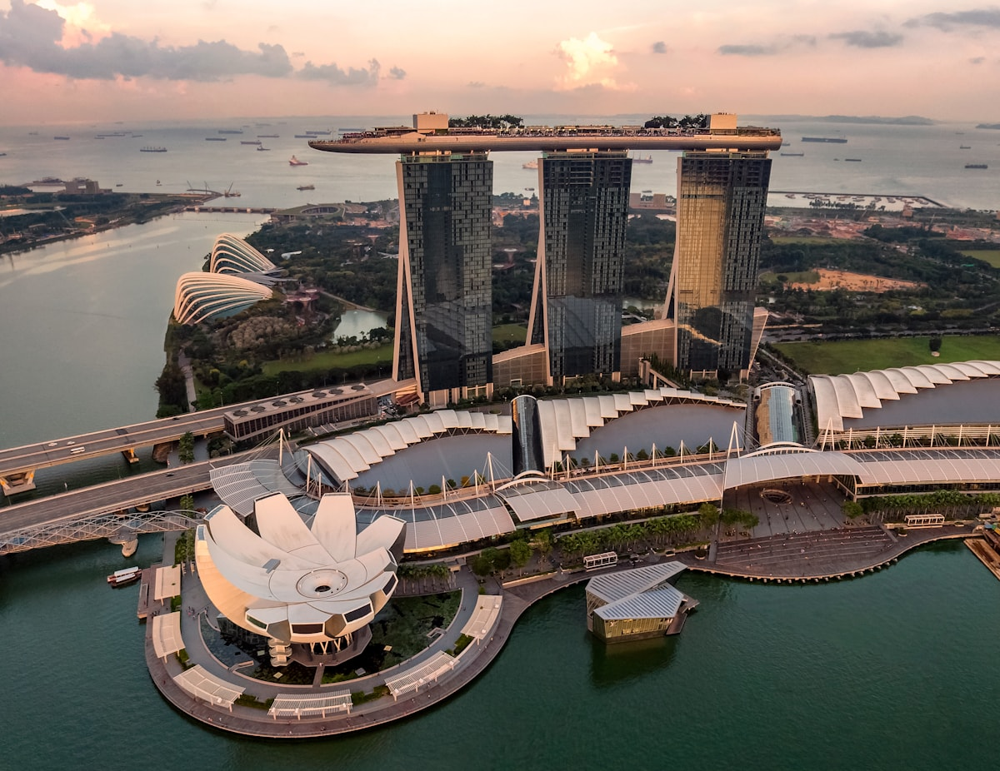
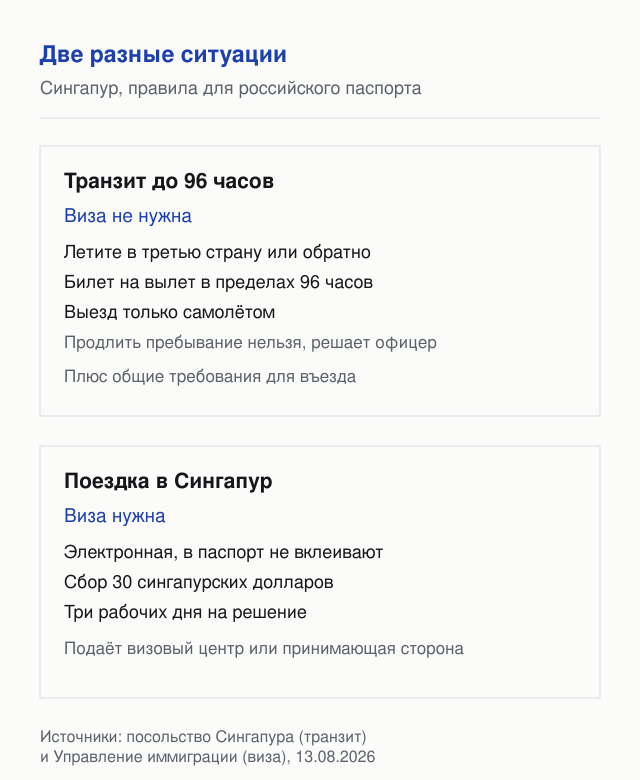
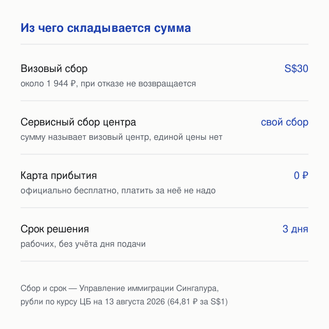
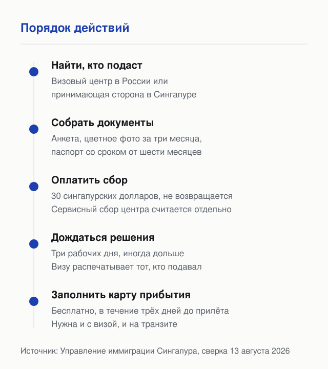

import AffiliateNote from '../../components/post/AffiliateNote.astro';
import { aviasalesRoute, cherehapaTravel, airaloSub } from '../../data/affiliate.js';

Виза в Сингапур гражданам России нужна — это первое, что стоит знать, потому что половина русскоязычных страниц уверяет в обратном. Без визы в страну попадают только транзитом до 96 часов по дороге в третью страну. Заблуждение выросло из двух вещей: пересадок в Чанги, где человек действительно оказывается в городе без визы, и того, что сингапурская виза электронная и в паспорте её не видно. Но транзит и поездка в Сингапур — разные правила, и тот, кто их перепутал, узнаёт об этом на стойке регистрации. Ниже — состояние требований на 13 августа 2026, сверенное по страницам Управления иммиграции Сингапура и посольства.

> **Если коротко:** гражданам России **виза в Сингапур нужна** — без неё пускают только по дипломатическим и служебным паспортам. Виза электронная, **визовый сбор — 30 сингапурских долларов (≈1 944 ₽ по курсу ЦБ на 13.08.2026)**, решение — **за три рабочих дня**. Напрямую в иммиграционную службу заявление не подать: из России документы принимают **уполномоченные визовые агенты посольства — центры VFS Global в Москве, Санкт-Петербурге и Владивостоке**, они берут свой сервисный сбор сверх визового. Отдельная история — **безвизовый транзит до 96 часов**: на него можно претендовать, если летите в третью страну или обратно, есть билет на вылет в пределах этого срока и выезжаете вы самолётом; пропустить или нет, решает офицер на границе. Всем, кто проходит паспортный контроль, нужна бесплатная электронная карта прибытия — её подают в течение трёх дней до прилёта, считая день прилёта. Когда с документами решено, остаётся перелёт: <a href={aviasalesRoute('MOW','SIN','singapore_visa_2026')} class="aff-cta" rel="sponsored">Найти билет Москва — Сингапур</a> — показывает все стыковки в одной выдаче.

<AffiliateNote />

---

## Нужна ли виза в Сингапур для россиян в 2026 году?

**Да, нужна.** На странице требований для России Управление иммиграции Сингапура формулирует это прямо: обладателю проездного документа, выданного Россией, для въезда требуется виза. Исключение сделано только для дипломатических и служебных паспортов ([страница требований для России на сайте Управления иммиграции](https://www.ica.gov.sg/enter-transit-depart/entering-singapore/visa_requirements/visa-detail-page/russia), сверка 13.08.2026).

Путаницу создаёт то, что виза электронная и в паспорт ничего не вклеивают. Отсюда рассказы в духе «прилетел и зашёл»: так выглядит и поездка с обычной электронной визой — самый частый случай, — и транзит, и въезд по второму паспорту.

## Чем безвизовый транзит отличается от поездки в Сингапур?

**Транзит — это проезд через страну по пути куда-то ещё, и на безвизовый проезд можно претендовать при четырёх условиях; поездка в Сингапур как в точку назначения требует визы.** Условия посольство Сингапура описывает так: перелёт в третью страну или из неё, действительный билет на вылет в пределах 96 часов, выезд именно самолётом (въехать можно любым транспортом) и соответствие общим требованиям для въезда.

Три вещи, которые из этого следуют и которые чаще всего упускают:

* **Продлить транзитное пребывание нельзя** — посольство говорит об этом прямо. Нужен более долгий срок, значит нужна виза.
* **Решение принимает офицер на границе.** Соответствие условиям не гарантирует пропуск: сотрудник иммиграции оценивает поездку целиком.
* **Обратно в Россию через Сингапур — тоже транзит**, если дальше вы летите самолётом и укладываетесь в срок.
* **Приехали по транзиту автобусом из Малайзии — карта прибытия всё равно нужна:** вы проходите паспортный контроль, а от карты освобождены только те, кто его не проходит вовсе.

## Кому подходит транзит, а кому он не сработает

Транзит закрывает типичный сценарий: пересадка по дороге в Австралию, Новую Зеландию или Индонезию, а заодно два-три дня в городе. Не сработает он в четырёх случаях:

* поездка ради самого Сингапура, без третьей страны в маршруте;
* стыковка длиннее четырёх суток;
* выезд поездом или автобусом в Малайзию — по земле уехать на транзите нельзя;
* поездка «туда и обратно» между Россией и Сингапуром без третьей страны.

## Можно ли подать на визу самостоятельно?

**Напрямую в иммиграционную службу — нет, но из России есть понятный путь.** Посольство Сингапура передало приём документов уполномоченным визовым агентам: это визовые центры VFS Global в Москве, Санкт-Петербурге и Владивостоке ([список агентов на сайте посольства](https://moscow.mfa.gov.sg/ru/consular-services/visa-information/authorised-visa-agents/), обновлён 06.11.2025). Никакого знакомого в Сингапуре для этого не нужно.

Второй путь — для тех, кого в Сингапуре кто-то принимает: принимающая сторона или компания-партнёр подаёт заявление онлайн сама.

Как это выглядит на практике: на конференцию в Сингапуре я летел именно так — заявление подавали организаторы, принимающая сторона на месте. Для делового визита это обычный порядок: приглашающая компания заводит заявление, а от участника нужны анкета, фото и данные паспорта.

Сравнивать «где виза дешевле» бессмысленно: визовый сбор одинаковый, разница только в сервисном сборе центра. На сайте посольства отдельно перечислены компании, у которых полномочия отозваны, — проверьте по списку, прежде чем нести документы.

## Сколько стоит виза в Сингапур?

**Визовый сбор — 30 сингапурских долларов, это примерно 1 944 ₽ по курсу ЦБ на 13 августа 2026** (64,81 ₽ за сингапурский доллар). В визовом центре его платят рублёвым эквивалентом, при онлайн-подаче из Сингапура — картой Visa или Mastercard. Сбор не возвращается при любом решении.

Сервисный сбор визового центра в эту сумму не входит: посольство разрешает брать его за каждое заявление и своей цены не устанавливает — сумму называет центр. Он тоже не возвращается при отказе.

Электронная карта прибытия бесплатна, и Управление иммиграции отдельно предупреждает о сайтах, которые предлагают оформить её за деньги.

## Сколько ждать решения и когда подавать?

**Три рабочих дня без учёта дня подачи** — официальный ориентир. Часть заявлений рассматривают дольше, каждое оценивают по существу.

Подавать рекомендуют не ранее чем за 30 дней до поездки. Отсюда рабочее окно: собрать документы заранее, подать за две-три недели, к вылету иметь решение на руках. Невозвратные билеты до решения покупать не стоит.

Одобренную визу распечатывает тот, кто подавал заявление, — забрать распечатку нужно до вылета.

## С чего начать оформление

1. **Найти, кто подаст** — визовый центр в России или принимающая сторона в Сингапуре.
2. **Проверить паспорт** — минимум шесть месяцев действия на дату въезда.
3. **Подготовить анкету и фото** — форма 14A, цветное фото паспортного формата не старше трёх месяцев.
4. **Оплатить сбор** — 30 сингапурских долларов плюс сервисный сбор центра.
5. **Дождаться решения** — три рабочих дня, распечатку визы забирает тот, кто подавал.
6. **Заполнить карту прибытия** — бесплатно, в течение трёх дней до прилёта.

## Что показывают на паспортном контроле

**Официальный список короткий: паспорт со сроком от шести месяцев, деньги на поездку и подтверждение дальнейшего маршрута — билеты и визы следующей страны.** Так это сформулировано на странице о въезде Управления иммиграции: краткосрочным гостям нужно иметь наличные на поездку и доказательство её продолжения.

Там же названы причины, по которым во въезде отказывают: не подана карта прибытия, отказ от прохождения биометрии, невыполнение санитарных требований. Виза на руках от проверки не освобождает — она даёт право просить о въезде, а не гарантию.

На практике турагентства в своих памятках просят держать под рукой ещё и ваучер на жильё, хотя отдельного требования о брони на страницах иммиграционной службы нет. Логика простая: чем быстрее вы отвечаете на вопрос «где остановитесь и когда улетаете», тем короче разговор.

Что стоит держать не в чемодане, а в телефоне и распечаткой:

* распечатку визы — её выдаёт тот, кто подавал заявление;
* подтверждение карты прибытия;
* билет на вылет из Сингапура;
* адрес жилья и бронь;
* карту с деньгами или наличные.

## Что за карта прибытия и кто её заполняет

**Электронная карта прибытия с декларацией о здоровье обязательна для всех, кто въезжает в Сингапур**, кроме транзитных пассажиров, не проходящих иммиграционный контроль, и местных резидентов на наземных пунктах. Виза её не заменяет: это разные документы.

Подаётся она в течение трёх дней до прибытия, считая день прилёта: для прилёта 30-го числа окно открывается 28-го, и заполнить можно вплоть до самого дня. Подача бесплатна.

## Какие документы просят

* **Анкета формы 14A**, заполненная и подписанная заявителем: иммиграционная служба указывает, что заявление рассматривают по сведениям из этой анкеты.
* **Цветное фото** паспортного формата, снятое в последние три месяца.
* **Копия страницы паспорта с данными**; паспорт действителен минимум шесть месяцев с даты въезда.
* **Дополнительные документы** — например сопроводительное письмо принимающей стороны (Letter of Introduction, форма V39A). Их просят не всегда, а по обстоятельствам конкретного заявления.

## Чего в этой статье нет

Здесь не разобраны рабочие, студенческие и долгосрочные разрешения — это отдельная процедура с другими требованиями. Не описаны и правила для владельцев второго гражданства: въезд оценивают по документу, с которым человек приезжает.

Ещё одного ответа нет и в первоисточнике: на странице требований для России не назван срок, на который пускают по визе. Виза на руках не равна автоматическому пропуску — как и на транзите, финальное решение принимает офицер на границе.

## FAQ

**Нужна ли виза в Сингапур для россиян?**
Да. Управление иммиграции Сингапура указывает, что обладателю российского проездного документа для въезда нужна виза; без визы обходятся только дипломатические и служебные паспорта. Отдельно существует безвизовый транзит до 96 часов при перелёте в третью страну или обратно.

**Сколько стоит виза в Сингапур?**
Визовый сбор — 30 сингапурских долларов, около 1 944 ₽ по курсу ЦБ на 13 августа 2026; в визовом центре платят рублёвым эквивалентом. Сбор не возвращается при отказе. Сервисный сбор визового центра оплачивается отдельно, своей цены посольство для него не устанавливает.

**Сколько дней делается виза в Сингапур?**
Официальный срок — три рабочих дня без учёта дня подачи; отдельные заявления рассматривают дольше. Подавать рекомендуют не ранее чем за 30 дней до поездки.

**Можно ли оформить визу в Сингапур самостоятельно?**
Напрямую в иммиграционную службу — нет. Из России документы принимают уполномоченные визовые агенты посольства: центры VFS Global в Москве, Санкт-Петербурге и Владивостоке. Второй путь — если в Сингапуре есть принимающая сторона, она подаёт заявление онлайн сама.

**Сколько можно быть в Сингапуре без визы?**
До 96 часов и только транзитом: нужен перелёт в третью страну или обратно, билет на вылет в пределах этого срока, выезд самолётом и соответствие общим требованиям для въезда. Продлевать транзитное пребывание нельзя, а пропустить или нет — решает офицер на границе.

**Нужна ли карта прибытия, если виза на руках?**
Да. Электронная карта прибытия с декларацией о здоровье — отдельное требование для всех, кто проходит паспортный контроль; освобождены только транзитные пассажиры, которые его не проходят, и местные резиденты на наземных пунктах. Она бесплатна, подаётся в течение трёх дней до прилёта, считая день прилёта.

---

## Что почитать дальше

- [Виза в Австралию 2026](/blog/australia-visa-2026/) — соседняя сложная виза, часто в одном маршруте с пересадкой в Сингапуре
- [Виза во Вьетнам 2026](/blog/vietnam-visa-2026/) — безвиз, электронная виза и карта прибытия
- [Как платить за границей россиянам 2026](/blog/pay-abroad-2026/) — чем оплачивать сборы и услуги агента
- [Связь за границей 2026](/blog/esim-zagranicey-2026/) — интернет по прилёте без местной сим-карты

---

*Материал носит справочный характер. Визовые правила меняются — перед подачей сверяйте условия на [странице требований для России](https://www.ica.gov.sg/enter-transit-depart/entering-singapore/visa_requirements/visa-detail-page/russia) и [странице карты прибытия](https://www.ica.gov.sg/enter-transit-depart/entering-singapore/sg-arrival-card) Управления иммиграции Сингапура. Условия транзита — [страница посольства Сингапура в Москве](https://moscow.mfa.gov.sg/ru/consular-services/visa-information/visa-free-transit-facility/). Требования проверял по первоисточникам 13 августа 2026. Нашли неточность — напишите в [Telegram-канал @traveltriberu](https://t.me/traveltriberu), обновлю.*

*Фото залива — из фотобанка направлений сайта. Схемы наши.*
