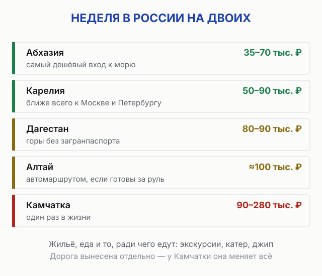
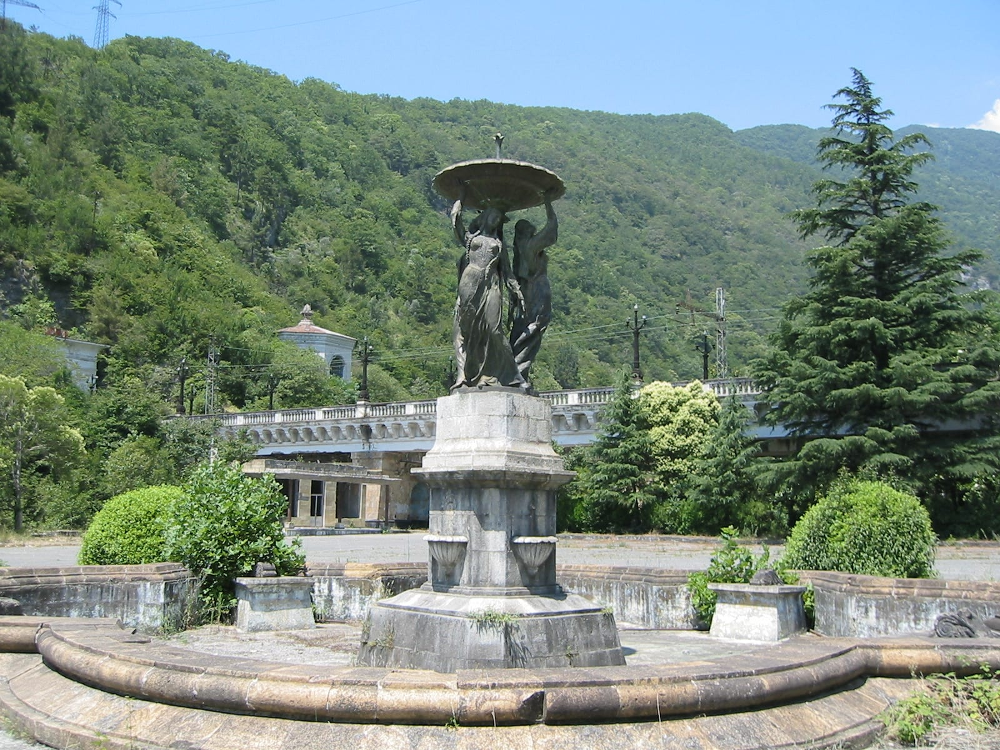
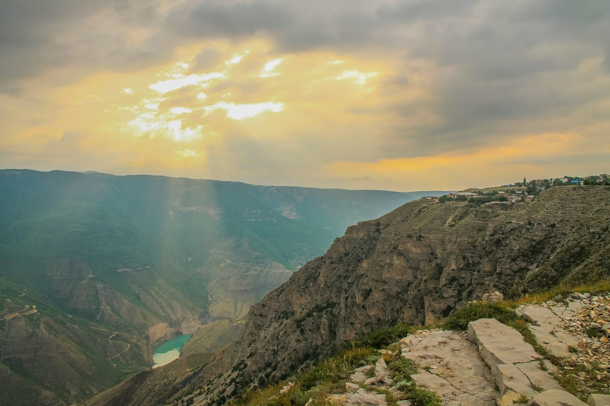
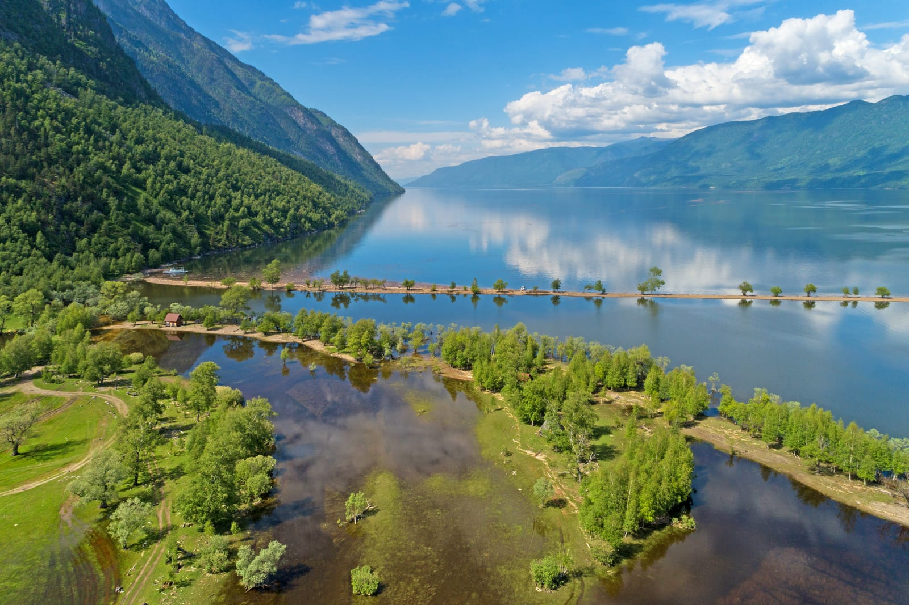

import AffiliateNote from '../../components/post/AffiliateNote.astro';
import { tutuTrains, cherehapaCountry, tpkDeep, TP_LINKS } from '../../data/affiliate.js';

Разброс по стране огромный, и он не про «дорого-дёшево», а про то, что именно съедает деньги. **Неделя на двоих без дороги в 2026 году: от 35 000 ₽ в Абхазии до 180 000 ₽ на Камчатке — впятеро.** Причём на Камчатке основную сумму забирает не жильё и не еда, а вертолёт, без которого главные места недостижимы.

Ниже пять направлений в одной таблице и разбор каждого: где деньги уходят на дорогу, где на жильё, а где на одну-единственную экскурсию.

<AffiliateNote />

## Коротко: где дешевле и кому что подходит

Считаем одинаково для всех: **неделя на двоих, без дороги**. Дорога вынесена отдельной строкой, потому что именно она переворачивает картину.

| Направление | Неделя на двоих | Дорога из Москвы | Главная трата на месте | Кому |
|---|---|---|---|---|
| **Абхазия** | 35 000–70 000 ₽ | от ~6 200 ₽ рейс в Сухум, или поезд до Адлера | экскурсии 900–2 500 ₽ с человека | самый дешёвый вход к морю |
| **Дагестан** | ~80 000–90 000 ₽ | перелёт в Махачкалу | джип-выезды 3 500–3 900 ₽ с человека | горы и каньоны без перелёта за границу |
| **Карелия** | 50 000–90 000 ₽ | поезд, 10,5 ч ночным | метеор на Валаам 6 930–8 100 ₽ с человека | ближе всего к Москве и Петербургу |
| **Алтай** | ~100 000 ₽ автомаршрутом | перелёт до Горно-Алтайска | аренда авто от ~3 000 ₽ в день | тем, кто готов сам за рулём |
| **Камчатка** | от 90 000 до 280 000 ₽ туром | от 20 000 ₽ туда-обратно по плоскому тарифу | вертолёт в Долину гейзеров | один раз в жизни, если готов платить |

**Если коротко: самый дешёвый вход — Абхазия, самое выгодное соотношение впечатлений к деньгам — Дагестан, самая предсказуемая по бюджету — Карелия.** Камчатка в этом списке стоит особняком: там нельзя «поехать подешевле», можно только поехать или не поехать.

Отдельно про август, раз он на пороге. Это пик по всем пяти направлениям сразу, и цены в таблице — как раз августовские, верхняя половина коридора. В сентябре Абхазия и Дагестан дешевеют заметно, вода на Чёрном море остаётся тёплой до октября, а вот Камчатка и Карелия в сентябре теряют не в цене, а в погоде: навигация на острова сворачивается, вертолётные вылеты чаще отменяют.

## Как мы считали

Сумма в таблице — это жильё, еда и то, ради чего люди туда едут: экскурсии, катер, джип. Дорога вынесена отдельно, и вот почему: у Абхазии и Карелии она стоит копейки на фоне отдыха, а у Камчатки может оказаться дешевле самого тура, если поймать плоский тариф.

Цифры собраны из двух источников. Первый — наши собственные гиды по каждому направлению, где бюджеты считались отдельно. Второй — отраслевые обзоры лета 2026: [АТОР про Абхазию](https://www.atorus.ru/article/skolko-deneg-nuzhno-na-otdykh-v-abkhazii-letom-2026-goda-66994), [каталоги туров «Большой Страны»](https://bolshayastrana.com/dagestan) по Дагестану, Карелии и Алтаю, [подборки по Камчатке](https://adventure-guide.ru/regions/kamchatka/tury-na-kamchatku-iz-petropavlovska-kamchatskogo/).

Где цифры расходятся, я беру более широкий коридор и говорю об этом прямо. Например, туры в Карелию рекламируют «от 5 900 ₽» — но это однодневная экскурсия на одного, а не неделя на двоих. Такие цифры в таблицу не идут.

## Абхазия: самый дешёвый вход к морю

Жильё держит всю экономику. Гостевой дом стартует от 1 000 ₽ за ночь, комната в Гагре — от 1 700 ₽, приличный отель — 2 000–3 000 ₽. По обзорам лета 2026 бюджетный номер без питания в Гагре обходится примерно в 20 650 ₽ за неделю, а четвёрка с завтраками в Пицунде — около 36 400 ₽.

Верхняя граница уезжает быстро: отели 4–5\* в Сухуме идут по 12 775 ₽ в сутки, то есть под 89 000 ₽ за неделю. Отсюда и коридор от 36 000 до 150 000 ₽ на двоих, который дают отраслевые обзоры.

Экскурсии дешёвые: групповой выезд 900–2 500 ₽ с человека, джип-тур 3 000–5 000 ₽. Это тот случай, когда посмотреть много стоит недорого.

Две вещи, которые портят бюджет. Первая — наличные: карты «Мир» российских банков в Абхазии работают, ими платят в магазинах и снимают в банкоматах, а Visa и Mastercard не принимают вовсе. В частном секторе и на рынке всё равно нужны купюры, и снять деньги на месте сложно. Вторая — медицина: полис ОМС в Абхазии не работает, а эвакуация в Сочи стоит десятки тысяч. <a href={cherehapaCountry('abkhazia', 'week_cost_2026')} class="aff-cta" rel="sponsored">Оформить страховку в Абхазию</a> — Cherehapa сравнивает полисы, оплата картой РФ, полис в PDF. Это единственная строка бюджета, на которой экономить не стоит.

Жильё там в основном частный сектор: <a href={tpkDeep('sutochno', 'https://abkhazia.sutochno.ru/', 'week_cost_2026')} class="aff-cta" rel="sponsored">Посмотреть варианты в Абхазии</a>. Подробный разбор по курортам и ценам — в [гиде по Абхазии](/blog/abkhazia-2026/), а по конкретным местам есть отдельно [озеро Рица](/blog/ozero-ritsa-2026/) и [Новоафонская пещера](/blog/novoafonskaya-peschera-2026/).

## Дагестан: горы за те же деньги, что чужое море

Здесь считают иначе — почти все едут организованно, потому что расстояния большие, а дороги горные. Пятидневный тур стоит от 40 000 до 46 000 ₽ с человека без перелёта, то есть неделя на двоих подбирается к 80 000–90 000 ₽.

Самостоятельно выходит дешевле, но нужна машина. Главные точки разбросаны: Сулакский каньон, Дербент с крепостью Нарын-Кала, аул-призрак Гамсутль. Групповой выезд в Сулакский каньон — 3 500–3 900 ₽ с человека, обычно вместе с барханом Сарыкум.

Что входит в эти деньги на практике: база в Махачкале или Каспийске, оттуда четыре-пять выездов по 3 500–4 000 ₽ с человека, плюс еда. Еда в Дагестане дешёвая и это отдельный аргумент: пообедать в местной столовой стоит меньше, чем кофе с десертом на черноморской набережной. Море там тоже есть — Каспий у Махачкалы и Избербаша тёплый с конца июня по сентябрь, но инфраструктура простая, и ехать туда только ради пляжа смысла нет.

Отдельный плюс, который редко считают деньгами: до глубокого высокогорья нужен пропуск погранслужбы, но все главные точки лежат вне погранзоны, и оформлять ничего не надо. Подробности — в [гиде по Дагестану](/blog/dagestan-guide-2026/).

## Карелия: самая предсказуемая по деньгам

Неделя на двоих без дороги укладывается в 50 000–90 000 ₽ — и это, пожалуй, самый узкий коридор из пяти. Готовые туры на двоих стартуют примерно от 38 000 ₽ за три дня и от 90 000 ₽ за пять.

Дорога дешевле, чем везде остальное: фирменный ночной поезд Москва — Петрозаводск идёт 10 часов 45 минут, из Петербурга «Ласточка» довозит за 4–5 часов. <a href={tutuTrains('skolko_stoit_nedelya_v_rossii_2026')} class="aff-cta" rel="sponsored">Посмотреть расписание поездов</a> — обычно это дешевле и спокойнее, чем лететь.

Жильё здесь другого формата: не отели, а домики и базы на берегу озёр. Это и держит бюджет предсказуемым — разброс между «скромно» и «хорошо» тут меньше, чем на юге, где разброс между гостевым домом и пятёркой десятикратный.

Главная разовая трата — вода. Метеор на Валаам с экскурсией стоит 6 930 ₽ в мае и сентябре, 7 700 в будни лета и 8 100 в выходные — и это цена за одного, то есть на двоих в субботу выходит 16 200. Не то, на чём стоит экономить: остров без экскурсии теряет половину смысла. Что смотреть кроме него — [горный парк Рускеала](/blog/gornyy-park-ruskeala-2026/), [остров Кижи](/blog/ostrov-kizhi-2026/) и [Валаам](/blog/ostrov-valaam-2026/), а общая картина — в [гиде по Карелии](/blog/kareliya-guide-2026/).

## Алтай: дорога съедает половину

Недельный автомаршрут на двоих выходит порядка 100 000 ₽ без перелёта. Многодневные туры начинаются от 16 000–23 000 ₽ с человека, но это программы попроще и покороче.

Ключевая статья расходов — машина: аренда от 3 000 ₽ в день, плюс бензин на Чуйский тракт. Без своего транспорта Алтай превращается в набор коротких вылазок из одного посёлка, и половина смысла теряется.

За неделю на машине реально пройти классику: Чуйский тракт до Курайской степи, Гейзерное озеро, перевал Кату-Ярык. Это примерно тысяча километров в одну сторону от Горно-Алтайска, и вот на них уходит и бензин, и время, и та разница в бюджете, из-за которой Алтай оказывается дороже Дагестана.

Именно поэтому Алтай в этой таблице выглядит дороже Дагестана, хотя жильё там сопоставимо: платишь не за ночёвку, а за возможность двигаться. Разбор маршрута и сезонов — в [гиде по Алтаю](/blog/altai-guide-2026/).

## Камчатка: другая лига

Здесь бессмысленно считать «неделю на двоих без дороги», потому что почти все едут туром. Бюджетный групповой на 8–10 дней стоит от 90 000 ₽ с человека, полная программа с вертолётом в Долину гейзеров и медведями — 180 000–280 000 ₽, а премиум с круизом к Курилам уходит за 400 000 ₽.

Парадокс Камчатки в том, что перелёт — самая дешёвая её часть. Плоский тариф Аэрофлота — самый дешёвый способ долететь, но цену перед поездкой надо смотреть на сайте перевозчика: она менялась, и с 15 июня 2026 такие билеты продают только гражданам России. Ориентир прошлых сезонов — от 20 000 ₽ туда-обратно, и Петропавловск-Камчатский в списке таких направлений. То есть добраться стоит меньше, чем один вертолётный вылет.

В тур обычно входит всё: жильё, питание, переезды на вездеходах, гид. Отдельно платят за вертолёт и за морскую прогулку к косаткам. Именно эти две строки и создают разброс от 90 000 до 280 000 ₽ — базовая программа без них укладывается в нижнюю границу.

Экономить получится ровно на одном: отказаться от вертолёта и смотреть вулканы с земли. Это честный вариант, и он всё равно сильный — но Долину гейзеров вы не увидите, наземных дорог туда нет. Подробно — в [гиде по Камчатке](/blog/kamchatka-guide-2026/).

## Что съедает бюджет сверх расчёта

Четыре статьи, которые люди забывают заложить, и они одинаковы почти везде.

**Дорога внутри направления.** В таблице её нет, а она есть всегда: трансферы, такси между точками, бензин. На Алтае и в Дагестане это самая недооценённая строка.

**Наличные.** В Абхазии принимают только «Мир», в частном секторе — купюры, в горах Дагестана и Алтая связь пропадает вместе с терминалами. Снять на месте бывает негде.

**Туристический налог.** С 2025 года курортного сбора больше нет — вместо него туристический налог, и в 2026-м он доходит до 2% от стоимости проживания, но не меньше 100 ₽ за сутки. Его платит гостиница и включает в счёт, так что в бюджете он виден как надбавка к цене номера. Введён он в четырёх направлениях из пяти: в Дагестане, Карелии, на Алтае и Камчатке. Частного сектора налог не касается — только гостиниц из государственного реестра. Абхазия единственная, где не берут ничего: свой курортный сбор она отменила в 2022 году.

**Погода.** Один испорченный день в Карелии или на Камчатке — это не только настроение, но и оплаченная экскурсия, которую не перенесут.

**Медицина.** По России работает ОМС, а в Абхазии — нет. Это единственное направление из пяти, где страховка обязательна по факту, а не по желанию.

## FAQ

**Где дешевле всего отдохнуть в России в 2026 году?**
Из пяти направлений самый низкий вход — **Абхазия: от 35 000 ₽ на двоих за неделю без дороги**. Дешёвое жильё в частном секторе и недорогие экскурсии, 900–2 500 ₽ с человека. Формально это не Россия, но ехать туда по внутреннему паспорту.

**Сколько стоит неделя в Дагестане?**
**Около 80 000–90 000 ₽ на двоих без перелёта.** Считается обычно через тур: пятидневный стоит 40 000–46 000 ₽ с человека. Самостоятельно дешевле, но нужна машина.

**Что дешевле: Карелия или Алтай?**
Карелия. Неделя на двоих там 50 000–90 000 ₽ против примерно 100 000 ₽ на Алтае, и дорога дешевле: поезд вместо перелёта. Разницу делает аренда машины, без которой Алтай теряет смысл.

**Можно ли поехать на Камчатку дёшево?**
Только относительно. Перелёт по плоскому тарифу от 20 000 ₽ туда-обратно, а бюджетный групповой тур на 8–10 дней — от 90 000 ₽ с человека. Сэкономить можно, отказавшись от вертолёта, но тогда Долина гейзеров отпадает: наземных дорог туда нет.

**Нужна ли страховка для поездок по России?**
По России действует полис ОМС. Отдельная туристическая страховка нужна для Абхазии — там ОМС не работает, а эвакуация в Сочи обходится в десятки тысяч рублей.

---

*Актуально на: 31 июля 2026. Цены — из наших гидов по каждому направлению и отраслевых обзоров лета 2026: [АТОР](https://www.atorus.ru/article/skolko-deneg-nuzhno-na-otdykh-v-abkhazii-letom-2026-goda-66994), [Большая Страна](https://bolshayastrana.com/dagestan), [adventure-guide](https://adventure-guide.ru/regions/kamchatka/tury-na-kamchatku-iz-petropavlovska-kamchatskogo/). Стоимость туров и жилья меняется в сезон — перед бронированием сверяйтесь с актуальными предложениями.*
