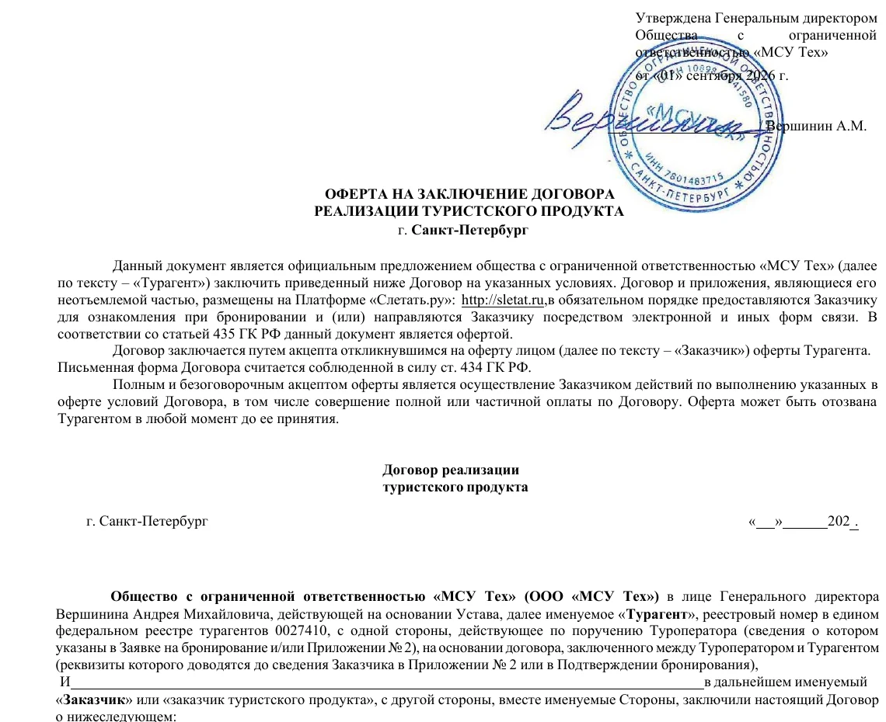
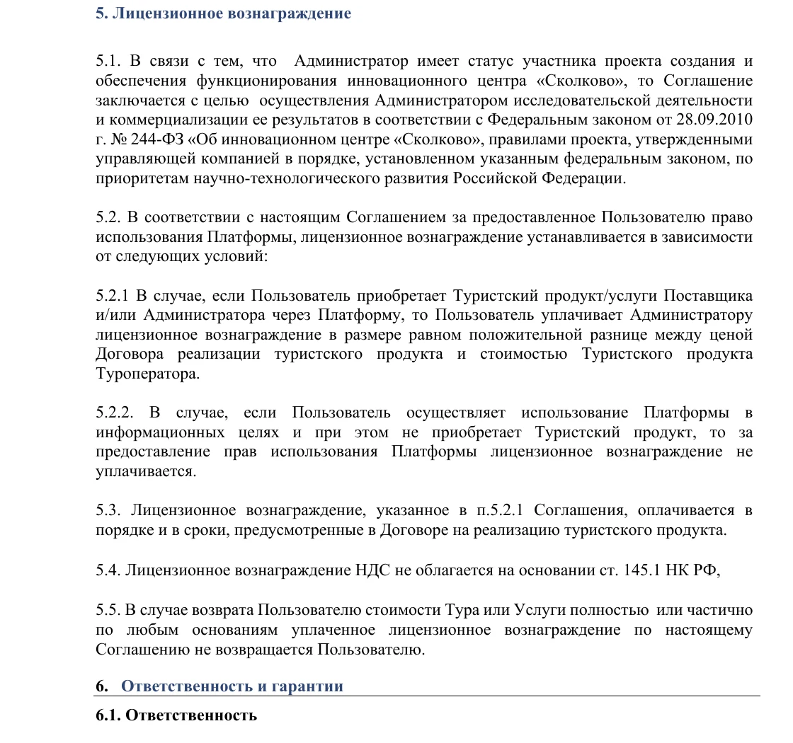
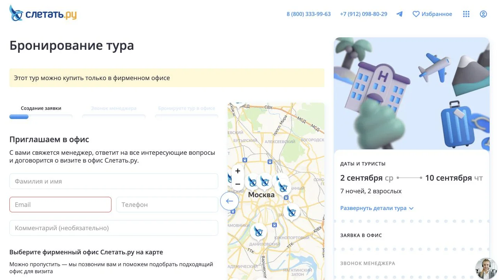
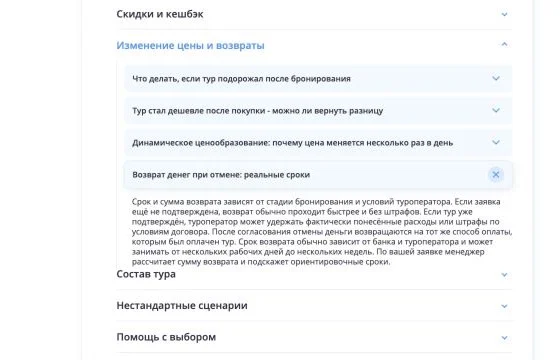

import AffiliateNote from '../../components/post/AffiliateNote.astro';
import { tpkDeep } from '../../data/affiliate.js';

Слетать.ру подходит для первого сравнения пакетных туров, если вы готовы перепроверить состав, туроператора и цену перед оплатой. Сервис собирает предложения разных операторов, показывает рейс, багаж, питание и трансфер в одной карточке. На главной 1 сентября 2026 года заявлена поддержка круглосуточно.

Сервис хуже подходит тому, кто хочет купить любой найденный вариант целиком онлайн, получить фиксированную цену сразу или заранее увидеть отдельной строкой вознаграждение платформы. В проверенном туре до Китая покупка через интернет была недоступна: требовалось оставить контакты, дождаться звонка менеджера и прийти в фирменный офис.

> **Вывод проверки:** Слетать.ру — одновременно поисковая платформа и турагент ООО «МСУ Тех». Сам тур формирует и исполняет туроператор из заявки. Цена на витрине может измениться до оплаты и подтверждения. В общую сумму входит лицензионное вознаграждение платформы; его размер на проверенном экране не раскрыт отдельно, а пункт 5.5 пользовательского соглашения говорит, что при возврате стоимости тура эта часть не возвращается.

<AffiliateNote />

## Как проходила проверка

1 сентября 2026 года редакция открыла главную, справку и раздел о компании, затем прошла один живой путь без покупки: промокарточка тура из Москвы на Хайнань → состав пакета → форма бронирования. В форму не вводились имя, телефон и почта, заявка не отправлялась, платёж не создавался.

Условия сверены по двум документам ООО «МСУ Тех»: [пользовательскому соглашению в редакции от 1 марта 2025 года](https://static.sletat.ru/Files/term_of_use.pdf) и [оферте на реализацию туристского продукта, утверждённой 1 сентября 2026 года](https://static.sletat.ru/offers/offer_for_sale_of_tourism_product.pdf). Отзывы на картах и сайтах-отзовиках не использовались как доказательство: они не показывают договор конкретного заказа и редко отделяют работу платформы от действий туроператора, офиса, авиакомпании или гостиницы.

Проверка охватывает один доступный тур и публичные документы. Она подтверждает устройство сервиса и найденный сценарий, но не долю офисных заявок среди всей выдачи и не качество сопровождения после оплаты.

## Кто продаёт тур и за что отвечает

В оферте продавцом указан **турагент ООО «МСУ Тех»**, ИНН 7801483715, номер в едином федеральном реестре турагентов **0027410**. Компания бронирует выбранный продукт и переводит деньги туроператору. Полное имя оператора должно появиться в заявке, приложении к договору или подтверждении бронирования.

Саму поездку формирует туроператор. По пунктам 1.3 и 1.5 оферты он либо привлечённые им перевозчик, отель и страховщик оказывают услуги, входящие в пакет. Поэтому до оплаты нужны два разных набора проверок:

| Что проверить | Где смотреть | Зачем |
|---|---|---|
| Продавец | оферта и реквизиты ООО «МСУ Тех» | понимать, кто принимает оплату и бронирует |
| Туроператор | заявка, приложение № 2, подтверждение | проверить реестр, финансовое обеспечение и исполнителя тура |
| Состав пакета | карточка и заявка | сверить рейс, багаж, номер, питание, трансфер и страховку |
| Условия отказа | оферта, тариф перевозчика, ответ оператора | оценить фактические расходы до оплаты |
| Итоговая сумма | заявка непосредственно перед оплатой | цена витрины не является офертой |

Если описание Слетать.ру расходится с информацией туроператора, пункт 5.8 оферты предписывает ориентироваться на данные оператора. Это полезная оговорка для рейса, категории номера и состава питания: сохраняйте обе версии до платежа и просите исправить заявку, если они не совпадают.

## Что происходит с ценой

[Официальная справка](https://sletat.ru/faq) объясняет, что цены формируют туроператоры, а сервис показывает предложения партнёров. Данные обновляются при каждом поиске; в течение дня сумма может двигаться из-за загрузки рейса и гостиницы, курса и обновлений оператора. До оплаты и подтверждения цена не зафиксирована.

Отдельное правило находится не в карточке тура, а в пользовательском соглашении:

- пункт 5.2.1 определяет лицензионное вознаграждение ООО «МСУ Тех» как положительную разницу между полной ценой договора и стоимостью туристского продукта у туроператора;
- пункт 2.1 оферты включает это вознаграждение в общую цену;
- пункт 5.5 соглашения исключает его возврат, если стоимость тура или отдельной услуги возвращают полностью либо частично.

На проверенном экране была одна итоговая сумма — **107 958 ₽**. Разбивки на стоимость туроператора и лицензионную часть рядом не было. Из публичных документов можно установить формулу, но нельзя заранее вычислить рублёвый размер вознаграждения для конкретной карточки. До платежа разумно запросить у продавца полную разбивку суммы и сохранить ответ.

## Один реальный путь: поиск онлайн, покупка в офисе

Проверенная карточка показывала тур на двоих из Москвы в Китай: семь ночей, завтрак, прямые регулярные рейсы «Аэрофлота», багаж 23 + 10 кг, трансфер и туроператор «Библио-Глобус». На следующем шаге стояла сумма 107 958 ₽.

Постоянного списка стран и городов вылета в публичных документах нет: география меняется вместе с предложениями операторов. Эта проверка подтверждает маршрут Москва — Хайнань на выбранные даты, но ничего не говорит о наличии тура из другого города или на другой месяц.

Вместо онлайн-оплаты открылся сценарий из трёх этапов: создать заявку, принять звонок менеджера, забронировать тур в офисе. Форма просила имя, email и телефон, позволяла выбрать офис на карте и оставляла кнопку отправки неактивной без данных и согласия. Ничего из этого редакция не заполняла.

Этот пример не означает, что вся выдача работает через офис. [Главная страница](https://sletat.ru/) прямо предлагает и онлайн-покупку, и офисы. Практический вывод: способ оформления относится к конкретному предложению. Если поездка нужна срочно, проверьте этот шаг до долгого сравнения отелей.

Число офисов на официальных страницах расходится. Главная 1 сентября говорила о 400 офисах, а [раздел «О компании»](https://sletat.ru/about/) — о 364 офисах в 200 городах. Для покупки имеет значение не общее число, а адрес и юрлицо выбранного офиса: запросите их до визита и сверьте с договором.

## Оплата, подтверждение и документы

В справке перечислены карта и СБП для онлайн-оплаты, а также наличные, карта и банковский перевод в офисе. Доступность способа зависит от канала и конкретной заявки. Частичная или полная оплата означает акцепт оферты, поэтому договор, заявку и приложения нужно читать до первого перевода.

После платежа заявка ещё должна получить подтверждение туроператора. Для пакета на регулярном рейсе справка отдельно предупреждает: пока гостиница подтверждает номер, билет могут выкупить по другой цене. Если новая сумма не подходит, сервис обещает предложить альтернативу либо отменить заявку без штрафа и вернуть деньги. Для чартеров после подачи заявки цена обычно стабильнее, но точное условие всё равно лежит в заявке.

Документы, по данным справки, обычно появляются за 1–5 дней до вылета, крайний срок — день накануне. Сразу после получения сверьте ФИО, паспорт, аэропорт, время рейса, багаж, ваучер, страховку и контакты принимающей стороны.

## Отказ, возврат и претензия

Фиксированной таблицы удержаний по дням в публичной оферте нет. Пункт 6.2 связывает отказ с фактически понесёнными расходами турагента и туроператора. Пункт 6.3 отдельно относит чартерные билеты и регулярные билеты по невозвратному тарифу к невозвратным; страховая премия и консульский сбор тоже выделены отдельно.

[Справка Слетать.ру](https://sletat.ru/faq) описывает общий процесс так: до подтверждения отмена часто проходит быстрее и без расходов, после подтверждения сумма зависит от условий оператора и оплаченных услуг. Возврат идёт тем же способом и может занять от нескольких рабочих дней до нескольких недель. Это ориентир сервиса, а не обещание конкретной суммы.

Перед отказом попросите расчёт каждой удержанной позиции и документы о расходах. Лицензионное вознаграждение проверьте отдельно: соглашение считает его невозвратным даже при полном возврате тура. Материал описывает опубликованные правила, но не даёт юридической оценки их применимости в индивидуальном споре.

Претензию по качеству тура оферта предлагает подавать письменно в течение 20 календарных дней после окончания поездки; срок рассмотрения — 10 дней. В ней нужны номер и дата договора, хронология, доказательства и точное требование. Чат и телефон полезны для оперативной помощи, но при денежном споре сохраняйте письменный канал и подтверждение получения.

## С чем сравнить Слетать.ру

| Вариант | Когда удобен | Что проверить |
|---|---|---|
| Слетать.ру | нужен широкий первичный поиск и помощь офиса | способ покупки, туроператора, лицензионную часть и возврат |
| Другой онлайн-агрегатор | важна полностью дистанционная сделка | тот же пакет строка к строке, продавца и правила отмены |
| Сайт туроператора | выбран конкретный оператор | наличие того же рейса, номера, багажа и итоговую цену |
| Независимый офлайн-агент | сложная поездка или нужна очная поддержка | договор, юрлицо, реестр, оплату на расчётный счёт и ответственность |

Сравнивать нужно одну и ту же комплектацию, а не название гостиницы и цену «от». Отдельный замер [двенадцати одинаковых туров у Travelata и Level.Travel](/blog/travelata-2026/) показывает, как предложения расходятся по продавцам. Роли туроператора и агента подробно разобраны на примерах [Библио-Глобуса](/blog/biblio-globus-2026/) и [PEGAS Touristik](/blog/pegas-touristik-2026/).

Слетать.ру не платил TravelTribe за этот обзор. Travelata платит комиссию за бронирование по ссылке ниже; это не делает её предложение лучше и не влияет на вывод статьи.

<a href={tpkDeep('travelata', 'https://travelata.ru/china', 'sletat_ru_2026_compare_china')} class="aff-cta" rel="sponsored">Сверить пакетные туры в Китай у Travelata</a> — задайте те же даты, состав туристов и город вылета, затем сравните оператора, рейс, багаж, питание, трансфер и отмену.

## Что сделать перед оплатой

Откройте форму заявки и сохраните PDF или скриншот с полной комплектацией. Выпишите продавца, туроператора и номер оператора в реестре. Запросите окончательную сумму, отдельный размер лицензионного вознаграждения, способ покупки и расчёт возможных удержаний. Только после совпадения этих строк принимайте оферту оплатой.

Если предложение оформляется в офисе, возьмите тот же список на встречу. Если менеджер меняет рейс, номер, питание или продавца, это другой пакет, который нужно сравнить заново.

*Проверено 1 сентября 2026 года. Скриншоты интерфейса и фрагменты официальных документов сохранены редакцией TravelTribe с сайта Слетать.ру; заявка не отправлялась, персональные данные не вводились, покупка и партнёрский тестовый клик не совершались. Цена 107 958 ₽ относится только к зафиксированному предложению и могла измениться после проверки.*
