import AffiliateNote from '../../components/post/AffiliateNote.astro';
import { aviasalesRoute, cherehapaCountry, youtravelCountry } from '../../data/affiliate.js';

export const flightHurghada = aviasalesRoute('MOW', 'HRG', 'solnechnoe_zatmenie_2027_flight_hrg', 7);
export const flightLuxor = aviasalesRoute('MOW', 'LXR', 'solnechnoe_zatmenie_2027_flight_lxr', 7);
export const flightTangier = aviasalesRoute('MOW', 'TNG', 'solnechnoe_zatmenie_2027_flight_tng', 7);
export const tours = youtravelCountry('egypt', 'solnechnoe_zatmenie_2027_tours');
export const insurance = cherehapaCountry('egypt', 'solnechnoe_zatmenie_2027_insurance');

<AffiliateNote />

**Полная фаза затмения 2 августа 2027 года пройдёт полосой шириной 230–260 километров от Гибралтарского пролива до Красного моря, и дольше всего она продлится у Луксора — 6 минут 20 секунд.** Хургада, Шарм-эль-Шейх и Каир в полосу не попадают. Там Луна закроет 95–98% диаметра Солнца, но короны и сумерек посреди дня не будет, а смотреть на Солнце без защитных очков нельзя будет ни секунды.

Это главная ловушка для тех, кто по привычке купит путёвку в Хургаду. Ниже шесть точек полосы, куда можно добраться с российским паспортом: длительность полной фазы, погода в начале августа, цена дороги и минус каждой.

## Где будет видно полное затмение 2 августа 2027 года?

**Полная фаза пройдёт через юг Испании и север Марокко, Алжир, Тунис, Ливию, Египет, Саудовскую Аравию, Йемен и Сомали.** Тень Луны выходит на сушу у Гибралтара около 09:47 по времени Марокко, в 13:05 накрывает Луксор, в 13:25 — Джидду. Самая долгая полная фаза, 6 минут 23 секунды, придётся на пустыню между Нилом и Красным морем, к востоку от Луксора. Это данные таблицы полосы, которую для NASA считал Фред Эспенак из Центра космических полётов Годдарда ([NASA GSFC](https://eclipse.gsfc.nasa.gov/SEpath/SEpath2001/SE2027Aug02Tpath.html)).

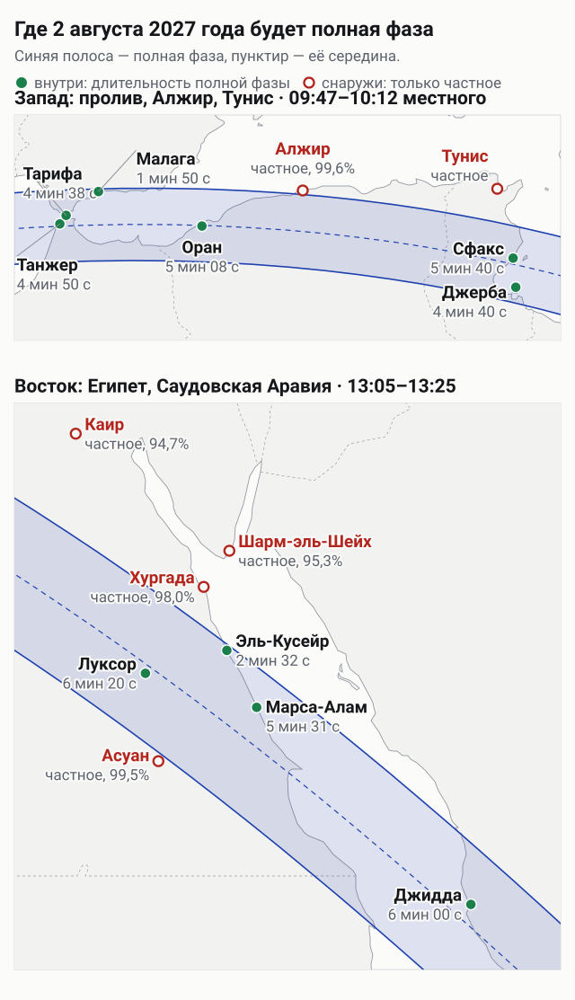
*Зелёные точки — внутри полосы, рядом длительность полной фазы. Красные — снаружи, там будет только частное затмение.*

NASA публикует полосу, но не длительность в каждом городе. Её мы посчитали сами по бесселевым элементам того же NASA, для координат центра города:

| Точка | Полная фаза | Максимум, местное время | Высота Солнца |
|---|---:|---:|---:|
| Абидос, Египет | 6 мин 21 с | 13:03 | 81° |
| Луксор, Египет | 6 мин 20 с | 13:05 | 82° |
| Джидда, Саудовская Аравия | 6 мин 00 с | 13:25 | 76° |
| Сфакс, Тунис | 5 мин 40 с | 10:11 | 56° |
| Марса-Алам, Египет | 5 мин 31 с | 13:11 | 81° |
| Сива, Египет | 5 мин 29 с | 12:45 | 75° |
| Оран, Алжир | 5 мин 08 с | 09:54 | 43° |
| Танжер, Марокко | 4 мин 50 с | 09:47 | 38° |
| Джерба, Тунис | 4 мин 40 с | 10:12 | 57° |
| Тарифа, Испания | 4 мин 38 с | 10:47 | 38° |
| Кадис, Испания | 2 мин 53 с | 10:47 | 37° |
| Эль-Кусейр, Египет | 2 мин 32 с | 13:08 | 81° |
| Малага, Испания | 1 мин 50 с | 10:49 | 39° |

Вне полосы будет частное затмение. Цифра ниже — фаза, то есть доля диаметра Солнца, которую закроет Луна: Монастир 0,998, Сусс 0,997, Асуан 0,995, Сафага 0,993, Сома-Бей 0,988, Хургада 0,980, Шарм-эль-Шейх 0,953, Каир 0,947, Сочи 0,46, Москва 0,18.

**Как посчитано и где предел точности.** В четырёх контрольных точках таблицы NASA наш расчёт совпал с ней до десятой доли секунды. Для Хургады он даёт фазу 0,980 и максимум в 13:05, как и справочник [timeanddate](https://www.timeanddate.com/eclipse/in/egypt/hurghada?iso=20270802). У края полосы результат зависит от конкретной улицы: NASA предупреждает, что границы известны с точностью 1–2 км из-за неровного края Луны. Время местное; Египет в августе живёт по летнему времени, UTC+3, так же считает и [timeanddate для Луксора](https://www.timeanddate.com/eclipse/in/egypt/luxor?iso=20270802).

Ливию, Йемен и Сомали в сравнение не брали: полоса через них идёт, но это не туристические направления. Оран в таблице есть, а ниже его нет: проверенных данных о въезде в Алжир у нас не набралось.

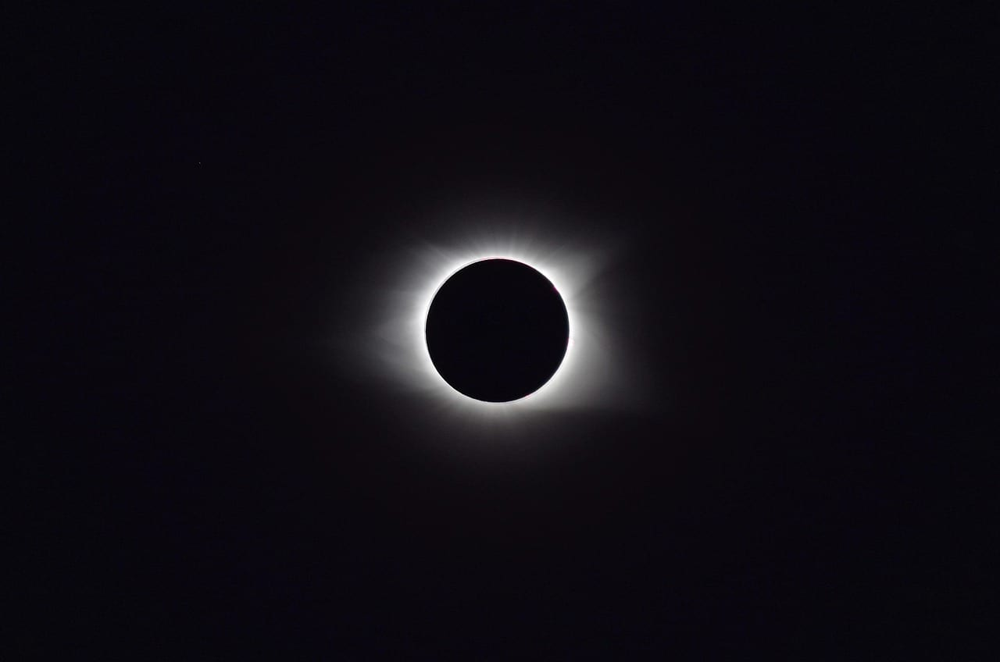
*Корона видна только в полной фазе. Снимок сделан в Теннесси во время затмения 2017 года.*

## Будет ли полное затмение в Хургаде и Шарм-эль-Шейхе?

**Нет, только частное.** Хургада остаётся примерно в 65 км от северной границы полосы, Шарм-эль-Шейх — в 155 км. В Хургаде Луна закроет 98% диаметра Солнца: заметно потемнеет, но ни короны, ни «бриллиантового кольца» не будет. Всё это видно только внутри полосы, и снимать защитные очки можно только на время полной фазы ([NASA](https://science.nasa.gov/eclipses/safety/)).

Курорты вокруг Хургады тоже мимо. У Эль-Гуны фаза 0,979, у Макади 0,986, у Сома-Бей 0,988, у Сафаги 0,993. «Почти» во всех четырёх случаях означает частное затмение.

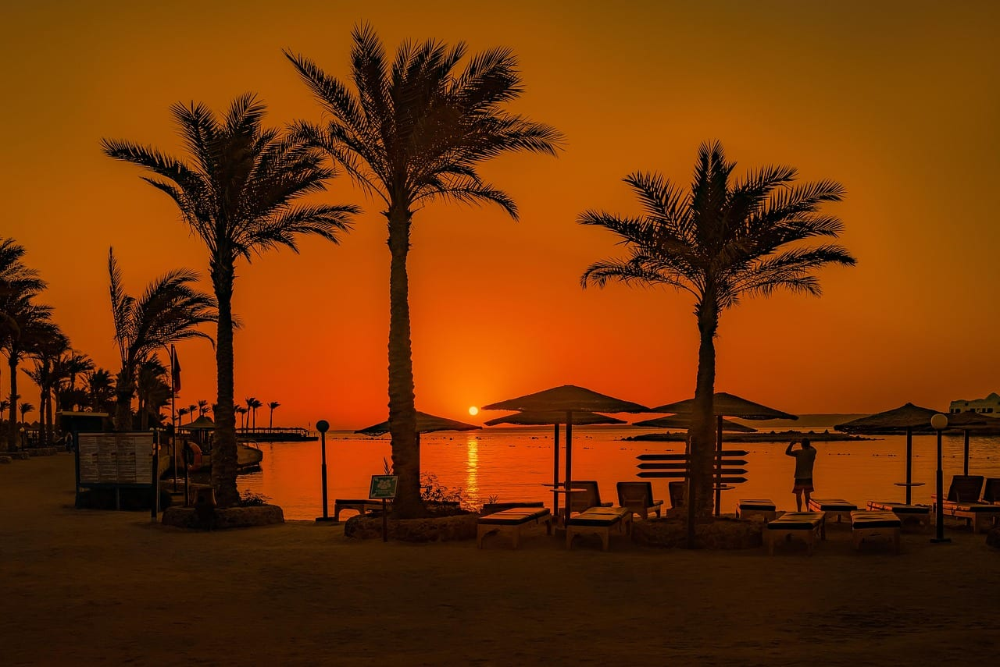
*Хургада. 2 августа 2027 года город останется за северной границей полосы.*

Если отдых куплен в Хургаде, в полосу можно выехать на день. Расстояния по дорогам посчитаны маршрутизатором OSRM:

- **Эль-Кусейр** — 151 км, около 1 ч 50 мин. Город на самом краю полосы: в центре 2 минуты 32 секунды, южнее по побережью дольше.
- **Кена** — 229 км, около трёх часов по дороге на Луксор через Сафагу. Там 6 минут 11 секунд, и до самого Луксора ехать не обязательно.
- **Марса-Алам** — 285 км, около 3 ч 20 мин, 5 минут 31 секунда.
- **Луксор** — 295 км, около 3 ч 50 мин, 6 минут 20 секунд.

С Шарм-эль-Шейхом сложнее. До Луксора по дороге 1 031 км, это не выезд, а отдельная поездка. Второй подвох в штампе: бесплатный Sinai only действует 15 дней и только на курортах Южного Синая. Чтобы выехать на материк, нужна обычная виза за 30 долларов, это 2 564 ₽ по курсу ЦБ на 10 сентября 2026 года ([консульский департамент МИД России](https://www.kdmid.ru/docs/egypt/information-about-the-country/)).

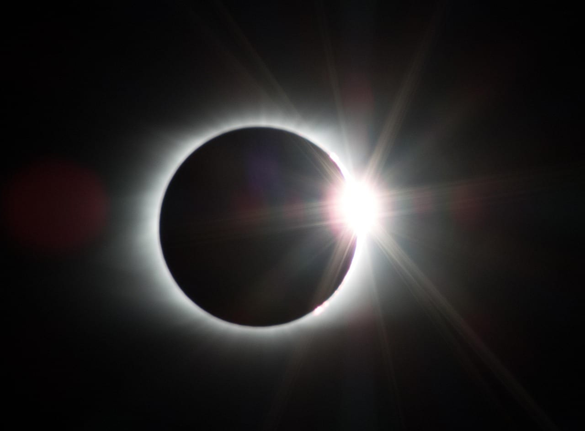
*«Бриллиантовое кольцо» вспыхивает за секунды до полной фазы и сразу после неё. При фазе 0,98 его не увидеть.*

## Шесть точек рядом: длительность, погода, дорога, документы

Погода взята из норм метеослужб через ВМО и испанской AEMET, доля солнечных дней — из климатологии затмения канадского метеоролога Джея Андерсона ([eclipsophile](https://eclipsophile.com/tse2027/)). Перелёт — самая низкая цена туда-обратно из Москвы на июль–август 2027 года у Авиасейлс по данным на 10 сентября 2026 года.

| Точка | Полная фаза | Погода в начале августа | Перелёт из Москвы | Документы | Главный минус |
|---|---|---|---|---|---|
| Луксор | 6 мин 20 с | 41 °C днём, облака редкость | 93 611–166 611 ₽ с пересадками или через Хургаду | виза 30 $ | жара ровно в полдень |
| Марса-Алам | 5 мин 31 с | 92% солнечных дней, около 35 °C | обычно через Хургаду: 66 223 ₽ и 285 км | виза 30 $ | мало рейсов, долгая дорога |
| Танжер | 4 мин 50 с | 77% солнечных дней, 30 °C | от 97 090 ₽ | без визы до 90 суток | утренний туман и пыль |
| Сфакс или Джерба | 5 мин 40 с / 4 мин 40 с | Сфакс: 85% солнечных дней, 33 °C | Джерба 112 968–161 759 ₽, 2–3 пересадки | без визы до 90 дней | курорты Сусса и Монастира вне полосы |
| Тарифа или Кадис | 4 мин 38 с / 2 мин 53 с | 74% и 88% солнечных дней, 25–28 °C | Малага от 68 578 ₽ | шенген | виза и толпа |
| Джидда | 6 мин 00 с | 71% солнечных дней, 39 °C, пыль | от 49 322 ₽, цена июльская | без визы до 90 дней в году | пыль, жара, Мекка закрыта для немусульман |

**Цены в таблице — не на ваши даты.** Это минимумы, которые кто-то нашёл на конкретные числа: до Хургады на 7–25 августа, до Луксора 166 611 ₽ — ровно на 1–2 августа, 93 611 ₽ — на июль. Витринное «от» почти никогда не совпадает с пиком спроса, так что свои даты проверяйте сами.

<a href={flightHurghada} class="aff-cta" rel="sponsored">Найти билет Москва — Хургада на август 2027</a> — Авиасейлс собирает прямые рейсы и стыковки в одну выдачу; из Хургады до полосы от полутора до четырёх часов на машине. Лететь сразу в Луксор: <a href={flightLuxor} class="aff-cta" rel="sponsored">Москва — Луксор на август 2027</a> — в найденных на август ценах только рейсы с пересадками.

## Луксор: самая длинная фаза и 41 градус в тени

В центре Луксора полная фаза длится 6 минут 20 секунд, у храмов Карнака 6 минут 21 секунду, в Абидосе, в 170 км по дороге, — столько же. Египет готовится именно к Луксору: 23 мая 2026 года министр туризма и древностей Шариф Фатхи создал комитет по подготовке к затмению в мухафазе Луксор, и задача комитета — развести туристов и не допустить скопления людей в зонах наблюдения ([Государственная служба информации Египта](https://sis.gov.eg/ar/%D8%A7%D9%84%D9%85%D8%B1%D9%83%D8%B2-%D8%A7%D9%84%D8%A5%D8%B9%D9%84%D8%A7%D9%85%D9%8A/%D8%A7%D9%84%D8%A3%D8%AE%D8%A8%D8%A7%D8%B1/%D8%A7%D8%B3%D8%AA%D8%B9%D8%AF%D8%A7%D8%AF%D8%A7-%D9%84%D9%83%D8%B3%D9%88%D9%81-%D8%A7%D9%84%D8%B4%D9%85%D8%B3-%D8%A7%D9%84%D9%83%D9%84%D9%8A-2027-%D9%88%D8%B2%D9%8A%D8%B1-%D8%A7%D9%84%D8%B3%D9%8A%D8%A7%D8%AD%D8%A9-%D9%8A-%D8%B4%D9%83%D9%84-%D9%84%D8%AC%D9%86%D8%A9-%D9%84%D8%AA%D9%86%D8%B8%D9%8A%D9%85-%D8%A7%D9%84%D9%81%D8%B9%D8%A7%D9%84%D9%8A%D8%A7%D8%AA-%D8%A8%D8%A7%D9%84%D8%A3%D9%82%D8%B5%D8%B1/)). Первое заседание прошло 1 сентября 2026 года, об этом со ссылкой на министерство писало египетское издание [Masrawy](https://www.masrawy.com/news/news_egypt/details/2026/9/1/3041580/). Цен, регистрации и ограничений доступа к храмам Египет пока не объявлял.

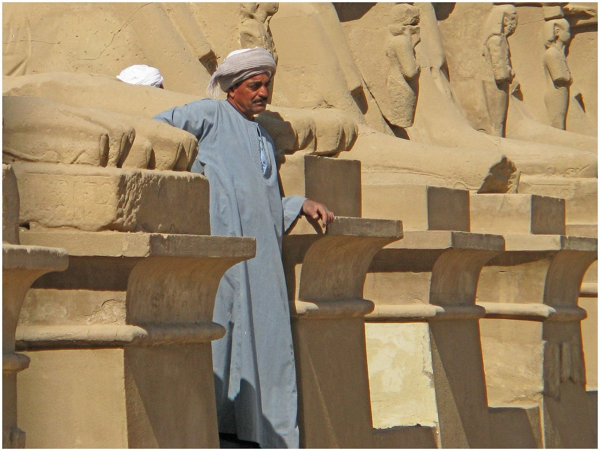
*Сфинксы у входа в Карнак. Здесь полная фаза продлится 6 минут 21 секунду.*

Погода в Луксоре — почти всегда ясное небо и почти всегда пекло. Средний максимум августа в Луксоре — 41,0 °C, осадков ноль (норма Египетской метеослужбы за 1981–2010 годы, [ВМО](https://worldweather.wmo.int/en/city.html?cityId=1271)). Андерсон посчитал точнее, по самой дате: за 17 лет средний максимум 2 августа — 42 °C, рекорд — 46 °C. Облака над Луксором — редкость, главная угроза по его данным — тонкие перистые облака, которые приглушат внешнюю корону на снимках.

Минус в том, что полная фаза приходится на 13:02–13:08, самый жаркий час дня. Солнце при этом стоит на 82°, и смотреть придётся почти вертикально вверх. Нужны тень до и после, вода, головной убор и коврик, на котором можно лечь. Что делать в Луксоре в августе кроме затмения и как переносится жара, разобрано в [гайде по Египту](/blog/egypt-guide-2026/).

С жильём на 1–2 августа 2027 года ясности нет. Заголовки про отели Луксора, подорожавшие «в 40 раз», ссылаются на телеграм-канал, а «1 500–3 000 долларов за три дня» — на слова одного эксперта. Ни Египет, ни отели цен на эти даты не публиковали.

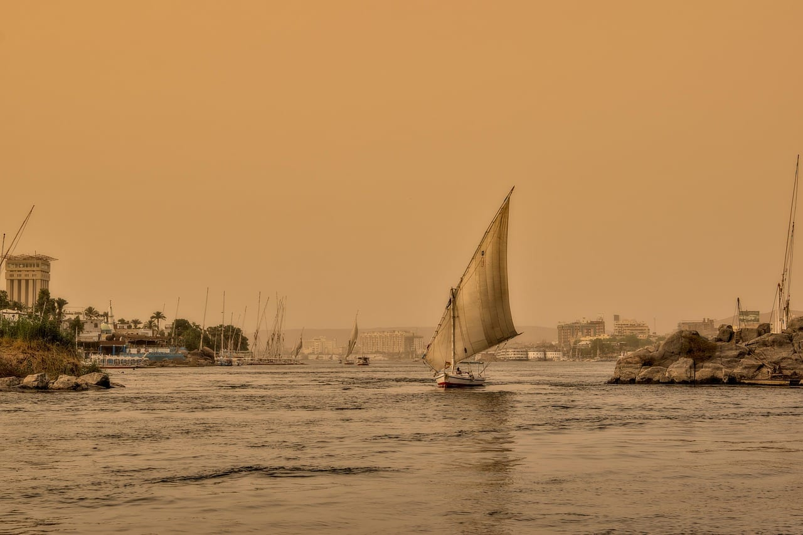
*Фелука на Ниле. Большие туры на затмение совмещают Луксор с круизом по реке.*

## Марса-Алам: море и пять с половиной минут

Для тех, кому нужно море, а не храмы, компромисс — южное побережье Красного моря. В Марса-Аламе полная фаза 5 минут 31 секунда в 13:11, Солнце на 81°. Южнее ещё дольше: у Беренисы, в 153 км от Марса-Алама по дороге, 6 минут 20 секунд. Эль-Кусейр на северном краю даёт 2 минуты 32 секунды.

В таблице Андерсона у Марса-Алама 92% солнечных дней в начале августа. Ближайшая станция ВМО — в Хургаде: средний максимум августа 35,1 °C, дождей нет ([ВМО](https://worldweather.wmo.int/en/city.html?cityId=1270)). Андерсон предупреждает, что к югу от Луксора полоса уходит во всё более влажный воздух, так что небо здесь может быть мутнее, чем над пустыней.

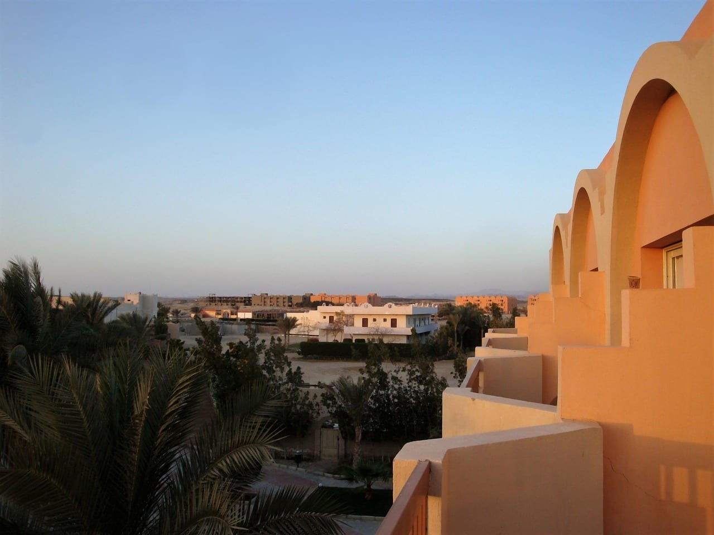
*Марса-Алам. Полная фаза здесь в 13:11 и длится 5 минут 31 секунду.*

Минус — дорога. В данных Авиасейлс на 10 сентября до Марса-Алама нашлась одна цена, июльская, 103 937 ₽. Обычная схема — прилёт в Хургаду и 285 км трансфера, около 3 ч 20 мин.

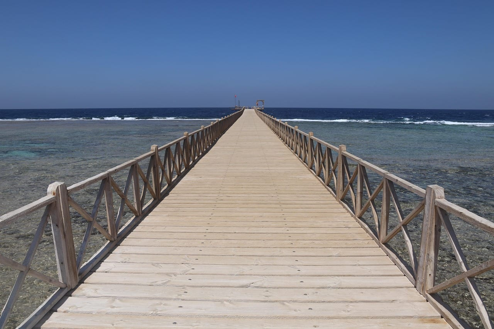
*Пирс в Эль-Кусейре. Город на северном краю полосы: в центре полная фаза всего 2 минуты 32 секунды.*

## Танжер и север Марокко: затмение в десять утра

Танжер — ближайшая к Европе и самая ранняя точка полосы: максимум в 09:47 по местному времени, полная фаза 4 минуты 50 секунд, Солнце на 38°. Низкое Солнце удобно для снимка: корона встанет над морем или городом, а не над макушкой. В Тетуане, в часе езды, — 4 минуты 51 секунда.

Погода мягче египетской. Средний максимум августа — 29,7 °C (норма 1991–2020 годов, [ВМО](https://worldweather.wmo.int/en/city.html?cityId=3521)). По спутниковым снимкам июля–августа 2024 и 2025 годов Андерсон даёт Танжеру 77% солнечных дней. Угроз две. Первая — морская слоистая облачность с Атлантики, она чаще держится на западе полуострова, у мыса Спартель, а не над городом. Вторая — пыль из пустынь Мали и Мавритании; её он называет главной опасностью для Испании и Танжера.

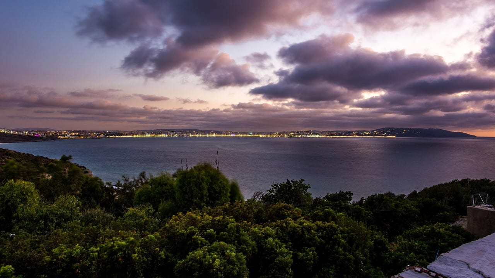
*Танжер и его бухта. Затмение здесь начнётся утром, в 08:40, полная фаза — в 09:45–09:50.*

Документы простые: Марокко пускает россиян без визы до 90 суток, паспорт должен действовать ещё полгода после выезда ([консульский департамент МИД России](https://www.kdmid.ru/docs/morocco/information-about-the-country/), подробнее — [виза в Марокко](/visa/morocco/)). Перелёт только с пересадкой: самый дешёвый найденный на 1–17 августа 2027 года — 97 090 ₽. <a href={flightTangier} class="aff-cta" rel="sponsored">Проверить Москва — Танжер на август 2027</a> — Авиасейлс показывает все стыковки на эти даты, дни можно сдвинуть в форме. Что ещё посмотреть на севере страны, собрано в [гайде по Марокко](/blog/morocco-guide-2026/).

Минус: 77 шансов из 100 на солнце — это не египетская пустыня, а утренний туман может не уйти к 09:45.

## Тунис: Сфакс и Джерба, но не Сусс с Монастиром

В Тунисе полоса проходит по югу. Сфакс получает 5 минут 40 секунд в 10:11, Джерба — 4 минуты 40 секунд. Курортный север остаётся снаружи: Сусс и Монастир стоят в 8–11 км за северной границей полосы, у них фаза 0,997–0,998. Полной фазы там не будет, и погрешность границы в 1–2 км этого не меняет.

Из Сусса до Сфакса по дороге 134 км, около 1 ч 50 мин, из Монастира до Джербы — 392 км и 5,5 часа.

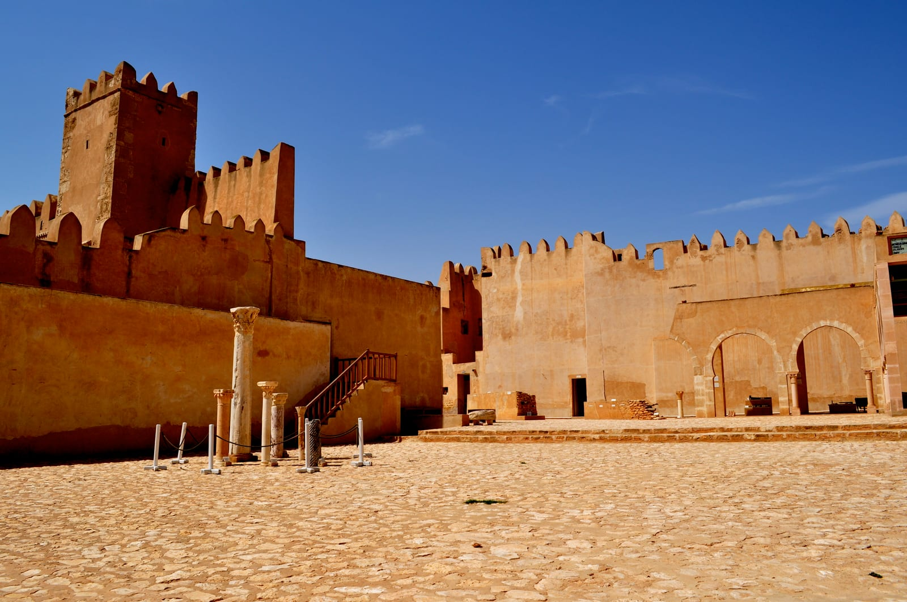
*Касба Сфакса. Андерсон называет этот район самым безоблачным на западной половине полосы.*

По погоде Андерсон ставит Сфакс и район к югу от него на первое место на западной половине полосы: 85% солнечных дней, средний максимум 33,2 °C. Для Джербы отдельной статистики нет ни у него, ни у ВМО, поэтому числа по острову мы не даём.

Въезд без визы до 90 дней, но на границе могут попросить бронь отеля или адрес проживания ([консульский департамент МИД России](https://www.kdmid.ru/docs/tunisia/information-about-the-country/)).

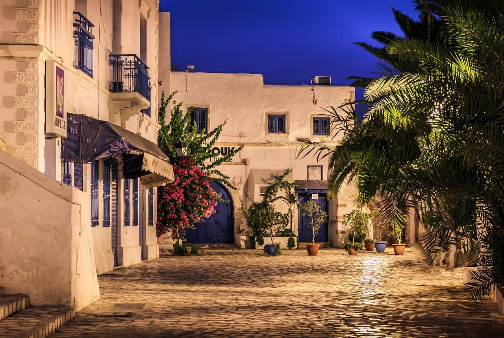
*Хумт-Сук, главный город Джербы. Полная фаза на острове — 4 минуты 40 секунд.*

Главный минус — перелёт. В данных на 10 сентября до Джербы нашлись только стыковки: 112 968 ₽ на июль и 161 759 ₽ на август с тремя пересадками, до Монастира — 113 841 ₽ на июль.

## Испания: Тарифа и Кадис для тех, у кого есть шенген

Испанский берег пролива тоже в полосе. Тарифа получает 4 минуты 38 секунд в 10:47, Кадис в 24 км от северной границы — 2 минуты 53 секунды, Малага в 9 км от края — 1 минуту 50 секунд.

По спутниковым снимкам 2024–2025 годов Андерсон даёт Кадису 88% солнечных дней, а Тарифе и соседним пляжам — 74%: у самого пролива чаще держится морская облачность. Летом там дует восточный левантер, иногда днями и неделями подряд. Средний максимум августа в Тарифе — 24,5 °C при влажности 81% ([AEMET, станция 6001](https://www.aemet.es/es/serviciosclimaticos/datosclimatologicos/valoresclimatologicos?l=6001&k=and)).

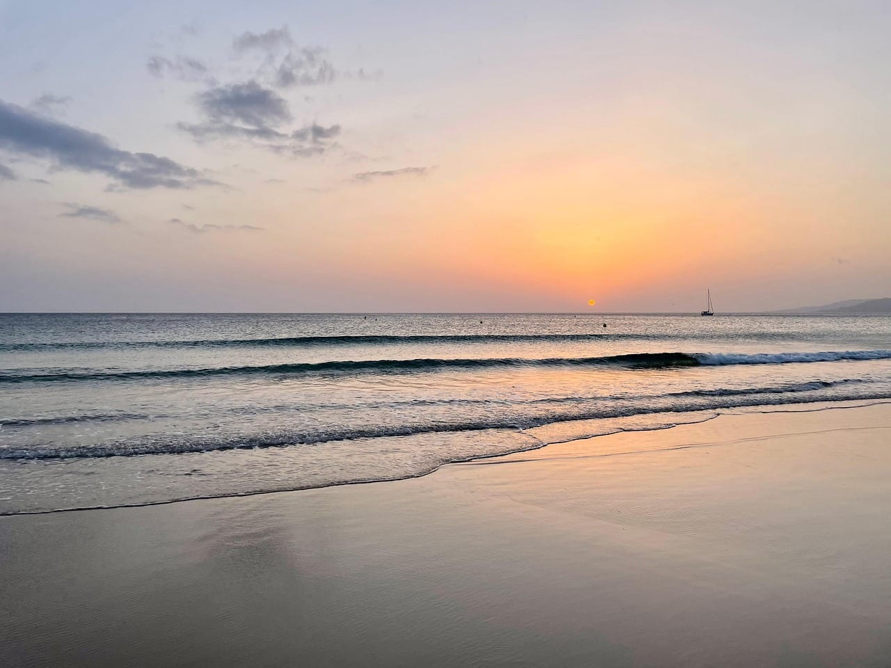
*Тарифа. Андерсон насчитал у пляжей пролива 74% солнечных дней, у Кадиса — 88%.*

Минус — виза, и это не формальность. Консульский сбор ЕС — 90 евро, это 8 933 ₽ по курсу ЦБ на 10 сентября 2026 года ([Еврокомиссия](https://home-affairs.ec.europa.eu/news/schengen-visa-fee-increased-11-june-2024-2024-06-13_en)), сверху сервисный сбор визового центра. Подача только лично через BLS, рассмотрение до 45 дней ([BLS Spain](https://blsspainrussia.ru/moscow/)). Нужна и медицинская страховка на весь шенген — [какую брать](/blog/schengen-insurance-2026/). Перед затмением 12 августа 2026 года это стоило кому-то поездки: на форуме любителей астрономии одна группа 28 июля написала, что не смогла записаться на подачу и отменила её. Как устроена подача сейчас — в [разборе шенгенской визы](/blog/schengen-visa-2026/).

Перелёт до Малаги — от 68 578 ₽ с двумя пересадками, дальше 161 км до Тарифы, около двух часов.

## Джидда: шесть минут у Красного моря

В Джидде полная фаза 6 минут ровно, в 13:25, Солнце на 76°; в горном Таифе — 3 минуты 49 секунд. Саудовская Аравия пускает россиян без визы до 90 дней за календарный год, паспорт нужен со сроком от шести месяцев. Мекка и Медина закрыты для немусульман при любом режиме въезда ([консульский департамент МИД России](https://www.kdmid.ru/docs/saudi-arabia/information-about-the-country/), подробнее — [въезд в Саудовскую Аравию](/visa/saudi-arabia/)).

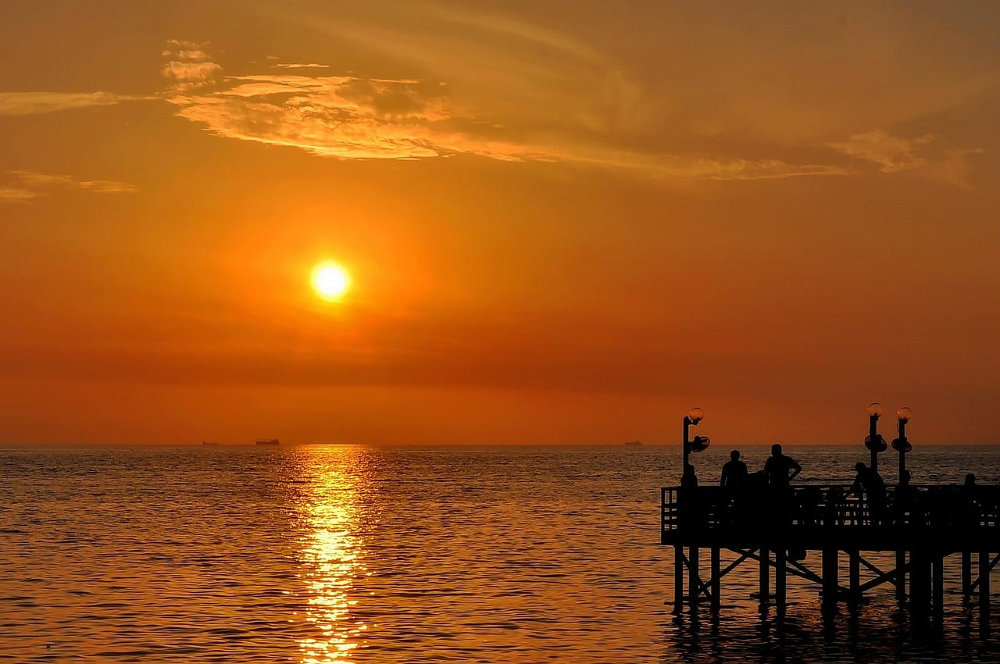
*Набережная Джидды. Полная фаза здесь в 13:25 и длится ровно 6 минут.*

Средний максимум августа — 38,7 °C (норма 1982–2011 годов, [ВМО](https://worldweather.wmo.int/en/city.html?cityId=699)). Андерсон даёт Джидде 71% солнечных дней: прибрежная равнина Тихама остаётся солнечной, облачность в августе чуть больше 10%, но по пыли это худшее место всей полосы, особенно к югу от города. Через Красное море средняя облачность вырастает больше чем на 40% — от египетского берега у Беренисы до Джидды.

Перелёт: в данных нашлась только июльская цена, 49 322 ₽. Минус — пыль и жара, а цен на жильё на неделю затмения пока нет.

## Сколько дней закладывать

| Дней | Что складывается | Кому подходит |
|---|---|---|
| 3–4 | Прилёт в Хургаду, 1 августа переезд в Кену или Луксор, затмение, обратно на море | тем, кто едет ради одного затмения |
| 6–7 | Два-три дня в Луксоре с храмами и затмением, потом море в Хургаде или Марса-Аламе | тем, кто впервые в Египте |
| 9–10 | Каир, Луксор, Нил и море — так устроены готовые туры на затмение | тем, кто не хочет собирать логистику сам |
| 5–6 | Танжер, Тетуан, Шефшауэн, затмение утром 2 августа | тем, кому важнее мягкая погода |
| 6–7 | Сфакс или Джерба, затмение и море | тем, кто был в Египте раньше |
| 5–7 | Малага, Тарифа или Кадис, затмение утром 2 августа, остальное — побережье | тем, у кого есть шенген |
| 4–5 | Джидда: прилёт, день на жару и акклиматизацию, затмение, вылет | тем, кто хочет шесть минут без пересадки на машину |

В точку наблюдения лучше приехать накануне, 1 августа. Полная фаза в Египте — в 13:02–13:08, в Тунисе — около 10:10, в Марокко — около 09:45, и утренняя дорога в день затмения — лишний риск.

## Сколько стоит поездка на затмение?

**Готовый тур на затмение в Египет у российских организаторов стоит от 135 000 ₽ на человека без перелёта, перелёт из Москвы в августе 2027 года — от 55 584 ₽ туда-обратно до Каира и от 66 223 ₽ до Хургады.** Цены туров сняты с сайтов самих организаторов 10 сентября 2026 года:

- **Astro-camp**, Египет, 26 июля — 4 августа 2027 года: Каир, Хургада, затмение у стен Луксорского храма. От 135 000 ₽, перелёты и страховка не входят ([страница тура](https://astro-camp.com/eclipse2027egipt)).
- **Атурс**, экспедиция в Абидос, 29 июля — 3 августа 2027 года: 2 000 долларов на человека в двухместном номере, это 170 919 ₽ по курсу ЦБ. Перелёт, виза и страховка не входят; депозит 800 долларов, запись закрывается за 180 дней до старта, в конце января 2027 года ([страница тура](https://aturs.ru/eclipse)).
- **City & Sea Travel**, круиз по Нилу 27 июля — 7 августа 2027 года: от 10 499 долларов с человека, около 897 тысяч ₽. Половина при бронировании, остаток до 31 марта 2027 года ([страница тура](https://nilecruiseship.com/ru/12-days-11-nights-complete-2027-solar-eclipse-egypt-tour/)).
- **Sadko Safari Fleet**, дайв-сафари на юге Красного моря 31 июля — 7 августа 2027 года: от 900 евро плюс сборы за стандартную двухместную каюту, это около 89 тысяч ₽. Трансфер из Хургады включён, перелёт и виза — нет ([страница тура](https://www.sadko-safarifleet.com/ru/itineraries/red-sea-solar-eclipse-tour)).

Британский организатор Astro Trails свои туры на это затмение в Марокко и Тунис распродал за 11 месяцев до события.

Сравнить готовые программы по Египту можно в одном месте: <a href={tours} class="aff-cta" rel="sponsored">Посмотреть туры по Египту с гидом</a> — маршрут, даты и состав группы видны до брони, оплата картой РФ; тура под само затмение в каталоге может не быть, поэтому сверяйте даты с 1–2 августа. Полис на такую поездку стоит оформить заранее: полдень на открытой площадке при 41 °C — прямой риск теплового удара. <a href={insurance} class="aff-cta" rel="sponsored">Подобрать страховку в Египет на свои даты</a> — Черехапа сравнивает предложения российских страховых, оплата картой РФ, полис приходит в PDF.

## Что пишут те, кто ездил на затмение 12 августа 2026 года

Выборка маленькая, и сказать это нужно сразу. Два отчёта после события на форуме любителей астрономии astronomy.ru (тема на 82 сообщения за март 2024 — сентябрь 2026 года), тема на форуме Винского из пяти сообщений, все написаны до поездки, и отзывы о летних поездках в Луксор 2014–2024 годов на трёх сайтах отзывов. Представительной такую выборку считать нельзя.

- Оба отчёта об Испании положительные. Один автор наблюдал в городке Сасамон под Бургосом, второй ездил с семьёй на автодоме с Тенерифе на материк. На облака и толпы никто не жалуется, хотя до события СМИ писали о росте броней отелей до 260% и квартирах за тысячи евро в сутки.
- Реальная проблема оказалась в визе. Группа, которая не смогла записаться на подачу, осталась дома и видела фазу 0,12.
- Про Луксор летом отзывы расходятся. Одни называют жару изнурительной, другие — терпимой при выезде в 3–4 часа утра и закрытой одежде. Разброс объясняется временем экскурсии, а не погодой. Для затмения это плохая новость: полная фаза в 13:02–13:08, и уйти от полуденной жары не получится.

## Как смотреть на затмение без вреда для глаз?

**Все частные фазы — только через очки по стандарту ISO 12312-2, снимать их можно лишь на время полной фазы.** Обычные солнечные очки, даже самые тёмные, не защищают. Смотреть на Солнце в фотоаппарат, бинокль или телескоп нельзя даже в очках для затмения: собранные линзой лучи прожигают фильтр ([NASA](https://science.nasa.gov/eclipses/safety/)). В Хургаде, где фаза 0,98, очки понадобятся на всё время затмения.

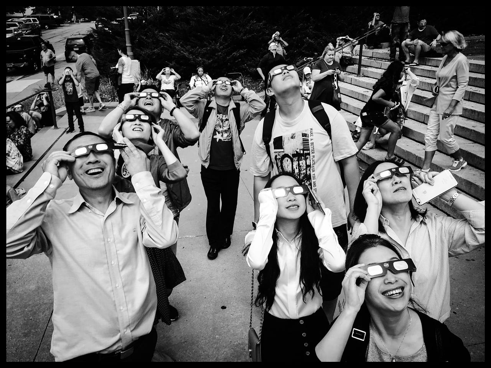
*Очки для затмения нужны на все частные фазы, от первого касания до последнего.*

## FAQ — что ещё спрашивают про затмение 2027 года

**Будет ли затмение 2 августа 2027 года видно в России?**

Только частное и небольшое. В Москве Луна закроет 18% диаметра Солнца, максимум в 12:39 по Москве; в Сочи — 46% в 12:53, в Махачкале — 36% в 13:04. Полной фазы на территории России не будет. Прошлое затмение, 12 августа 2026 года, разобрано в [статье про Персеиды и затмение](/blog/perseidy-zatmenie-avgust-2026/).

**Почему в одних источниках для Луксора 6 минут 23 секунды, а здесь 6 минут 20?**

6 минут 23 секунды — максимум всей полосы, он приходится на пустыню к востоку от города. В центре Луксора полная фаза на пару секунд короче, у храмов Карнака — 6 минут 21 секунда, timeanddate для Луксора даёт 6 минут 22 секунды. Разница в том, какую точку города считать. Ради секунд место выбирать не стоит, ради погоды и дороги — стоит.

**Что делать, если в день затмения облачно?**

Держать запас по машине и времени. В Египте облака в начале августа — исключение, у пролива и в Тунисе — нет. Там лучше не привязываться к одному пляжу и решать место по прогнозу за день-два. Андерсон пишет, что морская облачность у пролива ложится пятнами, и у наблюдателя с машиной шансы выше, чем показывают средние цифры.
