import AffiliateNote from '../../components/post/AffiliateNote.astro';
import { airaloSub, aviasalesRoute, cherehapaCountry, cherehapaTravel, ostrovokCountry, youtravelSub } from '../../data/affiliate.js';

Облако сползает через гребень Двенадцати Апостолов и останавливается на середине склона, будто его выключили. Под ним — белые дома, пальмы, парковка вдоль набережной и кафе, где в семь вечера занят каждый стол. Это Кэмпс-Бэй, десять минут от центра Кейптауна, и на этом кадре видно главную особенность города: горы начинаются прямо за последним рядом домов.

А в сорока минутах езды, на другом берегу того же полуострова, по песку ходят пингвины. Не в вольере — по обычному пляжу, между валунов, куда людей пускают за 245 рандов.

Кадры в этой статье сняты между 28 декабря 2025 года и 6 января 2026-го: Кэмпс-Бэй и Двенадцать Апостолов, колония на Болдерс-Бич, пляжные кабинки Мёйзенберга, дорога над океаном и солевые пруды. Это разгар южноафриканского лета — тот самый сезон, который дальше в статье и рекомендуется для этой части страны.

> **Если коротко:** россиянам виза не нужна — в списке Департамента внутренних дел ЮАР записано **90 дней**, и годового ограничения, о котором пишут русские сайты, там нет. С **1 июля 2026 года** декларацию о вещах и валюте подают **онлайн до поездки**, причём и на въезде, и на выезде. Прямых рейсов нет, летят через Стамбул или Персидский залив, дорога занимает 14–18 часов. Главная ловушка планирования — **сезоны не совпадают**: Кейптаун хорош с ноября по март, сафари в Крюгере — с мая по сентябрь. Поездка на три недели с перелётом обходится примерно в **450 000 ₽** на человека. Хорошие клиники в ЮАР частные и дорогие, а до них от парков далеко: <a href={cherehapaCountry('south-africa', 'south_africa_2026_tldr')} class="aff-cta" rel="sponsored">подобрать страховку в ЮАР</a>. <a href={youtravelSub('south_africa_guide_2026_top')} class="aff-cta" rel="sponsored">Посмотреть авторские туры в ЮАР</a> малые группы с русскоязычным гидом, маршрут и даты видны до оплаты. 

<AffiliateNote />

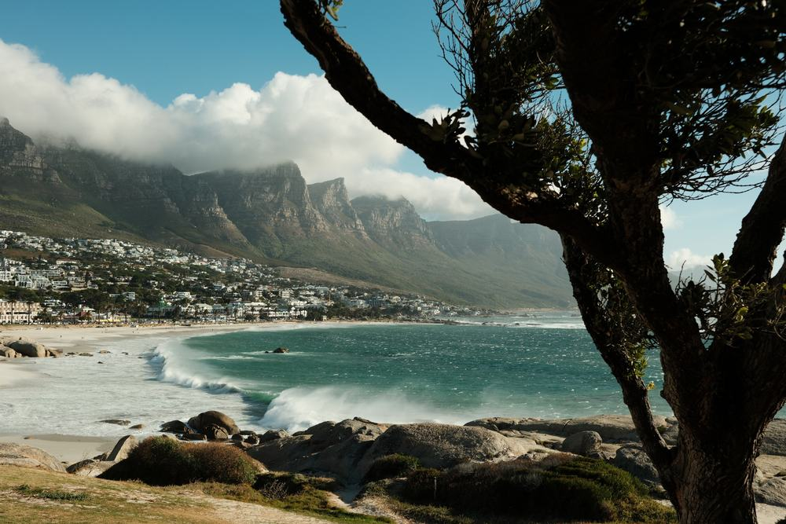

---

## ЮАР — это не одна поездка, а две

По площади ЮАР — это Франция, Германия и Италия вместе взятые, и её туристические половины лежат в разных углах страны и живут в противофазе.

**Юго-запад** — Кейптаун, Капский полуостров, винодельни Стелленбоса и Франсхука, Дорога садов на восток. Океан, горы, город европейского вида, кухня и вино. Лето здесь сухое, зима дождливая.

**Северо-восток** — Крюгер и частные резерваты вокруг него, ворота в них через Йоханнесбург. Саванна, «большая пятёрка», утренние и вечерние выезды на джипе. Здесь наоборот: лето дождливое и зелёное, зима сухая.

Между ними два часа лёта и около 1 300 километров. Обе половины в одну поездку помещаются легко — местные перелёты дешёвые, — но выбрать один идеальный месяц для обеих не получается. Это первое, что стоит принять при планировании, и об этом дальше отдельный раздел.

Третья, менее очевидная часть — **всё остальное**: Драконовы горы с водопадом Тугела, зулусские земли и эстуарий Сент-Люсия с бегемотами, королевство Эсватини, Лесото в горах. Туда едут во вторую поездку или когда есть три недели.

---

## Когда ехать: три сезона, которые не сходятся

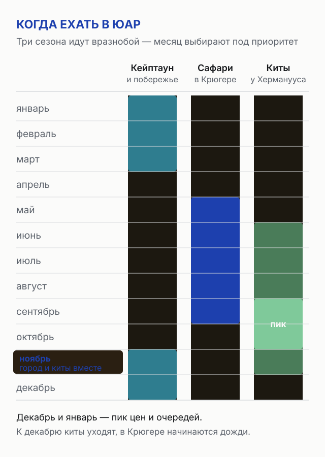

**Кейптаун и побережье — ноябрь–март.** Сухо, тепло, длинный световой день. Декабрь и январь — пик: это местные летние каникулы плюс Рождество, цены на жильё максимальные, у канатки очередь, места в ресторанах разбирают. Февраль и март дают ту же погоду при меньшей толпе.

**Сафари — май–сентябрь.** Сухой сезон: трава ниже, листва реже, вода остаётся в немногих местах, и звери сами собираются у водопоев. В зелёный сезон, с ноября по март, парк красив и полон детёнышей, но животные расходятся по всей площади, и увидеть их сложнее.

**Киты — июнь–ноябрь.** Южные гладкие киты приходят к берегу у Херманууса размножаться, пик приходится на сентябрь и октябрь. Дальше сезон схлопывается быстро: в отчёте о поездке начала ноября 2025 года наблюдение описано как «самый конец сезона» — двух китов с детёнышами видели, — а в поездке, начавшейся 21 ноября того же года, китов не встретили вовсе, и заложенное на них время освободилось. Планировать китов на декабрь бессмысленно.

**Ноябрь — единственный месяц, где город и киты совпадают.** Сафари к этому времени на спаде: в Крюгере начинаются дожди и трава идёт в рост. Зато в Кейптауне тепло, а новогодних цен ещё нет.

Если приоритет один, выбор очевиден. Океан, город и вино — берите декабрь–март. Звери — май–сентябрь. Хотите и то и другое без перекосов — сентябрь–октябрь или март–апрель: в саванне ещё сухо, а в Кейптауне тепло.

---

## Кейптаун: три вещи, которых не ждёшь

### Ветер здесь не помеха погоде, а сама погода

Юго-восточный ветер, который местные называют «капский доктор», дует именно летом. По данным метеослужбы ЮАР, самые сильные юго-восточные ветры приходятся на **декабрь и февраль**, со средней скоростью около 7 м/с, а ветер от 1,6 м/с и выше стоит в Кейптауне **95,6% дней в году**. Это не мелочь для планирования: в отчёте о поездке 6 декабря 2025 года утренняя прогулка по Кэмпс-Бэй не состоялась — «было оооочень ветрено».

Практический вывод: закладывайте запасной день на Столовую гору. Канатку закрывают по погоде, и это происходит часто. Билет действителен семь дней, а при отмене из-за погоды его можно вернуть или использовать в другой день недели — это записано в правилах перевозчика.

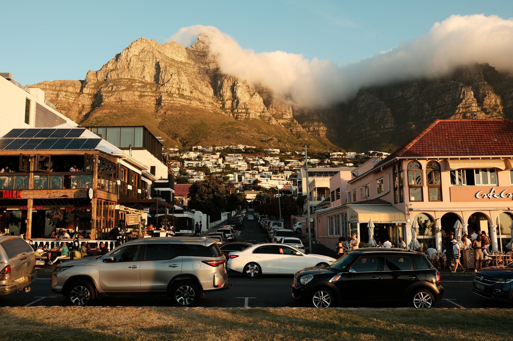

### Купаться и любоваться приходится в разных местах

Полуостров омывают две разные воды. С запада идёт холодное Бенгельское течение, и на атлантических пляжах — Клифтон, Кэмпс-Бэй, Лландудно — вода летом держится около **14–18 °C**. С востока лежит закрытая бухта Фолс-Бэй, где вода прогревается до **17–21 °C**: это Мёйзенберг, Фиш-Хук, Саймонстаун.

Разница в несколько градусов на этих значениях решает всё. В Кэмпс-Бэй заходят по колено и фотографируются; купаются, учатся серфить и сидят на песке до вечера — в Мёйзенберге. Именно поэтому у цветных кабинок Мёйзенберга людно даже в будний день, хотя вид там кратно скромнее.

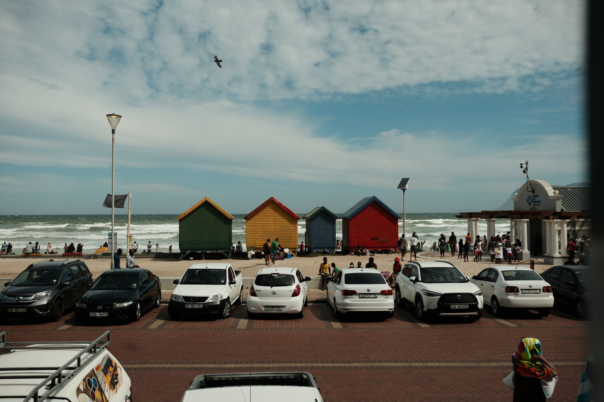

Цифры по воде — ориентир по сводкам морских наблюдений, а не официальная норма: конкретный день зависит от ветра. При сильном юго-восточном ветре у атлантического берега поднимается холодная глубинная вода, и температура падает ещё на пару градусов за сутки.

### Столовая гора дешевле, если купить билет заранее

Тарифы канатной дороги действуют с 1 июля 2026 года по 30 июня 2027-го:

| Билет | Онлайн | В кассе |
|---|---|---|
| Взрослый, туда-обратно | **475 R** (≈2 457 ₽) | 530 R (≈2 741 ₽) |
| Взрослый, в одну сторону | 300 R (≈1 552 ₽) | 330 R (≈1 707 ₽) |
| Ребёнок 4–17 лет, туда-обратно | 230 R (≈1 190 ₽) | 270 R (≈1 397 ₽) |
| Без очереди, туда-обратно | 1 200 R (≈6 206 ₽) | 1 200 R |

Дети до четырёх лет ездят бесплатно. Билеты действительны семь дней с выбранной даты. Разница между покупкой онлайн и в кассе — 55 рандов на взрослого, и это единственный способ сэкономить: очередь она не отменяет, для этого есть отдельный дорогой тариф.

В одну сторону берут те, кто поднимается пешком по ущелью Платтеклип и спускается на канатке, или наоборот. Подъём пешком занимает 2–3 часа и не требует снаряжения, но на жаре даётся тяжело — идут рано утром.

---

## Полуостров за один день

Кольцо от Кейптауна вокруг Капского полуострова и обратно проезжают за световой день, и это самый насыщенный день поездки.

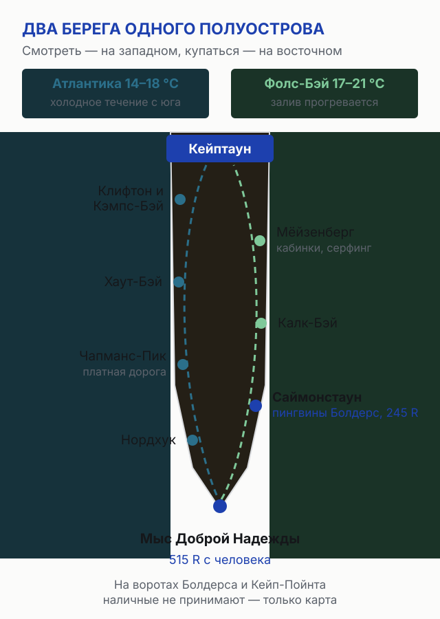

Порядок движения имеет смысл выбрать по солнцу: если ехать по западному берегу с утра, свет будет в спину на дороге Чапманс-Пик, а к пингвинам вы приедете во второй половине дня, когда они выходят из воды.

**Чапманс-Пик Драйв** — платная дорога, вырубленная в отвесном склоне над океаном между Хаут-Бэй и Нордхуком. Её закрывают при камнепадах и сильном ветре, статус смотрят заранее на сайте дороги.

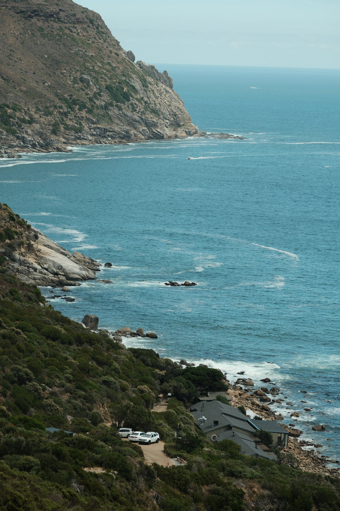

**Мыс Доброй Надежды и Кейп-Пойнт** — южная часть парка «Столовая гора». Вход для иностранцев **515 R** со взрослого и 250 R с ребёнка 2–11 лет в день (тариф действует до 31 октября 2026 года). Внимание к двум деталям: на воротах **не принимают наличные вообще**, только карты, и оплата идёт **одна на машину**, отдельно по людям не считают.

**Болдерс-Бич** — колония африканских пингвинов у Саймонстауна, вход **245 R** со взрослого, 120 R с ребёнка. Там же безналичная оплата. Пингвины гнездятся в кустарнике за пляжем, ходят по деревянным настилам и по песку, и подходят к людям сами.

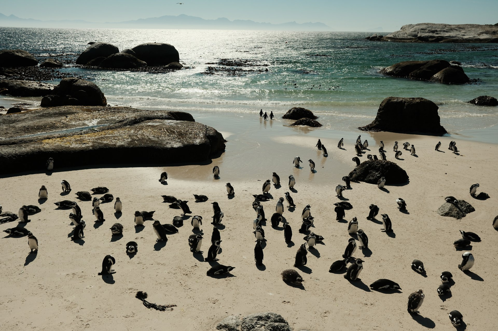

Отдельно про эти две карты: российские карты в ЮАР не работают, а на воротах теперь нет альтернативы в виде наличных. Значит, иностранная карта нужна не «на всякий случай», а как условие попадания в две главные точки полуострова. Как их выпускают и чем платят за границей — в отдельном разборе про [оплату картами за рубежом](/blog/pay-abroad-2026/).

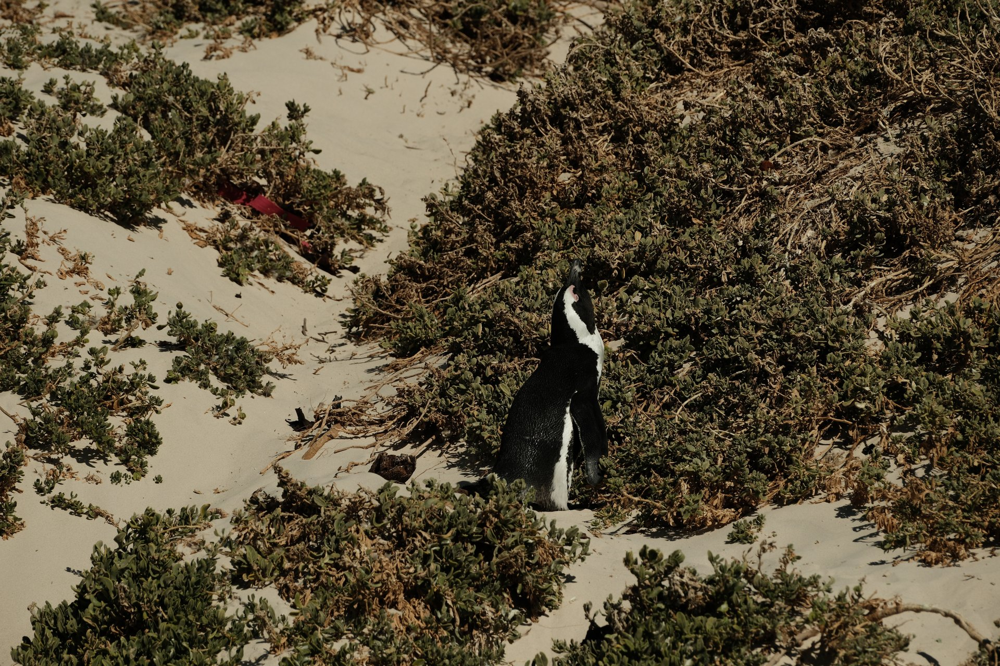

На скалах у верхней станции канатки и на смотровых полуострова живут даманы — коренастые зверьки размером с зайца, ближайшие родственники слонов. Людей они не боятся совсем.

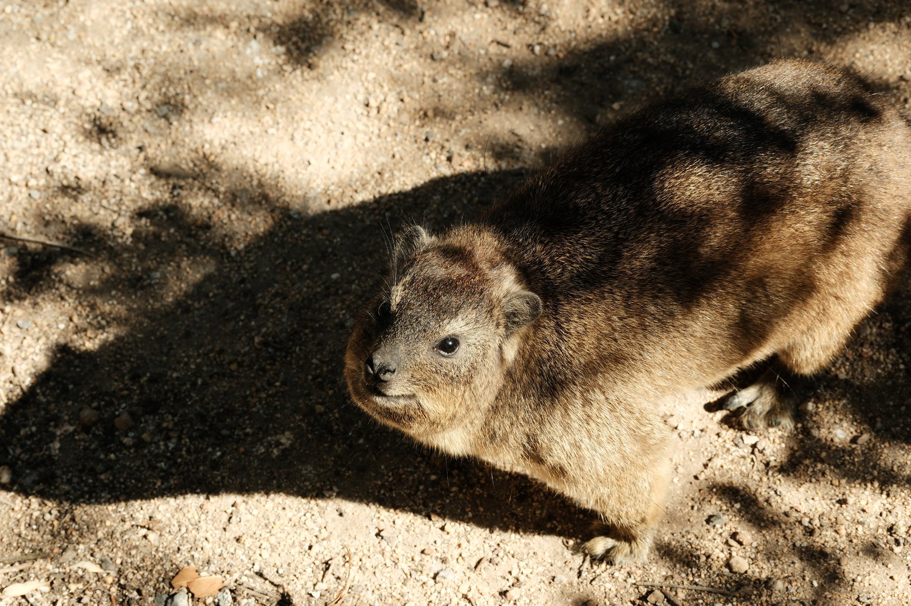

---

## Сафари: за рулём или с гидом

Крюгер — редкий случай, когда в национальный парк мирового уровня можно въехать на обычной легковой машине и ездить самому. Это меняет и цену, и характер поездки.

**Самостоятельно.** Въезд для иностранцев — **602 R** со взрослого в день (≈3 113 ₽) и 300 R с ребёнка 2–11 лет. Жильё внутри парка — государственные лагеря SANParks: шале и палаточные лагеря. Ездите по асфальтовым и грунтовым дорогам сами, останавливаетесь где хотите, выходить из машины нельзя. Малолитражки хватает: в отчёте о трёхнедельной поездке осени 2025 года весь маршрут, включая грунтовые дороги Крюгера и парка Аддо, прошли на самой дешёвой машине с автоматом.

**С гидом на открытом джипе.** Выезд на полный день у оператора обошёлся в **2 065 R** (≈10 680 ₽) в ноябре 2025 года — со слов участника поездки. Гид видит зверя там, где вы проедете мимо, и знает, куда переместился прайд, — рации между машинами работают весь день.

**Частный резерват.** Саби-Сэндз, Тимбавати и соседи — территории без заборов со стороны Крюгера, звери переходят свободно. Проживание с полным пансионом и двумя выездами в день, машинам разрешено съезжать с дорог и подъезжать к животным вплотную. Это самый дорогой формат: ориентир — от 250 долларов за ночь на человека в среднем сегменте и до 1 500 в верхнем.

Честный минус самостоятельного варианта: вы видите меньше. Крупные кошки лежат в тени в стороне от дороги, и без наводки их не найти. Честный минус резервата — цена и ощущение отработанной программы.

По деньгам Крюгер — самый дешёвый вход из больших парков континента: [разбор тарифов шести стран](/blog/safari-afrika-2026/) показывает, что сутки в Серенгети стоят в 2,19 раза дороже.

⚠️ **Бронировать жильё в Крюгере надо сильно заранее.** В отчёте о поездке сентября 2025 года лагеря выбирали за три с лишним месяца — и по остаточному принципу, из того, что не разобрали. На новогодние даты это касается и остальной страны.

<a href={ostrovokCountry('south-africa', 'south_africa_guide_2026_stay')} class="aff-cta" rel="sponsored">Посмотреть жильё в ЮАР</a> оплата картой российского банка, подтверждение сразу — на бронь под въезд это важнее скидки

---

## Сценарии поездок

**Неделя, только Кейптаун.** Прилёт и вылет из Кейптауна, жильё одно на всю неделю, каждый день — радиальный выезд: полуостров, винодельни Стелленбоса и Франсхука, Столовая гора и город, Херманус за китами в сезон. Расстояния небольшие, машина нужна.
*Минус:* сафари не будет вовсе — до Крюгера отсюда два часа лёта.

**Десять дней: город плюс звери.** Кейптаун и полуостров, затем внутренний перелёт в Скукузу или Хёдспрут и три-четыре дня в Крюгере или резервате.
*Минус:* два переезда с самолётами съедают полтора дня, и сезон придётся выбрать компромиссный.

**Две недели с севера на юг.** Прилёт в Йоханнесбург, сразу сафари, потом перелёт в Кейптаун, полуостров и винодельни, на остаток — начало Дороги садов.
*Минус:* маршрут в одну сторону, машины берут дважды со сдачей в другом городе — это дороже.

**Две недели по Дороге садов.** Порт-Элизабет или Джордж, дальше на запад: Цицикамма, Найсна, Плеттенберг-Бэй, мыс Игольный, Херманус, финиш в Кейптауне.
*Минус:* океан здесь для купания холодный почти везде, а расстояния между точками располагают ехать быстрее, чем хочется.

**Три недели, вся страна.** Кейптаун, Дорога садов, парк Аддо со слонами, Дурбан, Драконовы горы, Панорама-Рут, Крюгер, вылет из Йоханнесбурга. Это маршрут из отчёта, который дальше в разделе про чужую практику: 4 500 километров за 21 день.
*Минус:* темп. Подъём в 5–6 утра, ужин в 18, спать в 21 — иначе не успеть.

| Сколько дней | Что складывается |
|---|---|
| 7 | Кейптаун, полуостров, винодельни — без сафари |
| 10 | То же плюс 3–4 дня в Крюгере или резервате |
| 14 | Сафари + Кейптаун + кусок Дороги садов |
| 21 | Вся страна с горами, Аддо и Панорама-Рут |

---

## Сколько стоит поездка

Курс на 22 августа 2026 года по данным Центрального банка: **1 ранд = 5,17 ₽**, **1 доллар = 82,92 ₽**.

**Перелёт.** Прямых рейсов из России нет. Летят через Стамбул, Дубай, Доху, Абу-Даби или Аддис-Абебу в Кейптаун либо Йоханнесбург, дорога 14–18 часов с пересадкой. Вилка по маршруту — примерно от 700 до 2 200 долларов туда-обратно, и разброс здесь не случайный: **низ вилки приходится на межсезонье, а не на ваши даты**. На конец декабря и начало января цена уходит в верхнюю треть — это и пик спроса у нас, и разгар лета у них. Ориентир из практики: шесть перелётов на двоих в сентябре 2025 года обошлись в 123 536 ₽.

<a href={aviasalesRoute('MOW', 'CPT', 'south_africa_guide_2026_flight')} class="aff-cta" rel="sponsored">Билеты Москва — Кейптаун</a> все стыковки в одной выдаче, цены без наценки за поиск

**Машина.** Десять дней с максимальной страховкой — 7 400–8 400 рандов (≈38 000–43 000 ₽) по двум чекам осени 2025 года; 8–9 дней у другого прокатчика — 389–528 долларов. Депозит блокируют отдельно: 3 800–5 000 рандов. Бензин — 20–22 ранда за литр (≈103–114 ₽). Бронировать заранее заметно дешевле: по наблюдению из отчёта, за 2–3 месяца цены были в полтора-два раза ниже, чем за две недели.

<a href="https://economybookings.tpk.mx/xlSFNA6p?erid=2VtzqxYvA5V&sub_id=south_africa_guide_2026" class="aff-cta" rel="sponsored">Сравнить прокат авто в ЮАР</a> локальные и международные прокатчики с ценой под даты, видно условия страховки и депозита

**Жильё.** 3 000–5 000 ₽ за ночь дают приличный отель или апартаменты, в этих же деньгах на побережье попадаются дома с двумя-тремя спальнями. В лагерях Крюгера ночь дешевле, в частном резервате — кратно дороже. На новогодние даты ценник по побережью растёт, и это ещё один довод бронировать заранее.

**Еда.** Средний чек ужина на одного — около 400 рандов (≈2 070 ₽), в Йоханнесбурге стейк с напитком обошёлся в 270 рандов. Бутылка хорошего местного вина в магазине — от 100 рандов (≈517 ₽). Продукты стоят примерно как в Москве.

**Входные билеты** (тарифы до 31 октября 2026 года, для иностранцев):

| Куда | Взрослый | Ребёнок 2–11 |
|---|---|---|
| Крюгер, за день | 602 R (≈3 113 ₽) | 300 R |
| Мыс Доброй Надежды и Кейп-Пойнт | 515 R (≈2 663 ₽) | 250 R |
| Пингвины Болдерс | 245 R (≈1 267 ₽) | 120 R |
| Канатка на Столовую гору, онлайн | 475 R (≈2 457 ₽) | 230 R |

**Итог по чеку.** Три недели с перелётом, машиной, жильём, ресторанами и всеми входными билетами — около **450 000 ₽ на человека** по подробной раскладке из отчёта осени 2025 года. Это не бюджетный формат и не люкс: обычные хорошие отели, средняя машина, ужины в ресторанах.

---

## Дороги, машина и платные участки

Дороги в ЮАР хорошие, движение левостороннее, культура вождения вежливая: пропускают, благодарят аварийкой, крайнюю правую полосу занимают только на обгон. Ограничение на трассах — 120 км/ч.

Что стоит знать заранее:

- **Карту принимают не везде.** На платных участках N2 и N3 иностранные карты не работают — нужны местная карта или наличные, около 70 рандов за участок. На N4 и N12 международные карты проходят.
- **Прокат по карте банка СНГ.** Два независимых отчёта описывают выдачу машины по неименной карте: в Йоханнесбурге у Europcar «подошла неименная карта СНГ с кредитным бином», в Кейптауне и Дурбане — по карте казахстанского банка. Гарантией это не является, запасной вариант иметь стоит.
- **Депозит возвращают не всегда быстро.** В одном из отчётов прокатчик списал оба депозита полностью и разобрался только после возвращения путешественников домой.
- **Штрафы приходят.** Камеры стоят и на отдельных столбах, и в руках у полицейских на трассах; знакомый автора отчёта получил счёт на 25 долларов от прокатчика за одно нарушение.
- **Навигатор ведёт не туда.** Оба отчёта про Йоханнесбург предупреждают: маршрут может пройти через тауншип. Дорогу проверяют заранее и уточняют у администратора отеля — в одном случае отель написал сам, каким путём не ехать.

---

## Безопасность без паники и без розовых очков

Это тема, из-за которой ЮАР откладывают, и обойти её нечестно. Уровень уличной преступности в стране высокий, но он крайне неравномерен: туристические районы, побережье и резерваты — одно, центр Йоханнесбурга и тауншипы — другое.

Правила, которые повторяются во всех прочитанных отчётах:

1. Не ездить через тауншипы, маршрут проверять заранее.
2. К закату быть на месте. День складывается сам собой: подъём в 5–6, ужин в 18, спать в 21.
3. В машине ничего на виду — ни сумки, ни телефона, даже когда выходишь на минуту. Двери заблокированы, окна закрыты.
4. На светофоре держать дистанцию, чтобы была возможность уехать.
5. На заправке из машины не выходить: заправщик принесёт терминал к окну. Заправляться на сетевых заправках и не опускать бак ниже половины.
6. Вечером в Кейптауне от ресторана до отеля — на такси через приложение, не пешком.
7. Паспорт в сейфе, с собой копия и немного наличных.

При этом ни в одном из пяти отчётов не описано нападения. Что случилось: из сумок в отеле пропали 300 долларов. Ощущение небезопасности авторы описывают как фоновое и постоянное, а реальных происшествий — одно на пять поездок.

---

## Документы: что изменилось в 2026 году

### Виза не нужна, но цифра гуляет по сайтам

Россия входит в список стран, освобождённых от визы при въезде в ЮАР. В официальном перечне Департамента внутренних дел, изданном 9 декабря 2025 года, у обычных российских паспортов записано **90 дней**.

Здесь стоит остановиться, потому что по русским сайтам ходит формулировка «90 дней суммарно в течение 360-дневного периода». Первоисточником она не подтверждается. В том же списке страны с годовым ограничением помечены отдельно — сокращением **P/A**, per annum: такая пометка стоит у Замбии, Ганы, Кении, Танзании. **У России её нет.** Есть и отдельная оговорка внизу таблицы для Анголы — «каждый визит не более 30 дней»; для России подобной оговорки тоже нет.

Что нужно на границе, помимо паспорта: срок действия паспорта с запасом после поездки, свободные страницы для штампов, обратный билет. Безвизовый режим покрывает туризм и деловые визиты; для работы, учёбы и волонтёрских программ виза нужна даже на короткий срок.

### Онлайн-декларация с 1 июля 2026 года — главное новшество

С **1 июля 2026 года** налоговая служба ЮАР требует подавать таможенную декларацию **онлайн и заранее** — и при въезде, и при выезде. Бумажную форму на борту она заменяет; ограниченные исключения для бумажного варианта остались.

Как это работает:

- Декларируются вещи и **валюта**, которые вы везёте.
- Подать можно через портал налоговой службы, приложение SATMS или по QR-коду «Scan-to-Declare» на месте.
- Нужны данные паспорта, сведения о поездке, контакты, данные спутников; для деловой поездки — данные компании.
- **За детей декларацию подаёт взрослый.**
- Правило распространяется на всех, включая граждан ЮАР, и на все виды пунктов пропуска — воздушные, наземные, морские и железнодорожные.

И важная деталь, которую теряют пересказы: ведомство прямо пишет, что **во въезде или выезде не откажут только из-за того, что декларация не подана заранее** — сотрудники помогут оформить на месте. То есть это не новый барьер на границе, а перенос бумажной формальности в онлайн. Но очередь при заполнении на месте вы получите, поэтому подать заранее выгоднее.

### Дети

Требования к документам для детей в ЮАР строже среднего — правила вводились против вывоза детей. Ребёнку нужен свой паспорт, а в большинстве случаев ещё и документ, подтверждающий родство, с переводом. Если ребёнок едет с одним родителем или без родителей, добавляется нотариальное согласие второго родителя либо документ об опеке, а также копия паспорта и контакты остающегося. Правила детализированы и меняются, поэтому перед покупкой билетов их стоит сверить по памятке своего консульства и авиакомпании.

---

## Деньги, связь, бытовые мелочи

**Карты.** Российские карты не работают нигде. Рабочая схема из отчётов — карта банка СНГ плюс запас наличных долларов на обмен. Наличные нужны для платных дорог, чаевых гидам и мелких трат; при этом в национальных парках и части ресторанов наличные не принимают вовсе. То есть нужны обе формы одновременно.

**Валюта.** Ранд слабый, и для приезжего это означает, что ЮАР ощутимо дешевле Европы при сопоставимом уровне сервиса.

**Связь.** eSIM ставят до вылета: пакет местного оператора на 5 ГБ и 30 дней стоил 11 долларов, и этого хватило на три недели поездки с навигацией и картами.

<a href={airaloSub('south_africa_guide_2026')} class="aff-cta" rel="sponsored">eSIM для ЮАР</a> подключается до вылета, интернет работает с момента посадки — навигатор в дороге нужен постоянно

**Страховка.** Медицина для иностранцев платная, а маршрут почти всегда включает дальние переезды за рулём и активности вроде хайкинга или дайвинга. Активный отдых отмечается отдельной галочкой при покупке полиса, и без неё случай по нему не пройдёт.

<a href={cherehapaTravel('south_africa_guide_2026')} class="aff-cta" rel="sponsored">Подобрать полис в ЮАР</a> сравнивает страховщиков по цене и покрытию, оплата картой РФ, полис приходит в PDF

**Спиртное по выходным.** В магазинах в выходные его продают ограниченное время — в наблюдении апреля 2026 года продажа заканчивалась в 15:00. В ресторанах наливают как обычно.

**Такси.** Приложения работают. Две детали из свежего отчёта: сервису может понадобиться скан паспорта для подтверждения личности, а у водителей практически никогда нет сдачи — мелкие купюры готовьте заранее.

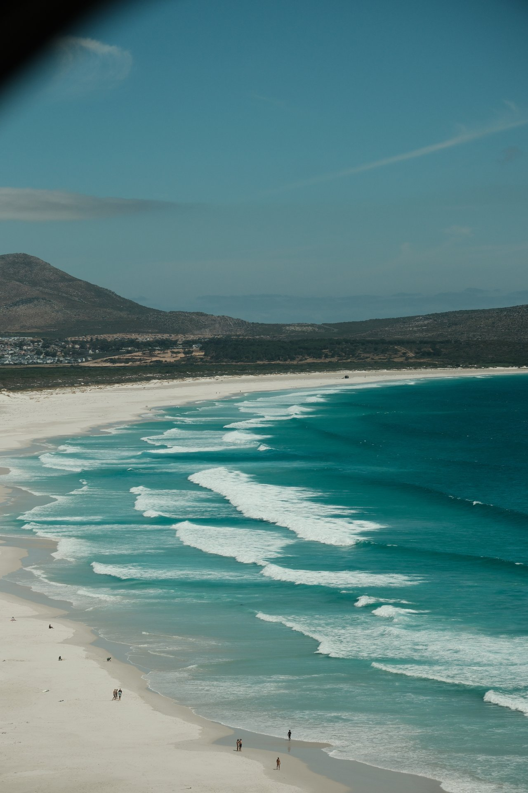

---

## Что пишут те, кто был

Ниже — разбор **пяти отчётов о самостоятельных поездках в ЮАР** из раздела отзывов о Южной Африке на форуме путешественников. Поездки состоялись с **сентября 2025 по май 2026 года**, маршруты — от трёх недель за рулём через всю страну до недели в Йоханнесбурге. Это выборка, представительной её считать нельзя: на форуме пишут люди, которые ездят самостоятельно и за рулём, и опыт пакетного туриста здесь не отражён. Цены из отчётов идут с пометкой «со слов путешественника», если официальный источник их не подтверждает.

**Что совпало у всех.** Дороги хвалят единогласно — качество покрытия, разметку, вежливость водителей. Аренда машины срабатывает даже по неименной карте банка СНГ: это описано независимо в двух отчётах, у разных прокатчиков и в разных городах. И все пятеро вернулись без происшествий, хотя готовились к худшему.

**Где отчёты расходятся — и почему.** Оценка Мёйзенберга: в одном отчёте — «не впечатлил», в другом это место, где проводят полдня. Объяснение географическое: туда едут не за видом, а за тёплой водой, и человек, у которого купание не в приоритете, разницы не поймёт.

Так же расходится оценка сафари. В отчёте, где на Крюгер отвели два дня самостоятельных выездов, вывод — «двух дней хватило». В отчёте, где взяли полный день с гидом за 2 065 рандов, — «видела большую пятёрку». Разница не в везении, а в формате: гид работает по рациям с другими машинами и знает, где утром легли кошки.

**Что нашлось нового — чего нет в официальных описаниях.**

- Наблюдение за китами схлопывается в ноябре буквально в течение месяца: начало ноября — «самый конец сезона», конец ноября — китов нет.
- Лагеря в Крюгере разбирают больше чем за три месяца; бронь за 90 дней означает выбор из остатков.
- На платных дорогах N2 и N3 иностранная карта бесполезна, нужны наличные.
- Депозит за машину могут списать дважды и вернуть только после разбирательства из дома.
- Спиртное в магазинах по выходным продают до 15:00.
- Сервис такси может запросить скан паспорта, а сдачи у водителей нет никогда.
- Чек трёхнедельной поездки на одного человека — около 450 000 ₽ со всем, включая перелёт.

**Что в отчётах читается как предупреждение.** Единственная материальная потеря на пять поездок — 300 долларов, пропавшие из сумки в отеле. Не на улице, не в машине, а в номере. Сейф в отеле — не перестраховка.

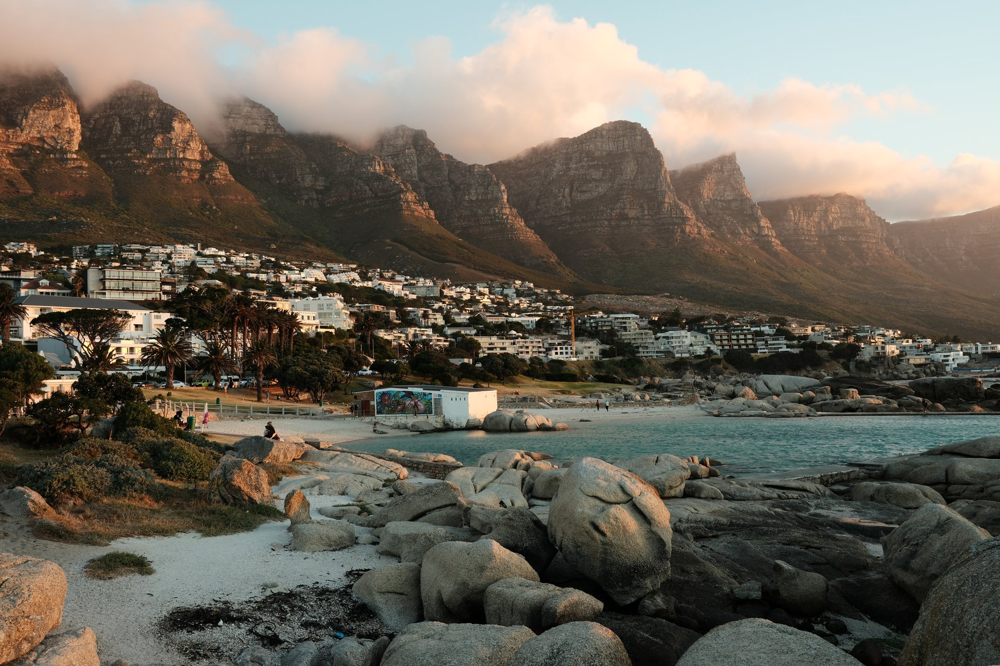

---

## Частые вопросы

**Нужна ли виза в ЮАР россиянам в 2026 году?**
Нет. В списке безвизовых стран Департамента внутренних дел ЮАР от 9 декабря 2025 года для обычных российских паспортов указано 90 дней. Годовой пометки P/A, которая есть у ряда других стран, у России нет. Виза требуется для работы, учёбы и волонтёрских программ независимо от срока.

**Что за декларация SARS и обязательна ли она туристу?**
Обязательна. С 1 июля 2026 года декларацию о вещах и валюте подают онлайн до поездки — и на въезд, и на выезд, включая детей, за которых её оформляет взрослый. Подача идёт через портал налоговой службы, приложение SATMS или QR-код на месте. Во въезде из-за неподанной декларации не откажут, но время на границе потеряете.

**Когда лучше лететь, если хочется и город, и сафари?**
Сентябрь–октябрь или март–апрель. В саванне ещё сухо и зверей видно, в Кейптауне тепло, а цены ниже новогодних. В ноябре к этому добавляются киты, но сафари в ноябре слабее.

**Можно ли купаться в океане в Кейптауне?**
На атлантической стороне вода летом около 14–18 градусов — заходят ненадолго. В бухте Фолс-Бэй, в Мёйзенберге и Саймонстауне, 17–21 градус, и там купаются нормально. Полчаса езды между берегами дают разницу в несколько градусов.

**Сколько стоит поездка в ЮАР на двоих?**
Три недели с перелётом, машиной, жильём и ресторанами — порядка 450 000 ₽ на человека по чеку из отчёта осени 2025 года. Неделя только по Кейптауну и полуострову обойдётся заметно дешевле: основные расходы там — перелёт и машина.

**Опасно ли ехать в ЮАР самостоятельно?**
Ездят и возвращаются без происшествий, но правила соблюдать надо: не заезжать в тауншипы, не передвигаться после заката, ничего не оставлять в машине на виду, вечером пользоваться такси. В пяти разобранных отчётах нападений не было ни одного, единственная потеря — деньги из сумки в отеле.

**Работают ли российские карты?**
Нет. Нужна карта иностранного банка и запас наличных долларов на обмен. Причём в национальных парках наличные не принимают: на воротах Кейп-Пойнта и Болдерса оплата только картой.

**Нужен ли внедорожник?**
Нет. Обычной легковой машины хватает и на маршрут по стране, и на грунтовые дороги Крюгера. Внедорожник нужен только для отдельных горных перевалов вроде Сани-Пасс, и туда проще взять экскурсию.

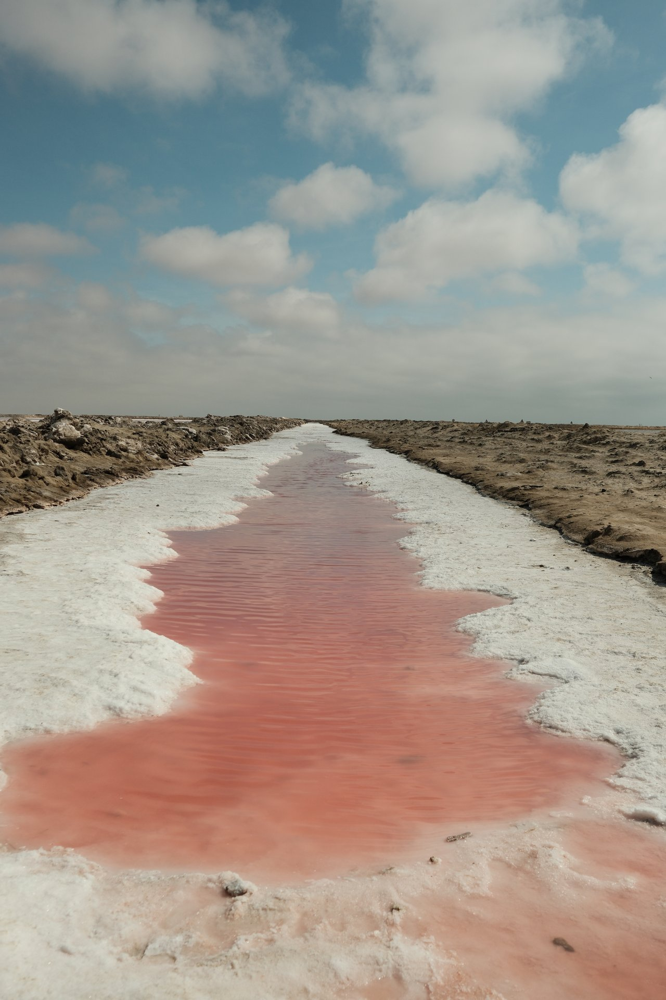

---

## Коротко о главном

ЮАР — самое доступное для россиян дальнее направление Африки: визы нет, страна дешевле Европы, инфраструктура для самостоятельной поездки развитая, а язык — английский. Взамен она требует планирования: выбрать сезон под приоритет, забронировать жильё и машину сильно заранее, завести иностранную карту и держать в голове правила безопасности.

Единственное, что изменилось в правилах въезда за последний год и что стоит сделать до вылета, — оформить онлайн-декларацию. Пять минут на сайте налоговой службы избавляют от очереди на границе.

<a href={youtravelSub('south_africa_guide_2026_bottom')} class="aff-cta" rel="sponsored">Авторские туры в ЮАР с гидом</a> маршрут, даты и состав группы видны до оплаты — вариант для тех, кто не хочет собирать логистику и садиться за руль
