import AffiliateNote from '../../components/post/AffiliateNote.astro';
import { aviasalesRoute, cherehapaCountry, airaloSub, ostrovokCountry, tpkDeep } from '../../data/affiliate.js';

Гранитные гребни Сораксана торчат из облака, как спины китов, — и облако лежит ниже вершин, а не над ними. Через два дня та же поездка упирается в бирюзовую воду под скалами Пусана, ещё через пять — в зелёный кратер Сонсан Ильчхульбон, который вырос из моря на восточном краю Чеджу. А заканчивается всё в Сеуле, где с высоты видно только стекло, зелёные крыши и разметку перекрёстков.

Четыре совершенно разные страны внутри одной, и расстояние между крайними точками — триста тридцать километров. Кадры в этой статье сняты в июле 2023 года: Сораксан 19-го, Пусан 21-го, Чеджу 26-го, Сеул 28-го. Месяц был выбран неудачно, и ниже про это честно.

> **Если коротко:** гражданам России **виза в Южную Корею не нужна** — безвизовый режим действует с 1 января 2014 года по двустороннему соглашению. Но пребывание считается по формуле, которую половина русскоязычных страниц передаёт неверно: **60 дней подряд и не больше 90 дней в течение каждых 180**. Вместо визы нужно **электронное разрешение K-ETA — 10 000 вон (≈594 ₽ по курсу ЦБ на 21.08.2026)** плюс около 3% комиссии за оплату; без него авиакомпания обязана отказать в посадке. Разрешение действует **три года**, решение приходит **обычно за 72 часа**. Освобождение от K-ETA, о котором много пишут, продлено до 31 декабря 2026 года, но касается **22 стран, и России среди них нет**. Прямых рейсов из России нет — летят через Стамбул, Дубай, Абу-Даби, Доху, Ташкент или Астану: <a href={aviasalesRoute('MOW','SEL','south_korea_visa_2026_top')} class="aff-cta" rel="sponsored">Посмотреть перелёт Москва — Сеул</a> показывает все стыковки в одной выдаче, оплата картой РФ

<AffiliateNote />

---

## Нужна ли виза в Южную Корею россиянам в 2026 году?

**Нет, не нужна.** Соглашение о взаимной отмене визовых требований подписано 13 ноября 2013 года и действует с 1 января 2014-го. Оно покрывает поездки с туристическими, транзитными и частными целями ([Посольство России в Республике Корея](https://korea-seoul.mid.ru/ru/russia-korea/korea/tourism/), сверка 21.08.2026).

Безвизовый режим не даёт права работать и учиться. Тем, кто едет на работу или в университет, визу оформляют в консульских учреждениях Республики Корея в России — это отдельная процедура, и её безвиз не заменяет.

Путаницу создаёт K-ETA. Человек читает «нужно электронное разрешение», платит за него и решает, что оформил визу. Это не виза: разрешение не даёт въезда, оно даёт право сесть в самолёт. Решение о допуске в страну принимает офицер на границе, и об этом прямо предупреждает и корейская сторона, и российское посольство.

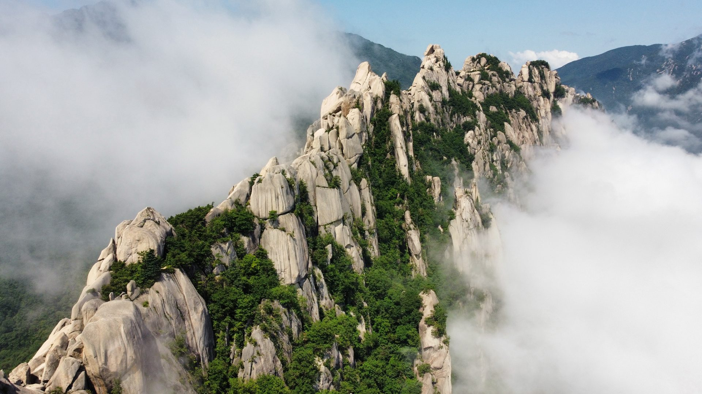

## Что такое K-ETA и почему без него не пустят на рейс

K-ETA — электронное разрешение на въезд, работает с 1 сентября 2021 года. Заявление подаётся заранее, до вылета: указываете данные паспорта, контакты, цель поездки и адрес проживания, загружаете фото и платите сбор.

Ключевая деталь, из-за которой люди попадают: **без разрешения авиакомпания обязана отказать пассажиру в посадке**. То есть проблема наступает не на границе Кореи, а на стойке регистрации в Москве или Стамбуле — когда билет куплен, отель оплачен, а лететь нельзя.

У разрешения есть и приятная сторона. Тем, кто его оформил, не нужно заполнять бумажную карточку прибытия — этим объясняется, почему граждане освобождённых стран иногда подают заявление добровольно, хотя обязанности нет.

**Подавать через посредников не нужно.** На главной странице ведомство предупреждает: заявление принимают только на `www.k-eta.go.kr` и в приложении K-ETA, а сайты, обещающие «ускоренное оформление» за отдельные деньги, — это перепродажа государственной услуги. Сбор там же назван прямо: около 7–8 долларов.

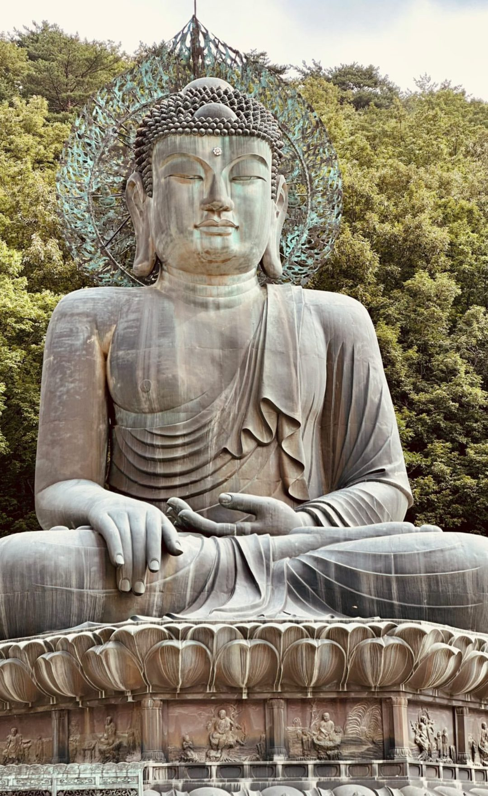

## Сколько можно пробыть в стране: 60 подряд и 90 из 180

Вот здесь и живёт главная ошибка русскоязычных страниц. В официальном списке стран на сайте K-ETA напротив России стоит формулировка Министерства юстиции Республики Корея: **«60 days in a row, not exceeding 90 days within 180 days»** — 60 дней подряд, не более 90 дней в течение 180 ([список стран и сроков](https://www.k-eta.go.kr/portal/guide/viewetaalification.do), сверка 21.08.2026).

Посольство России формулирует то же самое другими словами: 60 дней плюс возможность въехать дополнительно на 30 дней, а суммарно — не больше 90 дней в течение 180.

Разница с расхожим «до 90 дней» принципиальная, и стоит она депортации. Человек, прочитавший «90 дней», планирует трёхмесячную зимовку одним заездом — и нарушает правило на тридцатый день сверх шестидесятого. Тот, кто прочитал «до 60 дней» и на этом успокоился, наоборот, не знает про второй потолок и попадается на втором визите.

**Окно в 180 дней скользящее.** Выезд из страны счётчик не обнуляет: на границе берут дату въезда, отматывают 180 суток назад и складывают все дни, проведённые в стране за этот период.

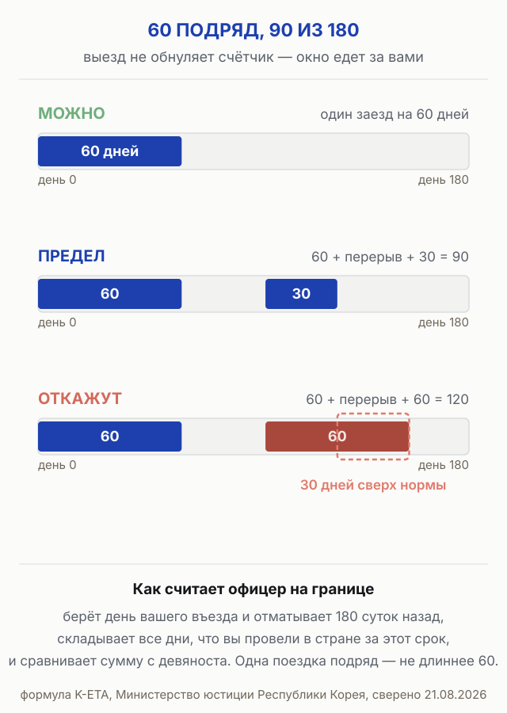

Отдельно к сроку паспорта: он должен оставаться действительным дольше, чем срок вашего пребывания, с запасом в шесть месяцев.

## Кому K-ETA не нужен

Перечень освобождённых ведомство обновило 11 июня 2026 года. Разрешение не требуется:

- **детям 17 лет и младше и людям 65 лет и старше** — возраст считают на дату въезда в страну. Правило работает с 3 июля 2023 года;
- **транзитным пассажирам** — но с двумя оговорками: разрешение понадобится, если вам придётся войти в страну из-за смены маршрута, пункта назначения или расписания, а также если нужно получить зарегистрированный багаж;
- **владельцам действующей корейской визы** и иностранцам, зарегистрированным в стране;
- **обладателям дипломатических и служебных паспортов** — с 9 января;
- **членам экипажей** воздушных и морских судов, включая сменные;
- **владельцам карт АТЭС** (APEC Business Travel Card) и паспорта ООН;
- **пассажирам круизных лайнеров**.

Семья с ребёнком и бабушкой платит, таким образом, только за взрослых среднего возраста. На троих — родители и ребёнок десяти лет — сбор выйдет за двоих.

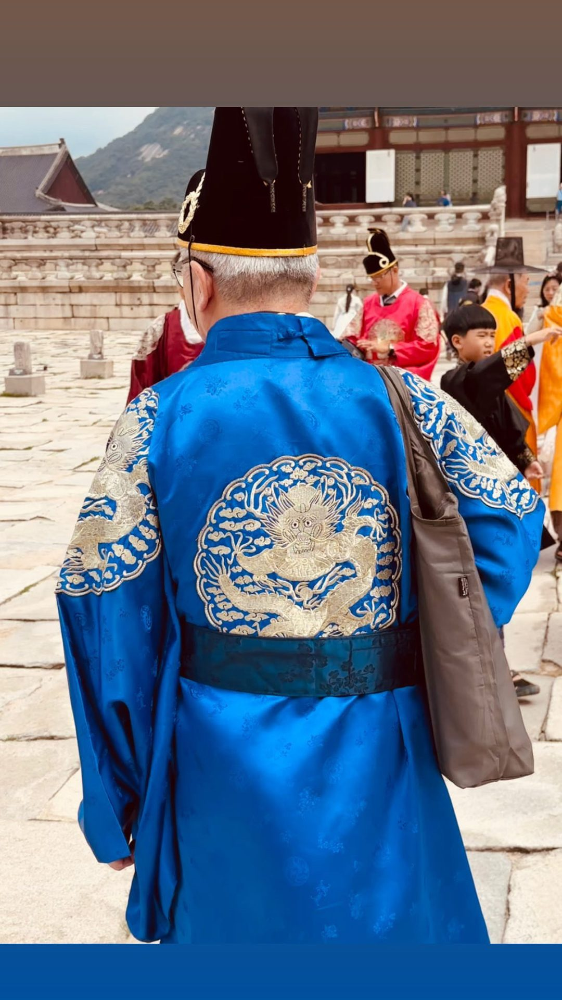

### Про «освобождённые страны» — почему это не про нас

В выдаче часто попадается новость: Корея отменила K-ETA, оформлять ничего не надо. Новость настоящая, но читают её невнимательно.

Временное освобождение введено к «Годам посещения Кореи» и продлено ещё на год — **до 31 декабря 2026 года**. Оно накрывает **22 страны и территории**: Япония, Тайвань, Гонконг, Сингапур, Макао, США с Гуамом, Канада, Великобритания, Германия, Франция, Италия, Нидерланды, Испания, Польша, Швеция, Финляндия, Норвегия, Бельгия, Дания, Австрия, Новая Зеландия и Австралия.

**России в этом списке нет.** В том же документе Россия перечислена в противоположном приложении — среди стран, к которым K-ETA применяется ([список генконсульства Республики Корея](https://overseas.mofa.go.kr/us-newyork-ko/brd/m_4237/view.do?seq=1347695), сверка 21.08.2026). Проверить себя можно и на самом сайте: если ваша страна освобождена, при подаче заявления после сканирования паспорта выскакивает окно «K-ETA не требуется».

Косвенное подтверждение — русская версия официального сайта: в её ленте объявлений этого сообщения о продлении нет вовсе, оно есть только в корейской.

## Сколько стоит K-ETA и чем за него платить

Государственный сбор — **10 000 южнокорейских вон с человека**, это ≈594 ₽ по курсу ЦБ на 21.08.2026. Ведомство само оценивает его в 7–8 долларов.

Дальше начинается то, о чём почти не пишут:

- **сверху берут комиссию за онлайн-оплату, около 3%** — это указано на странице сбора отдельным пунктом;
- **сбор не возвращают** независимо от решения: отказали — деньги остались у ведомства;
- принимают **Visa, Mastercard, JCB, AMEX, Diners Club, DISCOVER, UnionPay и Alipay+**, и на той же странице сказано: если международные транзакции по вашей карте заблокированы, оплата не пройдёт.

Последний пункт для россиян и есть главная практическая засада. Карты Visa и Mastercard российских банков международные платежи не проводят, поэтому запасной вариант — карта иностранного эмитента, в том числе карта родственника или знакомого за границей. Это не запрещено: система привязывает разрешение к паспорту заявителя, а не к плательщику. Отдельный случай — российские карты UnionPay: они в списке принимаемых систем есть, и оплата ими из России проходит, хотя и не у всех — [что об этом пишут те, кто платил](#что-пишут-те-кто-уже-оформлял-k-eta).

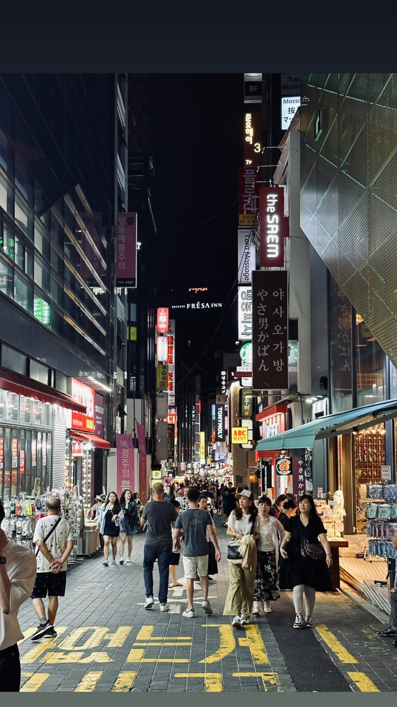

## Как подать заявление и сколько ждать

Порядок простой, и растягивать его на неделю смысла нет — но и оставлять на последний вечер нельзя.

**Решение приходит обычно в течение 72 часов.** Это официальная формулировка, и она означает «обычно», а не «гарантированно». Разумный запас — подать заявление за неделю-полторы до вылета.

Что понадобится: действующий загранпаспорт, рабочий адрес электронной почты, фотография лица и карта для оплаты. Заявление можно подать как зарегистрированный пользователь или без регистрации — сбор, время рассмотрения и срок действия разрешения в обоих случаях одинаковые; регистрация лишь позволяет проверять результат без подтверждения по почте.

**Разрешение действует три года.** С 3 июля 2023 года срок увеличили с двух лет до трёх; если паспорт истекает раньше — до даты паспорта. В течение этого срока при новых поездках подавать заявление заново не нужно.

Здесь стоит отметить расхождение внутри официальных источников: страница российского посольства в разделе про K-ETA всё ещё пишет «разрешение выдаётся на два года», а несколькими абзацами выше в том же тексте — «срок действия разрешения — 3 года». Верно второе: увеличение срока объявлено отдельным приказом Министерства юстиции Республики Корея. Ту же страницу стоит читать с поправкой и в другом месте — она сообщает о действующем масочном режиме в помещениях, а это давно не так.

При смене паспорта разрешение надо оформлять заново — старое привязано к прежнему документу.

## Что спросят на границе

Безвизовый режим освобождает от визы, но не гарантирует въезда — эту мысль российское посольство повторяет трижды подряд, и не зря.

Иммиграционная служба вправе потребовать подтверждение цели визита: **деньги на срок поездки, бронь жилья, обратный билет, контакты принимающей стороны и гарантийные письма**. Если по итогам опроса офицер не сочтёт цель туристической, во въезде откажут — по статье 8 того самого безвизового соглашения такое право у корейской стороны есть.

Отказ в аэропорту устроен жёстко: пассажира передают перевозчику, и тот отправляет его обратно ближайшим своим рейсом.

Ещё две вещи, которые стоит знать заранее. С 1 января 2012 года все иностранцы старше 17 лет проходят **дактилоскопию и распознавание лица** во всех аэропортах и морских портах. А тем, кто въехал без визы и попался на работе, грозит депортация с запретом на въезд **не менее чем на пять лет**.

Страховка на въезде не требуется, но её отсутствие — отдельный риск: медицинская помощь иностранцу платная, а безвизовый статус никаких гарантий по её оплате не даёт. На что смотреть в полисе, кроме цены, — в [разборе туристических страховок](/blog/strahovka-dlya-puteshestviy-2026/). <a href={cherehapaCountry('south-korea','south_korea_visa_2026_ins')} class="aff-cta" rel="sponsored">Подобрать полис в Южную Корею</a> сравнивает предложения российских страховщиков, оплата картой РФ, полис приходит в PDF

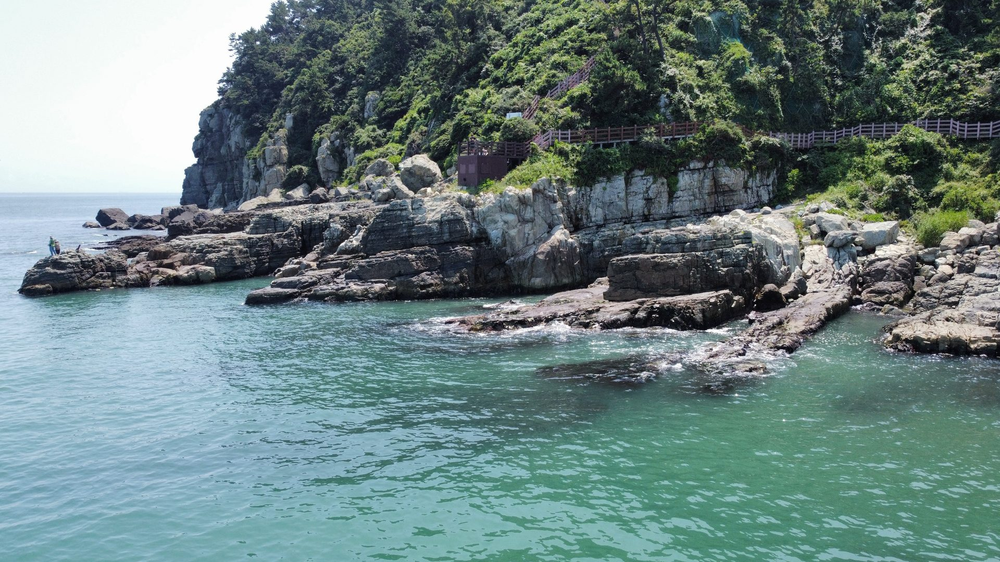

## Что можно и нельзя ввозить

Нормы беспошлинного ввоза корейская сторона держит скромными, а декларацию требует со всех.

| Что | Норма |
|---|---|
| Товары общей стоимостью | до $600 (≈49 800 ₽) |
| Алкоголь | 1 литр, одной бутылкой — две по 0,5 л не примут |
| Сигареты | 200 штук |
| Табак | 250 граммов |
| Парфюмерия | 2 унции (≈56,6 г) |
| Валюта без декларации | до $10 000 (≈830 000 ₽) |

Декларацию заполняет **каждый пассажир**, даже если идёт «зелёным коридором». Бланки на русском языке выдают в самолёте.

Сверх нормы придётся платить: применяется упрощённая ставка пошлины от 20 до 55%, и принимают только воны — картой таможенные платежи не оплатить.

Отдельно про еду, на которой попадаются чаще всего. **Нельзя ввозить мясные и молочные продукты**, включая колбасы, копчёности и сыры; свежие фрукты, черенки и саженцы; рыбную продукцию и икру вне специальной жестяной упаковки. Багаж сканируют ещё до выдачи, и на сумку с запрещённым вешают цветной замок: зелёный — нарушение карантинных правил, оранжевый — товары животного происхождения, жёлтый — то, за что надо платить, красный — оружие и наркотики.

## Как добраться: прямых рейсов нет

**Прямое авиасообщение между Россией и Республикой Кореей приостановлено.** Долететь можно транзитом — посольство перечисляет маршруты через Стамбул, Дубай, Абу-Даби, Доху, Ташкент и Астану.

Разговоры о возобновлении идут не первый год, и ни даты, ни перевозчика пока никто не назвал. Планировать поездку стоит от стыковочного маршрута, а появление прямого рейса считать приятной неожиданностью, а не расчётом.

Работает и морской путь: **паромная линия Владивосток — Тонхэ**, билеты на российской стороне продаёт агентство во Владивостоке. Для тех, кто живёт на Дальнем Востоке, это отдельный сценарий поездки.

Про цены честно: витринное «от» у стыковочных маршрутов почти всегда приходится на неудобные даты с долгой пересадкой и на низкий сезон. Осенью, в самый популярный для поездки месяц, реальная стоимость перелёта заметно выше минимума, который показывает первая строка поиска. <a href={aviasalesRoute('MOW','SEL','south_korea_visa_2026_fly')} class="aff-cta" rel="sponsored">Сравнить стыковки Москва — Сеул на ваши даты</a> сравнивает варианты через Стамбул, Дубай и Доху, показывает общее время в пути

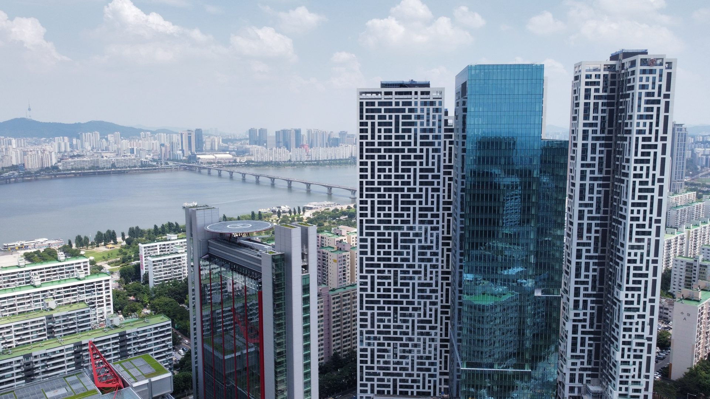

## Когда ехать и чем плох июль

Сезон дождей в Корее называется чанма. Метеослужба страны определяет его так: продолжительные обильные дожди **с конца июня до конца июля**, вызванные чанма-фронтом ([Корейское метеорологическое управление](https://data.kma.go.kr/climate/rainySeason/selectRainySeasonList.do), сверка 21.08.2026).

Кадры в этой статье — ровно этот период, 19–28 июля. Отсюда и облако, лежащее ниже гребней Сораксана, и сухое каменное русло под мостом, которое в дождь превращается в поток. Горы в такую погоду выглядят драматично, но планировать по ним поездку — так себе идея: видимость непредсказуема, тропы мокрые, а влажность выматывает.

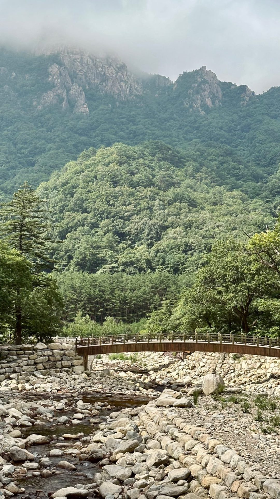

Второй риск — тайфуны, и здесь у метеослужбы есть точные числа. По норме за 1991–2020 годы Кореи достигают **3,4 тайфуна в год**, и распределены они крайне неровно ([статистика тайфунов Корейского метеорологического управления](https://www.weather.go.kr/w/hazard/typhoon/stat.do), сверка 21.08.2026):

| Месяц | Тайфунов достигает Кореи (норма) |
|---|---|
| июнь | 0,3 |
| июль | 1,0 |
| август | **1,2** |
| сентябрь | 0,8 |
| октябрь | **0,1** |
| весь остальной год | 0 |

Три тайфуна из трёх с половиной приходятся на июль, август и сентябрь. В октябре — одна десятая, то есть один тайфун примерно раз в десять лет. Это и есть главный довод за осень: не «красивая листва», а метеорологическая статистика.

Логика выбора месяца получается такая:

- **конец июня — конец июля** — сезон дождей по определению метеослужбы, самый неудачный отрезок для гор;
- **август — сентябрь** — пик тайфунов, 2,0 из 3,4 годовых;
- **октябрь — ноябрь** — тайфуны почти исчезают, дожди позади: лучший отрезок для поездки, на него же приходится осенняя листва в горах;
- **декабрь — февраль** — зима, самый малолюдный сезон;
- **апрель — май** — цветение, вторая по спросу часть года.

Про осеннюю листву важная оговорка: точные даты по годам сдвигаются, и датам, которые гуляют по блогам заранее, верить не стоит. На 21 августа 2026 года прогноза на этот год метеослужба не публиковала.

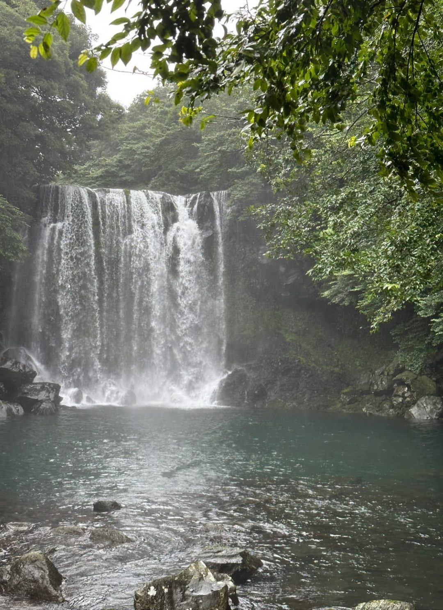

## Сценарии поездок: пять маршрутов

Страна компактная. Материк проходится с севера на юг за один день пути, и это меняет логику планирования: вместо одной базы разумно взять две-три.

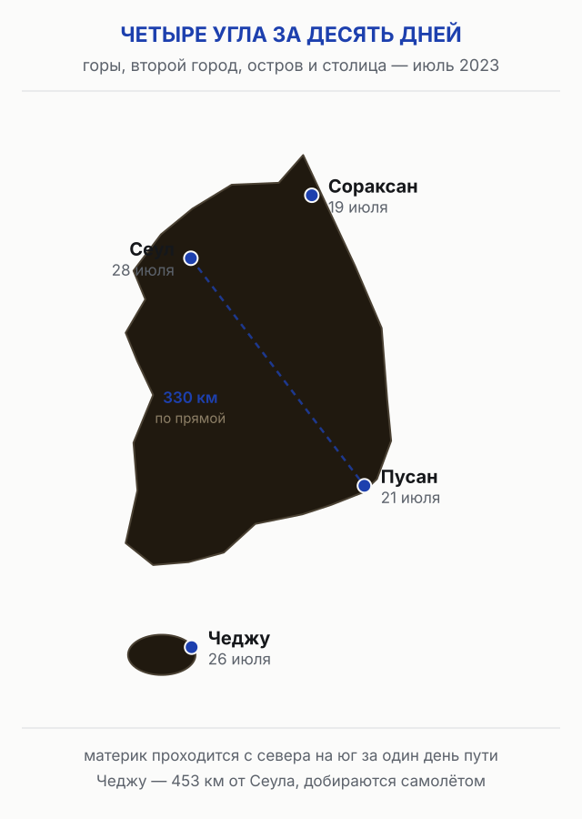

**1. Только Сеул, 4–5 дней.** Дворцы, рынки, ночные кварталы, музеи, поездка в демилитаризованную зону на день. Минус: страна остаётся непонятой — Сеул похож на любую большую азиатскую столицу больше, чем на Корею.

**2. Сеул плюс Сораксан, 6–7 дней.** Столица и национальный парк на восточном побережье. Минус: горы требуют погоды, и в неудачную неделю гребней вы не увидите вовсе.

**3. Сеул — Пусан по железной дороге, 7–9 дней.** Две трети населения страны и два совершенно разных города: столица со стеклом и второй город с пляжами, рыбным рынком и скалами над морем. Минус: между ними остаётся пропущенная середина — Кёнджу с гробницами и храмами.

**4. Материк плюс Чеджу, 10–12 дней.** Добавляет вулканический остров с кратерами, водопадами и другим климатом. Минус: перелёт съедает день в каждую сторону, а погода на острове живёт по своим правилам.

**5. Осенний маршрут по горам, 10–14 дней.** Сораксан, Одэсан, Чирисан — с конца сентября по ноябрь. Минус: самый дорогой и загруженный сезон, жильё у парков разбирают заранее.

| Сколько дней | Что складывается |
|---|---|
| 4–5 | Сеул и один выезд за город |
| 6–7 | Сеул плюс горы или Сеул плюс Кёнджу |
| 7–9 | Сеул — Кёнджу — Пусан по железной дороге |
| 10–12 | Материк плюс Чеджу |
| 14 | Материк, Чеджу и горный маршрут без спешки |

Если планировать самому не хочется, готовые программы по стране продаются пакетом — с перелётом, отелями и экскурсиями в одном заказе. <a href={tpkDeep('travelata','https://travelata.ru/','south_korea_visa_2026_tour')} class="aff-cta" rel="sponsored">Посмотреть готовые туры в Южную Корею</a> пакет с перелётом и отелем, подтверждение брони онлайн, оплата картой РФ

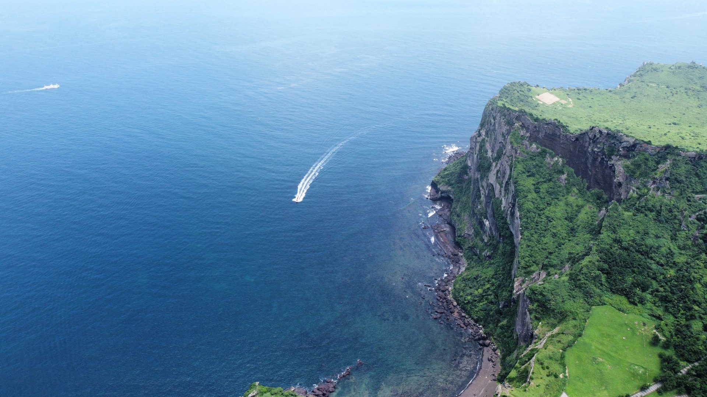

## Сколько стоит поездка

Точные цифры по жилью и еде зависят от сезона и города, и обещать одно число на всю страну было бы враньём. Что стоит держать в голове:

- **перелёт** — главная статья, и она же самая волатильная: стыковочный маршрут в высокий осенний сезон стоит заметно дороже витринного минимума;
- **жильё** — в центре столицы дороже всего, у станций подземки в паре остановок от центра заметно дешевле;
- **транспорт внутри страны** — скоростная железная дорога связывает крупные города, для острова Чеджу нужен самолёт;
- **еда** — уличная и в закусочных недорогая, в ресторанах в центре столицы сопоставима с московскими ценами.

Отдельная статья, о которой забывают: **сбор K-ETA платится один раз на три года**, и при повторной поездке в этот срок его платить не нужно.

<a href={ostrovokCountry('south-korea','south_korea_visa_2026_stay')} class="aff-cta" rel="sponsored">Подобрать жильё в Южной Корее</a> поиск по стране с фильтром по районам и датам, оплата картой РФ, бесплатная отмена у части отелей

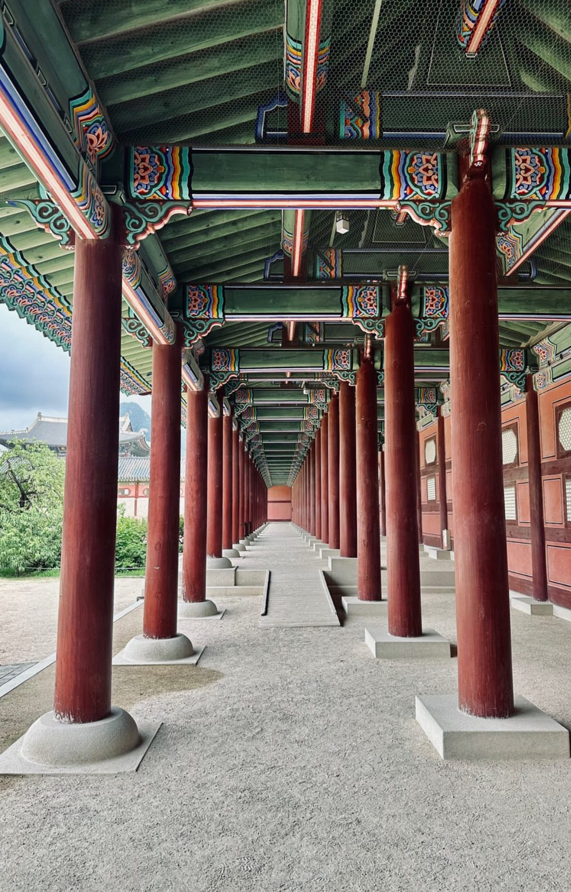

## Связь и деньги на месте

**Связь.** eSIM разумнее подключить ещё до вылета: интернет заработает сразу по прилёту, до того как вы найдёте стойку с местными симкартами и разберётесь с роумингом. Как это устроено технически и чем отличаются тарифы, разобрано отдельно в [обзоре eSIM для поездок за границу](/blog/esim-zagranicey-2026/). <a href={airaloSub('south_korea_visa_2026')} class="aff-cta" rel="sponsored">Купить eSIM для Южной Кореи</a> пакеты на несколько гигабайт, подключается до вылета, работает в аэропорту

**Деньги.** Карты российских банков в Корее не принимают — Visa и Mastercard не работают из-за санкций, UnionPay в местных терминалах ходит плохо и рассчитывать на неё не стоит. Наличные меняют в банках и обменниках, крупные покупки удобнее закрывать картой иностранного банка. Стоит помнить и про таможенный порог: сумму свыше $10 000 нужно декларировать.

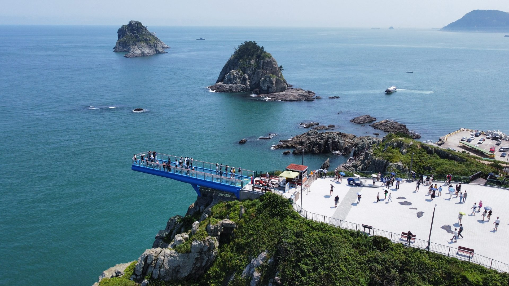

## Что пишут те, кто уже оформлял K-ETA

Разобрал 382 сообщения за 2025–2026 годы из ветки об опыте подачи на форуме Винского — это последние восемь страниц темы, а не вся она, поэтому представительной выборку считать нельзя. Но четыре вещи в ней повторяются у разных людей, и ни одной из них нет в официальной инструкции.

**Отказ приходит из-за нуля в номере паспорта.** Система сама считывает скан и подставляет данные в поля, и на этом шаге путает цифру «0» с буквой «O». Самый наглядный случай — пара, подавшая две анкеты в один день 13 августа 2025 года: жене одобрение пришло через час, мужу вечером отказ с формулировкой про неверный номер паспорта, хотя номер был верный. Разница между анкетами была только в паспорте. Когда номер исправили вручную и подали заново, разрешение выдали. Это стоит знать ещё и потому, что на форуме ходит поверье, будто после первого отказа все следующие заявления отклоняют автоматически: здесь оно не подтвердилось.

**Загранпаспорт старого образца — источник почти всех технических жалоб, но уже прошлогодних.** Все 19 упоминаний пятилетнего паспорта приходятся на 2025 год, в сообщениях 2026 года их нет ни одного. Пик пришёлся на 14–17 марта 2025 года, когда сервис несколько дней подряд не принимал такие сканы с ошибкой распознавания, а 18 марта заработал. Обход, который тогда сработал у одного из участников ветки, — отсканировать страницу не камерой в приложении, а заметками на айфоне.

**Российской картой UnionPay сбор проходит чаще, чем не проходит.** Пятеро написали, что оплатили ею, не выезжая из страны, — в основном картами Россельхозбанка; двое, наоборот, оплатить не смогли. Упирается всё в одно и то же место: на шаге оплаты нужно смс с кодом подтверждения, и оно не приходит. У одного участника проблема решилась включением VPN — с ним код дошёл и платёж прошёл. UnionPay действительно есть в официальном списке принимаемых систем, так что запрета здесь нет, но и гарантии тоже: запасную карту иностранного банка стоит держать наготове.

**Решение чаще всего приходит в тот же час, а не за 72.** Про одобрение в пределах часа пишут в 23 сообщениях — это самый частый сценарий в ветке. Официальные трое суток остаются верхней границей, на которую и нужно закладываться, но ожидание обычно оказывается короче.

## Частые вопросы

**Нужна ли виза в Южную Корею россиянам в 2026 году?**
Нет. Безвизовый режим действует с 1 января 2014 года для туристических, транзитных и частных поездок. Виза нужна тем, кто едет работать или учиться.

**Сколько можно находиться в стране без визы?**
60 дней подряд и не больше 90 дней в течение каждых 180. Выезд счётчик не обнуляет.

**Обязателен ли K-ETA для россиян?**
Да. Россия входит в перечень стран, к которым K-ETA применяется, и не входит в список 22 стран, освобождённых от него до 31 декабря 2026 года.

**Сколько стоит K-ETA и на какой срок он выдаётся?**
10 000 вон (≈594 ₽ по курсу ЦБ на 21.08.2026) плюс около 3% комиссии за онлайн-оплату. Разрешение действует три года или до конца срока паспорта.

**Нужен ли K-ETA ребёнку и пожилому человеку?**
Нет. Дети 17 лет и младше и люди 65 лет и старше освобождены — возраст считают на дату въезда.

**Нужен ли K-ETA на пересадке в Сеуле?**
Транзитные пассажиры освобождены, но разрешение понадобится, если придётся войти в страну из-за смены маршрута или расписания либо чтобы забрать зарегистрированный багаж.

**Есть ли прямые рейсы из России?**
Нет, авиасообщение приостановлено. Летают транзитом через Стамбул, Дубай, Абу-Даби, Доху, Ташкент и Астану; работает паром Владивосток — Тонхэ.

**Сколько денег можно ввезти без декларации?**
До $10 000 (≈830 000 ₽). Товары — на сумму до $600 (≈49 800 ₽).

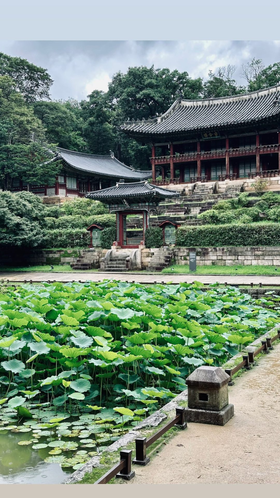

## Короткий план

1. Проверить, попадаете ли вы в число освобождённых от K-ETA: дети до 17 включительно и люди от 65 лет разрешение не оформляют.
2. Приготовить карту для сбора: российская UnionPay проходит не всегда, поэтому запасной вариант — карта иностранного банка.
3. Подать заявление на `www.k-eta.go.kr` за неделю-полторы до вылета, а не накануне: решение приходит обычно за 72 часа.
4. Посчитать срок поездки по формуле «60 подряд, 90 из 180», а не по расхожему «до 90 дней».
5. Собрать то, что могут спросить на границе: обратный билет, бронь жилья, деньги на поездку. Остальное — по [списку вещей в Южную Корею](/packing/south-korea/), он учитывает месяц поездки и погоду.
6. Выбрать месяц с оглядкой на чанма: конец июня — конец июля лучше пропустить.

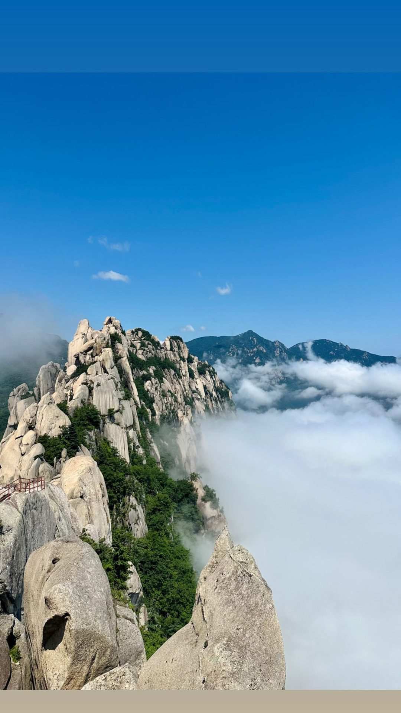

Формальности здесь занимают один вечер и 594 рубля, а всё остальное время уходит на выбор месяца и маршрута. И если из статьи стоит унести одну цифру — пусть это будет не сбор, а **60 дней подряд и 90 из 180**: именно эта формула, а не «до 90 дней», решает, пустят ли вас во второй раз.

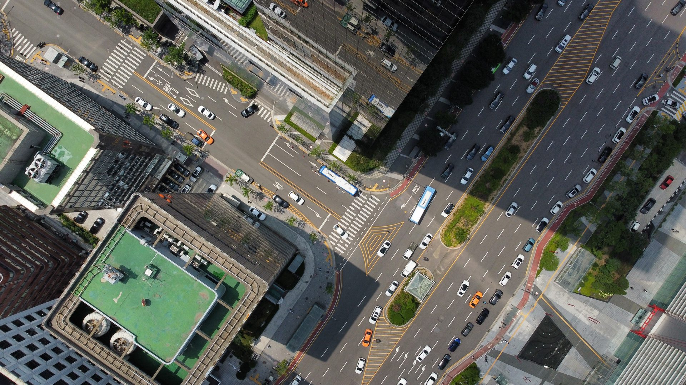

*Снимки в статье — свои, из поездки по Корее в июле 2023 года: Сораксан, Сеул, Пусан и Чеджу. Правила въезда с тех пор изменились, поэтому текст собран по действующим документам ведомств, а не по памяти; даты сверок указаны в карточке статьи.*
