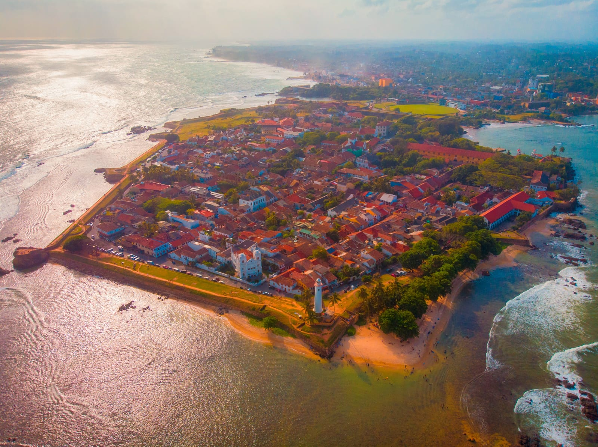
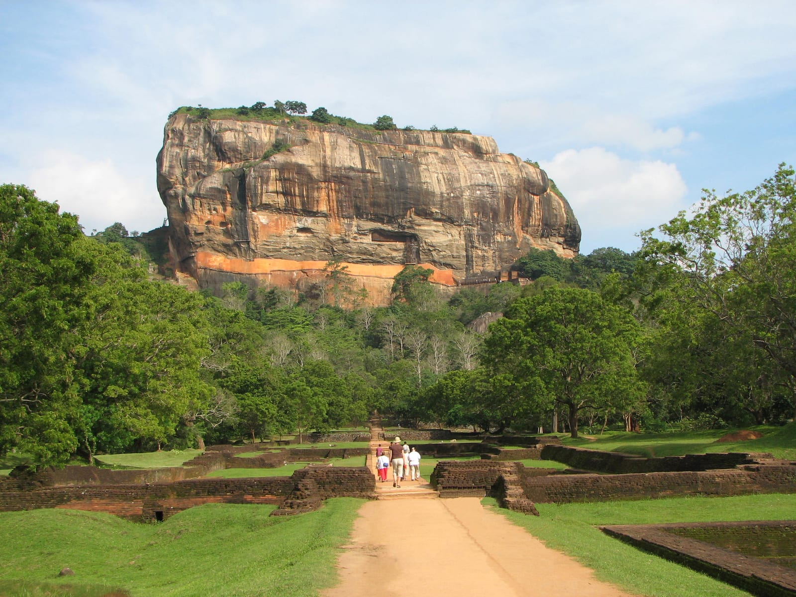
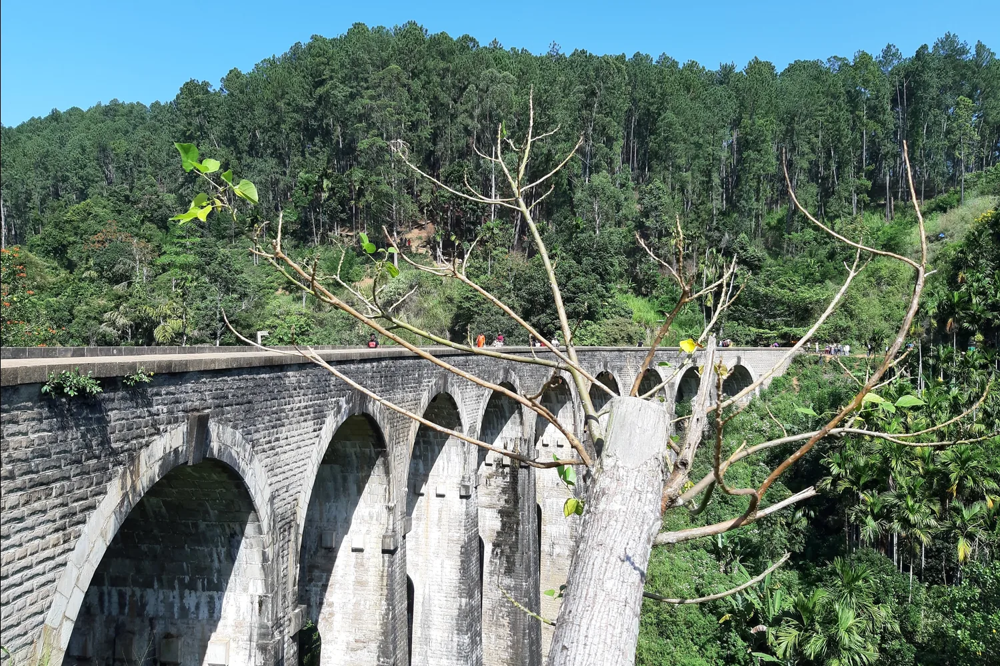
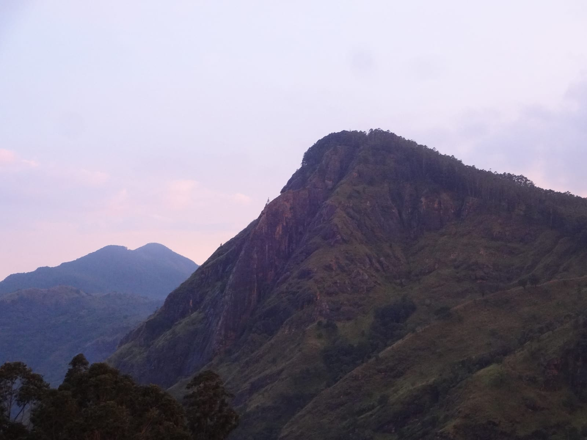
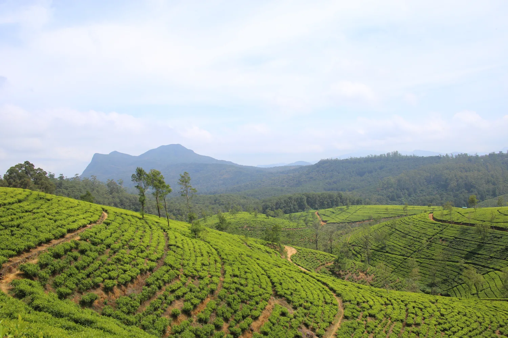

import PricingCards from '../../components/post/PricingCards.astro';
import AffiliateNote from '../../components/post/AffiliateNote.astro';
import CountryMap from '../../components/CountryMap.astro';

Шри-Ланка — редкий случай, когда небольшой остров даёт сразу всё: океан с сёрфом и китами, горы в чайных плантациях, руины древних столиц, слонов и леопардов в национальных парках. Плюс для россиян тут два жирных бонуса: **виза бесплатная** и есть **прямой рейс из Москвы**.

Главная же путаница со Шри-Ланкой не про визу и не про деньги, а про погоду. Люди читают «сезон дождей» и отменяют поездку — хотя на острове **два разных муссона**, и когда льёт на одном берегу, на другом сухо и солнечно. Разберу по делу: что с визой, когда и куда лететь, сколько это стоит и какой маршрут собрать.

> **Если коротко:** россиянам нужна **ETA — электронное разрешение**, его оформляют заранее на [eta.gov.lk](https://www.eta.gov.lk/). Для граждан России туристическая **ETA бесплатная, на 30 дней, с правом двойного въезда**. Прямой рейс **Москва — Коломбо у Аэрофлота идёт около 8 ч 30 мин**. На острове **два муссона**: с середины ноября по апрель едут на **юг и запад**, с мая по сентябрь — на **восток**. Пакетный тур из Москвы стартует от **111 458 ₽ за 7 ночей**, самостоятельно чаще выходит дешевле. Лучший способ увидеть остров — не сидеть в отеле, а проехать связку Сигирия — Канди — Элла — Яла — юг. <a href="https://aviasales.tpk.mx/JCSPlC17?erid=2Vtzqxkn4LF&sub_id=sri_lanka_2026&u=https%3A%2F%2Fwww.aviasales.ru%2F%3Forigin_iata%3DMOW%26destination_iata%3DCMB" class="aff-cta" rel="sponsored">Посмотреть билеты Москва — Коломбо</a>

<AffiliateNote />

## Нужна ли виза на Шри-Ланку россиянам в 2026?

**Виза нужна, но она бесплатная: россияне оформляют туристическую ETA — электронное разрешение на въезд — на 30 дней, и в эти 30 дней разрешён двойной въезд.** Это официальная информация портала [eta.gov.lk](https://www.eta.gov.lk/): граждане России входят в список из 40 стран, которым туристическая ETA выдаётся без сбора.

Что здесь важно понять правильно:

- **Визы по прилёте не существует.** Официальный портал формулирует прямо: разрешение обязаны получить **до прибытия** в страну и только онлайн. Без готового ETA вас не посадят на рейс ещё в России, поэтому «оформлю в аэропорту» — нерабочий план.
- **Двойной въезд** — приятная деталь, о которой мало пишут: в течение 30-дневного срока можно выехать с острова и вернуться, не оформляя ничего заново. Удобно, если совмещаете Шри-Ланку с Мальдивами или Индией.
- **ETA — туристическая.** Работать или вести бизнес по ней нельзя.

Оформление простое: заявка на официальном сайте, скан или фото загранпаспорта и цветная фотография в электронном виде. Подтверждение обычно приходит за 15–20 минут, но закладывать «оформлю в такси по дороге в аэропорт» — плохая идея: сайт может тормозить, а без подтверждения на посадку не пустят.

⚠️ **Отдельно про сайты-двойники.** В выдаче полно посредников, которые берут за «помощь с бесплатной визой» вполне реальные деньги. Официальный портал один — `eta.gov.lk`. Правила въезда меняются, поэтому перед поездкой сверяйтесь с ним же, а не со статьями (включая эту).

---

## Сколько лететь до Шри-Ланки и сколько стоит билет?

**Прямой рейс Аэрофлота Москва — Коломбо идёт около 8 часов 30 минут — это самый быстрый способ попасть на остров.** Прилетают в главный аэропорт страны — Бандаранаике (код CMB), он в 35 км севернее Коломбо.

Варианты добраться:

| Как | Время в пути | Замечание |
|---|---|---|
| Прямой Аэрофлот из Москвы | ~8 ч 30 мин | Быстрее всего, мест ограниченно |
| Стыковка через Дубай / Доху / Абу-Даби | от ~12–14 ч | Обычно дешевле, много рейсов |
| Стыковка через Стамбул | от ~13 ч | Удобно из регионов России |

Цены на билеты колеблются сильно — от сезона, глубины бронирования и того, прямой рейс или со стыковкой. Конкретную сумму приводить не буду: она меняется каждую неделю, и любая цифра в статье устареет раньше, чем вы её прочитаете. Правильнее посмотреть живые цены на свои даты — <a href="https://aviasales.tpk.mx/JCSPlC17?erid=2Vtzqxkn4LF&sub_id=sri_lanka_2026&u=https%3A%2F%2Fwww.aviasales.ru%2F%3Forigin_iata%3DMOW%26destination_iata%3DCMB" class="aff-cta" rel="sponsored">Сравнить билеты Москва — Коломбо</a> и включить отслеживание цены, если поездка не горит.

Практическое: перелёт длинный и прилетает часто ночью или рано утром. Трансфер до отеля лучше заказать заранее — торговаться с таксистами в четыре утра после девяти часов в самолёте удовольствие ниже среднего.

---

## Почему на Шри-Ланке два сезона и когда ехать?

**На острове два муссона, которые приходят в разное время и бьют по разным берегам, поэтому «сезон дождей на Шри-Ланке» — бессмысленная фраза: всегда есть побережье, где сухо.** Это ключ ко всей поездке.

- **Юго-западный муссон (Yala)** — примерно с мая по сентябрь. Заливает юго-запад: Коломбо, Галле, Бентоту, Хиккадуву, Матару.
- **Северо-восточный муссон (Maha)** — примерно с октября по январь. Заливает север и восток.

Отсюда простое правило выбора:

| Когда едете | Куда ехать | Что там |
|---|---|---|
| Середина ноября — апрель | **Юг и запад** | Унаватуна, Мирисса, Хиккадува, Бентота, Галле |
| Май — сентябрь | **Восток** | Тринкомали, Аругам-Бэй, Пассекудах |

Пик европейского сезона — с декабря по март на юго-западе: сухо, солнечно, океан спокойнее. Это же и самое дорогое время, особенно новогодние даты. Апрель — переходный месяц: ещё хорошо, но уже жарче и влажнее.

Про горы отдельно: в центральной части (Канди, Нувара-Элия, Элла) прохладнее, чем на побережье, — там высота. Вечером в Нувара-Элии реально холодно, тёплая кофта нужна даже в «пляжную» поездку. Дожди в горах могут случиться в любой месяц, обычно короткие.

---

<CountryMap slug="sri-lanka" countryNom="Шри-Ланка" />

## Где лучше отдыхать: юг, запад или восток?

**Большинство первых поездок — это юго-западное побережье в сезон с ноября по апрель: там больше всего отелей, кафе, школ сёрфинга и понятной инфраструктуры.** Коротко по местам:

- **Унаватуна** — бухта с относительно спокойной водой, много кафе, популярна у семей и тех, кто хочет «море под боком».
- **Мирисса** — сёрф, ночная жизнь попроще и главное — отсюда выходят катера смотреть китов (сезон примерно с декабря по апрель).
- **Хиккадува** — сёрф и тусовка, кораллы у берега.
- **Бентота** — крупные отели, водные развлечения, ближе к аэропорту.
- **Галле** — не пляж, а старый город-крепость колониальных времён; заезжают на день ради атмосферы.
- **Тангалле** — тише и малолюднее, для тех, кто устал от толп.

**Восточное побережье** — другая история и другой сезон (май–сентябрь). Тринкомали известен пляжами и дайвингом, Аругам-Бэй — один из лучших сёрф-спотов Азии в свой сезон. Инфраструктуры меньше, зато и людей меньше.

Про океан честно: Шри-Ланка — это **открытый океан, а не спокойное море**. Волна, течения и подводные камни есть на многих пляжах. Если едете с маленькими детьми, выбирайте бухты вроде Унаватуны и смотрите на флаги и предупреждения, а не «все же купаются».

Жильё удобнее брать на сервисе, который принимает карты РФ — <a href="https://ostrovok.tpk.mx/xtyTcUcY?erid=2VtzqvE1cv3&sub_id=sri_lanka_2026" class="aff-cta" rel="sponsored">Подобрать отель на Шри-Ланке</a>.

---

## Сколько стоит поездка на Шри-Ланку в 2026?

**Пакетный тур из Москвы на 7 ночей начинается от 111 458 ₽ на человека, но самостоятельная поездка чаще выходит дешевле — особенно если ехать не в новогодние даты.** Ориентир по турам взят из подборки [level.travel](https://level.travel/explore/Moscow-Russia/Sri_Lanka) (май 2026); в высокий сезон цены заметно выше.

Из чего складывается бюджет самостоятельной поездки:

- **Перелёт** — самая крупная статья, сильно зависит от дат и от того, прямой рейс или со стыковкой.
- **Жильё** — разброс огромный: от простых гестхаусов до вилл с бассейном. По отзывам путешественников, при равных деньгах качество жилья на Шри-Ланке нередко уступает Таиланду или Вьетнаму, так что закладывайте чуть больше, чем привыкли в Юго-Восточной Азии.
- **Транспорт по острову** — самая приятная статья. Общественный транспорт дешёвый: короткие поездки на местных автобусах стоят порядка 100–500 рупий.
- **Еда** — местная (рис с карри, роти, короткие «еды» в кафе для местных) стоит копейки, туристические рестораны у моря — как везде у моря.
- **Активности** — сафари, киты, входные билеты в Сигирию и на другие объекты культурного треугольника. Это ощутимая статья, если брать всё подряд.

Конкретных цен на еду, тук-туки и входные билеты я специально не привожу: в стране была сильная инфляция, тарифы для иностранцев пересматривали, и цифры из статей годовой давности вводят в заблуждение. Живые ориентиры лучше смотреть перед вылетом.

Если считать деньги неохота и хочется «всё включено» — <a href="https://travelata.tpk.mx/Do2A3cgV?erid=2VtzqufPtiT&sub_id=sri_lanka_2026" class="aff-cta" rel="sponsored">Подобрать тур на Шри-Ланку</a>: в высокий сезон пакет иногда дешевле раздельной брони.

---

## Как платить на Шри-Ланке: работают ли карты МИР?

**Российские карты — Visa, Mastercard и МИР, выпущенные в РФ, — за границей не работают, и Шри-Ланка не исключение: рассчитывайте на наличные.** Местная валюта — ланкийская рупия (LKR).

Что делают на практике: везут наличные (доллары или евро) и меняют на месте в банках и обменниках, снимая рупии по мере надобности. Карты иностранных банков принимают в отелях и крупных заведениях, но в мелких кафе, у тук-тукеров и на рынках — только наличные.

Курс рупии заметно плавает, поэтому не меняйте всю сумму сразу в аэропорту: там курс традиционно хуже. Механика оплаты за границей для россиян в целом (какие карты работают, что с виртуальными) — в отдельном разборе: [как платить за границей](/blog/pay-abroad-2026/).

---

## Что посмотреть: маршрут на 10–14 дней

**Классический маршрут первой поездки — «культурный треугольник плюс горы плюс пляж»: Коломбо, Сигирия, Канди, Элла, сафари и юг.** По времени это комфортно укладывается в 10–14 дней:

- **Коломбо — 1–2 дня.** Столица без открыточных красот, но с колониальными кварталами, храмами и хорошей едой. Многие проскакивают её сразу в горы или на пляж.
- **Сигирия — 2–3 дня.** Скала-крепость с дворцом на вершине и фресками — символ страны и та самая картинка с обложек. Рядом — Дамбулла с пещерными храмами и древняя столица Полоннарува.
- **Канди — 2 дня.** Духовный центр острова: Храм Зуба Будды, озеро, ботанический сад Перадения.
- **Элла — 2–3 дня.** Горы, водопады, чайные плантации, пешие тропы вроде Little Adam's Peak, и знаменитый девятиарочный мост.
- **Национальный парк — 1–2 дня.** Яла или Удавалаве, про выбор ниже.
- **Юг — 3–5 дней.** Мирисса, Унаватуна или Тангалле: море, киты в сезон, отдых после переездов.

Если времени неделя, сокращайте не пляж, а количество точек: лучше Сигирия — Элла — юг без спешки, чем галопом по всему списку. Переезды на острове небыстрые: расстояния короткие, но дороги горные и извилистые.

---

## Стоит ли ехать на поезде Канди — Элла?

**Да, это одна из самых красивых железных дорог мира и главный «бесплатный» аттракцион острова — поезд идёт через чайные плантации, туннели и мосты в горах.** Из Коломбо до Канди поезд идёт 2–3 часа, а дальше начинается то самое. Формально маршрут — Канди — Бадулла, туристы обычно едут участок Канди — Элла или Нану-Ойя (станция для Нувара-Элии) — Элла. Самый живописный участок — от Нану-Ойи (станции Нувара-Элии) до Эллы.

Практика:

- **Билеты берут заранее.** На популярные утренние поезда места разбирают, в том числе отели и туроператоры — купить в день отправления в высокий сезон почти нереально.
- **Классы разные.** Есть вагоны с кондиционером и без, с резервированными местами и общие. Романтика «свесить ноги из двери» — из вагона без кондиционера, но и духота с толпой тоже оттуда.
- **Ехать долго.** Это не «часок в поезде»: горный участок медленный, закладывайте полдня и берите воду.

Даже если весь остальной маршрут вы проезжаете на машине с водителем, этот отрезок стоит проехать поездом — водитель встретит вас на конечной станции.

---

## Сафари: Яла или Удавалаве — какой парк выбрать?

**Короткий ответ: Яла — если главная цель леопард, Удавалаве — если хотите гарантированно увидеть слонов и не любите толпу джипов.**

- **Яла** — самый известный парк страны, славится одной из высоких плотностей леопардов. Обратная сторона популярности — в высокий сезон у интересных точек собирается очередь из джипов, и часть парка бывает закрыта в межсезонье.
- **Удавалаве** — про слонов: их видят почти всегда и близко. Тише, спокойнее, дешевле по логистике, хорошо заходит с детьми.
- Есть и другие варианты — Вилпатту (дикий и малолюдный), Минерия и Каудулла (сезонные скопления слонов).

Сафари берут на рассвете или ближе к вечеру — днём звери прячутся от жары. Выезд ранний, около пяти утра, но именно утренний заезд даёт лучшие шансы.

---

## Как передвигаться по острову: поезд, тук-тук или водитель?

**Лучше всего комбинировать: живописные участки ехать поездом, длинные и неудобные переезды — на машине с водителем, а по городкам перемещаться на тук-туках.**

<PricingCards tiers={[
 { tier: 'Водитель с машиной', featured: true, badge: 'Удобнее всего',
   price: 'дороже всего',
   priceNote: 'зато экономит дни',
   features: [
     'Едете по своему графику',
     'Не тратите день на пересадки',
     'Водитель часто и как гид',
     'Берут на весь маршрут целиком',
   ] },
 { tier: 'Поезд',
   price: 'дёшево',
   priceNote: 'и красиво',
   features: [
     'Горный участок Канди — Элла обязателен',
     'Билеты в высокий сезон брать заранее',
     'Медленно, зато виды',
     'Не везде есть железная дорога',
   ] },
 { tier: 'Автобусы и тук-туки',
   price: 'от ~100–500 рупий',
   priceNote: 'короткие поездки на автобусе',
   features: [
     'Самый бюджетный способ',
     'Автобусы ходят часто, но набиты',
     'Тук-тук — по счётчику или по договорённости',
     'Цену лучше согласовать заранее',
     ] },
]} />

Про аренду машины: самостоятельно за руль на Шри-Ланке садятся редко и не зря — левостороннее движение, плотный хаотичный трафик, автобусы, которые обгоняют где хотят. Водитель с машиной стоит ненамного дороже аренды и снимает всю эту головную боль.

---

## Что нужно знать про здоровье, страховку и безопасность?

**Страховка обязательна по здравому смыслу: тропики, горные серпантины, сёрф и дайвинг — это набор рисков, где полис окупается одним обращением.** Бесплатной медицины для иностранцев нет, а хорошая частная клиника — это счёт.

Что учесть:

- **Активности прописывать отдельно.** Базовый полис обычно не покрывает сёрфинг, дайвинг и треккинг — эти опции добавляют при оформлении. Что именно не покрывают полисы — разбирал в гайде про [страховку для путешествий](/blog/strahovka-dlya-puteshestviy-2026/).
- **Тропические инфекции.** На острове встречается денге — она передаётся комарами, которые активны днём. Репеллент — не «на всякий случай», а рабочий инструмент.
- **Вода и еда.** Пьют бутилированную. Местная кухня острая, ЖКТ к ней привыкает не сразу.
- **Солнце.** Экватор рядом, обгореть можно за полчаса даже в облачную погоду.
- **Океан.** Тонут туристы чаще всего не от акул, а от отбойных течений. Смотрите на флаги и не купайтесь в шторм.

<a href="https://cherehapa.tpk.mx/fkM7suze?erid=2VtzquZTwb5&sub_id=sri_lanka_2026" class="aff-cta" rel="sponsored">Оформить страховку на Шри-Ланку</a> — выбираете покрытие и опции под свои даты и активности.

Про общую обстановку: экономический кризис 2022 года с очередями за бензином и отключениями света остался позади, туристический поток восстановился. Но проверять актуальные рекомендации перед вылетом — правило для любой страны, не только для Шри-Ланки.

---

## Что взять с собой и как быть со связью?

**Главное, что забывают: репеллент, аптечку под тропики, переходник и тёплую кофту для гор.** Розетки на Шри-Ланке — под британский трёхштырьковый стандарт, обычный евровилочный зарядник без переходника не воткнётся.

Список по делу:

- **Одежда:** лёгкое и закрытое — в храмы нельзя с голыми плечами и коленями, для Храма Зуба Будды это строго. Плюс кофта или ветровка для Нувара-Элии и Эллы.
- **Обувь:** сандалии для побережья и нормальные кроссовки для троп и подъёма на Сигирию. В храмах обувь снимают, носки пригодятся — камень раскаляется.
- **Аптечка:** по симптомам, от расстройства желудка до жаропонижающего, плюс солнцезащитное с высоким фактором.
- **Интернет:** удобнее всего eSIM — ставится до вылета и работает сразу после посадки, не нужно искать киоск в аэропорту. <a href="https://drimsim.tpk.mx/ELmQp51R?sub_id=sri_lanka_guide_2026" class="aff-cta" rel="sponsored">Купить eSIM для поездки</a> (принимает карты РФ). Что выбрать между eSIM, местной симкой и роумингом — в разборе про [связь за границей](/blog/esim-zagranicey-2026/).

Отдельно про сборы под конкретный месяц — есть [чек-лист для Шри-Ланки](/packing/sri-lanka/), он подстраивается под сезон.

---

## Стоит ли ехать на Шри-Ланку? Честно

**Стоит, если вам нужен не только пляж: остров сильнее всего именно как маршрут, а не как отель у моря.** Если план — две недели лежать на шезлонге, есть направления с более отточенным пляжным сервисом за те же деньги.

За что Шри-Ланку любят: разнообразие на маленькой площади (утром чайные горы, вечером океан), природа и животные, древности уровня ЮНЕСКО, доброжелательные люди, дешёвая еда и транспорт. Плюс для россиян — бесплатная виза и прямой рейс.

Что честно записать в минусы:

- **Океан не всегда для купания** — волны и течения, особенно в неподходящий сезон на «своём» берегу.
- **Соотношение цены и качества жилья** слабее, чем в Таиланде или Вьетнаме.
- **Переезды выматывают**, если жадничать с точками маршрута.
- **Навязчивость на туристических точках** — тук-тукеры, «гиды» и продавцы; спокойное «нет» экономит нервы.

Кому точно зайдёт: тем, кто любит совмещать активность с морем, ездить по стране, смотреть животных и не бояться местного транспорта. Кому не зайдёт: тем, кто едет строго за спокойным ласковым морем и предсказуемым «всё включено».

---

## FAQ

**Нужна ли виза на Шри-Ланку россиянам в 2026?**
**Нужна ETA — электронное разрешение, но для граждан России она бесплатная**, на 30 дней и с правом двойного въезда. Оформляется заранее на официальном сайте eta.gov.lk.

**Сколько лететь до Шри-Ланки из Москвы?**
**Прямой рейс Аэрофлота — около 8 часов 30 минут** до Коломбо. Со стыковкой через Дубай, Доху или Стамбул — от 12–14 часов.

**Когда лучше ехать на Шри-Ланку?**
Зависит от берега. **Юг и запад — с середины ноября по апрель, восток — с мая по сентябрь.** Купальный сезон на острове есть круглый год, меняется только побережье.

**Правда, что на Шри-Ланке всё время дожди?**
Нет. На острове два муссона, которые приходят в разное время и заливают разные берега. Когда льёт на юго-западе, на востоке сухо, и наоборот.

**Сколько стоит поездка на Шри-Ланку?**
Пакетный тур из Москвы на 7 ночей стартует **от 111 458 ₽** на человека (level.travel, май 2026). Самостоятельно обычно дешевле, но многое зависит от цены перелёта на ваши даты.

**Работают ли на Шри-Ланке карты МИР и российские Visa/Mastercard?**
**Нет.** Российские карты за границей не работают. Основной вариант — наличные с обменом на рупии на месте.

**Сколько дней нужно на Шри-Ланку?**
Комфортный минимум — **10 дней**, лучше 12–14: это позволяет увидеть горы, культурный треугольник и побывать на побережье без гонки.

**Опасно ли на Шри-Ланке?**
Туристический поток восстановился после кризиса 2022 года. Основные риски бытовые: океанские течения, дорожное движение, тропические инфекции вроде денге и солнце. Полис и репеллент решают большую часть.

**Можно ли ехать с детьми?**
Можно, но выбирайте бухты со спокойной водой (например, Унаватуна), сокращайте число переездов и не забывайте про защиту от солнца и комаров.

**Нужны ли прививки?**
Обязательных прививок для въезда из России нет, но перед поездкой в тропики разумно проконсультироваться с врачом — рекомендации зависят от маршрута и вашего здоровья.

**Что с языком?**
Английский широко распространён в туристической сфере, местные языки — сингальский и тамильский. С английским на уровне «меню и такси» проблем не будет.

**Стоит ли брать машину напрокат?**
Обычно нет: левостороннее движение и хаотичный трафик. Дешевле и спокойнее нанять водителя с машиной на маршрут.

---

## Что почитать дальше

- [Как платить за границей россиянам 2026](/blog/pay-abroad-2026/) — карты, наличные, что реально работает
- [Страховка для путешествий 2026](/blog/strahovka-dlya-puteshestviy-2026/) — какую брать и что не покрывает базовый полис
- [Связь за границей 2026](/blog/esim-zagranicey-2026/) — eSIM, местная симка или роуминг
- [Что взять на море](/blog/chto-vzyat-na-more-2026/) — чек-лист сборов
- [Таиланд 2026](/blog/thailand-guide-2026/) и [Вьетнам 2026](/blog/vietnam-guide-2026/) — если сравниваете тропические направления

---

*Материал носит справочный характер. Визовые правила, цены и расписания меняются — перед поездкой сверяйте условия въезда на официальном портале [eta.gov.lk](https://www.eta.gov.lk/), а цены на билеты и туры смотрите на свои даты. Проверял 25.07.2026. Нашли неточность — напишите в [Telegram-канал @traveltriberu](https://t.me/traveltriberu), обновлю.*

*Фото: обложка — CaCo789, девятиарочный мост — Ravindu Thaksara ([Wikimedia Commons](https://commons.wikimedia.org/), [CC BY-SA 4.0](https://creativecommons.org/licenses/by-sa/4.0/)); чайные плантации — Bergentroll (Wikimedia Commons, CC0).*

*Фото: Sigiriya — Wikimedia Commons, Z thomas (Элла), Rovin Shanila (форт Галле) / [CC BY-SA](https://creativecommons.org/licenses/by-sa/4.0/).*
