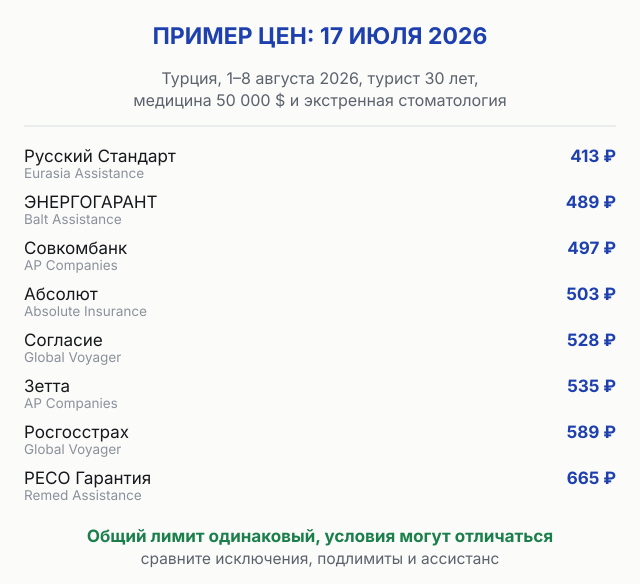
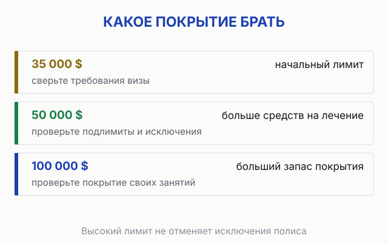

import AffiliateNote from '../../components/post/AffiliateNote.astro';
import PricingCards from '../../components/post/PricingCards.astro';
import { cherehapaTravel } from '../../data/affiliate.js';

export const chIns = cherehapaTravel('strahovka_2026');

Ява, вулкан, сильнейший дождь. К вечеру у меня температура 40 — надышался вулканическим газом. Дальше было быстро: хорошая клиника, врачи, которые сразу поняли, что со мной. Счёт закрыла страховая, полис у меня был.

Именно тогда я перестал выбирать полис по цене.

> **Если коротко:** выбирайте полис по условиям помощи в вашей стране: лимиту, исключениям, франшизе и ассистансу. В расчёте на одну поездку в Турцию 17 июля 2026 цены 13 страховщиков различались от **413 до 1 197 ₽**. Общий лимит был одинаковым, условия договоров могли отличаться. <a href={chIns} class="aff-cta" rel="sponsored">Сравнить полисы под свою поездку</a>.

<AffiliateNote />

---

## Какая страховка лучше для путешествий в 2026 году?

**Лучшей страховой «вообще» не существует — есть лучшая связка «страховая + ассистанс» под вашу страну.** Сначала проверьте, подходит ли полис под страну, длительность поездки и ваши занятия. Затем сравните ассистанс, порядок обращения за помощью, лимиты и цену.

Почему так. Когда вы заболели за границей, работают трое, и это разные организации:

- **Где вы купили полис** (агрегатор, банк, сайт страховой) — помогает оформить покупку и решить вопросы по заказу. Медицинскую помощь организуют по правилам выбранного полиса.
- **Ассистанс** — сервисная компания. Вы звоните ей. Она ищет врача, клинику и отправляет туда гарантийное письмо. Она отвечает за **скорость**.
- **Страховая компания** — платит по счёту и даёт добро на оплату. Она отвечает за **деньги**.

Логотип на полисе — это третий пункт. А в момент, когда вам плохо, вас спасает второй. Его в рекламе не показывают.

---

## Сравнение: 13 страховых на одну поездку — цена и ассистанс

Чтобы цифры были не «в среднем по больнице», я задал одинаковые параметры поиска: **Турция, 1–8 августа 2026 (8 дней), один турист 30 лет, медицина 50 000 $ плюс экстренная стоматология**. Это исторический пример расчёта от 17 июля 2026 года, а не предложение на текущие даты.

| Страховая | Цена за 8 дней | Ассистанс |
|---|---|---|
| Русский Стандарт | **413 ₽** | Eurasia Assistance |
| ЭНЕРГОГАРАНТ | 489 ₽ | Balt Assistance |
| **Совкомбанк Страхование** | **497 ₽** | **AP Companies** |
| Абсолют Страхование | 503 ₽ | Absolute Insurance Ltd |
| Согласие | 528 ₽ | Global Voyager Assistance |
| **Зетта Страхование** | 535 ₽ | **AP Companies** |
| Росгосстрах | 589 ₽ | Global Voyager Assistance |
| **РЕСО Гарантия** | 665 ₽ | **Remed Assistance** (турецкий) |
| Лучи Страхование | 676 ₽ | Balt Assistance |
| СберСтрахование | 715 ₽ | Eurasia Assistance |
| ВСК | 940 ₽ | MedAssist International |
| Ингосстрах | 951 ₽ | Balt Assistance |
| АльфаСтрахование | **1 197 ₽** | Global Voyager Assistance |

Смотрите на края таблицы. Сверху 413 ₽, снизу 1 197 ₽. Общий лимит — **одинаковый**, но это не делает договоры равными. Сравните подлимиты, исключения, порядок оплаты лечения и ассистанс: таблица цен этих различий не раскрывает.

Ренессанс и Евроинс на эти даты вообще не собрали нужный набор опций. Т-Страхования в выдаче по Турции в этот день не было — хотя логотип «Тинькофф» на витрине висит.

Франшизы нет ни у одного из тринадцати. Это хорошо и это не всегда так — про франшизу ниже.

<a href={chIns} class="aff-cta" rel="sponsored">Пересчитать под свои даты и страну</a> — цены меняются, а фильтр по ассистансу остаётся.

---

## Почему ассистанс важнее цены и бренда

Вернусь на Яву. Я не знаю и до сих пор не помню, какая у меня была страховая — и это как раз доказывает мысль. Сработала не она. Сработали люди, которые взяли трубку и за несколько часов нашли клинику, где меня приняли и знали, что делать с отравлением газом.

Вот почему это лотерея. Одна и та же страховая продаёт полисы с **разными** сервисными компаниями. Купили «у известного банка» — это ничего не говорит про то, кто поедет вас вытаскивать.

При подготовке сравнения 17 июля 2026 я использовал [оценку ассистансов в блоге «Ездили-Знаем»](https://ezdili-znaem.com/straxovka/). Это личное мнение автора, не официальный рейтинг; к моменту покупки оно может измениться:

- **Отлично:** Allianz Global Assistance
- **Хорошо:** ISOS (International SOS), AP Companies
- **Средне:** Class Assistance, Global Voyager Assistance
- **Не рекомендует:** Europ Assistance, Axa Assistance, Savitar

Наложите это на таблицу выше — и картина переворачивается. **Совкомбанк за 497 ₽ идёт с AP Companies**, то есть с сервисом из категории «хорошо». **АльфаСтрахование за 1 197 ₽** — с Global Voyager, это «средне». Такое сопоставление показывает мнение автора рейтинга, но не доказывает, что более дорогой полис хуже организует помощь.

Для Турции в той же подборке автор рекомендовал **РЕСО-Гарантию и Ингосстрах**, а страховки Тинькофф, Сбера и Альфы не рекомендовал. В исторической таблице выше РЕСО стоит 665 ₽ и идёт с Remed Assistance — турецкой сервисной компанией. Такой отзыв можно учитывать при выборе, но он не подтверждает качество помощи по конкретному полису сегодня.

Проверяйте связку на дату покупки, а не по чужим статьям. Тот же блог пишет, что Сбер работает с Europ Assistance — а живая выдача 17 июля показала у Сбера **Eurasia Assistance**. Связки меняются, и это нормально. Смотрите то, что написано в карточке полиса прямо сейчас.

**И главное правило, которое стоит денег:** позвоните по телефону из полиса **до** поездки и спросите, есть ли ваш номер в базе. Тридцать секунд — и вы знаете, что полис живой.

---

## Франшиза: когда экономит, а когда съедает выплату

Франшиза — сумма, которую при страховом случае платите вы, а страховая покрывает только сверху.

Звучит безобидно: франшиза снижает цену полиса. Проблема в другом. **Большинство реальных обращений — мелкие:** отравление, ухо, температура у ребёнка, разбитая коленка. Если счёт меньше франшизы, расходы могут остаться на вас. Порядок обращения всё равно соблюдайте: полис может требовать согласовать помощь с ассистансом.

Франшиза имеет смысл ровно в одном случае: вы страхуетесь только от катастрофы (перелом, операция, эвакуация) и осознанно готовы платить мелочь из кармана. Всем остальным — **брать без франшизы**.

В [страховке в Грузию](/blog/georgia-insurance-2026/) миф «закон требует полис без франшизы» разошёлся по перепечаткам: в постановлении №602 слова «франшиза» нет, но брать **без франшизы** всё равно разумно.

---

## Какое покрытие брать: 35 000, 50 000 или 100 000 $

<PricingCards
  caption="Какое покрытие выбрать под поездку"
  tiers={[
    {
      tier: 'Начальный лимит',
      price: '30 000–35 000 $',
      priceNote: '347 ₽ за 8 дней в Турции (пример 17.07.2026)',
      features: [
        'Шенгенская виза требует от 30 000 €',
        'Лимит в долларах не равен требованию в евро',
        'Проверьте подлимиты на отдельные расходы',
      ],
      ctaLabel: 'Посмотреть цены',
      ctaHref: chIns,
    },
    {
      tier: 'Средний лимит',
      price: '50 000 $',
      priceNote: '413 ₽ за 8 дней в Турции (пример 17.07.2026)',
      featured: true,
      badge: 'Сравните условия',
      features: [
        'Общий лимит не гарантирует покрытие любого случая',
        'Стоматология и эвакуация могут иметь подлимиты',
        'Сопоставьте с условиями своей поездки',
      ],
      ctaLabel: 'Подобрать под свои даты',
      ctaHref: chIns,
    },
    {
      tier: 'Больший запас покрытия',
      price: '100 000 $',
      priceNote: 'для поездок, где нужен больший лимит',
      features: [
        'Больше средств в пределах условий полиса',
        'Занятия спортом проверяются отдельно',
        'Высокий лимит не отменяет исключения',
      ],
      ctaLabel: 'Сравнить полисы',
      ctaHref: chIns,
    },
  ]}
/>

Экономить тут глупо, и это считается. Я пересчитал ту же поездку с покрытием 35 000 $ вместо 50 000: самый дешёвый полис стал 347 ₽ вместо 413 ₽. Вы экономите **66 ₽ за восемь дней** и теряете 15 000 $ защиты. У Совкомбанка та же разница — 391 ₽ против 497 ₽, сотня рублей.

Сто рублей против сотен тысяч в счёте. Считайте сами.

---

## Какие условия проверить в полисе

Общий лимит отвечает на вопрос «до какой суммы», а правила — «за что заплатят». До покупки проверьте следующие условия.

- **Медицинские расходы и несчастный случай.** Оплата лечения травмы и отдельная выплата за последствия травмы — разные покрытия. Нужна ли дополнительная выплата, решайте по условиям продукта; само её отсутствие не означает отказ в оплате любого перелома.
- **Активный отдых.** Найдите в правилах конкретное занятие: снорклинг, мопед, дайвинг или поход. У страховщиков отличаются перечни занятий и категории риска. Большая страховая сумма сама по себе спорт не добавляет.
- **Алкогольное опьянение.** Ограничения и дополнительные опции зависят от договора. Не рассчитывайте, что отдельная отметка в фильтре отменяет все исключения: прочитайте условия выбранного полиса.
- **Мопед.** Проверьте покрытие поездок водителем и пассажиром, требования к категории прав, шлему и другим условиям аренды.
- **Хронические болезни.** Плановое лечение и экстренное обострение — разные ситуации. У Т-Страхования есть покрытие экстренного обострения в пределах правил; у другого продукта могут отличаться условия и подлимиты.

**Для долгой поездки отдельно проверьте страну проживания и ограничения по срокам.** Например, у Т-Страхования:

1. Медицинское покрытие не действует в стране, где вы провели **более 90 дней суммарно за последние 365 дней**. Шенген для этого ограничения считается одной территорией. Выезд не обнуляет суммарный срок; новый полис тоже не снимает ограничение. Срок одной поездки по годовому полису — отдельное условие.
2. В стране второго гражданства или ВНЖ медицинское покрытие не действует. Другие опции могут сохраняться: это не означает, что весь договор прекращается.
3. Оформление после начала поездки возможно с соответствующей опцией. Нужно указать, что находитесь за границей, и проверить начало защиты. Произошедшее до её начала событие такой полис не покроет.

Эти ограничения нельзя переносить на все страховые компании: перед долгой поездкой сравните правила нескольких продуктов.

Отдельная засада для визы: **Германия, Швеция, Словения и Мальта не принимают полисы российских страховых** при подаче документов. Австрия и Норвегия — только из списка рекомендованных. Лечить по такому полису вас будут, а вот визу с ним не дадут — подробности в разборе [страховки для шенгенской визы](/blog/schengen-insurance-2026/).

---

## Как выбрать полис за 5 минут

Что бы я сказал другу, который собрался лететь:

1. **Открой сравнение**, вбей страну и точные даты.
2. **Выбери лимит под страну и поездку.** Проверь требования визы и подлимиты на отдельные расходы.
3. **Проверь ассистанс.** Узнай, как обращаться за помощью и кто согласует оплату клиники.
4. **Проверь свои занятия и ограничения.** Оплата лечения и отдельная выплата при несчастном случае — разные опции.
5. **Убедись, что франшизы нет.**
6. **Позвони по номеру из полиса** и проверь, что он в базе.
7. **Сохрани полис в телефон и распечатай.** Без сознания вы не разблокируете экран.

<a href={chIns} class="aff-cta" rel="sponsored">Подобрать полис под свою поездку</a> — фильтр по ассистансу в левой колонке, франшиза и сервисная компания видны в каждой карточке.

---

Если отпуск может сорваться ещё до выезда, отдельно проверьте [страховку от невыезда](/blog/strahovka-ot-nevyezda/): в разборе есть условия четырёх страховщиков, сроки покупки и пример расчёта выплаты. Наличие медицинского покрытия само по себе не подтверждает этот риск.

## FAQ

**Какая страховая для путешествий лучшая в 2026 году?**

Единой лучшей нет. По народному рейтингу Банки.ру на 17 июля 2026 первое место у **Т-Страхования** — 2 174 отзыва и 95,1 балла, с большим отрывом от Совкомбанк Страхования (64,0) и АльфаСтрахования (61,0). Но рейтинг во многом меряет удобство покупки и мелкие выплаты, а не то, как вас вытаскивают больным за границей. Выбирайте под конкретную страну и смотрите на ассистанс.

**Сколько стоит страховка для путешествий за границу?**

В историческом расчёте от 17 июля 2026 полис на 1–8 августа в Турцию стоил от 413 ₽. Для вашей поездки цену нужно получить заново: она зависит от страны, дат, возраста, лимитов и опций.

**Где дешевле — у агрегатора или на сайте страховой?**

Агрегатор показывает цены 13+ страховых в одном окне и, главное, показывает ассистанс каждой. На сайте страховой вы видите одну компанию и обычно не видите сервисную. Цена при этом часто одинаковая: агрегатор получает комиссию от страховой, а не наценку с вас.

**Что такое ассистанс простыми словами?**

Компания, которой вы звоните, когда заболели. Она ищет врача, договаривается с клиникой и присылает туда гарантийное письмо, чтобы вас приняли бесплатно. Страховая потом платит по счёту. Это две разные организации, и в полисе указаны обе.

**Нужна ли страховка, если еду по безвизу?**

Юридически чаще нет, практически — да. ОМС за границей не действует нигде. В [Абхазии](/blog/abkhazia-2026/) экстренную перевозку в больницу Сочи без полиса оплачивают из своего кармана. В Таиланде, по опыту автора «Ездили-Знаем», только первая помощь при открытом переломе и день в госпитале стоят от 1 500 $. Стоимость полиса получите под страну, даты и возраст путешественников.

**Полис с франшизой дешевле — стоит брать?**

Нет, если только вы не страхуетесь исключительно от катастрофы. Франшиза 50 $ убивает смысл полиса при мелких обращениях, а именно они и случаются чаще всего.

**Можно купить страховку, если я уже за границей?**

Да, если выбранный продукт допускает оформление во время поездки. Отметьте нахождение за границей и проверьте дату начала защиты, период ожидания и ограничения по длительности пребывания. Единого срока ожидания для всех полисов нет; случившееся до начала защиты не покрывается.

---

## Что почитать дальше

- [Страховка в Грузию без франшизы 2026](/blog/georgia-insurance-2026/) — с января полис обязателен, проверяют на регистрации рейса.
- [Страховка для шенгенской визы 2026](/blog/schengen-insurance-2026/) — требования к покрытию 30 000 € и что приложить к пакету документов.
- [Страховка на Кубу 2026](/blog/cuba-insurance-2026/) — обязательна для въезда, могут спросить на границе.
- [Как платить за границей россиянам 2026](/blog/pay-abroad-2026/) — чем оплатить клинику, если платить всё-таки придётся из кармана.

*Обложка: Dare2Leap / [Wikimedia Commons](https://commons.wikimedia.org/wiki/File:Bromo-Tengger-Semeru_National_Park_sunrise.jpg) / [CC BY-SA 4.0](https://creativecommons.org/licenses/by-sa/4.0/). Размер и кадрирование адаптированы для страницы.*
