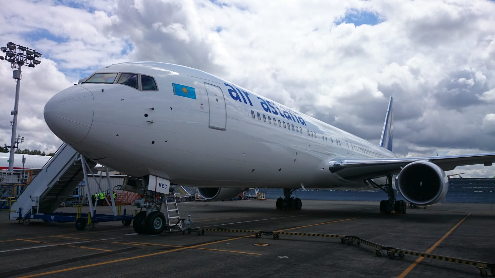
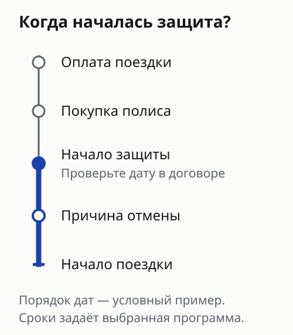
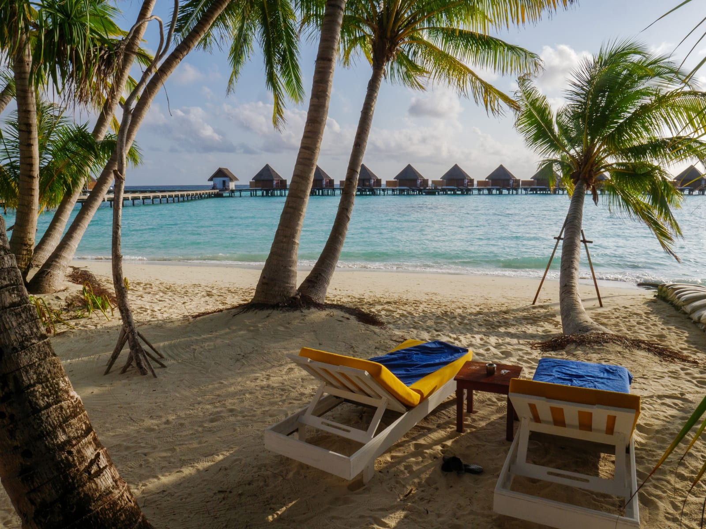
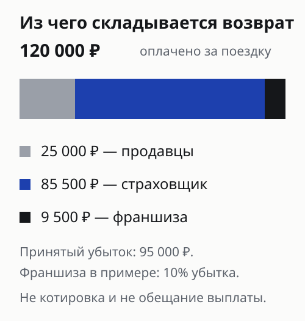
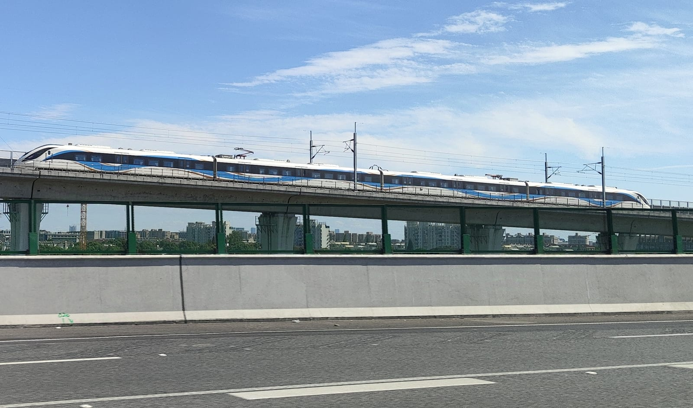

import { cherehapaTravel } from '../../data/affiliate.js';

export const compareInsurance = cherehapaTravel('cancellation_guide');

**Страховка от невыезда возмещает подтверждённые расходы, которые не удалось вернуть после отмены поездки по причине, включённой в полис.** Сначала нужно найти в договоре свой случай: болезнь, отказ в визе, повреждение жилья или другое событие. Затем проверить даты, список застрахованных и порядок расчёта выплаты.

Два полиса с одинаковой суммой могут защищать по-разному. Один предусматривает амбулаторное лечение, другой связывает конкретный риск с экстренной госпитализацией. Для семьи имеет значение, чья болезнь сорвала отпуск и за кого оплачены билеты. Ниже — способ проверить эти различия до покупки, с примерами из правил четырёх страховщиков.

*На обложке — терминал T1 аэропорта Пудун.*

## Когда страховка от невыезда имеет смысл

Начните с суммы, которую потеряете при отмене. Отдельно выпишите билеты, проживание, тур, оплаченные экскурсии и сборы. Напротив каждой строки отметьте условия возврата и последний день бесплатной отмены. Затем оставьте в расчёте только расходы, которые выбранная программа вообще принимает на страхование.

Полис особенно полезно рассмотреть при дорогой поездке с большой предоплатой. Но цена отпуска сама по себе ничего не говорит о потерях. У дорогого отеля может быть свободная отмена, а у недорогого билета — жёсткие ограничения. Страховать возвращаемую сумму ради красивого общего лимита обычно бессмысленно.

При самостоятельной поездке проверьте, что договор охватывает отдельно купленные билеты и номера. При покупке тура — стоимость именно того пакета, который указан в договоре с продавцом. Оплаченная отдельно экскурсия не становится частью застрахованного тура автоматически.

Если главное опасение — передумать или перенести отпуск по личным планам, сравните условия возвратного тарифа. В прочитанных правилах перечень событий ограничен: свободной отмены по желанию путешественника они не обещают. Возвратный билет и страховая защита решают разные задачи, поэтому выбирать между ними стоит по условиям собственной брони.

*Boeing 767 Air Astana, июнь 2014 года.*

При <a href={compareInsurance} rel="sponsored">сравнении туристических страховок</a> отдельно проверьте наличие отмены поездки: обычный медицинский полис этот риск сам по себе не закрывает.

## Чем отличаются условия четырёх страховщиков

Таблица показывает отдельные различия программ, а не описывает каждый полис целиком. Это не рейтинг скорости выплат. Перед оплатой сопоставьте название программы, редакцию правил и набор рисков в своём полисе: большой документ может описывать несколько вариантов покрытия.

| Страховщик | Различие в правилах | Что проверить |
|---|---|---|
| Т-Страхование | Есть отдельный случай ухода за ребёнком младше 14 лет | Дату первого обращения к врачу |
| Согласие | Указано амбулаторное лечение самого застрахованного | Включён ли этот риск в программу |
| ЕВРОИНС | Предусмотрены события с компаньоном по поездке | Как подтверждается совместная поездка |
| Гелиос | Для одного из рисков болезни требуется экстренная госпитализация | Условия именно вашего события |

У **Т-Страхования** пункт 15.2.3.1 правил связывает уход за заболевшим или травмированным ребёнком младше 14 лет с первым обращением за помощью во время действия договора и не ранее чем за пять дней до поездки. Соседний пункт о госпитализации содержит другое временное условие. Поэтому одной общей справки «ребёнок болел» для проверки покрытия мало.

У **Согласия** пункт 4.4.1.6 предусматривает острое заболевание или обострение хронического заболевания самого застрахованного при амбулаторном лечении на дату начала поездки, если болезнь препятствует поездке. Это самостоятельный пункт, а не обещание выплаты при любом недомогании любого родственника.

У **ЕВРОИНС** в правилах №2, пункте 32.2, есть события с компаньоном. Совместную поездку связывают с одним договором с туристической организацией, одним оплаченным номером или одним страховым полисом. Для заболевания и травмы также заданы требования к лечению и медицинским документам.

У **Гелиоса** пункт 4.15.1.2 описывает внезапную болезнь, травму или отравление с угрозой жизни и экстренной госпитализацией, продолжающейся на дату начала поездки. Рядом отдельно перечислены перелом, необходимость ухода за родственником и другие события. Требование из одного пункта нельзя переносить на весь документ.

## За сколько дней покупать полис

Проверяйте четыре даты: оплату поездки, заключение договора, начало защиты по отмене и отправление. Между покупкой полиса и началом покрытия может быть разрыв. Причина отмены должна попадать в предусмотренный договором период; покупка после возникшей проблемы не превращает её в застрахованное событие.

Например, по пункту 5.11 правил №2 ЕВРОИНС защита для перечисленных там рисков отмены начинается с нуля часов дня после оплаты страховой премии. У Согласия пункт 8.14.1 связывает начало защиты с датой заключения договора при соблюдении срока оплаты. Эти условия нельзя заменять общей фразой «действует сразу».

Отдельно проверьте, насколько давно оплачены билеты или тур. У Гелиоса пункт 4.19 по умолчанию ограничивает покрываемые расходы теми, которые понесены не ранее пяти рабочих дней до заключения договора; для рассрочки оговорён первый взнос. Конкретный договор может устанавливать иное. Это условие о дате расходов, а не универсальное требование купить любой полис за пять дней до вылета.

Практический порядок простой: ещё перед невозвратной оплатой получите подходящий вариант страхования и прочитайте сроки. Если поездка оплачена, назовите страховщику точные даты и суммы. Сохраните ответ вместе с предложенными условиями, а после покупки проверьте, что они отражены в документах.

## Отказ в визе: какие детали меняют результат

Проверьте, какие события названы в полисе: отказ, задержка выдачи, виза с неподходящими датами, ошибка в документе. Это разные ситуации. Программа, покрывающая только отказ, не обязана решать проблему с паспортом, который ещё находится в консульстве.

Дальше сверьте требования к подаче: полный комплект, правильное оформление и установленный срок. У Согласия визовый пункт 4.4.1.12 прямо связывает покрытие с соблюдением порядка подачи и документальным подтверждением события. Сохраните квитанцию визового центра, опись документов и ответ консульства. Устное сообщение посредника «визу не дали» оставляет слишком много неизвестного.

Для семьи проверяйте каждого участника. Если отказ получил один человек, это ещё не ответ на вопрос о расходах остальных. Найдите в правилах круг связанных лиц и способ подтверждения совместной поездки. Особенно внимательно читайте условия для друзей, взрослых детей и партнёров без зарегистрированного брака: бытовое слово «семья» не заменяет определения договора.

Если раньше был отказ в визе или есть другое существенное обстоятельство из анкеты, сообщите о нём при оформлении. Не полагайтесь на комментарий к заказу тура: страховая компания должна получить сведения в предусмотренном ею порядке. Для самого въезда пользуйтесь отдельной [проверкой визовых правил по стране](/visa/) — полис не выдаёт разрешение на пересечение границы.

*Курорт на Мальдивах, сентябрь 2023 года.*

## Сколько денег вернут: пример расчёта

Сумма покрытия — верхняя граница, указанная в полисе. Выплата зависит от подтверждённых потерь, возвратов от поставщиков, состава оплачиваемых расходов, лимитов и франшизы. Отдельно выясните, действует ли лимит на каждого человека или на всю поездку.

**Условный пример, не котировка и не обещание выплаты.** Поездка стоит 120 000 рублей. Продавцы возвращают 25 000 рублей. Остаются 95 000 рублей потерь. Предположим, что страховой случай признан, все эти расходы принимаются к возмещению, лимита хватает, а безусловная франшиза равна 10% именно от принятого убытка. Тогда франшиза составит 9 500 рублей, выплата — 85 500 рублей.

Полученные от продавцов 25 000 рублей не прибавляют к заявлению как новый убыток. Если договор считает франшизу от страховой суммы, устанавливает её в рублях или исключает часть расходов, расчёт будет другим. Стоимость самого полиса в приведённом примере не учтена.

Перед покупкой попросите разобрать свой пример: «Тур оплачен на двоих, заболел один, продавец возвращает такую-то сумму — какие расходы остаются под защитой?» В ответе должны появиться пункты правил, способ применения франшизы и лимит. Ответ «до полной стоимости тура» без этих деталей не позволяет сравнить варианты.

## Что делать, если поездка сорвалась

Свяжитесь со страховщиком по каналу из полиса и уточните порядок уведомления, аннулирования брони и передачи документов. Зафиксируйте номер обращения. Одновременно сообщите продавцам билетов, тура и проживания о невозможности поездки: порядок действий должен учитывать срок уведомления страховщика и рост потерь при поздней отмене.

Запросите письменный расчёт возврата и удержаний. Для страховой важна связь между событием и конкретным расходом. Медицинский документ объясняет причину отмены; платёжный документ подтверждает оплату; ответ продавца показывает, какая сумма осталась невозвратной. Один из этих документов обычно не заменяет остальные.

Собирайте пакет по своей причине. При болезни нужны документы о диагнозе, датах обращения и лечения, а также ограничениях, существенных для выбранного пункта правил. При визовом отказе — решение и подтверждение надлежащей подачи. При событии с родственником — документы о родстве, когда этого требует договор.

Сохраните первоначальные подтверждения бронирований, полис с приложениями, переписку и платёжные документы. В расчёте показывайте суммы в исходной валюте и дату операции; рублёвый эквивалент страховщик определяет по условиям договора. Не пересчитывайте валюту на удобный курс и не смешивайте оплаченные расходы с планировавшимися.

Если документы запросили дополнительно, уточните перечень и срок передачи письменно. При отказе в выплате запросите основание с указанием пункта договора. Это позволит понять, спор идёт о самом событии, составе расходов, сроках или недостаточном подтверждении, и подготовить предметное обращение.

*Airport Link Line в Шанхае.*

## Что проверить перед оплатой

Сравнивайте полисы на одинаковый состав поездки и людей. Сначала выберите нужные события и понятные исключения, затем лимит и франшизу, после этого цену. Тариф без названия программы и редакции правил нельзя воспроизвести, поэтому текущих цен «от» здесь нет.

Для поездки с ребёнком полезнее точный пункт о заболевании и уходе, чем длинный рекламный список рисков. Для поездки за визой — определение визового события и требования к подаче. Для самостоятельного маршрута — охват отдельно купленных услуг и попутчиков. Сохранённый расчёт должен соответствовать выданному полису.

<a href={compareInsurance} class="aff-cta" rel="sponsored">Открыть сравнение туристических страховок</a> — опцию отмены поездки и условия конкретной программы проверьте отдельно перед оплатой.

Медицинское покрытие на самой поездке выбирайте отдельно: в [гайде по туристической страховке](/blog/strahovka-dlya-puteshestviy-2026/) разобраны лечение, территория и ограничения программы. При покупке пакета проверьте также продавца и договор — например, [как устроена покупка тура у Библио-Глобуса](/blog/biblio-globus-2026/). Ни один из этих документов не заменяет условий отмены поездки.

## Частые вопросы

### Можно ли купить страховку после оплаты тура?

Иногда можно, но важны давность оплаты, срок до отправления и начало покрытия. Проверьте эти три условия в выбранной программе. Если причина отмены возникла, последующая покупка полиса не делает её новым непредвиденным событием.

### Заболел ребёнок без госпитализации — это страховой случай?

Ответ зависит от программы, возраста ребёнка, дат и медицинских документов. В некоторых правилах есть отдельное покрытие ухода за ребёнком или амбулаторного лечения. Требование экстренной госпитализации из другого пункта нельзя автоматически применять к такому случаю.

### Отказали в визе одному из двух путешественников. Вернут обоим?

Нужно проверить, застрахованы ли расходы каждого и распространяется ли событие на второго участника. Значение имеют родство или определение попутчика, совместное бронирование и документы. Сам факт покупки билетов на один рейс не даёт универсальной гарантии.

### Вернут ли полную стоимость невозвратного билета?

Только слово «невозвратный» ответа не даёт. Сначала определяется страховой случай, затем принимаемые расходы, возврат от перевозчика, лимит и франшиза. Сохраните условия тарифа и письменный расчёт перевозчика, чтобы подтверждать фактический остаток потерь.

### Покрывает ли полис отмену рейса авиакомпанией?

Ищите отдельные положения о задержке или отмене перевозки и их причинах. Условия могут отличаться от отмены поездки из-за болезни. Одновременно выясните, что предлагает перевозчик по вашему билету: это влияет на оставшиеся расходы.

### Медицинская страховка действует. Нужен ещё один полис?

Проверьте перечень рисков в действующем документе. Отмена поездки может оформляться дополнительной опцией или отдельным договором. Покупка второго медицинского полиса без нужного риска не решает вопрос с возвратом денег за сорвавшийся отпуск.
