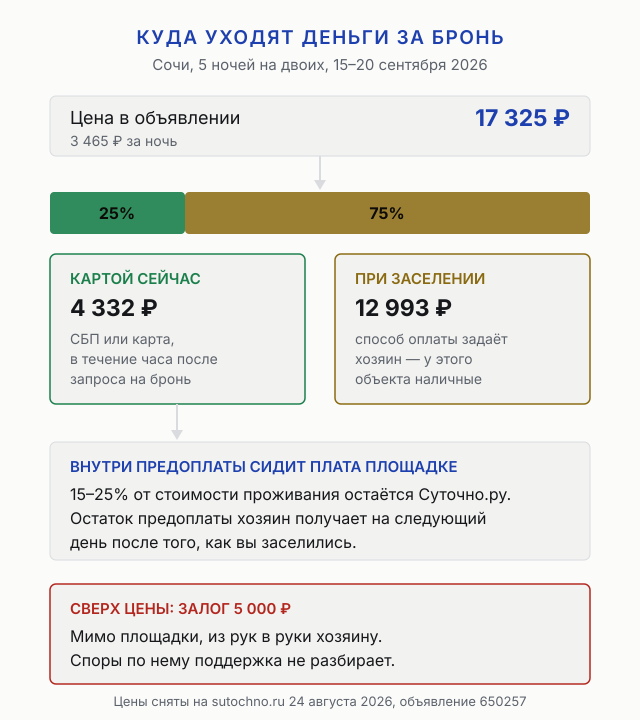
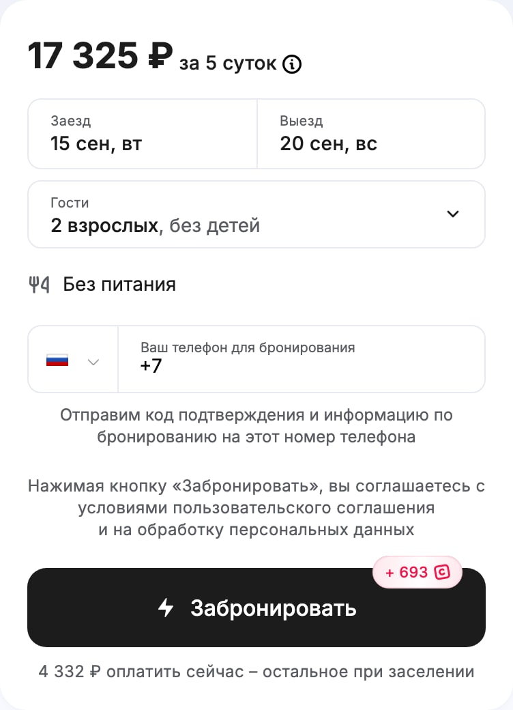
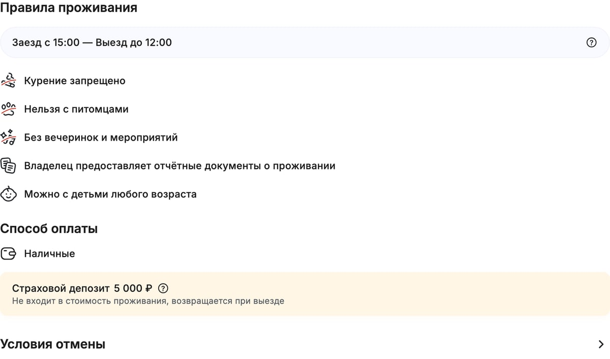

import AffiliateNote from '../../components/post/AffiliateNote.astro';
import { sutochnoRegion } from '../../data/affiliate.js';

Главный вопрос к Суточно.ру звучит как «берут ли они комиссию», и у сервиса на него два разных ответа. Справка для гостей говорит, что вы платите только стоимость проживания. Пользовательское соглашение в пункте 7.1 говорит другое: **плата площадке составляет от 15% до 25% от стоимости проживания** и сидит внутри той цены, которую вы видите в объявлении.

Оба ответа верны одновременно — сверх цены с вас ничего не возьмут, но каждый четвёртый рубль из показанной суммы остаётся сервису, а не хозяину квартиры. Ниже разобрано, как это меняет расчёт поездки: сколько уходит картой, сколько придётся отдать на месте, что происходит с залогом и в каких случаях деньги возвращают.

<AffiliateNote />

## Что такое Суточно.ру и кто за ним стоит

Суточно.ру — российская площадка посуточной аренды: квартиры у частных хозяев, гостевые дома, мини-отели и апартаменты. На 24 августа 2026 года на главной странице заявлено **390 тысяч вариантов** по России и зарубежью, а в подписи сайта стоит отсчёт с 2011 года и товарный знак № 681728.

Юридически это **акционерное общество «Суточно»** (ОГРН 1247300009560, ИНН 7300037501) с адресом в Ульяновске. До 12 ноября 2024 года компания была обществом с ограниченной ответственностью и сменила форму на акционерную; права и обязанности перешли в полном объёме. В реквизитах указан один код вида деятельности — **разработка программного обеспечения**, и это не формальность: в соглашении сервис называет себя лицензиаром информационной системы, а не стороной вашей сделки с хозяином.

Отсюда растёт вся конструкция ответственности. Пункт 5.2 соглашения сформулирован прямо: Суточно **не отвечает за любую часть сделки по аренде** и за достоверность информации в объявлениях. Сервис отвечает за свою часть — что бронь подтверждена, деньги дошли и спор разобрала поддержка.

## Берёт ли Суточно.ру комиссию с гостя

Берёт, и называется она лицензионным платежом. Дословно из пункта 7.1 соглашения: «Размер каждого лицензионного платежа рассчитывается автоматически и составляет от 15% до 25% от общей стоимости проживания. Стоимость аренды в объявлениях <nobr>…</nobr> указывается с учётом лицензионного вознаграждения, а не взимается сверх него».

Что это значит на практике:

- **Итоговая цена не вырастет** на шаге оплаты — отдельной строки «сервисный сбор» в чеке не будет.
- **Точный процент вам не покажут.** Диапазон 15–25% считается автоматически, и увидеть свою ставку в интерфейсе нельзя.
- **Сравнивать площадки по «размеру комиссии» бессмысленно** — сравнивать надо итоговую цену одного и того же жилья на одни и те же даты.
- Платёж вносится **одновременно с предоплатой**, но признаётся полученным только на следующий день после вашего заезда.

Последний пункт объясняет, почему сервис так держится за схему с частичной предоплатой: пока вы не заселились, деньги площадки формально не заработаны, и у неё есть свой интерес довести заселение до конца.

## Как раскладываются деньги: живая бронь в Сочи

Расчёт снят 24 августа 2026 года на конкретном объявлении в Сочи (номер 650257, апартаменты на улице Метелёва): пять ночей на двоих, заезд 15 сентября, выезд 20 сентября.

| Строка | Сумма | Куда идёт |
|---|---|---|
| Цена в объявлении | **17 325 ₽** | 3 465 ₽ за ночь |
| Картой при бронировании | **4 332 ₽** | на счёт площадки, четверть суммы |
| При заселении | **12 993 ₽** | хозяину, у этого объекта — наличными |
| Страховой депозит | **5 000 ₽** | хозяину, возвращается при выезде |
| **На руках в день заезда** | **17 993 ₽** | наличными или как скажет хозяин |

Цифра в последней строке — то, ради чего стоит читать карточку до конца. Картой вы платите четверть, а привезти с собой нужно почти столько же, сколько стоит вся поездка. Для курорта в сентябре это подъёмно, для дорогой брони в Москве на неделю превращается в отдельную задачу — где взять наличные.

**Ни доля предоплаты, ни способ доплаты не одинаковы у всех.** По правилам бронирования размер предоплаты назначает хозяин при подтверждении брони, он же указывает залог и принимаемые способы оплаты. Четверть и наличные — параметры этого объявления, а не правило площадки: соседнее может просить половину и принимать перевод.

<a href={sutochnoRegion('https://sochi.sutochno.ru/', 'sutochno_2026_sochi')} class="aff-cta" rel="sponsored">Посмотреть жильё в Сочи от 800 ₽ за ночь</a> — 32 259 предложений на 24 августа 2026 года, оплата российской картой и через СБП, в карточке видно предоплату и залог до бронирования.

## Что скрыто в карточке объекта

Крупная цифра в панели — стоимость всего проживания, а мелкая строка под кнопкой — то, что спишут с карты. Между ними разница в четыре раза, и её замечают не все.

По правилам бронирования **в стоимость проживания входят все обязательные платежи**: доплата за дополнительного гостя, ранний заезд, поздний выезд и уборка. Если хозяин требует за них деньги отдельно сверху — это нарушение правил площадки, а не «так принято». Остальные услуги хозяина оказываются только с вашего согласия и в стоимость не входят.

Стоит открыть до брони четыре вещи:

1. **Правила проживания** — время заезда и выезда, можно ли с детьми и питомцами, курение.
2. **Способ оплаты остатка** — наличные, перевод или карта, это решает хозяин.
3. **Размер залога** — он живёт отдельной строкой и в цену не входит.
4. **Отчётные документы** — если они нужны для командировки, наличие отметки в объявлении даёт вам право на возврат при отказе хозяина их оформить.

## Залог — деньги, за которые площадка не отвечает

Страховой депозит вносится при заселении и возвращается при выезде, если хозяин не нашёл повреждений. В примере выше это 5 000 ₽, встречаются и суммы крупнее. Обратите внимание на строку в самом низу карточки: условия отмены спрятаны за отдельной ссылкой, и открывать её надо самому.

Ключевой пункт — 9.3 правил бронирования: **споры о правомерности удержания залога не входят в компетенцию поддержки Суточно.ру** и решаются между гостем и хозяином в установленном законом порядке. То есть на самую конфликтную часть аренды защита площадки не распространяется вовсе.

Что из этого следует по-человечески: залог отдают наличными незнакомому человеку, а если при выезде его удержат за царапину на столешнице, звонок в поддержку не поможет. Единственная рабочая страховка — снять квартиру на видео при заселении и при выезде, с датой на кадрах.

Отдельная льгота: статус Супергостя даёт **заселение без залога** либо персональные скидки от 5% до 20%. Получить его непросто — нужны минимум три брони у разных хозяев, суммарно от 30 суток проживания начиная с 2018 года, рейтинг не ниже 9,8 из 10, отсутствие отмен и незаездов в последних трёх бронях и заполненный профиль.

## Сроки, от которых зависит возврат денег

У площадки два срока, которые люди пропускают чаще всего.

**Час на предоплату.** При быстром бронировании даты закрепляются за вами только после платежа, а не после нажатия кнопки. Не оплатили за час — запрос аннулируется, и жильё уходит другим. Телефон хозяина, кстати, открывается тоже после оплаты.

**День заселения.** Право отказаться от жилья с возвратом денег работает, если обратиться в поддержку в день заезда или в момент заселения. Позже это обычная отмена постфактум, и деньги уходят хозяину.

Есть и мелкая ловушка со временем: если внести предоплату **менее чем за два часа** до указанного времени заезда, хозяин вправе сдвинуть фактическое заселение — максимум на два часа. Для ночного прилёта это разница между «сразу спать» и «сидеть с чемоданами».

## Что вернут при отмене: пять сценариев

Таблица собрана по разделам 5–8 правил бронирования. «Плата площадке» — тот самый лицензионный платёж 15–25%.

| Что случилось | Предоплата | Плата площадке |
|---|---|---|
| Отмена по уважительной причине или по закону о защите прав потребителей | возвращается полностью | возвращается пропорционально |
| Отмена без уважительной причины | возвращается за вычетом штрафа, назначенного хозяином в правилах объекта | возвращается пропорционально |
| Хозяин сам отменил бронь | возвращается вся, на баланс в сервисе | сервис вправе вернуть, а хозяин компенсирует ему сумму |
| Отказ в заселении без законного основания | возвращается гостю | возвращается гостю за счёт хозяина |
| Не приехали и не отменили заранее | уходит хозяину как компенсация | не возвращается |

Три вещи, которые из таблицы не видны, а знать их стоит.

**Размер штрафа задаёт хозяин, а не площадка.** Единых правил отмены на Суточно.ру нет: сумма компенсации установлена в правилах конкретного объекта на момент бронирования и считается отдельно для каждой брони. Смотреть условия отмены надо в самой карточке до оплаты.

**Возврат приходит на внутренний баланс**, а не сразу на карту. Оттуда деньги можно потратить на следующую бронь или вывести — на вывод уходит от 2 до 10 рабочих дней.

**Хозяин тоже имеет право отказать в заселении**, и тогда предоплата уходит ему на законных основаниях: если гость не приехал в день заезда, отказался вносить заявленный залог, привёл больше людей, чем указано в брони, не предъявил документ, удостоверяющий личность, или меняет сроки проживания. Ни один из этих случаев не считается неправомерным отказом.

## Кэшбэк «до 30%»: сколько получается на деле

Бонусная программа рекламируется цифрой 30%, и она честная в том смысле, что это потолок, а не норма. **На брони из примера выше начисление составило 693 бонуса при цене 17 325 ₽ — ровно 4%.**

Как устроены бонусы:

- Начисляются **после проживания и вашей оценки**, а не в момент оплаты. Не оставили отзыв — не получили кэшбэк.
- Максимальный процент сервис обещает **в мобильном приложении**, на сайте начисление ниже.
- За приглашённого друга, который зарегистрировался и забронировал, обоим приходит по 500 бонусов.
- Тратятся бонусы на следующие брони, вывести их деньгами нельзя.

Смысл программы для путешественника — вернуться на площадку второй раз, а не сэкономить на текущей поездке. Считать бонусы скидкой при выборе между сервисами не стоит: сравнение честнее вести по итоговой цене.

## Где у сервиса реально много жилья

Числа сняты с главной страницы 24 августа 2026 года, поэтому они меняются день ото дня, но пропорции устойчивы.

| Направление | Вариантов | Направление | Вариантов |
|---|---|---|---|
| Санкт-Петербург | 28 698 | Нижний Новгород | 5 367 |
| Сочи | 28 686 | Екатеринбург | 5 305 |
| Москва | 20 618 | Минск | 4 630 |
| Казань | 9 304 | Владивосток | 4 354 |
| Калининград | 7 912 | Кисловодск | 4 239 |
| Геленджик | 7 233 | | |

Картина говорит сама за себя: **два курорта и Петербург обходят Москву**, а Геленджик с Кисловодском стоят рядом с городами-миллионниками. Это площадка внутреннего отдыха и частного сектора, а не деловых поездок в столицу.

Отсюда же и практический вывод: там, где жильё в основном частное — черноморское побережье, Кавказ, Абхазия, — выбор у Суточно.ру шире, чем у отельных агрегаторов. Как это выглядит в деньгах на маршрутах по стране, разобрано в статье о том, [сколько стоит неделя в России и Абхазии](/blog/skolko-stoit-nedelya-v-rossii-2026/), а по конкретным направлениям — в [гайде по Абхазии](/blog/abkhazia-2026/) и [гайде по Дагестану](/blog/dagestan-guide-2026/).

## Кому Суточно.ру не подходит

Честный список минусов, каждый из которых следует из документов сервиса, а не из отзывов.

- **Тем, кто не может привезти наличные.** Способ доплаты выбирает хозяин, и наличные встречаются часто. Плюс залог сверху.
- **Тем, кому нужны единые правила отмены.** Штраф за отмену назначает хозяин, у каждого объекта он свой, и сравнить их между собой можно только вручную.
- **Тем, для кого важен спор о залоге.** Поддержка эту часть не разбирает — остаётся суд или договорённость с хозяином.
- **Тем, кто бронирует в последний момент.** Час на оплату, сдвиг заселения на два часа при поздней оплате, отсутствие телефона хозяина до платежа.
- **Командированным без проверки объявления.** Отчётные документы бывают не у всех хозяев, отметку надо искать в карточке заранее.
- **Тем, кто рассчитывает на кэшбэк 30%.** Реальное начисление в вебе ближе к нескольким процентам и приходит после отзыва.

Если из списка совпало два пункта и больше, отель с подтверждённым бронированием и полной оплатой картой окажется спокойнее, даже если ночь стоит дороже.

## Как забронировать без сюрпризов: короткий порядок

1. Задайте даты и количество гостей **до** просмотра карточек — цены без дат показываются от минимальной.
2. В карточке найдите три числа: итоговую стоимость, сумму к оплате сейчас и залог.
3. Откройте правила проживания и условия отмены до нажатия кнопки, а не после.
4. Проверьте способ оплаты остатка и заложите наличные, если хозяин просит их.
5. Внесите предоплату в течение часа, иначе бронь аннулируется.
6. Снимите квартиру на видео при заселении и при выезде — это единственная защита залога.
7. Проблема с жильём — звонок в поддержку **в день заезда**, не позже.

<a href={sutochnoRegion('https://sutochno.ru/', 'sutochno_2026_final')} class="aff-cta" rel="sponsored">Подобрать жильё посуточно от 800 ₽ за ночь</a> — 390 тысяч вариантов по России и зарубежью, оплата картой РФ и через СБП, часть суммы платится на месте.

## FAQ — что чаще всего спрашивают про Суточно.ру

**Берёт ли Суточно.ру комиссию с гостя?**
Берёт: по пункту 7.1 пользовательского соглашения плата площадке составляет от 15% до 25% стоимости проживания. Сверх цены её не добавляют — она заложена в цену объявления.

**Сколько платить сразу, а сколько при заселении?**
Долю предоплаты назначает хозяин при подтверждении брони. На проверенном 24 августа 2026 года объявлении в Сочи это была четверть суммы: 4 332 ₽ картой из 17 325 ₽, остальное наличными на месте.

**Вернут ли деньги, если отменить бронь?**
При отмене по уважительной причине — полностью, плату площадке вернут пропорционально. Без уважительной причины удержат штраф, размер которого хозяин указал в правилах своего объекта. Деньги приходят на баланс в сервисе, вывод занимает от 2 до 10 рабочих дней.

**Кто отвечает, если хозяин удержал залог?**
Никто из сервиса: по пункту 9.3 правил бронирования споры о залоге поддержка не разбирает. Вопрос решается между гостем и хозяином.

**Что делать, если квартира не такая, как на фото?**
Обратиться в поддержку в момент заселения — правила дают право отказаться от жилья с возвратом предоплаты, если объект не соответствует объявлению по типу, числу комнат и спальных мест, удобствам или фотографиям. Телефоны: 8 800 555 26 08 из России и +7 499 653 99 26 из других стран.

**Безопасно ли платить предоплату через сайт?**
Деньги хранятся на счёте площадки и уходят хозяину только на следующий день после вашего заселения. При отказе в заселении сервис обещает подобрать замену, а если она не подошла — вернуть всю предоплату.
