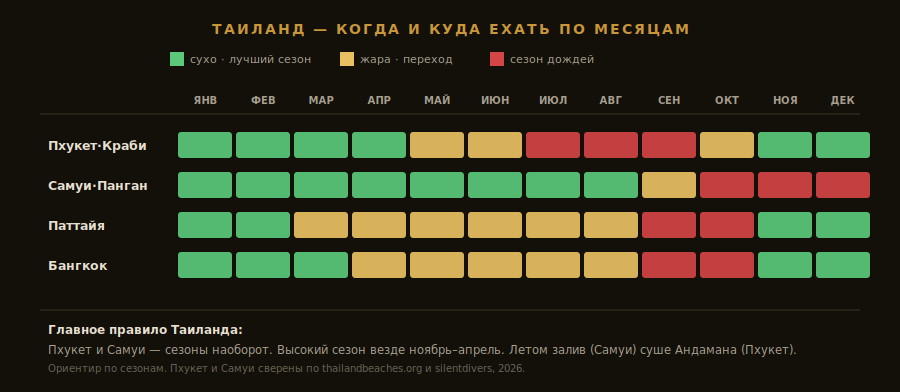

import FlightRoutes from '../../components/post/FlightRoutes.astro';
import PricingCards from '../../components/post/PricingCards.astro';
import AffiliateNote from '../../components/post/AffiliateNote.astro';

Таиланд — самое массовое азиатское направление у россиян, и именно поэтому про него больше всего устаревших советов. Главная ошибка новичка — выбрать остров, не сверившись с сезоном: прилететь на Пхукет в июле под дожди или на Самуи в ноябре под шторм. А ведь сезоны у западного и восточного побережья **противоположны**. Этот гайд — честный разбор без турагентского глянца: виза на 60 дней, какой курорт под ваш месяц, сколько реально стоит и как платить, когда карты не работают.

> **Если коротко:** россиянам виза **не нужна до 60 дней** (безвиз подтверждён на 2026, [АТОР](https://www.atorus.ru/article/tailand-v-2026-godu-vse-chto-nuzhno-znat-pered-poezdkoy-66474)), можно продлить на 30. Прямой **Москва — Пхукет ~9 часов от 15 000 ₽** (Аэрофлот, Azur Air, Nordwind). Главное правило: **Пхукет сухой ноябрь–апрель, Самуи дождлив октябрь–декабрь — сезоны наоборот.** Высокий сезон везде — ноябрь–апрель. Бюджет 14 дней без перелёта — от **$600** (эконом) до **$2500** (комфорт).

<AffiliateNote />

> **Когда лучше ехать:** [таблица сезонов](/seasons/) — для Таиланда ответ зависит от побережья (разбор ниже).

Таиланд держит статус «первого зарубежного пляжа» для россиян не просто так: безвиз на 2 месяца, прямые рейсы из десятков городов, дешёвая еда мирового уровня и инфраструктура под любой бюджет — от хостела за $8 до виллы на скале за $1000 в сутки. Разберём по узлам.

---

## Нужна ли виза в Таиланд россиянам в 2026?

**Нет, до 60 дней — безвиз.** Таиланд сохранил для россиян продлённый безвизовый въезд на **60 дней** и в 2026 году — это официально подтверждено властями. Планы сократить срок до 30 дней обсуждались в 2025-м, но **не были реализованы**.

### Что нужно на въезде

* **Загранпаспорт** со сроком действия **минимум 6 месяцев**
* **Обратный билет** или билет в третью страну
* Иногда — подтверждение брони жилья и средств (просят редко, но право есть)

### Продление и важный нюанс 2026

Безвизовые 60 дней можно **продлить ещё на 30** через иммиграционную службу за пошлину **1900 бат**. Но с конца 2025 года ввели ограничение: пограничники вправе **отказать во въезде тем, кто за год дважды воспользовался схемой «60 + 30»**. Право на продление сохраняется в основном для первых визитов в году ([правила въезда, Aviasales](https://www.aviasales.ru/psgr/article/thailand-entry)). Для обычного отпуска это неважно — 60 дней с запасом хватает. Детали статусов — на странице [визы в Таиланд](/visa/thailand/).

---

## Как добраться до Таиланда из Москвы в 2026?

**Прямые рейсы есть и недорогие.** На Пхукет (HKT) летают Аэрофлот, Azur Air и Nordwind, время в пути **~9 часов 15 минут**. На Бангкок (BKK) — Аэрофлот и S7, тоже около 9 часов. Дальше до островов — внутренние рейсы или паромы.

<FlightRoutes routes={[
 {
 from: 'Москва', to: 'Пхукет (HKT, прямой)',
 flights: [
 { airline: 'Аэрофлот / Azur Air / Nordwind', code: 'прямой', duration: '~9 ч 15 мин', priceFrom: '15 000–35 000 ₽ в одну сторону', priceUrl: 'https://aviasales.tpk.mx/JCSPlC17?erid=2Vtzqxkn4LF&u=https%3A%2F%2Fwww.aviasales.ru%2F%3Forigin_iata%3DMOW%26destination_iata%3DHKT' },
 ]
 },
 {
 from: 'Москва', to: 'Бангкок (BKK, прямой)',
 flights: [
 { airline: 'Аэрофлот / S7', code: 'прямой', duration: '~9 ч', priceFrom: 'от 22 000 ₽ в одну сторону' },
 ]
 },
 {
 from: 'Москва', to: 'Самуи (USM)',
 flights: [
 { airline: 'через Бангкок (Bangkok Airways)', code: 'стыковка', duration: '12–15 ч', priceFrom: 'чаще в составе тура' },
 ]
 },
]} caption="Москва → Таиланд — рейсы в 2026" />

Цены на прямые рейсы удобно мониторить заранее — <a href="https://aviasales.tpk.mx/JCSPlC17?erid=2Vtzqxkn4LF&u=https%3A%2F%2Fwww.aviasales.ru%2F%3Forigin_iata%3DMOW%26destination_iata%3DHKT" class="aff-cta" rel="sponsored">Найти билет Москва — Пхукет</a>реклама: Aviasales сравнивает все авиакомпании сразу, гибкие даты дают разницу до 30%, cookie 30 дней. На Самуи прямого рейса из РФ нет — добираются через Бангкок (стыковка Bangkok Airways) или паромом с материка, поэтому остров чаще берут пакетным туром.

---

## Пхукет или Самуи — куда и в каком месяце ехать

Это **ключевое решение** поездки в Таиланд. Острова на разных побережьях, и муссоны приходят к ним в разное время — почти зеркально.

* **Пхукет и Краби** (Андаманское море, запад): юго-западный муссон бьёт **с мая по октябрь** — дожди, волны, мутная вода для дайвинга. Сухой высокий сезон — **ноябрь–апрель**, лучшее в мире время.
* **Самуи и Панган** (Сиамский залив, восток): сезон дождей сдвинут на **октябрь–декабрь**, пик ливней в ноябре. Зато летом, когда заливает Пхукет, на Самуи суше.

Отсюда правило: **высокий сезон везде — ноябрь–апрель** (особенно декабрь–март). Если едете летом — выбирайте **залив (Самуи), а не Андаман (Пхукет)**: там суше. Ноябрь — момент, когда Пхукет уже сияет, а Самуи ещё домывает дождём. Подробный разбор обоих островов по пляжам, отелям и тусовке — в гиде [Пхукет или Самуи 2026](/blog/phuket-samui-2026/).

---

## Курорты Таиланда — какой выбрать

* **Пхукет** — крупнейший курорт-остров, главный поток россиян. Всё под рукой: десятки пляжей (Патонг — тусовка, Ката/Карон — поспокойнее), аэропорт, развлечения, медицина. Дороже среднего, местами слишком людно.
* **Самуи** — остров в заливе, спокойнее и зеленее Пхукета, хорошие резорты, рядом Панган с Full Moon Party. Добираться сложнее (через Бангкок), потому тише.
* **Паттайя** — самый доступный и ближний к Бангкоку курорт. Бурная ночная жизнь, но городские пляжи средние — за хорошим морем едут на острова Ко Лан и дальше.
* **Краби** — материковое побережье Андамана: известняковые скалы, Рейли, Ао Нанг, отправная точка к островам Пхи-Пхи. Природа и каякинг, чуть дороже.
* **Бангкок** — мегаполис: храмы, рынки, рестораны, шоппинг, бурлящая улица. Не пляж, но обязательная остановка на 2–3 дня и хаб для перелётов.

---

## Сколько стоит поездка в Таиланд в 2026?

**14 дней на одного без перелёта — от $600 (эконом) до $2500 (комфорт).** Перелёт из Москвы добавляет 30 000–70 000 ₽ туда-обратно. Бюджетный тур на двоих стартует от **$1500–2200**.

<PricingCards tiers={[
 {
 tier: 'Эконом',
 emoji: '',
 price: '$600–1000',
 priceNote: '14 дней, 1 чел.',
 features: [
 'Гестхаус/3★ от $20/ночь на двоих',
 'Уличная еда (40–100 бат за блюдо)',
 'Байк или сонгтео',
 'Низкий сезон',
 ],
 },
 {
 tier: 'Комфорт',
 emoji: '',
 price: '$1500–2500',
 priceNote: '14 дней, 1 чел.',
 featured: true,
 badge: 'Оптимум',
 features: [
 '4★ у моря $50–100/ночь',
 'Рестораны + морепродукты',
 'Экскурсии (острова, дайвинг)',
 'Такси Grab/Bolt',
 ],
 },
 {
 tier: 'Премиум',
 emoji: '',
 price: '$4000+',
 priceNote: '14 дней, 1 чел.',
 features: [
 '5★ резорт / вилла с бассейном',
 'Спа, приватные туры',
 'Бизнес-класс перелёт',
 'Пхукет/Самуи топ-линия',
 ],
 },
]} />

Жильё россиянам удобнее бронировать — <a href="https://ostrovok.tpk.mx/w4cAS1wZ?erid=2VtzqvE1cv3" class="aff-cta" rel="sponsored">Забронировать отель в Таиланде</a>реклама: Ostrovok принимает карты МИР, цены как у недоступного россиянам Booking. Точный расчёт под даты — в [калькуляторе](/calculator/). Учтите сезон: летом 4★ стоит ~$40/ночь, зимой тот же номер — свыше $100.

---

## Тур или самостоятельно — что выгоднее

Как и для Вьетнама, в Таиланд **готовый тур часто дешевле сборки по частям** — за счёт чартеров. Особенно это касается Самуи (нет прямого рейса) и высокого зимнего сезона. Для формата «прилетел-полежал 10 дней на Пхукете» пакет с перелётом и отелем обычно выгоднее раздельной брони.

Самостоятельно лучше, если маршрут сложный (Бангкок + острова + север Чиангмай), даты гибкие или хочется бэкпекинга по гестхаусам.

<a href="https://travelata.tpk.mx/Do2A3cgV?erid=2VtzqufPtiT" class="aff-cta" rel="sponsored">Подобрать тур в Таиланд</a>реклама — Travelata сравнивает всех туроператоров, фильтр по линии пляжа и питанию, оплата картой МИР. В высокий сезон пакет часто дешевле отдельного билета.

---

## Тайская кухня — что есть и сколько стоит

Еда — отдельная причина лететь в Таиланд. Уличная порция — **40–100 бат** (~100–250 ₽), ресторан — 200–500 бат.

* **Том ям** — кисло-острый суп с креветками, визитная карточка
* **Пад тай** — жареная рисовая лапша с тамариндом, арахисом и креветкой
* **Том кха** — суп на кокосовом молоке с курицей, мягче том яма
* **Манго стики райс** — клейкий рис с манго и кокосовым соусом, лучший десерт
* **Тайский чай** — оранжевый, сладкий, со льдом и сгущёнкой
* **Морепродукты на гриле** — на островах дёшевы: креветки, кальмары, рыба

Правило желудка стандартное для тропиков: первые дни — бутилированная вода, осторожнее с острым и льдом, аптечка с собой.

---

## Маршрут по Таиланду на 10–14 дней

* **7 дней — один остров.** Пхукет или Самуи по сезону + 1–2 экскурсии (Пхи-Пхи, Джеймс Бонд, симиланы). Под этот формат и берут туры.
* **10 дней — Бангкок + остров.** 2–3 дня в столице (храмы, рынки, рестораны) + перелёт на пляж.
* **14 дней — через всю страну.** Бангкок → север Чиангмай (горы, слоновьи лагеря, ночные рынки) → юг на острова. Внутренние лоукостеры AirAsia/Nok Air стоят $30–50, поэтому переезды быстрые.

Между Бангкоком и островами не ехать автобусами ради экономии — потеряете дни. Внутренний перелёт за $40 окупает себя временем.

---

## Не только пляж: Чиангмай и север

Если есть лишние дни, север Таиланда — это почти другая страна: горы вместо моря, прохладный климат, древние храмы и слоновьи лагеря. Многие добавляют его к пляжу и не жалеют.

* **Чиангмай** — культурная столица севера. Старый город в квадрате крепостных стен с сотней храмов, знаменитые ночные рынки, кулинарные курсы и **этичные слоновьи заповедники** (где слонов не катают, а кормят и купают). Климат заметно прохладнее юга.
* **Чианграй** — севернее, ради двух храмов-шедевров: белоснежного **Ват Ронг Кхун** и синего Wat Rong Suea Ten. Полдня от Чиангмая.
* **Пай** — горная деревня в стиле хиппи, до неё серпантин в 762 поворота. Тёплые источники, каньон, медленный ритм.

Лучшее время для севера — **ноябрь–февраль** (сухо и прохладно). А вот **март–апрель избегайте**: это «burning season», когда крестьяне жгут поля и горы затягивает дымкой. Классическая связка на 2 недели — **Бангкок + Чиангмай + остров** — закрывает все три Таиланда: город, горы и пляж.

---

## Деньги, карты и связь в Таиланде

### Деньги в 2026

* **Валюта** — тайский бат (THB), курс на 2026 — примерно **1 USD ≈ 35 бат**, **1 бат ≈ 2,5 ₽**
* **Карты российских банков (Visa/MC/МИР) не работают** напрямую
* **Что работает:** карты **UnionPay** некоторых банков (снимают баты в банкоматах, но комиссия 220 бат + лимиты), наличные **доллары** на обмен (выгоднее всего в обменниках Super Rich), P2P
* **Виртуальная карта USD/EUR** иностранного эмитента — пополняется по СБП, работает онлайн и в части терминалов. <a href="https://platipomiru.com/?utm_source=traveltribe&utm_medium=cpa" class="aff-cta" rel="sponsored">Выпустить виртуальную карту</a>реклама. Разбор всех способов — [как платить за границей россиянам 2026](/blog/pay-abroad-2026/)
* Меняйте доллары в сетях Super Rich (зелёный/оранжевый) — лучший курс без скрытых комиссий

### Связь — eSIM или местная SIM

Локальные **AIS** и **TrueMove** дают 15–30 ГБ за $8–15 на туристический срок, продаются в аэропорту. Чтобы быть онлайн сразу, удобнее eSIM: <a href="https://airalo.pxf.io/c/1209822/1310283/15608?erid=2VtzqxRWDfm&sharedID=546042_&u=https%3A%2F%2Fairalo.com%2Fru" class="aff-cta" rel="sponsored">Купить eSIM Airalo от $5</a>реклама — активируется до вылета.

### Страховка

Тропики, дайвинг, аренда байков и медузы в сезон — без полиса медицина дорогая ($300+ за день в госпитале). <a href="https://cherehapa.tpk.mx/GmVWjhCN?erid=2VtzquZTwb5" class="aff-cta" rel="sponsored">Оформить страховку для Таиланда</a>реклама — Cherehapa с активным отдыхом (дайвинг, мотобайк) от ~1500 ₽ за 2 недели.

---

## Минусы Таиланда — что не пишут в брошюрах

* **Сезон дождей по побережьям.** Главная ловушка: не тот остров не в тот месяц. Пхукет в июле и Самуи в ноябре — это дожди и волны
* **Аренда байка — частый путь в больницу.** Левостороннее движение, хаос, полиция штрафует без прав категории A. Первые дни — Grab/Bolt
* **Разводы на туристах.** «Сломанный счётчик» в тук-туках, скам с драгоценными камнями и пошив костюмов, завышенный курс у пляжных обменников. Лечится Grab и Super Rich
* **Паттайя не для всех.** Репутация секс-туризма и средние городские пляжи — за чистым морем оттуда едут на острова
* **Медузы и отливы.** В некоторые сезоны на Андамане появляются опасные медузы, на отливах — мелководье. Смотрите флаги на пляже
* **Толпы в высокий сезон.** Патонг и Пхи-Пхи зимой переполнены; за тишиной — менее раскрученные острова и пляжи

---

## FAQ — что чаще всего спрашивают перед Таиландом

### Нужна ли виза в Таиланд россиянам в 2026?

**Нет, до 60 дней — безвиз** (подтверждён на 2026). Нужен загранпаспорт от 6 месяцев и обратный билет. Можно продлить ещё на 30 дней за 1900 бат, но схему «60+30» с конца 2025 ограничили — для отпуска это неважно.

### Сколько лететь до Таиланда из Москвы?

**Прямой рейс Москва — Пхукет около 9 часов 15 минут** (Аэрофлот, Azur Air, Nordwind), Москва — Бангкок ~9 часов. На Самуи прямых рейсов нет — через Бангкок или туром.

### Пхукет или Самуи — что выбрать?

Зависит от сезона: **Пхукет сухой ноябрь–апрель, Самуи дождлив октябрь–декабрь**. Зимой хороши оба, летом — выбирайте Самуи (залив суше). Подробно — в [отдельном гиде](/blog/phuket-samui-2026/).

### Когда лучше всего ехать в Таиланд?

**Ноябрь–апрель** — высокий сухой сезон по всей стране, лучшие месяцы декабрь–март. Лето (май–октябрь) — низкий сезон с дождями на Андамане, но цены ниже и на заливе суше.

### Сколько денег брать в Таиланд?

Бюджетная поездка на 14 дней — от $600 без перелёта, комфортная — $1500–2500. Перелёт туда-обратно 30 000–70 000 ₽, тур на двоих от $1500.

### Работают ли карты МИР в Таиланде?

Нет, российские Visa/MC/МИР напрямую не принимают. Выручают наличные доллары на обмен в Super Rich, UnionPay некоторых банков и виртуальные карты иностранных эмитентов.

### Что обязательно попробовать из еды?

Том ям, пад тай, том кха, манго стики райс, тайский чай, морепродукты на гриле. Уличная порция — 40–100 бат.

### Безопасно ли в Таиланде?

Уровень насилия против туристов низкий. Реальные риски — ДТП на байках, разводы на цене, море в сезон (медузы, отливы, волны на Андамане летом). Страховка и Grab закрывают большинство сценариев.

---

## Что делать дальше

* Сверьтесь с [таблицей сезонов](/seasons/) — точное окно под ваш месяц
* Выбираете остров — читайте [Пхукет или Самуи 2026](/blog/phuket-samui-2026/)
* Статусы и документы — [виза в Таиланд](/visa/thailand/)
* Посчитайте поездку — [калькулятор](/calculator/)
* <a href="https://aviasales.tpk.mx/JCSPlC17?erid=2Vtzqxkn4LF&u=https%3A%2F%2Fwww.aviasales.ru%2F%3Forigin_iata%3DMOW%26destination_iata%3DHKT" class="aff-cta" rel="sponsored">Найти билет Москва — Пхукет</a>реклама — прямой от 15 000 ₽
* <a href="https://travelata.tpk.mx/Do2A3cgV?erid=2VtzqufPtiT" class="aff-cta" rel="sponsored">Подобрать тур в Таиланд</a>реклама — чартер часто дешевле раздельной брони
* <a href="https://cherehapa.tpk.mx/GmVWjhCN?erid=2VtzquZTwb5" class="aff-cta" rel="sponsored">Оформить страховку</a>реклама — с активным отдыхом для тропиков

Думаете между Азией — сравните с [гайдом по Вьетнаму](/blog/vietnam-guide-2026/) или [Бали](/blog/bali-guide-2026/). Свежие отзывы по сезонам — в [@traveltriberu](https://t.me/traveltriberu).

---

*Актуально на: 6 июня 2026. Источники: [АТОР — Таиланд 2026](https://www.atorus.ru/article/tailand-v-2026-godu-vse-chto-nuzhno-znat-pered-poezdkoy-66474), [Aviasales — правила въезда](https://www.aviasales.ru/psgr/article/thailand-entry), [thailandbeaches.org — погода](https://thailandbeaches.org/weather-thailand/), [silentdivers — Самуи vs Пхукет](https://silentdivers.com/climate-in-koh-samui-vs-phuket-for-travelers/).*
