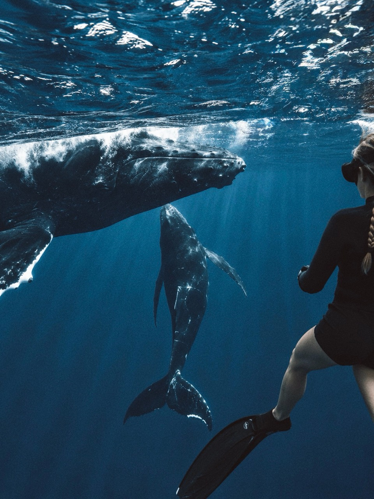
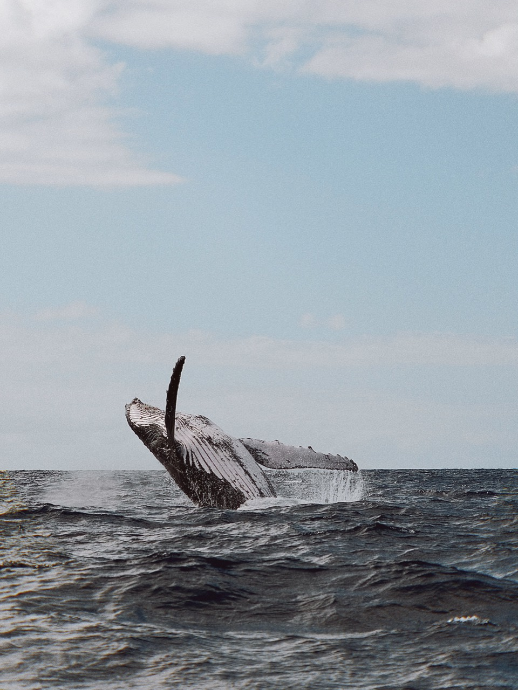
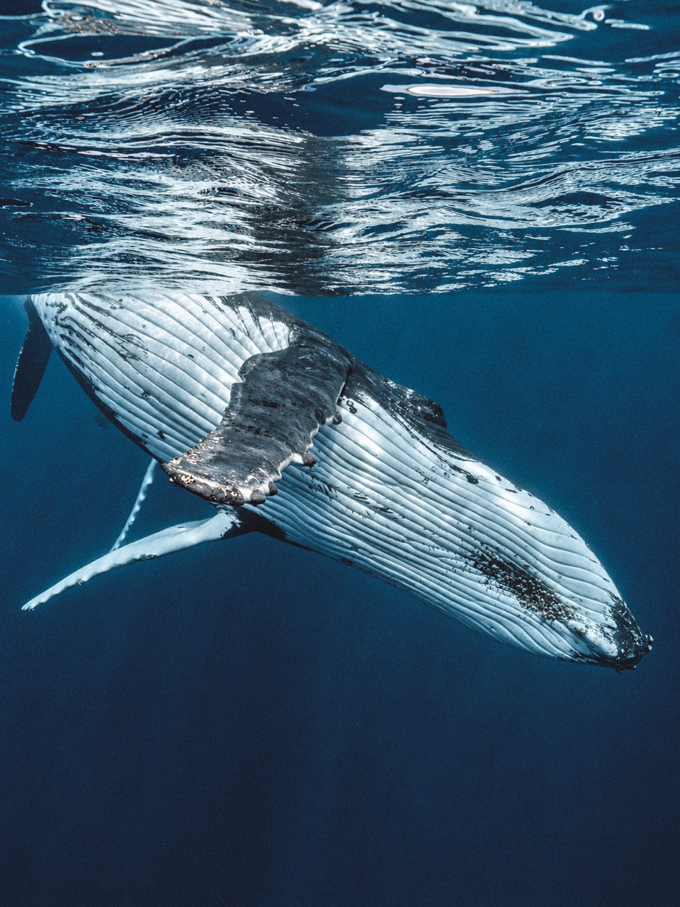
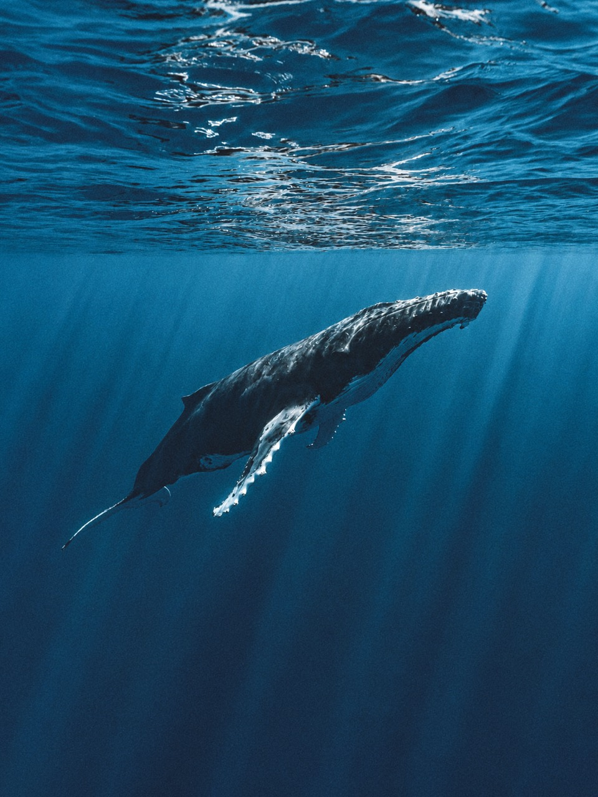

import whaleVideo from './_images/tonga-whales/whale-video.mp4?url';
import whaleVideoPoster from './_images/tonga-whales/whale-video-poster.jpg?url';

**В Тонга я ездил в сентябре и выходил к китам из Нукуалофы с Kingdom Encounters.** Сезон длится с июля по октябрь. Если летите ради китов, оставьте несколько дней для выходов в море: планы могут поменяться из-за погоды. Через Tonga Pocket Guide наблюдение с лодки стоит **NZ$255**, выход с возможностью плавания — **NZ$290** с человека. Тарифы проверены 8 октября 2026 года; мои расходы в поездке здесь не подсчитаны.

Ниже — мои фотографии и видео из той поездки, варианты дороги до Тонга и расходы, которые нужно учесть в бюджете.

*Тонга: два кита и человек в ластах под водой.*

## Где смотреть китов в Тонга, если вы прилетаете в Нукуалофу?

Нукуалофа находится на острове Тонгатапу. **Для моего маршрута не требовался дополнительный перелёт на Вавау:** я выходил к китам с Kingdom Encounters из Нукуалофы. [Оператор указывает Faua Wharf местом отправления](https://book.tongapocketguide.com/kingdom-encounters/whale-watching-in-tongatapu-not-swimming). Это важная география при покупке билетов: в выдаче «киты в Тонга» нередко смешиваются Тонгатапу и Вавау, хотя логистика и проживание у них разные.

Kingdom Encounters — компания, с которой я ездил **смотреть китов**, один из местных операторов, а не перевозчик между островами. У неё есть два разных варианта: наблюдение с лодки и выход с возможностью плавания. Встреча с китами зависит от животных и решения команды; даже билет на плавание не гарантирует входа в воду.

## Когда сезон китов в Тонга и подходит ли сентябрь?

Горбатые киты приходят в воды Тонга **с июля по октябрь**. Моя поездка пришлась на сентябрь, то есть внутри этого сезонного окна. Из этой даты нельзя вывести вероятность встречи для конкретного утра: сезон описывает период присутствия китов, а не расписание их появления у лодки.

Планировать дату удобнее в обратном порядке: сначала выбрать доступные морские выходы, затем перелёты и жильё. Если прибыть вечером перед единственным забронированным выходом, любой перенос самолёта или отмена рейса лодки обнулит шанс. Если даты вынужденно короткие, заранее спросите оператора, что происходит при погодной отмене и можно ли перенести поездку на соседний день.

*Тонга: кит выходит из воды.*

## Сколько дней заложить на китов?

**Мой совет — закладывайте несколько дней для моря**, а к ним отдельные дни прилёта и вылета. План ниже показывает вариант с двумя или тремя морскими днями: дополнительный выход даёт запас на погоду и ещё один шанс увидеть китов в подходящих условиях. Он всё равно ничего не гарантирует.

План на Тонгатапу выглядит так:

| День | Что делать | Где остаётся запас |
| --- | --- | --- |
| Прилёт | Приехать в Нукуалофу, проверить место встречи и прогноз | Не ставить лодку вплотную к международному рейсу |
| 1-й морской день | Выход с оператором | Если условия изменятся, остаются следующие дни |
| 2-й морской день | Второй выход или перенос первого | Решение принимать по погоде и правилам бронирования |
| 3-й морской день, если бюджет позволяет | Дополнительная попытка | Её можно обменять на спокойный день на острове |
| Вылет | Дорога в аэропорт и международный рейс | Не совмещать с морским выходом |

Такой график длиннее «прилетел — увидел — улетел», но именно в нём расходы на длинный перелёт получают смысл. Если хотите остаться только на одну морскую прогулку, честно считайте её шансом, а не обещанной встречей. Другой вариант — включить китов в более длинный маршрут по Океании: для стыковки через Окленд пригодится [путеводитель по Новой Зеландии](/blog/new-zealand-guide-2026/), через Сидней — [путеводитель по Австралии](/blog/australia-guide-2026/). Правила транзита проверяются отдельно от въезда в Тонга.

## Как долететь до Тонга и добраться до выхода в море?

Международная точка входа для этого плана — **Нукуалофа, аэропорт Фуаамоту (TBU)**. Прямые рейсы туда бывают из Окленда, Сиднея, а также Нади и Сувы на Фиджи. Если летите из России, сначала нужно построить маршрут до одного из этих узлов, затем подобрать рейс на Тонгатапу. Частоты, пересадки и цены на сайте перевозчика сверяйте под свои даты: они меняются, а удобная стыковка в одну сторону может не повториться обратно. Для проверки направлений пригодится [страница Tonga Tourism о перелётах](https://www.tongatourism.travel/plan/getting-here).

При сравнении билетов смотрите не только тариф. Важны **длительность пересадки, право въезда или транзита через третью страну, багаж и запас перед морским днём**. Отдельные билеты могут обойтись дешевле, но перенос первого рейса не обязан защищать второй. Если первая часть маршрута проходит через Китай, пригодится [разбор пересадки в Пекине](/blog/peresadka-v-pekine/). Kingdom Encounters отправляется от Faua Wharf в Нукуалофе; место встречи и время подтвердите после бронирования.

В [памятке посольства Тонга](https://tongaembassycn.gov.to/en/going-to-tonga-en/visas-en) граждане России включены в список для **бесплатной гостевой визы по прибытии на 31 день**. Нужен действительный билет на выезд в страну, куда вам разрешён въезд. Требования к сроку действия паспорта и финансовым подтверждениям уточните у [миграционной службы Тонга](https://www.revenue.gov.to/immigration-and-general-services) до покупки невозвратного билета. Отдельно проверьте право въезда или транзита в каждой стране пересадки.

## Сколько стоит выход к китам и вся поездка?

На Tonga Pocket Guide есть [наблюдение с лодки за NZ$255](https://book.tongapocketguide.com/kingdom-encounters/whale-watching-in-tongatapu-not-swimming) и [выход с возможностью плавания за NZ$290](https://book.tongapocketguide.com/kingdom-encounters/swimming-with-whales-in-tongatapu) с человека. Оба варианта описаны как семичасовые и включают обед; в программу с плаванием также входят снаряжение для снорклинга и гидрокостюм. Таблица рассчитана по ценам этой площадки на **8 октября 2026 года**, в новозеландских долларах. Мои расходы за ту поездку здесь не приведены.

| Сколько морских выходов | Только наблюдение с лодки | С возможностью плавания |
| --- | ---: | ---: |
| Один | NZ$255 | NZ$290 |
| Два | NZ$510 | NZ$580 |
| Три | NZ$765 | NZ$870 |

На [собственном сайте Kingdom Encounters](https://kingdomencounters.to/) другие тарифы: **TOP350 за наблюдение и TOP400 за плавание**, в тонганских паанга. Там указан выход с 07:30 до 15:30 — восемь часов. Перед оплатой сравните конечную сумму и условия выбранного канала, включая валюту списания, трансфер от жилья, перенос и возврат. Таблица **не включает** международные перелёты, жильё, питание вне лодки, трансферы, страховку и возможные расходы в стране стыковки.

Назвать честную единую цену «поездки в Тонга из России» без города вылета и дат невозможно: длинные сегменты и число ночей меняют её сильнее, чем один морской день. Собирайте смету в таком порядке: **билеты до TBU и обратно + ночи на Тонгатапу + два или три морских выхода + местный транспорт + резерв**. Зафиксируйте валюту каждого пункта до сложения. Если бюджет ограничен, полезнее сравнить одну и две ночи дополнительного проживания с ценой потерянной попытки, чем покупать самый короткий маршрут ради красивой итоговой цифры.

*Тонга: светлое брюхо и грудной плавник кита под водой.*

## Что происходит на выходе с Kingdom Encounters и можно ли плавать с китами?

Оба варианта начинаются с поиска китов с лодки. **Билет на наблюдение не предполагает плавания рядом с китами**; билет на плавание даёт такую возможность при подходящих условиях. В программе с плаванием одновременно в воду допускают до четырёх клиентов с гидом.

При выборе компании я бы смотрел прежде всего на лицензию, работу гида и поведение лодки рядом с животными. [Правила Тонга для наблюдения и плавания с китами](https://ago.gov.to/cms/images/LEGISLATION/SUBORDINATE/2013/2013-0004/WhaleWatchingandSwimmingRegulations2013_3.pdf) ограничивают группу в воде четырьмя клиентами и одним обученным местным гидом; пловцу нельзя самому приближаться к киту ближе пяти метров. Решение, безопасен ли вход в воду, принимает оператор. Эти ограничения оставляют китам пространство, а человеку не предлагают добиваться кадра любой ценой.

На фотографии с человеком в ластах видно, насколько быстро привычный масштаб меняется под водой. Но кадр не объясняет, как далеко до китов, сколько длилась встреча и кто принимал решение о входе в воду. Именно поэтому я не стал бы покупать тур по одной эффектной фотографии — даже своей. Выбирайте возможность наблюдать диких животных по правилам Тонга; самую близкую встречу обещать никто не может.

*Тонга: кит под поверхностью океана.*

<figure>
  <video src={whaleVideo} poster={whaleVideoPoster} controls preload="none" playsInline width="720" height="1280" style="display:block;width:100%;max-width:480px;height:auto;margin-inline:auto" aria-label="Горбатый кит движется под водой у Тонга">
    Ваш браузер не поддерживает видео.
  </video>
  <figcaption>Кит движется под водой у Тонга.</figcaption>
</figure>

## Что спросить до бронирования?

**Можно ли увидеть китов за один день?** Можно, если погода и животные позволят. Я бы не строил ради этого короткий международный маршрут: один забронированный выход оставляет нулевой запас на отмену.

**Обязательно ли входить в воду?** Нет. У Kingdom Encounters есть отдельная программа наблюдения с лодки. Если выбираете тур с плаванием, само погружение всё равно зависит от условий и решения гида.

**Тонгатапу или Вавау?** Для выхода Kingdom Encounters из Нукуалофы нужен Тонгатапу. Вавау — другой островной маршрут; не покупайте внутренний перелёт, пока не проверили причал выбранного оператора.

**Как проверить обещания тура?** Попросите подтверждение места встречи, состава включённых услуг, условий отмены из-за моря и документов оператора. [Официальный список Tonga Tourism](https://www.tongatourism.travel/see-and-do/whale-watching) помогает проверить, что вы смотрите местного участника рынка, но условия вашего заказа определяет подтверждённое бронирование.

Если поедете за китами в Тонга, оставьте в маршруте время на непредсказуемость. Мои кадры показывают, что такая встреча возможна; несколько заложенных дней помогают дать ей шанс.
