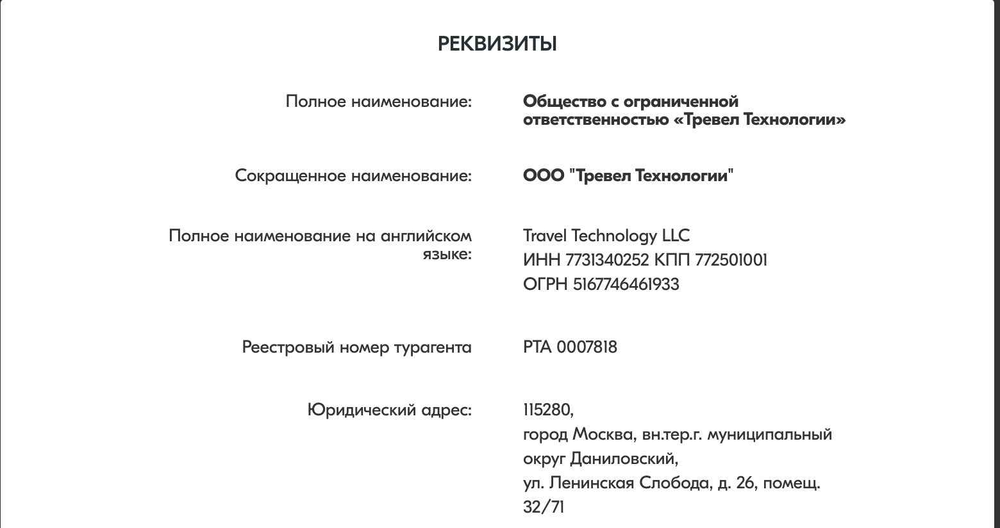
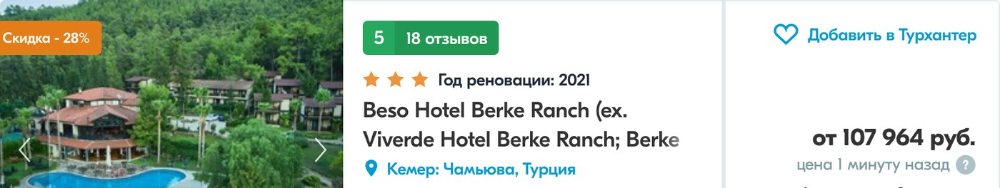
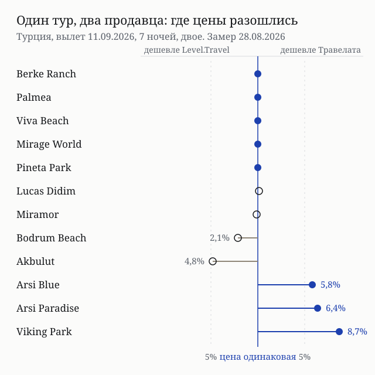
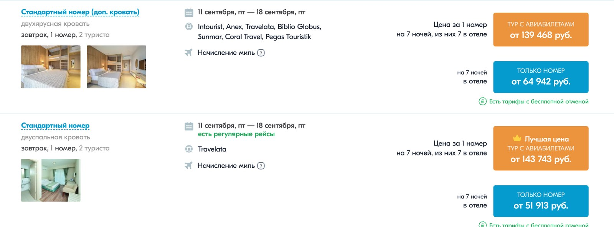

import AffiliateNote from '../../components/post/AffiliateNote.astro';
import { tpkDeep } from '../../data/affiliate.js';

Травелата продаёт туры как **турагент**: в реквизитах на сайте стоит реестровый номер турагента РТА 0007818, а по пункту 6.1 договора за саму поездку отвечает туроператор, который тур собрал. Заработок сервиса по пункту 3.16 равен разнице между ценой на витрине и суммой, которую он передаёт туроператору, и размер этой разницы покупателю не показывают ни на одном шаге.

Отсюда вопрос, ради которого затевался замер: раз наценка не видна, дороже ли покупать тут. 28 августа 2026 года я сверил двенадцать одинаковых туров в Турцию у двух продавцов подряд — и картина оказалась не такой, как обещает витрина.

> **Если коротко:** базовая цена тура принадлежит туроператору, а не площадке. У **пяти гостиниц из двенадцати** цены двух продавцов совпали **до рубля**, ещё у двух разошлись меньше чем на 200 ₽. Ярлык «скидка» на цену не влияет: у пяти гостиниц со скидками **от 12% до 45%** цена вышла ровно такой же, как у конкурента, где никакого ярлыка нет. Где цены расходятся, дешевле оказывается то один продавец, то другой — до **8,7%** в обе стороны. Отдельной строки за услуги сервиса в чеке нет, но по договору вознаграждение есть, и это **неназванная разница**. При отказе от тура удержат фактические расходы, размер которых **заранее не определяется** и может дойти до полной стоимости.

<AffiliateNote />

## Кто продаёт тур и кто за него отвечает

В реквизитах организации на сайте указано: ООО «Тревел Технологии», ИНН 7731340252, ОГРН 5167746461933, **реестровый номер турагента РТА 0007818**. В самом договоре компания названа турагентом прямо — в реквизитах сторон стоит «ТУРАГЕНТ ООО „Тревел Технологии“».

Разница между турагентом и туроператором для покупателя не формальная. По пунктам 1.1 и 1.9 сервис оказывает услуги по бронированию и оплате тура, **сформированного туроператором**, и действует по поручению и за счёт этого туроператора. По пункту 6.1 ответственность за неоказание или плохое оказание услуг несёт туроператор — тот, чьё имя появится в приложении №2 к вашему договору. По пункту 6.11 сервис не отвечает за то, что туроператор не выполнил обязательства или остановил работу.

Практический вывод один: **выбирая тур, вы выбираете и туроператора**, а не только площадку. Его название, реестровый номер и размер финансового обеспечения сервис обязан показать до бронирования — пункт 2.1.2 требует «демонстрации в наглядной форме при подборе и бронировании». В опубликованном тексте договора это поле пустое: приложение №2 — бланк, который заполняется под конкретный заказ.

Отдельная деталь: среди туроператоров в карточке тура встречается имя самого сервиса — «Travelata». Это его собственные пакеты из регулярных рейсов и отдельно закупленных отелей. Кто выступает туроператором по таким пакетам, из публичных документов сайта не следует, и проверить это по государственному реестру туроператоров при подготовке материала не вышло — оба его адреса с моей машины 28 августа не открылись.

## Сколько берёт сервис: строки в чеке нет, вознаграждение есть

Быстрый ответ поисковика на запрос про комиссию Травелаты звучит так: отдельной комиссии для туриста нет. По чеку это правда — строки «комиссия за бронирование» там не будет. По договору картина другая.

Пункт 1.2 говорит, что цена договора состоит из двух частей: цены выбранного тура и **лицензионного вознаграждения компании за использование программы**. Что это за вознаграждение, раскрывает пункт 3.16:

> Лицензионное вознаграждение за использование ПО составляет положительную разницу между указанной в ПО ценой любого туристского продукта [...] и ценой данного туристского продукта в размере денежных средств, передаваемых Компанией третьим лицам (в т.ч. Туроператору).

То есть заработок площадки — это наценка: сколько заплатили вы минус сколько ушло туроператору. Ставки нет, процента нет, потолка нет. Узнать размер из чека нельзя, потому что обе части оплачиваются одной суммой.

К этому добавляется пункт 2.2.2: компания вправе получать от туроператоров и перевозчиков **бонусы, скидки и другие поощрения** за покупку тура или билета и оставлять их себе. Для сравнения: на площадке авторских туров YouTravel комиссия названа и известна заранее — 15% от стоимости тура, и организаторы закладывают её в модель ([мой разбор экономики авторских туров](https://t.me/traveltriberu/676), 12 марта 2026). Здесь такой цифры нет ни в договоре, ни на сайте.

<a href={tpkDeep('travelata', 'https://travelata.ru/turkey', 'travelata_hub_2026')} class="aff-cta" rel="sponsored">Посмотреть цены на туры на свои даты</a> — поиск идёт сразу по нескольким туроператорам, оплата картой российского банка, есть рассрочка; имя туроператора и его реестровый номер показывают на шаге бронирования.

## Один и тот же тур у двух продавцов: замер 28 августа 2026

Сравнивать «от» с «от» по разным гостиницам бессмысленно. Поэтому условия зафиксированы жёстко и одинаково у обоих: **вылет из Москвы 11 сентября 2026 года, 7 ночей, двое взрослых, один номер, тур с перелётом**, цена — минимальная по гостинице. Двенадцать гостиниц взяты из выдачи Травелаты в порядке по умолчанию, затем каждая найдена у Level.Travel по названию.

Цены Травелаты сняты в 12:15 по Москве, цены Level.Travel — с 12:30 до 12:50. Чтобы разрыв не оказался разницей во времени, четыре строки Травелаты я перепроверил в 12:34 — все четыре не изменились.

⚠️ Оба сервиса — наши партнёры, ссылки на них партнёрские. Поэтому в таблице ниже победитель не выбран: там, где конкурент дешевле, так и написано.

| Гостиница | Ярлык на витрине Травелаты | Травелата | Level.Travel | Кто дешевле |
|---|---|---|---|---|
| Beso Hotel Berke Ranch, Кемер | скидка − 28% | 107 964 ₽ | 107 964 ₽ | одинаково |
| Palmea, Мармарис | скидка − 30% | 108 605 ₽ | 108 605 ₽ | одинаково |
| Viva Beach, Аланья | скидка − 12% | 95 945 ₽ | 95 945 ₽ | одинаково |
| Mirage World, Мармарис | скидка − 16% | 149 975 ₽ | 149 975 ₽ | одинаково |
| Pineta Park Deluxe, Мармарис | скидка − 45% | 152 502 ₽ | 152 502 ₽ | одинаково |
| Lucas Didim, Дидим | скидка − 14% | **194 532 ₽** | 194 732 ₽ | Травелата, на 200 ₽ |
| Miramor Garden Resort, Кемер | нет | 153 796 ₽ | **153 617 ₽** | Level.Travel, на 179 ₽ |
| Bodrum Beach Resort, Бодрум | нет | 129 038 ₽ | **126 368 ₽** | Level.Travel, на 2,1% |
| Akbulut Hotel & Spa, Кушадасы | скидка − 32% | 155 315 ₽ | **147 838 ₽** | Level.Travel, на 4,8% |
| Arsi Blue Beach, Аланья | скидка − 21% | **119 425 ₽** | 126 734 ₽ | Травелата, на 5,8% |
| Arsi Paradise Beach, Аланья | скидка − 26% | **120 920 ₽** | 129 255 ₽ | Травелата, на 6,4% |
| Viking Park, Кемер: Кириш | скидка − 24% | **133 293 ₽** | 145 987 ₽ | Травелата, на 8,7% |

Проценты посчитаны от большей из двух цен. Итог по двенадцати строкам: **пять цен совпали до рубля**, две разошлись меньше чем на 200 ₽, пять разошлись заметно — три раза дешевле оказалась Травелата, два раза конкурент.

Совпадение до рубля у пяти гостиниц подряд — не случайность, а ответ на главный вопрос. **Базовую цену ставит туроператор**, и оба агента чаще всего продают её как есть. Расхождение появляется там, где у продавцов разный набор операторов на конкретную дату или разная закупка у одного и того же.

## Что означает ярлык «скидка» на карточке

На карточке гостиницы стоит оранжевая плашка «Скидка − 28%». Ни зачёркнутой цены рядом, ни подсказки, от чего считается процент, на карточке нет — только сам ярлык и цена «от».

Проверить ярлык можно соседней витриной — приём тот же, каким я [ловил зачёркнутые цены у Яндекс Путешествий](/blog/yandex-puteshestviya-kak-rabotaet-2026/). Результат по пяти гостиницам со скидками 12%, 16%, 28%, 30% и 45%: **у всех пяти цена совпала с ценой Level.Travel до рубля**, а там никакого ярлыка нет.

Шестой случай ещё нагляднее. У Akbulut Hotel & Spa плашка обещает «скидку 32%», и при этом тот же тур у конкурента стоит на 7 477 ₽ дешевле — 147 838 ₽ против 155 315 ₽.

Вывод для покупателя: **процент на плашке не сообщает ничего о том, выгодна ли цена**. Сравнивайте сами число в рублях по своим датам, а не размер скидки.

## Тур с перелётом или собрать самому

У Травелаты на странице гостиницы каждая строка показана в двух вариантах сразу: «тур с авиабилетами» и «только номер». Это редкий случай, когда разницу между пакетом и самостоятельной поездкой видно прямо на витрине.

Я снял все одиннадцать номеров Bodrum Beach Resort 4\* на 11–18 сентября 2026 года, двое взрослых, в обоих вариантах:

| Номер и питание | Только номер | Тур с перелётом | Разница |
|---|---|---|---|
| Стандартный, завтрак | 50 448 ₽ | 129 038 ₽ | 78 590 ₽ |
| Стандартный без доп. кровати, завтрак | 51 913 ₽ | 143 743 ₽ | 91 830 ₽ |
| Стандартный с балконом, завтрак | 56 515 ₽ | 148 307 ₽ | 91 792 ₽ |
| Стандартный, две раздельные кровати, завтрак | 60 173 ₽ | 150 992 ₽ | 90 819 ₽ |
| Стандартный с балконом, второй тариф, завтрак | 62 882 ₽ | 153 158 ₽ | 90 276 ₽ |
| Стандартный, без питания | 63 028 ₽ | 153 299 ₽ | 90 271 ₽ |
| Стандартный с двухъярусной кроватью, завтрак | 63 314 ₽ | 155 061 ₽ | 91 747 ₽ |
| Стандартный с двухъярусной кроватью, второй тариф | 64 942 ₽ | 139 468 ₽ | 74 526 ₽ |
| Стандартный типа B, завтрак | 65 647 ₽ | 154 763 ₽ | 89 116 ₽ |
| Просторный с балконом, завтрак | 70 492 ₽ | 162 257 ₽ | 91 765 ₽ |
| Семейный, завтрак | 71 187 ₽ | 161 261 ₽ | 90 074 ₽ |

Разница держится в коридоре **74 526 – 91 830 ₽ на двоих**, середина ряда — 90 276 ₽.

Теперь цена перелёта на те же даты. Москва — Бодрум и обратно 11–18 сентября 2026 года на двоих, снято 28 августа: самый дешёвый прямой рейс — **86 814 ₽** (Аэрофлот, вылет в 07:40), тот же билет **с багажом 23 кг на двоих — 107 510 ₽**; самый дешёвый вариант вообще — 67 918 ₽ с пересадкой.

Сопоставление даёт три факта. Во всех одиннадцати строках разница между туром и номером **меньше 107 510 ₽** — цены прямого перелёта с багажом. В двух строках она меньше даже **86 814 ₽**, то есть по деньгам пакет там обходит один только прямой билет. И ни в одной строке разница не опустилась ниже 67 918 ₽ — самого дешёвого варианта с пересадкой.

**Уточнение от 28 августа 2026 года.** Первая версия этого раздела говорила, что в разницу входят перелёт, трансфер и страховка. Я дошёл до шага выбора рейсов — он открывается без паспортных данных — и увидел, что это неверно. Что там написано дословно для строки за 143 743 ₽:

- **багаж в цену не входит:** «Добавьте багаж 23 кг (ДхШхВ = 203 см) после выбора перелётов **за 15 120 ₽**». В цене только ручная кладь 10 кг;
- **трансфер платный** — в карточке рейса стоит «Доступен платный трансфер», а не «включён»;
- **медицинская страховка включена**, услуга визового оформления — нет;
- у самого дешёвого варианта туда прямой рейс Аэрофлота, а **обратно перелёт с пересадкой, 23 часа 5 минут в пути** и прилёт в другой московский аэропорт.

Считаем ту же строку заново. Разница «тур минус номер» — 91 830 ₽, и за неё дают перелёт с ручной кладью плюс страховку. Прямой билет туда-обратно на те же даты стоит **86 814 ₽**, то есть пакет тут **дороже на 5 016 ₽**. С багажом сравнение переворачивается: 91 830 плюс 15 120 — это 106 950 ₽ против 107 510 ₽ у билета с багажом, пакет дешевле на 560 ₽.

Вывод честнее прежнего: **пакет не отдаёт перелёт дешевле рынка, он идёт с ним вровень** — и только если багаж нужен. Выигрыш появляется на тех строках, где разница держится у нижней границы коридора.

⚠️ Считать разницу чистой ценой перелёта всё равно нельзя. «Только номер» и «тур» — два разных продукта, и отель в них закупается по-разному. Коридор показывает порядок величины, а не смету; что входит в конкретный тур, написано на шаге выбора рейсов, и смотреть надо там.

## Отказ, перенос и возврат денег

Здесь у покупателя больше всего иллюзий, поэтому по пунктам договора.

**Отказ.** По пункту 5.4 при отказе от тура покупатель возмещает фактически понесённые расходы. Договор прямо предупреждает: конкретный размер устанавливается в каждом случае и **не может быть определён заранее**, чартерные и часть регулярных билетов куплены по невозвратному тарифу, а расходы «в некоторых случаях» доходят до полной стоимости тура. Никакой шкалы удержаний по дням до вылета в договоре нет.

**Час подачи заявления решает сумму.** Пункт 5.8: заявление, отправленное в рабочий день **до 18:00 по Москве**, туроператор обрабатывает в тот же день; после 18:00, в выходной или праздник — на следующий рабочий день. Размер удержаний считается на дату фактической обработки. Между вечером пятницы и утром понедельника сумма может измениться, и сервис за это не отвечает.

**Кто возвращает деньги.** По пункту 3.14 возврат идёт по поручению и за счёт туроператора; сервис не обязан возвращать деньги за свой счёт, пока туроператор не вернул их ему.

**Перенос дат.** По пункту 5.1 сервис вправе, но не обязан согласовать изменения, услуга по их обработке **платная**, и при последующем отказе её стоимость не возвращается.

**Доплата после оплаты.** Пункт 3.12 разрешает пересчёт цены с доплатой при росте транспортных тарифов, новых налогах и сборах или изменении курса валют — в том числе после полной оплаты, с согласия покупателя.

**Претензия.** По пункту 6.3 претензию к качеству тура предъявляют **туроператору** в письменной форме в течение 20 дней после окончания договора, рассматривают её 10 дней. Претензии к самой площадке идут по пользовательскому соглашению на pravo@travelata.ru, срок ответа — 30 дней.

## Кому Травелата не подходит

- **Тем, кто хочет видеть наценку продавца.** Её нет отдельной строкой ни на витрине, ни в чеке, и по договору она равна разнице, размер которой не раскрывается.
- **Тем, кто выбирает по проценту скидки.** Ярлык на карточке не связан с выгодой: по пяти гостиницам из пяти цена со «скидкой» совпала с ценой конкурента без скидки.
- **Тем, кому нужна предсказуемая отмена.** Шкалы удержаний нет, размер расходов определяет туроператор в день обработки заявления.
- **Тем, кто едет по гибкому плану.** Перенос дат платный и требует согласия туроператора, замена данных туристов — тоже отдельный запрос с возможной доплатой (пункт 3.4).
- **Тем, кто летит без багажа.** Багаж 23 кг в пакет не входит и стоит 15 120 ₽ сверху; без него перелёт внутри тура выходит дороже обычного билета.
- **Тем, кому важен обратный рейс.** У дешёвых пакетов обратная дорога бывает с пересадкой и на сутки в пути, а прилёт — в другой аэропорт, чем вылет.

Кому подходит: тем, кому нужен готовый пакет на неделю в Турции, Египте или Эмиратах с трансфером и страховкой, и кто согласен на фиксированные даты в обмен на цену перелёта ниже рыночной.

<a href={tpkDeep('travelata', 'https://travelata.ru/turkey', 'travelata_hub_2026_final')} class="aff-cta" rel="sponsored">Сравнить туры на свои даты от 95 945 ₽ за двоих</a> — цена «от» указана за весь тур с перелётом на неделю по замеру 28 августа 2026 года, свои даты и своя гостиница считаются отдельно.

Как устроена денежная сторона у соседних сервисов, разобрано в статьях о том, [кто продаёт билет на Авиасейлсе и какие берёт сборы](/blog/aviasales-2026/), [сколько Туту.ру добавляет к цене перевозчика](/blog/tutu-ru-2026/) и [что берёт с брони Яндекс Путешествия](/blog/yandex-puteshestviya-kak-rabotaet-2026/). Куда и когда ехать в самой Турции — в [гиде по стране](/blog/turkey-guide-2026/).

## FAQ — частые вопросы про Травелату

**Берёт ли Травелата комиссию сверх цены тура?**
Отдельной строки в чеке нет, но вознаграждение есть. По пунктам 1.2 и 3.16 договора цена состоит из цены тура и лицензионного вознаграждения сервиса, которое равно разнице между ценой на витрине и суммой, переданной туроператору. Ставка и потолок в договоре не названы.

**Дороже ли покупать тур здесь, чем у конкурента?**
По замеру 28 августа 2026 года — не системно. Из двенадцати одинаковых туров пять стоили одинаково до рубля, две пары разошлись меньше чем на 200 ₽, а из пяти заметных расхождений три раза дешевле была Травелата и два раза Level.Travel. Разрыв доходил до 8,7% в обе стороны.

**Что значит «скидка − 45%» на карточке?**
От чего считается процент, на карточке не написано, цены-основы рядом нет. У пяти проверенных гостиниц цена «со скидкой» совпала до рубля с ценой у конкурента, где ярлыка нет.

**Кто отвечает, если отель окажется не тем или туроператор остановит работу?**
Туроператор. Пункты 6.1 и 6.11 договора возлагают ответственность за услуги на него, а сервис отвечает за бронирование, оплату и передачу документов. Имя туроператора и его реестровый номер показывают на шаге подбора и бронирования.

**Сколько удержат, если отказаться от тура?**
Заранее неизвестно. Пункт 5.4 говорит о возмещении фактических расходов без шкалы по дням и предупреждает, что они могут достигать полной стоимости тура: чартерные билеты невозвратные. Заявление лучше подавать в рабочий день до 18:00 по Москве — по пункту 5.8 позже оно уйдёт в обработку следующим рабочим днём, а сумма считается на дату обработки.

**Входит ли багаж в цену тура?**
Не обязательно, и это видно только на шаге выбора рейсов. В проверенном 28 августа 2026 года туре багаж 23 кг предлагали добавить за 15 120 ₽, а в цену входила лишь ручная кладь 10 кг. Трансфер там же помечен как платный, включена только медицинская страховка. Смотреть состав нужно в карточке конкретного рейса, а не в цене на витрине.

**Когда списываются деньги при бронировании?**
По пункту 3.5 при оплате сумма замораживается на карте; списание происходит после подтверждения тура туроператором. При оплате части цены остаток вносят в течение трёх дней после подтверждения (пункт 3.6).

**Кто такая Травелата юридически?**
ООО «Тревел Технологии», ИНН 7731340252, ОГРН 5167746461933, реестровый номер турагента РТА 0007818, адрес: Москва, улица Ленинская Слобода, 26. Компания — участник «Сколково» (регистрационный номер 1121707), договор распространяется на отношения с 1 января 2024 года.

**Обязана ли витрина продать тур по показанной цене?**
Нет. Пункт 3.1 договора говорит, что содержимое сайта носит информационный характер и публичной офертой не является. Цена подтверждается на шаге бронирования.

*Фото: Mustang Joe / Wikimedia Commons / [CC0](https://creativecommons.org/publicdomain/zero/1.0/deed.en/). Скриншоты сервиса сняты нами 28 августа 2026 года. Цены двенадцати туров и одиннадцати номеров сняты 28 августа 2026 года и меняются в течение дня; условия — по публичной оферте сервиса и пользовательскому соглашению на ту же дату. Материал описывает условия договора и не заменяет юридическую консультацию.*
