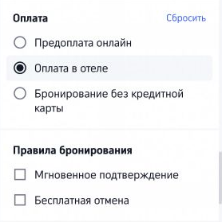
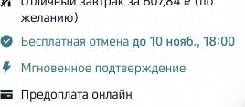
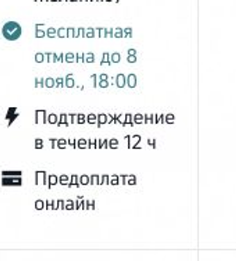
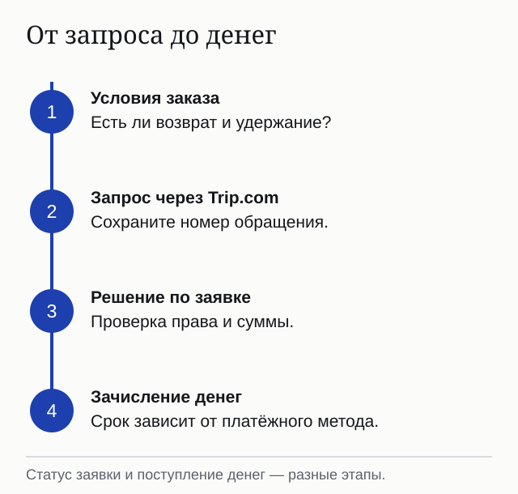

import { ostrovokSearch } from '../../data/affiliate.js';

**Перед оплатой на Trip.com проверьте, кто списывает деньги: сервис сейчас или отель при заселении.** Российская карта может подойти для онлайн-платежа; возможность расплатиться ею в зарубежном отеле нужно уточнять отдельно. Затем посмотрите условия отмены и документ, который получите после покупки: для отеля это подтверждение бронирования, для перелёта — билет.

Сохраните условия выбранного тарифа с последнего экрана: сумму, валюту, питание и срок бесплатной отмены, если она предусмотрена. Именно эти условия понадобятся при споре о платеже или возврате.

## Кто возьмёт деньги: сервис или отель

У одного и того же отеля могут быть номера с **предоплатой онлайн** и с **оплатой на месте**. Trip.com прямо разделяет эти случаи в [условиях бронирования](https://ru.trip.com/contents/service-guideline/terms.html?curr=RUB&locale=ru-RU): для первого сумма на экране платежа списывается сейчас, для второго деньги потребуются при заселении. Бронь с оплатой на месте не превращается в предоплаченную от того, что вы вводили карту для гарантии.

| На карточке тарифа | Что проверить до подтверждения | Почему это важно |
|---|---|---|
| «Оплатить сейчас» | Валюта, окончательная сумма, кому идёт платёж, питание и отмена | В выбранной валюте цена онлайн фиксируется на экране оплаты; возможные сборы банка и конвертация зависят от способа платежа. |
| «Оплатить в отеле» | Валюта оплаты, депозит и способы, которые принимает сам отель | Российская карта, пригодная для платежа на Trip.com, может не работать в терминале зарубежного отеля. |
| «Бесплатная отмена» | Точная дата и час окончания, часовой пояс, штраф после срока | Бесплатный возврат относится к выбранному номеру и сроку, а не ко всему сайту. |

На странице поиска есть отдельные фильтры **«Предоплата онлайн»** и **«Оплата в отеле»**. Они полезны как первый отбор, но не заменяют проверку отдельного тарифа: один объект размещения может показывать несколько вариантов с разными условиями. Короткий путь к решению — сначала выбрать способ оплаты в фильтре, затем открыть выбранный номер и проверить его правила непосредственно перед заказом.

Если тариф требует оплату в отеле, заранее спросите объект, чем можно рассчитаться и нужен ли залог. Не рассчитывайте, что способ, доступный в приложении, автоматически будет работать на стойке. Если поездка зависит от оплаты российской картой, выбирайте вариант, где **доступная вам онлайн-оплата показана до подтверждения**, и сохраняйте итоговую сумму вместе с правилами номера.

Если нужен запасной вариант, сравните [тот же отель на Островке](/blog/ostrovok-2026/) и <a href={ostrovokSearch('trip_com_2026_compare')} class="aff-cta" rel="sponsored">проверьте доступные тарифы на Островке</a>. Сравнивайте не первую цену в выдаче, а финальный экран одного и того же номера с теми же условиями отмены. У Trip.com можно открыть [поиск отелей напрямую](https://ru.trip.com/hotels/) и проверить вторую сторону сравнения.

## Можно ли оплатить картой российского банка

На [русскоязычной странице Trip.com об оплате](https://ru.trip.com/guide/info/trip-com-%D0%BC%D0%BE%D0%B6%D0%BD%D0%BE-%D0%BB%D0%B8-%D0%BE%D0%BF%D0%BB%D0%B0%D1%82%D0%B8%D1%82%D1%8C-%D1%80%D0%BE%D1%81%D1%81%D0%B8%D0%B9%D1%81%D0%BA%D0%BE%D0%B9-%D0%BA%D0%B0%D1%80%D1%82%D0%BE%D0%B9.html) сервис сообщает о возможности платить российской картой при выборе рублёвой валюты. Это утверждение о возможностях площадки. **Обещать, что конкретная карта пройдёт для любого отеля или билета, по справке нельзя**: способ оплаты и итоговая сумма должны появиться на последнем шаге вашего заказа.

В [условиях Trip.com](https://ru.trip.com/contents/service-guideline/terms.html?curr=RUB&locale=ru-RU) есть две денежные оговорки, которые легко пропустить. При оплате в другой валюте банк или другой платёжный поставщик может использовать собственный курс и взять сбор. При оплате на месте курс между оформлением брони и заселением может измениться. Сравнение двух цен без валюты и способа расчёта поэтому неполное.

Если платеж не прошёл, сначала проверьте статус заказа и списание в банке. Сам Trip.com советует **не вносить оплату повторно до выяснения статуса**: иначе можно получить два запроса на платёж. Номер бронирования и переписку с поддержкой сохраните.

Если после выбора рублёвой валюты в конкретном заказе нет нужной карты среди доступных способов, публичное обещание на странице помощи эту проблему не решает. Не переносите данные карты в обход обычного экрана оплаты и не просите отель принять перевод «напрямую» по сообщению в чате: сначала выясните, относится ли такой запрос к вашему действительному заказу. Когда оплату требует сам отель, уточнять надо его способы расчёта, а не список способов оплаты Trip.com.

## Что должно прийти после покупки

Подтверждение оплаты, бронь отеля и выписанный авиабилет — не одно и то же. Для отеля Trip.com обещает прислать подтверждение по почте; если номер не подтвердится, по условиям предусмотрен полный возврат. Отель иногда ещё не видит данные гостя сразу после подтверждения: сервис советует обратиться в его поддержку, если это вызывает сомнения, а не покупать второй номер наугад.

Для перелёта Trip.com сначала может прислать письмо об успешной оплате. **Проверьте отдельное подтверждение оформления билета и код бронирования авиакомпании**: по условиям площадки они приходят после выписки. Если срок выпуска, показанный при покупке, прошёл без билета, обратитесь в поддержку с номером заказа.

Именно здесь пригодится простая проверка статуса. Для отеля сопоставьте номер заказа Trip.com, письмо с подтверждением и, если заселение скоро, ответ самого объекта размещения. Для авиабилета найдите код перевозчика и откройте бронирование на его сайте. Если код не распознаётся сразу после оплаты, сравните со сроком выписки, показанным в заказе; платёж может предшествовать выпуску билета. После этого обращайтесь в поддержку с точным номером заказа, рейсом и временем платежа, не покупая дубль наугад.

Перед вылетом откройте заказ у перевозчика и сверьте имя, даты, багаж и время регистрации. Trip.com указывает, что сведения о багаже и специальных услугах нужно уточнять у авиакомпании. Для сложной стыковки проверьте, оформлены ли сегменты одним билетом и распространяется ли на них заявленная гарантия самостоятельной пересадки. Разбор выбора билета и продавца есть в [проверке Авиасейлса](/blog/aviasales-2026/).

## Как отменить бронь и вернуть деньги

**Единого правила возврата у Trip.com нет.** Условия изменения и штраф показывают для выбранного номера либо авиабилета **до оплаты** и повторяют в данных заказа. Дешёвый невозвратный тариф может оказаться дороже гибкого, если даты ещё не окончательные. Сервис принимает обращение; право на возврат и возможные удержания определяются условиями конкретного заказа. При расхождении условий поставщика и условий Trip.com его общие правила устанавливают приоритет условий площадки.

Для отеля начните с письма о бронировании или раздела заказов: **если выбранный тариф допускает бесплатную отмену**, там указан её крайний срок и последствия пропуска. У невозвратного варианта такого срока может вообще не быть. Если условия непонятны, обратитесь в поддержку до нажатия кнопки отмены. Для авиабилета сначала посмотрите право на обмен и возврат, затем размер сборов; разрешённый запрос можно подать из заказа или через поддержку, в том числе по адресу электронной почты, использованному при покупке без аккаунта.

В открытой карточке одного отеля в Пекине разные варианты номера показывали разные сроки бесплатной отмены и подтверждения. Это хороший пример того, почему общая метка «Бесплатная отмена» в поиске ничего не обещает без открытия тарифа. На фрагменте экрана показаны срок отмены, скорость подтверждения и онлайн-предоплата одного варианта; тарифы и доступность меняются.

При обычном возврате Trip.com указывает **тот же способ оплаты, которым платили первоначально**, если стороны не договорились иначе. Дату фактического зачисления определяет банк или другой поставщик счёта. Поэтому «заявка принята» и «деньги уже на карте» — разные статусы. Сохраните подтверждение отмены и номер заказа; при споре нужны именно они, а не скриншот рекламной цены.

## Какие проблемы встречаются в отзывах

Отзывы о Trip.com помогают составить список вопросов к заказу: прошла ли оплата, когда выдали билет, как работала поддержка, сколько ждали возврата. Но даже подробный чужой отзыв **не заменяет условия вашего тарифа**. В нём могли быть другой отель, другой продавец билета, способ оплаты и месяц поездки.

Для этого разбора сопоставлены **шесть отдельных рассказов, опубликованных с марта по август 2026 года** на Отзовике. Это выбранные случаи, а не случайная или репрезентативная выборка; по ним нельзя вычислить частоту проблем у всех клиентов. [Один гость описал спокойное заселение и оплату картой МИР](https://otzovik.com/review_18568578.html). [Другая путешественница рассказала, что после обращения в поддержку отель сменил номер, а сервис начислил компенсацию](https://otzovik.com/review_18410100.html). В том же рассказе есть и оговорка: фотографии гостиниц расходились с действительностью, а билет на поезд сначала не был оформлен после списания денег, хотя возврат пришёл на следующий день. Это опыт конкретных заказов, не гарантия для нового.

С противоположной стороны, [покупатель апартаментов сообщил, что не получил данные для заселения и спорил о компенсации после повторной брони](https://otzovik.com/review_18551305.html). [Другой пользователь писал о проблеме с доступом к брони у авиакомпании для докупки багажа](https://otzovik.com/review_18370075.html). [В отзыве о рейсе из Катара в Москву покупатель отметил удачную оплату российской картой и цену](https://otzovik.com/review_18239874.html), а [в шестом рассказе описан беспроблемный возврат после отмены рейса](https://otzovik.com/review_18320799.html). Жалобы и похвалы здесь относятся к разным видам услуг; часть деталей нельзя проверить вне рассказа автора. Их общий практический смысл — держать под рукой правила заказа, код перевозчика и подтверждение оплаты, чтобы при споре обсуждать конкретный случай.

Отдельно проверяйте, **о ком отзыв**: о самой площадке, о гостинице или о перевозчике. Trip.com публикует рейтинги отелей и сам предупреждает в условиях, что звёздность в разных странах означает разное. Если для вас важны раннее заселение, депозит или доступность номера, спросите отель напрямую и сохраните ответ. Для оценки собственного заказа полезнее подтверждение с точными условиями, чем средний балл приложения.

Эта статья не присваивает сервису рейтинг надёжности. Нет проверенной серии одинаковых оплаченных бронирований и возвратов, по которой такой рейтинг можно было бы честно посчитать.

## Как сравнить цену с другим сервисом

Сравнивайте **один отель, те же даты, ту же категорию номера, питание, предоплату и крайний срок бесплатной отмены**. Цена «от» на двух сайтах без этих полей — разные товары. Добавьте к сравнению валюту, возможный сбор банка и платёж на месте. Только после этого видна стоимость удобства и гибкости.

Для второго варианта можно открыть [разбор Островка](/blog/ostrovok-2026/) и снять цену на **те же даты**. В том замере цена после входа в аккаунт отличалась от открытой, поэтому сравнивать нужно оба последних экрана, а не рекламные карточки. <a href={ostrovokSearch('trip_com_2026_final')} class="aff-cta" rel="sponsored">Сверить итоговые условия номера на Островке</a>. Островок не обязательно окажется дешевле Trip.com: сравнение имеет смысл только при совпадении условий.

Особенно внимательно сопоставляйте питание. В одном тарифе завтрак может входить в цену, в другом предлагаться как отдельная доплата уже на месте. Сравнение «номер за ночь» без стоимости завтрака создаёт ложную экономию для поездки, в которой вы всё равно собирались завтракать в отеле. То же относится к депозиту, местному сбору и валюте расчёта. Если поставщик показывает скидку за вход в аккаунт, сравните итог после входа с условиями на другой площадке; одинаковое название отеля ещё не означает одинаковый продукт.

Если вместо отеля нужен апартамент, формат договора другой: [как работает Суточно.ру](/blog/sutochno-ru-2026/). Не переносите его правила отмены на гостиницу в Trip.com.

## Порядок перед нажатием «Оплатить»

1. Выберите **конкретный тариф**, а не только отель или рейс. Запишите даты, имена, багаж, питание и тип отмены.
2. Проверьте **кто берёт деньги**: Trip.com сейчас или поставщик на месте. Для поездки с российской картой это решающий разворот.
3. Посмотрите окончательную **валюту и сумму** на шаге оплаты. Если валюты отличаются, учтите курс и возможный сбор банка.
4. Сохраните условия отмены вместе с часом дедлайна. Не полагайтесь на общую фразу «бесплатная отмена» без даты.
5. После платежа сохраните номер заказа, письмо и квитанцию. Для перелёта дождитесь **выписанного билета и кода авиакомпании**.
6. При ошибке оплаты или отсутствии подтверждения проверьте статус и обратитесь в поддержку **до повторного платежа**.

Trip.com полезен, когда нужный тариф предлагает оплату онлайн доступным способом и его условия устраивают вас до покупки. Если платить нужно только на месте, карта не проходит на последнем шаге или вам нужна бесплатная отмена до определённой даты, сначала подберите подходящий тариф или продавца. Публичная справка сервиса не заменяет ответ на эти три вопроса в вашем заказе.
