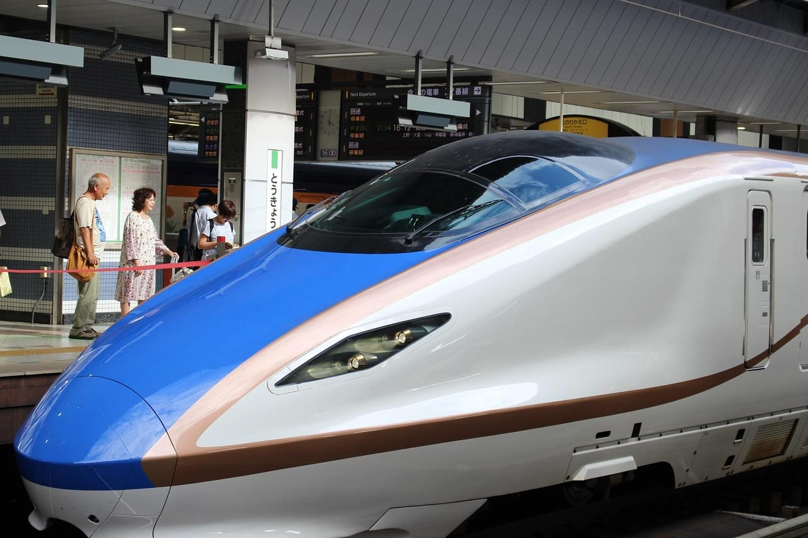
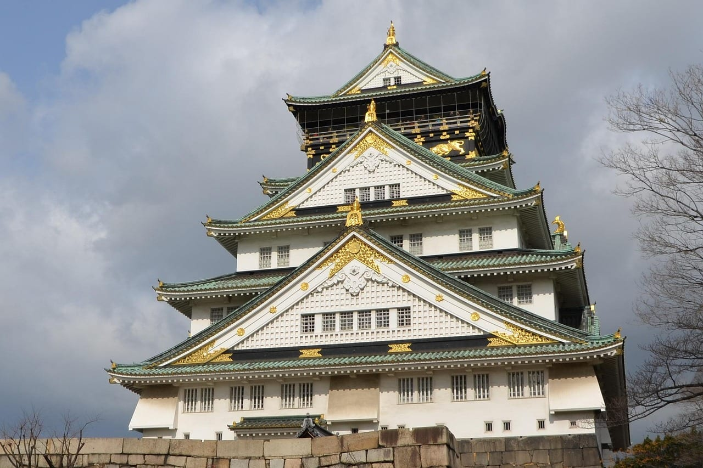
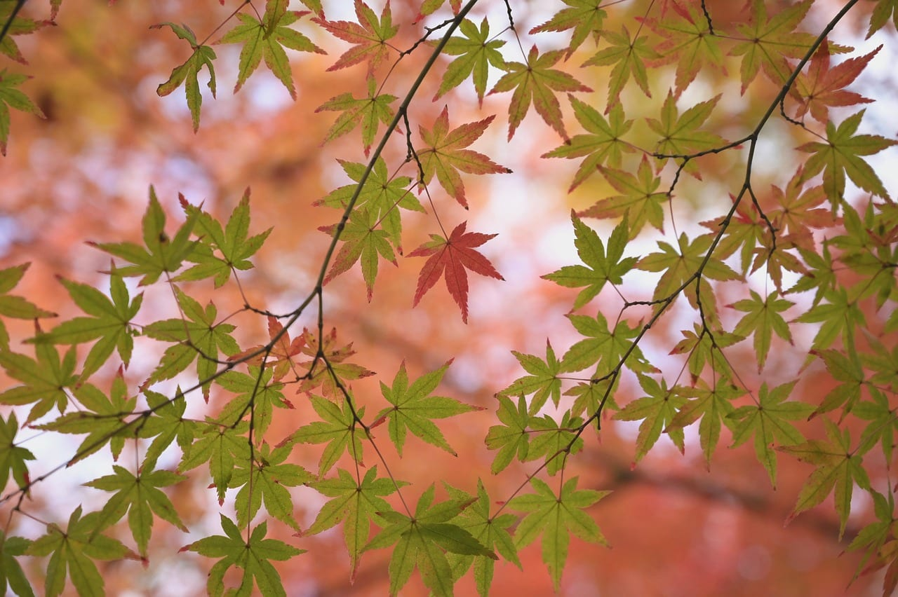
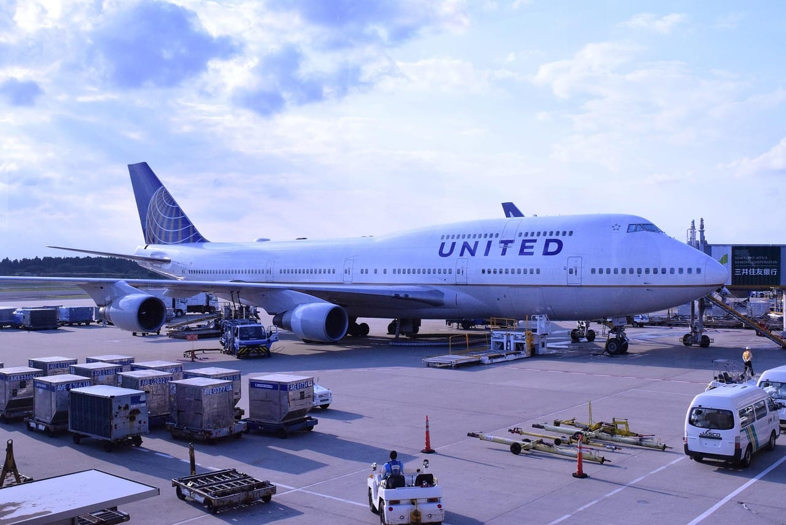

import AffiliateNote from '../../components/post/AffiliateNote.astro';
import { aviasalesRoute, cherehapaCountry, youtravelCountry } from '../../data/affiliate.js';

export const flight = aviasalesRoute('MOW', 'TYO', 'tur_yaponiya_2027_flight', 11);
export const tours = youtravelCountry('japan', 'tur_yaponiya_2027_tours');
export const insurance = cherehapaCountry('japan', 'tur_yaponiya_2027_insurance');

<AffiliateNote />

**Неделя в Токио на двоих с перелётом стоит у туроператора 255–337 тысяч ₽ в четвёрке и 516 тысяч в пятизвёздочном Imperial** — это живые цены Туту на 9 сентября 2026 года, вылет из Москвы 12 ноября. Витринное «от 117 513 ₽» у Левел Тревел — про другую поездку: это тоже двое, но 3 ночи вместо семи, отель у аэропорта Ханэда и даты 7–10 июня, то есть низкий сезон.

Больше половины этой суммы — перелёт. Дальше разбираем, что остаётся на всё остальное, когда пакет выгоднее самостоятельной сборки, а когда вы переплачиваете за то, что сделали бы сами за вечер.

## Сколько стоит тур в Японию из Москвы

Замер 9 сентября 2026 года, вылет 12 ноября, 7 ночей, цена за двоих с перелётом:

| Отель в Токио | Ночей | Цена на двоих |
|---|---:|---:|
| The Celestine Tokyo Shiba 4* | 7 | 255 541 ₽ |
| Mitsui Garden Ginza Premier 4* | 7 | 285 051 ₽ |
| Shinjuku Washington 4* | 7 | 289 527 ₽ |
| Park Hotel Tokyo 4* | 7 | 293 456 ₽ |
| Keio Plaza 4* | 7 | 336 670 ₽ |
| Imperial 5* | 6 | 516 466 ₽ |

Источник — витрина Туту на 9 сентября 2026 года. Рядом полезно посмотреть, как устроено витринное «от». У Левел Тревел в заголовке страницы стоит «цены от 117 513 ₽», а мелким шрифтом расшифровано: Red Roof Inn Kamata у аэропорта Ханэда, двое взрослых, **3 ночи**, 7–10 июня. Разница с нашей таблицей — не в числе людей, а в трёх вещах сразу: вдвое меньше ночей, отель у аэропорта вместо центра и июнь вместо ноябрьского пика. На той же странице Левел Тревел показывает и обычную цену: Intercontinental Tokyo Bay на 22–29 сентября, 7 ночей — от 332 914 ₽. Вот это число сравнимо с нашей таблицей.

*Между городами в Японии ездят синкансеном. В пакетный тур поездки между городами обычно не входят.*

Ноябрь взят не случайно: это момидзи, сезон красных клёнов, и по спросу он вровень с сакурой. На датах вне пика цифры будут ниже, на Новый год и Золотую неделю — выше.

## Что входит в тур, а что придётся доплатить

В пакете обычно перелёт с пересадкой, отель с завтраками, трансфер из аэропорта и визовая поддержка. Дальше начинается то, за что платят отдельно, и в сумме это не мелочь.

**Виза.** Консульский сбор Япония с россиян не берёт — платите только сервис визового центра, 970 ₽ в Москве и Петербурге. Подробный список документов и что изменилось с 10 августа 2026 года — в разборе [визы в Японию](/blog/japan-visa-2026/). «Визовая поддержка» в туре означает, что оператор соберёт пакет за вас, а не что виза бесплатна для вашего кошелька.

**Сбор при вылете.** С 1 июля 2026 года Япония берёт с каждого улетающего 3 000 иен — по курсу ЦБ на 9 сентября 2026 года (100 ¥ = 56,2609 ₽) это 1 688 ₽. До июля брали 1 000 иен, то есть 563 ₽. Ставку подняли втрое, и платят её все, включая японцев ([Управление туризма Японии](https://www.mlit.go.jp/kankocho/content/001996464.pdf)). Обычно сбор зашит в цену билета, но у билетов, выписанных до 30 июня 2026 года, действует старая ставка — переходная мера прописана в том же документе.

**Питание.** Завтраки в пакете есть, остальное нет.

**Транспорт между городами.** Токио — Киото на синкансене Nozomi стоит 14 170 иен, это 7 972 ₽ в одну сторону на человека. Групповой экскурсионный тур переезды включает, а тур «перелёт плюс отель в Токио» — нет.

**Входные билеты и экскурсии** сверх программы.

## Сколько остаётся на отель, если вычесть перелёт

Вот арифметика, которую туроператор не показывает. Перелёт Москва — Токио туда-обратно на 12–20 ноября стоит 64 655 ₽ на человека, а по соседним датам ноября разброс 64 655–89 295 ₽ (Авиасейлс, 9 сентября 2026 года). На двоих по нижней границе — 129 310 ₽.

Вычитаем из пакета:

| Тур | Цена на двоих | Минус перелёт | Остаётся на ночь |
|---|---:|---:|---:|
| Celestine 4*, 7 ночей | 255 541 ₽ | 126 231 ₽ | 18 033 ₽ |
| Keio Plaza 4*, 7 ночей | 336 670 ₽ | 207 360 ₽ | 29 623 ₽ |
| Imperial 5*, 6 ночей | 516 466 ₽ | 387 156 ₽ | 64 526 ₽ |

В этих числах сидят не только отель, но и трансфер, и наценка оператора — разложить их дальше нельзя, потому что оператор состав не публикует.

⚠️ **Чего в этой таблице нет и что честно назвать.** Я не смог снять цену тех же отелей напрямую на те же даты: сервис бронирования за отведённое время не отдал ни одной цены. Поэтому «остаётся на ночь» — это верхняя граница того, во что вам обходится ночь внутри пакета, а не измеренная наценка. Прежде чем платить, откройте цену своего отеля на свои даты сами и сравните с этой строкой — расчёт занимает пять минут и стоит десятки тысяч.

Перелёт можно посмотреть отдельно и сразу: <a href={flight} class="aff-cta" rel="sponsored">Найти билет Москва — Токио на свои даты</a> — Авиасейлс собирает стыковки через Стамбул, Дубай, Пекин и Сеул в одну выдачу, прямых рейсов из России в Японию нет с 2022 года.

*Замок Осака. В пакет «перелёт плюс отель в Токио» второй город не входит — до Осаки ехать своим ходом.*

## Что подорожало в 2026 году

Три изменения, из-за которых прошлогодние расчёты не годятся.

**Сбор при вылете вырос втрое** — с 1 000 до 3 000 иен, с 1 июля 2026 года. На пару это 3 376 ₽ вместо 1 126 ₽.

**Возврат налога меняется с 1 ноября 2026 года.** Сейчас Tax Free оформляют прямо на кассе при покупке от 5 000 иен. С ноября в магазине вы платите полную цену с налогом, а 10% возвращаете в аэропорту после таможни; вывезти покупки нужно за 90 дней ([Управление туризма Японии](https://www.mlit.go.jp/kankocho/tax-free/page01_000001_00028.html)). Для тех, кто едет за техникой и косметикой, это означает, что деньги на время поездки замораживаются.

**Иена окрепла.** На 9 сентября 2026 года ЦБ даёт 56,26 ₽ за 100 иен; в конце августа было 54. Рублёвая цена всего японского выросла на 4% за две недели без всякой инфляции внутри Японии.

## Когда тур выгоднее, а когда вы переплачиваете

**Тур имеет смысл**, если едете в первый раз и не хотите разбираться, чем Nozomi отличается от Hikari; если нужен русскоязычный гид; если сроки поджимают и собирать самому некогда; если поездка приходится на момидзи или сакуру — на пике оператор держит блок мест в отелях, а частнику мест не хватает.

**Собирать самому дешевле**, если вы летите больше чем на неделю; если хотите не Токио, а маршрут по трём городам; если готовы жить в бизнес-отеле вроде APA вместо четвёрки в Гиндзе; если умеете ловить билет за пару месяцев.

Я был в Японии в ноябре 2023 года: Токио, Киото, Фусими, плюс Канадзава на западном побережье и Нагано. Из этой поездки в пользу самостоятельной сборки говорит одно наблюдение: лучшие точки оказались не в списке достопримечательностей, а в стороне от него — золотое мороженое за 891 иену в лавке Канадзавы и подземный коридор храма Дзенкодзи в Нагано, где идёшь в полной темноте, держась за верёвку, пока не нащупаешь засов. В плотной групповой программе такие места отсекаются первыми: они съедают время, а в описании тура выглядят пустяком.

Честная оговорка: сколько стоила та поездка и как она была устроена, я не публиковал, поэтому в расчёты выше она не идёт. Ось личного опыта в оценке этой статьи стоит на пятёрке именно поэтому — по самой Японии опыт есть, по покупке пакетного тура его нет.

*Момидзи в Токио и Киото — середина и конец ноября. На эти даты и туры, и отели дорожают.*

## Что пишут те, кто ездил сам

На форуме Винского есть многолетняя ветка про траты в Японии — люди сводят расходы после поездок разной длины. Выборка там маленькая и растянута на годы, поэтому это ориентир, а не статистика.

Что видно из отчётов: поездка на 10 дней по маршруту Токио — Киото — Осака обходилась в 170 000–260 000 иен на человека; восьмидневная — 61 000 ₽ без отелей и перелёта; двухнедельная — 80 000 ₽ карманных расходов без жилья.

Самое полезное там — спор, а не средняя цифра. Живущие в Японии пишут, что на еду хватает 1 500 иен в день (844 ₽), туристы на две-три недели отвечают, что меньше 14 000–18 000 иен (7 877–10 127 ₽) в день некомфортно. Расхождение в десять раз объясняется не Японией, а образом жизни: комбини и столовая против ресторанов и такси. Свой бюджет считайте от того, как вы едите дома, а не от чужого среднего.

Подробный разбор дневных трат, транспорта и того, что нельзя ввозить, — в [гайде по Японии](/blog/japan-guide-2026/).

## Что спросить у оператора до оплаты

Пять вопросов, которые снимают почти все споры после:

* **Какая авиакомпания и сколько пересадок.** Через Пекин дешевле, через Дубай удобнее, разница по времени доходит до восьми часов.
* **Входят ли переезды между городами.** Если в программе Киото и Осака, а синкансен не назван — это ваши 8 000 ₽ за перегон на человека.
* **Что с завтраками и есть ли ужины.**
* **Сколько человек в группе.** Тридцать против двенадцати — разный темп и разное время в автобусе.
* **Что происходит при отказе в визе.** Отказы по Японии редкие, но условие возврата должно быть написано, а не рассказано по телефону.

Готовые авторские и групповые программы по Японии удобно сравнить в одном месте: <a href={tours} class="aff-cta" rel="sponsored">Посмотреть туры по Японии с гидом</a> — маршрут, даты и состав группы видны до брони, оплата картой РФ.

Медицина в Японии для иностранцев платная и дорогая, а в пакетный тур страховка входит не всегда — спрашивайте прямо. <a href={insurance} class="aff-cta" rel="sponsored">Собрать полис в Японию под свои даты</a> — Черехапа сравнивает предложения страховых, оплата картой РФ, полис приходит в PDF.

*Нарита. Прямых рейсов из России нет, все варианты — с одной пересадкой.*

## Вопросы и ответы

**Сколько стоит тур в Японию на двоих на неделю?**
255–337 тысяч ₽ с перелётом и отелем 4* в Токио, вылет из Москвы 12 ноября 2026 года (Туту, замер 9 сентября 2026 года). Пятизвёздочный Imperial на 6 ночей — 516 466 ₽.

**Что дешевле: тур или самостоятельно?**
На неделе в одном городе разница невелика — перелёт занимает больше половины цены и стоит одинаково. Самостоятельная сборка выигрывает на длинных поездках и на маршрутах по нескольким городам, где переезды в пакет не входят.

**Есть ли прямые рейсы из России в Японию?**
Нет с 2022 года. Все варианты с пересадкой — Стамбул, Дубай, Доха, Пекин, Шанхай, Сеул; в пути 14–22 часа.

**Нужна ли виза и сколько она стоит?**
Виза нужна, консульский сбор нулевой, сервис визового центра — 970 ₽. Разбор документов — в [отдельной статье](/blog/japan-visa-2026/).

**Когда дешевле всего?**
Вне момидзи (середина и конец ноября), сакуры (конец марта и апрель) и Золотой недели. Что происходит с ценами в майские праздники — в разборе [Золотой недели](/blog/japan-golden-week-2026/).

## Что делать дальше

Сравните две цифры на своих датах: цену пакета и цену перелёта отдельно. Если разница между ними меньше, чем стоит ваш отель напрямую, — берите тур. Если больше, вы платите за то, что делается за вечер.
