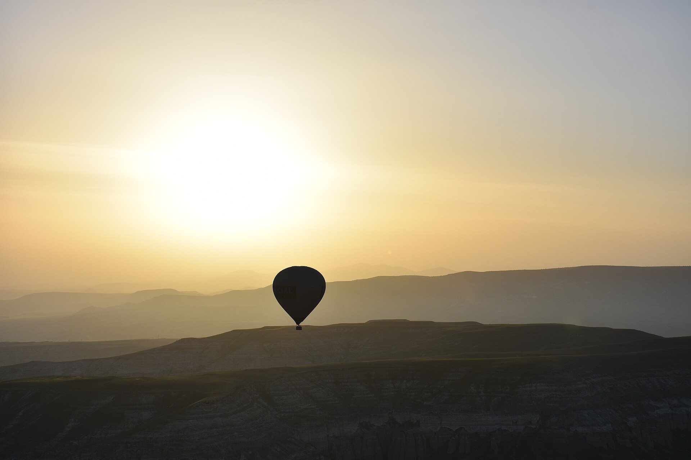
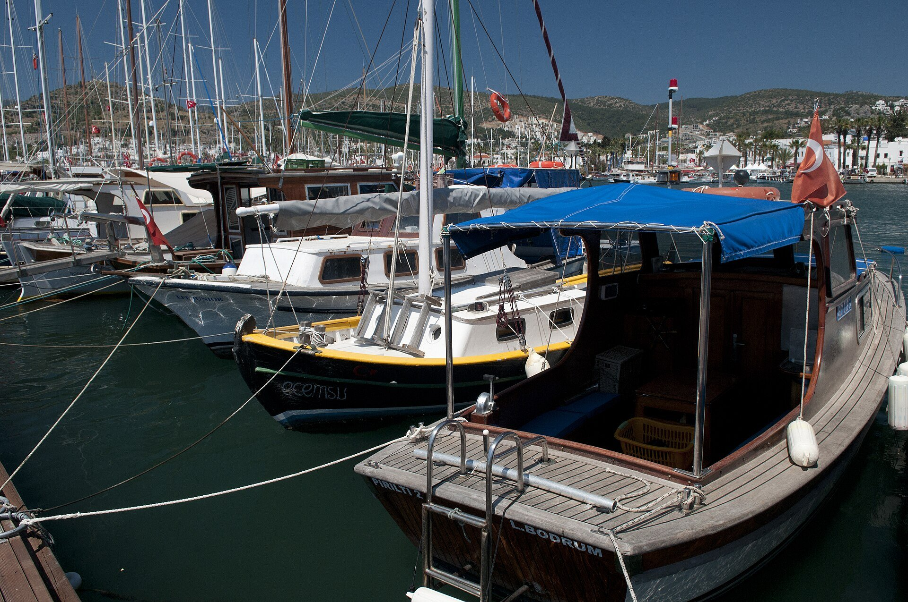
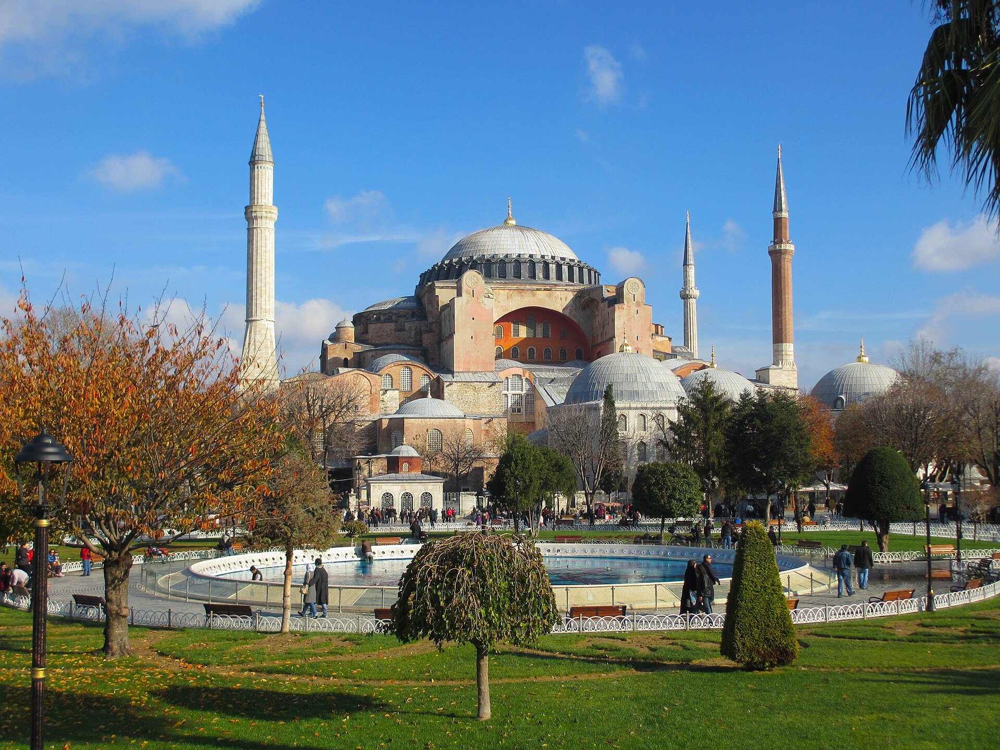
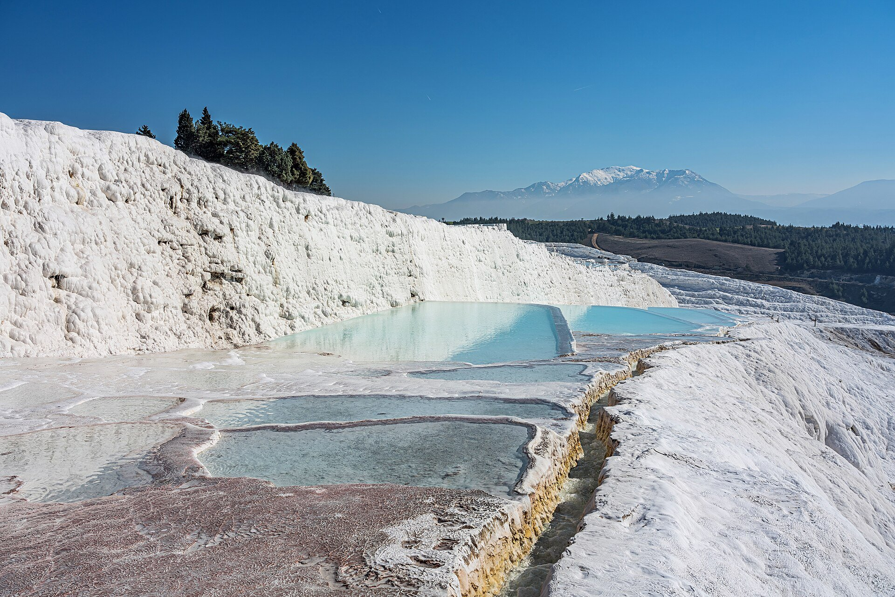

import PricingCards from '../../components/post/PricingCards.astro';
import AviasalesWidget from '../../components/post/AviasalesWidget.astro';
import FlightRoutes from '../../components/post/FlightRoutes.astro';
import AffiliateNote from '../../components/post/AffiliateNote.astro';

По отзывам туристов на [форуме Винского](https://forum.awd.ru/viewforum.php?f=68), май 2026: типичный семейный сценарий — 4 человека в Анталью на майские, отель 5\* Ultra All Inclusive в Кемере, 10 ночей выходят в **~412 000 ₽** с перелётом. То же самое за месяц до вылета — уже **~530 000 ₽**. Еда и алкоголь в отеле сверху ноль. Это сегодня самый частый сценарий — пакетный тур, ранняя бронь, всё включено.

По отчётам бэкпекеров на том же форуме, май 2026: альтернативный маршрут — Стамбул → Каппадокия → Анталья → Памуккале → Эфес, 2 недели соло. Хостелы 600–1500 ₽/ночь, метро в Стамбуле 25 лир (~70 ₽), уличная еда от 50 лир (~140 ₽). Бюджет умещается в **~80 000 ₽** включая перелёт. Тоже работает — и это **в 5 раз дешевле** All Inclusive.

Турция в 2026 — это две разные страны: туристическая (All Inclusive, Анталийское побережье) и историческая (Стамбул, Каппадокия, Эгейское побережье). Этот гайд — для тех, кто хочет понять, **какой сценарий именно ваш**, без переплаты 30% за раннюю бронь vs late deal и без наценки тур-агентств.

> **Если коротко:** россиянам **виза не нужна** до **60 дней** за один въезд, суммарно **90 дней за 180**. Загранпаспорт со сроком **минимум 120 дней** на дату въезда. Лучшие месяцы — **май, июнь, сентябрь, октябрь** (купание + меньше толп). Пакетный тур 5\* AI от 77 000 ₽ на двоих, бэкпекинг самостоятельно — от 40 000 ₽/чел. Карты МИР **местами работают**, но полагаться нельзя — берите запасной кэш в евро/долларах.

<AffiliateNote />

> **Когда лучше ехать:** см. [таблицу сезонов](/seasons/). Купальный сезон **май–октябрь**, вода прогревается с +21 °C в мае до +27 °C в августе, к концу октября держится тёплой, в ноябре остывает до +18 °C. Пик цен — **июль–август**, выгоднее — **май и сентябрь–октябрь**.

---

## Виза для россиян: 60 / 90 / 180 — что это значит

С 2010 года Турция держит безвизовый режим с Россией. Текущие правила (на май 2026):

- **60 дней за один въезд** — без визы, по загранпаспорту
- **90 дней суммарно за период 180 дней** — после этого нужна виза или ждать «обнуления»
- **Срок действия паспорта** — минимум **120 дней** от даты въезда (4 месяца). Не от даты выезда — от даты въезда.

«Виза-ран» работает: можно выехать в Грузию / Болгарию / Северный Кипр и вернуться, получив новые 60 дней — но **общий лимит 90/180 действует**. Превышение = штраф 1 500 лир (~4 000 ₽) + запрет на въезд от 1 месяца до 5 лет в зависимости от длительности нарушения (данные [консульства Турции в РФ](https://moscow.cg.mfa.gov.tr/), на май 2026 — уточнять перед поездкой).

На границе ничего не заполняют, паспорт штампуют, спрашивают редко. Иногда могут попросить:
- Обратный билет
- Бронь отеля
- Финансовое подтверждение (ориентир ~$50/день — точная сумма не зафиксирована в открытых правилах, на усмотрение офицера)

Проверяют редко, по отзывам туристов на форумах. Но иметь распечатки — норма.

## Когда лучше ехать в Турцию в 2026?

| Месяц | Воздух | Вода | Что хорошо | Что плохо |
|---|---|---|---|---|
| **Май** | +24 °C | +21 °C | ★ Купальный сезон стартует, цены ниже на 30% | Иногда прохладно вечером |
| Июнь | +29 °C | +24 °C | ★ Идеальный баланс — тепло, не пиковая толпа | Цены растут |
| Июль–август | +33–35 °C | +27 °C | Пик пляжа, full аквапарк | Жара, толпы, цены ×2 |
| **Сентябрь** | +30 °C | +27 °C | ★ Тёплая вода, тише, цены падают | — |
| Октябрь | +24 °C | +25 °C | ★ Бархатный сезон, тур-агенты делают скидки | Иногда дожди в конце месяца |
| Ноябрь–март | +10–17 °C | +14–18 °C | Сезон Стамбула, экскурсии без жары | Купаться холодно, многие AI закрыты |
| Апрель | +20 °C | +18 °C | Каппадокия на пике, тюльпаны в Стамбуле | Море ещё холодное |

**Лучший компромисс:** конец мая или вторая половина сентября. Купаться можно, цены на 30–40% ниже августа, толп нет.

**Для культурных туров (Стамбул, Каппадокия, Эфес):** апрель и октябрь — погода без жары, очереди короче.

## Регионы — какой выбрать

### Анталийское побережье (пляжный отдых, All Inclusive)

**Анталья** (районы Кунду, Лара) — крупнейший аэропорт страны, 60 км пляжа. Лара — современные 5\* отели, ровный песок. Кунду — старее, дешевле. Sample цена 5\* AI: **35 000–55 000 ₽/чел за 10 ночей** в июне.

**Кемер** (45 км к западу от Антальи) — горы Тавр, сосновые рощи у моря, галька. Молодёжный + семейный, активные туристы (треккинг, рафтинг рядом). 5\* AI: **30 000–50 000 ₽/чел/10 ночей**.

**Белек** — премиум-сегмент, гольф-курорты, отели от 5\*. Песок, плавный заход в море, идеально с детьми. AI: **45 000–80 000 ₽/чел**.

**Сиде** (75 км от Антальи) — античные руины прямо у моря, песок, более тихий чем Анталья. Семейный курорт. AI: **30 000–45 000 ₽**.

**Аланья** (135 км от Антальи) — самый дальний, поэтому **самый дешёвый**. Длинный песчаный пляж Клеопатры. Минус — дольше трансфер. AI: **25 000–40 000 ₽**.

### Эгейское побережье (более «европейская» Турция)

**Бодрум** — белые домики на склоне, яхты, тусовка, ночные клубы. Цены выше Антальи, больше иностранцев. Аэропорт BJV.

**Кушадасы** — рядом руины Эфеса. Хорошо комбинировать пляж + культуру.

**Мармарис, Фетхие** — туристические, средний ценник, длинный сезон до конца октября.

### Стамбул (3–5 дней до или после пляжа)

Главный must-visit Турции. Самостоятельно или с экскурсиями.

Что смотреть за 3 дня:
- **Айя-София + Голубая Мечеть** (рядом, бесплатно)
- **Дворец Топкапы** (1 700 лир ~4 500 ₽)
- **Цистерна Базилика** (900 лир)
- **Гранд-Базар + Египетский базар**
- **Босфор-круиз** (350 лир общественный, 1 500 — частный)
- **Галата + Истикляль**
- **Азиатская сторона** — Кадыкёй, аутентичнее туристического района

Отели в Сультанахмете 2–3\*: **2 500–6 000 ₽/ночь**. В Бейоглу (центр): **4 000–10 000 ₽**.

### Каппадокия — must-visit (1.5–2 дня)

Воздушные шары на рассвете — самый узнаваемый визуал Турции в Instagram/Pinterest. Ради него имеет смысл отдельный перелёт Стамбул → Кайсери (1.5 ч, 2 000–4 000 ₽).

Полёт на шаре: **180–250 €** в высокий сезон, **120–180 €** в межсезонье. Бронируется за 1–2 месяца в пиковый сезон.

Логистика: прямой авиаперелёт Стамбул → Кайсери (NAV) или Невшехир (NAV) — 1.5 ч, **2 000–4 000 ₽** на Pegasus. Дешёвый ночной автобус 12 часов из Стамбула — 1 200–1 800 ₽.

Базовый отель в Гёреме (пещерные номера): **3 500–8 000 ₽/ночь**.

### Памуккале + Эфес (1 день каждый)

**Памуккале** — белые травертиновые террасы, термальный источник. Вход 700 лир. Из Антальи однодневный тур 2 500–4 000 ₽.

**Эфес** — античный город I века н.э., библиотека Цельса, амфитеатр на 25 000 мест. Вход 700 лир. Лучше с гидом — 1 500–3 000 ₽.

## All Inclusive vs самостоятельно

| Что | All Inclusive | Самостоятельно |
|---|---|---|
| Цена на двоих 10 ночей | от 77 000 ₽ (3\*) до 250 000 ₽ (5\* премиум) | от 35 000 ₽ (хостелы) до 150 000 ₽ (бутики) |
| Контроль маршрута | Минимум (отель + 1–2 экскурсии) | Полный |
| Реальная Турция | Нет (внутри отеля как в РФ) | Да — рынки, такси, долмуш |
| Кому подходит | Семья с детьми, отпуск без головы, первая поездка | Соло, пары, повторная поездка, любители культуры |
| Питание | Шведский стол ×4 раза/день включён | Уличная еда + рестораны 500–1 500 ₽ за приём |
| Алкоголь | Локальный raki/пиво/вино включён в Ultra AI | Покупка в магазине или в баре 200–500 ₽ |

**Главный лайфхак:** если едете All Inclusive — берите Ultra (не «всё включено» простое). Разница в цене 20–30%, но импортный алкоголь + a-la-carte рестораны 1–2 раза за поездку оправдывают: в Ultra импортный алкоголь, морепродукты, мясо нормальное.

## Сколько стоит поездка в Турцию на двоих?

<PricingCards tiers={[
  { tier: 'Эконом', price: '40 000 ₽', priceNote: 'на 1 чел, 10 дней, бэкпекинг', emoji: '🟢',
    features: [
      'Перелёт Москва-Анталья от 12 000 ₽ туда-обратно',
      'Хостел 600-1 500 ₽/ночь',
      'Еда 800-1 500 ₽/день — уличная + дешёвые турецкие заведения (lokanta)',
      'Транспорт долмуш 30-50 ₽',
      'Экскурсии один раз — 2 000-4 000 ₽',
    ] },
  { tier: 'Средний', price: '110 000 ₽', priceNote: 'на 2 чел, 10 ночей AI 4*', emoji: '🟡',
    featured: true,
    features: [
      'Пакет 4* All Inclusive 10 ночей',
      'Перелёт чартер включён',
      'Еда и алкоголь местный — в отеле',
      '1-2 экскурсии за пределы отеля',
      'Трансфер из аэропорта включён',
    ] },
  { tier: 'Премиум', price: '250 000+ ₽', priceNote: 'на 2 чел, 5* Ultra AI', emoji: '🔴',
    features: [
      '5* Ultra All Inclusive — Maxx Royal / Rixos / Calista',
      'Прямой рейс Аэрофлот/Turkish',
      'Импортный алкоголь и морепродукты',
      'A-la-carte рестораны',
      'SPA, гольф, частный пляж',
    ] },
]} caption="Бюджет на Турцию — три уровня, цены на май–июнь 2026" />

## Как добраться в Турцию из Москвы в 2026?

Прямые рейсы из России в Турцию **есть** — это главное отличие от большинства других направлений.

<FlightRoutes routes={[
  {
    from: 'Москва', to: 'Анталья (AYT)',
    flights: [
      { airline: 'Аэрофлот', code: 'SU', duration: '3 ч', priceFrom: '18 000 ₽', priceUrl: 'https://www.aviasales.ru/?marker=546042.Zz66f13c16ff6b488883a4127-546042&market=ru&origin_iata=MOW&destination_iata=AYT' },
      { airline: 'Turkish Airlines', code: 'TK', duration: '3 ч', priceFrom: '22 000 ₽' },
      { airline: 'Pegasus', code: 'PC', duration: '3 ч', priceFrom: '20 000 ₽' },
      { airline: 'S7', code: 'S7', duration: '3 ч', priceFrom: '19 000 ₽' },
    ]
  },
  {
    from: 'Москва', to: 'Стамбул (IST)',
    flights: [
      { airline: 'Аэрофлот', code: 'SU', duration: '3 ч', priceFrom: '22 000 ₽' },
      { airline: 'Turkish Airlines', code: 'TK', duration: '3 ч', priceFrom: '24 000 ₽' },
    ]
  },
  {
    from: 'Москва', to: 'Бодрум (BJV)',
    flights: [
      { airline: 'Turkish Airlines', code: 'TK', duration: '3.5 ч', priceFrom: '26 000 ₽' },
    ]
  },
]} caption="Прямые рейсы Москва → Турция в 2026" />

Цены — туда-обратно эконом, май–июнь 2026, регулярные рейсы.

- **Чартеры в составе тура** уже в пакете, отдельно не купить — на 30–50% дешевле регулярного
- **Подешевле через Минск:** Belavia из Минска от 14 000 ₽, но добираться до Минска отдельно

Аэропорты:
- **AYT (Анталья)** — для всего побережья (Кемер 40 км, Белек 30 км, Сиде 65 км, Аланья 125 км)
- **IST (Стамбул-новый)** — главный, далеко от центра (50 км, аэроэкспресс есть)
- **SAW (Сабиха Гёкчен)** — азиатская сторона Стамбула, чартеры
- **BJV (Бодрум)** — для Эгейского побережья
- **DLM (Даламан)** — для Мармариса, Фетхие

## Деньги, карты, что работает

**Валюта** — турецкая лира (TRY), курс ~2.7 ₽ за лиру (май 2026). Динамика волатильная, инфляция 30%+, цены растут регулярно.

**Карты:**
- **Visa / Mastercard из РФ** — НЕ работают
- **МИР** — местами работает (в крупных банках Ziraat, Vakifbank, Isbank — да; в большинстве POS-терминалов магазинов — нет; банкоматы пропускают через раз)
- **UnionPay** — работает почти везде где принимают международные карты
- **Apple Pay / Google Pay через российскую карту** — не работает
- **Виртуальная карта USD/EUR иностранного эмитента** — по информации сервиса, выпускается ~2 минуты, пополняется рублями через СБП. Работает там же где обычная Visa/MC: терминалы, банкоматы, онлайн-бронь. <a href="https://platipomiru.com/?utm_source=traveltribe&utm_medium=cpa" class="aff-cta" rel="sponsored">Выпустить виртуальную карту USD/EUR</a>реклама. Работоспособность платёжных сервисов для россиян меняется — проверяйте перед поездкой.

**Что брать с собой:**
- **Кэш в евро или долларах** — основной запас (10 000-30 000 ₽ на двоих)
- Меняют **везде** — рестораны, отели, обменники в каждом квартале
- В отеле курс хуже на 5-10% чем в городе
- **Карту МИР** как запасной вариант
- **UnionPay** — если есть, лучший вариант для безналичной оплаты

**Лайфхак:** в туристических местах принимают **евро напрямую** — рынок, такси, рестораны. Сдачу дают лирой по своему курсу (обычно завышенному). Лучше платить лирой.

## Что взять с собой обязательно

- **Загранпаспорт + копия** (на телефон + бумага)
- **Распечатки** обратного билета и брони отеля
- **Кэш евро/долл** ($300–500 на 10 дней)
- **Карту МИР Газпромбанка / Россельхозбанка** (чаще проходят)
- **Аптечка**: солнцезащитный SPF50, спрей от комаров, имодиум, парацетамол
- **Переходник НЕ нужен** — Турция использует тип F (как ЕС), российские вилки подходят
- **Шарф / платок** — для входа в мечети женщинам
- **Закрытая обувь** для Каппадокии (тропы каменистые)

## Что НЕ делать

- **Не носите крупные суммы кэша в туристических местах** — карманники в Стамбуле, Анталье, Кушадасах. В отелях — сейф, обязательно используйте.
- **Не покупайте экскурсии у уличных продавцов** в курортных городах — наценка ×2-3. Берите у гида в отеле или онлайн заранее — у местных гидов на русском, с бронью без предоплаты и известной ценой.
- **Не пейте водопроводную воду** — желудок не привыкший. Бутилированная, фильтр или кипячёная.
- **Не торгуйтесь в супермаркетах и сетевых магазинах** — фиксированные цены. Торг — только на рынках (Гранд-Базар, обувной рынок, ковры, золото).
- **Не показывайте подошвы ног** — оскорбление в исламской культуре. Особенно в мечети.
- **Не игнорируйте dress-code мечетей** — закрытые плечи и колени, женщинам платок. Айя-София — открыта для всех, в Голубой мечети строже.
- **Не ездите на ATV в шортах** — обгорите за 30 минут на жаре. Длинные брюки + шлем — норма.

<AviasalesWidget destination="AYT" title="Найти билеты в Анталью" subid="post-turkey" />

## Стамбул крупно — 3-дневный план

**День 1 — Султанахмет.** С утра Айя-София (бесплатно, очередь от 10:00, лучше быть в 8:45). Затем Голубая мечеть напротив (бесплатно, закрыта во время намазов 5 раз/день). Цистерна Базилика (900 лир, входит толпа). Обед в районе. После обеда — Дворец Топкапы (1 700 лир + 700 лир Гарем). Вечером — ужин на крыше с видом на минареты в Hamdi Restaurant.

**День 2 — Босфор + Бейоглу.** Утром — Гранд-Базар + Египетский базар. Круиз по Босфору из Эминёню (1.5 ч общественный 350 лир, или Bosphorus Tour 1 500 лир). После обеда — Истикляль с Галата-башней. Вечер — ужин в Бейоглу.

**День 3 — Азиатская сторона.** Паром на Кадыкёй (35 лир), Мода, прогулка по набережной. Рынок Кадыкёй с уличной едой. Если время есть — Принцевы острова на пароме (Бююкада 2 часа в пути).

**Где жить:**
- **Султанахмет** — рядом со всеми достопримечательностями, отели 2-4\* от 3 000 ₽/ночь
- **Бейоглу/Галата** — район жизни, лучшие рестораны, отели 3-4\*
- **Кадыкёй** — азиатская сторона, аутентика, дешевле

## FAQ

**Можно ли расплачиваться российской картой Visa/Mastercard в Турции?**
Нет. С марта 2022 заблокированы все российские Visa/Mastercard для международных операций. Работает только МИР (выборочно) и UnionPay (в большинстве POS).

**Нужна ли страховка для Турции?**
Юридически — нет, на въезде не спрашивают. По здравому смыслу — обязательна. Базовая медстраховка на 10 дней — 800-1 500 ₽: <a href="https://cherehapa.tpk.mx/GmVWjhCN" class="aff-cta" rel="sponsored">Оформить страховку в Турцию</a>реклама, либо Сбер/Tinkoff. Бесплатная медицина для иностранцев в Турции не существует, врачебная помощь — 100-500 € за приём (ориентир по прайсам частных клиник Антальи и Стамбула, май 2026 — уточнять в страховой/у клиники).

**Как недорого долететь до Турции?**
Чартер в составе тура почти всегда дешевле регулярного рейса. Если ищете отдельно билет — Pegasus и Turkish Airlines, бронь за 2-3 месяца дешевле на 30-50%. Через Минск Belavia ещё дешевле, но добавляется логистика.

**Какой курорт лучше с маленькими детьми?**
**Белек** (5\*, плавный заход, чистый песок, мало волн) или **Сиде** (помельче по цене, тоже семейный). Кемер не для самых маленьких — галька на пляже.

**Стоит ли ехать в Турцию в июле-августе?**
Если нет жёсткой привязки к школьным каникулам — лучше не ехать. Жара +35 °C, толпы, цены ×2 относительно мая или октября. То же качество отдыха в сентябре стоит на 40% дешевле.

**Можно ли купаться в Стамбуле?**
В Босфоре технически да, но течения сильные и вода грязная. Купание у россиян ассоциируется с Анталийским побережьем. Из Стамбула ближайший пляж — Принцевы острова (но не уровень Антальи) или поездка на побережье (3-4 ч).

**Куда поехать в Турцию первый раз?**
**Анталья (Кунду или Лара) + 2 дня в Стамбуле** — самый сбалансированный вариант. Видишь и пляж, и культурный must-have. На 10-12 дней. Если уже не первый раз — добавь Каппадокию.

**Сколько денег брать с собой?**
В дополнение к All Inclusive — 200-500 € на туриста (на алкоголь, сувениры, экскурсии, такси). При самостоятельной поездке — 50-100 €/день на еду+транспорт+мелкие траты.

**Куда ехать вместо Турции если хочется альтернативу?**
[Египет](/seasons/) (тёплая вода круглый год, тоже AI, но без авиа-блокировок), [Грузия](/seasons/) (безвиз, ближе, без All Inclusive), [ОАЭ](/seasons/) (зимой комфортно +25 °C, летом жара +45 °C, но AC везде).

**В чём разница «всё включено» и Ultra All Inclusive?**
- **All Inclusive**: основное питание × 3-4 раза в день, местные напитки (вино/пиво/raki), иногда импортные за доплату.
- **Ultra All Inclusive**: + импортный алкоголь, a-la-carte рестораны бесплатно (1-2 раза за поездку), морепродукты, более качественное мясо, мини-бар включён.
Разница в цене — 20-30%. Если едете на расслабленный отдых — Ultra оправдывает.

**Безопасно ли в Турции после землетрясения?**
Землетрясения в Турции бывают регулярно, но 2023 год был аномальным (юго-восток). Туристические зоны (Анталийское побережье, Стамбул, Каппадокия) — не в основной сейсмо-зоне (источник: [AFAD](https://www.afad.gov.tr/), турецкое агентство по чрезвычайным ситуациям). Риск есть, но для туриста на 10 дней — низкий.

## Что почитать дальше

- [Сравнить Турцию с другими летними направлениями](/seasons/)
- [Калькулятор бюджета на Турцию](/calculator/)
- [Виза в Турцию — детально для россиян](/visa/turkey/)
- [Турция в июне 2026 — что работает](/trips/june/turkey/)
- Альтернатива в том же ценнике: [Хайнань 2026](/blog/hainan-guide-2026/) — безвиз, тропики, без европейских санкций

---

*Информация актуальна на 12 мая 2026. Цены на туры — по данным [АТОР](https://www.atorus.ru/) и [Level.Travel](https://level.travel/), апрель-май 2026. Визовые правила — по данным консульства Турции в РФ. Цитаты и сценарии — по отзывам на форуме Винского, май 2026.*
