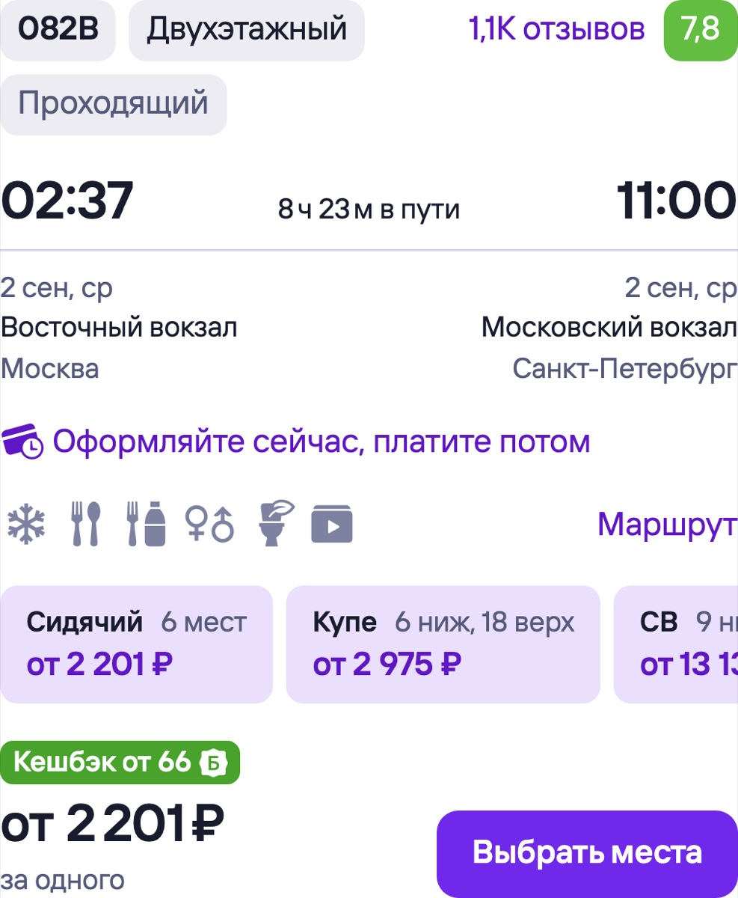
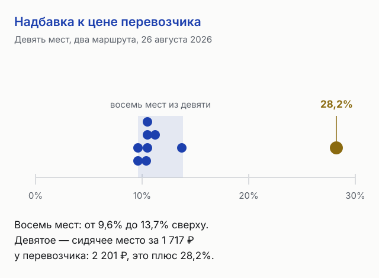
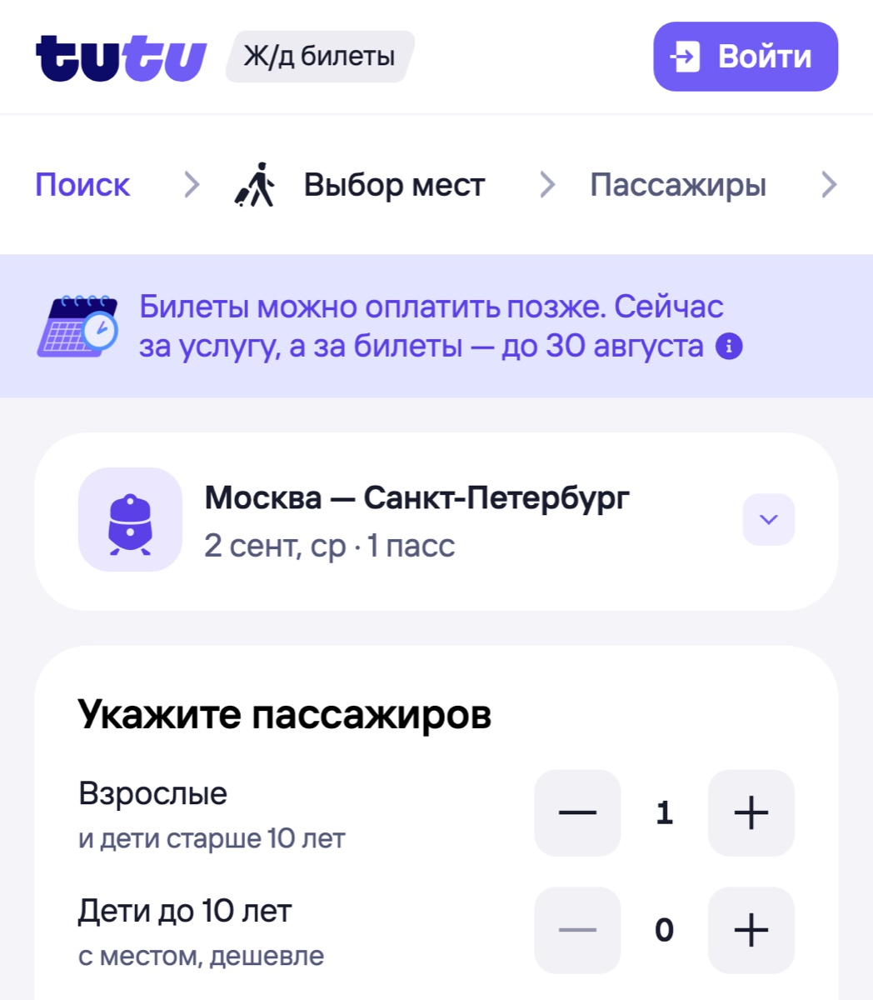
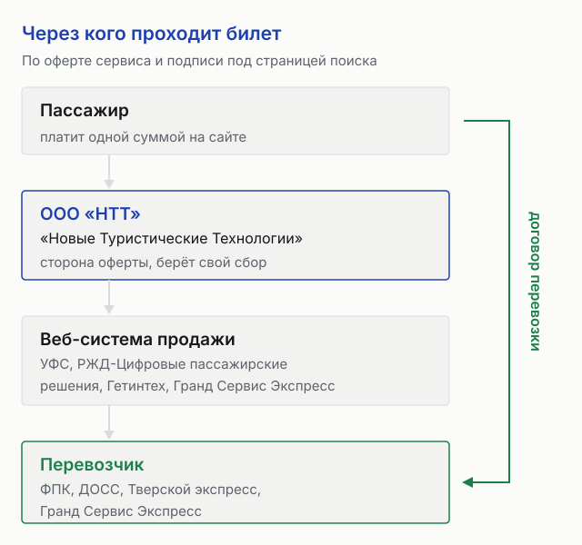
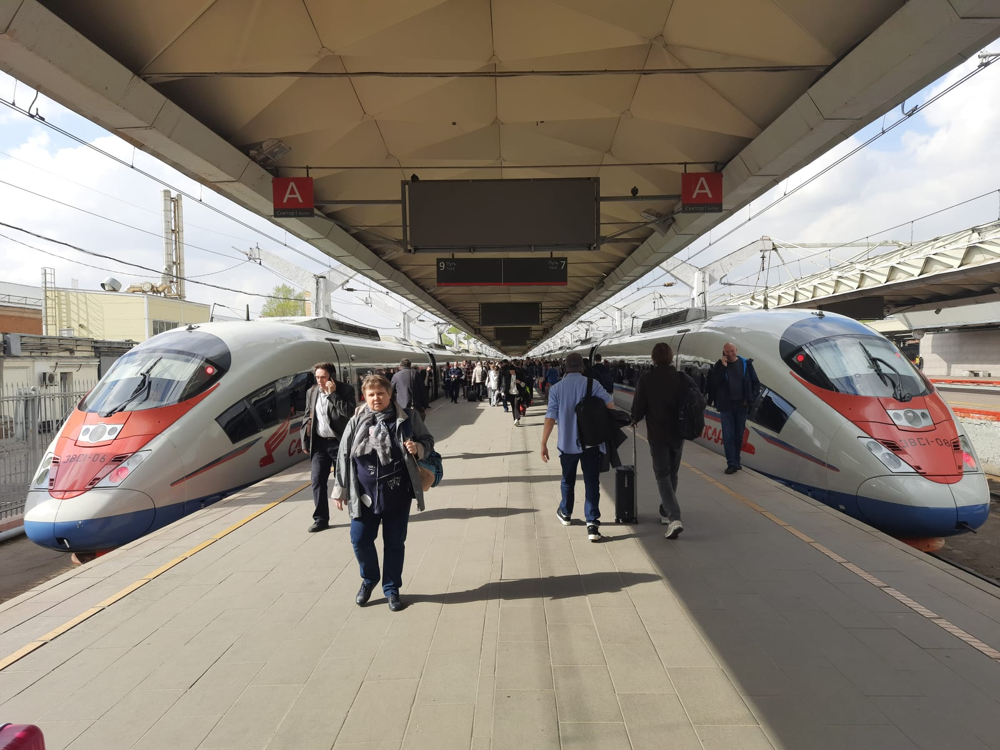
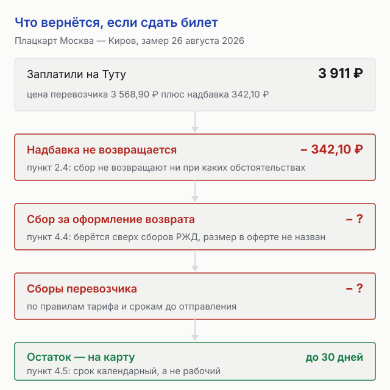

import AffiliateNote from '../../components/post/AffiliateNote.astro';
import { tutuTrains } from '../../data/affiliate.js';

Туту.ру не показывает, сколько берёт за свою работу: в поиске стоит одна цифра, и по правовой информации сервиса она **включает его сбор**, а итог виден только на шаге подтверждения заказа. Размер сбора можно вычислить — сравнить с ценой того же места у перевозчика.

Замер 26 августа 2026 года на девяти местах двух маршрутов: надбавка Туту над ценой ОАО «РЖД» составила **от 9,6% до 28,2%**, в рублях — от 297 до 1 827 ₽ на один билет. Восемь мест из девяти уложились в 9,6–13,7%; выбился самый дешёвый билет замера.

<AffiliateNote />

## Сколько Туту берёт сверх цены перевозчика

Сравнивать «от» с «от» честно не всегда: у перевозчика в одном поезде бывает несколько цен на один класс, и продавцы показывают минимум из разных наборов. Поэтому в таблицу вошли только те строки, где у перевозчика на весь класс была **ровно одна цена**, а число свободных мест совпало у всех троих. Маршруты — Москва — Санкт-Петербург и Москва — Киров, дата поездки 2 сентября 2026, один взрослый, цены сняты 26 августа.

| Поезд, класс | Мест | ОАО «РЖД» | Туту.ру | Яндекс Путешествия |
|---|---|---|---|---|
| 057М, плацкарт | 236 | **2 813,30 ₽** | 3 110 ₽ (+10,5%) | 3 179 ₽ (+13,0%) |
| 082В, сидячий | 6 | **1 717,10 ₽** | 2 201 ₽ (+28,2%) | 2 146 ₽ (+25,0%) |
| 022А, СВ | 9 | **13 379,20 ₽** | 15 206 ₽ (+13,7%) | 16 456 ₽ (+23,0%) |
| 010Н, плацкарт | 115 | **3 568,90 ₽** | 3 911 ₽ (+9,6%) | 4 051 ₽ (+13,5%) |
| 078Ы, плацкарт | 138 | **3 568,90 ₽** | 3 911 ₽ (+9,6%) | 4 051 ₽ (+13,5%) |
| 145А, плацкарт | 39 | **3 294,40 ₽** | 3 636 ₽ (+10,4%) | 3 739 ₽ (+13,5%) |
| 145А, СВ | 2 | **16 249,70 ₽** | 18 077 ₽ (+11,2%) | 20 068 ₽ (+23,5%) |

Первые три строки — петербургское направление, остальные кировское. Ещё на двух петербургских поездах, 100С и 122С, плацкарт стоил ровно те же 3 110 ₽ при цене перевозчика 2 813,30 ₽.

Вывод один: **цена у перевозчика ниже всегда**. Посредник берёт около десятой части сверху, и на дорогом месте это тысячи рублей — 1 826,80 ₽ за СВ в поезде 022А и почти столько же, 1 827,30 ₽, за СВ в поезде 145А на другом маршруте.

## Почему на дешёвом месте надбавка оказалась втрое больше

Восемь мест из девяти держались в узкой полосе 9,6–13,7%. Девятое выпало: сидячее место в двухэтажном поезде 082В стоило у перевозчика 1 717,10 ₽, а на Туту — 2 201 ₽. Это **плюс 483,90 ₽, или 28,2%** — почти треть сверху.

*Так это место выглядит в поиске 26 августа 2026 года. У перевозчика те же шесть сидячих мест в этом поезде стоят 1 717,10 ₽.*

В рублях это выглядит ещё страннее. За плацкарт до Петербурга ценой 2 813,30 ₽ сервис взял 296,70 ₽, а за сидячее место ценой 1 717,10 ₽ — 483,90 ₽. Билет вдвое дешевле, надбавка в полтора раза больше. Расхожее объяснение, что сбор зависит от стоимости билета, на этих цифрах не сходится.

Оферта такую свободу разрешает прямо: по пункту 2.4 приложения о ж/д билетах исполнитель **имеет безусловное право менять величину сервисного сбора**. Ни таблицы ставок, ни формулы сервис не публикует, поэтому предсказать надбавку заранее нельзя — её видно только сравнением с ценой перевозчика.

## Где эта надбавка прячется

В разделе правовой информации сказано дословно: билеты предоставляются партнёрами Туту.ру и их стоимость указана с учётом сервисного сбора, а окончательную сумму можно увидеть на шаге подтверждения заказа. То есть отдельной строки «сбор» на витрине нет — она растворена в цене места.

*Плашка на шаге оформления называет вещи своими именами: «сейчас за услугу, а за билеты» — потом. Это отдельный сбор за отсрочку, и он не входит в стоимость заказа.*

Пункт 3.8 приложения формулирует то же самое с другой стороны: общая стоимость заказа включает стоимость билета и сервисный сбор, причём в скобках оговорено «возможно отсутствие такого сбора». На девяти замеренных местах сбор был везде.

Правила при этом подвижны. На странице оферты перечислены **десять предыдущих редакций 2026 года** — от 2 февраля до 10 июля, — а действующая датирована 13 августа. Условия, по которым считают ваши деньги, менялись в среднем чаще раза в месяц.

## Туту или Яндекс Путешествия на одном и том же поезде

Оба сервиса — посредники, и оба берут своё. По замеру Туту оказался дешевле Яндекса на шести строках из семи, и разрыв на дорогих местах заметный: за СВ в поезде 145А Яндекс просил 20 068 ₽ против 18 077 ₽ у Туту, разница почти две тысячи.

Но на седьмой строке порядок перевернулся: сидячее место в 082В стоило 2 201 ₽ на Туту и 2 146 ₽ на Яндексе. Тот же поезд, тот же день, тот же класс — и дешевле оказался другой продавец.

У Яндекса надбавка вела себя ровнее: на всех четырёх плацкартных строках она держалась на 13,0–13,5%, а на сидячем и СВ подскакивала до 23–25%. У Туту наоборот: плацкарт и СВ около десяти процентов, а сидячее место — 28,2%. Общего правила, кто дешевле, из этого не выводится. Проверять надо свой поезд.

Яндекс, к слову, о своём сборе пишет открыто: под списком поездов стоит строка «стоимость билетов указана с учётом сбора Яндекса». Размер тоже не назван. Как второй продавец устроен на стороне жилья и сколько удерживает с отеля — в разборе того, [как работают Яндекс Путешествия и сколько берёт сервис](/blog/yandex-puteshestviya-kak-rabotaet-2026/).

## Кто на самом деле продаёт вам билет

Стороной договора с вами выступает не «Туту.ру», а ООО «Новые Туристические Технологии» — так представлен исполнитель в первой строке оферты. Сайт при этом работает на программном комплексе другого юрлица — по подписи в подвале, ООО «Глобус Медиа».

Сам билет оформляется через чужие системы продажи. Под страницей поиска поездов перечислены договоры с ООО «УФС», ООО «РЖД-Цифровые пассажирские решения», ООО «Гетинтех» и АО ТК «Гранд Сервис Экспресс» — самый старый от 30 сентября 2015 года, самый свежий от 31 января 2025-го.

Практический смысл в пункте 3.8: при оплате заказа пассажир вступает в отношения, вытекающие из **договора перевозки, с перевозчиком** — с ФПК, ДОСС или Тверским экспрессом, а не с сервисом. Опоздание поезда, отмена рейса, качество вагона — это к перевозчику. К сервису — оформление, оплата и возврат.

## Что удержат, если сдать билет

Здесь два разных удержания, и их легко перепутать.

Первое: сбор, зашитый в цену при покупке, назад не приходит. Пункт 2.4 приложения говорит, что он **не подлежит возврату ни при каких обстоятельствах**, включая возврат билета и вне зависимости от причин; оговорка в том же пункте одна — если иное не предусмотрено маркетинговой акцией или законом. На замеренном плацкарте до Кирова это 342,10 ₽, на сидячем месте до Петербурга — 483,90 ₽.

Второе: за само оформление возврата берут ещё раз. Пункт 4.4 — в дополнение к сборам, установленным условиями ОАО «РЖД», исполнитель взимает сервисный сбор за оформление возврата, и удерживает его из суммы, которая должна вернуться. Размера в оферте нет.

Деньги идут долго: по пункту 4.5 при оплате картой возврат приходит **в течение 30 календарных дней**. Ещё одна деталь, которую находят поздно: по пункту 4.1 обмен и изменение билета не делаются вовсе — если поменялись планы, билет возвращают и покупают новый по текущей цене.

Единственный способ вернуть сбор — купить услугу «100%-й возврат» заранее. По пункту 4.7 она возвращает всю уплаченную сумму, включая сервисный сбор, за вычетом стоимости самой услуги, работает до времени, разрешённого на онлайн-возврат, и не применяется, если поездка сорвалась из-за ограничений органов власти.

## Три сбора, которые платят не за билет

Кроме надбавки в цене места, оферта описывает ещё три платежа, и каждый живёт по своим правилам.

- **«Оплата позднее».** Отдельный сбор за право забронировать сейчас и заплатить потом. По пункту 3.7.1 он не входит в стоимость заказа и не возвращается — в том числе когда заказ отменили из-за того, что вы не заплатили в срок. На странице поезда это выглядит как строка «билеты можно оплатить позже».
- **«Поймать билет».** Сбор за автоматический поиск мест, когда их нет в продаже. По пункту 3.7.2 он вернётся, если билеты не нашли за 14 часов до отправления или вы отменили услугу сами. А если сервис билет нашёл и прислал смс, услуга считается оказанной — не оплатили заказ, сбор пропал.
- **Сбор за оформление возврата.** Тот самый второй сбор из пункта 4.4.

Первые два не входят в цену заказа, и их размер показывают на экране в момент выбора. Проверять эти цифры стоит там же, до оплаты.

## Один и тот же тариф — разная цена

Отдельная находка, которую не получилось объяснить до конца. На кировском направлении три поезда шли с одинаковой ценой перевозчика — 3 568,90 ₽ за плацкарт. На поездах 010Н и 078Ы Туту просил 3 911 ₽, надбавка 342,10 ₽. На фирменном поезде 002Э «Россия» с той же ценой перевозчика — 4 389 ₽, надбавка 820,10 ₽, вдвое больше.

Осторожная оговорка: у 002Э по такой цене было всего 17 мест из 336, остальные стоили 4 104,30 ₽. Отличить «надбавка выше» от «этих 17 мест у сервиса не было» по внешним данным нельзя, поэтому строка не вошла в основную таблицу. Но практический вывод от этого не меняется: **одинаковая цена у перевозчика не означает одинаковую цену у посредника**, даже в один день на одном направлении.

## Кому Туту.ру не подходит

Каждый пункт следует из документов сервиса или из замера, а не из отзывов.

- **Тем, кто считает деньги на дешёвых билетах.** На самом дешёвом месте замера сервис взял 28,2% сверху — доля тем заметнее, чем дешевле билет.
- **Тем, кто часто меняет планы.** Обмена нет: только возврат и покупка заново. Сбор при этом теряется дважды — старый не вернут, новый возьмут снова.
- **Тем, кто ждёт деньги быстро.** Тридцать календарных дней на возврат — это месяц, а не «несколько дней».
- **Тем, кто хочет знать цену услуги заранее.** Отдельной строки сбора на витрине нет, ставки не публикуются, менять их сервис вправе без предупреждения.
- **Тем, у кого вокзал под боком и один прямой поезд.** Если маршрут очевиден, сравнивать нечего, а надбавка остаётся.

Если совпало два пункта и больше, касса перевозчика или его собственный сайт обойдутся дешевле. Сервис-посредник оправдывает себя другим: одним поиском по поездам, самолётам и автобусам сразу, ловлей мест в проданных поездах и понятным личным кабинетом с историей заказов.

## Как купить и не переплатить: порядок

1. Найдите поезд и класс на любом агрегаторе — сравнение вариантов у них удобнее.
2. Прежде чем платить, сверьте цену выбранного места с ценой того же места у перевозчика.
3. Если разница до сотни-двух рублей, платите там, где удобнее: экономия не стоит времени.
4. Если разница переваливает за 400–500 ₽ — а на сидячем месте замера она составила 484 ₽, — билет дешевле брать у перевозчика.
5. Решайте про «100%-й возврат» до оплаты — после покупки услугу не добавить, а без неё сбор не вернётся.
6. Не берите «Оплату позднее» и «Поймать билет», не посмотрев их цену на экране: эти сборы отдельные и в стоимость заказа не входят.
7. Сохраните письмо с контрольным купоном — по нему оформляют возврат и обращаются в поддержку.

<a href={tutuTrains('tutu_2026_main')} class="aff-cta" rel="sponsored">Посмотреть поезда и цены на свою дату</a> — поиск по поездам, самолётам и автобусам в одном окне, оплата картой российского банка и через СБП, круглосуточная поддержка по бесплатному номеру.

Как считать остальной бюджет поездки, разобрано в статье о том, [сколько стоит неделя в России](/blog/skolko-stoit-nedelya-v-rossii-2026/). Деньги на стороне перелёта — в разборе того, [кто продаёт билет на Авиасейлсе и какие берёт сборы](/blog/aviasales-2026/), а на стороне жилья — в разборе того, [что Суточно.ру берёт за бронь](/blog/sutochno-ru-2026/).

## FAQ — частые вопросы про Туту.ру

**Берёт ли Туту.ру комиссию сверх цены билета?**
Да, и она зашита в цену места. По правовой информации сервиса стоимость билетов указана с учётом сервисного сбора, отдельной строки на витрине нет. По замеру 26 августа 2026 года надбавка над ценой перевозчика составила от 9,6% до 28,2%, в рублях — от 297 до 1 827 ₽.

**Сколько именно стоит сервисный сбор?**
Ставок сервис не публикует, а по пункту 2.4 приложения о ж/д билетах вправе менять сбор без ограничений. Единственный способ увидеть размер — сравнить цену конкретного места с ценой того же места у перевозчика.

**Вернут ли сбор, если сдать билет?**
Нет. Пункт 2.4 говорит, что сбор не возвращается ни при каких обстоятельствах и вне зависимости от причин возврата — кроме случаев, предусмотренных маркетинговой акцией или законом. Названное в оферте исключение одно: заранее купленная услуга «100%-й возврат» по пункту 4.7. Вдобавок по пункту 4.4 за само оформление возврата берут ещё один сбор, который удерживают из возвращаемой суммы.

**Сколько ждать деньги за возвращённый билет?**
До 30 календарных дней на карту, с которой платили, — пункт 4.5 приложения.

**Можно ли поменять дату или поезд в билете?**
Нет. Пункт 4.1 прямо говорит, что изменение и обмен не осуществляются: билет возвращают и оформляют новый заказ по текущей цене.

**Кому предъявлять претензии, если поезд опоздал или отменён?**
Перевозчику. По пункту 3.8 при оплате заказа пассажир вступает в отношения по договору перевозки с перевозчиком — ФПК, ДОСС, Тверским экспрессом или другим. Сервис отвечает за оформление, оплату и возврат.

**Кто такой Туту.ру юридически?**
Стороной оферты выступает ООО «Новые Туристические Технологии» (ООО «НТТ»), место заключения договора — Москва. Сайт работает на программном комплексе ООО «Глобус Медиа». Билеты оформляются через веб-системы ООО «УФС», ООО «РЖД-Цифровые пассажирские решения», ООО «Гетинтех» и АО ТК «Гранд Сервис Экспресс».

**Туту дешевле Яндекс Путешествий?**
Чаще, но не всегда. На шести строках замера из семи Туту был дешевле, на седьмой — сидячем месте в поезде 082В — дороже: 2 201 ₽ против 2 146 ₽. Сравнивать нужно свой поезд и свой класс.

*Фото: Glucke, MBH / Wikimedia Commons / [CC BY-SA](https://creativecommons.org/licenses/by-sa/4.0/). Скриншоты сервиса сняты нами 26 августа 2026 года. Шкала надбавки, схема удержаний и цепочка продавцов наши. Цены на девяти местах сняты 26 августа 2026 года у трёх продавцов подряд и меняются в течение дня; условия сервиса — по оферте Туту.ру в редакции от 13 августа 2026 года. Материал описывает правила сервиса и не заменяет юридическую консультацию.*
