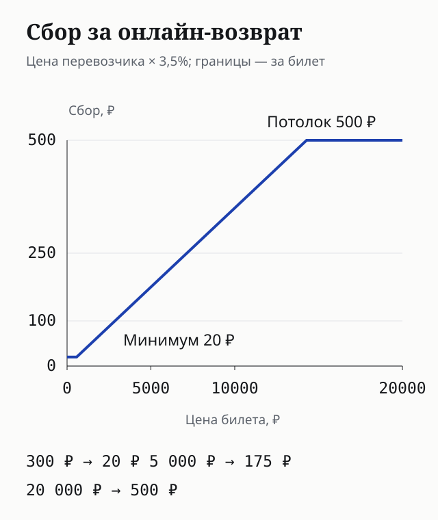
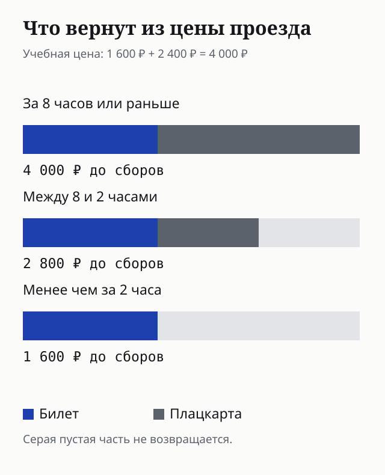
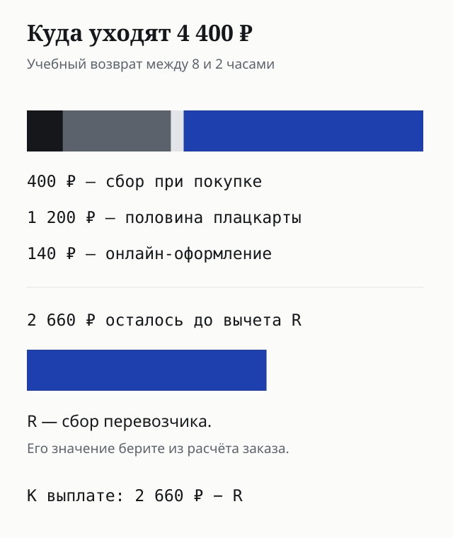
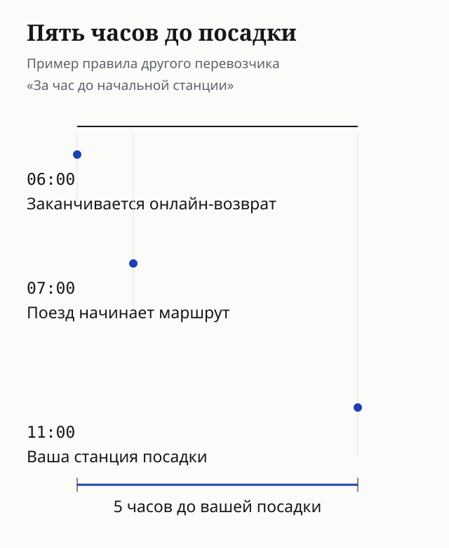

**Вернуть электронный билет на поезд через Туту можно в заказе или в железнодорожной кассе.** При онлайн-возврате сервис удерживает 3,5% стоимости билета у перевозчика — минимум 20 ₽, максимум 500 ₽ за билет. Отдельно учитываются первоначальный сбор Туту и удержания перевозчика. Крайний срок онлайн-возврата нужно смотреть в контрольном купоне: он зависит от электронной регистрации и перевозчика.

Ниже — обычные билеты на поезда дальнего следования по России. Международные маршруты, пригородные поезда и невозвратные тарифы требуют других условий. Платные питание, бельё и дополнительные услуги в примерах не учтены. Разбор основан на публичных правилах; собственной покупки и получения денег здесь нет.

## С чего начать возврат на Туту

Откройте письмо с билетом и контрольный купон. В нём найдите пассажира, перевозчика, станцию посадки, время отправления и крайний срок онлайн-возврата. Если билетов несколько, проверьте каждый: соседние места в одном заказе не означают одинаковые условия отмены.

Затем войдите в аккаунт Туту и откройте «Мои заказы». Выберите поездку, нажмите «Детали заказа», затем «Вернуть билеты». Отметьте пассажиров, для которых отменяете поездку: обычно можно вернуть все билеты заказа или часть. **Для билетов по акции ко дню рождения требуется вернуть весь заказ.** Перед кнопкой «Оформить возврат» прочитайте расчёт, а после оформления сохраните подтверждение и квитанцию возврата.

Заказ, найденный в кабинете, ещё не отменён. Выбор пассажира и просмотр суммы тоже не освобождают место. Для дальнейшего обращения пригодятся документ о возврате, номер билета, дата оформления и сумма к выплате. Если подтверждения нет, статус нужно уточнить в заказе или поддержке до истечения доступного срока.

Нет кнопки возврата — не считайте билет потерянным. Онлайн-срок мог закончиться, билет мог быть распечатан на бланке перевозчика, либо условия заказа требуют кассы. Сначала сопоставьте контрольный купон с временем; ниже разобраны случаи, когда нужна железнодорожная касса. Не отправляйте в открытую переписку фотографию документа и полные данные банковской карты.

## Сколько Туту удержит за онлайн-возврат

У возврата три разных удержания. Первое — **сервисный сбор, включённый в цену при покупке**. По обычному правилу он не возвращается; исключения могут следовать из закона или условий акции. Не переносите это на отмену поезда перевозчиком: причина возврата имеет значение, а добровольная смена планов и отмена рейса — разные ситуации.

Второе — сбор Туту за онлайн-оформление возврата. Он составляет **3,5% цены билета у перевозчика**, с нижней границей 20 ₽ и верхней 500 ₽ за каждый билет. Процент считают не от всей суммы, списанной с карты вместе с первоначальным сбором посредника. При возврате нескольких пассажирских билетов границы применяются к каждому, а не ко всему заказу.

Третье — удержания перевозчика: его сбор за возврат и та часть стоимости проезда, которую не возвращают из-за времени отмены. Поэтому фраза «комиссия 3,5%» не описывает всю потерю. Размер сбора перевозчика нужно брать из расчёта конкретного билета; универсальную сумму в рублях здесь не подставляем.

*У дешёвого билета действует минимум, у дорогого — потолок. Между ними сбор растёт вместе с ценой.*

Например, при цене перевозчика 300 ₽ процент дал бы 10,50 ₽, но удержат минимум 20 ₽. При 5 000 ₽ сбор равен 175 ₽. При 20 000 ₽ процент дал бы 700 ₽, но сработает потолок 500 ₽. Это учебные цены для проверки формулы, не предложения билетов на выбранный поезд.

Если задача — разобраться с надбавкой при покупке, она разобрана отдельно в [сравнении цен Туту и перевозчика](/blog/tutu-ru-2026/). Здесь считаем отмену оплаченного заказа.

## Почему за 8 и 2 часа возвращаются разные суммы

В железнодорожном расчёте стоимость проезда состоит из «билета» и «плацкарты». **Плацкарта здесь — стоимость предоставления места**, а не название вагона. Она есть и в расчёте купейного места. Поэтому потеря половины плацкарты не означает потерю половины всей покупки.

При добровольном возврате обычного билета по России за восемь часов или раньше возвращают стоимость билета и плацкарты. В интервале от восьми до двух часов — билет и половину плацкарты. Менее чем за два часа до отправления и в пределах разрешённого возврата после него — стоимость билета без плацкарты. Из этих сумм ещё вычитают применимые сборы.

Тарифное окно определяется относительно отправления с вашей станции посадки. Его нельзя путать с доступностью кнопки онлайн-возврата: при электронной регистрации она может исчезнуть раньше. На границе двух или восьми часов не откладывайте оформление до последней минуты; ориентируйтесь на расчёт, который показывает заказ или касса в момент возврата.

*Время меняет долю стоимости места, которую вернут. Сборы вычитаются отдельно.*

Эти окна относятся к обычному добровольному возврату. Для невозвратного тарифа, болезни, несчастного случая, отмены поезда или задержки нельзя механически применять ту же таблицу. Причину и документы нужно предъявить в порядке, который относится к вашему случаю.

## Расчёт: сколько вернётся из 4 400 ₽

Возьмём учебную покупку: цена перевозчика — **4 000 ₽**, из неё «билет» — 1 600 ₽, «плацкарта» — 2 400 ₽. Первоначальный сбор Туту — 400 ₽. Всего с карты списано 4 400 ₽. Онлайн-сбор возврата равен 140 ₽: это 3,5% от 4 000 ₽.

Обозначим сбор перевозчика буквой **R**. Пока его нет в расчёте конкретного заказа, окончательную выплату назвать нельзя. При доступном онлайн-возврате получается:

| Когда оформлен возврат | Возвращаемая стоимость проезда | После онлайн-сбора Туту, до вычета R |
|---|---:|---:|
| За 8 часов или раньше | 4 000 ₽ | 3 860 ₽ − R |
| Между 8 и 2 часами | 2 800 ₽ | 2 660 ₽ − R |
| Менее чем за 2 часа, если онлайн ещё доступен | 1 600 ₽ | 1 460 ₽ − R |

В среднем окне потеря состоит из 400 ₽ первоначального сбора, 1 200 ₽ невозвращаемой половины плацкарты, 140 ₽ онлайн-сбора и R. Значит, из уплаченных 4 400 ₽ вычитается 1 740 ₽ плюс R. Это и даёт 2 660 ₽ минус R к выплате.

Раскладка зависит от компонентов вашего билета. Если у двух поездов одинаковая итоговая цена, но разная доля плацкарты, возврат за три часа до отправления может дать разные суммы. Подставлять нашу долю 60% во все билеты нельзя.

*Учебный возврат в интервале от восьми до двух часов. R остаётся неизвестным до расчёта перевозчика.*

После отправления онлайн-сбор из этой таблицы не переносится автоматически на кассовый возврат. В кассе действует расчёт перевозчика. Первоначальный сбор Туту при обычной добровольной отмене при этом не становится возвратным.

## Электронная регистрация: от какой станции считать срок

В билете могут быть два разных времени: отправление поезда с начальной станции маршрута и отправление с вашей станции посадки. Поезд способен ехать несколько часов до вашего города. Именно здесь возникает риск опоздать с онлайн-возвратом, хотя до собственной посадки ещё далеко.

Без электронной регистрации онлайн-возврат доступен до отправления со станции посадки. С регистрацией нужно смотреть перевозчика и контрольный купон. Для ФПК и ДОСС справка Туту указывает возврат до отправления с вашей станции. Для других перевозчиков, в том числе «Гранд Сервис Экспресс», указан предел **за один час до отправления с начальной станции маршрута**.

Учебный пример: поезд другого перевозчика начинает маршрут в 07:00, а вы садитесь в 11:00. При таком правиле онлайн-возврат нужно закончить до 06:00. В 08:00 до вашей посадки остаются три часа, но окно на сайте закончилось два часа назад. Это не означает, что исчезло любое право на возврат: меняется способ оформления, и понадобится касса.

*Пример правила «за час до начальной станции». Для конкретного поезда крайнее время берите из контрольного купона.*

Не определяйте этот срок по названию сайта, у которого купили билет. Туту продаёт билеты разных перевозчиков. Если справка и купон вызывают вопросы, уточните условия именно своего билета до окончания указанного времени. Общая памятка не продлевает срок в заказе.

## Когда идти в железнодорожную кассу

Касса нужна, если онлайн-возврат недоступен, билет получен на бланке перевозчика или поезд отправился. До отправления возврат можно оформить в железнодорожной кассе; после — обращайтесь на станции посадки. Возьмите документ пассажира и билет либо его электронный номер. Деньги за покупку картой не обязательно выдадут наличными: способ выплаты связан с исходной оплатой.

Для возврата билета другого совершеннолетнего пассажира нужна доверенность; для своего несовершеннолетнего ребёнка она не требуется. Требования к оформлению доверенности зависят от перевозчика. Проверять их лучше до поездки к кассе, иначе время уйдёт на второе обращение. Данные плательщика и пассажира могут различаться: право обратиться и счёт для выплаты — разные вопросы.

Для обычного опоздания справка Туту предусматривает обращение в кассу станции посадки в пределах **12 часов после отправления**. Это кассовый порядок, а не дополнительные 12 часов работы кнопки на сайте. При болезни срок и документы другие: в справке указан возврат в кассе станции посадки в течение пяти дней с медицинским подтверждением. Не называйте обычное изменение планов болезнью и не рассчитывайте на исключение без документов.

В некоторых случаях возврат оформляют в претензионном порядке. Тогда нужна заявка с документами, а деньги приходят после рассмотрения. У такого процесса отдельный срок; обычные 30 дней карточного онлайн-возврата нельзя выдавать за срок разрешения любой претензии.

## Когда деньги придут и куда

При оплате банковской картой Туту указывает возврат на **ту же карту в течение 30 календарных дней**. Это максимальный срок по правилам сервиса, а не обещание ждать ровно месяц. Оформление возврата, передача выплаты и зачисление банком — отдельные этапы. Сохранённая квитанция позволяет обсуждать конкретную операцию, если деньги не появились.

Для оплаты сертификатом или Кошельком Туту порядок другой. Возврат может вернуться на сертификат или в Кошелёк; при смешанной оплате нужно смотреть распределение между сертификатом и картой после удержаний. Не считайте сертификат выплатой наличных и не применяйте к нему ожидание банковского перевода без проверки способа возврата.

Если прошло указанное время, направьте в поддержку номер заказа, дату возврата, сумму и подтверждение оформления. При обращении в банк пригодятся документы по возврату. По одному статусу «заявка получена» нельзя заключить, что перевозчик отменил билет и сервис перечислил деньги. Сначала выясните, какой этап завершён.

## Что меняет услуга «100%-й возврат»

Эту услугу выбирают **при оформлении заказа**, после покупки добавить её нельзя. При соблюдении условий она предусматривает возврат оплаченной стоимости билета вместе с первоначальным сервисным сбором; стоимость самой услуги удерживается. Покупка услуги не отменяет крайний срок возврата, указанный для конкретного заказа.

У неё есть ограничения: она недоступна для ряда билетов, в том числе невозвратных тарифов и некоторых международных маршрутов. Оферта отдельно исключает случаи, когда поездку отменяют из-за ограничений органов власти. Поэтому название «100%» нельзя читать как обещание вернуть каждый рубль при любой причине и в любой момент.

Если услуга была куплена, сохраните её условия и расчёт заказа. При кассовом оформлении порядок компенсации может отличаться от онлайн-возврата: не предполагайте, что касса сразу выплатит часть, которую возмещает Туту. Уточните дальнейшие действия по услуге у сервиса. Это условие отмены конкретной покупки; его не следует смешивать со [страховкой от невыезда](/blog/strahovka-ot-nevyezda/).

## Частые вопросы

**Можно ли обменять билет через Туту?**

Оферта не предусматривает обмен или изменение ж/д билета через сервис: если тариф разрешает, прежний билет возвращают и оформляют новый заказ. На новом билете будет цена, доступная в момент покупки. Место на прежнем поезде и прежняя цена автоматически не сохраняются.

**Вернут ли первоначальную комиссию Туту?**

При обычном добровольном возврате — нет. Возможны исключения по закону, акции или заранее купленной услуге «100%-й возврат». Онлайн-сбор за оформление отмены нужно отличать от этой первоначальной комиссии и удержаний перевозчика.

**Можно вернуть один билет из заказа?**

Обычно в интерфейсе возврата можно выбрать нужных пассажиров. Исключение — билеты по акции ко дню рождения: нужно вернуть весь заказ. Перед подтверждением проверьте выбранные билеты и суммы по каждому.

**Я купил на Туту авиабилет. Подойдут эти правила?**

Нет. Здесь разобран ж/д билет по России. У авиаперевозчика свои тарифы, а у посредника — свои условия обработки запроса. Для другого сервиса есть отдельный [разбор возврата через Купибилет](/blog/kupibilet-vozvrat-bileta-2026/); его проценты тоже нельзя переносить на Туту.

**Что проверить перед окончательной отменой?**

Пассажира, крайнее время в контрольном купоне, состав цены, все удержания и способ выплаты. После оформления — подтверждение отмены и квитанцию. Эти два набора данных связывают расчёт с реальным возвратом вашего билета.
