import PricingCards from '../../components/post/PricingCards.astro';
import FlightRoutes from '../../components/post/FlightRoutes.astro';
import AffiliateNote from '../../components/post/AffiliateNote.astro';
import CountryMap from '../../components/CountryMap.astro';
import { cherehapaCountry } from '../../data/affiliate.js';

Эмираты для большинства начинаются и заканчиваются Дубаем, а это один эмират из семи. В полутора часах езды от небоскрёбов стоит белая мечеть, куда пускают всех и бесплатно, ещё дальше — горный хребет под два километра высотой, а на другом берегу страны начинается Индийский океан с кораллами и совсем другим морем. Штамп на границе ставят бесплатно, и он один на всю страну.

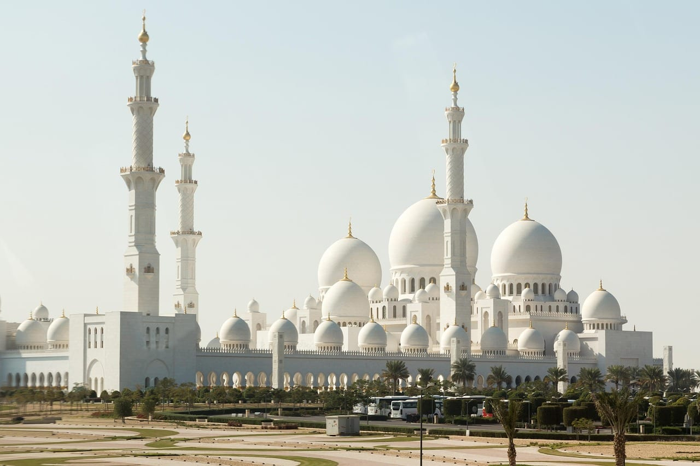

Дальше по делу: куда ехать кроме Дубая, сколько на самом деле стоит неделя, какие карты не работают и что нельзя делать, чтобы не уехать со штрафом.

> **Если коротко:** россиянам **виза в ОАЭ не нужна** — на границе ставят бесплатный штамп на срок **до 90 дней в течение каждого периода в 180 дней**, и это касается туризма, гостевых и деловых поездок, но не работы, учёбы и проживания ([генконсульство России в Дубае](https://dubai.mid.ru/ru/obshchaya_informatsiya/rezhim_vezda_v_oae/)). Загранпаспорт — со сроком **не меньше полугода** от даты въезда. Прямой рейс **Москва — Дубай 5 ч 30 мин, от 18 000 ₽**. Неделя на двоих: **$1200–2500** в комфорте, от $600 в экономе. **Российские Visa и Mastercard не работают вообще** — нужны наличные дирхамы и иностранная или виртуальная карта. Лучший сезон — **октябрь–апрель**, летом бывает +45 °C. Медицина платная и дорогая: <a href={cherehapaCountry("uae", "uae_guide_2026")} class="aff-cta" rel="sponsored">Оформить страховку в ОАЭ от 1 500 ₽</a> — сравнение полисов, оплата картой РФ, полис приходит в PDF.

<AffiliateNote />

---

## Семь эмиратов: куда ехать, кроме Дубая

**ОАЭ — федерация из семи эмиратов, и между ними нет ни границ, ни проверок: штамп один на всю страну.** Расстояния небольшие, дороги отличные, так что за одну поездку реально увидеть три-четыре совершенно разных сценария — от небоскрёбов до горных серпантинов.

### Дубай: витрина, которая работает круглосуточно

**Сюда едут за городом-аттракционом, и он честно им и является.** Небоскрёбы Марины, смотровые площадки, торговые центры размером с район, пляжи с белым песком. Главное, чего не ждут: рядом с этой витриной живёт старый Дубай — квартал Аль-Фахиди с глиняными стенами и ветряными башнями, рынок специй, лодки-абры через бухту за пару дирхамов.

Чего ждать не стоит: Дубай выматывает расстояниями. Между двумя «соседними» точками на карте бывает сорок минут по трассе, а пешком в полдень летом не ходят вообще. Закладывайте на день две-три точки, а не шесть.

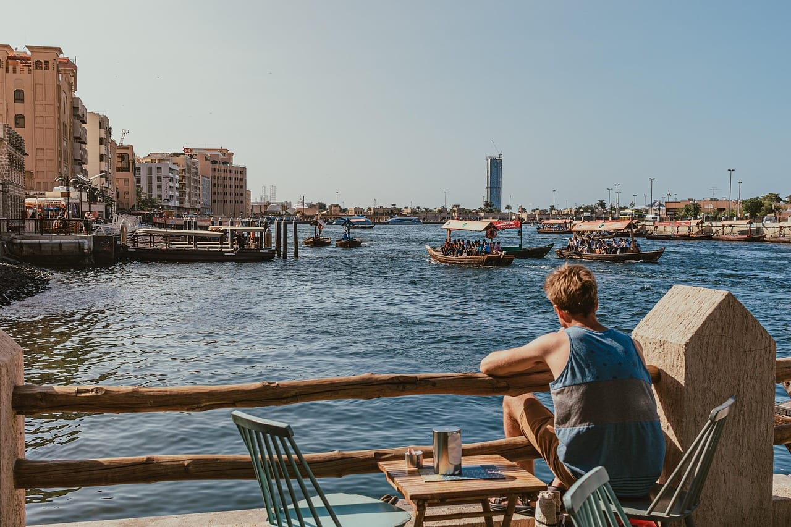

### Абу-Даби: столица, где спокойнее и дороже

**Абу-Даби — столица страны и самый крупный эмират: больше трёх четвертей всей территории ОАЭ.** Ритм здесь размереннее дубайского, а главная причина приехать — Большая мечеть шейха Зайда: белый мрамор, инкрустация цветами, вход бесплатный, но с дресс-кодом и по регистрации. Рядом — филиал Лувра и остров Яс с парками развлечений.

От Дубая — около полутора часов на машине или автобусе. Многие делают это одним днём, и такого выезда хватает на мечеть и набережную Корниш.

### Шарджа: культурная столица и полностью сухой эмират

**Шарджа примыкает к Дубаю вплотную — фактически это его продолжение, но с другими правилами.** Здесь музеи, каллиграфия, восстановленный старый город, и здесь же **действует полный запрет алкоголя**: его нельзя ни продавать, ни подавать, ни хранить, ни привозить с собой. Это не формальность, за нарушение штрафуют.

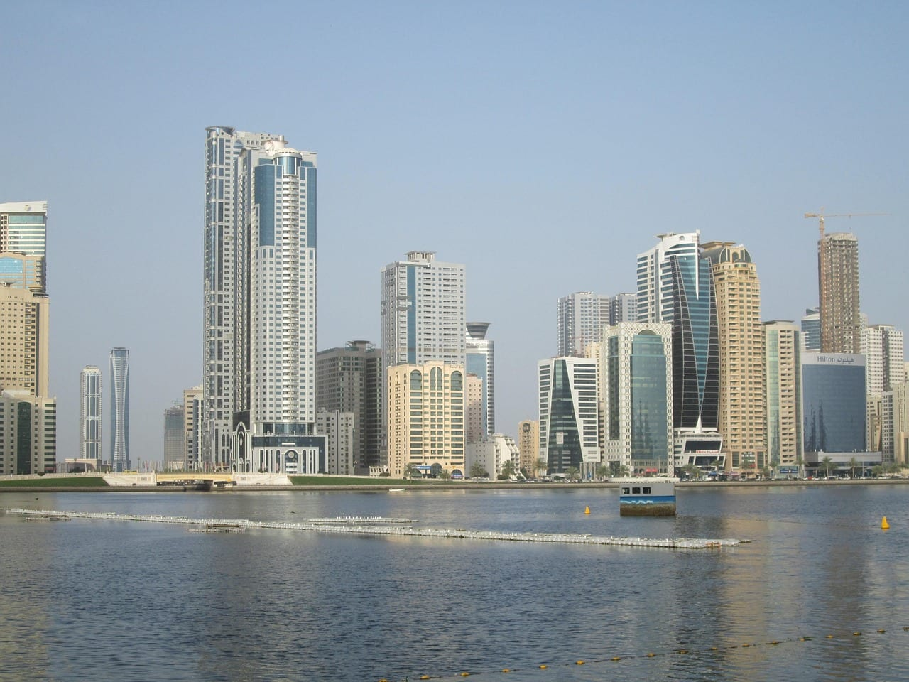

Практический вывод: если селитесь в Шардже ради экономии — а она реальна, жильё там заметно дешевле дубайского, — учитывайте и запрет, и пробки на въезде в Дубай в час пик.

### Рас-эль-Хайма: горы вместо песка

**Единственный эмират, куда едут не за морем и не за городом, а за горами.** Хребет Джебель-Джаис — самая высокая точка страны, наверх ведёт серпантин с площадками, температура там на несколько градусов ниже, чем на побережье, а зимой бывает по-настоящему холодно. Оттуда же запускают одну из самых длинных канатных трасс в мире.

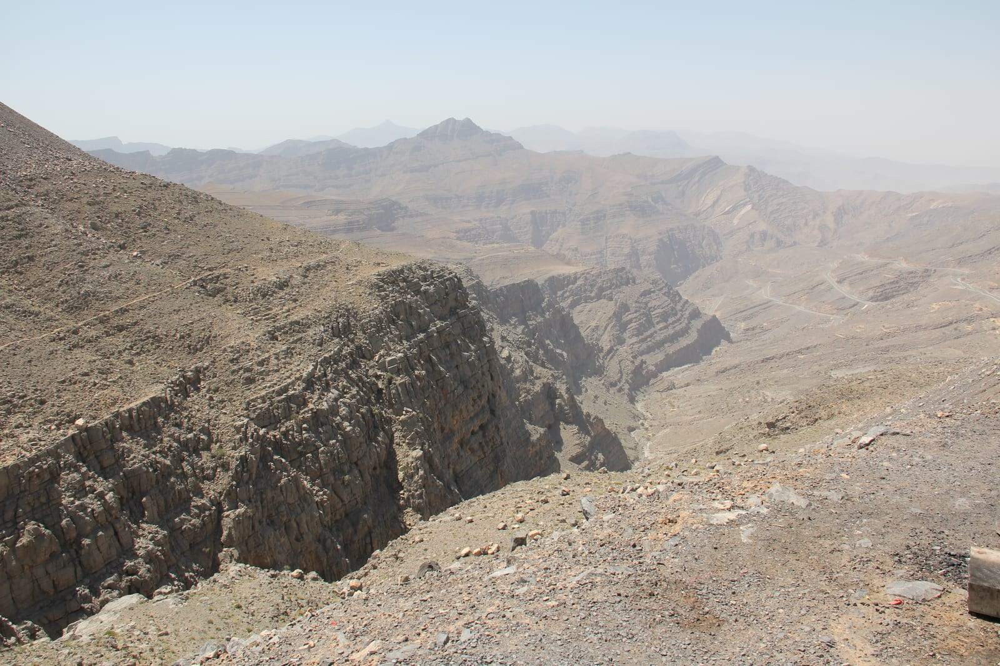

Это единственный способ увидеть Эмираты без кондиционера летом: пока внизу +45 °C, наверху ощутимо легче.

### Фуджейра: другой океан

**Фуджейра — единственный эмират на восточном берегу, то есть на Оманском заливе, а не на Персидском.** Разница не географическая формальность: вода прозрачнее, есть кораллы и снорклинг, а вместо небоскрёбов — горы, подходящие к самой воде.

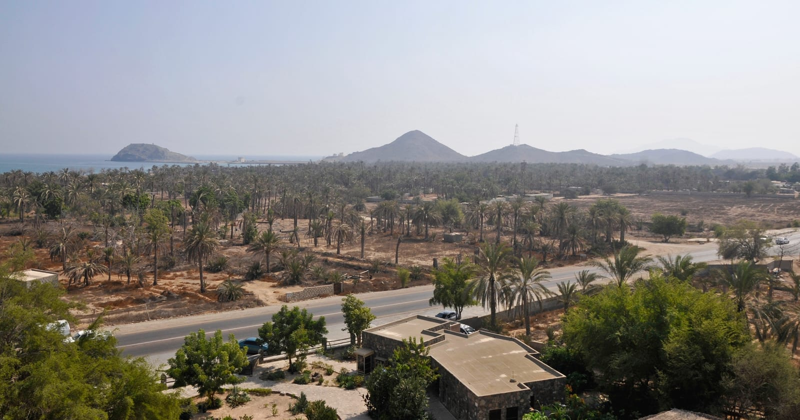

Сюда едут на два-три дня из Дубая, чаще всего ради дайвинга. Инфраструктура заметно скромнее, и это как раз то, зачем едут.

### Аджман и Умм-эль-Кайвайн: тихие и дешёвые

**Два самых маленьких эмирата, куда почти не возят экскурсии.** Аджман — компактная набережная и цены на жильё ниже дубайских в разы. Умм-эль-Кайвайн — рыбацкий уклад, мангровые заросли и полное отсутствие толп. Ехать сюда специально стоит только за тишиной; всё остальное интереснее в соседних эмиратах.

### Что выбрать под свою задачу

| Что нужно | Куда | Сколько дней |
|---|---|---|
| Город, шопинг, аттракционы | **Дубай** | 3–5 |
| Архитектура и спокойный ритм | **Абу-Даби** | 1–2 днём из Дубая |
| Музеи, старый город, экономия | **Шарджа** | 1–2 |
| Горы и прохлада | **Рас-эль-Хайма** | 2 |
| Кораллы и дайвинг | **Фуджейра** | 2–3 |
| Пустыня с ночёвкой | любой эмират, выезд из Дубая | 1 ночь |

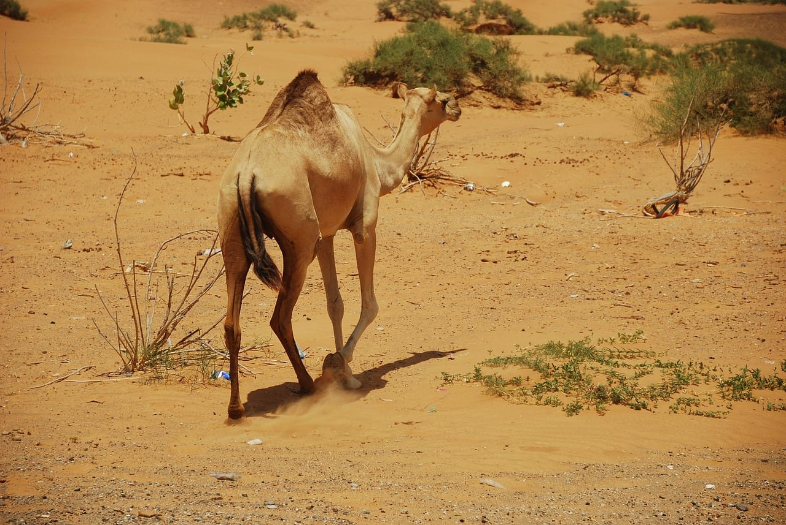

---

## Три готовых маршрута: от выходных до двух недель

**Пять дней в одном Дубае — самая частая и самая скучная схема.** Ниже три собранных варианта, которые складываются без спешки.

**Выходные, 3 дня.** Дубай целиком: день на старый город и бухту, день на смотровую и набережную, вечер на пустыню с ужином. Машина не нужна, метро и такси закрывают всё.

**Неделя, 7 дней.** Три дня Дубай, день на Абу-Даби с мечетью, два дня в Рас-эль-Хайме с горами, день в запасе на море. Машина в аренду со второго дня — иначе половина маршрута рассыпается.

**Две недели.** То же плюс переезд на восточный берег: Фуджейра, кораллы, пара дней в горах Хатты по дороге. Это уже полноценный круг по стране, и он показывает, что Эмираты — не только стекло и бетон.

---

## Нужна ли виза в ОАЭ для россиян в 2026?

**Нет, не нужна — ни в Дубай, ни в любой другой эмират.** Формулировка генконсульства России в Дубае дословная: граждане России, не имеющие намерения работать, учиться или проживать в ОАЭ, «освобождаются от визовых требований и имеют право въезда, пребывания или следования транзитом через территорию ОАЭ без виз на срок **до 90 дней в течение каждого периода в 180 дней**» ([режим въезда в ОАЭ](https://dubai.mid.ru/ru/obshchaya_informatsiya/rezhim_vezda_v_oae/)).

Что нужно на границе:

- **Загранпаспорт**, действительный не меньше полугода с даты въезда — это отдельная рекомендация консульства, а не выдумка авиакомпаний
- Цель поездки — **туризм, гости, короткие деловые переговоры**; работа, учёба и проживание сюда не входят
- У ребёнка любого возраста — **свой загранпаспорт**
- Могут спросить обратный билет и бронь жилья
- Штамп ставят **бесплатно**, заполнять ничего не нужно, на въезде сканируют лицо

**Как считается лимит.** Смотрят не на календарный год и не на дату первого въезда, а на скользящее окно: в день въезда пограничник видит, сколько дней вы провели в стране за предыдущие 180. Пока сумма меньше 90 — вопросов нет. Поездки складываются: три визита по месяцу за полгода исчерпают лимит так же, как один трёхмесячный.

**⛔ Факт, который знают немногие: продлить пребывание, оставаясь внутри страны, нельзя.** Такая практика существовала во время ковидных послаблений, но **с декабря 2022 года она прекращена** — консульство пишет об этом прямо: «для обновления визового статуса необходимо выехать за пределы границ ОАЭ». То есть план «досижу 90 дней и продлюсь на месте» не сработает: нужен вылет, и обратный въезд возможен только когда позволит то самое окно в 180 дней.

**Медицинская страховка формально не обязательна**, но консульство её рекомендует, и это тот случай, когда рекомендацию стоит выполнить: медицина в ОАЭ платная и дорогая, приём врача начинается от 250 дирхамов, а госпитализация легко уходит в сотни тысяч рублей. <a href={cherehapaCountry("uae", "uae_visa_block")} class="aff-cta" rel="sponsored">Подобрать полис в ОАЭ от 1 500 ₽</a> — сравнение страховщиков, оплата картой РФ, полис сразу в PDF.

**Резидентская виза — другая история.** Работа, учёба, покупка недвижимости и «золотая» виза оформляются заранее и через спонсора или работодателя. Разбор по странам — в [базе виз](/visa/uae/).

---

## Что говорит консульство про обстановку: читать до покупки билетов

**На август 2026 генконсульство держит на сайте отдельные рекомендации в связи с обострением на Ближнем Востоке.** Приводим суть без пересказа своими словами там, где важна точность.

Тем, кто **уже находится в ОАЭ**, консульство советует соблюдать разумные меры предосторожности, следить за сообщениями МВД страны и «воздерживаться от поездок, не являющихся необходимыми».

Что при этом сказано про саму страну: по информации властей ОАЭ **туристическая и курортная инфраструктура работает в штатном режиме**, а объекты, представляющие интерес в военном отношении, расположены на значительном удалении от туристических зон.

Практический вывод для тех, кто планирует лететь: держать связь с авиакомпанией и **заранее уточнять статус рейса** — консульство отдельно предупреждает о возможных задержках и переносах, в том числе для транзитных пассажиров через аэропорты ОАЭ. Источник и свежие обновления — [страница рекомендаций генконсульства](https://dubai.mid.ru/ru/obshchaya_informatsiya/rekomendatsi/).

---

## Сколько стоит поездка в Дубай в 2026?

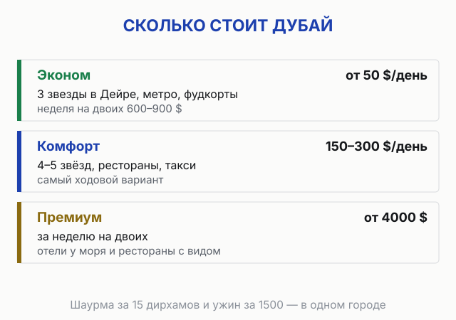

**Неделя на двоих в комфорт-варианте обойдётся в $1200–2500** (без перелёта), эконом начинается от $600, премиум от $4000. Дубай — город контрастов по цене: можно съесть отличную шаурму за 15 дирхамов, а можно ужин за 1500.

<PricingCards tiers={[
 { tier: 'Эконом', emoji: '',
 price: 'от $50/день',
 priceNote: 'на двоих, хостел/3*, метро, фудкорты',
 features: [
 'Отель 3* Дейра: от $60/ночь на двоих',
 'Хостел койка: от 25 $',
 'Еда фудкорт + шаурма: 15-40 дирхамов/блюдо',
 'Метро: 3-8 дирхамов поездка',
 'Итого неделя на двоих: ~$600-900',
 ] },
 { tier: 'Комфорт', emoji: '', featured: true, badge: 'Лучший выбор',
 price: '$150-300/день',
 priceNote: 'на двоих, 4-5*, рестораны, такси',
 features: [
 'Отель 4-5*: $120-200/ночь на двоих',
 'Рестораны: 250-400 дирхамов/день на двоих',
 'Такси Careem/Uber: 100-200 дирхамов/день',
 'Сафари в пустыне: от $50/чел',
 'Итого неделя на двоих: ~$1200-2500',
 ] },
 { tier: 'Премиум', emoji: '',
 price: 'от $500/день',
 priceNote: '5* люкс, Burj Al Arab, частные туры',
 features: [
 'Отель 5* люкс / Palm: от $400/ночь',
 'Высокая кухня: 1000-2000 дирхамов/чел',
 'Частный гид с машиной: $300-500/день',
 'Вертолётная экскурсия: от $200/чел',
 'Итого неделя на двоих: $4000+',
 ] },
]} />

**Где бронировать отель** — <a href="https://ostrovok.tpk.mx/xtyTcUcY?erid=2VtzqvE1cv3&sub_id=uae_guide_2026" class="aff-cta" rel="sponsored">Забронировать отель в Дубае</a>. Ostrovok принимает Visa/MC/МИР, в каталоге отели ОАЭ Booking-уровня со скидками по программе лояльности (Booking.com из России с оплатой не работает).

**Что входит в реальный бюджет на 7 дней (двое, комфорт):**
- Перелёт Москва-Дубай-Москва: ~50 000 ₽ ($625) на двоих
- Отель 7 ночей × $150: $1050
- Еда $40/день × 7: $280
- Такси и метро: $120
- Экскурсии (сафари, Бурдж-Халифа, Абу-Даби): $350
- Связь + страховка: $50
- **Итого ~$2475 на двоих за неделю (≈ 200 000 ₽)**

Прикинуть стоимость под свои даты можно в [калькуляторе бюджета путешествия](/calculator/).

**Или готовый тур «всё включено»** — если не хочешь собирать по частям. Пакет из Москвы с перелётом и отелем 4-5* — <a href="https://travelata.tpk.mx/Do2A3cgV?erid=2VtzqufPtiT&sub_id=uae_guide_2026" class="aff-cta" rel="sponsored">Подобрать тур в Дубай</a>: в высокий сезон часто дешевле раздельной брони, оплата картой МИР, цена сразу за двоих с перелётом.

---

## Погода в Дубае по месяцам — когда лучше ехать?

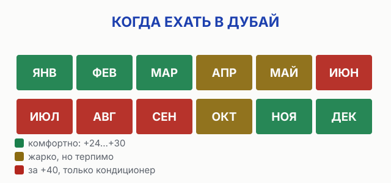

**Лучший сезон в Дубае — с октября по апрель**, когда дневная температура держится в комфортных +24…+30 °C. С мая по сентябрь начинается экстремальная жара до +45 °C — для пляжа и прогулок тяжело.

| Сезон | Месяцы | Воздух днём | Море | Оценка |
|---|---|---|---|---|
|  **Зима** | дек⁠–⁠фев | +24…+26 °C | +22 °C (янв прохладно +19) | Пик сезона, дорого |
|  **Весна** | март⁠–⁠апр | +28…+32 °C | +24 °C | Идеально, до жары |
|  **Лето** | май⁠–⁠авг | +38…+45 °C | +32 °C | Жара, песчаные бури |
|  **Осень** | сен⁠–⁠окт | +33…+30 °C | +30 °C | С октября отлично |

- **Ноябрь-март** — лучший пляжный сезон, мягкое солнце, +26 °C. Это же высокий сезон — цены на пике.
- **Март-апрель** — лучшее время: тепло, море прогрето, до пиковой жары и до подъёма летних цен.
- **Май** — возвращается жара, днём +35 °C, ночью +30 °C.
- **Июнь-август** — +40…+48 °C в тени, в полдень асфальт плавит. Зато отели дешевле в 1,5-2 раза, а молы, аквапарки и метро кондиционированы.
- **Октябрь** — море остывает до приятных +30 °C, идеально и для пляжа, и для экскурсий.

**Рамадан 2026: с 17 февраля по 19 марта.** В это время днём нельзя есть, пить и курить в общественных местах (включая туристов), часть кафе работает только вечером, а ночная жизнь смещается на после заката. Для уважительного путешественника не проблема, но планировать стоит с учётом.

Сезонность по всем направлениям — в [таблице сезонов по месяцам](/seasons/).

---

## Сколько лететь и сколько стоит перелёт Москва — Дубай?

**Прямой рейс Москва-Дубай — 5 ч 30 мин, от 18 000 ₽ в одну сторону** эконом-классом. Летают Аэрофлот, Emirates и flydubai из Москвы, есть прямые из Санкт-Петербурга, Казани, Екатеринбурга.

<FlightRoutes routes={[
 {
 from: 'Москва', to: 'Дубай',
 flights: [
 { airline: 'Аэрофлот', code: 'SU', duration: '5 ч 30 мин', priceFrom: '18 000 ₽', priceUrl: 'https://aviasales.tpk.mx/JCSPlC17?erid=2Vtzqxkn4LF&sub_id=uae_guide_2026&u=https%3A%2F%2Fwww.aviasales.ru%2Fsearch%2FMOW1509DXB1' },
 { airline: 'Emirates', code: 'EK', duration: '5 ч 25 мин', priceFrom: '22 000 ₽' },
 { airline: 'flydubai', code: 'FZ', duration: '5 ч 40 мин', priceFrom: '16 000 ₽' },
 ]
 },
 {
 from: 'Санкт-Петербург', to: 'Дубай',
 flights: [
 { airline: 'flydubai', code: 'FZ', duration: '6 ч', priceFrom: '19 000 ₽' },
 { airline: 'Россия', code: 'FV', duration: '6 ч 10 мин', priceFrom: '21 000 ₽' },
 ]
 },
 {
 from: 'Казань', to: 'Дубай',
 flights: [
 { airline: 'flydubai', code: 'FZ', duration: '5 ч 20 мин', priceFrom: '20 000 ₽' },
 ]
 },
]} caption="Прямые рейсы в Дубай в 2026" />

Поймать дешёвый билет помогает <a href="https://aviasales.tpk.mx/JCSPlC17?erid=2Vtzqxkn4LF&sub_id=uae_guide_2026&u=https%3A%2F%2Fwww.aviasales.ru%2Fsearch%2FMOW1509DXB1" class="aff-cta" rel="sponsored">Найти билет Москва — Дубай</a>: сравнивает все авиакомпании сразу, а cookie живёт 30 дней, так что цену можно мониторить и забронировать позже. Билеты дешевле всего летом (низкий сезон по погоде) и в будни, дороже всего на новогодние праздники и в марте.

**Аэропорты:** Дубай имеет два — основной **DXB** (международный, рядом с городом) и **DWC** (Al Maktoum, дальше, бюджетные рейсы). Большинство рейсов из России — в DXB.

**Из аэропорта в город:** метро (красная линия) идёт прямо из терминалов DXB — 8 дирхамов до Даунтауна, 50 минут. Такси — 50-80 дирхамов до центра. Careem и Uber работают.

---

## В каком районе Дубая остановиться?

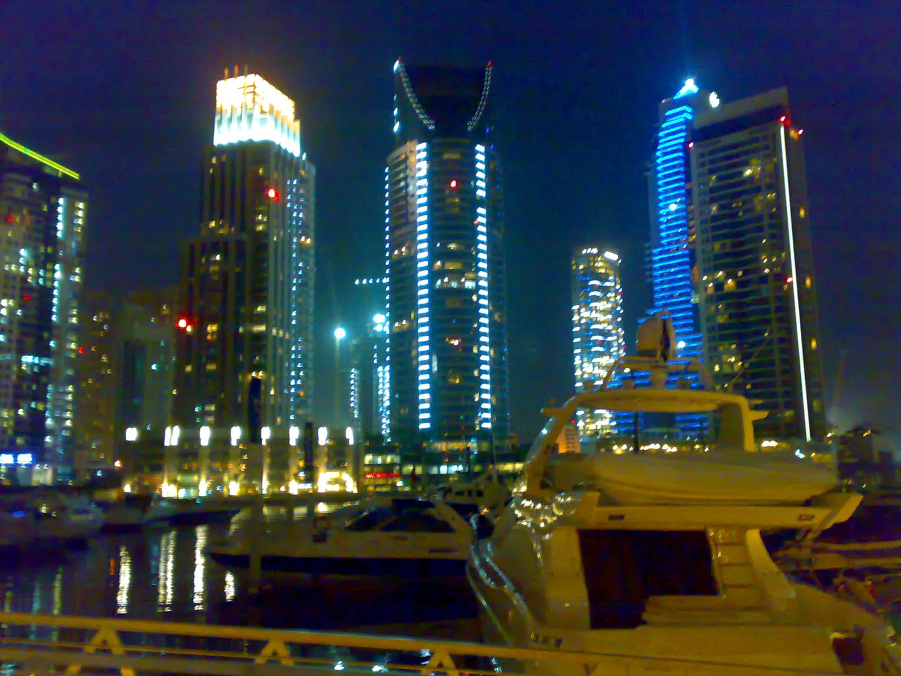

**Для первой поездки лучше всего три района: Даунтаун (центр, всё рядом), Дубай Марина (пляж + современность) и Дейра/Бур-Дубай (старый город, бюджетно).** Выбор зависит от того, что важнее — достопримечательности, пляж или цена.

- **Даунтаун (Downtown)** — сердце Дубая: Бурдж-Халифа, Дубай Молл, поющие фонтаны. Дорого, но всё в шаговой доступности и есть метро. Лучший выбор для первого знакомства.
- **Дубай Марина / JBR** — современный прибрежный район с небоскрёбами, яхтами, набережной и пляжем. Идеально для пляжного отдыха и вечерних прогулок. Цены высокие.
- **Дейра и Бур-Дубай (старый город)** — исторический Дубай: рынки золота и специй, переправа на лодке-абра, аутентичная атмосфера. Здесь самые доступные отели (3-4* от $60-70).
- **Palm Jumeirah** — искусственный остров-пальма с люксовыми курортами (Atlantis). Премиум-сегмент, далеко от метро.

<a href="https://ostrovok.tpk.mx/xtyTcUcY?erid=2VtzqvE1cv3&sub_id=uae_guide_2026" class="aff-cta" rel="sponsored">Подобрать отель по районам</a> — каталог ОАЭ с оплатой российскими картами.

---

<CountryMap slug="uae" countryNom="ОАЭ" />

## Что посмотреть в Дубае — главные места?

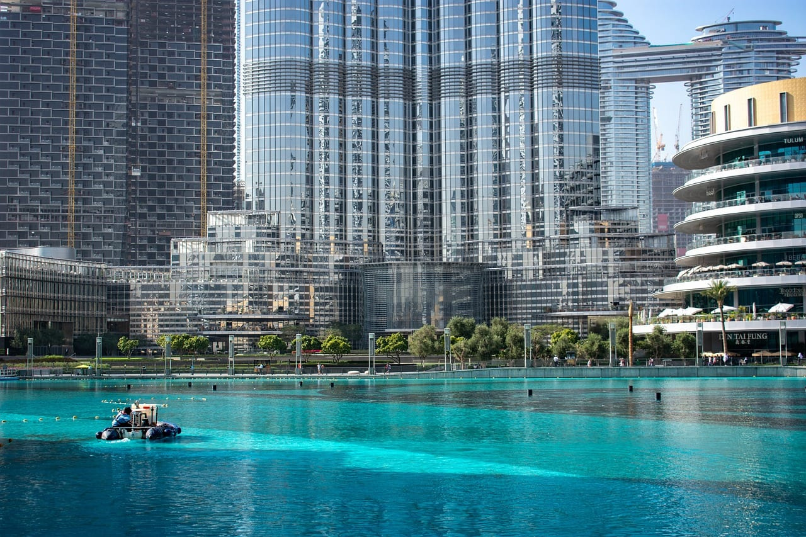

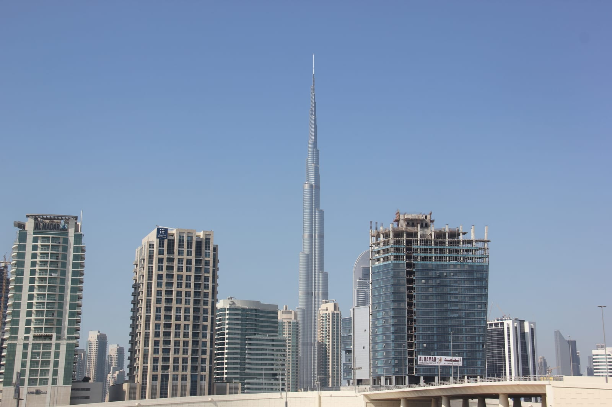

**Минимум для первого раза:** Бурдж-Халифа, Дубай Молл с фонтанами, старый город с рынками и сафари в пустыне. Этого хватит на 3-4 дня; на 5-7 добавляются Марина, Музей Будущего и поездка в Абу-Даби.

- **Бурдж-Халифа** — самое высокое здание мира (828 м). Смотровая на 124-148 этажах от 169 дирхамов (дешевле онлайн заранее).
- **Дубай Молл** — один из крупнейших ТЦ мира: аквариум, каток, водопад. У подножия — **шоу поющих фонтанов** (каждые 30 мин с 18:00, бесплатно).
- **Айн Дубай** — самое большое колесо обозрения мира (250 м), оборот 38 минут.
- **Музей Будущего** — футуристическое здание на Sheikh Zayed Road, билет ~149 дирхамов, бронировать заранее.
- **Старый Дубай** — район Аль-Фахиди, переправа на лодке-абра через бухту (1 дирхам), рынки золота (Gold Souk) и специй (Spice Souk) в Дейре.
- **Сафари в пустыне** — катание на джипах по дюнам, ужин с шоу, верблюды. От $50/чел, бронируется на месте или онлайн.
- **Дубай Марина и JBR** — набережная небоскрёбов, пляж, лодочные прогулки.

Готовые экскурсии на русском с местными гидами удобно бронировать онлайн заранее — без языкового барьера и с известной ценой. Что положить в чемодан под сезон — в [чек-листе по ОАЭ](/packing/uae/).

---

## Маршрут по Дубаю на 5 дней

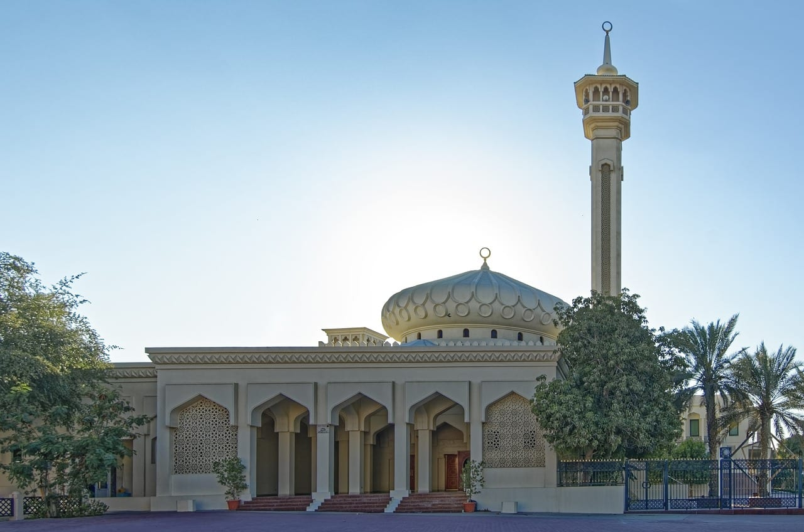

**Лучшая схема: 2 дня на современный Дубай, 1 день на старый город, 1 день на пустыню, 1 день на Абу-Даби.** Так вы увидите оба лица Эмиратов — небоскрёбы и аутентичный Восток.

- **День 1 — Даунтаун:** утром Бурдж-Халифа (бронь заранее), днём Дубай Молл и аквариум, вечером шоу фонтанов. Ночёвка в центре.
- **День 2 — Марина и пляж:** утро на пляже JBR, днём прогулка по Дубай Марина, вечером Айн Дубай и закат на набережной.
- **День 3 — Старый Дубай:** Аль-Фахиди, переправа на абра, рынки золота и специй в Дейре, обед в локальном кафе. Вечером — Музей Будущего.
- **День 4 — Пустыня:** днём отдых/аквапарк (Wild Wadi или Aquaventure), вечером сафари по дюнам с ужином.
- **День 5 — Абу-Даби:** мечеть шейха Зайда, Лувр Абу-Даби, парк Ferrari World (по желанию). Возврат вечером.

Для полного погружения с парками и пляжным отдыхом закладывайте 7 дней.

---

## Как платить в Дубае картами из России?

**Российские Visa и Mastercard в ОАЭ не работают** — ни в магазинах, ни в банкоматах, ни онлайн. Это главная ошибка неподготовленных туристов. Готовиться надо **до вылета**.

**4 рабочих способа:**

**Дирхам привязан к доллару, и курс почти не гуляет:** на 18 августа 2026 года Банк России даёт **23,15 ₽ за дирхам**, то есть сотня дирхамов — это чуть больше двух тысяч рублей. Считать в уме удобно так: дирхам ≈ 23 ₽.

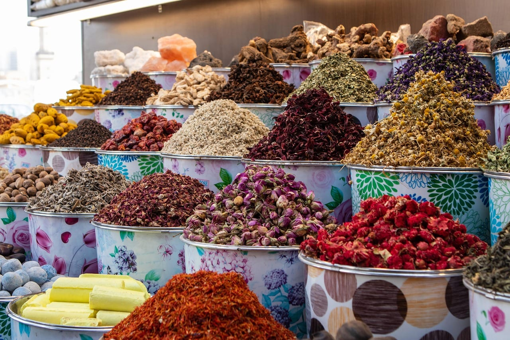

1. **Наличные дирхамы** — самый надёжный. Купить лучше в России (или доллары/евро и обменять на месте в обменниках без комиссии). На неделю комфорт-отдыха закладывайте 2000-4000 дирхамов наличными.

2. **Иностранная или виртуальная карта Visa/MC** — для отелей, аренды авто и крупных покупок. Россиянам проще всего — <a href="https://platipomiru.com/?utm_source=traveltribe&utm_medium=cpa" class="aff-cta" rel="sponsored">Выпустить виртуальную карту USD/EUR</a>: пара минут, пополнение рублями через СБП.

3. **UnionPay** — Газпромбанк под санкциями с ноября 2024 и не работает; у других РФ-банков (Россельхозбанк) приём нестабильный. UnionPay местного банка СНГ работает ограниченно — сетевые отели, крупные ТЦ, банкоматы некоторых банков. На бытовые покупки не рассчитывать — держите как резерв.

4. **Карта банка ОАЭ/СНГ** — если есть карта банка Армении, Казахстана или самих Эмиратов, она работает полноценно.

Подробный разбор всех вариантов оплаты — в гайде [как платить за границей россиянам 2026](/blog/pay-abroad-2026/), а сравнение платёжных систем по странам — в [карте платёжных систем](/cards/).

---

## Как передвигаться по Дубаю — метро, такси, аренда авто?

**Самый удобный транспорт для туриста — связка метро + такси Careem/Uber.** Дубай растянут, пешком далеко, но общественный транспорт современный и дешёвый.

- **Метро** — две основные линии (красная и зелёная), чисто, кондиционировано, по карте Nol (покупается на станции). Поездка 3-8 дирхамов. Красная линия идёт от аэропорта через Даунтаун до Марины.
- **Такси и Careem/Uber** — официальное такси по счётчику (посадка 12 дирхамов), Careem (местный аналог Uber) часто дешевле и принимает карты. Поездка по центру 30-60 дирхамов.
- **Трамвай и монорельс** — трамвай в районе Марины, монорельс на Palm Jumeirah.
- **Аренда авто** — от $30/день, нужны международные права (или российские + перевод) и залог на карту. Бензин дешёвый, дороги отличные, но штрафы за превышение строгие и автоматические. Парковки платные в центре. <a href="https://economybookings.tpk.mx/xlSFNA6p?erid=2VtzqxYvA5V&sub_id=uae_guide_2026" class="aff-cta" rel="sponsored">Сравнить прокат авто в Дубае</a>: агрегатор показывает локальных и международных прокатчиков с ценой под даты — на машине удобны Абу-Даби, пустыня и трасса E11.

**Лайфхак:** в жару (май-сентябрь) метро и моллы соединены кондиционированными переходами — можно перемещаться по центру, почти не выходя на улицу.

---

## Стоит ли съездить в Абу-Даби из Дубая?

**Да, на один день — обязательно.** Абу-Даби, столица ОАЭ, в 1,5 часах езды от Дубая, и там есть то, чего в Дубае нет: главная мечеть страны и филиал Лувра.

- **Мечеть шейха Зайда** — одна из красивейших мечетей мира, белый мрамор, вмещает 40 000 человек. Вход бесплатный, нужен скромный дресс-код (абайю выдают на месте).
- **Лувр Абу-Даби** — филиал парижского Лувра под куполом-«дождём света», билет ~63 дирхама.
- **Ferrari World** — крытый парк развлечений с самыми быстрыми американскими горками мира (240 км/ч).
- **Остров Яс** — Warner Bros. World, аквапарк, пляжи.

**Как добраться:** автобус от Дубая (25 дирхамов, ~2 ч), аренда авто (1,5 ч по трассе E11) или организованная экскурсия с гидом. Удобнее всего — экскурсия на день: трансфер + основные точки за один заезд.

---

## Что нельзя делать в Дубае — законы и Рамадан 2026?

**ОАЭ — мусульманская страна со строгими законами, и незнание не освобождает от штрафа.** Большинство правил — здравый смысл, но есть неочевидные для туриста.

**Главные запреты:**
- **Алкоголь** — только в лицензированных местах (бары при отелях, рестораны). Пить на улице, в парке или появляться пьяным в общественном месте — штраф или арест.
- **Публичные проявления чувств** — поцелуи и объятия на людях не приветствуются, за откровенное могут оштрафовать.
- **Фотографировать людей** (особенно женщин в традиционной одежде) и госучреждения без разрешения — запрещено.
- **Наркотики** — крайне суровое наказание вплоть до тюрьмы, даже за следовые количества; осторожнее с лекарствами (некоторые рецептурные препараты запрещены — проверяйте список).
- **Нескромная одежда** в общественных местах — на пляже купальник ок, но в моллах и на улице плечи и колени лучше прикрыть.
- **Ругань и непристойные жесты** — в том числе в соцсетях; за это реально штрафуют.

**Рамадан 2026 (17 февраля — 19 марта):** днём нельзя есть, пить и курить в общественных местах, включая туристов. Кафе работают за ширмами или только вечером. Уважение к посту обязательно — нарушение карается штрафом. После заката (ифтар) — праздничная атмосфера и скидки.

Это не повод бояться: туристы спокойно отдыхают, нужно лишь соблюдать местные нормы. Подробности по странам — в [базе виз и правил въезда](/visa/uae/).

---

## Как сэкономить в Дубае и каких ошибок избегать?

**Дубай дорогой только если жить «как в рекламе». При желании неделя выходит в бюджет Турции.** Главное — не платить за бренд и знать, где наценка.

**Как сэкономить:**
- **Ехать в межсезонье** (май–сентябрь): отели дешевле в 1,5–2 раза, а жара переживается в кондиционированных моллах и аквапарках.
- **Жить в Дейре/Бур-Дубае** — отели на 40–50% дешевле центра, метро довезёт куда надо.
- **Есть в локальных кафе и фудкортах** — шаурма 15 дирхамов, тали в индийском кафе 25, против 150+ в туристическом ресторане.
- **Билеты онлайн заранее** — Бурдж-Халифа, Музей Будущего, парки дешевле при покупке на сайте, чем в кассе.
- **Метро вместо такси** — на длинных маршрутах экономия в разы.
- **Бесплатное** — фонтаны, пляжи (Kite Beach, JBR), переправа на абра (1 дирхам), прогулки по Марине.

**Главные ошибки новичков:**
- Прилететь без наличных и с российской картой — остаться без денег в первый день.
- Поехать летом не зная про +45 °C и испортить отдых.
- Не взять страховку — и попасть на десятки тысяч рублей за приём врача.
- Распивать алкоголь на улице или шуметь — нарваться на штраф.
- Брать такси «по договорённости» без счётчика у туристических точек — переплата в 2–3 раза.

Что взять с собой под конкретный сезон — [чек-лист упаковки в ОАЭ](/packing/uae/).

---

## Двенадцать вещей, которые стоит знать заранее

**Эмираты кажутся простыми до первого штрафа.** Ниже то, что экономит деньги и нервы, и о чём обычно узнают на месте.

**Про деньги и покупки**

- **Меняйте не в аэропорту.** Курс в городских обменниках заметно лучше аэропортовского; в торговых центрах обменники есть почти всегда.
- **Торг на рынках — норма**, в магазинах — нет. На рынке специй или в золотом квартале первая названная цена почти всегда завышена.
- **Чаевые не обязательны**, но в счёте ресторана нередко уже стоит сервисный сбор — посмотрите строку, прежде чем добавлять сверху.
- **Возврат налога для туристов работает**: при покупках в магазинах со специальной наклейкой чек оформляют на возврат, деньги получают в аэропорту до вылета.

**Про транспорт**

- **Метро дешевле такси в разы**, но им покрыт только Дубай и не весь. В метро действует зонная карта; в первом вагоне — «золотой» класс, есть отдельный вагон для женщин и детей.
- **В метро нельзя есть, пить и жевать жвачку** — за это штрафуют, и это не формальность.
- **Такси — только по счётчику.** Приложения работают, наличные принимают, но договариваться «за сумму» не стоит.
- **Аренда машины имеет смысл со второго дня**, если план выходит за пределы Дубая: до Абу-Даби, гор и восточного берега общественным транспортом добираться долго.

**Про правила, которые легко нарушить не заметив**

- **Алкоголь.** В Шардже он запрещён полностью. В остальных эмиратах продаётся и подаётся в лицензированных местах, но пить на улице, в парке или на пляже нельзя нигде, как и появляться пьяным в общественном месте.
- **Одежда.** На пляже и у бассейна — как везде, но в город, торговый центр и особенно в мечеть нужны закрытые плечи и колени; женщинам в мечети — платок.
- **Съёмка людей без спроса** — плохая идея, а в некоторых случаях это прямое нарушение закона о частной жизни. Особенно это касается местных женщин и госучреждений.
- **Рамадан.** В светлое время суток не едят, не пьют и не курят на улице — это относится и к туристам. Кафе при отелях работают, часть заведений открывается только после заката.

---

## FAQ

**Нужна ли виза в Дубай россиянам в 2026?**
**Нет.** Гражданам РФ виза не нужна — в аэропорту бесплатно ставят штамп на пребывание **до 90 дней** в течение любого 180-дневного периода. Нужен только загранпаспорт со сроком от 6 месяцев. Безвиз — для туризма и бизнеса, не для работы.

**Сколько можно находиться в ОАЭ без визы?**
**До 90 дней** суммарно за 180-дневный период. Если использовали все 90 дней, для нового въезда нужно дождаться, пока с даты первого въезда пройдёт 180 дней (то есть выждать ~3 месяца после выезда).

**Когда лучше ехать в Дубай?**
**С октября по апрель** — комфортные +24…+30 °C. Лучшее соотношение погода/цена — март-апрель и октябрь-ноябрь. Декабрь-февраль — пик сезона (дорого). Май-сентябрь — жара до +45 °C, но отели дешевле в 1,5-2 раза.

**Сколько стоит неделя в Дубае на двоих?**
**Эконом** — от $600 (без перелёта): хостел/3*, фудкорты, метро. **Комфорт** — $1200-2500: 4-5*, рестораны, такси, экскурсии. **Премиум** — от $4000. Перелёт сверху ~50 000 ₽ на двоих туда-обратно прямым рейсом.

**Сколько лететь до Дубая из Москвы?**
**5 часов 30 минут** прямым рейсом. Летают Аэрофлот, Emirates, flydubai из Москвы, есть прямые из СПб, Казани, Екатеринбурга. Билет от 16 000-18 000 ₽ в одну сторону эконом-классом.

**Работают ли карты МИР и Visa/Mastercard в ОАЭ?**
**Российские Visa/Mastercard — нет.** МИР не принимается. UnionPay российских банков работает плохо (Газпромбанк под санкциями с ноября 2024, у Россельхозбанка нестабильно); надёжнее UnionPay местного банка СНГ — в крупных отелях и ТЦ. Основной способ оплаты для туриста — **наличные дирхамы** + иностранная или <a href="https://platipomiru.com/?utm_source=traveltribe&utm_medium=cpa" class="aff-cta" rel="sponsored">виртуальная карта USD/EUR</a>.

**Какую валюту брать в Дубай?**
**Дирхамы ОАЭ (AED)** — курс ~22 ₽ за дирхам (1 USD = 3,67 AED, фиксированный). Удобно везти доллары или евро наличными и менять в обменниках ОАЭ (выгоднее, чем покупать дирхамы в России). Минимум наличных на первый день — обязателен.

**Нужна ли страховка для Дубая?**
**Формально для безвиза — нет, но настоятельно рекомендуется.** Медицина в ОАЭ платная и дорогая: приём врача от 250 дирхамов, серьёзный случай — десятки тысяч. Полис на неделю — <a href="https://cherehapa.tpk.mx/fkM7suze?erid=2VtzquZTwb5&sub_id=uae_guide_2026" class="aff-cta" rel="sponsored">Оформить страховку от 1 500 ₽</a>.

**Можно ли пить алкоголь в Дубае?**
**Да, но только в лицензированных местах** — барах и ресторанах при отелях. Распивать на улице, в парке или появляться пьяным в общественном месте — штраф или арест. В магазинах алкоголь продаётся ограниченно. В Рамадан — строже.

**Что нельзя делать туристу в Дубае?**
Пить алкоголь вне лицензированных мест, появляться пьяным на людях, целоваться/обниматься на публике, фотографировать людей и госучреждения без спроса, нескромно одеваться в общественных местах, ругаться (в т.ч. в соцсетях). Наркотики — суровое наказание. В Рамадан — не есть/пить/курить днём на людях.

**Стоит ли ехать в Абу-Даби из Дубая?**
**Да, на один день.** 1,5 часа езды. Главное — мечеть шейха Зайда (бесплатно, белый мрамор, потрясающая) и Лувр Абу-Даби. По желанию — Ferrari World и остров Яс. Удобнее всего экскурсией на день или на арендованном авто.

**Какой бюджет на еду в Дубае?**
**От 15 дирхамов** (шаурма, фудкорт) до 150+ (туристический ресторан). На двоих комфортно — 250-400 дирхамов в день ($70-110). Экономия — локальные индийские/пакистанские кафе и фудкорты в моллах, где едят сами местные.

---

## Что почитать дальше

- [ОАЭ — кратко: виза, сезоны, бюджет](/uae/) — краткая справка по стране
- [Как платить за границей россиянам 2026](/blog/pay-abroad-2026/) — наличные, виртуальные карты, UnionPay
- [Связь за границей 2026](/blog/esim-zagranicey-2026/) — eSIM и SIM для ОАЭ
- [Что взять в ОАЭ](/packing/uae/) — чек-лист упаковки под сезон
- [Виза и правила въезда в ОАЭ](/visa/uae/) — детали безвиза
- [Сезоны путешествий](/seasons/) — выбор месяца под направление
- [Калькулятор бюджета поездки](/calculator/) — расчёт под свои даты

---

*Проверял 21.05.2026; визовые и таможенные правила меняются — сверяй с [посольством ОАЭ](https://mofa.gov.ae/) и [МИД РФ](https://www.mid.ru/) перед покупкой билета. Если что-то устарело — напиши в [Telegram-канал @traveltriberu](https://t.me/traveltriberu), обновлю.*

*Фото: Wikimedia Commons — Bjoertvedt (Дубай Марина) / [CC BY-SA](https://creativecommons.org/licenses/by-sa/4.0/). Схемы наши.*
