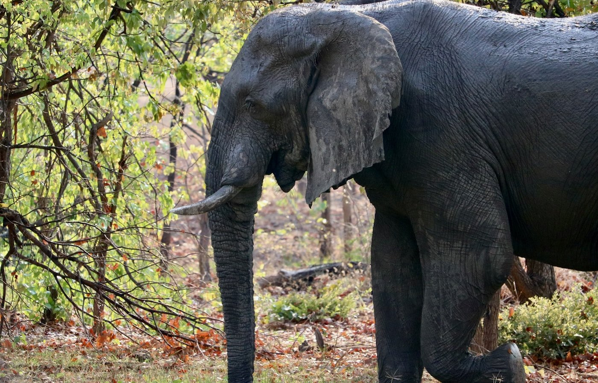
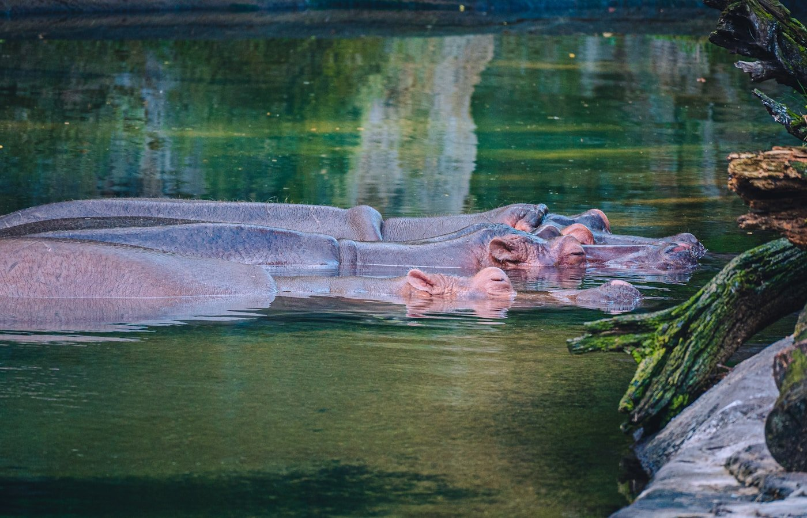

Я просыпаюсь от того, что снаружи кто-то очень громко жуёт ветку. Раздвигаю шторы — за москитной сеткой, в полутора метрах от веранды, стоит слон. Не из брошюры. Живой, серый, размером с фургон. Спокойно объедает дерево, пока я в трусах пытаюсь сообразить, надо ли орать охрану. Через минуту приходит парень с фонариком и шёпотом объясняет: «Он каждый вечер так. Не выходите до рассвета». **Это была вторая ночь в Уганде. Первой ночью к нам приходила горилла. Третьей — никто, и было даже немного обидно.**

Уганду в России знают плохо. У большинства она проходит как «где-то рядом с Кенией, кажется», или вообще как мем про Уганда-Наклза. По факту это одна из лучших стран Восточной Африки для сафари — дешевле Кении, разнообразнее Танзании, и тут до сих пор можно увидеть горных горилл в дикой природе. Их в мире осталось около тысячи, и половина — здесь.

> **Если коротко:** в Бвинди — **половина горных горилл планеты** (~500 особей). Пермит **$800** за час с гориллами, виза $50, прививка от жёлтой лихорадки обязательна. Сезон **июнь–сентябрь** и декабрь–февраль. Бюджет 10 дней — от **$2000** (эконом) до **$3500–6500** (наш и премиум).

> **Когда лучше ехать в Уганду:** [таблица сезонов](/seasons/) — оптимально июнь–сентябрь и декабрь–февраль (сухо, треккинг проходимый).

Дальше — что я выяснил за 10 дней: как добраться, виза для россиян, реальные цены, маршрут, что брать с собой и какие косяки нас ждали. Без рекламы туров и романтических соплей про «сердце Африки».

---

## 🐘 Что вообще такое Уганда — короткий контекст

Уганда — небольшое государство в Восточной Африке, размером с Великобританию. Граничит с Кенией, Танзанией, Руандой, ДР Конго и Южным Суданом. Выхода к морю нет, зато есть огромная часть озера Виктория и истоки Нила. Столица — Кампала, прилетают все в Энтеббе (40 минут от столицы).

Климат субэкваториальный, но из-за высоты (большая часть страны — плато 1100–1500 м) тут нежарко. Днём +25–28, ночью в горах опускается до +12. Это не Танзания и не Кения с раскалёнными саваннами — тут зелено, бывают туманы, в Бвинди регулярно идут дожди.

Население — 46 миллионов, английский в качестве официального (ещё суахили и около 40 местных языков). По уровню жизни — ниже среднего по региону, ВВП на душу около $1100/год. Туризм — третья по величине отрасль экономики, после кофе и денежных переводов диаспоры. К туристам относятся очень доброжелательно, реально доброжелательно — без той приклеенной улыбки «дай мне доллар», которая есть в Кении.

Безопасно ли? Да, в туристических зонах — однозначно. Север страны (граница с Южным Суданом) и крайний запад у Конго — лучше не лезть, там разные группировки. Стандартный туристический маршрут (Энтеббе → Бвинди → Queen Elizabeth → Кампала) — спокойнее, чем выходить ночью в Москве у трёх вокзалов.

---

## 🦍 Гориллы в Бвинди — главный аттракцион страны

Это то, ради чего сюда едут. И то, ради чего стоит ехать, если хоть раз думали про сафари.

В мире около **1063 горных гориллы** ([данные WWF на 2024](https://www.worldwildlife.org/species/mountain-gorilla)). Они живут в трёх местах: Бвинди (Уганда), Вирунга (Уганда + Руанда + Конго) и Мгахинга (Уганда). Из них примерно половина — в Бвинди. И это единственное в мире место, где их популяция растёт, а не сокращается.

Бвинди — это **Bwindi Impenetrable Forest National Park**, объект ЮНЕСКО. Название честное: лес реально непроходимый. Гора, склоны 30–60 градусов, мокрая глина, лианы, бамбук, гигантская крапива (вы поймёте, о чём я, на второй час треккинга). Туда не получится «приехать и заглянуть» — это полноценная экспедиция на день.

### Как организован треккинг

Утром в 7:45 все собираются в офисе UWA (Uganda Wildlife Authority) в одном из четырёх секторов — Buhoma, Ruhija, Rushaga или Nkuringo. Брифинг 30 минут: ходить тихо, не подходить ближе 7 метров (на деле подойдёшь намного ближе, гориллам плевать), не есть и не пить рядом с ними, не смотреть в глаза самцу — это вызов. Респираторная маска обязательна с 2020 года: гориллы биологически близки к нам, простуда от человека их убивает.

Группа — максимум 8 туристов на одну семью горилл. Дают рейнджера с автоматом (теоретически — от слонов и буйволов; за 60 лет существования парка не было ни одного случая, чтобы пришлось стрелять) и двух трекеров. Идёте по горам столько, сколько потребуется, чтобы найти семью — от часа до восьми. У нас вышло **3 часа 40 минут**, и это нормально.

После того как вышли к гориллам — **час**. Ровно час по таймеру, потом разворачивают обратно. Нам досталась семья **Mubare** (та самая, на которой в 1993 году начали habituation — приучение к людям). Серебряная спина, четыре самки, двое детёнышей. Один малыш минут двадцать рассматривал мой ботинок с расстояния полутора метров. Я тупо стоял с маской на лице и боялся моргнуть.

### Сколько стоит — и почему так дорого

**Пермит на гориллу: $800 USD с человека** ([UWA, актуально 2025–2026](https://ugandawildlife.org/explore-our-parks/parks-by-name-a-z/bwindi-impenetrable-national-park/)). С 1 июля 2024 цену подняли с $700. Это самая дорогая разовая активность в нашей поездке. Многие крутят головой при этой цифре — но 75% денег идут в фонд охраны парка и местным общинам. Без этих денег не было бы ни горилл, ни леса.

В соседней Руанде, кстати, пермит стоит **$1500**. В Конго — **$400**, но туда сейчас ехать рискованно из-за политической обстановки.

Бронировать пермит надо за **3–6 месяцев** через UWA напрямую или через местных операторов. В высокий сезон (июль–август, декабрь–февраль) пермиты разбирают за 4–6 месяцев. Низкий сезон — апрель–май, ноябрь — можно поймать за месяц, но и риск дождей выше.

### Что брать с собой на треккинг

Слитый список одной строкой, потому что это правда один набор: непромокаемые штаны (не «водоотталкивающие», а реально rain pants), длинные носки заправить в ботинки (от муравьёв-сиафу, которые могут заползти и больно укусить), перчатки садовые х/б ($2 на любом местном рынке — спасают от крапивы, в которой будете лезть руками по склону), 2 литра воды, перекус, дождевик поверх рюкзака, налобный фонарь на всякий случай. Камеру — да, но без вспышки, и в герметичной сумке. Палку для трекинга дают на месте, не покупайте.

Совет, которого мне не хватило: **гетры (gaiters)**. У наших проводников были, у нас — нет. Без них в первый же час набрал воды в ботинки до колен. На обратном пути снимали их как из ведра.

Есть опция **portering** — местный носильщик за $20 несёт ваш рюкзак и помогает на крутых склонах. Берите всегда, даже если вы в форме. Это ваш вклад в локальную экономику и реальная помощь на спусках по глине.

---

## 🚤 Лодка по Казинге — гиппопотамы на расстоянии вытянутой руки

После Бвинди мы переехали в **Queen Elizabeth National Park**. Это второй по популярности парк страны, 1978 км², между двумя озёрами — Эдвард и Джордж, — соединёнными **Kazinga Channel** длиной 32 км.

Лодочное сафари по Казинге — must do всей Уганды. Стоит **$30 с человека за 2 часа** ([UWA, цены 2025](https://ugandawildlife.org/explore-our-parks/parks-by-name-a-z/queen-elizabeth-national-park/)), отправление утром в 11:00 и днём в 14:00 от Mweya Peninsula. Лодка плоская, открытая, человек на 30. Я бы советовал утренний рейс — меньше людей и животные активнее.

На канале живёт самая высокая концентрация гиппопотамов в мире — около **5000 особей на 32 км воды**. В одном кадре их легко 30–40 штук. Когда лодка проходит мимо — они смотрят с расстояния 5 метров своими красно-карими глазами, и ты понимаешь, что между тобой и тем, кто убивает в Африке больше людей, чем львы и крокодилы вместе взятые, — только метр алюминиевого борта.

Кроме гиппо, на берегу: буйволы, слоны (стадо 20+ голов мы видели на водопое), нильские крокодилы, водные козлы (косуля-уотербак), тысячи птиц — пеликаны, орланы-крикуны, скопы, голубой зимородок размером с воробья и какой-то невероятной синевы. Если интересуетесь птицами — берите бинокль, этот канал считается одним из лучших мест бёрд-вотчинга в Африке (более 600 видов в QE NP).

Слона видели в воде — он переходил канал вброд, видна только спина и хобот-перископ. Я снимал на iPhone, и он в кадре выглядит как гигантская резиновая утка. Никто на лодке полчаса не разговаривал — просто смотрели.

---

## 🦁 Львы в Ишаше — те самые, которые на деревьях

В Queen Elizabeth есть южный сектор **Ishasha**. Это два часа на машине от центральной части парка, и едут туда специально за одним — **древолазящими львами**.

В мире лишь два места, где львы регулярно лазают по деревьям: Озеро Маньяра в Танзании и Ishasha в Уганде. Биологи спорят, почему: одни говорят, спасаются от мух цеце, другие — что от муравьёв и жары, третьи — что просто культура прайда (львы тоже учатся друг у друга). Что бы ни было причиной — это работает: мы провели 2,5 часа в секторе и **нашли 4 льва, сидящих на ветках инжирного дерева**, как огромные ленивые коты на чердаке.

Лев на дереве — это абсурдно. 180-килограммовая туша лежит на ветке, лапа свисает. Один уронил голову набок и ловил ноздрями ветер. Один зевнул так, что я в машине вздрогнул.

Сафари в Ishasha — **driver-guide и 4WD машина: $200–280/день** ([стандартные тарифы операторов 2025–2026](https://www.ugandatourismcenter.com/)). Мы брали через лоджу, можно отдельно через фирмы в Кампале. Вход в парк — $40/день для нерезидентов.

Важно: львов на деревьях видят не каждый день. Наш гид сказал — примерно **3 из 4 поездок** результативные в сухой сезон (январь–февраль и июнь–сентябрь). В дождливый сезон они часто прячутся в густых кустах. Это не зоопарк, гарантий нет.

---

## 🛂 Виза в Уганду для россиян 2026 — как делать, сколько стоит

Россиянам **виза в Уганду нужна обязательно**. Хорошая новость: она оформляется онлайн без посольства, без приглашений, без банковских справок. Вся процедура — час за компьютером.

### e-Visa Uganda Online — пошагово

1. Заходите на **[visas.immigration.go.ug](https://visas.immigration.go.ug)** — единственный официальный сайт. Все остальные — посредники, платите им за то, что сделаете сами бесплатно.
2. Регистрируете аккаунт по email.
3. Выбираете **Tourist Visa**, заполняете анкету (паспортные данные, маршрут, отель, контакты в Уганде — пишете отель Bwindi Lodge или ваш первый ночлег).
4. Загружаете: цветной скан паспорта (ещё 6+ месяцев на момент въезда), фото 3×4, копию обратного билета, копию брони отеля (на первую ночь хватает), **сертификат прививки от жёлтой лихорадки**.
5. Оплачиваете **$50.50** картой (single-entry, 90 дней).
6. Ответ приходит на email через **3–5 рабочих дней**, иногда быстрее. Распечатываете — и берёте с собой при вылете.

Виза электронная, в паспорт ничего не вклеивают. На границе показываете распечатку и сертификат прививок.

### Альтернатива — East Africa Tourist Visa за $100

Если планируете объединить с Кенией и/или Руандой — есть **East Africa Tourist Visa**: $100, multiple-entry, 90 дней, действует в трёх странах сразу. Оформляется через ту же систему. Если едете только в Уганду — берите обычную, дешевле и проще.

### Жёлтая лихорадка — без сертификата не пустят

Это **обязательно**. Без сертификата международного образца (жёлтая книжечка WHO) вас просто развернут в Энтеббе. Прививка ставится один раз и действует пожизненно. Делать минимум за **10 дней до вылета** (раньше иммунитет не сформируется).

В Москве: МВЦ «Гамалея», поликлиника №13 при МИДе, любой центр иммунопрофилактики со статусом международного. Цена — **3000–5000 ₽**, плюс ещё 500 ₽ за саму книжечку.

---

## ✈️ Как добраться из Москвы

**Прямых рейсов Москва — Энтеббе нет.** Все варианты через пересадку.

| Маршрут | Авиакомпания | Время в пути | Цена туда-обратно (2026) |
|---|---|---|---|
| Через Стамбул | Turkish Airlines | 13–15 ч | 65 000–95 000 ₽ |
| Через Дубай | Emirates / FlyDubai | 14–18 ч | 70 000–110 000 ₽ |
| Через Доху | Qatar Airways | 14–17 ч | 75 000–105 000 ₽ |
| Через Аддис-Абебу | Ethiopian Airlines | 16–22 ч | 60 000–90 000 ₽ |
| Через Найроби | Kenya Airways | 17–24 ч | 65 000–95 000 ₽ |

Я брал Turkish — короче всех и удобный стыковок (один в Стамбуле 2 часа, обратно 4). Ethiopian — самый дешёвый, но стыковки могут быть кривые: 8 часов в Аддис-Абебе ночью с пересадкой через выход — такое себе.

Билеты — [Aviasales](https://www.aviasales.ru/?marker=546042.Zz66f13c16ff6b488883a4127-546042&market=ru&origin_iata=MOW&destination_iata=EBB): сравнивает все варианты с пересадками, цена та же что напрямую у авиакомпаний.

Аэропорт **Entebbe (EBB)** — маленький, очень спокойный. От него до Кампалы — 40 км по шоссе, такси через приложения **Bolt** или **SafeBoda** — около **120 000 UGX** (~ $32, или 3000 ₽). Можно договориться с водителем заранее через лоджу — берут $40–50, не торгуйтесь меньше $35 в одну сторону.

**Совет:** селитесь на первую ночь не в Кампале, а в **Entebbe** — это спокойный город на берегу озера Виктория, там же ботанический сад и зоопарк UWEC (если вылет на следующий день рано — удобно). Кампала — шумная, с пробками, ехать туда после перелёта смысла нет.

Отели и лоджи — [Ostrovok](https://ostrovok.tpk.mx/w4cAS1wZ): принимает российские карты (Visa/MC/МИР), Booking для россиян мёртв. В Энтеббе варианты от $40 до $200, в Бвинди и QE NP — от $80 за гостевой дом до $800 за luxury-кэмп.

---

## 💸 Реальный бюджет на 10 дней — наши цифры

Это **не самое дешёвое путешествие**. Сафари в принципе дорогая история, а с гориллами — особенно. Цифры ниже — наш фактический расход на двоих в апреле 2026.

| Категория | Цена на 1 чел. | Что входит |
|---|---|---|
| Перелёт Москва-Энтеббе-Москва | 75 000 ₽ | Turkish Airlines, эконом |
| Виза e-Visa | 4 800 ₽ | $50.50 |
| Прививка жёлтой лихорадки | 4 500 ₽ | + сертификат |
| Малярия (профилактика, 14 дней) | 3 500 ₽ | Маларон, по 1 табл/день |
| Пермит на гориллу | 75 000 ₽ | $800 |
| Лодка Kazinga | 2 800 ₽ | $30 |
| Сафари в QE NP (3 дня, авто+гид) | 30 000 ₽ | $200/день, делили на двоих |
| Парковые сборы (4 парка × $40) | 15 000 ₽ | UWA |
| Лоджи (9 ночей, средний уровень) | 90 000 ₽ | $100/ночь × 9 |
| Еда + вода + сим-карта | 15 000 ₽ | $160 |
| Чаевые рейнджерам и водителям | 9 000 ₽ | $100 |
| **ИТОГО на 1 чел.** | **~325 000 ₽** | $3500 |

Если ехать в **низкий сезон** (апрель–май, ноябрь) и брать пермит на шимпанзе вместо горилл ($250 vs $800) — реально уложиться в **180 000–220 000 ₽** на человека за 10 дней.

Если идти в **премиум** (Mweya Safari Lodge, Bwindi Lodge — настоящие luxury кэмпы с инфинити-пулами и поваром-французом) — **600 000+ ₽** легко.

Калькулятор поездки с учётом курса и сезона — на моей странице [/calculator/](/calculator/).

---

## 🗺️ Маршрут на 10 дней — наш план, который сработал

| День | Где | Что делали |
|---|---|---|
| 1 | Энтеббе | Прилёт, ночь у озера Виктория |
| 2 | Энтеббе → Бвинди (через Мбарару) | Переезд 9 ч на машине, ночь в Buhoma |
| 3 | Bwindi | Треккинг к гориллам, отдых после |
| 4 | Bwindi → Ishasha | Переезд 3 ч, ночь в Wilderness Camp |
| 5 | Ishasha (QE NP, юг) | Сафари, древолазящие львы |
| 6 | Ishasha → Mweya | Переезд 3 ч, ночь у канала |
| 7 | Mweya (QE NP, центр) | Лодка Kazinga + утреннее сафари |
| 8 | Mweya → Кьямбура | Треккинг к шимпанзе ($250), ночь в лоджу |
| 9 | Кьямбура → Кампала | Переезд 6 ч, шопинг и ужин в столице |
| 10 | Кампала → Энтеббе → Москва | Трансфер 1 ч, вылет |

**Машина** — обязательно 4WD с водителем-гидом. Водить самостоятельно реально, но не нужно: дороги местами нет, левостороннее движение, козы и буйволы на трассе. Аренда такси-сафари с гидом — **$200–280/день** включая бензин и его ночлег.

Если есть лишние **3–4 дня** — добавляйте **Murchison Falls NP** на севере (ещё один шикарный парк, водопад на Ниле, носороги в санктуарии Зивы) или объединяйте с Руандой по East Africa Tourist Visa.

---

## ⚠️ Что важно знать перед поездкой

### Прививки — кроме жёлтой

Желтая лихорадка обязательна, всё остальное — настоятельно рекомендуется. По данным [CDC](https://wwwnc.cdc.gov/travel/destinations/traveler/none/uganda) минимальный набор:

* **Гепатит А и В** — почти все туристы прививаются, страховку дёшево не получишь без них
* **Брюшной тиф** — рекомендуется
* **Бешенство** — если планируете контакт с дикими обезьянами, шимпанзе (мы делали)
* **Менингококковая** — если едете с декабря по июнь в северные регионы (мы пропустили, не пожалели)

Все ставятся курсами за 2–4 недели до выезда. Если время поджимает — гепатит А и тиф можно сделать одной поездкой в центр, защита через 7–10 дней.

### Малярия — не игнорируйте

Уганда — **высокоэндемичный регион**, малярия по всей стране ниже 2000 м. Бвинди и QE NP — на этой высоте, риск реальный. Профилактика — **Маларон (атоваквон-прогуанил)**: по 1 таблетке в день, начать за день до въезда, продолжать всю поездку и 7 дней после возвращения. Стоит около 250 ₽/таблетка, на 14 дней — ~3500 ₽.

Альтернативы — Лариам (раз в неделю, но побочки на психику у ~10% людей) и доксициклин (дёшево, но фотосенсибилизация и проблемы с желудком). Маларон самый дорогой и самый чистый по побочкам.

Параллельно — репеллент с DEET 30%+ ([Off! Extreme или Mosquito-Free](https://www.cdc.gov/mosquitoes/prevention/protect-yourself.html)), длинные рукава по вечерам, в лодже — спать строго под москитной сеткой.

**Медстраховка** на Уганду — обязательна. Я брал [Черехапу](https://cherehapa.tpk.mx/GmVWjhCN) с покрытием **50 000 €** и опцией «активный отдых» (треккинг подпадает). Стоит ~1500 ₽ на 10 дней. Без неё страшно: эвакуация из Бвинди вертолётом до Кампалы — это $5000–8000 наличными на месте.

### Деньги и связь

* **Валюта** — Ugandan Shilling (UGX). 1 USD ≈ 3700 UGX (апрель 2026).
* **Доллары принимают везде** — пермиты, лоджи, входы в парки. Купюры **строго 2013+ года выпуска**, без дефектов. Старые отказываются брать на 100%.
* **Карты** — Visa/Mastercard работают в крупных лоджах и в Кампале. В деревнях и парках — только cash.
* **Банкоматы** — есть в Кампале и Мбараре, в Бвинди и QE NP — нет. Снимайте кэш заранее.
* **Сим-карта** — **MTN Uganda** и **Airtel** в аэропорту Энтеббе. ~$10 за 30 ГБ на месяц. Регистрация по паспорту, 5 минут. Покрытие в парках местами скачет, но в лоджах wifi есть.
* **eSIM как альтернатива** — [Airalo](https://airalo.tpk.mx/bqFZxtCL) активируется до вылета, не надо стоять в очереди в аэропорту. 5 ГБ на 30 дней ≈ $19. Удобно если приземляетесь поздно или не хотите возиться с регистрацией.

### Что взять, что не брать

Из неочевидного: **термос** (горячая вода в лоджах не везде), **универсальный переходник UK type G** (Уганда — британский стандарт), **флисовая кофта** (вечером в Бвинди реально холодно, +12), **много упаковок влажных салфеток** (душ не везде каждый день), **запас памяти на камеру** (сделаете фото больше, чем за весь прошлый отпуск). Не берите дрон без специального разрешения UWA — конфискуют на въезде в парк, штраф $200.

---

## ❓ FAQ — что обычно спрашивают перед Угандой

### Безопасно ли в Уганде для россиян?

Да, в туристических зонах. Мы провели 10 дней без единой проблемы. Север страны (граница с Южным Суданом, выше Гулу) и крайний запад у ДР Конго — лучше избегать. В Кампале вечером не светите дорогой техникой и не носите ценности в рюкзаке за спиной — обычные правила любого крупного африканского города.

### Сколько лететь в Уганду из Москвы?

С пересадкой — **13–22 часа** в зависимости от стыковки. Прямых рейсов нет. Самый быстрый — через Стамбул на Turkish Airlines (около 13 часов в воздухе + 2 часа стыковки).

### Когда лучше ехать в Уганду?

Два сухих сезона: **июнь–сентябрь** и **декабрь–февраль**. Это оптимум для треккинга к гориллам и сафари. В дождливые месяцы (март–май, октябрь–ноябрь) дороги размывает, тропы Бвинди превращаются в глиняную кашу. Зато в дождливый — пермиты дешевле и людей нет.

### Реально ли увидеть всё за 10 дней?

Да, если речь про гориллы + сафари в QE NP + лодка Kazinga + древолазящие львы + (опционально) шимпанзе. Это наш маршрут, проверено. Если хотите ещё **Murchison Falls** или **Озеро Мбуро** — закладывайте 14 дней.

### Можно ли поехать самостоятельно, без тура?

Да, но **с водителем-гидом**. Сами рулить по Уганде не нужно — дороги, козы, левостороннее движение и расстояния измотают за 3 дня. Водитель с 4WD стоит $200–280/день, говорит по-английски, знает все маршруты и парк-рейнджеров. Лоджи и пермиты можно бронировать самому через UWA и Booking. Тур-оператор нужен только если вообще не хочется заморачиваться.

### Сколько стоит увидеть горилл?

**Только пермит — $800 USD** ([UWA](https://ugandawildlife.org)). Плюс перелёт и логистика. Минимально вся поездка с гориллами обойдётся в **180–220 тыс. ₽** на человека, средний бюджет — **300–350 тыс.**, премиум — **600 тыс.+**.

### Опасны ли гориллы?

Нет. За 60 лет habituation в Уганде не было ни одного случая нападения. Серебряная спина (вожак) может имитировать атаку для острастки — задача рейнджера в эту секунду удержать вас на ногах и опустить взгляд. Реальная угроза — **слоны и буйволы** в лесу: если столкнётесь нос к носу — рейнджер стреляет в воздух, вы прячетесь за дерево.

### А если я не хочу гориллу — стоит ли вообще ехать?

Да, и я бы поспорил, что Уганда без горилл всё равно круче среднестатистического сафари в Кении. Лодка Kazinga, львы Ishasha, шимпанзе в Кьямбуре, водопад Мерчисон, треккинг к Рувензори — это маршрут на две недели и без переплаты $800 за пермит.

---

## Что делать дальше

* Найдите билет Москва-Энтеббе на [Aviasales](https://www.aviasales.ru/?marker=546042.Zz66f13c16ff6b488883a4127-546042&market=ru&origin_iata=MOW&destination_iata=EBB) — гибкий поиск по датам и пересадкам
* Забронируйте отель/лоджу через [Ostrovok](https://ostrovok.tpk.mx/w4cAS1wZ) — принимает российские карты
* Оформите [страховку Черехапа](https://cherehapa.tpk.mx/GmVWjhCN) — для Уганды обязательно (малярия, тропики, эвакуация)
* Поставьте [Airalo eSIM](https://airalo.tpk.mx/bqFZxtCL) — будет интернет с момента выхода из самолёта
* Сверьтесь с [таблицей сезонов](/seasons/) — когда лучше лететь именно в вашем месяце
* Прикиньте бюджет в [калькуляторе](/calculator/) — он учитывает курс и тип поездки
* Посмотрите [Японию в апреле](/blog/japan-guide-2026/) или [гайд по Хайнаню](/blog/hainan-guide-2026/) — если думаете о другом направлении
* Подпишитесь на канал [@traveltriberu](https://t.me/traveltriberu) — там фото из Уганды и других нестандартных направлений

Если есть конкретные вопросы про Бвинди, лоджи или маршрут — пишите в Telegram, отвечу.

---

*Актуально на: 2 мая 2026. Цены на пермиты — [Uganda Wildlife Authority](https://ugandawildlife.org), визовая информация — [Uganda Immigration](https://visas.immigration.go.ug), рекомендации по прививкам — [CDC Travel Health](https://wwwnc.cdc.gov/travel/destinations/traveler/none/uganda). Часть ссылок партнёрские: цена для вас не меняется, мы получаем небольшую комиссию.*
