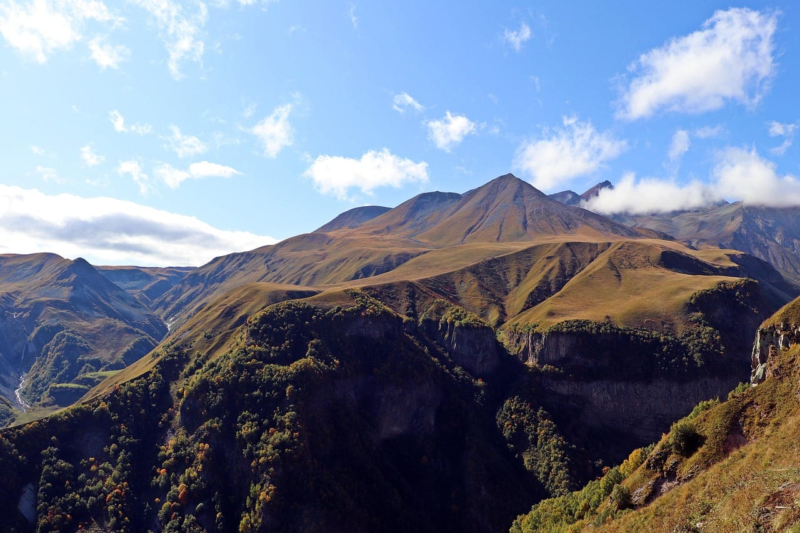
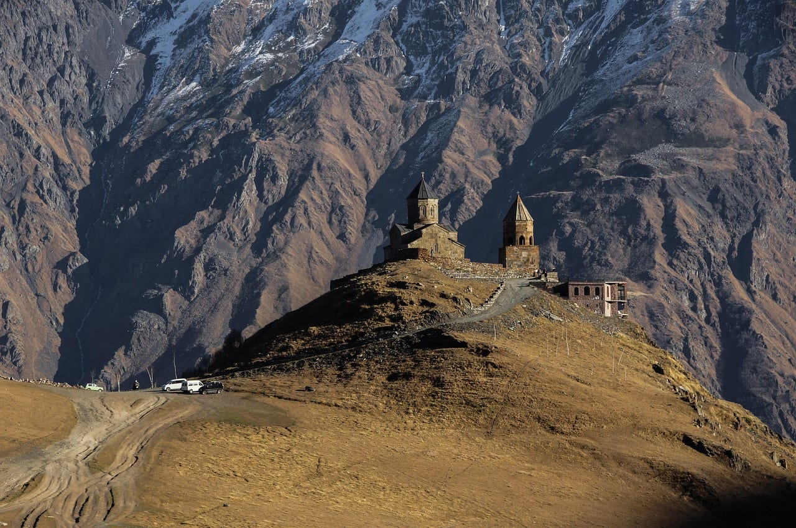
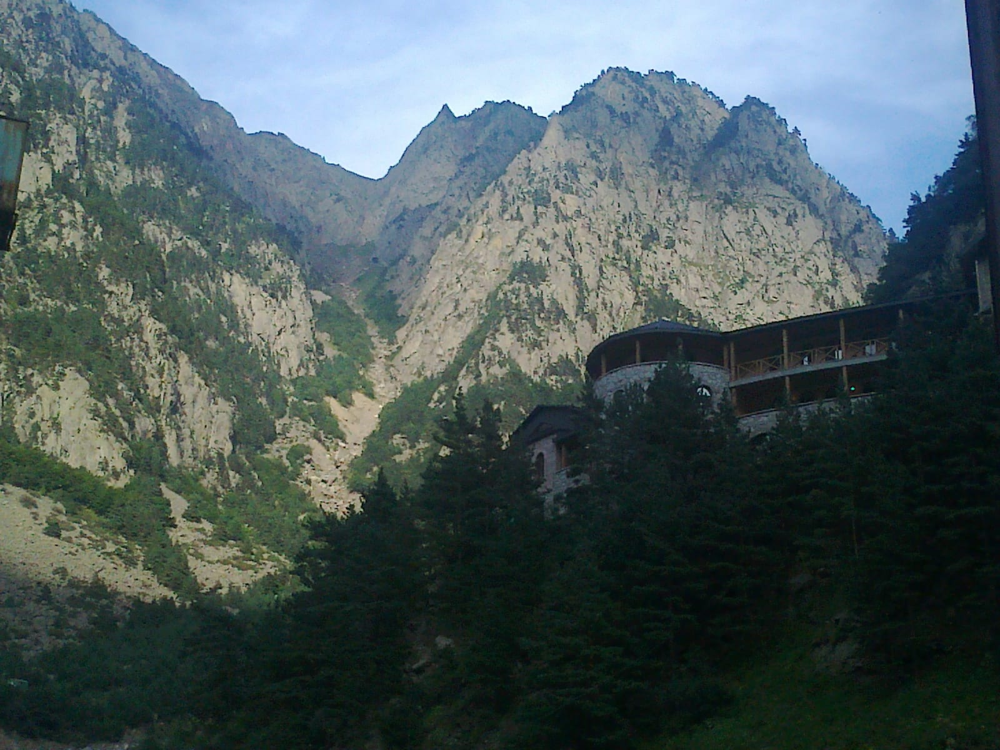
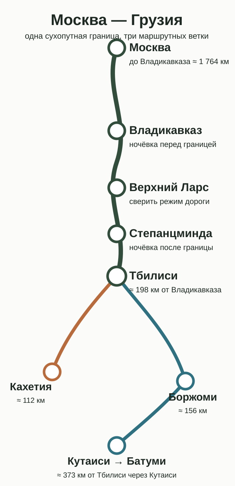
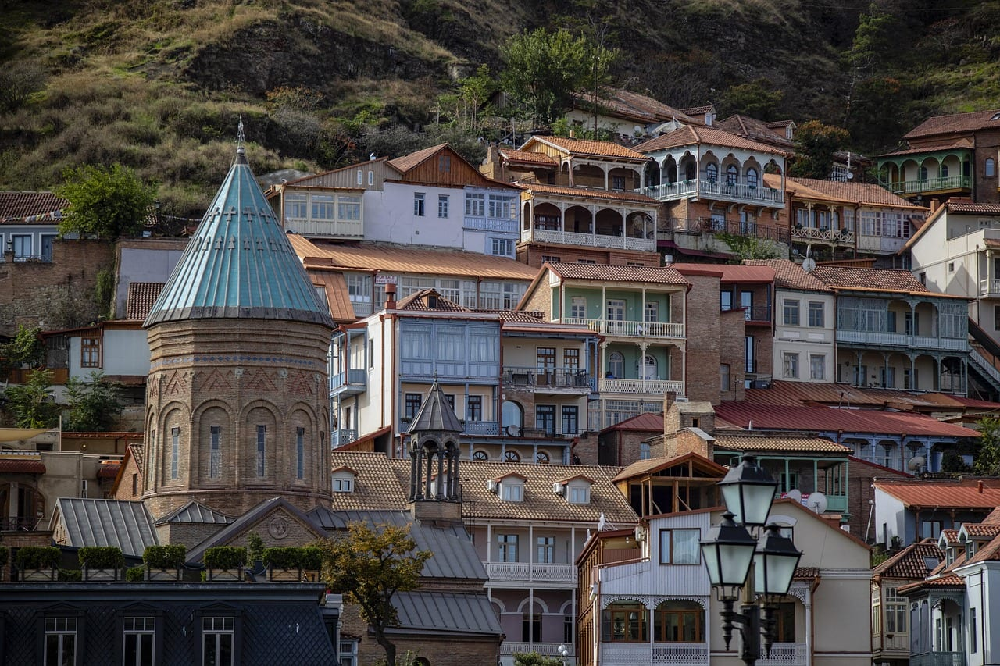
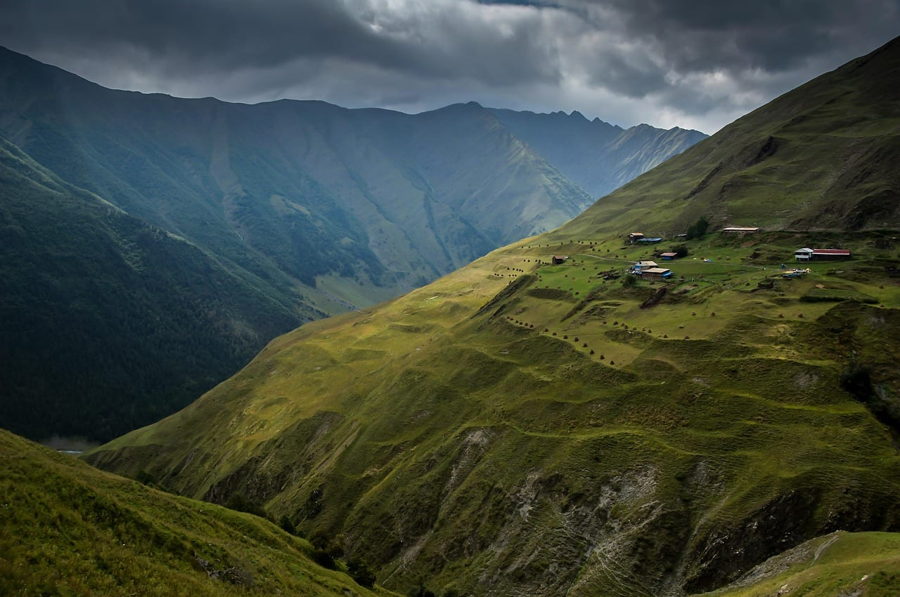
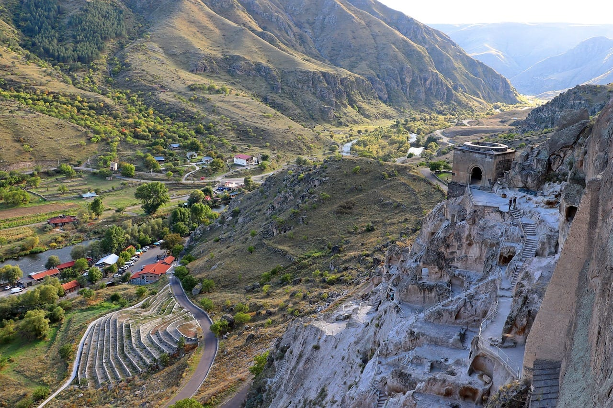
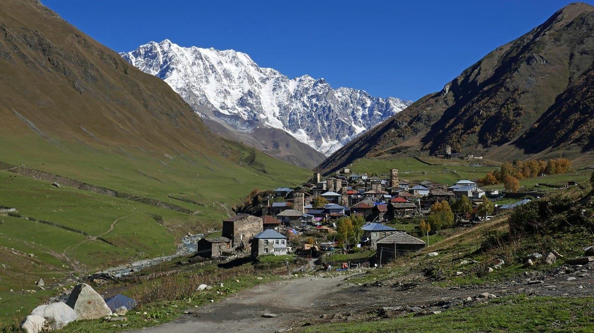
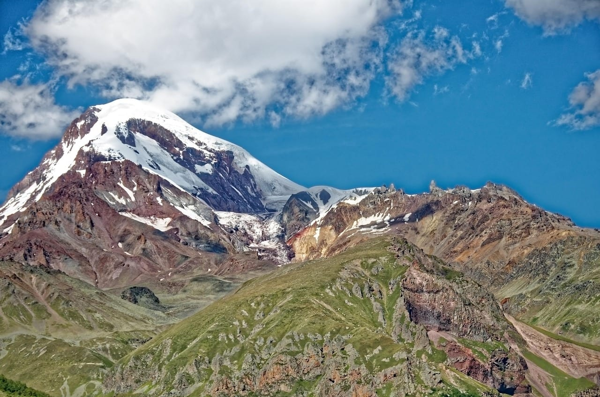

import { airaloCountry, cherehapaCountry, ostrovokCity } from '../../data/affiliate.js';

export const insuranceGeorgia = cherehapaCountry('georgia', 'georgia_car_2026_insurance');
export const hotelTbilisi = ostrovokCity('georgia', 'tbilisi', 'georgia_car_2026_hotel');
export const esimGeorgia = airaloCountry('georgia', 'georgia_car_2026_esim');

Поездку в Грузию на машине часто описывают как длинный перегон до Верхнего Ларса. Это лишь половина задачи. До границы нужно решить, кто вправе вывозить автомобиль, а после неё — не перепутать медицинский полис с автогражданкой, уложиться в 90 дней и выбрать маршрут, который не превращает отпуск в ежедневный переезд.

Личной истории в этом материале нет: доказуемого архива именно такой поездки у редакции нет. Поэтому основу составляют требования Консульского департамента МИД России, Службы доходов Грузии, грузинского Центра обязательного страхования и Департамента автомобильных дорог. Расстояния ниже посчитаны по дорожному графу OpenStreetMap 30 августа 2026 года. Реальная очередь на границе и время на серпантинах в эту модель не входят.

> **Если коротко:** россиянину нужны действующий загранпаспорт, российские права, СТС и два разных полиса: медицинский на сумму от 30 000 лари и грузинская автогражданка на машину. Международные права не требуются. Машина может находиться в Грузии 90 дней. Единственный открытый наземный путь из России — Верхний Ларс — Дариали; предварительная электронная очередь действует для грузовиков, а не для легковых. Москва — Тбилиси — около 1 960 км по дороге. На саму Грузию закладывайте не меньше пяти дней, лучше семь-десять.

## Какие документы нужны для поездки в Грузию на машине?

**Базовый комплект состоит из пяти позиций: загранпаспорт, водительское удостоверение, СТС, медицинская страховка и грузинская автогражданка.** Российский ОСАГО за границей не действует и не заменяет местный полис ответственности.

| документ | что проверить до выезда | частая ошибка |
|---|---|---|
| загранпаспорт | документ действителен, фото ребёнка соответствует возрасту | берут внутренний паспорт |
| российские права | срок действия не истёк, категория совпадает с машиной | оформляют международные права, хотя МИД их не требует |
| СТС | оригинал, VIN и номер читаются | оставляют оригинал дома |
| медицинский полис | вся поездка, от 30 000 лари, английский или грузинский | считают, что полис на машину покрывает людей |
| автогражданка Грузии | номер, категория и даты без ошибок | показывают российский ОСАГО |

Консульский департамент МИД России пишет, что гражданам РФ виза не нужна, а въезд разрешён по действующему загранпаспорту. На той же странице отдельно сказано: национальным российским водительским удостоверением можно пользоваться до года, международные права не нужны. Это снимает два популярных пункта из раздутых списков документов.

Сложнее случай, когда водитель не собственник. Служба доходов Грузии требует документ о законном владении, если это не следует из регистрационного документа. Единой обязательной формы или нотариального удостоверения в опубликованном списке нет. Поэтому берите документ, который подтверждает основание владения: доверенность с правом выезда за границу, договор аренды либо разрешение лизингодателя или компании. Для лизинговой, арендованной и корпоративной машины условия договора важнее общего совета из интернета.

### Если едете с ребёнком или животным

У ребёнка должен быть собственный действующий загранпаспорт. Консульская памятка обращает внимание на соответствие фотографии возрасту: старое фото может стать причиной отказа во въезде. Когда ребёнок едет без родителей, правила выезда из России лучше отдельно сверить на дату поездки; не переносите на этот случай совет для поездки с одним родителем.

Для животного МИД указывает ветеринарный паспорт с отметкой российской ветслужбы о здоровье. Это минимальная официальная формулировка, а не полный ветеринарный маршрут: требования перевозчиков и обратного ввоза в Россию проверяют отдельно.

### Как собрать папку, которую не придётся искать в багажнике

Оригиналы загранпаспортов, прав и СТС держите в салоне, а не под чемоданами. Рядом положите распечатки двух полисов. Электронная форма разрешена, но бумага снимает зависимость от разряженного телефона и мобильной сети. Копии документов храните отдельно от оригиналов; они не заменят документы на контроле, зато помогут восстановить номера и связаться со страховой при потере.

Сделайте один офлайн-каталог в телефоне: полисы, бронь первой ночёвки, контакты владельца машины, номер страховщика и снимки документов. Не отправляйте эту папку в общий чат экипажа без необходимости: паспортные данные и VIN не должны жить в переписке у всех участников поездки.

Даты сверяйте не «на неделю», а по календарю. Если вы въезжаете вечером 3 сентября и выезжаете утром 12-го, оба дня должны попадать в период медицинского полиса. У TPL конец покрытия наступает в 23:59 указанного дня. Срок в 15 дней стоит 30 лари и часто перекрывает обычный отпуск, но выбирать его нужно по фактическим датам, а не по цене.

Перед стартом полезен контрольный вопрос каждому документу: **что именно он доказывает?** Загранпаспорт — личность и право на въезд, СТС — регистрацию машины, права — право управлять, медицинский полис — покрытие человека, TPL — ответственность машины. Если один файл приходится объяснять как замену другому, комплект собран неверно.

## Две страховки: человеку одна, машине другая

**Медицинский полис и автогражданка закрывают разные риски, поэтому нужны оба.** Первый оплачивает лечение туриста, второй — вред жизни, здоровью или имуществу третьих лиц при участии вашей машины.

Постановление правительства Грузии №602 действует с 1 января 2026 года. Полис туриста должен покрывать здоровье и несчастный случай минимум на **30 000 лари**, действовать от въезда до выезда и быть на английском или грузинском языке. Электронная форма разрешена. В русской выдаче встречается разбивка на «5 000 долларов амбулаторно и 30 000 стационарно», но в постановлении её нет: там указан один нижний предел в лари.

Для сравнения вариантов и исключений есть отдельный разбор [страховки в Грузию в 2026 году](/blog/georgia-insurance-2026/). <a href={insuranceGeorgia} class="aff-cta" rel="sponsored">Сравнить медицинские полисы для Грузии</a> проверьте территорию, даты и английскую версию до оплаты.

### Сколько стоит автогражданка

Тариф фиксированный и опубликован самим грузинским Центром обязательного страхования:

| срок | легковой автомобиль |
|---|---:|
| 15 дней | **30 лари** |
| 30 дней | **50 лари** |
| 90 дней | **90 лари** |
| 1 год | **295 лари** |

Полис нужен на весь период движения машины по стране. Его можно купить заранее на [официальном сайте TPL](https://www.tpl.ge/ru/policies) или у агента возле пункта пропуска. Электронный документ начинает действовать после оплаты. Перед подтверждением проверьте регистрационный номер, VIN, категорию и даты: в правилах Центра прямо сказано, что ошибки в идентификаторах могут сделать полис недействительным, а неверно выбранный срок не исправляют возвратом премии.

При ДТП звонят **112**, остаются на месте и ждут патрульную полицию, если пострадавшему не требуется срочная перевозка. Этот порядок записан в условиях TPL. Российский ОСАГО за повреждённую чужую машину в Грузии не заплатит.

## Как проходить Верхний Ларс на легковой машине?

**Слот заранее бронировать не нужно: электронная очередь на Верхнем Ларсе организована для грузового транспорта.** Легковые автомобили едут в живой очереди. Поэтому точное время прохождения нельзя знать даже утром дня выезда.

На российско-грузинской границе действует одна автомобильная связка: МАПП «Верхний Ларс» и грузинский КПП «Дариали». Объехать закрытие через Абхазию или Южную Осетию нельзя. МИД отдельно предупреждает, что въезд в эти территории не со стороны Грузии может привести к ответственности при последующем посещении страны.

К границе имеет смысл подходить так:

1. **Ночуйте до сложного участка.** После 1 760 км от Москвы продолжать в ночь через границу и Крестовый перевал — плохой обмен времени на риск. Владикавказ годится как техническая остановка.
2. **Проверьте грузинскую сторону.** Департамент автомобильных дорог Грузии публикует ограничения по трассе Мцхета — Степанцминда — Ларс на [georoad.ge](https://www.georoad.ge/). В снег и при угрозе лавин участок Гудаури — Коби закрывают полностью либо оставляют только легковой транспорт.
3. **Смотрите российские сообщения.** Оперативную обстановку дают ФТС и Росгранстрой. Не переносите число машин из вчерашнего поста на свой день: очередь меняется быстрее, чем индексируется статья.
4. **Держите запас воды, еды и топлива.** Он нужен не для нормального прохождения, а для задержки. На нейтральной полосе нет смысла рассчитывать на городскую инфраструктуру.
5. **Не планируйте оплаченный ужин в Тбилиси в день границы.** Между Владикавказом и Тбилиси по маршруту около 198 км, но пограничный контроль не входит в расчёт навигатора.

Статус «открыто сейчас» в этой статье намеренно не указан. Дорожный режим — живой факт, который может протухнуть к моменту чтения. Статья объясняет, где его смотреть и как заложить неопределённость, но не заменяет проверку перед выездом.

### Что делать, если дорогу закрыли

Закрытый Ларс не превращает Абхазию или Южную Осетию в запасной проезд. Для легальной автомобильной поездки из России в Грузию сухопутного дублёра нет. Рабочие варианты — ждать официального открытия либо менять транспорт и маршрут целиком. Поиск «объезда для местных» здесь не экономит время, а создаёт пограничный риск.

Если ограничение появилось до Владикавказа, оставайтесь на северной стороне и не поднимайтесь к накопившемуся потоку без необходимости. Если сообщение разрешает только легковые автомобили, сначала убедитесь, что речь идёт о текущей публикации и нужном участке. Старый PDF из поисковой выдачи описывает прошлый режим; на сайте дорожного ведомства важны дата и последняя запись.

Внутри отпускного плана используйте заранее заданное правило сокращения:

- потеряли до одного дня — уберите радиальный выезд из Тбилиси;
- потеряли два дня — исключите Кахетию из недельного плана или Батуми из десятидневного;
- потеряли три дня — оставьте восточную часть страны и не начинайте западный круг;
- граница закрыта без понятного срока — отменяйте первую невозвратную бронь до того, как истечёт бесплатная отмена.

Так решение принимает не усталый водитель в очереди, а заранее собранный маршрут. Самая дорогая ошибка после задержки — пытаться «догнать график» скоростью и ночными перегонами.

## Сколько километров и топлива закладывать?

**Москва — Тбилиси — около 1 960 км в одну сторону, без городских объездов и поездок по Грузии.** Из них примерно 1 764 км приходится на дорогу до Владикавказа и 198 км — на участок через границу до Тбилиси. Это расчёт маршрутизатора, а не хронометраж.

Для топлива удобнее считать не в рублях, а в литрах: цены меняются по стране и дате, а расход своей машины водитель знает.

| поездка | общий пробег | при 8 л/100 км | при 10 л/100 км |
|---|---:|---:|---:|
| Москва — Тбилиси — Москва, без отклонений | ≈3 925 км | ≈314 л | ≈393 л |
| короткий маршрут по Грузии | ≈4 400 км | ≈352 л | ≈440 л |
| западная Грузия и Батуми | ≈4 900 км | ≈392 л | ≈490 л |
| большой круг со Сванетией | ≈5 500 км | ≈440 л | ≈550 л |

Умножьте правую колонку на среднюю цену литра по вашему пути и добавьте резерв на холостой ход, серпантины и город. Такой расчёт честнее «бюджета поездки на машине»: проживание и еда зависят от состава экипажа, а топливо — от измеримых параметров.

Платных дорог в Грузии нет — это подтверждает консульская памятка МИД. Но бесплатная трасса не означает дешёвую поездку: к топливу добавятся два полиса, ночёвка по дороге и парковки. С российскими банковскими картами есть отдельная проблема; варианты наличных и работающих карт разобраны в материале [как платить в Грузии](/blog/pay-georgia-2026/).

## Какой маршрут выбрать на 5, 7, 10 или 14 дней?

**Пять дней хватает только на Тбилиси, Казбеги и один короткий выезд; для западной Грузии нужно от десяти дней.** Дни ниже считаются внутри страны, без двух больших перегонов из Москвы и обратно.

| дней в Грузии | что складывается | машина нужна | честный минус |
|---:|---|---|---|
| 5 | Степанцминда → Тбилиси → Мцхета | да, но в Тбилиси лучше оставить | один погодный сбой съедает часть программы |
| 7 | Степанцминда → Тбилиси → Сигнахи и Телави → Мцхета | да | возвращаться к Ларсу придётся той же дорогой |
| 10 | Степанцминда → Тбилиси → Боржоми и Вардзия → Кутаиси → Батуми | да | длинный возврат с побережья до границы |
| 14 | маршрут на 10 дней + Местия и два запасных дня | да; в горах важнее клиренс, чем полный привод | много серпантинов, Сванетия зависит от погоды |

### Пять дней: Тбилиси без гонки на запад

После границы остановитесь в Степанцминде, затем езжайте в Тбилиси и выделите отдельный день на Мцхету. Машину в столице разумнее поставить у жилья: старые кварталы удобнее проходить пешком, а парковка добавляет задачу без выигрыша во времени.

Это маршрут для первой короткой поездки, а не попытка «увидеть всю Грузию». Его слабое место — отсутствие резерва. Если Ларс закрывается на день, выбирать придётся между Казбеги и Тбилиси.

<a href={hotelTbilisi} class="aff-cta" rel="sponsored">Посмотреть жильё в Тбилиси с парковкой</a> фильтр парковки проверяйте в карточке конкретного объекта.

### Семь дней: добавить Кахетию

К трём точкам короткого маршрута добавьте Сигнахи и Телави. От Тбилиси до Сигнахи по дорожному расчёту около 112 км. Ночёвка в Кахетии снимает лишний обратный перегон и позволяет не выбирать водителя за столом: дегустация и самостоятельное вождение несовместимы.

Полный привод для асфальтового круга Тбилиси — Сигнахи — Телави не нужен. Не подменяйте этим выводом поездку в Тушетию: дорога в Омало — другой уровень покрытия и риска, её не стоит пришивать к недельному маршруту одной строкой.

Недельный расклад без гонки выглядит так: ночь в Степанцминде после границы, две ночи в Тбилиси, ночь в Сигнахи или Телави, ещё одна ночь в Тбилиси либо Мцхете и день резерва перед возвращением. День резерва не обязан пропасть: при открытой дороге он превращается в ещё одну ночь в городе. При задержке на Ларсе он сохраняет обратный билет на работу и не заставляет резать сон.

### Десять дней: Боржоми, Вардзия, Кутаиси и Батуми

Из Тбилиси до Боржоми около 156 км, из Боржоми до Вардзии — 107 км, до Кутаиси от Тбилиси — 217 км, от Кутаиси до Батуми — ещё 156 км. Это не набор однодневных экскурсий из столицы, а последовательный маршрут с ночёвками. Вардзия уводит на юг, поэтому добавляйте её только с ночёвкой в Боржоми или Ахалцихе. В Батуми оставьте хотя бы два полных дня, иначе море станет фотографией между двумя перегонами.

Главный минус виден не по пути на запад, а на обратной дороге: от Батуми до Верхнего Ларса нужно пересечь страну. Разбейте возврат ночёвкой в Кутаиси, Боржоми или Тбилиси. Попытка доехать от моря до Владикавказа одним днём делает время границы ещё одной неизвестной поверх длинного перегона.

Десять дней не позволяют одинаково глубоко увидеть восток, юг и море. Выберите две опоры. Если важнее Вардзия, оставьте на Батуми одну ночь и не добавляйте Кахетию. Если важнее побережье, езжайте из Тбилиси через Кутаиси, а Боржоми и Вардзию перенесите на другую поездку. В таблице перечислены совместимые точки, а не приказ заехать в каждую.

### Четырнадцать дней: Сванетия с запасом

К десятидневному плану можно добавить Местию, но только с двумя резервными днями. Один нужен на погоду и дорогу, второй — чтобы не отнимать время у обратного пути к Ларсу. Для Местии важнее исправные тормоза, шины и клиренс, чем шильдик 4×4; Ушгули и боковые грунтовые дороги требуют отдельной оценки на месте.

У такого круга есть честная цена: сотни километров серпантинов и почти полное отсутствие дней без руля. Если цель — отдых, а не автопробег, уберите Батуми или Сванетию. Две недели не делают Грузию маленькой.

Для четырнадцати дней держите минимум четыре базы вместо ежедневной смены жилья: Степанцминда, Тбилиси, Кутаиси или Боржоми, Местия либо Батуми. Радиальные выезды легче отменить, чем следующую гостиницу в цепочке. Этот принцип особенно важен со своей машиной: багаж не нужно переносить каждый день, а значит, частая смена ночёвок не даёт того выигрыша, ради которого её терпят в поездках на общественном транспорте.

Полный обзор сезонов, регионов и идей для остановок есть в [большом путеводителе по Грузии](/blog/georgia-guide-2026/). Здесь маршрут намеренно собран вокруг ограничений автомобиля и границы.

## Когда ехать: граница важнее средней температуры

**Лучший баланс для автомобильного маршрута — конец мая, июнь и сентябрь; зимой и ранней весной главный риск не холод, а закрытие горной дороги.** Июль и август подходят, но дают пик спроса, жару в Тбилиси и очереди в популярных местах.

| период | что с дорогой и маршрутом | решение |
|---|---|---|
| декабрь — март | снег, лавинная опасность, ограничения Гудаури — Коби | нужен запас 1–2 дня и зимняя подготовка |
| апрель — май | погода меняется быстро, высокогорье ещё не летнее | держать план без Сванетии и Тушетии |
| июнь | длинный световой день, до летнего пика | лучший месяц для первого автопутешествия |
| июль — август | жарко в городах, выше нагрузка на границу | ехать рано, жильё с парковкой брать заранее |
| сентябрь | мягче в Тбилиси, сезон Кахетии | хороший баланс, но дни короче |
| октябрь — ноябрь | запад дождливее, в горах возможен снег | сокращать высокогорную часть |

Ни один сезон не гарантирует открытый Ларс. МИД России прямо пишет, что трасса может закрываться по метеоусловиям. Департамент автомобильных дорог Грузии публикует режим по конкретным участкам: «движение свободно», «запрещено для прицепов» и «запрещено для всех видов транспорта» — это разные статусы, читать нужно весь текст сообщения.

## Подготовка машины: что влияет на маршрут

**Перед поездкой важнее тормоза, охлаждение и шины, чем полный привод.** Основной маршрут до Тбилиси, Кахетии, Боржоми, Кутаиси и Батуми проходит по асфальту. Полный привод не отменяет тормозной путь, перегрев и плохую резину.

Проверьте до старта:

- остаток колодок, состояние дисков и тормозную жидкость — на спусках коробка помогает, но не лечит изношенные тормоза;
- систему охлаждения, ремни и отсутствие течей — летняя жара и медленный подъём дают нагрузку;
- давление, возраст шин и полноразмерную запаску либо рабочий ремкомплект;
- свет, стеклоомыватели и дворники — туман и дождь в горах возникают на одном перегоне;
- домкрат, ключ, буксировочную проушину, компрессор и минимальный набор предохранителей;
- офлайн-карту и зарядку — связь не должна быть единственным способом найти дорогу.

Если нужна связь сразу после границы, <a href={esimGeorgia} class="aff-cta" rel="sponsored">можно заранее проверить eSIM для Грузии</a>. Совместимость телефона и условия пакета смотрите до оплаты; этот вариант не заменяет офлайн-карту.

Отдельный канистровый запас топлива на основной трассе не нужен. Гораздо полезнее не подъезжать к горному участку на лампочке. Заправляйтесь до границы и не откладывайте следующую остановку до удалённой боковой дороги.

## Что проверить утром перед выездом

1. Откройте [georoad.ge](https://www.georoad.ge/) и найдите последнее сообщение по дороге Мцхета — Степанцминда — Ларс.
2. Сверьте российские сообщения ФТС или Росгранстроя по Верхнему Ларсу; цифры очереди старше нескольких часов не считайте прогнозом.
3. Проверьте даты двух страховок и данные машины в полисе TPL.
4. Сохраните офлайн загранпаспорт, СТС, полисы, бронь первой ночёвки и телефон 112.
5. Пересчитайте прибытие без обещания «сегодня точно будем в Тбилиси».

Проверка занимает меньше времени, чем чтение чатов с сотнями сообщений, и отделяет документы от слухов. Чаты полезны как камера происходящего, но правила въезда, тарифы и дорожный режим задают ведомства.

## FAQ

**Можно ли въехать в Грузию на машине по внутреннему паспорту?**

Нет. Гражданину России нужен действующий загранпаспорт. Виза для поездки до года не требуется.

**Нужны ли международные водительские права?**

Нет. Консульский департамент МИД России указывает, что российские национальные права действуют в Грузии до года.

**Сколько машина может находиться в Грузии?**

90 дней. До истечения срока её нужно вывезти либо пройти соответствующие таможенные процедуры.

**Нужна ли доверенность, если машина оформлена не на водителя?**

Грузинская Служба доходов требует доказательство законного владения, если оно не следует из регистрационного документа. Универсальная форма не названа: берите доверенность, договор аренды либо разрешение лизингодателя или компании с правом выезда за границу.

**Можно ли купить автогражданку на границе?**

Да, МИД указывает пункты Центра возле переходов, включая Казбеги. Но онлайн-покупка до выезда позволяет спокойно проверить номер, VIN и даты.

**Нужно ли бронировать электронную очередь Верхнего Ларса?**

Для легковой машины — нет. Система резервирования, о которой сообщают Минтранс и Росгранстрой, относится к грузовому транспорту.

**Сколько ехать от Москвы до Тбилиси?**

По дорожному графу около 1 960 км. Навигатор оценивает движение, но не знает будущую очередь и время контроля, поэтому планируйте как минимум одну ночёвку по пути и не привязывайте день границы к жёсткой брони.

**Нужен ли полный привод?**

Для Тбилиси, Мцхеты, Кахетии, Боржоми, Кутаиси и Батуми — нет. Для боковых высокогорных дорог решение принимают отдельно по покрытию и погоде.

---

*Актуально на 30 августа 2026 года. Это справочный материал, а не юридическая консультация и не прогноз очереди. Перед выездом сверяйте требования на странице [Консульского департамента МИД России](https://www.kdmid.ru/docs/georgia/information-about-the-country/), режим дороги на [georoad.ge](https://www.georoad.ge/) и данные полиса на [tpl.ge](https://www.tpl.ge/ru/policies).*
