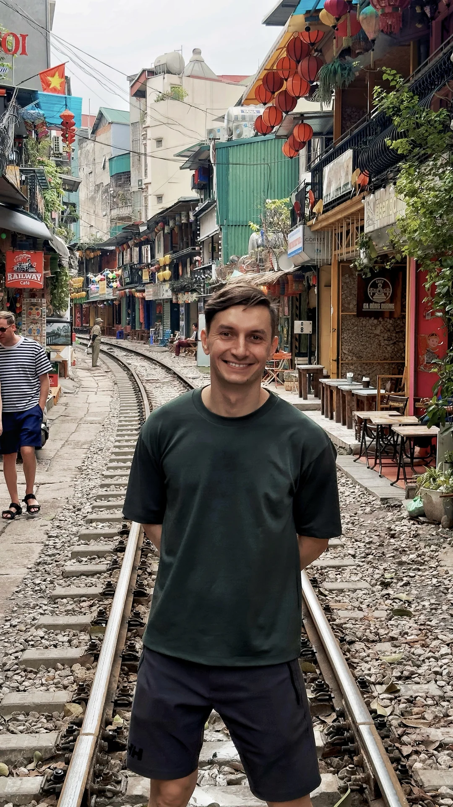
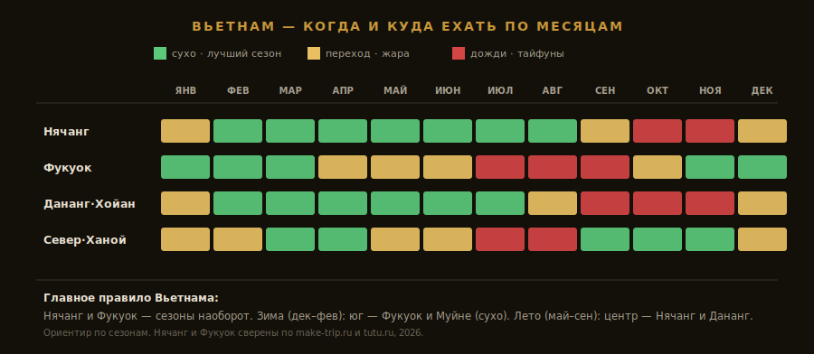

import FlightRoutes from '../../components/post/FlightRoutes.astro';
import PricingCards from '../../components/post/PricingCards.astro';
import AffiliateNote from '../../components/post/AffiliateNote.astro';

Вьетнам — это две разные страны под одним флагом, и большинство туристов видит только одну. С юга летят за пляжем: Нячанг, Фукуок, шезлонг, $1 за тарелку супа. А есть север — Ханой, где поезд проходит в метре от твоего кофе, рисовые карсты Ниньбиня и деревни, где сушат благовония красными полями. Я был на севере и попал именно в этот, второй Вьетнам — он ниже, с фотографиями. Но начну с того, за чем сюда едут 9 из 10 россиян: с пляжного юга, цен и главного вопроса — **Нячанг или Фукуок**.

> **Если коротко:** россиянам виза **не нужна до 45 дней** (безвиз с 15.08.2023, [МИД/посольство](https://www.aviasales.ru/psgr/article/vietnam-entry)); дольше — **e-Visa на 90 дней, $25**. Прямой **Москва — Нячанг (Камрань) ~9 часов от 24 000 ₽** (Аэрофлот, Red Wings, Azur Air). Главное правило: **Нячанг сухой летом (фев–сен), Фукуок — зимой (ноя–мар), сезоны наоборот.** Бюджет 14 дней без перелёта — от **$550** (эконом) до **$2400** (комфорт). 60% россиян едут в Нячанг, четверть — на Фукуок.

<AffiliateNote />

> **Когда лучше ехать:** [таблица сезонов](/seasons/) — для Вьетнама нет одного ответа, всё зависит от курорта (разбор ниже).

По данным [АТОР](https://www.atorus.ru/article/vetnam-v-2026-godu-kak-vybrat-kurort-i-kak-ekhat-s-maksimalnoy-vygodoy-66338), в 2026 году Вьетнам — одно из самых быстрорастущих пляжных направлений у россиян: прямые рейсы из 18 городов, безвиз на 45 дней и цены ниже Таиланда. Но именно из-за муссонов «прилететь в любой месяц» не получится — об этом дальше подробно.

---

## Нужна ли виза во Вьетнам россиянам в 2026?

**Нет, если поездка до 45 дней.** С 15 августа 2023 года граждане России въезжают во Вьетнам **без визы на срок до 45 дней** — для туризма, транзита, деловых поездок, неважно. В паспорт ставят штамп с датой, до которой нужно выехать. Просрочка — штраф за каждый лишний день на выезде.

### Что нужно на границе

* **Загранпаспорт** со сроком действия **минимум 6 месяцев** на момент въезда
* **Обратный билет** или билет в третью страну (проверяют не всегда, но формально требуется)
* Адрес первого отеля для миграционной карты

### Если едете дольше 45 дней — e-Visa

Электронная виза выдаётся на **90 дней**, однократная или многократная. Стоимость для россиян — **$25 за однократную, $50 за мультивизу** ([иммиграционный портал Вьетнама](https://evisa.xuatnhapcanh.gov.vn/)). Оформляется онлайн за **3–5 рабочих дней**, поля заполняются на английском. **Важно:** визовый сбор принимают только картами Visa/Mastercard **не российских** банков — заранее найдите рабочую карту или попросите помочь знакомых.

### Новое: Фукуок с 1 июня 2026

С **1 июня 2026** все туристы, прилетающие на остров **Фукуок**, обязаны заранее получить **QR-код** через государственный портал предварительной информации (PAI) — заполнить онлайн-форму **не ранее чем за 72 часа** до прибытия ([Tourdom](https://www.tourdom.ru/news/vo-vetname-menyayut-pravila-vyezda-turistov-na-ostrov-fukuok.html)). Это не виза и не плата, но без QR на регистрацию могут не пустить. Полный разбор статусов и документов — на странице [визы во Вьетнам](/visa/vietnam/).

---

## Как добраться до Вьетнама из Москвы в 2026?

**Прямые рейсы есть, и их много.** На главный курорт — Нячанг (аэропорт Камрань, CXR) — летают Аэрофлот, Red Wings и Azur Air. С марта 2026 Аэрофлот увеличил частоту из Шереметьево в Камрань до **12 рейсов в неделю**. Время в воздухе — **около 9–10 часов**. На Фукуок (PQC) прямые рейсы в основном **сезонные зимние** и чаще в составе турпакета.

<FlightRoutes routes={[
 {
 from: 'Москва', to: 'Нячанг (Камрань, прямой)',
 flights: [
 { airline: 'Аэрофлот / Red Wings / Azur Air', code: 'прямой, A330/B777', duration: '~9–10 ч', priceFrom: '24 000–45 000 ₽ в одну сторону', priceUrl: 'https://aviasales.tpk.mx/JCSPlC17?erid=2Vtzqxkn4LF&u=https%3A%2F%2Fwww.aviasales.ru%2F%3Forigin_iata%3DMOW%26destination_iata%3DCXR' },
 ]
 },
 {
 from: 'Москва', to: 'Нячанг / Ханой / Хошимин (регулярка туда-обратно)',
 flights: [
 { airline: 'Аэрофлот регулярный', code: 'прямой', duration: '~9–10 ч', priceFrom: '75 000–100 000 ₽' },
 ]
 },
 {
 from: 'Москва', to: 'Фукуок (PQC)',
 flights: [
 { airline: 'Чартеры (зимний сезон)', code: 'прямой/в туре', duration: '~10–11 ч', priceFrom: 'от 120 000 ₽ (часто в пакете тура)' },
 ]
 },
]} caption="Москва → Вьетнам — рейсы в 2026" />

Самый дешёвый способ попасть во Вьетнам зимой — **готовый тур с чартером** (об этом отдельный раздел ниже). Если же собираете поездку сами, цены на прямые регулярные билеты удобно мониторить заранее — <a href="https://aviasales.tpk.mx/JCSPlC17?erid=2Vtzqxkn4LF&u=https%3A%2F%2Fwww.aviasales.ru%2F%3Forigin_iata%3DMOW%26destination_iata%3DCXR" class="aff-cta" rel="sponsored">Найти билет Москва — Нячанг</a>: сравнивает все авиакомпании сразу, режим «гибкие даты» показывает разницу до 30% при сдвиге вылета на 2–3 дня, cookie 30 дней.

От аэропорта Камрань до Нячанга — **35 км**, такси или трансфер ~30–40 минут. В городе удобнее всего приложение **Grab** (такси и байки), официальные такси — Mai Linh и Vinasun (с жёлтым/зелёным логотипом, по счётчику).

---

## Нячанг или Фукуок — куда и в каком месяце ехать

Это **главное решение** поездки во Вьетнам, и оно сложнее, чем на Бали или в Турции. Причина — муссоны бьют по побережью **в разное время**: когда на одном курорте сезон дождей, на другом — пик солнца.

* **Нячанг** (центр-юг): сухо и солнечно **с февраля по сентябрь**, лучшие месяцы — март–май и сентябрь. Сезон дождей — **октябрь–январь**, пик ливней в октябре–ноябре.
* **Фукуок** (юг, остров в Сиамском заливе): зеркальная картина. Сухой сезон — **ноябрь–март** (самый стабильный февраль), сезон дождей — **июль–сентябрь**.
* **Дананг и Хойан** (центр): похожи на Нячанг, но осенью добавляются **тайфуны** (октябрь–ноябрь) — рисковать не стоит.

Отсюда простое правило: **зимой (декабрь–февраль) — на юг, на Фукуок или в Муйне; летом (май–сентябрь) — в центр, в Нячанг или Дананг.** Новогодние праздники в Нячанге — частая ошибка: это разгар дождей, ветра и волн. Подробный разбор обоих курортов по пляжам, отелям и развлечениям — в отдельном гиде [Нячанг или Фукуок 2026](/blog/nyachang-fukuok-2026/).

---

## Курорты Вьетнама — какой выбрать

* **Нячанг** — главный пляжный курорт, 60% российского потока. Длинная городская набережная, острова с дайвингом, грязевые источники, развитая русскоязычная инфраструктура. Дешевле всех. Минус — это город, а не уединение.
* **Фукуок** — остров на юге, четверть потока. Чище, спокойнее, дороже, лучшие закаты и сервис. Сюда едут за тишиной и хорошими отелями.
* **Муйне (Фантьет)** — деревня кайтсёрфинга и красных дюн в 4 часах от Хошимина. Ветер с ноября по март, тусовка сёрферов, минимум «пакетного» туризма.
* **Дананг + Хойан** — современный город с пляжем Мишель + соседний старинный Хойан (ЮНЕСКО) с фонарями и портновскими мастерскими. Лучший выбор «пляж + культура».
* **Хошимин (Сайгон)** — мегаполис юга: небоскрёбы, уличная еда, тоннели Кучи, ворота в дельту Меконга. База для маршрутов, не для пляжа.
* **Ханой + север** — столица и культурное сердце страны: Старый квартал, Train Street, рядом Ниньбинь и бухта Халонг. Не про пляж — про Вьетнам «настоящий» (мой раздел ниже).

---

## Сколько стоит поездка во Вьетнам в 2026?

**14 дней на одного без перелёта — от $550 (эконом) до $2400 (комфорт).** Перелёт из Москвы добавляет 50 000–100 000 ₽ туда-обратно. Вьетнам стабильно дешевле Таиланда и заметно дешевле Бали по еде и жилью.

<PricingCards tiers={[
 {
 tier: 'Эконом',
 emoji: '',
 price: '$550–950',
 priceNote: '14 дней, 1 чел.',
 features: [
 'Гестхаус/3★ у пляжа от 900 ₽/ночь',
 'Уличная еда и кафе ($2–4 за блюдо)',
 'Байк в аренду $5–8/день',
 'Нячанг в сухой сезон',
 ],
 },
 {
 tier: 'Комфорт',
 emoji: '',
 price: '$1400–2400',
 priceNote: '14 дней, 1 чел.',
 featured: true,
 badge: 'Оптимум',
 features: [
 '4★ у моря ~$30/ночь на двоих',
 'Рестораны + морепродукты',
 'Экскурсии (острова, дайвинг)',
 'Такси/Grab вместо байка',
 ],
 },
 {
 tier: 'Премиум',
 emoji: '',
 price: '$3500+',
 priceNote: '14 дней, 1 чел.',
 features: [
 '5★ резорт на Фукуоке',
 'Спа, приватные туры',
 'Бизнес-класс перелёт',
 'Вилла с бассейном',
 ],
 },
]} />

Жильё россиянам удобнее всего бронировать — <a href="https://ostrovok.tpk.mx/xtyTcUcY?erid=2VtzqvE1cv3" class="aff-cta" rel="sponsored">Забронировать отель во Вьетнаме</a>: Ostrovok принимает карты МИР и российских банков, цены те же что у Booking, который для россиян не работает с 2022. Точный расчёт под ваши даты — в [калькуляторе бюджета](/calculator/).

---

## Тур или самостоятельно — что выгоднее во Вьетнаме

Это тот случай, когда **готовый тур часто дешевле самостоятельной сборки** — и в этом Вьетнам отличается от Бали. Причина — чартеры: туроператоры выкупают борта и продают пакет «перелёт + отель + трансфер» зачастую дешевле, чем стоит один билет на регулярный рейс. По данным [АТОР](https://www.atorus.ru/article/vetnam-v-2026-godu-kak-vybrat-kurort-i-kak-ekhat-s-maksimalnoy-vygodoy-66338), отдых в Нячанге на двоих с прямым вылетом и 10 ночами стартует **от 210 000 ₽**, на Фукуоке — **от 285 000 ₽**.

**Когда брать тур:** зимний Фукуок, новогодние даты, поездка на 7–10 дней «прилетел-полежал-улетел», семья с детьми. **Когда лучше сам:** длинный трип с переездами (юг + центр + север), бэкпекинг, гибкие даты.

Сравнить пакеты с прямым чартером удобно — <a href="https://travelata.tpk.mx/Do2A3cgV?erid=2VtzqufPtiT" class="aff-cta" rel="sponsored">Подобрать тур во Вьетнам</a>: Travelata собирает предложения всех туроператоров, оплата картой МИР, фильтр по питанию и линии пляжа. В высокий сезон пакет часто выходит дешевле раздельной брони билета и отеля.

---

## Вьетнамская кухня — что есть и сколько стоит

Еда — отдельная причина лететь во Вьетнам, и она почти бесплатна по меркам пляжного отдыха. Уличная тарелка — **$1,5–3**, ресторан с видом — $8–15.

* **Фо (Phở)** — рисовая лапша в наваристом бульоне с говядиной или курицей. Национальное блюдо, едят на завтрак. $2–3
* **Бань-ми (Bánh mì)** — багет с паштетом, мясом, овощами и кинзой, наследие французской колонизации. Лучший стрит-фуд на бегу, $1,5
* **Вьетнамский кофе (cà phê)** — крепкий фин-кофе со сгущёнкой, со льдом в жару. В Ханое попробуйте **эг-кофе** (с взбитым желтком) — местная фишка
* **Нэм (спринг-роллы)** — свежие или жареные роллы из рисовой бумаги с креветкой и зеленью
* **Морепродукты** — на Нячанге и Фукуоке дёшевы: краб, лобстер, гребешки на углях за треть европейской цены

Главное правило желудка в тропиках то же, что на Бали: **первые дни — бутилированная вода, без льда в сомнительных местах**, и аптечка с собой.

---

## Северный Вьетнам — не только пляж

Я был именно на севере, и это совсем другой Вьетнам — без шезлонгов, зато с тем, ради чего стоит уехать с пляжа хотя бы на пару дней.

* **Train Street в Ханое** — узкая железная дорога, зажатая между домами-кафе в Старом квартале. Дважды в день по ней проходит настоящий поезд буквально в метре от столиков. Место культовое и фотогеничное, но **опасное**: заходить можно только в «окна» между поездами, расписание знают в кафе, садиться на рельсы без присмотра нельзя.
* **Деревня благовоний Куангфукау (Quảng Phú Cầu)** — в ~35 км от Ханоя. Здесь делают благовония и сушат их во дворах гигантскими красными «букетами». Одна из самых ярких фотолокаций Вьетнама; местные пускают за небольшую плату и дают конический нон-ла для кадра.
* **Ниньбинь** — карстовые горы посреди рисовых полей, лодочные маршруты Чанган и Тамкок. Его называют «сухопутный Халонг»; объект ЮНЕСКО, на день из Ханоя. Тише и дешевле морской бухты Халонг.

Если летите на пляжный юг и есть лишние 2–3 дня — стыковка через Ханой с вылазкой в Ниньбинь и Куангфукау превратит «полежать у моря» в настоящую поездку по стране.

---

## Маршрут по Вьетнаму на 10–14 дней

Вьетнам вытянут на 1650 км с севера на юг, поэтому «увидеть всё за неделю» не выйдет — придётся выбирать. Выручают внутренние лоукостеры **VietJet** и **Bamboo Airways**: перелёт Нячанг — Ханой или Хошимин — Дананг стоит **$30–50** и занимает 1,5–2 часа, что дешевле и быстрее поездов.

* **7 дней — один курорт.** Нячанг или Фукуок по сезону + 1–2 вылазки (острова, дайвинг, водопады). Формат «прилетел-полежал», под который и берут туры.
* **10 дней — пляж + культура.** База на побережье + 2–3 дня в связке **Дананг + Хойан** (старый город ЮНЕСКО с фонарями) или перелёт в **Хошимин** с дельтой Меконга.
* **14 дней — через всю страну.** Юг (пляж) → перелёт на север → **Ханой** (Старый квартал, Train Street) → **Ниньбинь** (карсты и лодки) → при желании круиз по бухте **Халонг**. Это и есть «настоящий» Вьетнам, ради которого стоит уехать с шезлонга.

Главное правило логистики: **не пытайтесь ехать между регионами на автобусах ради экономии** — потеряете дни в дороге. Внутренний перелёт за $40 окупает себя сэкономленным временем отпуска.

---

## Деньги, карты и связь во Вьетнаме

### Деньги в 2026

* **Валюта** — вьетнамский донг (VND). Курс на 2026 — примерно **1 USD ≈ 25 000 VND**, цены измеряются десятками и сотнями тысяч (привыкаешь за день)
* **Карты российских банков (Visa/MC/МИР) не работают** напрямую — как почти везде за рубежом
* **Что работает:** карты **UnionPay** некоторых банков (проверять перед вылетом, лимиты есть), наличные **доллары** на обмен в банках и ювелирных лавках, P2P-обмен
* **Виртуальная карта USD/EUR** иностранного эмитента — выпускается за пару минут, пополняется по СБП, работает онлайн (e-Visa, Airalo, бронь). <a href="https://platipomiru.com/?utm_source=traveltribe&utm_medium=cpa" class="aff-cta" rel="sponsored">Выпустить виртуальную карту</a>. Полный разбор способов — [как платить за границей россиянам 2026](/blog/pay-abroad-2026/)
* Меняйте доллары крупными купюрами в банках, а не у пляжа — на мелких обменниках хуже курс

### Связь — eSIM или местная SIM

Локальные операторы **Viettel** и **Vinaphone** дают 30+ ГБ за $5–10 на месяц, продаются в аэропорту и магазинах с регистрацией по паспорту. Viettel ловит лучше всех вне курортов. Чтобы выйти в сеть сразу по прилёте, удобнее eSIM: <a href="https://airalo.pxf.io/c/1209822/1310283/15608?erid=2VtzqxRWDfm&sharedID=546042_&u=https%3A%2F%2Fairalo.com%2Fru" class="aff-cta" rel="sponsored">Купить eSIM Airalo от $5</a> — активируется до вылета, интернет работает с момента посадки.

### Страховка

Тропики, аренда байков и морские активности — без полиса медицина выходит в копейку. <a href="https://cherehapa.tpk.mx/GmVWjhCN?erid=2VtzquZTwb5" class="aff-cta" rel="sponsored">Оформить страховку для Вьетнама</a> — Cherehapa подбирает полис с активным отдыхом (дайвинг, мотобайк) от ~1500 ₽ за 2 недели.

---

## Минусы Вьетнама — что не пишут в брошюрах

* **Муссоны и тайфуны.** Главная ловушка: прилететь не в тот сезон не в тот регион. Центральный Вьетнам осенью — зона тайфунов, проверяйте курорт по месяцу (таблица выше)
* **Трафик и скутеры.** Поток мопедов в Ханое и Хошимине переходит дорогу «методом веры» — идти медленно и предсказуемо. Аренда байка новичку без опыта — частый путь в больницу
* **Разводы на цене.** Такси «мимо счётчика», завышенный курс обмена, цена «для иностранца» на рынках. Лечится приложением Grab, оплатой по ценнику и торгом
* **Языковой барьер.** Вне курортов и отелей по-английски говорят слабо, выручает Google Translate с камерой
* **Бытовые отравления.** Непривычная вода и еда в первые дни — аптечка обязательна
* **Нячанг — это город.** Кто едет за «диким пляжем», разочаровывается: набережная, отели, толпа. За уединением — на Фукуок или Кондао

---

## FAQ — что чаще всего спрашивают перед Вьетнамом

### Нужна ли виза во Вьетнам россиянам в 2026?

**Нет, до 45 дней — безвиз** (с 15 августа 2023). Нужен загранпаспорт со сроком от 6 месяцев и обратный билет. Дольше 45 дней — электронная виза e-Visa на 90 дней, $25.

### Сколько лететь до Вьетнама из Москвы?

**Прямой рейс Москва — Нячанг (Камрань) около 9–10 часов** на Аэрофлоте, Red Wings или Azur Air. На Фукуок — около 10–11 часов, чаще зимними чартерами.

### Нячанг или Фукуок — что выбрать?

Зависит от сезона: **Нячанг — с февраля по сентябрь, Фукуок — с ноября по март** (сезоны противоположны). Нячанг дешевле и оживлённее, Фукуок тише и дороже. Подробно — в [отдельном гиде](/blog/nyachang-fukuok-2026/).

### Когда лучше ехать во Вьетнам?

Нет универсального месяца. Зимой летят на юг (Фукуок, Муйне), летом — в центр (Нячанг, Дананг). Октябрь–ноябрь в центральном Вьетнаме — сезон тайфунов, лучше избегать.

### Сколько денег брать во Вьетнам?

Бюджетная поездка на 14 дней — от $550 без перелёта, комфортная — $1400–2400. Перелёт туда-обратно 50 000–100 000 ₽. Вьетнам дешевле Таиланда и Бали.

### Работают ли карты МИР во Вьетнаме?

Нет, российские Visa/MC/МИР напрямую не принимают. Выручают наличные доллары на обмен, UnionPay некоторых банков и виртуальные карты иностранных эмитентов.

### Можно ли ехать во Вьетнам с детьми?

Да, Нячанг и Фукуок подходят: спокойное море в сухой сезон, аквапарки (VinWonders), много русскоязычных. Главное — выбрать курорт по сезону и беречь от солнца и непривычной еды.

### Что обязательно попробовать из еды?

Фо (суп с лапшой), бань-ми (багет-сэндвич), вьетнамский кофе со сгущёнкой, в Ханое — эг-кофе, на побережье — морепродукты на углях. Уличная тарелка — $1,5–3.

### Безопасно ли во Вьетнаме?

Уровень преступности низкий, насилие против туристов — редкость. Реальные риски бытовые: трафик и скутеры, мелкие разводы на цене, отравления и тайфуны в сезон. Страховка и Grab закрывают большинство сценариев.

---

## Что делать дальше

* Сверьтесь с [таблицей сезонов](/seasons/) — точное окно под ваш месяц
* Выбираете курорт — читайте [Нячанг или Фукуок 2026](/blog/nyachang-fukuok-2026/) с разбором пляжей и отелей
* Детали по статусам и документам — [виза во Вьетнам](/visa/vietnam/)
* Посчитайте поездку в [калькуляторе](/calculator/) с учётом курса донга
* <a href="https://aviasales.tpk.mx/JCSPlC17?erid=2Vtzqxkn4LF&u=https%3A%2F%2Fwww.aviasales.ru%2F%3Forigin_iata%3DMOW%26destination_iata%3DCXR" class="aff-cta" rel="sponsored">Найти билет Москва — Нячанг</a> — прямой от 24 000 ₽
* <a href="https://travelata.tpk.mx/Do2A3cgV?erid=2VtzqufPtiT" class="aff-cta" rel="sponsored">Подобрать тур во Вьетнам</a> — чартер часто дешевле раздельной брони
* <a href="https://cherehapa.tpk.mx/GmVWjhCN?erid=2VtzquZTwb5" class="aff-cta" rel="sponsored">Оформить страховку</a> — с активным отдыхом для тропиков

Думаете между Азией и островом — сравните с [гайдом по Бали](/blog/bali-guide-2026/). А за нестандартными направлениями и свежими отзывами по сезонам заходите в [@traveltriberu](https://t.me/traveltriberu).

---

*Актуально на: 6 июня 2026. Источники: [Aviasales — правила въезда](https://www.aviasales.ru/psgr/article/vietnam-entry), [Tutu — виза](https://www.tutu.ru/geo/vietnam/article/visa/), [АТОР](https://www.atorus.ru/article/vetnam-v-2026-godu-kak-vybrat-kurort-i-kak-ekhat-s-maksimalnoy-vygodoy-66338), [make-trip — погода Нячанг/Фукуок](https://make-trip.ru/vietnam/nyachang-pogoda), [Tourdom — Фукуок QR](https://www.tourdom.ru/news/vo-vetname-menyayut-pravila-vyezda-turistov-na-ostrov-fukuok.html). Личные фото севера — из поездки автора.*
